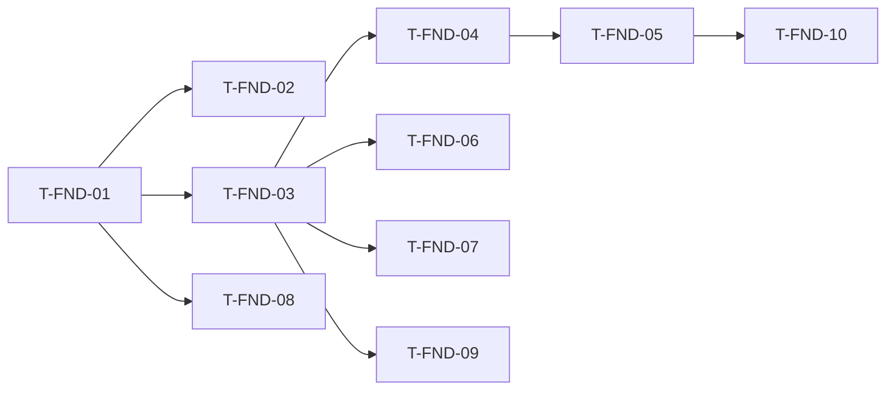

# Foundation: Tasks

## 1. Summary

Ten tasks that turn an empty folder into a buildable, testable, debuggable UE5 C++ project with the shared contracts from [technical-plan.md](technical-plan.md). All tasks are Phase F. `T-FND-01` to `T-FND-07` block every gameplay task.

## 2. Task Overview

| ID | Task | Type | Phase | Priority | Dependencies | Status |
|---|---|---|---|---|---|---|
| T-FND-01 | Create UE5 C++ project, pin engine version, name module | BUILD | F | P0-blocker | none | Done |
| T-FND-02 | Git + LFS + `.gitignore` | BUILD | F | P0-blocker | T-FND-01 | Done |
| T-FND-03 | Domain folders, log categories, Build.cs dependencies | BUILD | F | P0-blocker | T-FND-01 | Done |
| T-FND-04 | Gameplay Tag taxonomy (native tags) | GAMEPLAY | F | P0-blocker | T-FND-03 | Done |
| T-FND-05 | Shared combat contract skeletons + team interface | GAMEPLAY | F | P0-blocker | T-FND-04 | Done |
| T-FND-06 | Enhanced Input base + `AHeroPlayerController` skeleton + context switching | GAMEPLAY | F | P0-blocker | T-FND-03 | Review |
| T-FND-07 | `UGameTuningSettings` + Primary Asset Types + `IsDataValid` pattern | TOOLS | F | P0-blocker | T-FND-03 | Review |
| T-FND-08 | Reference PC spec + packaged Development build smoke + profiling checklist | BUILD | F | High | T-FND-01 | Review |
| T-FND-09 | Debug tooling: CVars, cheat manager, Visual Logger convention | TOOLS | F | High | T-FND-03 | Review |
| T-FND-10 | Automation test harness: Spec + Functional Test map + CLI runner | QA | F | High | T-FND-05 | Review |

## 3. Detailed Tasks

## Phase F

### T-FND-01 — Create UE5 C++ project, pin engine version, name module
**Type** BUILD · **Phase** F

**Objective** A blank C++ third-person-capable project that builds.

**Related Requirements** R-FND-01, R-FND-02, AC-FND-01, Q-15

**Dependencies** none

**Implementation Notes**
- [x] Answer Q-15: project name, module name `<Game>`, UE 5.x version. Record them in `00-foundation/technical-plan.md` §1 and `main_implement_plan.md` §2.
- [x] Create from the Blank C++ template (not the Third Person template, to avoid template code; copy only needed input/anim assets later).
- [x] Set `EngineAssociation` in `.uproject` to the pinned version.
- [x] Default maps: an empty `L_Boot` in `Content/<Game>/Maps/`.
- [x] Fill `AGENTS.md`: §1 engine/module line and §7 "Build editor target" command (the exact command you ran). Decide where Win64 builds are made if development stays on macOS.

**Expected Files / Assets** `<Game>.uproject`, `Source/<Game>/<Game>.Build.cs`, `Source/<Game>.Target.cs`, `Source/<Game>Editor.Target.cs`, `Config/DefaultEngine.ini`, `Config/DefaultGame.ini`

**Test Case** Clean build of `<Game>Editor` Development from CLI (`Build.sh`/`Build.bat`) → exit code 0.

**Acceptance Criteria**
- [x] Editor and game targets build with zero errors.
- [x] Project opens in the editor at the pinned engine version.

**Verification** CLI build log; open editor.

---

### T-FND-02 — Git + LFS + `.gitignore`
**Type** BUILD · **Phase** F

**Objective** Version control that keeps binaries in LFS and generated folders out.

**Related Requirements** R-FND-09, AC-FND-02, D-18

**Dependencies** T-FND-01

**Implementation Notes**
- [x] `git init`, `git lfs install`.
- [x] `.gitattributes`: LFS for `*.uasset *.umap *.fbx *.png *.tga *.exr *.wav *.ogg *.psd *.blend`.
- [x] `.gitignore`: `Binaries/ Intermediate/ Saved/ DerivedDataCache/ .vs/ .idea/ *.sln *.xcworkspace .codegraph/`.
- [x] Commit GDD, `ai/`, `.claude/`, `AGENTS.md`, `CLAUDE.md` with the project. Commit and branch format: `AGENTS.md` §8.
- [x] Create branch `main`; work on feature branches per task group.

**Expected Files / Assets** `.gitignore`, `.gitattributes`

**Test Case** Clone into a new folder → `git lfs pull` → build → open editor → no missing asset warnings.

**Acceptance Criteria**
- [x] `git status` clean after a build (no generated files tracked). *(fresh clone + `git lfs pull` (21 LFS files) + editor build + `L_Boot` load with no missing assets, 2026-10-04)*
- [x] `git lfs ls-files` lists `.uasset`/`.umap` files.

**Verification** Fresh-clone build.

---

### T-FND-03 — Domain folders, log categories, Build.cs dependencies
**Type** BUILD · **Phase** F

**Objective** Source/Content layout from technical-plan §4–§5 so ownership is obvious from day one.

**Related Requirements** R-FND-02, D-01, D-02

**Dependencies** T-FND-01

**Implementation Notes**
- [x] Create `Source/<Game>/{Core, Combat, Hero, Player, Army, Enemy, Structures, Navigation, Zones, Encounter, Run, Perks, Boss, Feedback, UI, Tests}` (empty folders get a placeholder `.h` only when the first class lands; do not commit empty dirs).
- [x] Declare log categories in `Core/GameLog.h`: `LogGameCombat, LogGameAI, LogGameArmy, LogGameNav, LogGameEncounter, LogGameRun, LogGameUI`. Added `LogGamePlayer` for player-mode changes (T-FND-06).
- [x] Add module deps from technical-plan §3 to `<Game>.Build.cs`.
- [x] Create Content folders from technical-plan §5.

**Expected Files / Assets** `Source/<Game>/Core/GameLog.h/.cpp`, Content folder tree

**Test Case** Build; `UE_LOG(LogGameCombat, Log, ...)` from a test actor appears in Output Log.

**Acceptance Criteria**
- [x] Build succeeds with the new dependencies.
- [x] No `Managers/`, `Utils/`, `Misc/` folders exist.

**Verification** Build + PIE log line.

---

### T-FND-04 — Gameplay Tag taxonomy (native tags)
**Type** GAMEPLAY · **Phase** F

**Objective** One central tag definition with the roots from master plan §8.

**Related Requirements** AC-FND-03, D-04, D-06

**Dependencies** T-FND-03

**Implementation Notes**
- [x] Use `UE_DECLARE_GAMEPLAY_TAG_EXTERN` / `UE_DEFINE_GAMEPLAY_TAG` in `Core/GameTags.h/.cpp` (verify macro names for the pinned UE version).
- [x] Define the leaf tags listed in master plan §8 (`State.*`, `Unit.*`, `Structure.Role.*`, `Command.*`, `Zone.*`, `Damage.Physical`, `Perk.Category.*`). `Feedback.*`, `Stat.*`, `Modifier.*` leaves are added by owning features.
- [x] Add a comment block at the top: "New roots require an entry in 00-foundation/technical-plan.md §18".

**Expected Files / Assets** `Source/<Game>/Core/GameTags.h/.cpp`

**Test Case** Open a Gameplay Tag picker on any property → all roots visible; code references `GameTags::State_Combat_Staggered` compile.

**Acceptance Criteria**
- [x] All master plan §8 roots/leaves present.
- [x] No tags defined in `.ini` files that duplicate native tags.

**Verification** Editor tag picker; build.

---

### T-FND-05 — Shared combat contract skeletons + team interface
**Type** GAMEPLAY · **Phase** F

**Objective** Compile-ready types for D-05 so CMB, ENM, SQD, DEF, SYN build on one pipeline.

**Related Requirements** AC-FND-04, D-05, technical-plan §7

**Dependencies** T-FND-04

**Implementation Notes**
- [x] `Combat/CombatTypes.h`: `ECombatLayer`, `FCombatHit` (fields from technical-plan §7, `USTRUCT(BlueprintType)`).
- [x] `Combat/HealthComponent`: Max/Current health, `BaseArmor` (fraction of damage blocked, clamped 0–0.9, set by the owner from its definition), `ApplyHit`, `OnDamaged`, `OnDeath`. Death fires once. The armor math and the Armor Broken multiplier are added by T-SYN-02.
- [x] `Combat/CombatStateComponent`: API only (`ApplyPoiseDamage`, `ApplyState`, `RemoveState`, `HasState`, delegates). Minimal implementation: store tags without timing. Timing/poise logic is `T-SYN-01`.
- [x] Team: implement `IGenericTeamAgentInterface` on a small base used by characters (or per class later); team IDs constants `Team_Player = 0`, `Team_Enemy = 1` in `CombatTypes.h`. — **per class later**: no shared character base yet; `ATestDummy` implements it. `AreHostile` treats `NoTeam` as not hostile.
- [x] Helper `static bool AreHostile(const AActor*, const AActor*)`.

**Expected Files / Assets** `Source/<Game>/Combat/CombatTypes.h`, `HealthComponent.h/.cpp`, `CombatStateComponent.h/.cpp`

**Test Case** Automation Spec: actor with `UHealthComponent` (Max 100) receives `FCombatHit{Damage=100}` → `OnDeath` fires exactly once; second hit does nothing.

**Acceptance Criteria**
- [x] Spec test passes.
- [x] Components are `BlueprintSpawnableComponent`; delegates `BlueprintAssignable`.

**Verification** Automation Spec `<Game>.Combat.Health`.

---

### T-FND-06 — Enhanced Input base + `AHeroPlayerController` skeleton + context switching
**Type** GAMEPLAY · **Phase** F

**Objective** Device-agnostic input with one mapping context per mode.

**Related Requirements** R-FND-06, AC-FND-05, D-12, R-CMB-36

**Dependencies** T-FND-03

**Implementation Notes**
- [x] Input Actions (P0 set): `IA_Move, IA_Look, IA_Sprint, IA_LightAttack, IA_HeavyAttack, IA_Dodge, IA_Block, IA_LockOn, IA_Interact`. Later sets are created by owning features (`IA_CommandWheel`, `IA_TacticalFocus`, build actions).
- [x] Mapping contexts: `IMC_Combat` (KBM), empty `IMC_CommandWheel`, `IMC_TacticalFocus`, `IMC_CommanderSpirit`, `IMC_Build` with priorities documented.
- [x] `AHeroPlayerController` is the **single owner of player mode** (D-19): `PushMode(EPlayerMode, FName Reason)` / `PopMode(Reason)` on a stack (`Combat, Wheel, Build, Focus, Spirit, Modal`). The top mode decides the active mapping contexts (via `UEnhancedInputLocalPlayerSubsystem`) and the UI input mode; every change broadcasts `OnPlayerModeChanged(Old, New)` and is logged. Features push/pop; they never set mapping contexts or UI input mode directly, and HUD layers / tactical overlays only listen to this event.
- [x] Parry and lock-on target switching are CMB-owned actions (`IA_Parry`, `IA_LockOnSwitch`); whether Parry is a separate key or a timed block press is NEW-CMB-01, decided by CMB before P0. Reserve a key for it either way.
- [x] Write the default KBM key map in `00-foundation/input-keymap.md` and **reserve** keys for Command Wheel, squad selection, Tactical Focus and build mode now, so combat bindings never collide with them (GDD §29.2, R-CMB-36 / AC-CMB-14). Owners fill the reserved actions later.

**Expected Files / Assets** `Source/<Game>/Player/HeroPlayerController.h/.cpp`, `Content/<Game>/Core/Input/IA_*`, `IMC_*`, `ai/game/00-foundation/input-keymap.md`

**Test Case** PIE: debug key pushes `Build` → log shows switch, `IA_LightAttack` no longer fires; push `Modal` then pop it → back to `Build`, not `Combat`; pop `Build` → `Combat`. Automation Spec on the stack: pop of a reason not on top removes only that entry and the top mode is unchanged.

**Acceptance Criteria**
- [x] Mode stack works (push/pop, out-of-order pop), every change is logged and broadcast. *(spec `CastleDefender.Player.ModeStack` + headless `-game` run with `DebugPushMode`/`DebugPopMode`; F5 key press in PIE is the user's check)*
- [x] No input bound directly to keys in C++ (all via actions).

**Verification** PIE manual check.

---

### T-FND-07 — `UGameTuningSettings` + Primary Asset Types + `IsDataValid` pattern
**Type** TOOLS · **Phase** F

**Objective** One home for global tunables and stable IDs for definition assets.

**Related Requirements** R-FND-03, R-FND-04, AC-FND-06, D-06, D-14

**Dependencies** T-FND-03

**Implementation Notes**
- [x] `Core/GameTuningSettings` (`UDeveloperSettings`, `Config=Game, DefaultConfig`): empty categories `Combat`, `Army`, `Focus`, `Respawn`, `Debug`. Features add properties.
- [x] Base class `UGameDefinition : UPrimaryDataAsset` overriding `GetPrimaryAssetId()`. **Every** definition class derives from it. The Primary Asset Type name is the class name without the `U` prefix (e.g. `HeroClassDefinition`, `StructureDefinition`); the canonical list lives in technical-plan §9 and is frozen before VS save data exists.
- [x] Register Primary Asset Types for the definitions in technical-plan §9 in `DefaultGame.ini` (Asset Manager settings) as each type lands; register `UGameDefinition` scan paths now. — **no definition class exists yet**; the scan convention is a comment in `DefaultGame.ini`. Each definition task registers its type.
- [x] `IsDataValid` example on `UGameDefinition` (e.g., DisplayName required).

**Expected Files / Assets** `Source/<Game>/Core/GameTuningSettings.h/.cpp`, `Core/GameDefinition.h/.cpp`, `Config/DefaultGame.ini`

**Test Case** Create a test Data Asset with an empty required field → Data Validation reports an error.

**Acceptance Criteria**
- [ ] Settings page visible under Project Settings → Game. *(editor check, user)*
- [ ] Asset Manager lists the registered type. *(no type exists until the first `UGameDefinition` subclass lands, e.g. `UHeroClassDefinition`; check then)*

**Verification** Editor: Data Validation on the folder; Asset Manager audit window.

---

### T-FND-08 — Reference PC spec + packaged Development build smoke + profiling checklist
**Type** BUILD · **Phase** F

**Objective** Measure on real hardware from the start (GDD §31).

**Related Requirements** R-FND-07, AC-FND-09, D-15

**Dependencies** T-FND-01

**Implementation Notes**
- [x] Record reference PC (CPU, GPU, RAM, resolution, target frame rate as a working number, marked [TUNABLE]) in `00-foundation/technical-plan.md` §15.
- [x] Package Win64 Development build of `L_Boot` (needs a Windows machine; UE does not build Win64 on macOS — verify for the pinned version). Fill `AGENTS.md` §7 "Package a Development build".
- [x] Write `ai/game/00-foundation/profiling-checklist.md`: how to launch with `-trace=cpu,gpu,frame,memory`, open Unreal Insights, which `stat` commands to capture, where to store traces (outside git).

**Expected Files / Assets** packaged build (not committed), `profiling-checklist.md`

**Test Case** Launch packaged build → `stat unit` visible → `game.debug.Combat 1` works in the Development build → capture 30 s trace → open in Insights.

**Acceptance Criteria**
- [x] Packaged build runs on the reference PC. *(headless `-nullrhi` run of `Saved/Packaged/Windows/CastleDefender.exe`: `BP_BootGameMode` loads, `game.debug.Combat 1`, `SpawnTestDummy`, `DebugPushMode` work; windowed `stat unit` look is the user's check)*
- [ ] Checklist reproduces a trace capture. *(a 670 KB `.utrace` was captured from the packaged build with `-trace=cpu,frame,log,bookmark`; opening it in Insights and a windowed capture are the user's check)*

**Verification** Manual run following the checklist.

---

### T-FND-09 — Debug tooling: CVars, cheat manager, Visual Logger convention
**Type** TOOLS · **Phase** F

**Objective** Fast inspection of any system without custom UI.

**Related Requirements** AC-FND-07, D-16

**Dependencies** T-FND-03

**Implementation Notes**
- [x] `Core/GameDebug.h`: `TAutoConsoleVariable<int32>` for `game.debug.Combat`, `game.debug.AI`, `game.debug.Army`, `game.debug.Lanes`, `game.debug.Director`. Features read them; this task only declares them.
- [x] `UGameCheatManager` with `SpawnTestDummy`, `God`, `SetTimeDilation <float>`. Features add their cheats here (`SpawnEnemy`, `SpawnSquad`, `StartWave`, `DamageCore`, `KillHero`, `SkipPhase`).
- [x] Visual Logger convention: category = log category; every AI decision logs `UE_VLOG` with state name.

**Expected Files / Assets** `Source/<Game>/Core/GameDebug.h/.cpp`, `Core/GameCheatManager.h/.cpp`

**Test Case** PIE: `game.debug.Combat 1` → test debug sphere draws; `SpawnTestDummy` spawns an actor with `UHealthComponent`.

**Acceptance Criteria**
- [x] CVars listed by `help game.debug`.
- [ ] Cheats work in PIE and are compiled out of Shipping. *(SpawnTestDummy and mode cheats verified in headless `-game` and packaged runs; `CastleDefender` Shipping builds with zero project warnings; debug sphere draw needs a PIE look)*

**Verification** PIE console.

---

### T-FND-10 — Automation test harness: Spec + Functional Test map + CLI runner
**Type** QA · **Phase** F

**Objective** Every later task can add a test that runs from one command.

**Related Requirements** R-FND-08, AC-FND-08, D-16

**Dependencies** T-FND-05

**Implementation Notes**
- [x] `Source/<Game>/Tests/` with the Health Spec from `T-FND-05` named `<Game>.Combat.Health`.
- [ ] Enable Functional Testing Editor plugin; create `Content/<Game>/Maps/Test/FT_Smoke` with one `AFunctionalTest` that spawns a dummy, damages it and asserts death. — map, `BP_FT_Smoke` and the placed actor are created by `Tools/create_foundation_assets.ps1`; **the Start Test graph is a manual step** (progress.md). A C++ `AFunctionalTest` would need the Developer module `FunctionalTesting`, which breaks Shipping for the single runtime module (D-01).
- [x] Script `Tools/run_tests.sh` / `.bat` invoking `UnrealEditor-Cmd <Game>.uproject -ExecCmds="Automation RunTests <Game>.;Quit" -unattended -nullrhi -log` (verify flags for the pinned UE version; Functional Tests may need RHI).
- [x] Document test naming: `<Game>.<Feature>.<Case>`; Functional Test maps `FT_<Feature>_<Case>`.
- [x] Fill `AGENTS.md` §7 "Run automation tests" with the script command.

**Expected Files / Assets** `Source/<Game>/Tests/*.spec.cpp`, `Content/<Game>/Maps/Test/FT_Smoke.umap`, `Tools/run_tests.*`

**Test Case** Run the script → both tests reported as passed; exit code 0.

**Acceptance Criteria**
- [ ] CLI run passes both tests. *(specs pass; FT_Smoke fails by timeout until its graph is wired)*
- [x] A deliberately failing assert makes the script exit non-zero.

**Verification** CLI run.

## 4. Dependency Graph

## 5. Integration / Regression Checklist
- [x] Fresh clone builds.
- [ ] Test script passes. *(specs pass; FT_Smoke waits on its manual graph)*
- [x] Packaged Development build launches.
- [x] No gameplay logic added in Foundation tasks.
- [ ] State ownership in code matches the D-07 table (R-FND-05); review at every gate.

## 6. Final Definition of Done
All AC-FND-01…09 pass; master plan §2 updated with project name, UE version and reference PC.
