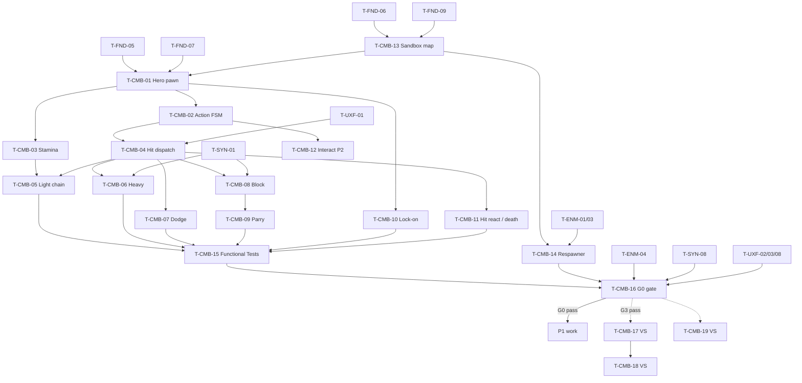

# Hero Combat (Warlord): Tasks

| | |
|---|---|
| Feature | CMB (`01-hero-combat`) |
| Spec / plan | [spec.md](spec.md), [technical-plan.md](technical-plan.md) |
| Phases | P0 (T-CMB-01…11, 13…16) · P2 (T-CMB-12) · VS provisional (T-CMB-17…19) |
| Gate | G0 Combat Sandbox ([master plan §3](../main_implement_plan.md#gate-checklists)) |

## 1. Summary

P0 builds the Warlord, the sandbox map and the combat Functional Tests, then runs the G0 gate. Recommended order: T-CMB-13 → 01 → 02 → 03 → 04 → 05/06/07/10/11 (parallel) → 08 → 09 → 14 → 15 → 16. Interact (T-CMB-12) waits for P2. VS tasks are provisional and must be re-planned after G3.

All paths are proposals (no UE project exists yet). Every task also follows the master plan Definition of Done (§8).

## 2. Task Overview

| ID | Task | Type | Phase | Priority | Dependencies | Status |
|---|---|---|---|---|---|---|
| T-CMB-01 | `AHeroCharacter` + `UHeroClassDefinition` + locomotion/sprint + third-person camera | GAMEPLAY | P0 | Must | T-FND-05, T-FND-06, T-FND-07, T-CMB-13 | Todo |
| T-CMB-02 | `UHeroCombatComponent` action state machine, commitment and cancel windows via anim notify states | GAMEPLAY | P0 | Must | T-CMB-01 | Todo |
| T-CMB-03 | `UStaminaComponent` + stamina rules | GAMEPLAY | P0 | Must | T-CMB-01, T-FND-10 | Todo |
| T-CMB-04 | Melee hit detection → `FCombatHit` dispatch (`DeliverHit`, interceptor, one hit per target per swing) | GAMEPLAY | P0 | Must | T-CMB-02, T-FND-05, T-UXF-01 | Todo |
| T-CMB-05 | Light attack 3-hit chain | GAMEPLAY | P0 | Must | T-CMB-03, T-CMB-04 | Todo |
| T-CMB-06 | Heavy attack with high poise damage + Armor Broken hook | GAMEPLAY | P0 | Must | T-CMB-03, T-CMB-04, T-SYN-01 | Todo |
| T-CMB-07 | Dodge with i-frames | GAMEPLAY | P0 | Must | T-CMB-02, T-CMB-03, T-CMB-04 | Todo |
| T-CMB-08 | Block + block break | GAMEPLAY | P0 | Must | T-CMB-02, T-CMB-03, T-CMB-04, T-SYN-01 | Todo |
| T-CMB-09 | Parry + counter / vulnerability window | GAMEPLAY | P0 | Must | T-CMB-08, T-SYN-01 | Todo |
| T-CMB-10 | Lock-on | GAMEPLAY | P0 | Must | T-CMB-01, T-FND-09 | Todo |
| T-CMB-11 | Hero hit reactions, damage taken, death event | GAMEPLAY | P0 | Must | T-CMB-02, T-CMB-04, T-CMB-13 | Todo |
| T-CMB-12 | Interact verb (`IInteractable`) | GAMEPLAY | P2 | Must | T-CMB-02, T-FND-06 | Todo |
| T-CMB-13 | `L_CombatSandbox` map + `BP_SandboxGameMode` | TOOLS | P0 | Must | T-FND-06, T-FND-09 | Todo |
| T-CMB-14 | Sandbox enemy respawner + scenario presets | TOOLS | P0 | Must | T-CMB-13, T-ENM-01, T-ENM-03 | Todo |
| T-CMB-15 | Combat Functional Test suite (`L_Test_HeroCombat`) | QA | P0 | Must | T-CMB-05…T-CMB-11, T-FND-10 | Todo |
| T-CMB-16 | G0 gate playtest: Combat Sandbox | QA | P0 | Must | T-CMB-14, T-CMB-15, T-ENM-04, T-SYN-08, T-UXF-02, T-UXF-03, T-UXF-08 | Todo |
| T-CMB-17 | Warlord proximity buff (provisional) | GAMEPLAY | VS | Should | T-PRK-02, T-SQD-01 | Todo |
| T-CMB-18 | Rally / charge / hold-line design spike (provisional) | DESIGN | VS | Could | T-CMB-17 | Todo |
| T-CMB-19 | Combat animation polish with production animation (provisional) | ANIM | VS | Should | T-CMB-15, T-CMB-16 | Todo |

## 3. Detailed Tasks

## P0

### T-CMB-01 — `AHeroCharacter` + `UHeroClassDefinition` + locomotion/sprint + third-person camera

**Type** GAMEPLAY · **Phase** P0

**Objective** A controllable Warlord pawn with camera-relative movement, sprint and an orbit camera, all tuned from `DA_HeroClass_Warlord`.

**Related Requirements** R-CMB-01, R-CMB-03, R-CMB-04, R-CMB-06, R-CMB-35, R-CMB-37; AC-CMB-01

**Dependencies** T-FND-05, T-FND-06, T-FND-07, T-CMB-13

**Implementation Notes**
- [ ] Create `AHeroCharacter : ACharacter` with `USpringArmComponent` + `UCameraComponent`, `UHealthComponent`, `UCombatStateComponent`; team = Player (FND team interface).
- [ ] Create `UHeroClassDefinition : UPrimaryDataAsset` with only what this task uses: `MaxHealth`, `FHeroMovementData` (jog, sprint, turn rate), `FHeroCameraData` (arm length, lag). Later tasks add their own structs.
- [ ] Register Primary Asset Type `HeroClass`; `IsDataValid` rejects `MaxHealth <= 0` and sprint ≤ jog.
- [ ] Bind `IA_Move`, `IA_Look`, `IA_Sprint` (hold) in `SetupPlayerInputComponent`; movement camera-relative, orient rotation to movement.
- [ ] Sprint sets `MaxWalkSpeed` to sprint speed; release restores jog. Public `StopSprint()` for the combat component.
- [ ] `ApplyTuning()` on BeginPlay copies init-time values (speeds, max HP, camera); cheat `ReloadHeroTuning` calls it again.
- [ ] `BP_Hero_Warlord`: mannequin, sword + shield attached, weapon mesh tagged `Weapon` with sockets `Trace_Start` / `Trace_End`; `ABP_Warlord` with free locomotion blendspace + sprint.
- [ ] Author `DA_HeroClass_Warlord` with spec §4.4 starting values; set `BP_SandboxGameMode` default pawn to `BP_Hero_Warlord`.

**Expected Files / Assets** `Source/<Game>/Hero/HeroCharacter.h/.cpp`, `HeroClassDefinition.h/.cpp`, `HeroCombatTypes.h`; `Content/<Game>/Hero/BP_Hero_Warlord`, `ABP_Warlord`, `BS_Warlord_Free`, `DA_HeroClass_Warlord`; `Content/<Game>/Core/Input/IA_Move`, `IA_Look`, `IA_Sprint`

**Test Case** PIE in `L_CombatSandbox` → WASD moves relative to camera; hold Shift → speed readout 700; set `SprintSpeed` 900 in the DA during PIE, run `ReloadHeroTuning` → readout 900.

**Acceptance Criteria**
- [ ] AC-CMB-01 passes.
- [ ] "Validate Data" on a copy of the DA with `MaxHealth = 0` reports an error.
- [ ] No new log warnings in PIE.

**Verification** PIE manual steps above; Data Validation on `DA_HeroClass_Warlord`.

---

### T-CMB-02 — `UHeroCombatComponent` action state machine, commitment and cancel windows via anim notify states

**Type** GAMEPLAY · **Phase** P0

**Objective** One state machine that starts actions only when rules allow, keeps animation commitment, opens cancel windows from montage notifies and buffers early presses.

**Related Requirements** R-CMB-07, R-CMB-08, R-CMB-37; AC-CMB-03 (completed with T-CMB-07)

**Dependencies** T-CMB-01

**Implementation Notes**
- [ ] Enums `EHeroAction` (Light, Heavy, Dodge, BlockStart, BlockEnd, Parry, Interact) and `EHeroActionState` (Idle, LightAttack, HeavyAttack, Dodge, Block, Parry, HitReact, Staggered, Dead) in `HeroCombatTypes.h`.
- [ ] `RequestAction(EHeroAction)`, `GetActionState()`, `GetActionTag()` (maps to `State.Hero.*`), `OnActionStateChanged`.
- [ ] Pure function `FHeroActionRules::CanStart(State, AllowedByOpenWindow, bStaminaOk)`; Automation Spec covers every state × action pair in the cancel table (technical-plan §5.1).
- [ ] Notify states `UAnimNotifyState_CancelWindow` (`TArray<EHeroAction> AllowedActions`), `_Invulnerable`, `_ParryWindow`: Begin/End call the owner's combat component (lookup cached per mesh).
- [ ] `PlayActionMontage(Montage, State)` binds montage end/blend-out; on end or interrupt it force-closes open windows and returns to Idle if the montage still owns the state.
- [ ] Input buffer: keep the latest rejected press with timestamp; consume it when a window allows it or on Idle, if age ≤ `InputBufferTime` (new `FHeroInputData` in the DA). Clear on Staggered/Dead.
- [ ] Starting any action calls `StopSprint()`.
- [ ] `game.debug.Combat 1`: on-screen action state, open windows, buffered action. Cheat `ReportHeroWindows` prints every DA montage's window start/end times (used by production-plan "notify windows match data" check).
- [ ] For this task only, a temporary debug montage on Light proves the flow; T-CMB-05 replaces it.

**Expected Files / Assets** `Source/<Game>/Hero/HeroCombatComponent.h/.cpp`; `Source/<Game>/Combat/AnimNotifyState_CancelWindow.*`, `AnimNotifyState_Invulnerable.*`, `AnimNotifyState_ParryWindow.*`; `Source/<Game>/Tests/HeroActionRules.spec.cpp`

**Test Case** Debug montage 1.0 s with cancel window 0.6–0.9 s allowing Light. Press Light at 0.45 s → buffered, runs at 0.6 s. Press at 0.30 s with buffer 0.2 s → dropped. `Montage_Stop` via cheat mid-montage → state Idle, no window left open.

**Acceptance Criteria**
- [ ] State always returns to Idle after normal end and after interruption.
- [ ] `HeroActionRules` Spec passes.
- [ ] Buffer behaves as in the test case.

**Verification** Automation Spec `<Game>.Hero.ActionRules`; PIE with `game.debug.Combat 1`.

---

### T-CMB-03 — `UStaminaComponent` + stamina rules

**Type** GAMEPLAY · **Phase** P0

**Objective** Stamina that gates Dodge, Block and Heavy, regenerates after a delay and tells the HUD when it changes or when a spend fails.

**Related Requirements** R-CMB-05, R-CMB-10, R-CMB-11, R-CMB-12; AC-CMB-15

**Dependencies** T-CMB-01, T-FND-10

**Implementation Notes**
- [ ] `FStaminaConfig` in the DA: `Max`, `RegenDelay`, `RegenRate`, `BlockingRegenMultiplier`, `SprintDrainPerSecond`.
- [ ] Pure struct `FStaminaState` with `TrySpend`, `ApplyDamage`, `Advance` (technical-plan §5.2).
- [ ] Component inits from DA; Tick enabled only while below max or sprint-draining; delegates `OnStaminaChanged(Current, Max)`, `OnStaminaSpendFailed(Cost)`, `OnStaminaDepleted`.
- [ ] `SetBlocking(bool)` for the regen multiplier (used by T-CMB-08).
- [ ] If `SprintDrainPerSecond > 0` and stamina hits 0, stop sprint (default drain 0).
- [ ] Combat component calls `TrySpend` before costed actions; on failure plays `Feedback.Hero.StaminaInsufficient` and does not buffer.
- [ ] Wire FND cheat `InfiniteStamina`. Add stamina value to `game.debug.Combat`.

**Expected Files / Assets** `Source/<Game>/Hero/StaminaComponent.h/.cpp`; `Source/<Game>/Tests/StaminaRules.spec.cpp`

**Test Case** Spec with Max 100, delay 0.8, rate 30: spend 30 → 70; spend 80 → rejected, 70; advance to 0.5 s → 70; advance to 1.8 s → 100 (clamped); same with blocking → 85; `ApplyDamage(200)` → 0 and returns depleted.

**Acceptance Criteria**
- [ ] AC-CMB-15 passes.
- [ ] Component tick is disabled when stamina is full (check with debug output).
- [ ] `InfiniteStamina` keeps stamina at max.

**Verification** Automation Spec `<Game>.Hero.Stamina`; PIE check of tick state and cheat.

---

### T-CMB-04 — Melee hit detection → `FCombatHit` dispatch

**Type** GAMEPLAY · **Phase** P0

**Objective** Montage hit windows produce traces; each hostile target is hit once per swing; every hit in the game goes through `UCombatLibrary::DeliverHit`, which lets the target intercept first.

**Related Requirements** R-CMB-17, R-CMB-18, R-CMB-34; AC-CMB-04, AC-CMB-13

**Dependencies** T-CMB-02, T-FND-05, T-UXF-01

**Implementation Notes**
- [ ] `ECombatHitResult` {Ignored, Evaded, Parried, Blocked, BlockBroken, Hit, Killed} and `ICombatHitInterceptor::InterceptHit(FCombatHit&)` in `Combat/`.
- [ ] `UCombatLibrary::DeliverHit(Target, Hit)` as in technical-plan §4.2: hostile + alive check (team attitude via FND team interface), interceptors, `UHealthComponent::ApplyHit`, `UCombatStateComponent::ApplyPoiseDamage`, `ApplyState` for `AppliedStates`, one `UFeedbackSubsystem::Play` with context (instigator, target, location, direction, `bIsHeavy`, `bTargetArmored`).
- [ ] `UCombatLibrary::IsInFrontArc(Defender, AttackerLocation, ArcDegrees)` + Automation Spec.
- [ ] `UMeleeTraceComponent`: `SetPendingAttack(Template, Radius)` (called by whoever starts the attack), `BeginHitWindow()` / `EndHitWindow()`; per tick in window, sphere sweeps at 3 points along the blade from previous to current socket positions (object type Pawn; `ponytail:` fixed 3 points, raise if fast swings miss); hit set reset per window; ignore owner; `OnHitResolved(Target, Result)`.
- [ ] `UAnimNotifyState_CombatHitWindow` calls the owner's `UMeleeTraceComponent` Begin/End.
- [ ] `UHeroCombatComponent` forwards results as `OnHitLanded(Target, Result)`.
- [ ] Cheat `DebugHitHero <Damage> <Delay> <bFromFront>`: a hidden test instigator (hostile team, has `UCombatStateComponent`) delivers a hit to the hero after the delay. Used by T-CMB-07…11 and T-CMB-15.
- [ ] `game.debug.Combat 1` draws sweep spheres (green no hit, red hit) and logs each `DeliverHit` result.
- [ ] Document in the header comment: ENM, SQD and DEF must deliver hits through `DeliverHit`.

**Expected Files / Assets** `Source/<Game>/Combat/CombatLibrary.h/.cpp`, `CombatHitInterceptor.h`, `MeleeTraceComponent.h/.cpp`, `AnimNotifyState_CombatHitWindow.h/.cpp`; `Source/<Game>/Tests/CombatArc.spec.cpp`

**Test Case** FND hostile dummy in front; debug swing whose blade overlaps it for 5 frames → dummy HP −Damage once, one feedback log line. Two hostile dummies in the arc → each once. Ally-team dummy → HP unchanged, result Ignored.

**Acceptance Criteria**
- [ ] AC-CMB-04 passes.
- [ ] Exactly one feedback event per resolved hit (log).
- [ ] `CombatArc` Spec passes (0°, 89°, 91°, 180° cases for a 180° arc).

**Verification** Automation Spec `<Game>.Combat.Arc`; PIE with debug draw; covered again by T-CMB-15 `FT_OneHitPerSwing`.

---

### T-CMB-05 — Light attack 3-hit chain

**Type** GAMEPLAY · **Phase** P0

**Objective** Fast 3-hit chain driven by data and montage windows.

**Related Requirements** R-CMB-09, R-CMB-13, R-CMB-14; AC-CMB-02

**Dependencies** T-CMB-03, T-CMB-04

**Implementation Notes**
- [ ] `FHeroAttackData` (montage, damage, poise damage, stamina cost, trace radius, `AppliedStates`, `StateDuration`); `LightChain` array of 3 in the DA with spec values.
- [ ] `AM_Warlord_Light_01..03`: one hit window each; cancel windows per technical-plan §5.1 (hits 1–2 allow Light, Heavy, Dodge, Block; hit 3 allows Dodge, Block).
- [ ] Chain logic: Light from Idle → index 0; Light inside a window allowing Light while in LightAttack → index + 1 (max 2); any other action, Idle or index 2 finished → reset to 0.
- [ ] Build `FCombatHit` from data (SourceLayer Hero, `Damage.Physical`, `bIsHeavy = false`) and pass it to `SetPendingAttack`.
- [ ] `TrySpend(LightChain[i].StaminaCost)` (default 0).
- [ ] `IsDataValid`: exactly 3 entries, montages set, each has one hit window.
- [ ] Remove the T-CMB-02 debug montage.

**Expected Files / Assets** `HeroCombatTypes.h` (`FHeroAttackData`), `HeroCombatComponent.cpp`; `Content/<Game>/Hero/AM_Warlord_Light_01`, `_02`, `_03`

**Test Case** Hostile dummy; press Light 3 times in rhythm → damage 10, 10, 14 and chain index 0, 1, 2 in debug; wait 1 s, press Light → index 0.

**Acceptance Criteria**
- [ ] AC-CMB-02 passes.
- [ ] Data validation catches a missing third entry.

**Verification** PIE; `FT_LightChain` in T-CMB-15.

---

### T-CMB-06 — Heavy attack with high poise damage + Armor Broken hook

**Type** GAMEPLAY · **Phase** P0

**Objective** Slow, readable heavy hit with high damage and poise damage that carries a data list of states to apply (empty in P0; Armor Broken from P1 via T-SYN-02).

**Related Requirements** R-CMB-15, R-CMB-16, R-CMB-38; AC-CMB-05

**Dependencies** T-CMB-03, T-CMB-04, T-SYN-01

**Implementation Notes**
- [ ] `Heavy` `FHeroAttackData` in the DA: damage 30, poise 40, stamina 25, `AppliedStates` empty.
- [ ] `AM_Warlord_Heavy`: startup ≥ 0.3 s before the hit window (check with `ReportHeroWindows`), one hit window, late cancel window allowing Dodge.
- [ ] `RequestAction(Heavy)`: `TrySpend` → play; `bIsHeavy = true`; copy `AppliedStates` and `StateDuration` into `FCombatHit`.
- [ ] `IsDataValid`: Heavy damage and poise damage greater than every Light entry; every Light stamina cost < Heavy stamina cost.
- [ ] Hook check: in a test copy of the DA set `AppliedStates = {State.Combat.ArmorBroken}`; after a Heavy hit the target's `UCombatStateComponent::HasState` returns true (state effect itself is T-SYN-02).

**Expected Files / Assets** `HeroCombatComponent.cpp`; `Content/<Game>/Hero/AM_Warlord_Heavy`; `DA_HeroClass_Warlord` (Heavy entry)

**Test Case** Dummy with MaxPoise 50 (`FCombatStateConfig`): Heavy → poise 10 (`game.debug.CombatStates`), Light → 5, Light → Staggered applied. Stamina 20 → Heavy refused with the insufficient cue.

**Acceptance Criteria**
- [ ] AC-CMB-05 passes.
- [ ] Hook check passes.
- [ ] Data validation catches a Heavy weaker than a Light.

**Verification** PIE with `game.debug.CombatStates 1`; T-CMB-15.

---

### T-CMB-07 — Dodge with i-frames

**Type** GAMEPLAY · **Phase** P0

**Objective** Directional dodge that costs stamina, ignores hits during its i-frame window and cannot be chained into another dodge.

**Related Requirements** R-CMB-19, R-CMB-20, R-CMB-21; AC-CMB-03, AC-CMB-06, AC-CMB-07

**Dependencies** T-CMB-02, T-CMB-03, T-CMB-04

**Implementation Notes**
- [ ] `FHeroDodgeData`: montages F/B/L/R, stamina cost, root motion scale.
- [ ] Direction: camera-relative input. Not locked: rotate the hero to input direction and play F. Locked: pick the closest of F/B/L/R relative to facing. No input: B.
- [ ] `_Invulnerable` window sets `bInvulnerable`; `InterceptHit` returns Evaded while set (no feedback).
- [ ] Recovery cancel window allows Light, Heavy, Block, not Dodge (no dodge chaining).
- [ ] Distance via root motion; scale with `SetAnimRootMotionTranslationScale` (verify API in UE docs for the pinned version).
- [ ] Cost check through `TrySpend`; failure → cue, no start.

**Expected Files / Assets** `HeroCombatComponent.cpp`; `Content/<Game>/Hero/AM_Warlord_Dodge_F`, `_B`, `_L`, `_R`

**Test Case** `DebugHitHero 20 0.3 1`, start Dodge so the hit lands inside the i-frames → HP unchanged; land it after the window → HP −20. Stamina 15 (cost 20) → Dodge refused. Dodge during Light hit 1 (pressed early) → buffered and runs at the cancel window.

**Acceptance Criteria**
- [ ] AC-CMB-06, AC-CMB-07 pass; AC-CMB-03 passes with Light → Dodge.
- [ ] Two Dodge presses in a row produce one dodge, then the second only after recovery ends.

**Verification** PIE; `FT_DodgeIFrames` in T-CMB-15.

---

### T-CMB-08 — Block + block break

**Type** GAMEPLAY · **Phase** P0

**Objective** Held block that reduces frontal damage, turns force into stamina damage and breaks into Staggered at 0 stamina.

**Related Requirements** R-CMB-12, R-CMB-22, R-CMB-23, R-CMB-24; AC-CMB-08, AC-CMB-09

**Dependencies** T-CMB-02, T-CMB-03, T-CMB-04, T-SYN-01

**Implementation Notes**
- [ ] `FHeroBlockData`: `DamageReduction`, `StaminaPerDamage`, `ArcDegrees`, `BlockBreakStaggerDuration`, `MoveSpeedMultiplier`, block-hit and block-break montages.
- [ ] `IA_Block` hold: Started → Block (if allowed), Completed → Idle. ABP upper-body guard pose from a component bool; move speed × multiplier; `Stamina.SetBlocking(true/false)`.
- [ ] `InterceptHit` while Block and `IsInFrontArc`: `Hit.Damage *= (1 − DamageReduction)`; `ApplyDamage(original × StaminaPerDamage)`; if depleted → `ApplyState(State.Combat.Staggered, BlockBreakStaggerDuration, self)`, play break montage, return BlockBroken; else play block-hit montage, return Blocked.
- [ ] Hero listens to its own `UCombatStateComponent` `OnStateAdded/Removed(Staggered)` → state Staggered / Idle (works for any future Staggered source).
- [ ] Hits outside the arc fall through to normal damage.

**Expected Files / Assets** `HeroCombatComponent.cpp`, `ABP_Warlord` guard layer; `Content/<Game>/Hero/AM_Warlord_BlockHit`, `AM_Warlord_BlockBreak`

**Test Case** Stamina 100, hold Block, `DebugHitHero 20 0 1` → HP −4, stamina 80, `Feedback.Combat.Block`. `DebugHitHero 20 0 0` (behind) → HP −20, stamina unchanged. Stamina set to 10, frontal 20 → HP −4, block break, Staggered 1.2 s, all inputs ignored until it ends.

**Acceptance Criteria**
- [ ] AC-CMB-08 and AC-CMB-09 pass.
- [ ] Releasing Block returns to Idle in the same frame.

**Verification** PIE; `FT_BlockReduce`, `FT_BlockBreak` in T-CMB-15.

---

### T-CMB-09 — Parry + counter / vulnerability window

**Type** GAMEPLAY · **Phase** P0

**Objective** Narrow parry with a punishable whiff; success negates the hit, deals parry poise damage to the attacker, opens a Counter Window and raises `OnParrySucceeded`.

**Related Requirements** R-CMB-25, R-CMB-26, R-CMB-27, R-CMB-28; AC-CMB-10

**Dependencies** T-CMB-08, T-SYN-01

**Implementation Notes**
- [ ] `FHeroParryData`: montage, stamina cost (0), `ParryPoiseDamage`, `CounterWindow`, `CounterDamageMultiplier`, optional `CounterMontage`.
- [ ] `IA_Parry` → state Parry → `AM_Warlord_Parry` with an early `_ParryWindow` and no cancel window before the end of recovery (whiff = no block, no dodge).
- [ ] `InterceptHit` while parry window open and `IsInFrontArc` (block arc): instigator's `UCombatStateComponent::ApplyPoiseDamage(ParryPoiseDamage, Hero)`; return Parried; on the first success stop the parry montage, go Idle, start the Counter Window timer, broadcast `OnParrySucceeded(Attacker)`.
- [ ] Every hit landing in the same window is parried (multi-attacker case).
- [ ] Counter: the first Light/Heavy started inside the Counter Window plays `CounterMontage` if set; its hit has `bIsParryCounter = true` and damage × `CounterDamageMultiplier`; the window ends after that hit or on timeout.
- [ ] Note the NEW-CMB-01 reading in the header comment; G0 decides.

**Expected Files / Assets** `HeroCombatComponent.cpp`; `Content/<Game>/Hero/AM_Warlord_Parry`, `AM_Warlord_ParryCounter` (optional)

**Test Case** `DebugHitHero 20 0.1 1`, Parry at t=0 → HP unchanged, test instigator poise −60, `Feedback.Combat.Parry` logged, `OnParrySucceeded` fired; Light within 1 s → 15 damage flagged counter. Parry with no hit, press Block during recovery → ignored. Against the ENM P0 enemy (MaxPoise 50) a parry staggers it.

**Acceptance Criteria**
- [ ] AC-CMB-10 passes.
- [ ] Two simultaneous attackers inside the window are both parried.

**Verification** PIE with `DebugHitHero` and with the ENM enemy (after T-ENM-03); `FT_Parry` in T-CMB-15.

---

### T-CMB-10 — Lock-on

**Type** GAMEPLAY · **Phase** P0

**Objective** Lock onto the best hostile target, switch left/right, keep it framed, and release or retarget by rule.

**Related Requirements** R-CMB-29, R-CMB-30, R-CMB-31; AC-CMB-11

**Dependencies** T-CMB-01, T-FND-09

**Implementation Notes**
- [ ] `FHeroLockOnData` in the DA: `Range`, `BreakDistance`, `LOSGraceTime`.
- [ ] `ULockOnComponent::Toggle()`: overlap sphere (Pawn) within Range → hostile, alive (`UHealthComponent`), LOS (Visibility trace to socket `LockOn`, else capsule centre) → lowest angle to camera forward, then distance.
- [ ] `Switch(Direction)`: project candidates to screen, choose nearest on that side.
- [ ] Validity timer 0.15 s: distance > BreakDistance → release; LOS lost longer than grace → release.
- [ ] Bind target `OnDeath` / `OnDestroyed` → acquire nearest valid in range, else release.
- [ ] While locked: control rotation interpolates to the target (yaw, clamped pitch); `bUseControllerDesiredRotation` on, orient-to-movement off; strafe blendspace in `ABP_Warlord`. Sprint and Dodge use input direction. Restore on release.
- [ ] `IA_LockOn` (toggle), `IA_LockOnSwitch` (mouse wheel axis); mouse look does not rotate the camera while locked.
- [ ] `WBP_LockOnMarker` projects the marker on the target; ticks only while locked; added to `WBP_GameHUD` if T-UXF-02 is done, else added to the viewport directly.
- [ ] `OnLockOnTargetChanged` delegate.

**Expected Files / Assets** `Source/<Game>/Hero/LockOnComponent.h/.cpp`; `Content/<Game>/Hero/BS_Warlord_Strafe`; `Content/<Game>/UI/WBP_LockOnMarker`; `IA_LockOn`, `IA_LockOnSwitch`

**Test Case** Three hostile dummies 5 m away at left / centre / right: lock → centre; wheel up → right; walk 21 m away → release; lock, kill target with cheat → lock moves to nearest remaining; put a pillar between hero and target for 2 s → release after 1 s.

**Acceptance Criteria**
- [ ] AC-CMB-11 passes.
- [ ] Lock-on never selects an ally or a dead actor.

**Verification** PIE; `FT_LockOnBreak` in T-CMB-15.

---

### T-CMB-11 — Hero hit reactions, damage taken, death event

**Type** GAMEPLAY · **Phase** P0

**Objective** Unblocked hits interrupt the hero with a directional reaction; death raises one event and the sandbox respawns the hero.

**Related Requirements** R-CMB-32, R-CMB-33; AC-CMB-12

**Dependencies** T-CMB-02, T-CMB-04, T-CMB-13

**Implementation Notes**
- [ ] `FHeroHitReactData`: front and back montages; death montage.
- [ ] Bind own `UHealthComponent::OnDamaged`: if alive and the hit was not blocked → stop the current montage (windows close), play front/back by hit direction, state HitReact, play `Feedback.Hero.Damaged`. HitReact late cancel window allows Dodge.
- [ ] Bind `OnDeath`: state Dead, clear buffer, release lock-on, ignore input, death montage, `Feedback.Hero.Death`, broadcast `AHeroCharacter::OnHeroDeath` once.
- [ ] `BP_SandboxGameMode` binds `OnHeroDeath` → after `RespawnDelay` (3 s) destroy pawn and `RestartPlayer`. Comment: sandbox only, CSM T-CMB-01 replaces it in P3.
- [ ] FND cheat `KillHero` exercises the path.

**Expected Files / Assets** `HeroCombatComponent.cpp`, `HeroCharacter.cpp`; `Content/<Game>/Hero/AM_Warlord_HitReact_F`, `_B`, `AM_Warlord_Death`; `BP_SandboxGameMode` (respawn graph)

**Test Case** During Light hit 1, `DebugHitHero 20 0 0` → swing stops, back reaction plays, no further hit from that swing. `KillHero` → `OnHeroDeath` count = 1, inputs ignored, respawn after 3 s with full HP and stamina.

**Acceptance Criteria**
- [ ] AC-CMB-12 passes.
- [ ] Blocked hits never play the hit reaction.

**Verification** PIE; `FT_HeroDeath` in T-CMB-15.

---

### T-CMB-13 — `L_CombatSandbox` map + `BP_SandboxGameMode`

**Type** TOOLS · **Phase** P0

**Objective** The P0 test map with game mode, test dummies and a readable layout for camera, lock-on and LOS checks.

**Related Requirements** R-CMB-02, §32 P0; supports AC-CMB-01…12

**Dependencies** T-FND-06, T-FND-09

**Implementation Notes**
- [ ] `BP_SandboxGameMode`: Blueprint child of `ASandboxGameMode` if FND created it, else of `AGameModeBase`; PlayerController = `AHeroPlayerController`; placeholder pawn until T-CMB-01.
- [ ] `L_CombatSandbox`: flat ~60 × 60 m arena, a few pillars/cover blocks (LOS), one ramp, one wall (camera collision), PlayerStart, simple lighting, NavMesh bounds (needed by ENM).
- [ ] Place 3 FND test dummies: two hostile, one ally team (friendly-fire checks).
- [ ] "Tuning kiosk" (production-plan): a text render actor listing combat cheats and the active DA name. Plain text, no UI.
- [ ] World Settings GameMode override; set as editor and game default map for P0.

**Expected Files / Assets** `Content/<Game>/Maps/L_CombatSandbox`; `Content/<Game>/Core/BP_SandboxGameMode`

**Test Case** Open map, PIE → pawn spawns at PlayerStart, 3 dummies present, `SpawnTestDummy` adds a fourth.

**Acceptance Criteria**
- [ ] Map loads with no errors or warnings.
- [ ] Packaged Development build opens the map (T-FND-08 pipeline).

**Verification** PIE; packaged smoke run.

---

### T-CMB-14 — Sandbox enemy respawner + scenario presets

**Type** TOOLS · **Phase** P0

**Objective** Keep the P0 melee enemy coming back so one enemy can carry a 3–5 minute session (§36).

**Related Requirements** R-CMB-02; G0 "one enemy enough for 3–5 minutes"

**Dependencies** T-CMB-13, T-ENM-01, T-ENM-03

**Implementation Notes**
- [ ] `BP_SandboxEnemyRespawner`: enemy class (default ENM P0 melee enemy), `Count` (1–3), `RespawnDelay` (5 s), spawn radius; binds each enemy's `UHealthComponent::OnDeath` → respawn after delay.
- [ ] Cheat `SetSandboxEnemyCount <N>` finds the respawner and changes `Count` live.
- [ ] Presets as respawner instances in the map: "Duel" (1, enabled by default), "Pair" (2, disabled).

**Expected Files / Assets** `Content/<Game>/Core/BP_SandboxEnemyRespawner`; `L_CombatSandbox` placement; cheat in `UGameCheatManager`

**Test Case** Kill the enemy → a new one spawns after 5 s. `SetSandboxEnemyCount 2` → two alive.

**Acceptance Criteria**
- [ ] 10 minutes of PIE with continuous kills: no errors, alive count always equals `Count`.

**Verification** PIE; Outliner enemy count; `stat game` stable over the session.

---

### T-CMB-15 — Combat Functional Test suite (`L_Test_HeroCombat`)

**Type** QA · **Phase** P0

**Objective** Automated regression for every P0 combat rule, runnable from the command line.

**Related Requirements** AC-CMB-02…AC-CMB-12, AC-CMB-16

**Dependencies** T-CMB-05, T-CMB-06, T-CMB-07, T-CMB-08, T-CMB-09, T-CMB-10, T-CMB-11, T-FND-10

**Implementation Notes**
- [ ] `L_Test_HeroCombat` with one `AFunctionalTest` per scenario: `FT_LightChain`, `FT_OneHitPerSwing`, `FT_HeavyPoise`, `FT_DodgeIFrames`, `FT_BlockReduce`, `FT_BlockBreak`, `FT_Parry`, `FT_LockOnBreak`, `FT_HeroDeath`.
- [ ] Tests call `RequestAction` and the `DebugHitHero` helper; they wait on window begin/end events, not fixed seconds, so retimed montages do not break them.
- [ ] Each test asserts the numbers from its spec AC and logs the AC ID.
- [ ] Group under `<Game>.Combat` in the command-line runner (T-FND-10).
- [ ] Add a line to the integration checklist: run this suite before merging CMB, SYN or ENM changes.

**Expected Files / Assets** `Content/<Game>/Maps/Test/L_Test_HeroCombat`; functional test BPs or C++ in `Source/<Game>/Tests/`

**Test Case** `-ExecCmds="Automation RunTests <Game>.Combat"` → all pass. Move the dodge i-frame notify by 0.05 s → `FT_DodgeIFrames` still passes.

**Acceptance Criteria**
- [ ] AC-CMB-16 passes.
- [ ] A deliberately broken rule (e.g., block reduction set to 0) makes the matching test fail.

**Verification** Command-line run output attached to the task.

---

### T-CMB-16 — G0 gate playtest: Combat Sandbox

**Type** QA · **Phase** P0

**Objective** Answer the G0 question with evidence: is combat responsive, readable and satisfying with no RTS/TD on screen?

**Related Requirements** R-CMB-02, all P0 R-CMB; AC-CMB-17; master plan §3 G0 checklist; GDD §32 P0, §36 Combat Core DoD

**Dependencies** T-CMB-14, T-CMB-15, T-ENM-04, T-SYN-08, T-UXF-02, T-UXF-03, T-UXF-08

**Implementation Notes**
- [ ] Build: packaged Development build on the reference PC (T-FND-08), `L_CombatSandbox`, "Duel" preset.
- [ ] Hypotheses = the G0 checklist: H1 Light/Heavy/Dodge/Block/Parry responsive; H2 stamina loop clear; H3 hit feedback strong enough; H4 one melee enemy holds 3–5 minutes.
- [ ] Sessions: 3 × 5 minutes per tester; at least one tester besides the developer if possible.
- [ ] Record per `game-development-workflow` playtesting: Build/Version, Scenario, Tester, Expected, Observed, Issue Type (design vs bug), Severity, Decision.
- [ ] Evidence from telemetry (T-UXF-08): actions per type, parry attempts vs successes, block breaks, dodges, damage taken, deaths, time to kill.
- [ ] Decide NEW-CMB-01…05 and record the decision.
- [ ] Per hypothesis: KEEP / CHANGE / DELETE. CHANGE → tune one variable at a time, re-run the affected session.
- [ ] If any G0 check fails: no P1 task starts; log the iteration plan.
- [ ] Save `ai/game/playtests/G0_<YYYY-MM-DD>.md`; copy tuned values into spec §4.4.

**Expected Files / Assets** `ai/game/playtests/G0_<YYYY-MM-DD>.md`; updated `DA_HeroClass_Warlord`; updated spec §4.4

**Test Case** Gate review: each checklist item has yes/no plus evidence.

**Acceptance Criteria**
- [ ] AC-CMB-17 passes.
- [ ] Every G0 checklist item is ticked, or the record states the failure and the next iteration.
- [ ] Combat Functional Tests pass on the gate build.

**Verification** Lead reviews the record against the master plan G0 checklist.

## P2

### T-CMB-12 — Interact verb (`IInteractable`)

**Type** GAMEPLAY · **Phase** P2

**Objective** One Interact verb: focus the best interactable in range, show a prompt, trigger it once.

**Related Requirements** R-CMB-39; AC-CMB-18

**Dependencies** T-CMB-02, T-FND-06 (first consumer: T-DEF-07 build zones)

**Implementation Notes**
- [ ] `IInteractable` (`Core/`): `CanInteract(AHeroCharacter*)`, `GetInteractPrompt()` (FText), `Interact(AHeroCharacter*)`.
- [ ] `UInteractionComponent` on the hero: 0.1 s timer; overlap sphere `InteractRange` on a custom `Interact` trace channel (add in Project Settings; verify cost); keep actors implementing `IInteractable` with `CanInteract`; choose the highest dot with camera forward inside `AimConeDegrees`; `OnFocusChanged`.
- [ ] `FHeroInteractData` (range, aim cone) in the DA.
- [ ] `IA_Interact` in `IMC_Combat` → `RequestAction(Interact)`, allowed only from Idle.
- [ ] `WBP_InteractPrompt` bound to `OnFocusChanged`.
- [ ] `BP_Test_Interactable` (counts calls) for tests; add `FT_Interact` to `L_Test_HeroCombat`.

**Expected Files / Assets** `Source/<Game>/Core/Interactable.h`; `Source/<Game>/Hero/InteractionComponent.h/.cpp`; `Content/<Game>/UI/WBP_InteractPrompt`; `IA_Interact`; `Content/<Game>/Maps/Test/BP_Test_Interactable`

**Test Case** Two test interactables 2 m apart: aim left → prompt for left; press F → left count 1, right 0; press F during Light → no call; walk 4 m away → prompt hidden.

**Acceptance Criteria**
- [ ] AC-CMB-18 passes.
- [ ] `FT_Interact` passes in the command-line run.

**Verification** PIE; `FT_Interact`.

## VS (provisional: re-validate spec and re-plan after G3)

### T-CMB-17 — Warlord proximity buff (provisional)

**Type** GAMEPLAY · **Phase** VS

**Objective** "Army fights with you" (§19.1): allied squads near the Warlord get a light stat bonus.

**Related Requirements** R-CMB-40; AC-CMB-19

**Dependencies** T-PRK-02 (stat modifier query), T-SQD-01; G3 passed

**Implementation Notes**
- [ ] Re-validate R-CMB-40 after G3; write radius, stat tags (`Stat.Army.*`) and magnitudes into the spec first.
- [ ] `FHeroProximityBuffData` in the DA (radius, modifiers).
- [ ] Hero-side timer (0.25 s) overlaps `ASquad` anchors in radius; add/remove the modifiers through the PRK stat modifier API. No new modifier system.
- [ ] Squad marker shows the buff (UXF world marker).

**Expected Files / Assets** `HeroCombatComponent` or a small `UWarlordProximityBuffComponent` (decide at re-plan); DA fields

**Test Case** Squad anchor 5 m from hero (radius 8 m) → modified stat value visible in debug; move squad to 12 m → value restored within 0.25 s.

**Acceptance Criteria**
- [ ] AC-CMB-19 passes.
- [ ] Buff never stacks from repeated overlaps.

**Verification** PIE in the VS Siege Site; Functional Test added at re-plan.

---

### T-CMB-18 — Rally / charge / hold-line design spike (provisional)

**Type** DESIGN · **Phase** VS

**Objective** Turn the §19.1 traits "rally" and "charge/hold-line support" into rules or a recorded DELETE (NEW-CMB-06).

**Related Requirements** R-CMB-41

**Dependencies** T-CMB-17; G3 passed

**Implementation Notes**
- [ ] Write hypotheses in the `06-prototyping` format (If we build X, players show Y; evidence Z) for each trait.
- [ ] Run the §40 feature intake check; classify REQUIRED / IMPROVEMENT / FUTURE / OUT OF SCOPE.
- [ ] Optional throwaway Blueprint prototype in a throwaway map, deleted after the decision.
- [ ] Output: spec addendum with new R-CMB IDs and new tasks, or DELETE with reason.

**Expected Files / Assets** Spec addendum in `spec.md` §4.3; playtest note in `ai/game/playtests/`

**Test Case** Review: each trait has a KEEP / CHANGE / DELETE decision.

**Acceptance Criteria**
- [ ] Decision recorded; no production code merged by this task.

**Verification** Lead review.

---

### T-CMB-19 — Combat animation polish with production animation (provisional)

**Type** ANIM · **Phase** VS

**Objective** Replace placeholder Warlord animation with the VS set without changing tuned timing.

**Related Requirements** R-CMB-42, R-CMB-34

**Dependencies** T-CMB-15, T-CMB-16; VS Warlord animation from [production-plan.md](../production-plan.md)

**Implementation Notes**
- [ ] Run `ReportHeroWindows` on the G0-tuned montages and save the output as the timing reference.
- [ ] Retarget/import final animations; rebuild montages; place notify windows to match the reference.
- [ ] Re-run `ReportHeroWindows` and diff against the reference.
- [ ] Re-run the T-CMB-15 suite and a short G0 checklist session.

**Expected Files / Assets** Updated `AM_Warlord_*`, `ABP_Warlord`, blendspaces

**Test Case** Window diff shows every window within 0.03 s of the reference.

**Acceptance Criteria**
- [ ] All `<Game>.Combat` tests pass.
- [ ] Short G0 re-check shows no regression in responsiveness notes.

**Verification** Command-line test run; window diff attached; playtest note.

## 4. Dependency Graph

## 5. Integration / Regression Checklist

| Area | Expected | When |
|---|---|---|
| `<Game>.Combat` Functional Tests | All pass | Before every CMB, SYN, ENM merge |
| Stamina / action rules / arc Specs | All pass | Every build |
| Enemy hits on hero | Go through `DeliverHit` (block/parry/i-frames apply) | After T-ENM-03 and any new enemy attack |
| Feedback | One event per hit outcome, rows exist in `DT_Feedback` | After T-UXF-03 and any new hit type |
| Input contexts | Combat keys still work after `IMC_CommandWheel` / `IMC_TacticalFocus` are added; movement works with the wheel open | P1 (SQD), P3 (TFM) |
| Hero death | Sandbox respawn in P0–P2; CSM flow in P3 with sandbox binding removed | P3 |
| Time dilation | Actions, windows and stamina scale with game time; no stuck states | P3 (TFM) |
| Data validation | `DA_HeroClass_Warlord` validates clean | Every DA edit |
| Performance | Hero cost not visible in `stat game` in the sandbox | G0 build |

## 6. Final Definition of Done

- [ ] All P0 tasks done, each with its verification recorded.
- [ ] `<Game>.Combat` Functional Tests and Hero/Combat Specs pass from the command line.
- [ ] `DA_HeroClass_Warlord` holds every non-timing tunable; montage windows hold every timing tunable; no hard-coded combat numbers.
- [ ] Packaged Development build runs `L_CombatSandbox` on the reference PC with no new warnings.
- [ ] G0 record saved with KEEP / CHANGE / DELETE decisions and G0 checklist answered (master plan §3).
- [ ] NEW-CMB-01…05 decided or explicitly carried to P1 with a default.
- [ ] P2: Interact works with the first DEF consumer and `FT_Interact` passes.
- [ ] VS tasks re-validated after G3 before any work starts.
