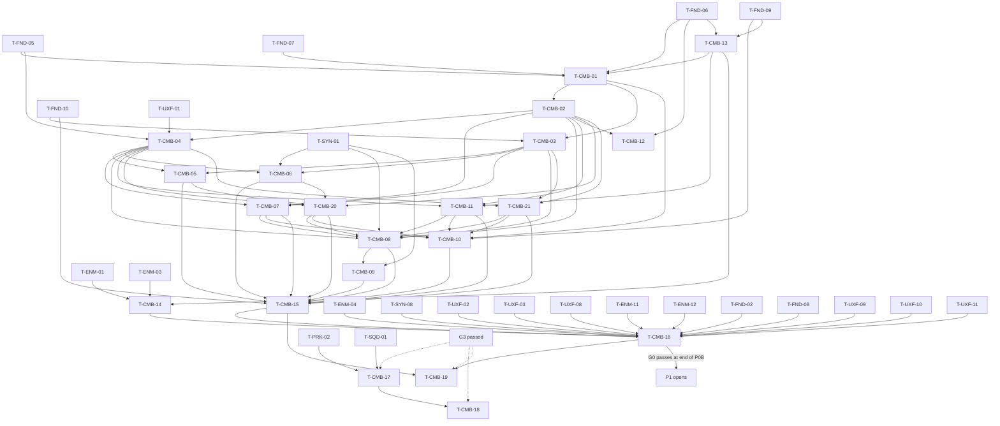

# Hero Combat (Warlord): Tasks

| | |
|---|---|
| Feature | CMB (`01-hero-combat`) |
| Spec / plan | [spec.md](spec.md), [technical-plan.md](technical-plan.md) |
| Phases | P0A/P0B (internal slices of P0; T-CMB-01…11, 13…16, 20…21) · P2 (T-CMB-12) · VS provisional (T-CMB-17…19) |
| Gate | G0 Combat Sandbox ([master plan §3](../main_implement_plan.md#gate-checklists)) |

## 1. Summary

P0A builds the playable combat feel slice; P0B completes defense, lock-on, stamina/feedback tuning and the G0 evidence. Recommended order: T-CMB-13 → 01 → 02/03 → 04 → 05/06/07/11 → 20/21 → P0A checkpoint → 08/10 → 09/14 → 15 → 16. External providers T-UXF-01 and T-SYN-01 must be ready when their dependent tasks start. G0 remains the single production gate, at the end of P0B; P0A does not open P1. Interact (T-CMB-12) waits for P2. VS tasks are provisional and must be re-planned after G3.

Foundation is implemented in `Source/CastleDefender` and `Content/CastleDefender`; reuse its combat, input, data, debug and test infrastructure. New CMB types/assets below remain proposals; `<Game>` means `CastleDefender`. Every task also follows the master plan Definition of Done (§8).

## 2. Task Overview

| ID | Task | Type | Phase | Priority | Dependencies | Status |
|---|---|---|---|---|---|---|
| T-CMB-01 | `AHeroCharacter` + `UHeroClassDefinition` + locomotion/sprint + third-person camera | GAMEPLAY | P0A | Must | T-FND-05, T-FND-06, T-FND-07, T-CMB-13 | Done |
| T-CMB-02 | `UHeroCombatComponent` action state machine, commitment and cancel windows via anim notify states | GAMEPLAY | P0A | Must | T-CMB-01 | Done |
| T-CMB-03 | `UStaminaComponent` + stamina rules | GAMEPLAY | P0A | Must | T-CMB-01, T-FND-10 | Done |
| T-CMB-04 | Melee hit detection → `FCombatHit` dispatch (`DeliverHit`, interceptor, one hit per target per swing) | GAMEPLAY | P0A | Must | T-CMB-02, T-FND-05, T-UXF-01 | Done |
| T-CMB-05 | Light attack 3-hit chain | GAMEPLAY | P0A | Must | T-CMB-03, T-CMB-04 | Done |
| T-CMB-06 | Heavy attack with high poise damage + Armor Broken hook | GAMEPLAY | P0A | Must | T-CMB-03, T-CMB-04, T-SYN-01 | Done |
| T-CMB-07 | Dodge with i-frames | GAMEPLAY | P0A | Must | T-CMB-02, T-CMB-03, T-CMB-04 | Done |
| T-CMB-08 | Block + block break | GAMEPLAY | P0B | Must | T-CMB-02, T-CMB-03, T-CMB-04, T-SYN-01, T-CMB-07, T-CMB-11, T-CMB-20, T-CMB-21 | Todo |
| T-CMB-09 | Parry + counter / vulnerability window | GAMEPLAY | P0B | Must | T-CMB-08, T-SYN-01 | Todo |
| T-CMB-10 | Lock-on | GAMEPLAY | P0B | Must | T-CMB-01, T-FND-09, T-CMB-07, T-CMB-11, T-CMB-20, T-CMB-21 | Todo |
| T-CMB-11 | Hero hit reactions, damage taken, death event | GAMEPLAY | P0A | Must | T-CMB-02, T-CMB-04, T-CMB-13 | Done |
| T-CMB-12 | Interact verb (`IInteractable`) | GAMEPLAY | P2 | Must | T-CMB-02, T-FND-06 | Todo |
| T-CMB-13 | `L_CombatSandbox` map + `BP_SandboxGameMode` | TOOLS | P0A | Must | T-FND-06, T-FND-09 | Done |
| T-CMB-14 | Sandbox enemy respawner + scenario presets | TOOLS | P0B | Must | T-CMB-13, T-ENM-01, T-ENM-03 | Todo |
| T-CMB-15 | Combat Automation/Functional Test suite (`L_Test_HeroCombat`) | QA | P0B | Must | T-CMB-05, T-CMB-06, T-CMB-07, T-CMB-08, T-CMB-09, T-CMB-10, T-CMB-11, T-CMB-20, T-CMB-21, T-FND-10 | Todo |
| T-CMB-16 | G0 gate playtest: Combat Sandbox | QA | P0B | Must | T-CMB-14, T-CMB-15, T-ENM-04, T-SYN-08, T-UXF-02, T-UXF-03, T-UXF-08, T-ENM-11, T-ENM-12, T-FND-02, T-FND-08, T-UXF-09, T-UXF-10, T-UXF-11 | Todo |
| T-CMB-17 | Warlord proximity buff (provisional) | GAMEPLAY | VS | Should | T-PRK-02, T-SQD-01 | Todo |
| T-CMB-18 | Rally / charge / hold-line design spike (provisional) | DESIGN | VS | Could | T-CMB-17 | Todo |
| T-CMB-19 | Combat animation polish with production animation (provisional) | ANIM | VS | Should | T-CMB-15, T-CMB-16 | Todo |
| T-CMB-20 | Bounded attack rotation assist | GAMEPLAY | P0A | Must | T-CMB-02, T-CMB-04, T-CMB-05, T-CMB-06 | Done |
| T-CMB-21 | Combat timing/state debugger + trace visualization | TOOLS | P0A | Must | T-CMB-02, T-CMB-03, T-CMB-04 | Done |

P0A uses T-CMB-03 for basic spend/reject/regen plumbing; blocking suppression and final stamina tuning land in T-CMB-08/15/16. T-CMB-04 establishes resolution/feedback separation early; P0B completes outcome coverage as defenses land. T-CMB-15 owns final suite acceptance, but each P0A task runs its own focused tests before the checkpoint. Keep every task `Todo` until implementation starts.

## 3. Detailed Tasks

**User acceptance (2026-10-06):** the user reported testing and accepting T-CMB-05/06/07/11/21 after their recorded Windows build, automation and PIE evidence. These tasks are Done for the existing P0 actions. Future assist/lock-on/Parry debugger integration remains owned by T-CMB-20/10/09/15; this sign-off does not pass the P0A checkpoint or G0.

## P0 (P0A / P0B internal delivery slices)

### T-CMB-01 — `AHeroCharacter` + `UHeroClassDefinition` + locomotion/sprint + third-person camera

**Type** GAMEPLAY · **Phase** P0A (master phase P0)

**Objective** A controllable Warlord pawn with camera-relative movement, sprint and an orbit camera, all tuned from `DA_HeroClass_Warlord`.

**Related Requirements** R-CMB-01, R-CMB-03, R-CMB-04, R-CMB-06, R-CMB-35, R-CMB-37; AC-CMB-01

**Dependencies** T-FND-05, T-FND-06, T-FND-07, T-CMB-13

**Implementation Notes**
- [x] Create `AHeroCharacter : ACharacter` with `USpringArmComponent` + `UCameraComponent`, `UHealthComponent`, `UCombatStateComponent`; team = Player (FND team interface).
- [x] Create `UHeroClassDefinition : UGameDefinition` (foundation §9; inherits `DisplayName`, required by validation) with only what this task uses: `MaxHealth`, `FHeroMovementData` (jog, sprint, turn rate), `FHeroCameraData` (arm length, lag). Later tasks add their own structs.
- [x] Register Primary Asset Type `HeroClassDefinition` in `DefaultGame.ini` (replace the commented example in `[/Script/Engine.AssetManagerSettings]`); `IsDataValid` calls `Super` and rejects `MaxHealth <= 0` and sprint ≤ jog.
- [x] Bind `IA_Move`, `IA_Look`, `IA_Sprint` (hold) in `SetupPlayerInputComponent`; movement camera-relative, orient rotation to movement. *Changed by the user (2026-10-05): by default the hero faces the camera yaw and strafes/backpedals (`bUseControllerDesiredRotation`, 8-way walk/jog blendspace). `Movement.bFaceCameraDirection = false` restores orient-to-movement.*
- [x] Sprint sets `MaxWalkSpeed` to sprint speed; release restores jog. Public `StopSprint()` for the combat component.
- [x] `ApplyTuning()` on BeginPlay copies init-time values (speeds, max HP, camera); cheat `ReloadHeroTuning` calls it again.
- [x] `BP_Hero_Warlord`: mannequin, sword + shield attached, weapon mesh tagged `Weapon` with sockets `Trace_Start` / `Trace_End`; `ABP_Warlord` with free locomotion blendspace + sprint. *P0 demo (user, 2026-10-05): the hero is unarmed until sword animations exist. `WeaponMesh` stays empty and the trace uses its fallback arc in front of the hero.*
- [x] Author `DA_HeroClass_Warlord` with spec §4.4 starting values; set `BP_SandboxGameMode` default pawn to `BP_Hero_Warlord`.

**Expected Files / Assets** `Source/<Game>/Hero/HeroCharacter.h/.cpp`, `HeroClassDefinition.h/.cpp`, `HeroCombatTypes.h`; `Content/<Game>/Hero/BP_Hero_Warlord`, `ABP_Warlord`, `BS_Warlord_Free`, `DA_HeroClass_Warlord`; `Content/<Game>/Core/Input/IA_Move`, `IA_Look`, `IA_Sprint`

**Test Case** PIE in `L_CombatSandbox` → WASD moves relative to camera; hold Shift → speed readout 700; set `SprintSpeed` 900 in the DA during PIE, run `ReloadHeroTuning` → readout 900.

**Acceptance Criteria**
- [x] AC-CMB-01 passes.
- [x] "Validate Data" on a copy of the DA with `MaxHealth = 0` reports an error.
- [x] Asset Manager lists the `HeroClassDefinition` type with `DA_HeroClass_Warlord` (first gameplay definition type; same check as the `TestGameDefinition` spec in Foundation).
- [x] No new log warnings in PIE.

**Verification** Passed: 7 Automation Specs in `CastleDefender.Combat.HeroClassDefinition.*` (total 22 passed); automated PIE verified in `L_CombatSandbox` (`Saved/combat-hero-pie.json`), dynamic tuning reload tested via `ReloadHeroTuning` (700 -> 900 -> 700); Win64 Development packaged and verified headless.

---

### T-CMB-02 — `UHeroCombatComponent` action state machine, commitment and cancel windows via anim notify states

**Type** GAMEPLAY · **Phase** P0A (master phase P0)

**Objective** One state machine that starts actions only when rules allow, keeps animation commitment, opens cancel windows from montage notifies and buffers early presses.

**Related Requirements** R-CMB-07, R-CMB-08, R-CMB-37, R-CMB-43, R-CMB-44, R-CMB-45, R-CMB-52; AC-CMB-20, AC-CMB-22, AC-CMB-03 (completed with T-CMB-07)

**Dependencies** T-CMB-01

**Implementation Notes**
- [x] Enums `EHeroAction` (Light, Heavy, Dodge, BlockStart, BlockEnd, Parry, Interact) and `EHeroActionState` (Idle, LightAttack, HeavyAttack, Dodge, Block, Parry, HitReact, Dead); Staggered is a derived label from `UCombatStateComponent::HasState`, never an owned action enum/timer in `HeroCombatTypes.h`.
- [x] `RequestAction(EHeroAction)`, `GetActionState()`, `GetActionTag()` (maps to `State.Hero.*`), `OnActionStateChanged`.
- [x] Pure function `FHeroActionRules::CanStart(State, AllowedByOpenWindow, bStaminaOk, bSharedStaggered)` behind `CanStartAction()`; Automation Spec covers every state × action pair in the cancel table (technical-plan §5.1).
- [x] Add `FCombatActionTiming` derived from montage windows, plus notify authoring for Startup/Active/Recovery, Chain, RotationAssist and optional InterruptResistance. Phase boundaries are authored once; the hit window supplies Active/Hit. Validate required phases/windows, ordering, bounds, duplicates and incompatible overlaps per action; optional windows may overlap when allowed. No duplicate timing constants.
- [x] Notify states `UAnimNotifyState_CancelWindow` (`TArray<EHeroAction> AllowedActions`), `_Invulnerable`, `_ParryWindow`: Begin/End call the owner's combat component (resolve the owner per callback; per-action window state belongs to the component, never a shared notify UObject).
- [x] `PlayActionMontage(Montage, State)` binds montage end/blend-out; on end or interrupt it force-closes open windows and returns to Idle if the montage still owns the state.
- [x] Input buffer: keep the latest rejected press with timestamp in the hero's dilated action clock (D-20); consume it when a window allows it or on Idle, if age ≤ `InputBufferTime` (new `FHeroInputData` in the DA). Clear on shared Staggered/Dead. Query shared Staggered on every start/interrupt decision, and bind its add/remove events to close windows/clear buffer; removal cannot revive a Dead hero.
- [x] Starting any action calls `StopSprint()`.
- [x] Refuse invalid actions before stamina spend or state changes; log the action/montage/window once using `LogGameCombat`. T-CMB-21 expands the debugger. Cheat `ReportHeroWindows` prints every DA montage's window start/end times (used by production-plan "notify windows match data" check).
- [x] For this task only, a temporary debug montage on Light proves the flow; T-CMB-05 replaces it.

**Expected Files / Assets** `Source/<Game>/Hero/HeroCombatComponent.h/.cpp`, `HeroCombatTypes.h`; `Source/<Game>/Combat/CombatActionTiming.h/.cpp`, timing/chain/rotation-assist/interrupt-resistance notify types; `Source/<Game>/Combat/AnimNotifyState_CancelWindow.*`, `AnimNotifyState_Invulnerable.*`, `AnimNotifyState_ParryWindow.*`; `Source/<Game>/Tests/HeroActionRules.spec.cpp`

**Test Case** Debug montage 1.0 s with cancel window 0.6–0.9 s allowing Light. Press Light at 0.45 s → buffered, runs at 0.6 s. Press at 0.30 s with buffer 0.2 s → dropped. `Montage_Stop` via cheat mid-montage → state Idle, no window left open.

**Acceptance Criteria**
- [x] Normal montage end returns to Idle; interruption closes owned windows without overwriting a newer HitReact/Dead state or bypassing the shared Staggered gate.
- [x] `HeroActionRules` Spec passes.
- [x] Buffer behaves as in the test case, including actor hit stop (D-20).
- [x] AC-CMB-20 timing validation passes for available actions; Dodge/Parry coverage completes in T-CMB-07/09.
- [x] AC-CMB-22: shared Staggered rejects actions until the owning component removes it; test add/remove against the existing skeleton here, then timed expiry with T-SYN-01 in T-CMB-08/15. CMB has no independent expiry timer.

**Verification** Automation Spec `CastleDefender.Combat.Hero.ActionRules`; PIE with `game.debug.Combat 1`.

---

### T-CMB-03 — `UStaminaComponent` + stamina rules

**Type** GAMEPLAY · **Phase** P0A (master phase P0)

**Objective** P0A basic stamina plumbing that gates Dodge, Block and Heavy, regenerates after a delay and tells the HUD when it changes or when a spend fails.

**Related Requirements** R-CMB-05, R-CMB-10, R-CMB-11, R-CMB-12; AC-CMB-15

**Dependencies** T-CMB-01, T-FND-10

**Implementation Notes**
- [x] `FStaminaConfig` in the DA: `Max`, `RegenDelay`, `RegenRate`, `BlockingRegenMultiplier`, `SprintDrainPerSecond`.
- [x] Pure struct `FStaminaState` with `TrySpend`, `ApplyDamage`, `Advance` (technical-plan §5.2).
- [x] Component inits from DA; Tick enabled only while below max or sprint-draining; delegates `OnStaminaChanged(Current, Max)`, `OnStaminaSpendFailed(Cost)`, `OnStaminaDepleted`.
- [x] `SetBlocking(bool)` for the regen multiplier (used by T-CMB-08); post-block suppression is implemented/tested with T-CMB-08. Stamina uses the hero clock (D-20); shared state expiry uses world game time.
- [x] If `SprintDrainPerSecond > 0` and stamina hits 0, stop sprint (default drain 0).
- [x] Combat component calls `TrySpend` before costed actions; on failure plays `Feedback.Hero.StaminaInsufficient` and does not buffer.
- [x] Wire FND cheat `InfiniteStamina`. Add stamina value to `game.debug.Combat`.

**Expected Files / Assets** `Source/<Game>/Hero/StaminaComponent.h/.cpp`; `Source/<Game>/Tests/StaminaRules.spec.cpp`

**Test Case** Spec with Max 100, delay 0.8, rate 30: spend 30 → 70; spend 80 → rejected, 70; advance to 0.5 s → 70; advance to 1.8 s → 100 (clamped); same with blocking → 85; `ApplyDamage(200)` → 0 and returns depleted.

**Acceptance Criteria**
- [x] AC-CMB-15 passes.
- [x] Component tick is disabled when stamina is full (check with debug output).
- [x] `InfiniteStamina` keeps stamina at max.

**Verification** Automation Spec `CastleDefender.Combat.Hero.Stamina`; PIE check of tick state and cheat.

---

### T-CMB-04 — Melee hit detection → `FCombatHit` dispatch

**Type** GAMEPLAY · **Phase** P0A (master phase P0)

**Objective** Montage hit windows produce traces; each hostile target is hit once per swing; every hit in the game goes through `UCombatLibrary::DeliverHit`, which lets the target intercept first.

**Related Requirements** R-CMB-17, R-CMB-18, R-CMB-34, R-CMB-53; AC-CMB-04, AC-CMB-13, AC-CMB-23

**Dependencies** T-CMB-02, T-FND-05, T-UXF-01

**Implementation Notes**
- [x] `ECombatHitResult` {Ignored, Evaded, Parried, Blocked, BlockBroken, Hit, Killed} and `ICombatHitInterceptor::InterceptHit(FCombatHit&)` in `Combat/`.
- [x] Reuse/extend existing `CombatTypes.h` with `FCombatResolutionEvent` and data-defined interrupt metadata for R-CMB-51 (default resistance off, no implicit Heavy immunity); record shared contracts in master plan §8a.
- [x] `UCombatLibrary::DeliverHit(Target, Hit)` as in technical-plan §4.2: hostile + alive check (team attitude via FND team interface), interceptors, `UHealthComponent::ApplyHit`, `UCombatStateComponent::ApplyPoiseDamage`, `ApplyState` for `AppliedStates`, exactly one resolution event per attempt and, only when presentation is required, one matching `UFeedbackSubsystem::Play` with context (instigator, target, location, direction, `bIsHeavy`, `bTargetArmored`).
- [x] `UCombatLibrary::IsInFrontArc(Defender, AttackerLocation, ArcDegrees)` + Automation Spec.
- [x] `UMeleeTraceComponent`: `SetPendingAttack(Template, Radius)` (called by whoever starts the attack), `BeginHitWindow()` / `EndHitWindow()`; per tick in window, sphere sweeps at data-authored sample points along the blade from previous to current socket positions (configurable object types, Pawn in P0; ENM adds Structure in P2 without a second trace system); hit set reset per swing/action token, never per frame; ignore owner; `OnHitResolved(Target, Result)`.
- [x] `UAnimNotifyState_CombatHitWindow` calls the owner's `UMeleeTraceComponent` Begin/End.
- [x] DeliverHit publishes `OnCombatResolved(FCombatResolutionEvent)` on the participating combat components (outgoing/incoming roles); a unique resolution ID lets telemetry deduplicate self/both-role subscriptions. No global event bus. `OnHitLanded(Target, Result)` remains a landed-hit observer, not a second resolution/feedback producer.
- [x] Cheat `DebugHitHero <Damage> <Delay> <bFromFront>`: a hidden test instigator (hostile team, has `UCombatStateComponent`) delivers a hit to the hero after the delay. Used by T-CMB-07…11 and T-CMB-15.
- [x] `game.debug.CombatTrace 1` draws sweeps, hit points and the per-swing already-hit set (T-CMB-21); resolution logging includes Evaded/Ignored with zero feedback when appropriate.
- [x] Document in the header comment: ENM, SQD and DEF must deliver hits through `DeliverHit`.

**Expected Files / Assets** `Source/<Game>/Combat/CombatLibrary.h/.cpp`, `CombatHitInterceptor.h`, `MeleeTraceComponent.h/.cpp`, `AnimNotifyState_CombatHitWindow.h/.cpp`, existing `CombatTypes.h`; `Source/<Game>/Tests/CombatArc.spec.cpp`, `CombatResolution.spec.cpp`

**Test Case** FND hostile dummy in front; debug swing whose blade overlaps it for 5 frames → dummy HP −Damage once, one feedback log line. Two hostile dummies in the arc → each once. Ally-team dummy → HP unchanged, result Ignored.

**Acceptance Criteria**
- [x] AC-CMB-04 passes.
- [x] AC-CMB-13/23 dispatcher contract verified with test interceptors here; actual Dodge/Block/Parry/HeroDamaged integration completes in T-CMB-07/08/09/11/15: one resolution record per attempt; one feedback for a presentation outcome, zero allowed for Evaded/Ignored; no duplicate HeroDamaged feedback from OnDamaged.
- [x] `CombatArc` Spec passes (0°, 89°, 91°, 180° for a generic 180° arc, plus inside/on/outside ±70° for the Warlord 140° default).

**Verification** Passed: 11 Automation Specs in `CastleDefender.Combat.Arc.*` and `CastleDefender.Combat.Resolution.*` (total 49 passed, 0 failed); automated PIE verified in `L_CombatSandbox` (`Saved/combat-hero-pie.json`: MeleeTraceComponent valid, window activate/close verified, `DebugHitHero` cheat delivered 25 damage -> 175 HP, `DeliverHit` on spawned dummy delivered 30 damage -> 70 HP); Win64 Development packaged and verified headless.

---

### T-CMB-05 — Light attack 3-hit chain

**Type** GAMEPLAY · **Phase** P0A (master phase P0)

**Objective** Fast 3-hit chain driven by data and montage windows.

**Related Requirements** R-CMB-09, R-CMB-13, R-CMB-14, R-CMB-43, R-CMB-45; AC-CMB-02, AC-CMB-20

**Dependencies** T-CMB-03, T-CMB-04

**Implementation Notes**
- [x] `FHeroAttackData` (montage, damage, poise damage, stamina cost, trace radius, `AppliedStates`, `StateDuration`); `LightChain` array of 3 in the DA with spec values.
- [x] `AM_Warlord_Light_01..03`: Startup/Active/Recovery, one hit window each, Chain windows for hits 1–2 and optional RotationAssist windows; cancel windows per technical-plan §5.1 (hits 1–2 allow Light, Heavy, Dodge, Block; hit 3 allows Dodge, Block).
- [x] Chain logic: Light from Idle → index 0; Light inside an authored Chain window allowing Light while in LightAttack → index + 1 (max 2); any other action, Idle or index 2 finished → reset to 0.
- [x] Build `FCombatHit` from data (SourceLayer Hero, `Damage.Physical`, `bIsHeavy = false`) and pass it to `SetPendingAttack`.
- [x] `TrySpend(LightChain[i].StaminaCost)` (default 0).
- [x] `IsDataValid`: exactly 3 entries, montages set, each has one hit window.
- [x] Remove the T-CMB-02 debug montage. No separate debug montage was present in the checkout; Light now requires its definition montage.

**Expected Files / Assets** `HeroCombatTypes.h` (`FHeroAttackData`), `HeroCombatComponent.cpp`; `Content/<Game>/Hero/AM_Warlord_Light_01`, `_02`, `_03`

**Test Case** Hostile dummy; press Light 3 times in rhythm → damage 10, 10, 14 and chain index 0, 1, 2 in debug; wait 1 s, press Light → index 0.

**Acceptance Criteria**
- [x] AC-CMB-02 passes (user visual/input acceptance, 2026-10-06).
- [x] Data validation catches a missing third entry.

**Verification** PIE; `FT_LightChain` in T-CMB-15.

**Review evidence (2026-10-04, Codex):** Editor and game Development builds pass; default automation gate passes 62/62 with editor/runner exit 0. Scripted PIE on `L_CombatSandbox` uses a transient TutorialTPP mesh/animation instance and the actual montage notifies: indices 0 -> 1 -> 2, dummy health 100 -> 90 -> 80 -> 66, reset/restart at index 0. Tests cover real montage completion, Dodge stopping the previous montage, chain-window expiry, invalid timing refusal before stamina spend and Light data validation. Final command evidence is in `progress.md`.

**Placeholder content (2026-10-05, Claude Code):** `BP_Hero_Warlord` now uses `SKM_Manny_Simple` + `ABP_Warlord` (copy of the template `ABP_Unarmed`: locomotion + `DefaultSlot`, root motion from montages only). `AM_Warlord_Light_01..03` play the template's unarmed `MM_Attack_01..03` (hit windows 0.28–0.45 / 0.28–0.46 / 0.25–0.60 s, cancels after them). The first version attached a stretched-cube fist blade; it read as a broken mesh, so at the user's request the hero is unarmed for the P0 demo. `WeaponMesh` has no mesh, so `UMeleeTraceComponent` sweeps its fallback arc (50–180 cm in front of the hero). Rendered scripted PIE with real sweeps (no direct `TryHitTarget`) and screenshots: chain 0→1→2, dummy 100→90→80→66. The template ABP runs the `CR_Mannequin_FootIK` Control Rig after `DefaultSlot`, which pinned Light 3's leg motion to the ground. `ABP_Warlord` is now parented to `UHeroAnimInstance`, whose `FootIKAlpha` (fades over `FootIKBlendTime` 0.15 s) drives that node's Alpha: 0 while a montage is active, 1 in locomotion. Assets: `Tools/create_hero_assets.bat`; source and license: `Placeholder/LICENSES.md`.

**Still required for Done:** rendered PIE with real keyboard/mouse input on `L_CombatSandbox`: readable swings, trace sweeps under `game.debug.CombatTrace 1`, chain reset after waiting, and no new warnings. Then sign off AC-CMB-02. `FT_LightChain` remains owned by T-CMB-15. Replace the unarmed placeholder with sword clips in T-CMB-19 (or sooner, if sword animations are imported).

---

### T-CMB-06 — Heavy attack with high poise damage + Armor Broken hook

**Type** GAMEPLAY · **Phase** P0A (master phase P0)

**Objective** Slow, readable heavy hit with high damage and poise damage that carries a data list of states to apply (empty in P0; Armor Broken from P1 via T-SYN-02).

**Related Requirements** R-CMB-15, R-CMB-16, R-CMB-38, R-CMB-43, R-CMB-45, R-CMB-51; AC-CMB-05, AC-CMB-20, AC-CMB-25

**Dependencies** T-CMB-03, T-CMB-04, T-SYN-01

**Implementation Notes**
- [x] `Heavy` `FHeroAttackData` in the DA: damage 30, poise 40, stamina 25, `AppliedStates` empty.
- [x] `AM_Warlord_Heavy`: authored readable Startup/Active/Recovery (provisional wind-up ~0.3 s, tune in the montage; no hard-coded minimum) (check with `ReportHeroWindows`), one hit window, late cancel window allowing Dodge.
- [x] `RequestAction(Heavy)`: `TrySpend` → play; `bIsHeavy = true`; copy `AppliedStates` and `StateDuration` into `FCombatHit`.
- [x] `IsDataValid`: Heavy damage and poise damage greater than every Light entry; every Light stamina cost < Heavy stamina cost.
- [x] Per-action interrupt-resistance config defaults disabled. An authored committed window may enable it in a test-only DA; compare incoming hit strength/category without suppressing damage or overriding shared Staggered/Dead. G0 decides whether production Heavy enables it.
- [x] Hook check: in a test copy of the DA set `AppliedStates = {State.Combat.ArmorBroken}`; after a Heavy hit the target's `UCombatStateComponent::HasState` returns true (state effect itself is T-SYN-02).

**Expected Files / Assets** `HeroCombatComponent.cpp`; `Content/<Game>/Hero/AM_Warlord_Heavy`; `DA_HeroClass_Warlord` (Heavy entry)

**Test Case** Dummy with MaxPoise 50 (`FCombatStateConfig`): Heavy → poise 10 (`game.debug.CombatStates`), Light → 5, Light → Staggered applied. Stamina 20 → Heavy refused with the insufficient cue.

**Acceptance Criteria**
- [x] AC-CMB-05 passes.
- [x] Hook check passes.
- [x] AC-CMB-25 integrated with T-CMB-11/15: default Heavy interrupts; test-only resistance lets a below-threshold hit damage without HitReact and an above-threshold hit interrupt.
- [x] Data validation catches a Heavy weaker than a Light.

**Verification** PIE with `game.debug.CombatStates 1`; T-CMB-15.

**Progress (2026-10-05, Claude Code, started at the user's request before T-SYN-01 is Done):**
- **Bug fixed:** Heavy used to set `HeavyAttack` with no montage, so nothing ever ended the state and Light was blocked. Now `ValidateHeavyAttack` gates the start (R-CMB-45): an invalid Heavy refuses, logs once and spends nothing.
- **Content:** `AM_Warlord_Heavy` plays the template's `MM_ChargedAttack` from 0.55 s (1.28 s total). Hit window 0.45–0.67 s during the 150 cm root-motion lunge; Dodge-only cancel 0.95–1.25 s. Authored by `Tools/create_hero_assets.bat`.
- **Tests:** `CastleDefender.Combat.Hero.Heavy` (3 specs).
- **Rendered PIE with injected `IA_HeavyAttack`:** stamina 100→75, dummy 100→70, Idle at 1.3 s; Light afterwards hits (70→60).
- **Open until T-SYN-01 (now closed, see below).**

**Progress (2026-10-05, Claude Code, after merging T-SYN-01 into `feat/01-hero-combat`):** Review.
- `DeliverHit` now passes `FCombatHit.StateDuration` to `ApplyState` (R-SYN-08), so an authored Heavy state uses its hit duration.
- New `Combat.Hero.Heavy` cases: Heavy then Light payloads break a MaxPoise 50 `ATestDummy` in exactly the number of Lights the DA implies, with the hero as Staggered instigator (AC-CMB-05; the dummy stands in for the P0 melee enemy until T-ENM-01/03); a test copy of the DA with `AppliedStates = {ArmorBroken}` puts Armor Broken on the target for the hit duration (hook check); Heavy at 20 stamina is refused, stays Idle, spends nothing and fires `OnStaminaSpendFailed` once.
- Interrupt resistance (AC-CMB-25) was already data-driven and off by default; `HeroHitReaction` covers default-off interrupt, a below-threshold resisted hit that still deals damage, and an equal-threshold interrupt, now on the real Heavy montage. T-CMB-15 adds the final integrated coverage.
- Verified: editor and game builds; `Tools/run_tests.bat` 107/107, editor exit 0 (`Saved/cmb06-tests.log`).
- Left for the user: rendered PIE on `L_CombatSandbox` with `game.debug.CombatStates 1`: `SpawnTestDummy`, Heavy (poise 50 → 10), Light, Light → Staggered.

---

### T-CMB-07 — Dodge with i-frames

**Type** GAMEPLAY · **Phase** P0A (master phase P0)

**Objective** Directional dodge that costs stamina, ignores hits during its i-frame window and cannot be chained into another dodge.

**Related Requirements** R-CMB-19, R-CMB-20, R-CMB-21, R-CMB-43, R-CMB-45, R-CMB-53; AC-CMB-03, AC-CMB-06, AC-CMB-07, AC-CMB-20, AC-CMB-23

**Dependencies** T-CMB-02, T-CMB-03, T-CMB-04

**Implementation Notes**
- [x] `FHeroDodgeData`: montages F/B/L/R, stamina cost, root motion scale.
- [ ] Direction: camera-relative input. Not locked: rotate the hero to input direction and play F. Locked: pick the closest of F/B/L/R relative to facing. No input: B. *Changed by the user (2026-10-05): the hero faces the camera yaw (`Movement.bFaceCameraDirection`, default true), so the free camera also picks F/B/L/R relative to facing without turning (S + Dodge = B). While L/R are forward-dash placeholders, `Dodge.bSideClipsFaceInput` turns the hero toward the input for side dodges only. With `bFaceCameraDirection` false, the original turn-and-play-F rule applies. Rendered PIE with injected Enhanced Input: S+Space plays `AM_Warlord_Dodge_B` with yaw unchanged, about 365 cm back; A+Space turns -90°, dashes 330 cm left, then turns back to the camera.*
- [x] `_Invulnerable` window sets `bInvulnerable`; `InterceptHit` returns Evaded while set (one combat-resolution event; no feedback required).
- [x] Recovery cancel window allows Light, Heavy, Block, not Dodge (no dodge chaining).
- [x] Distance via root motion; scale with `SetAnimRootMotionTranslationScale` (verify API in UE docs for the pinned version).
- [x] Cost check through `TrySpend`; failure → cue, no start.

**Expected Files / Assets** `HeroCombatComponent.cpp`; `Content/<Game>/Hero/AM_Warlord_Dodge_F`, `_B`, `_L`, `_R`

**Test Case** `DebugHitHero 20 0.3 1`, start Dodge so the hit lands inside the i-frames → HP unchanged; land it after the window → HP −20. Stamina 15 (cost 20) → Dodge refused. Dodge during Light hit 1 (pressed early) → buffered and runs at the cancel window.

**Acceptance Criteria**
- [x] AC-CMB-06, AC-CMB-07 pass; AC-CMB-03 passes with Light → Dodge (user acceptance, 2026-10-06; locked integration stays with T-CMB-10).
- [x] Two Dodge presses in a row produce one dodge, then the second only after recovery ends (recorded tests and user acceptance).

**Verification** PIE; `FT_DodgeIFrames` in T-CMB-15.

**Review evidence (2026-10-04, Codex):** six Dodge specs plus the existing gate pass (68 total). Scripted headless PIE verifies real i-frame notifies evade a 20-damage hit, a hit after the window applies 20 damage, stamina is 80 after one Dodge and 15-stamina Dodge is refused. Recovery cannot cancel into Dodge; completion restores Idle and the previous root-motion scale. Input-buffer age uses owner-dilated component time and ticks only while buffered. `Dodge.StaminaCost` is authoritative; the earlier scalar remains only for legacy asset compatibility.

**Placeholder content (2026-10-05, Claude Code):** all four Dodge montages use the template `MM_Dash` (clip 0–0.8 s fitted to 0.6 s, i-frames and recovery cancel unchanged); B plays it reversed; `Dodge.RootMotionScale` 0.4 [TUNABLE]. Scripted PIE: zero-input Dodge moves ~225 cm backward by root motion. The template has no side steps, so L/R reuse the forward dash. Real side-step clips are needed before T-CMB-10 selects L/R.

**Pending integration:** rendered PIE with real input to verify AC-CMB-07 (input-direction dodge and backward dodge with no input) and readable i-frame timing. Locked F/B/L/R selection is pure-tested; its runtime integration and real side-step clips belong to T-CMB-10. Do not mark Done from timing-only tests.

---

### T-CMB-08 — Block + block break

**Type** GAMEPLAY · **Phase** P0B (master phase P0)

**Objective** Held block that reduces frontal damage, turns force into stamina damage and breaks into Staggered at 0 stamina.

**Related Requirements** R-CMB-12, R-CMB-22, R-CMB-23, R-CMB-24, R-CMB-49, R-CMB-52; AC-CMB-08, AC-CMB-09, AC-CMB-22

**Dependencies** T-CMB-02, T-CMB-03, T-CMB-04, T-SYN-01, T-CMB-07, T-CMB-11, T-CMB-20, T-CMB-21

**Implementation Notes**
- [ ] `FHeroBlockData`: `DamageReduction`, `StaminaPerDamage`, `ArcDegrees` (140° default), `BlockRegenSuppressAfterHit` (0.6 s default), `BlockBreakStaggerDuration`, `MoveSpeedMultiplier`, block-hit and block-break montages.
- [ ] `IA_Block` hold: Started → Block (if allowed), Completed → Idle. ABP upper-body guard pose from a component bool; move speed × multiplier; `Stamina.SetBlocking(true/false)`.
- [ ] `InterceptHit` while Block and `IsInFrontArc`: `Hit.Damage *= (1 − DamageReduction)`; `ApplyDamage(original × StaminaPerDamage)`; if depleted → `ApplyState(State.Combat.Staggered, BlockBreakStaggerDuration, self)`, play break montage, return BlockBroken; else play block-hit montage, return Blocked.
- [ ] Reuse T-CMB-02 shared-state hooks: block break drops guard and applies shared Staggered via SYN; never start a CMB stagger timer. Its debug/presentation label derives from `HasState`.
- [ ] Every absorbed hit restarts blocking-regen suppression using `.Block.BlockRegenSuppressAfterHit`; normal regen delay and suppression must both permit blocking regen. Test repeated hits restarting the delay and post-suppression regen at ×0.5.
- [ ] Hits outside the arc fall through to normal damage.

**Expected Files / Assets** `HeroCombatComponent.cpp`, `ABP_Warlord` guard layer; `Content/<Game>/Hero/AM_Warlord_BlockHit`, `AM_Warlord_BlockBreak`

**Test Case** Stamina 100, hold Block, `DebugHitHero 20 0 1` → HP −4, stamina 80, `Feedback.Combat.Block`. `DebugHitHero 20 0 0` (behind) → HP −20, stamina unchanged. Stamina set to 10, frontal 20 → HP −4, block break, Staggered 1.2 s, all inputs ignored until it ends.

**Acceptance Criteria**
- [ ] AC-CMB-08 and AC-CMB-09 pass.
- [ ] Releasing Block returns to Idle in the same frame.

**Verification** PIE; `FT_BlockReduce`, `FT_BlockBreak` in T-CMB-15.

---

### T-CMB-09 — Parry + counter / vulnerability window

**Type** GAMEPLAY · **Phase** P0B (master phase P0)

**Objective** Narrow parry with a punishable whiff; success negates the hit, deals parry poise damage to the attacker, opens a Counter Window and raises `OnParrySucceeded`.

**Related Requirements** R-CMB-25, R-CMB-26, R-CMB-27, R-CMB-28, R-CMB-43, R-CMB-45, R-CMB-50; AC-CMB-10, AC-CMB-20, AC-CMB-24

**Dependencies** T-CMB-08, T-SYN-01

**Implementation Notes**
- [ ] `FHeroParryData`: montage, stamina cost (0), `ParryPoiseDamage`, `CounterWindow`, `CounterDamageMultiplier`, optional `CounterMontage`.
- [ ] `IA_Parry` → state Parry → `AM_Warlord_Parry` with an early `_ParryWindow` and no cancel window before the end of recovery (whiff = no block, no dodge).
- [ ] `InterceptHit` while parry window open, not yet consumed, and `IsInFrontArc` (block arc): atomically mark this action consumed before any callbacks or poise damage; instigator's `UCombatStateComponent::ApplyPoiseDamage(ParryPoiseDamage, Hero)`; return Parried; on the first success stop the parry montage, go Idle, start the Counter Window on the hero's dilated clock (D-20), broadcast `OnParrySucceeded(Attacker)`.
- [ ] Reset consumed-parry only when a new Parry action starts. Further same-frame/reentrant/later hits resolve normally; no automatic Block takeover, and no baseline multi-parry.
- [ ] Counter: the first Light/Heavy started inside the Counter Window plays `CounterMontage` if set; its hit has `bIsParryCounter = true` and damage × `CounterDamageMultiplier`; the window ends after that hit or on timeout.
- [ ] Note the NEW-CMB-01 reading in the header comment; G0 decides.

**Expected Files / Assets** `HeroCombatComponent.cpp`; `Content/<Game>/Hero/AM_Warlord_Parry`, `AM_Warlord_ParryCounter` (optional)

**Test Case** `DebugHitHero 20 0.1 1`, Parry at t=0 → HP unchanged, test instigator poise −60, `Feedback.Combat.Parry` logged, `OnParrySucceeded` fired; Light within 1 s → 15 damage flagged counter. Parry with no hit, press Block during recovery → ignored. Against the ENM P0 enemy (MaxPoise 50) a parry staggers it.

**Acceptance Criteria**
- [ ] AC-CMB-10 passes.
- [ ] AC-CMB-24: first of two same-frame or successive hostile hits is parried, OnParrySucceeded fires once, second resolves normally; repeat with reentrant callbacks. Counter/buffer windows survive actor hit stop.

**Verification** PIE with `DebugHitHero` and with the ENM enemy (after T-ENM-03); `FT_Parry` in T-CMB-15.

---

### T-CMB-10 — Lock-on

**Type** GAMEPLAY · **Phase** P0B (master phase P0)

**Objective** Lock onto the best hostile target, switch left/right, keep it framed, and release or retarget by rule.

**Related Requirements** R-CMB-29, R-CMB-30, R-CMB-31; AC-CMB-11

**Dependencies** T-CMB-01, T-FND-09, T-CMB-07, T-CMB-11, T-CMB-20, T-CMB-21

**Implementation Notes**
- [ ] `FHeroLockOnData` in the DA: `Range`, `BreakDistance`, `LOSGraceTime`.
- [ ] `ULockOnComponent::Toggle()`: overlap sphere (Pawn) within Range → hostile, alive (`UHealthComponent`), LOS (Visibility trace to socket `LockOn`, else capsule centre) → lowest angle to camera forward, then distance.
- [ ] `Switch(Direction)`: project candidates to screen, choose nearest on that side.
- [ ] Validity timer 0.15 s: distance > BreakDistance → release; LOS lost longer than grace → release.
- [ ] Bind target `OnDeath` / `OnDestroyed` → acquire nearest valid in range, else release.
- [ ] While locked: control rotation interpolates to the target (yaw, clamped pitch); `bUseControllerDesiredRotation` on, orient-to-movement off; strafe blendspace in `ABP_Warlord`. Sprint and Dodge use input direction. Restore on release.
- [ ] `IA_LockOn` (toggle), `IA_LockOnSwitch` (mouse wheel axis); mouse look does not rotate the camera while locked.
- [ ] `WBP_LockOnMarker` projects the marker on the target; ticks only while locked; added to `WBP_GameHUD` if T-UXF-02 is done, else added to the viewport directly.
- [ ] `OnLockOnTargetChanged` delegate. Integrate T-CMB-20 assist: locked target preferred only if valid and inside assist limits; locked facing cannot bypass the attack-window rotation cap. Verify AC-CMB-21 locked preference.

**Expected Files / Assets** `Source/<Game>/Hero/LockOnComponent.h/.cpp`; `Content/<Game>/Hero/BS_Warlord_Strafe`; `Content/<Game>/UI/WBP_LockOnMarker`; `IA_LockOn`, `IA_LockOnSwitch`

**Test Case** Three hostile dummies 5 m away at left / centre / right: lock → centre; wheel up → right; walk 21 m away → release; lock, kill target with cheat → lock moves to nearest remaining; put a pillar between hero and target for 2 s → release after 1 s.

**Acceptance Criteria**
- [ ] AC-CMB-11 passes.
- [ ] Lock-on never selects an ally or a dead actor.

**Verification** PIE; `FT_LockOnBreak` in T-CMB-15.

---

### T-CMB-11 — Hero hit reactions, damage taken, death event

**Type** GAMEPLAY · **Phase** P0A (master phase P0)

**Objective** Unblocked hits interrupt the hero with a directional reaction; death raises one event and the sandbox respawns the hero.

**Related Requirements** R-CMB-32, R-CMB-33, R-CMB-51, R-CMB-52; AC-CMB-12, AC-CMB-22, AC-CMB-25

**Dependencies** T-CMB-02, T-CMB-04, T-CMB-13

**Implementation Notes**
- [x] `FHeroHitReactData`: front and back montages; death montage.
- [x] Bind own `UHealthComponent::OnDamaged`: if alive and the hit was not blocked and active authored resistance does not resist this hit → stop the current montage (windows close), play front/back by hit direction, state HitReact. DeliverHit owns the hit feedback decision; OnDamaged does not replay HeroDamaged. Resistance never blocks HP loss or death. HitReact late cancel window allows Dodge.
- [ ] Bind `OnDeath`: state Dead, clear buffer, release lock-on, ignore input, death montage, `Feedback.Hero.Death`, broadcast `AHeroCharacter::OnHeroDeath` once.
- [x] `BP_SandboxGameMode` binds `OnHeroDeath` → after `RespawnDelay` (3 s) destroy pawn and `RestartPlayer`. Comment: sandbox only, CSM T-CSM-01 replaces it in P3.
- [x] FND cheat `KillHero` exercises the path.

**Expected Files / Assets** `HeroCombatComponent.cpp`, `HeroCharacter.cpp`; `Content/<Game>/Hero/AM_Warlord_HitReact_F`, `_B`, `AM_Warlord_Death`; `BP_SandboxGameMode` (respawn graph)

**Test Case** During Light hit 1, `DebugHitHero 20 0 0` → swing stops, back reaction plays, no further hit from that swing. `KillHero` → `OnHeroDeath` count = 1, inputs ignored, respawn after 3 s with full HP and stamina.

**Acceptance Criteria**
- [x] AC-CMB-12 passes for the existing P0 actions (user acceptance, 2026-10-06; lock-on release stays with T-CMB-10).
- [x] Blocked hits never play the hit reaction (recorded interception tests; full Block integration stays with T-CMB-08/15).

**Verification** PIE; `FT_HeroDeath` in T-CMB-15.

**Review evidence (2026-10-04, Codex):** five registered-pawn/lifecycle specs pass for front/back selection, completion/restart, blocked-hit suppression, late Dodge gating, resistance thresholds, damage preservation, shared Staggered gating, once-only death/feedback, committed Dead state during observer callbacks and missing-animation Dead-state preservation. Default gate passes 74/74. Scripted PIE verifies back HitReact, actual late-cancel notifies, KillHero and two successive three-second respawns (3.004/3.003 world seconds) with HP 200, stamina 100 and Idle. The saved sandbox Blueprint binds each newly possessed pawn from OnRestartPlayer and owns RespawnDelay; the authoring tool preserves custom graphs/tuning. OnDamaged does not replay hit feedback. FCombatHit.bWasBlocked is set by DeliverHit before damage delegates.

**Placeholder content (2026-10-05, Claude Code):** HitReact F/B use the template `MM_HitReact_Front_Med_01` / `MM_HitReact_Back_Med_01` (rifle-pose clips; late Dodge-only cancel 0.50–0.75 / 0.55–0.85 s). Death uses `MM_Death_Front_01` with auto blend-out off, so the pose holds until respawn. Scripted PIE: front hit → HitReact_F, HP 200→180, Idle after the montage; KillHero → Dead with the death montage held, respawn after 3 s at HP 200.

**Pending integration:** rendered check that the reactions and death read clearly. The death feedback request producer exists; UXF T-UXF-01/03 owns playback/rows. Lock-on release waits for T-CMB-10. Verify rendered death presentation and real input, then record AC-CMB-12; FT_HeroDeath stays with T-CMB-15. The timer/reset behavior is implemented and verified, so no manual respawn graph authoring remains.

---

### T-CMB-13 — `L_CombatSandbox` map + `BP_SandboxGameMode`

**Type** TOOLS · **Phase** P0A (master phase P0)

**Objective** The P0 test map with game mode, test dummies and a readable layout for camera, lock-on and LOS checks.

**Related Requirements** R-CMB-02, §32 P0; supports AC-CMB-01…12

**Dependencies** T-FND-06, T-FND-09

**Implementation Notes**
- [x] `BP_SandboxGameMode`: Blueprint child of `ASandboxGameMode` if FND created it, else of `AGameModeBase`; PlayerController = `AHeroPlayerController`; placeholder pawn until T-CMB-01.
- [x] `L_CombatSandbox`: flat ~60 × 60 m arena, a few pillars/cover blocks (LOS), one ramp, one wall (camera collision), PlayerStart, simple lighting, NavMesh bounds (needed by ENM).
- [x] Place 3 FND test dummies: two hostile, one ally team (friendly-fire checks).
- [x] "Tuning kiosk" (production-plan): a text render actor listing combat cheats and the active DA name. Plain text, no UI.
- [x] World Settings GameMode override; set as editor and game default map for P0.

**Expected Files / Assets** `Content/<Game>/Maps/L_CombatSandbox`; `Content/<Game>/Core/BP_SandboxGameMode`

**Test Case** Open map, PIE → pawn spawns at PlayerStart, 3 dummies present, `SpawnTestDummy` adds a fourth.

**Acceptance Criteria**
- [x] Map loads with no errors or warnings.
- [x] Packaged Development build opens the map (T-FND-08 pipeline).

**Verification** Scripted PIE verified in `Saved/combat-sandbox-pie.json`: pawn at PlayerStart (0, -1500, 100), 3 initial dummies (2 hostile team 1, 1 ally team 0), `SpawnTestDummy` adds 4th dummy; packaged Development build clean boot and load in `Saved/combat-sandbox-packaged.log`. Tooling: `Tools/create_combat_sandbox.bat`.

---

### T-CMB-14 — Sandbox enemy respawner + scenario presets

**Type** TOOLS · **Phase** P0B (master phase P0)

**Objective** Keep the P0 melee enemy coming back so one enemy can carry a 3–5 minute session (§36).

**Related Requirements** R-CMB-02; G0 "one enemy enough for 3–5 minutes"

**Dependencies** T-CMB-13, T-ENM-01, T-ENM-03

**Implementation Notes**
- [ ] `BP_SandboxEnemyRespawner`: enemy class (default ENM P0 melee enemy), `Count` (1–3), `RespawnDelay` (5 s), spawn radius; binds each enemy's `UHealthComponent::OnDeath` → respawn after delay.
- [ ] Cheat `SetSandboxEnemyCount <N>` finds the respawner and changes `Count` live.
- [ ] Presets as respawner instances in the map: "Duel" (1, enabled by default), "Pair" (2, disabled).

**Expected Files / Assets** `Content/<Game>/Core/BP_SandboxEnemyRespawner`; `L_CombatSandbox` placement; cheat in `UGameCheatManager`

**Test Case** Kill the enemy → a new one spawns after 5 s. `SetSandboxEnemyCount 2` → two alive.

**Acceptance Criteria**
- [ ] 10 minutes of PIE with continuous kills: no errors, alive count always equals `Count`.

**Verification** PIE; Outliner enemy count; `stat game` stable over the session.

---

### T-CMB-15 — Combat Automation/Functional Test suite (`L_Test_HeroCombat`)

**Type** QA · **Phase** P0B (master phase P0)

**Objective** Automated regression for every P0 combat rule, runnable from the command line.

**Related Requirements** AC-CMB-02…AC-CMB-12, AC-CMB-14 (no key overlap, R-CMB-36), AC-CMB-16, AC-CMB-20…26; R-CMB-43…54

**Dependencies** T-CMB-05, T-CMB-06, T-CMB-07, T-CMB-08, T-CMB-09, T-CMB-10, T-CMB-11, T-CMB-20, T-CMB-21, T-FND-10

**Implementation Notes**
- [ ] `L_Test_HeroCombat` with one `AFunctionalTest` per scenario: `FT_LightChain`, `FT_OneHitPerSwing`, `FT_HeavyPoise`, `FT_DodgeIFrames`, `FT_BlockReduce`, `FT_BlockBreak`, `FT_Parry`, `FT_LockOnBreak`, `FT_HeroDeath`, `FT_TimingValidation`, `FT_RotationAssist`, `FT_SharedStaggered`, `FT_ResolutionFeedback`, `FT_ParryConsumed`, `FT_InterruptResistance`, `FT_TraceLowFPS`. Functional Tests are Blueprint actors (foundation §16), not runtime C++ AFunctionalTest subclasses.
- [ ] Tests call `RequestAction` and the `DebugHitHero` helper; they wait on window begin/end events, not fixed seconds, so retimed montages do not break them.
- [ ] Each test asserts the active data/rule and logs the AC ID; separate fixed fixtures from live tuning. Check AC-CMB-14 against the Foundation key map and mode restoration; verify every combat verb has an Input Action without Command Wheel/Tactical Focus overlap.
- [ ] Automation Specs cover timing validation, assist bounds, shared-state rejection, single-use parry, interrupt thresholds, block suppression and resolution/feedback counts. Specs use `CastleDefender.Combat.*`; Functional Tests use `Project.Functional Tests.*` and run via the default `Tools/run_tests.bat` gate. The focused `-Filter "CastleDefender.Combat"` is not a complete Functional Test gate.
- [ ] Add actor-hit-stop and global Tactical Focus clock-domain regressions (D-20), including buffered input/counter windows and shared-state expiry.
- [ ] Add a line to the integration checklist: run this suite before merging CMB, SYN or ENM changes.

**Expected Files / Assets** `Content/<Game>/Maps/Test/L_Test_HeroCombat`; Functional Test BPs; Automation Specs/helpers in `Source/<Game>/Tests/`

**Test Case** `Tools/run_tests.bat` → complete successful Spec and Functional Test report, editor/runner exit 0. Move the dodge i-frame notify by 0.05 s → `FT_DodgeIFrames` still passes.

**Acceptance Criteria**
- [ ] AC-CMB-16 and AC-CMB-20…26 pass; blocking suppression behavior is verified against R-CMB-49. Visual debugger/trace checks require rendered PIE evidence.
- [ ] A deliberately broken rule (e.g., block reduction set to 0) makes the matching test fail.

**Verification** Command-line run output attached to the task.

---

### T-CMB-16 — G0 gate playtest: Combat Sandbox

**Type** QA · **Phase** P0B (master phase P0)

**Objective** Answer the G0 question with evidence: is combat responsive, readable and satisfying with no RTS/TD on screen?

**Related Requirements** R-CMB-02, all P0 R-CMB; AC-CMB-17; master plan §3 G0 checklist; GDD §32 P0, §36 Combat Core DoD

**Dependencies** T-CMB-14, T-CMB-15, T-ENM-04, T-SYN-08, T-UXF-02, T-UXF-03, T-UXF-08. Gate evidence (all phase QA/content tasks): T-ENM-11, T-ENM-12, T-FND-02, T-FND-08, T-UXF-09, T-UXF-10, T-UXF-11

**Implementation Notes**
- [ ] Build: packaged Development build on the reference PC (T-FND-08), `L_CombatSandbox`, "Duel" preset.
- [ ] Hypotheses = the G0 checklist: H1 Light/Heavy/Dodge/Block/Parry responsive; H2 stamina loop clear; H3 hit feedback strong enough; H4 one melee enemy holds 3–5 minutes; verify all hardening criteria AC-CMB-20…26 and retain the P0A checkpoint record.
- [ ] Sessions: 3 × 5 minutes per tester; at least one tester besides the developer if possible.
- [ ] Record per `game-development-workflow` playtesting: Build/Version, Scenario, Tester, Expected, Observed, Issue Type (design vs bug), Severity, Decision.
- [ ] Evidence from telemetry (T-UXF-08): actions per type, parry attempts vs successes, block breaks, dodges, damage taken, deaths, time to kill.
- [ ] Decide NEW-CMB-01…05 and NEW-CMB-08…09 and record the decision; interrupt resistance remains off unless explicitly enabled by the G0 decision.
- [ ] Per hypothesis: KEEP / CHANGE / DELETE. CHANGE → tune one variable at a time, re-run the affected session.
- [ ] If any G0 check fails: no P1 task starts; log the iteration plan.
- [ ] Save `ai/game/playtests/G0_<YYYY-MM-DD>.md`; copy tuned values into spec §4.4.

**Expected Files / Assets** `ai/game/playtests/G0_<YYYY-MM-DD>.md`; updated `DA_HeroClass_Warlord`; updated spec §4.4

**Test Case** Gate review: each checklist item has yes/no plus evidence.

**Acceptance Criteria**
- [ ] AC-CMB-17 passes.
- [ ] Every G0 checklist item is ticked, or the record states the failure and the next iteration.
- [ ] Combat Functional Tests pass on the gate build.

**Verification** Lead reviews the record against the master plan G0 checklist.

## P0A Additional Tasks

### T-CMB-20 — Bounded attack rotation assist

**Type** GAMEPLAY · **Phase** P0A (master phase P0)

**Objective** Correct small aiming errors during authored attack windows using facing changes only.

**Related Requirements** R-CMB-46, R-CMB-47, R-CMB-48; AC-CMB-21 (locked preference completed by T-CMB-10)

**Dependencies** T-CMB-02, T-CMB-04, T-CMB-05, T-CMB-06

**Implementation Notes**
- [x] `FHeroAttackAssistData` in `.AttackAssist`: MaxAngle 35°, Distance 400 cm, RotationRate 720°/s (spec defaults; no constants).
- [x] During authored RotationAssist only, select an alive hostile near intended attack direction/camera aim; T-CMB-10 supplies locked-target preference later.
- [x] Reject targets outside angle/range or invalid/dead/friendly; revalidate before applying rotation, bound total turn by MaxAngle and angular speed by RotationRate. With no target preserve player intent.
- [x] Turn facing only; never move/pull the pawn. Existing authored root motion remains independent of assistance.
- [x] Close assist on montage interruption, shared Staggered or death; per-frame work only while the window is open, with its reason in a code comment.

**Expected Files / Assets** `HeroCombatTypes.h`, `HeroClassDefinition.*`, `HeroCombatComponent.*`, `AM_Warlord_Light_*`, `AM_Warlord_Heavy`; `Source/<Game>/Tests/AttackAssist.spec.cpp`

**Test Case** Target inside 35°/400 cm → bounded turn in window; outside either limit, ally or dead target → no assist. Compare pawn displacement with assistance enabled/disabled to exclude added translation.

**Acceptance Criteria**
- [x] AC-CMB-21 free-camera portion passes; T-CMB-10/15 verify locked preference.
- [x] Assist bounds Spec passes; debugger exposes the selected assist target.

**Verification** Automation Spec and rendered PIE in `L_CombatSandbox`.

**Review handoff (2026-10-06, Codex):** source implementation adds data bounds, an authored RotationAssist notify, entry-only overlap selection, live hostile/alive/cone/range revalidation, hero-clock yaw steps, interruption cleanup and debug target display. `create_hero_assets.py` adds missing assist windows to the actual Light/Heavy DA references without replacing authored windows. `AttackAssist.spec.cpp` covers bounds, dilation, wraparound, idempotence, candidate filtering, buffer ticking and Staggered cleanup. Unreal is unavailable on this macOS executor: these tests have NOT run and assets have NOT been saved. On Windows run `Tools/build.bat`, `Tools/create_hero_assets.bat`, `Tools/run_tests.bat`, then rendered `L_CombatSandbox` checks for AC-CMB-21 and the P0A checkpoint. Keep Review until those pass; T-CMB-08/10 remain waiting.

**Done (2026-10-06, Claude Code):** Windows editor/game builds pass; `create_hero_assets.bat` saved assist windows on Light_01/02/03 and Heavy; full gate 119/119 (Hero.AttackAssist included). The user ran the rendered `L_CombatSandbox` AC-CMB-21 free-camera checks (inside/outside 35° and 400 cm, dead target, interruption) and reported pass. Locked-target preference stays with T-CMB-10/15.

---

### T-CMB-21 — Combat timing/state debugger + trace visualization

**Type** TOOLS · **Phase** P0A (master phase P0)

**Objective** Make timing, defense and trace failures diagnosable without adding gameplay state owners.

**Related Requirements** R-CMB-44, R-CMB-54; AC-CMB-20, AC-CMB-26

**Dependencies** T-CMB-02, T-CMB-03, T-CMB-04

**Implementation Notes**
- [x] Reuse `Core/GameDebug.*` CVarCombat; add `game.debug.CombatTrace` there. Draw/readout code and cheats compile out of Shipping.
- [x] `game.debug.Combat 1`: action, derived timing phase/windows, latest buffer/age, stamina, lock-on/assist targets, SYN shared states, active defensive window and consumed-parry flag. Unimplemented P0B fields show inactive until integrated.
- [x] `game.debug.CombatTrace 1`: sweeps, hit points and per-swing already-hit actors; show resolution result independently of UXF feedback.
- [x] `ReportHeroWindows` reads derived montage timing; reports action/montage/window on invalid data. Debug drawing never changes combat state.
- [x] Add debugger fields with each subsequent action task; no alternate timers for display.

**Expected Files / Assets** `Core/GameDebug.*`, `Core/GameCheatManager.*`, `HeroCombatComponent.*`, `MeleeTraceComponent.*`

**Test Case** Rendered PIE: enable both CVars, attack overlapping dummies over several frames and under a low-FPS/hitch scenario; compare drawn hit set to one HP change per target. Interrupt montage → no stale window display.

**Acceptance Criteria**
- [x] AC-CMB-20 debug portion and AC-CMB-26 pass for the existing P0A actions (user acceptance, 2026-10-06); T-CMB-20 adds assist and T-CMB-09/15 finish Parry display/coverage.
- [x] Debugger disabled → no debug draw work; Shipping has no debugger.

**Verification** Rendered PIE captures, Development/Shipping build checks when implemented; final P0B display checked by T-CMB-15.

**Review evidence (2026-10-04, Codex):** readout derives phase/time from the actual active montage and displays windows, cancels, buffer/hero-clock age, stamina and shared tags. Lock-on/assist/consumed-parry fields explicitly show inactive until their owning tasks land. A spec checks that observation preserves windows/buffer/age and shows no stale phase after interruption. ReportHeroWindows reports authored notify bounds and invalid montage context (the unimplemented Heavy correctly reports null). Editor/Development/Shipping targets build; Combat/CombatTrace registration and drawing plus cheat bodies are excluded from Shipping. Rendered D3D11 PIE at 10 FPS plus a deliberate 0.12-second hitch verifies real fallback sweeps hit two overlapping dummies once each (100 -> 90), with no repeated damage after interruption. The saved hero still lacks weapon/animation assembly; a readable rendered capture exists; fast animated weapon trajectories and final P0A action coverage remain Review, and final P0B/Parry coverage belongs to T-CMB-09/15. Evidence: Saved/debugger-pie.json and debugger-pie-engine.log.

### P0A checkpoint (sequencing only, not a production gate)

After T-CMB-01…07, 11, 13, 20 and 21 have their task verification, record a short `L_CombatSandbox` session with a hostile dummy/scripted test attacker or the available ENM melee enemy. Exercise Light/Heavy/Dodge, timing/trace/assist, stamina, hit reaction and death/reset. Confirm responsiveness/readability and no action-pipeline redesign blocker; record defects and the next iteration in `progress.md` before starting P0B. This checkpoint does not mark T-CMB-15/16 Done or permit P1. Full timed poise/Staggered behavior requires T-SYN-01, not the Foundation skeleton.

**Recorded (2026-10-06):** every listed task is Done with verification. The user exercised Light/Heavy/Dodge, stamina, hit reaction/death (T-CMB-05/06/07/11/21 acceptance), the assist (T-CMB-20) and the `BP_Enemy_Base` lifecycle in `L_CombatSandbox`, and reported no defects and no redesign blocker. P0B (T-CMB-08/10, then 09/14) may start.

## P2

### T-CMB-12 — Interact verb (`IInteractable`)

**Type** GAMEPLAY · **Phase** P2

**Objective** One Interact verb: focus the best interactable in range, show a prompt, trigger it once.

**Related Requirements** R-CMB-39; AC-CMB-18

**Dependencies** T-CMB-02, T-FND-06

**Consumers (not dependencies)** T-DEF-07 build zones (first `IInteractable` user)

**Implementation Notes**
- [ ] `IInteractable` (`Core/`): `CanInteract(AHeroCharacter*)`, `GetInteractPrompt()` (FText), `Interact(AHeroCharacter*)`.
- [ ] `UInteractionComponent` on the hero: 0.1 s timer; overlap sphere `InteractRange` on a custom `Interact` trace channel (add in Project Settings; verify cost); keep actors implementing `IInteractable` with `CanInteract`; choose the highest dot with camera forward inside `AimConeDegrees`; `OnFocusChanged`.
- [ ] `FHeroInteractData` (range, aim cone) in the DA.
- [ ] `IA_Interact` in `IMC_Combat` → `RequestAction(Interact)`, allowed only from Idle.
- [ ] `WBP_InteractPrompt` bound to `OnFocusChanged`.
- [ ] `BP_Test_Interactable` (counts calls) for tests; add `FT_Interact` to `L_Test_HeroCombat`.

**Expected Files / Assets** `Source/<Game>/Core/Interactable.h`; `Source/<Game>/Hero/InteractionComponent.h/.cpp`; `Content/<Game>/UI/WBP_InteractPrompt`; `IA_Interact`; `Content/<Game>/Maps/Test/BP_Test_Interactable`

**Test Case** Two test interactables 2 m apart: aim left → prompt for left; press F → left count 1, right 0; press F during Light → no call; walk 4 m away → prompt hidden.

**Acceptance Criteria**
- [ ] AC-CMB-18 passes.
- [ ] `FT_Interact` passes in the command-line run.

**Verification** PIE; `FT_Interact`.

## VS (provisional: re-validate spec and re-plan after G3)

### T-CMB-17 — Warlord proximity buff (provisional)

**Type** GAMEPLAY · **Phase** VS

**Objective** "Army fights with you" (§19.1): allied squads near the Warlord get a light stat bonus.

**Related Requirements** R-CMB-40; AC-CMB-19

**Dependencies** T-PRK-02 (stat modifier query), T-SQD-01; G3 passed

**Implementation Notes**
- [ ] Re-validate R-CMB-40 after G3; write radius, stat tags (`Stat.Army.*`) and magnitudes into the spec first.
- [ ] `FHeroProximityBuffData` in the DA (radius, modifiers).
- [ ] Hero-side timer (0.25 s) overlaps `ASquad` anchors in radius; add/remove the modifiers through the PRK stat modifier API. No new modifier system.
- [ ] Squad marker shows the buff (UXF world marker).

**Expected Files / Assets** `HeroCombatComponent` or a small `UWarlordProximityBuffComponent` (decide at re-plan); DA fields

**Test Case** Squad anchor 5 m from hero (radius 8 m) → modified stat value visible in debug; move squad to 12 m → value restored within 0.25 s.

**Acceptance Criteria**
- [ ] AC-CMB-19 passes.
- [ ] Buff never stacks from repeated overlaps.

**Verification** PIE in the VS Siege Site; Functional Test added at re-plan.

---

### T-CMB-18 — Rally / charge / hold-line design spike (provisional)

**Type** DESIGN · **Phase** VS

**Objective** Turn the §19.1 traits "rally" and "charge/hold-line support" into rules or a recorded DELETE (NEW-CMB-06).

**Related Requirements** R-CMB-41

**Dependencies** T-CMB-17; G3 passed

**Implementation Notes**
- [ ] Write hypotheses in the `06-prototyping` format (If we build X, players show Y; evidence Z) for each trait.
- [ ] Run the §40 feature intake check; classify REQUIRED / IMPROVEMENT / FUTURE / OUT OF SCOPE.
- [ ] Optional throwaway Blueprint prototype in a throwaway map, deleted after the decision.
- [ ] Output: spec addendum with new R-CMB IDs and new tasks, or DELETE with reason.

**Expected Files / Assets** Spec addendum in `spec.md` §4.3; playtest note in `ai/game/playtests/`

**Test Case** Review: each trait has a KEEP / CHANGE / DELETE decision.

**Acceptance Criteria**
- [ ] Decision recorded; no production code merged by this task.

**Verification** Lead review.

---

### T-CMB-19 — Combat animation polish with production animation (provisional)

**Type** ANIM · **Phase** VS

**Objective** Replace placeholder Warlord animation with the VS set without changing tuned timing.

**Related Requirements** R-CMB-42, R-CMB-34

**Dependencies** T-CMB-15, T-CMB-16; VS Warlord animation from [production-plan.md](../production-plan.md)

**Implementation Notes**
- [ ] Run `ReportHeroWindows` on the G0-tuned montages and save the output as the timing reference.
- [ ] Retarget/import final animations; rebuild montages; place notify windows to match the reference.
- [ ] Re-run `ReportHeroWindows` and diff against the reference.
- [ ] Re-run the T-CMB-15 suite and a short G0 checklist session.

**Expected Files / Assets** Updated `AM_Warlord_*`, `ABP_Warlord`, blendspaces

**Test Case** Window diff shows every window within 0.03 s of the reference.

**Acceptance Criteria**
- [ ] Default `Tools/run_tests.bat` gate passes (Specs + Functional Tests).
- [ ] Short G0 re-check shows no regression in responsiveness notes.

**Verification** Command-line test run; window diff attached; playtest note.

## 4. Dependency Graph

## 5. Integration / Regression Checklist

| Area | Expected | When |
|---|---|---|
| Specs + `Project.Functional Tests.*` | All pass through default `Tools/run_tests.bat` | Before every CMB, SYN, ENM merge |
| Stamina / action rules / arc Specs | All pass | Every build |
| Enemy hits on hero | Go through `DeliverHit` (block/parry/i-frames apply) | After T-ENM-03 and any new enemy attack |
| Resolution / feedback | One resolution per attempt; one matching feedback only when presentation is needed; Evaded may be silent; rows exist in `DT_Feedback` | After T-UXF-03 and any new hit type |
| Input contexts | Combat keys still work after `IMC_CommandWheel` / `IMC_TacticalFocus` are added; movement works with the wheel open | P1 (SQD), P3 (TFM) |
| Hero death | Sandbox respawn in P0–P2; CSM flow in P3 with sandbox binding removed | P3 |
| Time dilation | Hero actions/buffer/counter/stamina use hero dilated time; shared states/respawn use world game time; UI real time (D-20); no stuck states | P3 (TFM) |
| Data validation | `DA_HeroClass_Warlord` validates clean | Every DA edit |
| Performance | Hero cost not visible in `stat game` in the sandbox | G0 build |

## 6. Final Definition of Done

- [ ] P0A checkpoint recorded; all P0A/P0B tasks done, each with its verification recorded.
- [ ] Default `Tools/run_tests.bat` passes all Specs and `Project.Functional Tests.*`; AC-CMB-01…17 and 20…26 have evidence.
- [ ] `DA_HeroClass_Warlord` holds every non-timing tunable; montage windows hold every timing tunable; no hard-coded combat numbers.
- [ ] Packaged Development build runs `L_CombatSandbox` on the reference PC with no new warnings.
- [ ] G0 record saved with KEEP / CHANGE / DELETE decisions and G0 checklist answered (master plan §3).
- [ ] NEW-CMB-01…05, 08…09 decided or explicitly carried to P1 with a default.
- [ ] P2: Interact works with the first DEF consumer and `FT_Interact` passes.
- [ ] VS tasks re-validated after G3 before any work starts.
