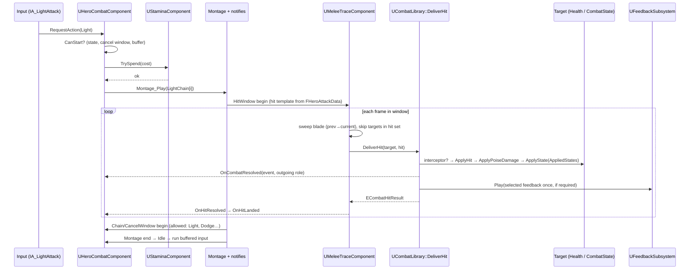

# Hero Combat (Warlord): Technical Plan

| | |
|---|---|
| Feature | CMB (`01-hero-combat`) |
| Spec | [spec.md](spec.md) (Draft v2: R-CMB-01…54, AC-CMB-01…26) |
| Architecture baseline | [00-foundation/technical-plan.md](../00-foundation/technical-plan.md), decisions D-01…D-20 in [main_implement_plan.md §7](../main_implement_plan.md#7-architecture-baseline) |
| Phases | P0A/P0B (internal slices of P0, single G0 at end of P0B), P2 (Interact), VS (provisional) |
| Status | P0 implemented and G0 recorded passed 2026-10-09. P2 interaction, P1 state-multiplier integration and provisional VS traits/polish remain planned until their tasks land (`<Game>` = `CastleDefender`) |

## 1. Technical Overview

Supporting implementation/content guidance: [uploaded-skill integration](../skill-integration.md) routes to `ue5-combat-components`, `ue5-dodge-parry`, `ue5-animation-combat` and `ue5-abilities-scope`. Use their project-adapted instructions; existing rules, D-xx decisions, section 8a and task acceptance remain authoritative.

The Warlord is a C++ `AHeroCharacter` with small components: one action state machine (`UHeroCombatComponent`), stamina (`UStaminaComponent`), lock-on (`ULockOnComponent`) and, in P2, interaction (`UInteractionComponent`). The FND combat contract components (`UHealthComponent`, `UCombatStateComponent`) sit on the same actor.

Animation montages author Startup → Active/Hit → Recovery plus applicable Chain, Cancel, RotationAssist, I-frame, Parry and optional InterruptResistance windows. `FCombatActionTiming` derives runtime/validation/debug views from those windows; it does not own another timing schedule. Designers tune timing by moving notifies; numbers that are not timing (damage, poise, stamina, ranges) live in `DA_HeroClass_Warlord`.

Every hit in the game, hero or not, goes through one static entry point, `UCombatLibrary::DeliverHit(Target, Hit)`. Valid attempts reach target interception (i-frames, block, parry via `ICombatHitInterceptor`), HP/poise/states through FND/SYN, and exactly one `FCombatResolutionEvent`; invalid/dead/no-health/same-team targets return Ignored before event creation. Presentation selects one impact outcome, plus the independent Hero.Damaged cue for positive Hero HP loss and SYN state cues when applicable. Evaded/Ignored may remain silent. Resolution is observable independently of presentation. `UMeleeTraceComponent` reuses this path with one hit per target per swing.

P0A implements movement, Light/Heavy/Dodge, basic stamina, timing/validation, rotation assist, hit reaction/death/reset, debug and a simple hostile/test attacker. P0B extends the same pipeline with Block/Parry/Lock-on, complete feedback and stamina tuning, regression coverage and G0. The P0A checkpoint is sequencing evidence, not a new production gate.

No GAS (D-04). Per-frame work is limited to movement/camera, open hit/assist windows, active lock-on, stamina regeneration/drain, active hero-clock deadlines and enabled development debug drawing. Every such loop needs a one-line reason; no new subsystem or global event bus.

## 2. Existing System Impact

| System | Impact |
|---|---|
| FND combat contract (T-FND-05) | Uses `FCombatHit`, `UHealthComponent`, `UCombatStateComponent`, team interface. Adds `UCombatLibrary`, `ICombatHitInterceptor`, `UMeleeTraceComponent` next to them in `Combat/` |
| FND input (T-FND-06) | Adds combat Input Actions to `IMC_Combat`; binds them in `AHeroCharacter::SetupPlayerInputComponent` |
| FND settings/definitions (T-FND-07) | Registers `UHeroClassDefinition` as a Primary Asset Type (`HeroClassDefinition`, deriving from `UGameDefinition`) with `IsDataValid` |
| FND debug (T-FND-09) | Reuses `game.debug.Combat`; adds `game.debug.CombatTrace` draw, cheats `ReloadHeroTuning`, `DebugHitHero`, wires FND `InfiniteStamina` |
| FND tests (T-FND-10) | Adds Automation Specs and `L_Test_HeroCombat` Functional Tests |
| SYN (T-SYN-01) | Hero sends poise damage and applied states; block break applies `State.Combat.Staggered` to the hero |
| ENM (T-ENM-01…04) | Enemy attacks must call `DeliverHit`; ENM may reuse `UMeleeTraceComponent` and implement `ICombatHitInterceptor` for an enemy block |
| UXF (T-UXF-01…03, -08) | CMB calls `UFeedbackSubsystem::Play`; HUD binds CMB delegates; telemetry binds CMB events |
| SQD / TFM | Input contexts must not collide; movement stays bound while `IMC_CommandWheel` is active |
| CSM (P3) | Binds `AHeroCharacter::OnHeroDeath` instead of the sandbox respawn |
| DEF (P2) | Build zones implement `IInteractable` |

## 3. Proposed Architecture

### 3.1 Runtime owner and lifetime
- `AHeroCharacter` (pawn lifetime), possessed by `AHeroPlayerController` (FND). All CMB state is transient on the pawn and dies with it.
- P0–P2: `BP_SandboxGameMode` / later `ARunGameMode` spawns the hero. On `OnHeroDeath` the sandbox destroys and restarts the player after a delay. P3: CSM owns the death flow.
- Run-level stats (deaths, parries) belong to `ARunPlayerState` (RUN/PRK), never to the hero.

### 3.2 Main UE types

| Type | Kind | Responsibility | Phase |
|---|---|---|---|
| `AHeroCharacter` | `ACharacter` | Body, camera rig (`USpringArmComponent` + `UCameraComponent`), input binding, locomotion + sprint, owns components, `OnHeroDeath` | P0 |
| `UHeroClassDefinition` | `UGameDefinition` (foundation §9) | All non-timing tunables for one class | P0 |
| `UHeroCombatComponent` | `UActorComponent`, implements `ICombatHitInterceptor` | Action state machine, input buffer, light chain, heavy, dodge, block, parry, counter window, hit reactions, death state; queries SYN shared states | P0A → P0B |
| `UStaminaComponent` | `UActorComponent` wrapping `FStaminaState` | Spend / reject / stamina damage / regen | P0 |
| `ULockOnComponent` | `UActorComponent` | Acquire, switch, validate, release; drives control rotation while locked | P0 |
| `UMeleeTraceComponent` | `UActorComponent` (Combat/) | Hit window traces, hit set per swing, `DeliverHit` per new target | P0 |
| `UCombatLibrary` | `UBlueprintFunctionLibrary` (Combat/) | `DeliverHit`, `IsInFrontArc`, team/alive checks; SYN adds `GetStateDamageMultiplier` | P0 |
| `ICombatHitInterceptor` | `UInterface` (Combat/) | `InterceptHit(FCombatHit&) -> ECombatHitResult` for i-frames/block/parry (hero) and enemy block (ENM, optional) | P0 |
| `UAnimNotifyState_CombatHitWindow`, `UAnimNotifyState_CancelWindow`, `UAnimNotifyState_Invulnerable`, `UAnimNotifyState_ParryWindow`, `UAnimNotifyState_RotationAssist`, `UAnimNotifyState_InterruptResistance` | `UAnimNotifyState` (Combat/) | Implemented montage windows; Chain is a CancelWindow allowing Light, phases derive from authored bounds. HitWindow has its own header; other notify classes live in CombatActionTiming.h | P0A → P0B |
| `FCombatActionTiming` | derived struct (Combat/) | Inspected windows and current phase for validation/debug; no independently configured durations | P0A |
| `FCombatResolutionEvent` | struct (existing CombatTypes.h) | Resolution ID, incoming/outgoing participants, hit context, result and feedback selection; separate from UXF playback | P0A → P0B |
| `UInteractionComponent`, `IInteractable` | component + `UInterface` (Core/) | Focus best interactable, prompt, trigger | P2 |

### 3.3 Data ownership

| Data | Owner | Mutated at runtime? |
|---|---|---|
| Class tunables | `DA_HeroClass_Warlord` (`UHeroClassDefinition`) | Never (read at use time so PIE edits apply) |
| Exact montage action timing (phases, hit, chain, cancel, assist, i-frame, parry, resistance windows) | `AM_Warlord_*` montage notify states | Never |
| Action state, chain index, buffer, counter window, hit set | `UHeroCombatComponent` / `UMeleeTraceComponent` | Yes, transient |
| Derived timing view, consumed-parry flag, assist target | `UHeroCombatComponent` | Yes, transient; timing view derived from montage authoring |
| Shared Staggered lifetime | `UCombatStateComponent` (SYN) only | Yes; CMB queries it and reacts to add/remove, never stores a competing timer/boolean |
| Stamina | `UStaminaComponent` | Yes, transient |
| HP, poise, states | `UHealthComponent`, `UCombatStateComponent` (FND/SYN) | Yes, transient |
| Feedback rows | `DT_Feedback` (UXF) | Never |

Implemented `UHeroClassDefinition` fields include Movement, Camera, LockOn, Input, Stamina, LightChain (three attacks), Heavy, AttackAssist, Dodge, Block, Parry, HitReact and MaxHealth; inspect the header/`HeroCombatTypes.h` for exact struct/property names. Attack data already owns montage, damage, poise damage, stamina cost, trace radius, AppliedStates, StateDuration and optional interrupt resistance. InputBufferTime lives in Input; Block owns ArcDegrees and BlockRegenSuppressAfterHit. Shared combat-state configuration is reused from SYN, with hero poise disabled. P1 `StateDamageMultipliers` / `FStateDamageMultipliers` are planned T-SYN-07, and interaction data waits for T-CMB-12 in P2; do not assume those fields exist yet. No runtime writes to the definition.

`IsDataValid` calls Super and validates each required action/montage pair: exactly three Light entries; references present; positive/ordered/bounded phase windows; exactly one Active/Hit window per attack; Chain windows for Light 1–2; required cancel, Dodge i-frame and Parry windows; duplicate/impossible/incompatible windows rejected (compatible assist/cancel windows may overlap). Whiff Parry must not gain a Block/Dodge cancel. Validate Heavy damage/poise above every Light, Light stamina cost below Heavy, assist bounds and nonnegative suppression. P0A validates available actions; P0B adds required defensive data. Runtime validates before spending stamina/entering an action, refuses invalid actions, and logs action/montage/window once through `LogGameCombat`. Cache timing inspection only with invalidation on data reload; montage windows stay authoritative.

### 3.4 Communication flow
- Input → `AHeroCharacter` handlers → `UHeroCombatComponent::RequestAction(EHeroAction)` (direct call).
- Montage notifies → owner's `UHeroCombatComponent` / `UMeleeTraceComponent` (owner resolved per callback; runtime window state on components, not shared notify objects).
- Outgoing hits → `UMeleeTraceComponent` → `UCombatLibrary::DeliverHit` → target components (direct).
- Incoming hits → `DeliverHit` → `ICombatHitInterceptor` on the hero → `UHealthComponent` → `OnDamaged` → `UHeroCombatComponent` hit reaction.
- State changes → dynamic multicast delegates (`OnActionStateChanged`, `OnCombatResolved(FCombatResolutionEvent)`, `OnHitLanded`, `OnParrySucceeded`, `OnBlockBroken(Attacker)`, `OnStaminaChanged`, `OnStaminaSpendFailed`, `OnLockOnTargetChanged`, `OnHeroDeath`). HUD, telemetry, perks and CSM bind; CMB never calls them.
- Resolution → one immutable event with a unique resolution ID, delivered on participating combat components with incoming/outgoing roles; observers deduplicate by ID when subscribed to both. No global bus. Landed-hit observers never produce a second resolution.
- Presentation → one feedback selection per resolution in DeliverHit (including HeroDamaged when applicable); OnDamaged drives interruption/presentation animation but does not replay that feedback. Non-hit events such as death/stamina-failure retain their own producer (D-10).

### 3.5 C++ / Blueprint split

| C++ | Blueprint / assets |
|---|---|
| Action state machine, cancel rules, input buffer, stamina rules, hit traces + hit set, `DeliverHit`, interceptor logic, lock-on selection/validation, interact focus | `BP_Hero_Warlord` (mesh, weapon, ABP, DA reference), `ABP_Warlord` locomotion (free + strafe blendspaces), montages with notify placement, `WBP_LockOnMarker`, `WBP_InteractPrompt`, `BP_SandboxGameMode` respawn, `BP_SandboxEnemyRespawner`, feedback rows |

Blueprint API: `BlueprintReadOnly` getters (`GetActionState`, `GetCurrentStamina`, `GetLockOnTarget`), `BlueprintAssignable` delegates, `BlueprintImplementableEvent` presentation hooks on `AHeroCharacter` (`OnHitReactPresentation`, `OnDeathPresentation`). Gameplay entry points are not Blueprint-callable except `RequestAction` for Functional Tests.

### 3.6 Asset references / loading
- Prototype: `UHeroClassDefinition` hard-references its montages (lifetime matches the hero). Switch to soft references at VS if load profiling asks for it (FND §9).
- Placeholder animation per [production-plan.md](../production-plan.md) (mannequin + sample locomotion + melee pack, sword + shield).
- Weapon static mesh has sockets `Trace_Start` and `Trace_End` read by `UMeleeTraceComponent`.

### 3.7 AI / navigation impact
- No navigation use. Enemies find the hero through the team interface (FND).
- `GetActionState()` and `State.Hero.*` tag mapping are readable by enemy brains if ENM wants to react to hero actions (not required in P0).

### 3.8 UI impact
- UXF `WBP_GameHUD` binds `UHealthComponent.OnDamaged`, `UStaminaComponent.OnStaminaChanged/OnStaminaSpendFailed` (T-UXF-02).
- CMB adds `WBP_LockOnMarker` (projects the target's lock-on socket to screen; ticks only while locked) and, in P2, `WBP_InteractPrompt` bound to `UInteractionComponent.OnFocusChanged`.

### 3.9 Save impact
None. All CMB state is transient (D-14). `DA_HeroClass_Warlord` is identified by Primary Asset ID if a future save needs the class.

### 3.10 Performance risks
See §9. Summary: one hero, negligible cost if traces and lock-on stay event/window-bound.

### 3.11 Existing systems reused
FND combat contract and team interface, Enhanced Input base and `AHeroPlayerController`, `UGameTuningSettings`, Primary Asset registration, cheat manager, CVar convention, test harness; UXF feedback subsystem, HUD, telemetry.

### 3.12 Implemented P0 types and planned additions

P0 types exist; reuse their actual declarations. `InteractionComponent`/`Interactable` are planned P2, optional counter content is data-dependent, and P1 state multipliers remain T-SYN-07. No separate Startup/Active/Recovery or Chain notify classes are required: phases derive from bounds, and Light chaining uses the existing allowed-action CancelWindow.

```text
Source/<Game>/Hero/        HeroCharacter.h/.cpp, HeroClassDefinition.h/.cpp, HeroCombatTypes.h (EHeroAction, EHeroActionState, FHero*Data),
                           HeroCombatComponent.h/.cpp, StaminaComponent.h/.cpp (+ FStaminaState), LockOnComponent.h/.cpp,
                           InteractionComponent.h/.cpp (P2), HeroAnimInstance.h/.cpp (ABP_Warlord parent; foot IK weight
                           off while a montage is active, added 2026-10-05)
Source/<Game>/Combat/      CombatLibrary.h/.cpp, CombatHitInterceptor.h, MeleeTraceComponent.h/.cpp, CombatActionTiming.h/.cpp,
                           CombatTypes.h (extend existing FCombatHit with interrupt metadata and FCombatResolutionEvent),
                           AnimNotifyState_CombatHitWindow.h/.cpp,
                           UAnimNotifyState_CancelWindow / Invulnerable / ParryWindow / RotationAssist / InterruptResistance
                           declarations and implementations in CombatActionTiming.h/.cpp
Source/<Game>/Core/        Interactable.h (P2)
Source/<Game>/Tests/       StaminaRules.spec.cpp, HeroActionRules.spec.cpp, CombatArc.spec.cpp, CombatTiming.spec.cpp,
                           AttackAssist.spec.cpp, CombatResolution.spec.cpp, HeroDefense.spec.cpp
Content/<Game>/Hero/       BP_Hero_Warlord, ABP_Warlord, BS_Warlord_Free, BS_Warlord_Strafe, AM_Warlord_Light_01..03,
                           AM_Warlord_Heavy, AM_Warlord_Dodge_F/B/L/R, AM_Warlord_BlockHit, AM_Warlord_BlockBreak,
                           AM_Warlord_Parry, AM_Warlord_ParryCounter (optional), AM_Warlord_HitReact_F/B, AM_Warlord_Death,
                           DA_HeroClass_Warlord
Content/<Game>/Core/Input/ IA_Move, IA_Look, IA_Sprint, IA_LightAttack, IA_HeavyAttack, IA_Dodge, IA_Block, IA_Parry,
                           IA_LockOn, IA_LockOnSwitch, IA_Interact (P2)   (reuse any T-FND-06 already created)
Content/<Game>/UI/         WBP_LockOnMarker, WBP_InteractPrompt (P2)
Content/<Game>/Maps/       L_CombatSandbox; Test/L_Test_HeroCombat
Content/<Game>/Core/       BP_SandboxGameMode, BP_SandboxEnemyRespawner
```

### 3.13 Trade-offs

| Choice | Alternative | Why this one |
|---|---|---|
| Timing in montage notify states, validated by `IsDataValid` | Timing numbers in the DA, notifies mirror them | One source of truth, visual tuning in the montage editor; DA validation catches missing windows |
| Parry as its own input (NEW-CMB-01) | Parry = first frames of Block | §2.1 "high risk": a whiff must cost something; tap-block parry has no whiff cost |
| `DeliverHit` + `ICombatHitInterceptor` | `UHealthComponent::ApplyHit` called directly by attackers | Block/parry/i-frames must run before damage; interface keeps `Combat/` free of `Hero/` includes; ENM enemy block is a second implementation |
| Generic `UMeleeTraceComponent` | Trace code inside `UHeroCombatComponent` | ENM/SQD melee need the same one-hit-per-swing rule |
| Root motion for attacks and dodge, distance scaled with `SetAnimRootMotionTranslationScale` (verify in UE docs) | Launch/velocity-driven dodge | Animation and movement stay in sync with placeholder sets |
| Read tunables at use time | Cache all values at BeginPlay | PIE edits apply immediately during G0 tuning; init-time values re-applied by `ReloadHeroTuning` |
| No GAS (D-04) | GAS abilities per action | One hero, few actions; components are smaller to learn and test |

### 3.14 Verification
Automation Specs for pure rules, Functional Tests in `L_Test_HeroCombat`, PIE checks in `L_CombatSandbox`, G0 gate playtest. Details in §8.

## 4. Runtime Flow

### 4.1 Outgoing attack



### 4.2 Hit resolution (`DeliverHit`)

```text
DeliverHit(Target, Hit, Multipliers = {}) -> ECombatHitResult   // Multipliers added by T-SYN-07
  begin one resolution record with original hit/participants and unique ID
  invalid/dead/no Health/same assigned team -> return Ignored before resolution event creation, no feedback
  apply SYN target-state multiplier to working damage (when available)
  run target interceptor -> Evaded / Parried terminate damage; Blocked / BlockBroken continue
  Health.ApplyHit(working hit) -> armor/death (SYN armor in P1)
  if target survives: apply poise and AppliedStates via CombatState
  finalize exactly once with final result/context and publish OnCombatResolved
  choose one matching UXF hit-outcome feedback, or none for silent outcomes
  positive Hero HP loss -> Feedback.Hero.Damaged (separate HUD event; Magnitude = actual HP loss)
  return result (Ignored | Evaded | Parried | Blocked | BlockBroken | Hit | Killed)
```

The original hit is preserved for telemetry and block stamina-force calculation. Keep interceptor outcome alongside the final lethal result so a lethal block still selects consistent block feedback. Do not replay feedback from `OnHitLanded`/`OnDamaged`. Use owner/component delegates for delivery; generic enemy combat components subscribe through the same shared contract when implemented. No second hit pipeline.


Hero interceptor order: Invulnerable window → Evaded; Parry window, not consumed, and `IsInFrontArc` → mark consumed before any callback, apply `ParryPoiseDamage` to the instigator's `UCombatStateComponent`, open Counter Window on hero clock, broadcast `OnParrySucceeded` once → Parried (all later/reentrant hits resolve normally; no automatic Block); Blocking and in arc → scale damage, stamina damage from original force and restart post-block regen suppression, on depletion apply `State.Combat.Staggered` to self → Blocked / BlockBroken; else Hit.

Implemented feedback context fields CMB fills: Instigator, Target, location, direction, `bIsHeavy`, `bTargetArmored` (target armor > 0 and not Armor Broken), `Surface` from the actual hit physical material and `Magnitude` from actual HP loss. `FFeedbackEventContext` is owned by UXF; explicit variants/base-row fallback are resolved there. P1 state-bonus context waits for the owning SYN/UXF tasks.

## 5. State / Data

### 5.1 Action state machine

```mermaid
stateDiagram-v2
  [*] --> Idle
  Idle --> LightAttack: Light
  Idle --> HeavyAttack: Heavy (stamina)
  Idle --> Dodge: Dodge (stamina)
  Idle --> Block: Block held
  Idle --> Parry: Parry
  LightAttack --> LightAttack: Light in cancel window (chain i+1, max 3)
  LightAttack --> Dodge: cancel window
  LightAttack --> HeavyAttack: cancel window
  HeavyAttack --> Dodge: cancel window
  Dodge --> LightAttack: recovery cancel window
  Block --> Idle: Block released
  Block --> Idle: block break applies SYN Staggered; actions gated
  Parry --> LightAttack: counter window (parry success)
  Parry --> HeavyAttack: counter window
  Parry --> Idle: whiff recovery ends
  LightAttack --> Idle: montage end
  HeavyAttack --> Idle: montage end
  Dodge --> Idle: montage end
  Idle --> HitReact: unblocked hit
  LightAttack --> HitReact: unblocked hit
  HeavyAttack --> HitReact: unblocked hit
  Parry --> HitReact: hit outside window
  Block --> HitReact: hit outside block arc
  Dodge --> HitReact: hit outside i-frames
  HitReact --> Idle: montage end
  Idle --> Dead: HP 0
  HitReact --> Dead: HP 0
  Dead --> [*]
```



`State.Combat.Staggered` is not an owned CMB action state. `CanStartAction()` always queries SYN; state-added interrupts/closes windows and clears buffer, removal only releases the shared-state gate. A debug/animation label may derive Staggered from `HasState`; no CMB expiry clock. Dead dominates all shared-state callbacks. Unblocked damaging hits normally cause HitReact; only explicitly enabled, active authored interrupt resistance may skip it. Damage and death still apply; shared Staggered cannot be resisted.

Default cancel authoring (data, not code; set per montage in `_CancelWindow.AllowedActions`):

| Current | Cancel window opens | Allowed into |
|---|---|---|
| Light hit 1–2 | authored Chain for Light, Cancel after hit | Light (next chain), Heavy, Dodge, Block |
| Light hit 3 | late recovery | Dodge, Block |
| Heavy | late recovery | Dodge |
| Dodge | recovery | Light, Heavy, Block |
| Parry (success) | immediately on parry | Light, Heavy, Dodge (counter window) |
| Parry (whiff) | none | — |
| HitReact | late | Dodge |

`Block` is a held state: releasing it returns to Idle at once; starting any allowed action from Block ends the block.

### 5.2 Stamina rules (`FStaminaState`, pure struct)

```text
TrySpend(cost, now): if cost > current: return false (OnStaminaSpendFailed)
                     current -= cost; lastSpend = now; return true
ApplyDamage(amount, now): current = max(0, current - amount); lastSpend = now; return current == 0
OnBlockedHit(now, suppression): blockedRegenUntil = now + suppression
Advance(dt, now, bBlocking): if now - lastSpend >= RegenDelay
                              and (not bBlocking or now >= blockedRegenUntil):
                     current = min(Max, current + RegenRate * (bBlocking ? BlockingRegenMultiplier : 1) * dt)
```

The component enables Tick only while `current < Max` or sprint-draining; it broadcasts `OnStaminaChanged` when the value changes.

### 5.3 Attack rotation assist

`UHeroCombatComponent` owns assist target and turns only during an authored RotationAssist window. Candidate query uses intended attack direction/camera aim, hostile/alive checks and `.AttackAssist` angle/range limits; no valid candidate means no hidden turn. Once T-CMB-10 exists, prefer its locked target only if eligible. Limit angular speed using hero-clock delta and total turn to MaxAngle relative to starting player intent. Revalidate target/range/cone while active; close on interruption/death/shared Staggered. This code changes facing only; it never adds translation or magnet pull. During attack windows lock-on facing must honor these same caps. Query on window entry, update/revalidate while active; do not scan every actor each frame.

### 5.4 Clock domains and input modes

T-CMB-09: the first frontal hostile hit consumes Parry and closes its window before any montage/state/poise/success callbacks. It stops the owned montage, applies attacker poise through SYN, opens the hero-clock counter and broadcasts `OnParrySucceeded(Attacker)`; no automatic Block resume on success. Anonymous debug hits with Enemy source layer can demonstrate damage negation/counter, but have no actor to receive poise. A Light/Heavy started inside the deadline reserves the counter for that attack; the multiplier is snapshotted in the trace payload, so a committed startup finishing after the deadline retains its first-hit reward. The trace consumes its counter flag and restores base damage before delivering the first hit, notifying the hero to close the deadline; reentrant/other targets get normal damage. A whiff/interruption ends that reserved attack's opportunity. Optional CounterMontage is validated as an attack; the main Parry montage has exactly one active window, a positive whiff recovery, and no cancel windows. All values come from `.Parry`; default separate-input interpretation stays NEW-CMB-01 for G0 review.

T-CMB-10: `ULockOnComponent` owns the weak target, world-time validation timer and target death/destruction bindings. Acquire/switch/removal are the only candidate scans (Pawn plus WorldDynamic for the existing sandbox dummy); filter live hostiles and Visibility LOS to `TargetSocket` (default `LockOn`), otherwise capsule centre. Acquisition sorts by camera angle then distance; target removal retargets by distance; switching uses screen positions. `.LockOn` exposes range, break distance, LOS grace, validation interval, camera interpolation and pitch limits. Movement facing is enabled only for Idle/Block: committed attacks turn only through bounded authored assist; Dodge retains montage root motion. Release restores the definition's free-camera locomotion preference. The native anim instance mirrors lock state and local forward/right velocity into the Blueprint-authored strafe graph.

`AHeroPlayerController` observes `OnLockOnTargetChanged(Target)` and creates `WBP_LockOnMarker` only while locked. T-UXF-02 hosts it in `WBP_GameHUD`'s full-screen LockOn canvas; unconfigured controllers retain viewport fallback. `ULockOnMarkerWidget` projects the socket/capsule location with DPI-aware widget coordinates; Blueprint owns its brush/layout. Possession changes and EndPlay detach listeners and remove it. The widget's editor-only root setter bridges a field unavailable to UE 5.8 Python, using the existing UMG dependency. The HUD observes the layer matrix and hides the marker in Build/Focus/Spirit/Modal.

D-20: montage windows, input buffer age, chain/cancel, counter deadline, assist rotation and hero stamina/action deadlines use the hero's dilated time. Use one pawn action-clock accumulator only while action/deadline work is active; verify against actual montage progress under per-actor hit stop, avoiding double-applied dilation. World timers (SYN state expiry, respawn and lock-on LOS grace) use world game time. UI animation uses real time. UXF changes only per-actor dilation; only TFM changes global dilation. Do not use a world TimerManager deadline for the hero buffer/counter without adapting it to the hero clock. D-19: input remains under `AHeroPlayerController` mode stack; CMB binds verbs, never changes mapping contexts/UI input mode itself.

## 6. Main Implementation Areas

| Area | Tasks |
|---|---|
| Hero pawn, definition, locomotion, sprint, camera | T-CMB-01 |
| Action state machine, notify states, input buffer, cancel windows | T-CMB-02 |
| Stamina | T-CMB-03 |
| Melee traces, `DeliverHit`, interceptor interface | T-CMB-04 |
| Light chain, Heavy | T-CMB-05, T-CMB-06 |
| Dodge, Block + block break, Parry + counter | T-CMB-07, T-CMB-08, T-CMB-09 |
| Lock-on | T-CMB-10 |
| Hit reactions, damage, death event | T-CMB-11 |
| Sandbox map, respawner | T-CMB-13, T-CMB-14 |

T-CMB-14: `ASandboxEnemyRespawner` owns only its spawned `AEnemyCharacter` instances, in 1-3 slots. `BP_SandboxEnemyRespawner` and Duel/Pair level instances expose the archetype, count, delay, radius and enabled flag. It calls `InitFromSpawn` before `FinishSpawning` and consumes the existing `OnEnemyRemoved` contract (death plus explicit/out-of-world removal), rather than adding a second lifecycle observer. Each empty slot has an independent world-game-time timer; changing count or disabling a preset cancels removed slots and despawns only owned enemies. Radius placement selects NavData for the enemy's agent and a navigable-radius point using the existing navigation system; unavailable navigation leaves capacity pending. Zero delay schedules next tick, avoiding recursive spawn callbacks. The cheat changes the first enabled preset; only one preset is enabled in the authored scenarios. Authoring adds missing presets without clearing the map. No Tick or subsystem is needed.
| Rotation assist (P0A) | T-CMB-20; locked preference integrated by T-CMB-10 |
| Combat debugger/trace visualization (P0A, expanded in P0B) | T-CMB-21 |
| P0A checkpoint; final QA / single G0 at end of P0B | Individual P0A verification, T-CMB-15, T-CMB-16 |
| Interact (P2) | T-CMB-12 |
| VS provisional | T-CMB-17, T-CMB-18, T-CMB-19 |

## 7. Error and Edge-Case Handling

| Case | Handling |
|---|---|
| Montage interrupted by anything (`bInterrupted` in `OnMontageEnded`) | Combat component checks the montage still owns the current state; if so, close open windows (trace end, invulnerable off, parry off) and go to Idle or the interrupting state |
| Notify end never fires (montage stopped mid-window) | Same as above: windows are force-closed when their montage ends |
| Missing montage / notify in data | `IsDataValid` error in editor; at runtime the action refuses to start and logs `LogGameCombat` error once |
| `DA_HeroClass_Warlord` missing on the BP | Error log on BeginPlay; component uses struct defaults so PIE does not crash |
| Lock-on target destroyed or dies | Bind target `OnDeath` and `OnDestroyed`; retarget or release |
| Hit window at low FPS | Sweep from previous to current socket positions each frame |
| Hit stop / time dilation | Hero action deadlines/windows use hero dilated time; shared state expiry/respawn use world game time; UI real time (D-20). Actor hit stop cannot consume the buffer/counter deadline |
| Two hits same frame on hero | Resolved in call order; the second sees the state left by the first (e.g., block already broken) |
| Hero dies with buffered input | Buffer cleared on Dead |
| Input while Staggered / Dead | Rejected, not buffered |
| Hero leaves Siege Site, boss reset | Not CMB (RUN Q-16, BOS) |

## 8. Testing Strategy

| Layer | What | Where |
|---|---|---|
| Automation Spec | `FStaminaState` (spend/reject/regen/clamp/block suppression); `CanStartAction` including shared Staggered; timing validation; assist limits; consumed-parry/reentrancy; interrupt thresholds; resolution/feedback counts; `IsInFrontArc` | `Tests/StaminaRules.spec.cpp`, `HeroActionRules.spec.cpp`, `CombatArc.spec.cpp`, `CombatTiming.spec.cpp`, `AttackAssist.spec.cpp`, `CombatResolution.spec.cpp`, `HeroDefense.spec.cpp` |
| Functional Test | Light chain, one hit per swing, dodge i-frames, block reduction, block break, parry + counter, lock-on release, hero death, invalid timing refusal, bounded assist, shared Staggered authority, single-hit Parry, resistance off/on, silent evade resolution, low-FPS traces and D-20 hit-stop clocks | `L_Test_HeroCombat` (T-CMB-15) |
| PIE manual | Feel, readability, camera, lock-on under movement | `L_CombatSandbox` |
| Gate playtest | G0 checklist, telemetry evidence | T-CMB-16, `ai/game/playtests/` |
| Debug | `game.debug.Combat 1`: action, derived timing phases/windows, buffer, stamina, lock-on/assist target, shared states, defense/consumed-parry; `game.debug.CombatTrace 1`: sweeps/hit points/already-hit set (development only) | all tasks |

Run `Tools/run_tests.bat` for both `CastleDefender.*` Specs and `Project.Functional Tests.*`; a focused `-Filter "CastleDefender.Combat"` covers Specs only. Functional Tests are Blueprint actors per foundation §16, avoiding a Developer-module dependency in Shipping. Record rendered PIE for debugger/trace readability (headless tests cannot prove it).

Functional Tests drive the hero through `RequestAction` and deliver enemy hits through the `DebugHitHero` helper (test instigator with `UCombatStateComponent`), so CMB tests do not wait for ENM.

## 9. Performance Risks

| Risk | Mitigation |
|---|---|
| Per-frame sweeps in hit windows | Only while a window is open; sweeps at data-authored blade samples between previous/current poses; configurable object types; small per-swing `TSet` |
| Lock-on candidate scans | Overlap query only on acquire/switch; validity check on a 0.15 s timer (`ponytail:` provisional validity interval; expose in lock-on data before implementation) |
| Assist window update | Query on entry; bounded facing update and target validation only while window is open |
| Combat debugger | Draw only when enabled in Development; compile out of Shipping |
| Stamina regen/drain Tick | Tick enabled only while below max or sprint-draining |
| Montage-heavy AnimBP | One hero; profile with `stat anim` in the sandbox, not a concern until VS art |
| P1+ crowds near the hero | Traces filter by object type Pawn and team first; measured in the P2 benchmark (T-DEF-12) |

## 10. Dependencies and Risks

| Item | Note |
|---|---|
| ENM must deliver enemy hits through `DeliverHit` | Otherwise block/parry/i-frames are bypassed. Flagged to ENM (T-ENM-03) |
| SYN `FCombatStateConfig` and poise pipeline | Parry and Heavy outcomes need T-SYN-01 to be visible |
| UXF feedback context fields | `bIsHeavy`, `bTargetArmored`, instigator/target needed from T-UXF-01 |
| Placeholder animation hides feel | Risk register (master plan §13): use sample packs with weight, tune data, note anim limits in G0 record |
| Input buffer feels sticky or laggy | `InputBufferTime` is data; test 0.1–0.3 s at G0 |
| Parry interpretation (NEW-CMB-01) | Decide at G0; default separate input, first-success consumption and poise/counter; no baseline multi-parry |
| Hit stop stretches i-frames/parry windows in real time | Verify hero clock remains aligned with montage windows under actor hit stop; record feel effects in G0 (D-20) |
| Key conflicts with SQD/TFM contexts | Proposed keys in NEW-CMB-07; final map in T-FND-06 |

No change requests to D-01…D-20. Resolution and interrupt contracts are implemented in P0 and recorded in master plan §8a; future consumers reuse them rather than creating parallel pipelines.

## 11. Requirement Coverage

| Requirement | Technical area | Notes |
|---|---|---|
| R-CMB-01 | `AHeroCharacter` input binding; SQD/TFM own their verbs | T-CMB-01 |
| R-CMB-02 | G0 gate playtest | T-CMB-16 |
| R-CMB-03, -04, -05, -06 | `AHeroCharacter` + CharacterMovement + spring arm; `FHeroMovementData`, `FHeroCameraData`, sprint drain in `FStaminaConfig` | T-CMB-01, T-CMB-03 |
| R-CMB-07 | `UHeroCombatComponent` + `_CancelWindow` notify | T-CMB-02 |
| R-CMB-08 | Input buffer in `UHeroCombatComponent` | T-CMB-02 |
| R-CMB-09 | Input Actions set; single-button chain | T-CMB-01, T-CMB-05 |
| R-CMB-10, -11, -12 | `UStaminaComponent` / `FStaminaState` | T-CMB-03 |
| R-CMB-13, -14 | Light chain data + chain cancel windows | T-CMB-05 |
| R-CMB-15, -16 | Heavy `FHeroAttackData` incl. `AppliedStates` | T-CMB-06 (effect T-SYN-02) |
| R-CMB-17, -18 | `UMeleeTraceComponent` hit set, team filter in `DeliverHit` | T-CMB-04 |
| R-CMB-19, -20, -21 | Dodge montages + `_Invulnerable` + interceptor Evaded | T-CMB-07 |
| R-CMB-22, -23, -24 | Block state, interceptor Blocked/BlockBroken, self Staggered | T-CMB-08 |
| R-CMB-25, -26, -27, -28 | `_ParryWindow`, interceptor Parried, counter window, `OnParrySucceeded` | T-CMB-09 |
| R-CMB-29, -30, -31 | `ULockOnComponent`, `WBP_LockOnMarker`, strafe ABP | T-CMB-10 |
| R-CMB-32, -33 | `OnDamaged` → hit react; `OnDeath` → Dead + `OnHeroDeath`; sandbox respawn | T-CMB-11, T-CMB-13 |
| R-CMB-34 | `DeliverHit` feedback call; UXF rows | T-CMB-04, T-UXF-03 |
| R-CMB-35, -36 | Enhanced Input actions in `IMC_Combat`; key map review | T-CMB-01, T-FND-06 |
| R-CMB-37 | `UHeroClassDefinition` + `IsDataValid` + `ReloadHeroTuning` | T-CMB-01, T-CMB-02 |
| R-CMB-38 | Warlord DA content; traits deferred | T-CMB-06, T-SYN-02, VS tasks |
| R-CMB-39 | `UInteractionComponent`, `IInteractable` | T-CMB-12 |
| R-CMB-40 | Proximity buff via PRK stat modifiers | T-CMB-17 (provisional) |
| R-CMB-41 | Design spike | T-CMB-18 (provisional) |
| R-CMB-42 | Animation polish | T-CMB-19 (provisional) |
| R-CMB-43, -44, -45 | Authored timing/derived `FCombatActionTiming`, validator and runtime refusal | T-CMB-02/05/06/07/09/21; AC-CMB-20 |
| R-CMB-46, -47, -48 | Bounded, rotation-only assist during authored window | T-CMB-20/10; AC-CMB-21 |
| R-CMB-49 | Post-block blocking-regen suppression | T-CMB-08/15; spec default 0.6 s, final G0 tuning |
| R-CMB-50 | Consumed flag set before callbacks; one success per Parry action | T-CMB-09/15; AC-CMB-24 |
| R-CMB-51 | Disabled-by-default action resistance + incoming interrupt metadata | T-CMB-04/06/11/15; AC-CMB-25 |
| R-CMB-52 | Query/bind SYN shared state; no owned Staggered expiry | T-CMB-02/08/11/15; AC-CMB-22 |
| R-CMB-53 | One resolution record; independent conditional UXF feedback | T-CMB-04/07/09/11/15; AC-CMB-13/23 |
| R-CMB-54 | Development debugger and trace overlay | T-CMB-21/15; AC-CMB-20/26 |

AC-CMB-01…17 retain the task ownership in `tasks.md`; AC-CMB-18 is P2, AC-CMB-19 provisional VS. New AC-CMB-20…26 are mapped above and receive final integrated coverage in T-CMB-15. P0A evidence is collected per task; all P0 criteria and G0 must pass before P1 opens.

### 12. Integration Checklist

- Run `L_Test_HeroCombat` functional test suite and automation specs (`Tools/run_tests.bat`) before merging CMB, SYN or ENM changes. All 16 functional tests and automation specs must pass with editor exit code 0.


## P1 custom dodge and perfect dodge: T-CMB-22

Approved user answers on 2026-10-10: "Animation + afterimage/sound + counter opportunity" and "can u custom for me ?". Reuse HeroCombatComponent/DeliverHit/FeedbackSubsystem and existing montage sources. No D-xx decision changes.

Arm one early hero-clock countdown at the first i-frame opening of an accepted Dodge; consume before delegates, never rearm that action. Validate duration against its authored i-frame span. Only an actual positive-damage hostile intercepted hit qualifies. Keep Evaded outcome and emit resolver-owned metadata/cue. Refresh the existing counter clock without changing committed action; retain first-payload consumption. Close/interrupt/death/reset/EndPlay remove eligibility, interruption also clears counter.

FFeedbackRow adds optional AfterimageMaterial/Seconds/Opacity. FeedbackSubsystem snapshots a transient UPoseableMeshComponent at the target skeletal mesh world pose, disables collisions/shadows/tick, and fades GhostOpacity using its real-time ticker. Its owner/world cleanup destroys snapshots and removes ticker handles. No new actor/subsystem/module or global dilation.

HeroCombatLibrary editor-only animation authoring bakes original bone transforms from a licensed mannequin idle starting pose via IAnimationDataController, at 60 fps. Output remains editable AnimSequence data. Root translation is directional; pelvis/limbs provide tuck/roll/lean without spinning capsule/camera. Authoring backs up existing saved montage/definition/table packages, preserves notify timings, and adds dedicated material/sound. Existing assets are not deleted.

Pinned engine API references: [Animation data controller](https://dev.epicgames.com/documentation/en-us/unreal-engine/API/Runtime/Engine/IAnimationDataController), [poseable mesh](https://dev.epicgames.com/documentation/unreal-engine/API/Runtime/Engine/UPoseableMeshComponent). Acceptance/evidence: R-CMB-55..58, AC-CMB-27..28; rendered and owner checks remain distinct.
