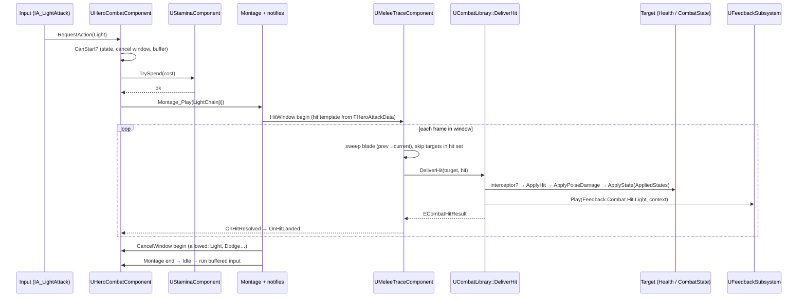
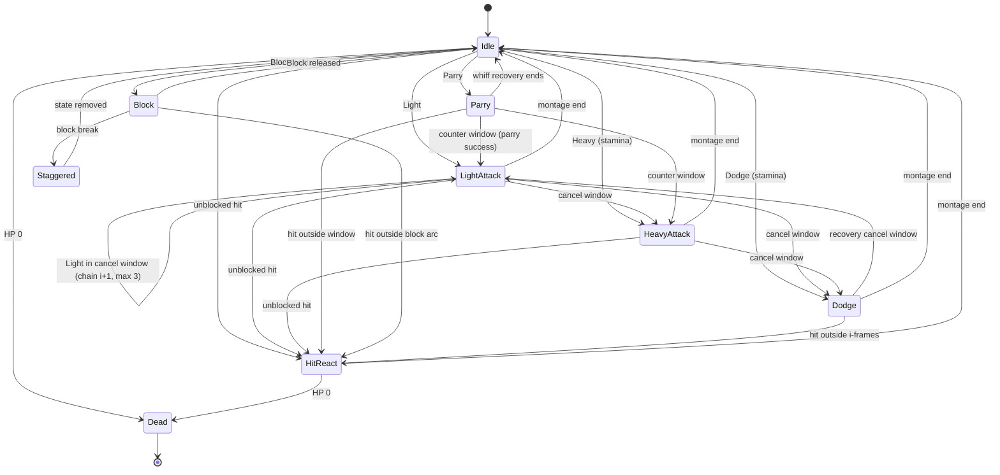

# Hero Combat (Warlord): Technical Plan

| | |
|---|---|
| Feature | CMB (`01-hero-combat`) |
| Spec | [spec.md](spec.md) (R-CMB-01…42, AC-CMB-01…19) |
| Architecture baseline | [00-foundation/technical-plan.md](../00-foundation/technical-plan.md), decisions D-01…D-18 in [main_implement_plan.md §7](../main_implement_plan.md#7-architecture-baseline) |
| Phases | P0, P2 (Interact), VS (provisional) |
| Status | Draft v1. No UE project exists yet: every path, class and asset name is a **proposal** |

## 1. Technical Overview

The Warlord is a C++ `AHeroCharacter` with small components: one action state machine (`UHeroCombatComponent`), stamina (`UStaminaComponent`), lock-on (`ULockOnComponent`) and, in P2, interaction (`UInteractionComponent`). The FND combat contract components (`UHealthComponent`, `UCombatStateComponent`) sit on the same actor.

Animation montages carry all action timing through four C++ anim notify states (hit window, cancel window, invulnerable, parry window). Designers tune timing by moving notifies; numbers that are not timing (damage, poise, stamina, ranges) live in `DA_HeroClass_Warlord`.

Every hit in the game, hero or not, goes through one static entry point, `UCombatLibrary::DeliverHit(Target, Hit)`. It lets the target intercept the hit first (i-frames, block, parry via `ICombatHitInterceptor`), then applies damage, poise and states through the FND/SYN components, then raises one feedback event. A reusable `UMeleeTraceComponent` turns a montage hit window into traces and `DeliverHit` calls with the one-hit-per-target-per-swing rule.

No GAS (D-04). No Tick except movement, camera, an open hit window, active lock-on, and stamina regen in progress.

## 2. Existing System Impact

| System | Impact |
|---|---|
| FND combat contract (T-FND-05) | Uses `FCombatHit`, `UHealthComponent`, `UCombatStateComponent`, team interface. Adds `UCombatLibrary`, `ICombatHitInterceptor`, `UMeleeTraceComponent` next to them in `Combat/` |
| FND input (T-FND-06) | Adds combat Input Actions to `IMC_Combat`; binds them in `AHeroCharacter::SetupPlayerInputComponent` |
| FND settings/definitions (T-FND-07) | Registers `UHeroClassDefinition` as a Primary Asset Type (`HeroClass`) with `IsDataValid` |
| FND debug (T-FND-09) | Adds `game.debug.Combat` draw, cheats `ReloadHeroTuning`, `DebugHitHero`, wires FND `InfiniteStamina` |
| FND tests (T-FND-10) | Adds Automation Specs and `L_Test_HeroCombat` Functional Tests |
| SYN (T-SYN-01) | Hero sends poise damage and applied states; block break applies `State.Combat.Staggered` to the hero |
| ENM (T-ENM-01…04) | Enemy attacks must call `DeliverHit`; ENM may reuse `UMeleeTraceComponent` and implement `ICombatHitInterceptor` for an enemy block |
| UXF (T-UXF-01…03, -08) | CMB calls `UFeedbackSubsystem::Play`; HUD binds CMB delegates; telemetry binds CMB events |
| SQD / TFM | Input contexts must not collide; movement stays bound while `IMC_CommandWheel` is active |
| CSM (P3) | Binds `AHeroCharacter::OnHeroDeath` instead of the sandbox respawn |
| DEF (P2) | Build zones implement `IInteractable` |

## 3. Proposed Architecture

### 3.1 Runtime owner and lifetime
- `AHeroCharacter` (pawn lifetime), possessed by `AHeroPlayerController` (FND). All CMB state is transient on the pawn and dies with it.
- P0–P2: `BP_SandboxGameMode` / later `ARunGameMode` spawns the hero. On `OnHeroDeath` the sandbox destroys and restarts the player after a delay. P3: CSM owns the death flow.
- Run-level stats (deaths, parries) belong to `ARunPlayerState` (RUN/PRK), never to the hero.

### 3.2 Main UE types

| Type | Kind | Responsibility | Phase |
|---|---|---|---|
| `AHeroCharacter` | `ACharacter` | Body, camera rig (`USpringArmComponent` + `UCameraComponent`), input binding, locomotion + sprint, owns components, `OnHeroDeath` | P0 |
| `UHeroClassDefinition` | `UPrimaryDataAsset` | All non-timing tunables for one class | P0 |
| `UHeroCombatComponent` | `UActorComponent`, implements `ICombatHitInterceptor` | Action state machine, input buffer, light chain, heavy, dodge, block, parry, counter window, hit reactions, death state | P0 |
| `UStaminaComponent` | `UActorComponent` wrapping `FStaminaState` | Spend / reject / stamina damage / regen | P0 |
| `ULockOnComponent` | `UActorComponent` | Acquire, switch, validate, release; drives control rotation while locked | P0 |
| `UMeleeTraceComponent` | `UActorComponent` (Combat/) | Hit window traces, hit set per swing, `DeliverHit` per new target | P0 |
| `UCombatLibrary` | `UBlueprintFunctionLibrary` (Combat/) | `DeliverHit`, `IsInFrontArc`, team/alive checks; SYN adds `GetStateDamageMultiplier` | P0 |
| `ICombatHitInterceptor` | `UInterface` (Combat/) | `InterceptHit(FCombatHit&) -> ECombatHitResult` for i-frames/block/parry (hero) and enemy block (ENM, optional) | P0 |
| `UAnimNotifyState_CombatHitWindow` / `_CancelWindow` / `_Invulnerable` / `_ParryWindow` | `UAnimNotifyState` (Combat/) | Timing windows authored in montages | P0 |
| `UInteractionComponent`, `IInteractable` | component + `UInterface` (Core/) | Focus best interactable, prompt, trigger | P2 |

### 3.3 Data ownership

| Data | Owner | Mutated at runtime? |
|---|---|---|
| Class tunables | `DA_HeroClass_Warlord` (`UHeroClassDefinition`) | Never (read at use time so PIE edits apply) |
| Action timing (hit, cancel, i-frame, parry windows) | `AM_Warlord_*` montage notify states | Never |
| Action state, chain index, buffer, counter window, hit set | `UHeroCombatComponent` / `UMeleeTraceComponent` | Yes, transient |
| Stamina | `UStaminaComponent` | Yes, transient |
| HP, poise, states | `UHealthComponent`, `UCombatStateComponent` (FND/SYN) | Yes, transient |
| Feedback rows | `DT_Feedback` (UXF) | Never |

`UHeroClassDefinition` layout (structs proposed): `FHeroMovementData`, `FHeroCameraData`, `FStaminaConfig`, `TArray<FHeroAttackData> LightChain` (3 entries), `FHeroAttackData Heavy`, `FHeroDodgeData`, `FHeroBlockData`, `FHeroParryData`, `FHeroHitReactData`, `FHeroLockOnData`, `float InputBufferTime`, `float MaxHealth`, `FCombatStateConfig CombatState` (SYN struct; hero poise off), `FHeroInteractData` (P2). `FHeroAttackData` = montage, damage, poise damage, stamina cost, trace radius, `AppliedStates` (tag container), `StateDuration`, `StateDamageMultipliers` (`FStateDamageMultipliers`, added by T-SYN-07).

`IsDataValid` checks: 3 light entries, every referenced montage set, every attack montage has exactly one hit window and at least one cancel window, the dodge montage has an invulnerable window, the parry montage has a parry window, Light stamina cost < Heavy stamina cost (R-CMB-10).

### 3.4 Communication flow
- Input → `AHeroCharacter` handlers → `UHeroCombatComponent::RequestAction(EHeroAction)` (direct call).
- Montage notifies → owner's `UHeroCombatComponent` / `UMeleeTraceComponent` (looked up once, cached by the notify per mesh).
- Outgoing hits → `UMeleeTraceComponent` → `UCombatLibrary::DeliverHit` → target components (direct).
- Incoming hits → `DeliverHit` → `ICombatHitInterceptor` on the hero → `UHealthComponent` → `OnDamaged` → `UHeroCombatComponent` hit reaction.
- State changes → dynamic multicast delegates (`OnActionStateChanged`, `OnHitLanded`, `OnParrySucceeded`, `OnBlockBroken`, `OnStaminaChanged`, `OnStaminaSpendFailed`, `OnLockOnTargetChanged`, `OnHeroDeath`). HUD, telemetry, perks and CSM bind; CMB never calls them.
- Presentation → `UFeedbackSubsystem::Play(Tag, Context)` from `DeliverHit` and the hero's own events only (D-10).

### 3.5 C++ / Blueprint split

| C++ | Blueprint / assets |
|---|---|
| Action state machine, cancel rules, input buffer, stamina rules, hit traces + hit set, `DeliverHit`, interceptor logic, lock-on selection/validation, interact focus | `BP_Hero_Warlord` (mesh, weapon, ABP, DA reference), `ABP_Warlord` locomotion (free + strafe blendspaces), montages with notify placement, `WBP_LockOnMarker`, `WBP_InteractPrompt`, `BP_SandboxGameMode` respawn, `BP_SandboxEnemyRespawner`, feedback rows |

Blueprint API: `BlueprintReadOnly` getters (`GetActionState`, `GetCurrentStamina`, `GetLockOnTarget`), `BlueprintAssignable` delegates, `BlueprintImplementableEvent` presentation hooks on `AHeroCharacter` (`OnHitReactPresentation`, `OnDeathPresentation`). Gameplay entry points are not Blueprint-callable except `RequestAction` for Functional Tests.

### 3.6 Asset references / loading
- Prototype: `UHeroClassDefinition` hard-references its montages (lifetime matches the hero). Switch to soft references at VS if load profiling asks for it (FND §9).
- Placeholder animation per [production-plan.md](../production-plan.md) (mannequin + sample locomotion + melee pack, sword + shield).
- Weapon static mesh has sockets `Trace_Start` and `Trace_End` read by `UMeleeTraceComponent`.

### 3.7 AI / navigation impact
- No navigation use. Enemies find the hero through the team interface (FND).
- `GetActionState()` and `State.Hero.*` tag mapping are readable by enemy brains if ENM wants to react to hero actions (not required in P0).

### 3.8 UI impact
- UXF `WBP_GameHUD` binds `UHealthComponent.OnDamaged`, `UStaminaComponent.OnStaminaChanged/OnStaminaSpendFailed` (T-UXF-02).
- CMB adds `WBP_LockOnMarker` (projects the target's lock-on socket to screen; ticks only while locked) and, in P2, `WBP_InteractPrompt` bound to `UInteractionComponent.OnFocusChanged`.

### 3.9 Save impact
None. All CMB state is transient (D-14). `DA_HeroClass_Warlord` is identified by Primary Asset ID if a future save needs the class.

### 3.10 Performance risks
See §9. Summary: one hero, negligible cost if traces and lock-on stay event/window-bound.

### 3.11 Existing systems reused
FND combat contract and team interface, Enhanced Input base and `AHeroPlayerController`, `UGameTuningSettings`, Primary Asset registration, cheat manager, CVar convention, test harness; UXF feedback subsystem, HUD, telemetry.

### 3.12 New types / files proposed

```text
Source/<Game>/Hero/        HeroCharacter.h/.cpp, HeroClassDefinition.h/.cpp, HeroCombatTypes.h (EHeroAction, EHeroActionState, FHero*Data),
                           HeroCombatComponent.h/.cpp, StaminaComponent.h/.cpp (+ FStaminaState), LockOnComponent.h/.cpp,
                           InteractionComponent.h/.cpp (P2)
Source/<Game>/Combat/      CombatLibrary.h/.cpp, CombatHitInterceptor.h, MeleeTraceComponent.h/.cpp,
                           AnimNotifyState_CombatHitWindow / _CancelWindow / _Invulnerable / _ParryWindow (.h/.cpp)
Source/<Game>/Core/        Interactable.h (P2)
Source/<Game>/Tests/       StaminaRules.spec.cpp, HeroActionRules.spec.cpp, CombatArc.spec.cpp
Content/<Game>/Hero/       BP_Hero_Warlord, ABP_Warlord, BS_Warlord_Free, BS_Warlord_Strafe, AM_Warlord_Light_01..03,
                           AM_Warlord_Heavy, AM_Warlord_Dodge_F/B/L/R, AM_Warlord_BlockHit, AM_Warlord_BlockBreak,
                           AM_Warlord_Parry, AM_Warlord_ParryCounter (optional), AM_Warlord_HitReact_F/B, AM_Warlord_Death,
                           DA_HeroClass_Warlord
Content/<Game>/Core/Input/ IA_Move, IA_Look, IA_Sprint, IA_LightAttack, IA_HeavyAttack, IA_Dodge, IA_Block, IA_Parry,
                           IA_LockOn, IA_LockOnSwitch, IA_Interact (P2)   (reuse any T-FND-06 already created)
Content/<Game>/UI/         WBP_LockOnMarker, WBP_InteractPrompt (P2)
Content/<Game>/Maps/       L_CombatSandbox; Test/L_Test_HeroCombat
Content/<Game>/Core/       BP_SandboxGameMode, BP_SandboxEnemyRespawner
```

### 3.13 Trade-offs

| Choice | Alternative | Why this one |
|---|---|---|
| Timing in montage notify states, validated by `IsDataValid` | Timing numbers in the DA, notifies mirror them | One source of truth, visual tuning in the montage editor; DA validation catches missing windows |
| Parry as its own input (NEW-CMB-01) | Parry = first frames of Block | §2.1 "high risk": a whiff must cost something; tap-block parry has no whiff cost |
| `DeliverHit` + `ICombatHitInterceptor` | `UHealthComponent::ApplyHit` called directly by attackers | Block/parry/i-frames must run before damage; interface keeps `Combat/` free of `Hero/` includes; ENM enemy block is a second implementation |
| Generic `UMeleeTraceComponent` | Trace code inside `UHeroCombatComponent` | ENM/SQD melee need the same one-hit-per-swing rule |
| Root motion for attacks and dodge, distance scaled with `SetAnimRootMotionTranslationScale` (verify in UE docs) | Launch/velocity-driven dodge | Animation and movement stay in sync with placeholder sets |
| Read tunables at use time | Cache all values at BeginPlay | PIE edits apply immediately during G0 tuning; init-time values re-applied by `ReloadHeroTuning` |
| No GAS (D-04) | GAS abilities per action | One hero, few actions; components are smaller to learn and test |

### 3.14 Verification
Automation Specs for pure rules, Functional Tests in `L_Test_HeroCombat`, PIE checks in `L_CombatSandbox`, G0 gate playtest. Details in §8.

## 4. Runtime Flow

### 4.1 Outgoing attack



### 4.2 Hit resolution (`DeliverHit`)

```text
DeliverHit(Target, Hit, Multipliers = {}) -> ECombatHitResult   // Multipliers param added by T-SYN-07
  if Target invalid, dead, or not hostile to Hit.Instigator: return Ignored
  Hit.Damage *= GetStateDamageMultiplier(Target, Multipliers)   // target states before this hit (SYN)
  for each component on Target implementing ICombatHitInterceptor:
      r = InterceptHit(Hit)                 // may change Hit.Damage / PoiseDamage
      if r == Evaded:  return Evaded        // i-frames, no feedback
      if r == Parried: Play(Parry); return Parried
  Health.ApplyHit(Hit)                      // armor applied inside (SYN, P1)
  CombatState.ApplyPoiseDamage(Hit.PoiseDamage, Instigator)   // may add Staggered (SYN)
  for tag in Hit.AppliedStates: CombatState.ApplyState(tag, Hit.StateDuration, Instigator)
  Play(r == Blocked ? Block : r == BlockBroken ? BlockBreak : Hit.bIsHeavy ? Hit.Heavy : Hit.Light, context)
  return r (Hit | Blocked | BlockBroken | Killed)
```

Hero interceptor order: Invulnerable window → Evaded; Parry window and `IsInFrontArc` → apply `ParryPoiseDamage` to the instigator's `UCombatStateComponent`, open Counter Window, broadcast `OnParrySucceeded` → Parried; Blocking and in arc → scale damage, `ApplyStaminaDamage`, on depletion apply `State.Combat.Staggered` to self → Blocked / BlockBroken; else Hit.

Feedback context fields CMB fills: Instigator, Target, location, direction, `bIsHeavy`, `bTargetArmored` (target armor > 0 and not Armor Broken). Exact struct owned by UXF T-UXF-01.

## 5. State / Data

### 5.1 Action state machine



Default cancel authoring (data, not code; set per montage in `_CancelWindow.AllowedActions`):

| Current | Cancel window opens | Allowed into |
|---|---|---|
| Light hit 1–2 | after hit window | Light (next chain), Heavy, Dodge, Block |
| Light hit 3 | late recovery | Dodge, Block |
| Heavy | late recovery | Dodge |
| Dodge | recovery | Light, Heavy, Block |
| Parry (success) | immediately on parry | Light, Heavy, Dodge (counter window) |
| Parry (whiff) | none | — |
| HitReact | late | Dodge |

`Block` is a held state: releasing it returns to Idle at once; starting any allowed action from Block ends the block.

### 5.2 Stamina rules (`FStaminaState`, pure struct)

```text
TrySpend(cost, now): if cost > current: return false (OnStaminaSpendFailed)
                     current -= cost; lastSpend = now; return true
ApplyDamage(amount, now): current = max(0, current - amount); lastSpend = now; return current == 0
Advance(dt, now, bBlocking): if now - lastSpend >= RegenDelay:
                     current = min(Max, current + RegenRate * (bBlocking ? BlockingRegenMultiplier : 1) * dt)
```

The component enables Tick only while `current < Max`; it broadcasts `OnStaminaChanged` when the value changes.

## 6. Main Implementation Areas

| Area | Tasks |
|---|---|
| Hero pawn, definition, locomotion, sprint, camera | T-CMB-01 |
| Action state machine, notify states, input buffer, cancel windows | T-CMB-02 |
| Stamina | T-CMB-03 |
| Melee traces, `DeliverHit`, interceptor interface | T-CMB-04 |
| Light chain, Heavy | T-CMB-05, T-CMB-06 |
| Dodge, Block + block break, Parry + counter | T-CMB-07, T-CMB-08, T-CMB-09 |
| Lock-on | T-CMB-10 |
| Hit reactions, damage, death event | T-CMB-11 |
| Sandbox map, respawner | T-CMB-13, T-CMB-14 |
| QA, G0 gate | T-CMB-15, T-CMB-16 |
| Interact (P2) | T-CMB-12 |
| VS provisional | T-CMB-17, T-CMB-18, T-CMB-19 |

## 7. Error and Edge-Case Handling

| Case | Handling |
|---|---|
| Montage interrupted by anything (`bInterrupted` in `OnMontageEnded`) | Combat component checks the montage still owns the current state; if so, close open windows (trace end, invulnerable off, parry off) and go to Idle or the interrupting state |
| Notify end never fires (montage stopped mid-window) | Same as above: windows are force-closed when their montage ends |
| Missing montage / notify in data | `IsDataValid` error in editor; at runtime the action refuses to start and logs `LogHeroCombat` error once |
| `DA_HeroClass_Warlord` missing on the BP | Error log on BeginPlay; component uses struct defaults so PIE does not crash |
| Lock-on target destroyed or dies | Bind target `OnDeath` and `OnDestroyed`; retarget or release |
| Hit window at low FPS | Sweep from previous to current socket positions each frame |
| Hit stop / time dilation | All timers use game time; windows stretch with dilation; acceptable and consistent with TFM (D-13) |
| Two hits same frame on hero | Resolved in call order; the second sees the state left by the first (e.g., block already broken) |
| Hero dies with buffered input | Buffer cleared on Dead |
| Input while Staggered / Dead | Rejected, not buffered |
| Hero leaves Siege Site, boss reset | Not CMB (RUN Q-16, BOS) |

## 8. Testing Strategy

| Layer | What | Where |
|---|---|---|
| Automation Spec | `FStaminaState` (spend, reject, regen delay, rate, blocking multiplier, clamp); `CanStart` rules (state × window × stamina); `IsInFrontArc` | `Tests/StaminaRules.spec.cpp`, `HeroActionRules.spec.cpp`, `CombatArc.spec.cpp` |
| Functional Test | Light chain, one hit per swing, dodge i-frames, block reduction, block break, parry + counter, lock-on release, hero death event | `L_Test_HeroCombat` (T-CMB-15) |
| PIE manual | Feel, readability, camera, lock-on under movement | `L_CombatSandbox` |
| Gate playtest | G0 checklist, telemetry evidence | T-CMB-16, `ai/game/playtests/` |
| Debug | `game.debug.Combat 1`: action state, chain index, buffered input, active windows, trace spheres, block arc, lock-on candidates | all tasks |

Functional Tests drive the hero through `RequestAction` and deliver enemy hits through the `DebugHitHero` helper (test instigator with `UCombatStateComponent`), so CMB tests do not wait for ENM.

## 9. Performance Risks

| Risk | Mitigation |
|---|---|
| Per-frame sweeps in hit windows | Only while a window is open; one multi-sphere sweep per frame per weapon; hit set is a small `TSet` |
| Lock-on candidate scans | Overlap query only on acquire/switch; validity check on a 0.15 s timer (`ponytail:` fixed interval, make it data if lock-on feels laggy) |
| Stamina regen Tick | Tick enabled only while regenerating |
| Montage-heavy AnimBP | One hero; profile with `stat anim` in the sandbox, not a concern until VS art |
| P1+ crowds near the hero | Traces filter by object type Pawn and team first; measured in the P2 benchmark (T-DEF-12) |

## 10. Dependencies and Risks

| Item | Note |
|---|---|
| ENM must deliver enemy hits through `DeliverHit` | Otherwise block/parry/i-frames are bypassed. Flagged to ENM (T-ENM-03) |
| SYN `FCombatStateConfig` and poise pipeline | Parry and Heavy outcomes need T-SYN-01 to be visible |
| UXF feedback context fields | `bIsHeavy`, `bTargetArmored`, instigator/target needed from T-UXF-01 |
| Placeholder animation hides feel | Risk register (master plan §13): use sample packs with weight, tune data, note anim limits in G0 record |
| Input buffer feels sticky or laggy | `InputBufferTime` is data; test 0.1–0.3 s at G0 |
| Parry interpretation (NEW-CMB-01) | Decide at G0; both readings fit the same component (switch = data on parry outcome) |
| Hit stop stretches i-frames/parry windows in real time | Accept for P0; note in G0 if parry feels easier during hit stop |
| Key conflicts with SQD/TFM contexts | Proposed keys in NEW-CMB-07; final map in T-FND-06 |

No change requests to D-01…D-18.

## 11. Requirement Coverage

| Requirement | Technical area | Notes |
|---|---|---|
| R-CMB-01 | `AHeroCharacter` input binding; SQD/TFM own their verbs | T-CMB-01 |
| R-CMB-02 | G0 gate playtest | T-CMB-16 |
| R-CMB-03, -04, -05, -06 | `AHeroCharacter` + CharacterMovement + spring arm; `FHeroMovementData`, `FHeroCameraData`, sprint drain in `FStaminaConfig` | T-CMB-01, T-CMB-03 |
| R-CMB-07 | `UHeroCombatComponent` + `_CancelWindow` notify | T-CMB-02 |
| R-CMB-08 | Input buffer in `UHeroCombatComponent` | T-CMB-02 |
| R-CMB-09 | Input Actions set; single-button chain | T-CMB-01, T-CMB-05 |
| R-CMB-10, -11, -12 | `UStaminaComponent` / `FStaminaState` | T-CMB-03 |
| R-CMB-13, -14 | Light chain data + chain cancel windows | T-CMB-05 |
| R-CMB-15, -16 | Heavy `FHeroAttackData` incl. `AppliedStates` | T-CMB-06 (effect T-SYN-02) |
| R-CMB-17, -18 | `UMeleeTraceComponent` hit set, team filter in `DeliverHit` | T-CMB-04 |
| R-CMB-19, -20, -21 | Dodge montages + `_Invulnerable` + interceptor Evaded | T-CMB-07 |
| R-CMB-22, -23, -24 | Block state, interceptor Blocked/BlockBroken, self Staggered | T-CMB-08 |
| R-CMB-25, -26, -27, -28 | `_ParryWindow`, interceptor Parried, counter window, `OnParrySucceeded` | T-CMB-09 |
| R-CMB-29, -30, -31 | `ULockOnComponent`, `WBP_LockOnMarker`, strafe ABP | T-CMB-10 |
| R-CMB-32, -33 | `OnDamaged` → hit react; `OnDeath` → Dead + `OnHeroDeath`; sandbox respawn | T-CMB-11, T-CMB-13 |
| R-CMB-34 | `DeliverHit` feedback call; UXF rows | T-CMB-04, T-UXF-03 |
| R-CMB-35, -36 | Enhanced Input actions in `IMC_Combat`; key map review | T-CMB-01, T-FND-06 |
| R-CMB-37 | `UHeroClassDefinition` + `IsDataValid` + `ReloadHeroTuning` | T-CMB-01, T-CMB-02 |
| R-CMB-38 | Warlord DA content; traits deferred | T-CMB-06, T-SYN-02, VS tasks |
| R-CMB-39 | `UInteractionComponent`, `IInteractable` | T-CMB-12 |
| R-CMB-40 | Proximity buff via PRK stat modifiers | T-CMB-17 (provisional) |
| R-CMB-41 | Design spike | T-CMB-18 (provisional) |
| R-CMB-42 | Animation polish | T-CMB-19 (provisional) |
