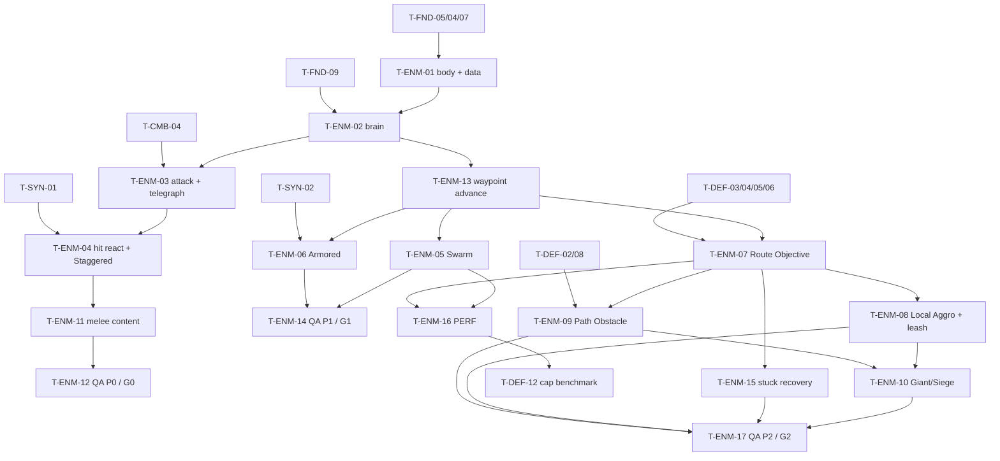

# Enemies (ENM): Tasks

## 1. Summary

Builds the enemy base and archetypes in three phase slices: P0 one melee enemy for the Combat Sandbox (G0), P1 Swarm + Armored for Combined Arms (G1, A-03), P2 Giant/Siege plus lane behavior (Route Objective, Local Aggro + leash, Path Obstacle Target, resume after destruction) for Defense & Pathing (G2). Spec: [spec.md](spec.md). Plan: [technical-plan.md](technical-plan.md). All paths are proposals.

Anchor IDs T-ENM-01..10 keep the meanings fixed in the shared brief. T-ENM-11..17 are added after them.

Rules with no task by design: R-ENM-31, R-ENM-32 ([DEFERRED] flying and biome special enemies) and R-ENM-33 (difficulty is data hooks only, kept by T-ENM-01 / T-ENM-11 data fields).

## 2. Task Overview

| ID | Task | Type | Phase | Priority | Dependencies | Status |
|---|---|---|---|---|---|---|
| T-ENM-01 | `AEnemyCharacter` + `UEnemyArchetypeDefinition` + health/combat-state wiring + team + death/despawn | GAMEPLAY | P0 | Must | T-FND-04, T-FND-05, T-FND-07 | Done |
| T-ENM-02 | `UEnemyBrainComponent` FSM skeleton with timer-driven decision tick | AI | P0 | Must | T-ENM-01, T-FND-09 | Done |
| T-ENM-03 | Melee attack with telegraph | GAMEPLAY | P0 | Must | T-ENM-02, T-CMB-04, T-UXF-01 | Todo |
| T-ENM-04 | Hit reaction + Staggered behavior | GAMEPLAY | P0 | Must | T-ENM-03, T-SYN-01, T-UXF-01 | Todo |
| T-ENM-11 | P0 melee enemy content + sandbox tuning pass | DESIGN | P0 | Must | T-ENM-03, T-ENM-04, T-CMB-01 | Todo |
| T-ENM-12 | P0 Functional Tests + G0 enemy check | QA | P0 | Must | T-ENM-11, T-FND-10, T-CMB-08, T-CMB-09, T-UXF-03 | Todo |
| T-ENM-13 | Waypoint route following + sandbox goal (P1 advance) | AI | P1 | Must | T-ENM-02 | Todo |
| T-ENM-05 | Swarm archetype | GAMEPLAY | P1 | Must | T-ENM-13, T-ENM-04, T-SQD-02 | Todo |
| T-ENM-06 | Armored archetype | GAMEPLAY | P1 | Must | T-ENM-13, T-ENM-04, T-SYN-02 | Todo |
| T-ENM-14 | P1 Functional Tests + G1 enemy check | QA | P1 | Must | T-ENM-05, T-ENM-06, T-SQD-07, T-SYN-05 | Todo |
| T-ENM-07 | Route Objective: follow assigned lane via lane layer | AI | P2 | Must | T-ENM-13, T-DEF-03, T-DEF-04, T-DEF-05, T-DEF-06 | Todo |
| T-ENM-08 | Local Aggro + leash vs route | AI | P2 | Must | T-ENM-07, T-DEF-02, T-SQD-02 | Todo |
| T-ENM-09 | Attack Path Obstacle Target structures + resume route | AI | P2 | Must | T-ENM-07, T-DEF-02, T-DEF-05, T-DEF-06, T-DEF-08 | Todo |
| T-ENM-10 | Giant/Siege archetype | GAMEPLAY | P2 | Must | T-ENM-08, T-ENM-09, T-DEF-10 | Todo |
| T-ENM-15 | Enemy stuck / no-progress recovery | AI | P2 | Must | T-ENM-07 | Todo |
| T-ENM-16 | Enemy cost pass + numbers for the cap benchmark | PERF | P2 | Must | T-ENM-05, T-ENM-07, T-FND-08 | Todo |
| T-ENM-17 | P2 Functional Tests + G2 enemy check | QA | P2 | Must | T-ENM-08, T-ENM-09, T-ENM-10, T-ENM-15, T-DEF-07 | Todo |

`T-ENM-16` feeds `T-DEF-12` (concurrent enemy cap benchmark).

## 3. Detailed Tasks

## P0

### T-ENM-01 — Enemy character, archetype definition, death/despawn

- **Type / Phase:** GAMEPLAY / P0
- **Objective:** An enemy actor that initializes from a Data Asset, takes hits through the shared contract, is hostile to the player team, and dies/despawns cleanly with one removal report.
- **Related Requirements:** R-ENM-02, R-ENM-03, R-ENM-04, R-ENM-09; AC-ENM-06
- **Dependencies:** T-FND-04 (tags), T-FND-05 (contract), T-FND-07 (settings, Primary Asset Types)

**Implementation Notes**
- [x] Create `UEnemyArchetypeDefinition` (`: UGameDefinition`, foundation §9) with P0 fields from spec §13 (tags, name, `EnemyClass`, health, `BaseArmor`, embedded `FCombatStateConfig` from SYN (MaxPoise, poise regen delay/rate, StaggerDuration), walk speed, attack list, decision interval, aggro radius, despawn delay). Leave room for the P3 `CounterTags` field added by T-DIR-04 (NEW-DIR-02). Register as Primary Asset Type `EnemyArchetypeDefinition` in `DefaultGame.ini`. `IsDataValid` (call `Super`): class set, health > 0, at least one attack.
- [x] Create `FEnemyRuntimeParams`; copy tunables from the DA in `InitFromSpawn` / `BeginPlay`. Never write to the DA.
- [x] Create `AEnemyCharacter` with `UHealthComponent`, `UCombatStateComponent`; init both from the DA. Implement `IGenericTeamAgentInterface` (team 1). `AIControllerClass` = stock `AAIController`, auto-possess placed or spawned.
- [x] `FEnemySpawnParams` + `InitFromSpawn(Archetype, Params)` for `SpawnActorDeferred` callers. `Archetype` is `EditAnywhere` for level-placed sandbox enemies.
- [x] Death on `OnDeath`: stop movement, capsule ignores Pawn channel, call `OnDeathPresentation()` (BlueprintImplementableEvent), play `Feedback.Enemy.Death`, `SetLifeSpan(DespawnDelay)`.
- [x] `OnEnemyRemoved(Enemy, EEnemyRemovedReason)` multicast, broadcast through one function guarded by `bRemovalReported`. Call it from death (`Killed`), `Despawn()` (`Despawned`), `FellOutOfWorld` override (`OutOfWorld`) and `EndPlay` (fallback `Despawned`).
- [x] Add leaf tags `Unit.Enemy.Melee`, `Unit.Enemy.Elite`, `Feedback.Enemy.Death`.

**Expected Files / Assets:** `Source/<Game>/Enemy/EnemyCharacter.h/.cpp`, `EnemyArchetypeDefinition.h/.cpp`; `Content/<Game>/Enemy/BP_Enemy_Base`, `DA_Enemy_Test`.

**Test Case:** Place `BP_Enemy_Base` with `DA_Enemy_Test` (100 HP) → cheat-apply an `FCombatHit` of 100 damage → enemy dies, `OnEnemyRemoved(Killed)` fires once, actor is destroyed after the despawn delay. Kill another with `Z` below kill height → `OnEnemyRemoved(OutOfWorld)` once.

**Acceptance Criteria**
- [x] Health and poise come from the DA; editing the DA changes them without code.
- [x] Every removal path reports exactly once (Automation or Functional check).
- [x] Dead enemy does not block Hero movement.
- [x] DA with no attacks fails `IsDataValid`.

**Verification:** Automation Spec `Enemy.Lifecycle` (spawn, damage, death report count); PIE check in `L_Test_EnemyCombat`.

**Review handoff (2026-10-06, Codex):** native body/data/lifecycle code, unit leaf tags, Asset Manager registration, removal contract and `CastleDefender.Enemy.Lifecycle` Specs are authored. `FeedbackTags::Enemy_Death` and its existing row are reused. No Blueprint/Data Asset/test-map content has been created; no Unreal build or Spec run was possible on this macOS executor. Windows/editor steps are in the latest `progress.md` entry. Keep Review until compiled, integrated with `BP_Enemy_Base`/`DA_Enemy_Test` and verified. T-ENM-02 remains Todo until this task is Done.

**Windows verification (2026-10-06, Claude Code):** editor and game builds pass; full gate 119/119 with 0 warnings after the Spec fixture registered a world context. `Tools/create_enemy_assets.bat` (idempotent) created `BP_Enemy_Base` (Quinn + `ABP_Unarmed`, Archetype unset), `DA_Enemy_Test` (fixture: 100 HP, 300 walk, 50 poise, one attack) and placeholder `AM_Enemy_Test_Attack` (no windows; T-ENM-03). Both assets pass editor data validation. PIE (user, 2026-10-06): a killed enemy stops, does not block the hero and despawns after 3 s; a KillZ fall removes it; editing DA MaxHealth changes the next spawn. Pass → Done.

### T-ENM-02 — Brain FSM skeleton with timer-driven decision tick

- **Type / Phase:** AI / P0
- **Objective:** `UEnemyBrainComponent` decides on a timer, finds a hostile in its aggro radius, chases it, and exposes debug draw + Visual Logger. No attack yet.
- **Related Requirements:** R-ENM-10, R-ENM-11; AC-ENM-01, AC-ENM-07, AC-ENM-08
- **Dependencies:** T-ENM-01, T-FND-09 (CVar + cheat + Visual Logger convention)

**Implementation Notes**
- [x] Component tick disabled. `FTimerHandle` looping at `RuntimeParams.DecisionInterval`, first fire after a random offset in [0, interval).
- [x] `EEnemyBrainState` with all states from the plan; P0 uses `Idle, Engage, Attacking (stub), Staggered (stub), Paused, Dead`. `SetState()` logs to Visual Logger and fires `OnBrainStateChanged`.
- [x] Hostile scan: one sphere overlap (`OverlapMultiByObjectType`, Pawn channel for now) at aggro radius, filter hostile team + alive. Scan only when there is no valid combat target.
- [x] Record last attacker from `UHealthComponent::OnDamaged` (instigator + game time).
- [x] Put `PickTarget` in `EnemyTargeting.h/.cpp` as a pure function (candidates → best by priority index, recent attacker, distance²). P0 priority list: Hero, Soldier.
- [x] Chase: `AAIController::MoveToActor` with acceptance radius = max attack range; re-issue only when the target moved more than a threshold.
- [x] `PauseDecisions()/ResumeDecisions()`.
- [x] `game.debug.Enemy` CVar: on decision tick draw state text, aggro radius, line to target (lifetime = interval). Off = no draw calls.

**Expected Files / Assets:** `Source/<Game>/Enemy/EnemyBrainComponent.h/.cpp`, `EnemyTargeting.h/.cpp`; `Source/<Game>/Tests/EnemyTargeting.spec.cpp`.

**Test Case:** Enemy in `L_Test_EnemyCombat`, test dummy (T-FND-09) placed outside aggro radius → enemy stays `Idle` → move dummy inside radius → within 2 decision intervals the enemy is in `Engage` and moving to it.

**Acceptance Criteria**
- [x] `PrimaryComponentTick.bCanEverTick == false` on the brain.
- [x] Decision cadence follows the DA value (measured by counting decisions over 5 s).
- [x] 20 enemies spawned in one frame do not all decide in the same frame (log timestamps).
- [x] `PickTarget` Automation Spec passes (priority, tie-breaks).

**Verification:** Automation Spec `Enemy.Targeting`; Functional Test `FT_Enemy_AggroChase`; Visual Logger capture reviewed.

**Review handoff (2026-10-06, Claude Code):** `UEnemyBrainComponent` (tick off; looping timer at `DecisionInterval` with a random first offset; Idle/Engage/Paused/Dead; Visual Logger + `OnBrainStateChanged` on every change), pure `EnemyTargeting::PickTarget`, `game.debug.Enemy` draw on each decision. P0 target kinds: `AHeroCharacter` = Hero, any other hostile pawn = Soldier. Priority list is data: `UEnemyArchetypeDefinition::TargetPriority` (default Hero, Soldier; empty fails validation). Chase uses one `MoveToActor` per goal; the engine re-paths when the goal moves > 100 cm, so no extra threshold tunable. "Recent attacker" = last actor that damaged the enemy (NEW-ENM-3 default). Builds pass; full gate 126/126, 0 warnings; `Enemy.Targeting` stable over 3 runs (cadence 20–21 decisions per 5 s at 0.25 s, 20 enemies spread). `FT_Enemy_AggroChase` (Blueprint FT per foundation §16, generated with its navmesh by `Tools/create_enemy_assets.bat`): hero 10 m away → Idle; hero teleported to 3 m → Engage and closer than 280 cm after 1 s; passes in the full gate (127/127). `Archetype` is `ExposeOnSpawn` so Blueprint spawners set it. PIE (user, 2026-10-06): debug circle/state visible, Idle → Engage on entering the radius, chase to attack range. Pass → Done.

### T-ENM-03 — Melee attack with telegraph

- **Type / Phase:** GAMEPLAY / P0
- **Objective:** Enemy picks an attack in range, shows a readable wind-up, tracks the target only during wind-up, hits through the shared hit-window helper, and commits to the attack.
- **Related Requirements:** R-ENM-05, R-ENM-06; AC-ENM-02, AC-ENM-03
- **Dependencies:** T-ENM-02, T-CMB-04 (`UCombatLibrary::DeliverHit`, `UMeleeTraceComponent`), T-UXF-01

**Implementation Notes**
- [ ] `FEnemyAttackDefinition`: montage, range, damage, poise damage, `bIsHeavy`, play rate, cooldown, weight. Global min time between attacks in runtime params.
- [ ] Attack choice: filter by range and cooldown, weighted random; pure helper in `EnemyTargeting` (testable).
- [ ] Start: state `Attacking`, `Montage_Play` at play rate, play `Feedback.Enemy.Telegraph` (or `.Heavy` when `bIsHeavy`) at montage start, `SetFocus(Target)` with CharacterMovement rotation rate as wind-up turn rate.
- [ ] At hit-window begin: `ClearFocus` (no tracking during the active window). Use `UMeleeTraceComponent` (T-CMB-04) for the trace and deliver every hit through `UCombatLibrary::DeliverHit` with the payload (damage, poise damage, heavy flag, `SourceLayer = Enemy`, instigator). Never call `UHealthComponent::ApplyHit` directly: `DeliverHit` is what applies block, parry, i-frames, poise, states and armor.
- [ ] Commitment: no decision changes while `Attacking`; exit only on montage end, Staggered (T-ENM-04) or death.
- [ ] Optional if simple: `IsDataValid` warns when montage start → first hit-window notify is shorter than `UGameTuningSettings` min telegraph time (verify notify inspection API).
- [ ] Add tags `Feedback.Enemy.Telegraph`, `Feedback.Enemy.Telegraph.Heavy`; placeholder rows in `DT_Feedback` (flash + whoosh).

**Expected Files / Assets:** `EnemyBrainComponent.cpp` (attack path), `EnemyArchetypeDefinition.h`; `AM_Enemy_Melee_Light`, `AM_Enemy_Melee_Heavy` (placeholder).

**Test Case:** Dummy target in range → enemy plays telegraph event at T0 → damage applied at T1 → assert T1 − T0 ≥ min telegraph time. Kill the dummy during wind-up → attack still plays to its end, no crash, enemy returns to `Idle`.

**Acceptance Criteria**
- [ ] Telegraph event always precedes damage by ≥ authored minimum.
- [ ] Enemy stops rotating at hit-window start (Hero can dodge sideways).
- [ ] Hero block and parry (CMB-08/-09) work against enemy attacks without enemy-specific code in CMB.
- [ ] Attack values come from the DA only.

**Verification:** Functional Test `FT_Enemy_TelegraphGap`; PIE: dodge sideways at hit-window start avoids the hit.

### T-ENM-04 — Hit reaction + Staggered behavior

- **Type / Phase:** GAMEPLAY / P0
- **Objective:** Normal hits show a reaction without interrupting; Staggered cancels the attack and suspends decisions until the state ends.
- **Related Requirements:** R-ENM-07, R-ENM-08; AC-ENM-04, AC-ENM-05
- **Dependencies:** T-ENM-03, T-SYN-01 (poise → Staggered), T-UXF-01

**Implementation Notes**
- [ ] `OnDamaged` → `OnHitReactPresentation(FCombatHit)` BlueprintImplementableEvent (BP plays additive flinch / flash). No state change.
- [ ] Bind `UCombatStateComponent::OnStateAdded/Removed`. On `State.Combat.Staggered` added: stop attack montage (hit window must close; verify `NotifyEnd` on interrupt), `StopMovement`, `ClearFocus`, state `Staggered`, `OnStaggerPresentation(true)`.
- [ ] On removed: `OnStaggerPresentation(false)`, state `Engage` if target valid else previous movement state, decide immediately.
- [ ] Staggered duration comes from the DA via `UCombatStateComponent` (no ENM timer).
- [ ] Do not play state VFX/icon here (SYN-04 / UXF-05 own them).

**Expected Files / Assets:** `EnemyCharacter.cpp`, `EnemyBrainComponent.cpp`; `AM_Enemy_Melee_Stagger`; BP hit-react graph in `BP_Enemy_Base`.

**Test Case:** Enemy starts an attack on the dummy → during wind-up apply `State.Combat.Staggered` via cheat → no damage reaches the dummy, enemy plays stagger, no decisions logged during the state, enemy re-engages after it ends.

**Acceptance Criteria**
- [ ] Staggered during wind-up or hit window: zero damage from that attack.
- [ ] Light hits without poise break never cancel the attack.
- [ ] After Staggered ends, the enemy acts again within one decision interval.

**Verification:** Functional Test `FT_Enemy_StaggerCancel`; PIE with Hero Heavy attacks.

### T-ENM-11 — P0 melee enemy content + sandbox tuning pass

- **Type / Phase:** DESIGN / P0
- **Objective:** A playable melee enemy in `L_CombatSandbox` tuned for 3–5 minutes of combat with the Warlord.
- **Related Requirements:** R-ENM-01, R-ENM-05; AC-ENM-01, AC-ENM-09
- **Dependencies:** T-ENM-03, T-ENM-04, T-CMB-01

**Implementation Notes**
- [ ] `DA_Enemy_Melee` + `BP_Enemy_Melee` (placeholder mesh/anim from `Placeholder/`, see production-plan).
- [ ] Two attacks to start: one light (short wind-up), one heavy (long, distinct wind-up). Add more only if the G0 playtest says the enemy is boring (NEW-ENM-1).
- [ ] Place 1, 3 and 5 enemies in separate sandbox areas to test single and group fights.
- [ ] Record the tuning values used and why in the playtest note.

**Expected Files / Assets:** `DA_Enemy_Melee`, `BP_Enemy_Melee`, montages; `L_CombatSandbox` placements.

**Test Case:** Play 5 minutes against groups of 1/3/5 → note dodge/parry readability, time-to-kill, stamina pressure.

**Acceptance Criteria**
- [ ] All values tuned in the DA, none in code.
- [ ] Playtest note in `ai/game/playtests/` with tuning changes.

**Verification:** PIE playtest; values diffed in the DA.

### T-ENM-12 — P0 Functional Tests + G0 enemy check

- **Type / Phase:** QA / P0
- **Objective:** Automated P0 enemy scenarios run from the command line, and the enemy part of G0 is evaluated.
- **Related Requirements:** AC-ENM-01..09
- **Dependencies:** T-ENM-11, T-FND-10, T-CMB-08, T-CMB-09, T-UXF-03

**Implementation Notes**
- [ ] `L_Test_EnemyCombat` with Functional Tests: `FT_Enemy_AggroChase`, `FT_Enemy_TelegraphGap`, `FT_Enemy_StaggerCancel`, `FT_Enemy_DeathReportOnce`, `FT_Enemy_ParryStaggers` (Hero parry via test input helper from CMB, or direct parry-success call if CMB exposes one).
- [ ] Each test waits on events with a timeout; no fixed sleeps.
- [ ] Run G0 checklist item "one melee enemy is enough for 3–5 minutes" (master plan §3 G0) together with the CMB gate playtest; record KEEP / CHANGE / DELETE for the enemy.

**Expected Files / Assets:** `Content/<Game>/Maps/Test/L_Test_EnemyCombat`; `ai/game/playtests/G0_*.md` (enemy section).

**Test Case:** `-ExecCmds="Automation RunTests <Game>.Enemy"` → all P0 enemy tests pass.

**Acceptance Criteria**
- [ ] All listed Functional Tests pass from the command line.
- [ ] G0 enemy item recorded with a decision.

**Verification:** Command-line automation run log attached to the playtest note.

## P1

### T-ENM-13 — Waypoint route following + sandbox goal

- **Type / Phase:** AI / P1
- **Objective:** Enemies advance along a waypoint list (from spawn params or a level-placed goal), fight what they meet, then continue. P2 reuses this code with lane waypoints.
- **Related Requirements:** R-ENM-15, R-ENM-16; AC-ENM-11, AC-ENM-13
- **Dependencies:** T-ENM-02

**Implementation Notes**
- [ ] Brain stores a route copy: waypoints, checkpoint flags (unused until P2), obstacles (empty in P1), end target (null in P1), progress index.
- [ ] `FollowRoute` state: `MoveToLocation(next waypoint)`; `ReceiveMoveCompleted` success → index++ (verify delegate). Last waypoint reached with no end target → `Idle`.
- [ ] Pure helper `FindNextWaypointAhead(route, location, currentIndex)` (used after fights and later re-queries); Automation Spec.
- [ ] In `FollowRoute`, scan for hostiles each decision; when the target is gone, rejoin via the nearest waypoint ahead.
- [ ] Sources: `FEnemySpawnParams.SandboxWaypoints`; `EditInstanceOnly` goal actor on level-placed enemies; cheat `EnemySpawn <Archetype> <Count>` spawns at the crosshair with the player's look point as goal (extend T-FND-09 cheat).

**Expected Files / Assets:** `EnemyBrainComponent.cpp`, `EnemyTargeting.cpp`, `EnemyTargeting.spec.cpp`; `L_CombinedArms` goal markers.

**Test Case:** Spawn 5 enemies with a goal 40 m away and an Infantry squad (or test dummy) halfway → enemies engage it; after it dies they continue to the goal and go `Idle`.

**Acceptance Criteria**
- [ ] Enemies resume the route within one decision interval after their target dies.
- [ ] No per-frame work added (tick still disabled).
- [ ] `FindNextWaypointAhead` spec passes, including "enemy pushed sideways off the line".

**Verification:** Automation Spec; Functional Test `FT_Enemy_AdvanceAndEngage` in `L_Test_EnemyArchetypes`.

### T-ENM-05 — Swarm archetype

- **Type / Phase:** GAMEPLAY / P1
- **Objective:** Many cheap, low-HP enemies that pressure AoE and formations.
- **Related Requirements:** R-ENM-12, R-ENM-17; AC-ENM-10, AC-ENM-11
- **Dependencies:** T-ENM-13, T-ENM-04, T-SQD-02 (soldiers to fight)

**Implementation Notes**
- [ ] `DA_Enemy_Swarm` (`Unit.Enemy.Swarm`): low HP, low poise, fast walk, one short attack, threat cost 2 (§8.1 illustrative), decision interval 0.3 s.
- [ ] `BP_Enemy_Swarm`: small, light silhouette (placeholder scale/color per production-plan) distinct from Armored at ~30 m.
- [ ] Cheaper settings from the start: capsule-only collision, mesh overlap events off, montage-only anim tick when not rendered (verify option name).
- [ ] Cheat `EnemySpawn Swarm 20` used for group tests.

**Expected Files / Assets:** `DA_Enemy_Swarm`, `BP_Enemy_Swarm`, `AM_Enemy_Swarm_*`.

**Test Case:** Spawn 20 Swarm with a goal through an Infantry squad → Swarm engages soldiers; Hero Light attack kills one in 1–2 hits (per tuning).

**Acceptance Criteria**
- [ ] Swarm vs Armored silhouette check passes at ~30 m (screenshot).
- [ ] 20 Swarm in PIE keep the sandbox playable (note `stat unit` numbers; real budget in T-ENM-16).

**Verification:** PIE + Functional Test `FT_Enemy_SwarmGroup`.

### T-ENM-06 — Armored archetype

- **Type / Phase:** GAMEPLAY / P1
- **Objective:** A slow, high armor/poise enemy that rewards Heavy and Armor Broken.
- **Related Requirements:** R-ENM-13, R-ENM-14, R-ENM-17; AC-ENM-10, AC-ENM-12
- **Dependencies:** T-ENM-13, T-ENM-04, T-SYN-02 (Armor Broken + armor reduction)

**Implementation Notes**
- [ ] `DA_Enemy_Armored` (`Unit.Enemy.Armored`): high armor, high poise, slower walk, heavy telegraphed attack, threat cost 8.
- [ ] `BP_Enemy_Armored`: bulky silhouette; armored physical material so UXF-03 plays armored impact feedback (§9.8).
- [ ] Debug draw shows current armor value when `game.debug.Enemy 1` (to verify Armor Broken).

**Expected Files / Assets:** `DA_Enemy_Armored`, `BP_Enemy_Armored`, montages, armored physical material (shared with UXF-03).

**Test Case:** Same Armored target: 5 Light hits vs 5 Heavy hits → Heavy deals more damage and breaks poise first; after Heavy applies Armor Broken, Light damage per hit rises.

**Acceptance Criteria**
- [ ] Damage difference visible in debug numbers and logged.
- [ ] Armored impact feedback differs from Swarm/Melee.

**Verification:** Functional Test `FT_Enemy_ArmoredBreak`; PIE.

### T-ENM-14 — P1 Functional Tests + G1 enemy check

- **Type / Phase:** QA / P1
- **Objective:** P1 enemy scenarios automated; enemy part of G1 evaluated.
- **Related Requirements:** AC-ENM-10..13
- **Dependencies:** T-ENM-05, T-ENM-06, T-SQD-07, T-SYN-05

**Implementation Notes**
- [ ] `L_Test_EnemyArchetypes`: `FT_Enemy_AdvanceAndEngage`, `FT_Enemy_SwarmGroup`, `FT_Enemy_ArmoredBreak`, `FT_Enemy_SoldierTargeting` (soldier attacks an enemy → enemy retaliates against that soldier).
- [ ] Regression: rerun P0 enemy tests.
- [ ] G1 playtest (master plan §3 G1): note whether Swarm/Armored made squads matter and whether gang-ups were readable (NEW-ENM-6).

**Expected Files / Assets:** `L_Test_EnemyArchetypes`; `ai/game/playtests/G1_*.md` (enemy section).

**Test Case:** Command-line run of `<Game>.Enemy` → P0 + P1 tests pass.

**Acceptance Criteria**
- [ ] All P0 + P1 enemy tests green.
- [ ] G1 enemy notes recorded with KEEP / CHANGE / DELETE.

**Verification:** Automation log + playtest note.

## P2

### T-ENM-07 — Route Objective: follow assigned lane via lane layer

- **Type / Phase:** AI / P2
- **Objective:** Enemies spawned on a lane follow the lane route to the Core and re-select routes only on the §14.2 triggers.
- **Related Requirements:** R-ENM-18, R-ENM-19, R-ENM-20, R-ENM-29; AC-ENM-14, AC-ENM-18
- **Dependencies:** T-ENM-13, T-DEF-03 (Core), T-DEF-04 (lanes + subsystem), T-DEF-05 (route query), T-DEF-06 (invalidation events)

**Implementation Notes**
- [ ] `FEnemySpawnParams` gets lane handle + optional objective override. `SetAssignedLane(Lane, bRepath)` and `ForceRepath()`.
- [ ] `RequeryRoute()`: call the DEF route query, copy result into the brain route, find next waypoint ahead. Triggers: spawn; passing a checkpoint waypoint; `OnRouteInvalidated(myLane)` (sets `bRouteDirty`, query on next decision); obstacle destroyed (T-ENM-09); `ForceRepath`.
- [ ] Last waypoint → target = route end target (Core), reason `Objective`, attack until destroyed.
- [ ] Invalid result with no obstacle: move toward objective on navmesh, log error, retry each decision (never idle).
- [ ] Cheat `EnemySpawnOnLane <Archetype> <Count> <LaneIndex>` (until the DIR spawner exists).
- [ ] Visual Logger: route polyline on each re-query.

**Expected Files / Assets:** `EnemyCharacter.h/.cpp`, `EnemyBrainComponent.cpp`; `L_Test_EnemyRoute` (2 lanes + Core).

**Test Case:** Spawn 10 Swarm on lane A → they reach the Core and damage it. Log shows one route query per enemy at spawn plus one per checkpoint, none per frame.

**Acceptance Criteria**
- [ ] Re-query count matches triggers only (counter in debug).
- [ ] `OnRouteInvalidated` for lane B does not make lane A enemies re-query.
- [ ] Core receives damage from enemies at route end.

**Verification:** Functional Test `FT_Enemy_LaneToCore`, `FT_Enemy_RequeryTriggers`.

### T-ENM-08 — Local Aggro + leash vs route

- **Type / Phase:** AI / P2
- **Objective:** Enemies on a route may fight Hero/soldiers/allowed structures in a small radius, never past the leash, and always return to the lane.
- **Related Requirements:** R-ENM-25, R-ENM-26, R-ENM-27, R-DEF-12 (DEF rule implemented here); AC-ENM-19
- **Dependencies:** T-ENM-07, T-DEF-02 (structure object channel, role tags), T-SQD-02

**Implementation Notes**
- [ ] Add DA fields: leash radius, Local Aggro priority list (`EEnemyTargetKind`). Defaults per NEW-ENM-5 (Swarm/Armored: Hero, Soldier, PathObstacle, Objective).
- [ ] Scan also includes the structure object channel; classify candidates (Hero / Soldier / CombatTower / Blocker by `Structure.Role.*`; current route obstacle as PathObstacle; Core as Objective).
- [ ] Scan runs when there is no target or the target reason is `PathObstacle`/`Objective` (so a soldier can pull an enemy off a barricade if the list allows).
- [ ] Leash anchor = location where the enemy left the route. Drop target when self or target is farther than leash from the anchor → `ReturnToRoute`: re-query, move to nearest waypoint ahead, ignore aggro until within route rejoin distance (settings).
- [ ] Extend `PickTarget` spec with leash filtering.

**Expected Files / Assets:** `EnemyBrainComponent.cpp`, `EnemyTargeting.cpp/.spec.cpp`, DA updates.

**Test Case:** Enemy walking lane A; Hero steps into aggro radius → enemy attacks Hero; Hero retreats beyond leash → enemy returns to lane, continues to Core, does not re-aggro while rejoining.

**Acceptance Criteria**
- [ ] Enemy never moves farther than leash from its anchor (Visual Logger trace over 10 runs).
- [ ] No leash ping-pong when the Hero stands at the leash edge.
- [ ] Priority list change in the DA changes target choice without code.

**Verification:** Automation Spec; Functional Test `FT_Enemy_LeashReturn`, `FT_Enemy_SoldierPullsOffObstacle`.

### T-ENM-09 — Attack Path Obstacle Target structures + resume route

- **Type / Phase:** AI / P2
- **Objective:** Enemies stop at route-blocking structures, attack them, and continue after destruction; on full seal they attack the minimum-break structure.
- **Related Requirements:** R-ENM-21, R-ENM-22, R-ENM-23, R-ENM-24; AC-ENM-15, AC-ENM-16, AC-ENM-17, AC-ENM-21
- **Dependencies:** T-ENM-07, T-DEF-02, T-DEF-05 (blocking + minimum-break in route result), T-DEF-06, T-DEF-08 (Barricade)

**Implementation Notes**
- [ ] From the route result, take the first obstacle ahead of the enemy's progress; ignore obstacles behind it.
- [ ] When the obstacle is on the current/next segment: target it (reason `PathObstacle`), `MoveToActor` with acceptance = attack range; range check uses closest point on the structure collision (verify API).
- [ ] Bind the obstacle's `OnDeath`/destroyed → `bRouteDirty`; next decision re-queries and resumes `FollowRoute`.
- [ ] Enemies that cannot reach the obstacle (queued behind allies) hold position; do not count as stuck within the obstacle queue radius.
- [ ] Siege structure damage multiplier applied to hits on `AStructureBase` targets (field added here, default 1).
- [ ] No detour logic in ENM: the enemy never asks the navmesh for an alternative around an obstacle.

**Expected Files / Assets:** `EnemyBrainComponent.cpp`; `L_Test_EnemyRoute` setups: single Barricade with open detour, full seal with two Barricades, Ballista blocking corridor.

**Test Case:** Lane A blocked by a Barricade while a detour exists → enemies stop and break it (no detour). Barricade destroyed → enemies reach the Core. Full seal → enemies attack the structure DEF marked as minimum-break, then continue.

**Acceptance Criteria**
- [ ] Zero detours around a blocking structure across 10 runs.
- [ ] Resume within 2 decision intervals after destruction.
- [ ] No enemy idle longer than the stuck threshold in the full-seal case.
- [ ] Ballista blocking the corridor is attacked as a Path Obstacle.

**Verification:** Functional Tests `FT_Enemy_BarricadeNoDetour`, `FT_Enemy_ResumeAfterBreak`, `FT_Enemy_FullSeal`, `FT_Enemy_TowerAsObstacle`.

### T-ENM-10 — Giant/Siege archetype

- **Type / Phase:** GAMEPLAY / P2
- **Objective:** A structure-focused elite enemy that pressures tower placement.
- **Related Requirements:** R-ENM-28, R-ENM-30, R-ENM-17; AC-ENM-20
- **Dependencies:** T-ENM-08, T-ENM-09, T-DEF-10 (Ballista as a tower target)

**Implementation Notes**
- [ ] `DA_Enemy_Siege` (`Unit.Enemy.Siege`, `Unit.Enemy.Elite` per NEW-ENM-8): high HP, slow, high structure damage multiplier (~3×), priority list Path Obstacle, Combat Tower, Blocker, Soldier, Hero, Objective; larger aggro radius; threat cost 25.
- [ ] `BP_Enemy_Siege`: large silhouette, readable at range; heavy telegraphed slam.
- [ ] Confirm the UXF-04 class marker shows for `Unit.Enemy.Siege`.

**Expected Files / Assets:** `DA_Enemy_Siege`, `BP_Enemy_Siege`, montages.

**Test Case:** Ballista 6 m off lane (not blocking), Hero nearby → Siege walks to the Ballista and attacks it, not the Hero; Swarm on the same lane ignores the Ballista.

**Acceptance Criteria**
- [ ] Siege prefers structures over units in radius; stays within leash.
- [ ] Siege identifiable within 1–2 s in a busy lane (playtest note).

**Verification:** Functional Test `FT_Enemy_SiegePrefersTower`; PIE readability check.

### T-ENM-15 — Enemy stuck / no-progress recovery

- **Type / Phase:** AI / P2
- **Objective:** No enemy stands still bugged; recovery is hidden and logged.
- **Related Requirements:** R-ENM-23 (§36), NEW-ENM-7; AC-ENM-17, AC-ENM-22
- **Dependencies:** T-ENM-07

**Implementation Notes**
- [ ] Every stuck check time (settings, counted on decision ticks) in `FollowRoute`, `Engage` (moving) or `ReturnToRoute`: if progress toward the move goal < min, and not in attack range, and not within obstacle queue radius → attempt++.
- [ ] Ladder: 1) re-issue move; 2) re-query route; 3) if `!WasRecentlyRendered()` (verify) teleport to next waypoint projected on navmesh (`ProjectPointToNavigation`), else retry later. Reset on progress.
- [ ] Each attempt: `UE_LOG` warning + Visual Logger with location.
- [ ] If T-SQD-09 already has an owner-agnostic stuck helper, reuse it instead.

**Expected Files / Assets:** `EnemyBrainComponent.cpp`; `UGameTuningSettings` fields.

**Test Case:** Spawn an enemy on a small nav island next to the lane → recovery reaches step 3 while the camera looks away → enemy appears on the lane and continues.

**Acceptance Criteria**
- [ ] Recovery never teleports an enemy the player is looking at.
- [ ] Queued enemies at a Barricade are never teleported.

**Verification:** Functional Test `FT_Enemy_StuckRecovery`.

### T-ENM-16 — Enemy cost pass + numbers for the cap benchmark

- **Type / Phase:** PERF / P2
- **Objective:** Measure per-enemy cost in a packaged build, pick the cheapest settings that keep readability, and hand numbers to T-DEF-12.
- **Related Requirements:** R-ENM-11, R-ENM-29; AC-ENM-23
- **Dependencies:** T-ENM-05, T-ENM-07, T-FND-08 (reference PC + profiling checklist)

**Implementation Notes**
- [ ] Add CPU trace scopes around decide, scan, `PickTarget`, re-query (verify macro, e.g. `TRACE_CPUPROFILER_EVENT_SCOPE`).
- [ ] `L_Test_EnemyPerf`: 1 lane, spawn 25/50/100/150 Swarm via cheat.
- [ ] Sweep: decision interval 0.2/0.3 s; RVO on/off; NavWalking on/off (verify); anim URO + montage-only offscreen tick; mesh shadows off for Swarm.
- [ ] Record game-thread ms per enemy, frame time, `stat ai`, `stat navigation` in a packaged Development build on the reference PC.
- [ ] Write chosen defaults into the DAs; send the table to T-DEF-12.

**Expected Files / Assets:** `L_Test_EnemyPerf`; `ai/game/perf/enemy-cost.md` (results table).

**Test Case:** 100 Swarm walking a lane for 60 s → Insights trace captured, per-enemy cost computed.

**Acceptance Criteria**
- [ ] Results table with settings and numbers exists and is linked from T-DEF-12.
- [ ] No setting that breaks hit notifies offscreen (verify with FT_Enemy_BarricadeNoDetour offscreen).

**Verification:** Insights traces; packaged build run.

### T-ENM-17 — P2 Functional Tests + G2 enemy check

- **Type / Phase:** QA / P2
- **Objective:** All P2 enemy scenarios automated; enemy part of G2 evaluated.
- **Related Requirements:** AC-ENM-14..22, AC-ENM-24
- **Dependencies:** T-ENM-08, T-ENM-09, T-ENM-10, T-ENM-15, T-DEF-07 (build at runtime)

**Implementation Notes**
- [ ] `L_Test_EnemyRoute` tests: `FT_Enemy_LaneToCore`, `FT_Enemy_RequeryTriggers`, `FT_Enemy_BarricadeNoDetour`, `FT_Enemy_ResumeAfterBreak`, `FT_Enemy_FullSeal`, `FT_Enemy_BuildAheadMidRoute`, `FT_Enemy_LeashReturn`, `FT_Enemy_SoldierPullsOffObstacle`, `FT_Enemy_SiegePrefersTower`, `FT_Enemy_TowerAsObstacle`, `FT_Enemy_StuckRecovery`, `FT_Enemy_RemovalCount` (3 scripted waves, alive count = actors).
- [ ] Regression: P0 + P1 enemy tests.
- [ ] G2 playtest (master plan §3 G2): stop-and-attack, route continues, full seal never bugged, structure breaking readable. Record KEEP / CHANGE / DELETE.

**Expected Files / Assets:** `L_Test_EnemyRoute`; `ai/game/playtests/G2_*.md` (enemy section).

**Test Case:** Command-line run of `<Game>.Enemy` → all P0–P2 enemy tests pass.

**Acceptance Criteria**
- [ ] All enemy tests green; no flaky test over 3 consecutive runs.
- [ ] G2 enemy items recorded.

**Verification:** Automation log + playtest note.

## 4. Dependency Graph

Parallel-safe: T-ENM-05 / T-ENM-06 after T-ENM-13; T-ENM-08 / T-ENM-09 / T-ENM-15 after T-ENM-07.

## 5. Integration / Regression Checklist

| Area | Expected | Result | Notes |
|---|---|---|---|
| Hero hits enemy (CMB-04) | Damage, poise, hit reaction, hit stop | | |
| Enemy hits Hero, block, parry | CMB rules apply, parry staggers enemy | | |
| Poise → Staggered (SYN-01) | Attack cancelled, no damage | | |
| Armor Broken (SYN-02) | Armored takes more damage | | |
| Soldiers vs enemies (SQD) | Both sides target each other | | |
| Lane route (DEF) | Re-query only on triggers | | |
| Barricade / Ballista blocking (DEF) | Stop-and-attack, no detour | | |
| Full seal (DEF) | Minimum-break attacked, never idle | | |
| Spawner counts (DIR) | One removal per enemy | | |
| Feedback (UXF) | Telegraph, death, class markers fire | | |
| Time dilation (TFM, P3) | Timers slow with world, no desync | | |
| Packaged build | Same behavior as PIE | | |

## 6. Final Definition of Done

- All tasks for the phase implemented, integrated and verified in PIE and the phase sandbox map.
- All enemy Automation Specs and Functional Tests for the phase pass from the command line.
- No new warnings/errors in the log during the phase test maps.
- Every [TUNABLE] value is in `UEnemyArchetypeDefinition` or `UGameTuningSettings`.
- Gate enemy items (G0/G1/G2) recorded in `ai/game/playtests/` with KEEP / CHANGE / DELETE.
- Nothing built from §20.2 / §20.3 (deferred).
