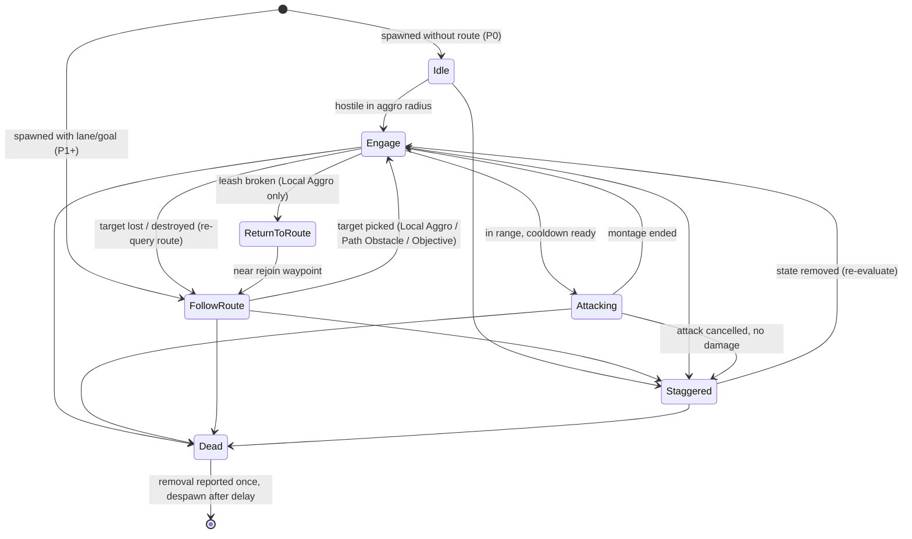
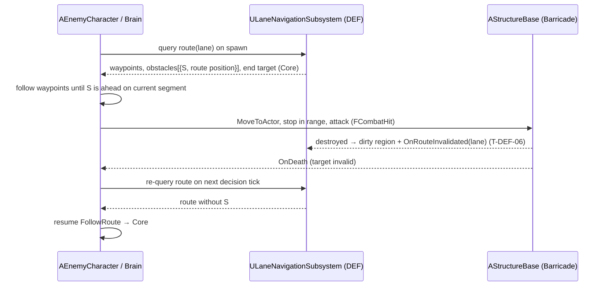

# Enemies (ENM): Technical Plan

| | |
|---|---|
| Spec | [spec.md](spec.md) |
| Architecture baseline | [00-foundation/technical-plan.md](../00-foundation/technical-plan.md), decisions D-01..D-18 in [main_implement_plan.md §7](../main_implement_plan.md#7-architecture-baseline) |
| Phases | P0 → P1 → P2 |
| Status | P0 in progress. UE project exists; T-ENM-01 C++ lifecycle source is ready for Windows/editor review. Other ENM paths remain proposals. |

## 1. Technical Overview

**T-ENM-01 source handoff (2026-10-06, Codex):** EnemyCharacter and EnemyArchetypeDefinition now implement P0 data copies, health/poise initialization, stock AI possession, guarded removal, death presentation/feedback and lifespan. `Unit.Enemy.Melee/Elite` are added in Core/GameTags; `Feedback.Enemy.Death` already exists in FeedbackTags and DT_Feedback and is reused. The native Primary Asset Type is registered. Enemy Lifecycle Specs are authored but unrun. Brain/attack execution and P1/P2 spawn fields remain with their tasks. Values without a spec default remain unset in the definition and fail validation until content tuning. No binary enemy content has been authored on this macOS executor.

One C++ character class (`AEnemyCharacter`) plus one C++ brain component (`UEnemyBrainComponent`) drive every enemy. Archetypes (melee, Swarm, Armored, Giant/Siege) are Data Assets + thin Blueprint children; no archetype has its own C++ class.

The brain is an enum state machine that decides on a **timer** (default 0.2 s, data), never in Tick. Movement uses the stock `AAIController` path following on the Recast navmesh. Routes come from DEF's lane layer (D-09): the enemy keeps a copy of its lane's waypoints and a progress index, and only re-queries on the §14.2 triggers (spawn, checkpoint, invalidation event, obstacle destroyed, forced repath). Combat goes through the shared contract (D-05): enemies send and receive `FCombatHit`, poise and states live in `UCombatStateComponent`.

Build order matches the phases: P0 base + attack + stagger; P1 adds archetype data and waypoint advance; P2 swaps the waypoint source for the lane layer and adds Local Aggro priority, leash, Path Obstacle and stuck recovery.

## 2. Existing System Impact

| System | Impact |
|---|---|
| Combat contract (FND-05, SYN-01/02) | Consumer. No changes; enemies are a main user of `UHealthComponent` armor hook and poise → Staggered |
| Hero combat (CMB-04, -08, -09, -11) | Reuses the hit-window notify + trace helper from T-CMB-04 for enemy swings. Hero block/parry handle enemy hits on the Hero side |
| Squads (SQD-02) | Soldiers are targets; no SQD code change |
| Lane layer (DEF-04/05/06) | Consumer of route query + invalidation events. Contract in Section 10 |
| Structures (DEF-02, -03, -08) | Targets (`UHealthComponent`); object channel used by the aggro scan |
| Director / spawner (DIR-01, -04) | Calls the enemy spawn init; binds `OnEnemyRemoved` for alive counts; enforces the cap |
| Feedback (UXF-01, -03, -04) | Enemy plays `Feedback.Enemy.*` tags; class marker reads `Unit.Enemy.*` |
| Debug (FND-09) | Adds `game.debug.Enemy` CVar and enemy cheats |
| Boss (BOS) | `ABossCharacter` subclasses `AEnemyCharacter` and uses its extension points |

## 3. Proposed Architecture

### 3.1 Runtime owner and lifetime
- `AEnemyCharacter` owns its components; lifetime = spawn → death + despawn delay (`SetLifeSpan`). No pooling (D-15) until T-ENM-16 shows spawn churn cost.
- `UEnemyBrainComponent` lives on the pawn (data access is local); the stock `AAIController` only moves the pawn.
- Archetype data: `UEnemyArchetypeDefinition` (Primary Data Asset), read-only at runtime. The enemy copies tunables into `FEnemyRuntimeParams` at init; the brain reads only that copy (lets BOS override per phase without mutating the asset).

### 3.2 Main UE types

| Type | Kind | Notes |
|---|---|---|
| `AEnemyCharacter` | `ACharacter`, `IGenericTeamAgentInterface` | Team 1 (Enemy). Components: `UHealthComponent`, `UCombatStateComponent`, `UEnemyBrainComponent` |
| `UEnemyArchetypeDefinition` | `UPrimaryDataAsset` | Fields in spec §13. Adds `EnemyClass` (BP child to spawn). `IsDataValid` checks required fields |
| `FEnemyAttackDefinition` | USTRUCT | Montage, range, damage, poise damage, heavy flag, play rate, cooldown, weight |
| `FEnemyRuntimeParams` | USTRUCT | Runtime copy of the archetype tunables |
| `FEnemySpawnParams` | USTRUCT | Lane handle, objective override, sandbox waypoints (P1) |
| `UEnemyBrainComponent` | `UActorComponent` | Tick disabled. FSM + timer + target selection + route progress |
| `EEnemyBrainState` | UENUM | `Idle, FollowRoute, Engage, Attacking, Staggered, ReturnToRoute, Paused, Dead` |
| `EEnemyTargetKind` | UENUM | `Hero, Soldier, PathObstacle, CombatTower, Blocker, Objective` |
| `EEnemyTargetReason` | UENUM | `LocalAggro, PathObstacle, Objective` |
| `EEnemyRemovedReason` | UENUM | `Killed, Despawned, OutOfWorld` |
| `AAIController` (stock) | — | No subclass unless a task proves it is needed |

### 3.3 Data ownership
- Definition: `DA_Enemy_Melee`, `DA_Enemy_Swarm`, `DA_Enemy_Armored`, `DA_Enemy_Siege` (`Content/<Game>/Enemy/`).
- Global enemy tunables: `UGameTuningSettings` (stuck time, max stuck attempts, obstacle queue radius, route rejoin distance, min telegraph time).
- Runtime state: only on the enemy (brain state, target, anchor, route copy, cooldowns, stuck counters). Nothing saved (D-14, A-11).
- Threat cost and kill reward are fields here but read by DIR and RUN.

### 3.4 Communication flow
- Spawner → enemy: `SpawnActorDeferred(Archetype->EnemyClass)` → `InitFromSpawn(Archetype, FEnemySpawnParams)` → `FinishSpawning`.
- Enemy → spawner/RUN: `OnEnemyRemoved(Enemy, Reason)` multicast on the enemy. Spawner binds per enemy. No global bus (D-10).
- Combat: `UHealthComponent::OnDamaged` → brain records last attacker (event-driven aggro); `OnDeath` → Dead. `UCombatStateComponent::OnStateAdded/Removed(State.Combat.Staggered)` → Staggered enter/exit.
- Lane layer → enemy: `ULaneNavigationSubsystem::OnRouteInvalidated(Lane)` → brain marks "re-query on next decision" (spreads the work over the staggered timers).
- Movement: `AAIController::ReceiveMoveCompleted` (verify in UE docs) advances route progress; no polling.
- Presentation: `UFeedbackSubsystem::Play(Tag, Context)` for telegraph and death; BlueprintImplementableEvents `OnHitReactPresentation(FCombatHit)`, `OnStaggerPresentation(bool)`, `OnDeathPresentation()` for BP-side animation/VFX.

### 3.5 C++ / Blueprint split

| C++ | Blueprint / data |
|---|---|
| FSM, timers, target selection, leash, route progress, stuck recovery | `BP_Enemy_*` children: mesh, AnimBP, physical material, placeholder look |
| Attack start/commit/cancel, hit payload, Staggered/death flow | Montages and notify placement (telegraph length is authored in the montage) |
| Removal reporting, spawn init | Hit reaction animation, death VFX/dissolve |
| Debug draw, Visual Logger, cheats | Tuning in `DA_Enemy_*` |

### 3.6 Asset references / loading
- Hard references in prototype (foundation §9): DA → `EnemyClass`, montages. BP children do **not** reference their DA by default (avoids a DA ↔ BP cycle); level-placed sandbox enemies set `Archetype` per instance.
- Revisit soft references at VS if load profiling shows a need.

### 3.7 AI / navigation impact
- Navmesh: Recast, runtime "Dynamic Modifiers Only" (foundation §11). Enemies move waypoint to waypoint with short `MoveToLocation` segments so the navmesh cannot take a long detour around a blocker; the lane layer decides route and obstacles (D-09). Waypoint spacing is a T-DEF-01 spike output.
- Path Obstacle approach: `MoveToActor(Structure, AcceptanceRadius = attack range)`. Expect a partial path that ends at the nav modifier edge (verify in UE docs); range check uses the closest point on the structure's collision.
- Avoidance: start with CharacterMovement RVO on (data flag); soldiers use DetourCrowd. Mixed RVO/crowd agents may not avoid each other (verify); capsule collision still blocks. T-ENM-16 measures and decides.

Decision tick (short pseudocode, the only non-obvious part):

```text
Decide():
  if state in {Attacking, Staggered, Paused, Dead}: return          // event-driven exits
  if state == ReturnToRoute: if near rejoin waypoint → FollowRoute; return   // aggro ignored while rejoining
  if bRouteDirty: RequeryRoute()                                    // set by events, done here
  if target valid and reason == LocalAggro and LeashBroken(): drop target; ReturnToRoute; return
  if target is none or reason in {PathObstacle, Objective}:
      best = PickTarget(scan(LocalAggroRadius) ∪ {obstacle ahead, objective at route end}, PriorityList)
      if best != target: set target (+ leash anchor = here when leaving the route)
  if target: in range ? TryStartAttack() : MoveTowards(target)      // MoveTo re-issued only if target moved > threshold
  else FollowRoute: MoveTo(next waypoint) if not already moving
```

`PickTarget` orders by (index of kind in the archetype priority list, recent attacker first, distance²). Candidates outside the leash (measured from the anchor) are dropped. It is a pure function covered by an Automation Spec.

### 3.8 UI impact
- None owned. UXF-04 shows class markers from `Unit.Enemy.*` tags; SYN-04 shows state icons.

### 3.9 Save / network impact
- None. Single-player, no replication. No enemy state is saved (A-11). Lanes referenced by handle; if mid-run save ever arrives, enemies are rebuilt from wave state, not serialized.

### 3.10 Performance risks
See Section 9.

### 3.11 Existing systems reused
`UHealthComponent`, `UCombatStateComponent`, `FCombatHit`, team interface (FND-05); hit-window notify + trace helper (CMB-04); `UFeedbackSubsystem` (UXF-01); `UGameTuningSettings`, Primary Asset registration (FND-07); `UGameCheatManager`, CVar pattern (FND-09); test harness (FND-10); stock `AAIController` path following; CharacterMovement rotation (`SetFocus` + `bUseControllerDesiredRotation`) for wind-up tracking instead of custom Tick.

### 3.12 New types / files proposed

```text
Source/<Game>/Enemy/
  EnemyCharacter.h/.cpp            AEnemyCharacter, FEnemySpawnParams, EEnemyRemovedReason
  EnemyArchetypeDefinition.h/.cpp  UEnemyArchetypeDefinition, FEnemyAttackDefinition, FEnemyRuntimeParams
  EnemyBrainComponent.h/.cpp       UEnemyBrainComponent, EEnemyBrainState, EEnemyTargetKind, EEnemyTargetReason
  EnemyTargeting.h/.cpp            pure PickTarget / leash / route-progress helpers (tested)
Source/<Game>/Tests/
  EnemyTargeting.spec.cpp
Content/<Game>/Enemy/
  BP_Enemy_Base, BP_Enemy_Melee, BP_Enemy_Swarm, BP_Enemy_Armored, BP_Enemy_Siege
  DA_Enemy_Melee, DA_Enemy_Swarm, DA_Enemy_Armored, DA_Enemy_Siege
  AM_Enemy_<Archetype>_<Attack>, AM_Enemy_<Archetype>_Stagger, AM_Enemy_<Archetype>_Death
Content/<Game>/Maps/Test/
  L_Test_EnemyCombat (P0), L_Test_EnemyArchetypes (P1), L_Test_EnemyRoute (P2), L_Test_EnemyPerf (P2)
```

New leaf tags (under existing roots): `Unit.Enemy.Melee`, `Unit.Enemy.Elite`, `Feedback.Enemy.Telegraph`, `Feedback.Enemy.Telegraph.Heavy`, `Feedback.Enemy.Death`.

### 3.13 Trade-offs

| Choice | Alternative | Why this one |
|---|---|---|
| C++ enum FSM + timer (D-08) | Behavior Tree / StateTree | Many simple units; deterministic; cheap; testable |
| Brain on pawn, stock controller | Custom controller with brain | One less class; data is on the pawn |
| Physics overlap scan, only when not locked on a combat target | Registry of friendly units / AIPerception | No registry to maintain; perception is heavier. Revisit if T-ENM-16 shows scan cost |
| Route copied per enemy + progress index | Shared pointer to lane route | No dangling data on invalidation; 50 waypoints × N enemies is tiny |
| Telegraph = montage start → hit-window notify | Separate telegraph notify state | No new notify; FT measures the gap |
| Per-archetype data, no archetype C++ | Subclass per archetype | §34.1: content without code |

### 3.14 Extension points used by BOS (no other users)
`FEnemyRuntimeParams` (phase overrides), `PauseDecisions()/ResumeDecisions()`, `ForceRepath()`, `SetAssignedLane(Lane, bRepath)`, `OnBrainStateChanged`.

### 3.15 Verification
Automation Spec for pure targeting/leash/progress helpers; Functional Tests per phase map (Section 8); PIE checks in sandbox maps; packaged-build profiling (T-ENM-16).

## 4. Runtime Flow



`Paused` (BOS phase transition, cheats) can be entered from any non-Dead state and returns to re-evaluation.

Path Obstacle sequence (P2):



## 5. State / Data

| State | Owner | Changed by | Read by |
|---|---|---|---|
| Brain state | `UEnemyBrainComponent` | Decision tick, combat events | Debug, BOS |
| Current target + reason, leash anchor | Brain | Decision tick, `OnDamaged` | Debug |
| Route copy, progress index, checkpoint flags | Brain | Route query results, move completed | Brain |
| Attack cooldowns | Brain | Attack start | Brain |
| Health, armor | `UHealthComponent` | `FCombatHit` | Enemy, UXF |
| Poise, Staggered, Armor Broken | `UCombatStateComponent` | `FCombatHit`, SYN | Enemy, SYN consumers |
| Runtime params | `AEnemyCharacter` | Init from DA; BOS phase overrides | Brain |

All [TUNABLE] values: `UEnemyArchetypeDefinition` (per archetype) or `UGameTuningSettings` (global). See spec §13.

## 6. Main Implementation Areas

1. **Body + data (P0):** character, definition, runtime params, team, health/poise wiring, death and removal reporting (`EndPlay` guard so every removal path reports once; `FellOutOfWorld` override reports `OutOfWorld`).
2. **Brain skeleton (P0):** timer with random start offset, FSM, hostile scan, chase, debug draw, Visual Logger.
3. **Attack (P0):** attack selection (range, weight, cooldowns), telegraph feedback at montage start, `SetFocus` tracking during wind-up and `ClearFocus` at hit window, hit payload for the CMB-04 helper, commitment.
4. **Reactions (P0):** hit reaction presentation event; Staggered enter/exit (stop montage, stop movement, play stagger, resume).
5. **Archetypes/content (P0/P1/P2):** P0 DA_Enemy_Melee + BP_Enemy_Melee inherit base presentation, with red Quinn materials and separate 1/3/5 areas (T-ENM-11). Initial data is seeded from the fixed fixture and recorded in the G0 melee-baseline note; owner accepts final tuning/feel. Swarm/Armored/Siege stay behind P1/P2 gates.
6. **Waypoint following (P1):** route copy + progress; sandbox goal waypoints.
7. **Lane route (P2):** lane query, re-query triggers, checkpoint handling, objective at route end.
8. **Local Aggro + leash (P2):** priority list, leash anchor, ReturnToRoute with aggro suppression until rejoin.
9. **Path Obstacle (P2):** obstacle ahead detection from route result, approach, attack, queue handling, resume.
10. **Stuck recovery (P2):** progress sampling, recovery ladder, logging.
11. **Perf pass (P2):** instrumentation, settings sweep, numbers for T-DEF-12.

## 7. Error and Edge-Case Handling

| Case | Handling |
|---|---|
| Archetype missing on spawn | Log error, destroy actor, report `Despawned` (spawner count stays correct) |
| Route query returns invalid route and no obstacle | Move directly toward the objective on navmesh; `UE_LOG` error + Visual Logger; retry query every decision |
| `MoveTo` fails (no path) | Count as a stuck attempt; next ladder step |
| Target actor destroyed without `OnDeath` | Target held as weak pointer; invalid → re-evaluate |
| Staggered during hit window | Montage stop must end the hit-window notify state (verify `NotifyEnd` fires on interrupt); otherwise the CMB-04 helper must expose an explicit close |
| Many enemies get `OnRouteInvalidated` at once | Only set a dirty flag; query happens on each enemy's next staggered decision; DEF caches per lane version |
| Enemy offscreen attacking a structure | Animation must keep ticking montages so hit notifies fire (`OnlyTickMontagesWhenNotRendered`, verify) |
| Leash ping-pong at the leash edge | Aggro ignored in ReturnToRoute until within rejoin distance |
| Enemies queued behind allies at an obstacle | Not counted as stuck within the obstacle queue radius |
| Removal reported twice | Single `bRemovalReported` guard in the one broadcast function |

## 8. Testing Strategy

| Layer | What | Where |
|---|---|---|
| Automation Spec | `PickTarget` ordering, leash break, nearest-waypoint-ahead, obstacle-ahead selection, attack selection by range/cooldown | `Tests/EnemyTargeting.spec.cpp` |
| Functional Test P0 | Aggro → attack; telegraph gap ≥ min; Staggered cancels attack; death reports once; brain tick disabled | `L_Test_EnemyCombat` |
| Functional Test P1 | Swarm group advances to goal and fights soldiers; Armored Light vs Heavy vs Armor Broken damage | `L_Test_EnemyArchetypes` |
| Functional Test P2 | Open lane → Core; Barricade stop-and-attack with detour available; resume after destroy; full seal; mid-route build; leash return; Siege vs tower; Ballista as obstacle; stuck recovery; removal counts | `L_Test_EnemyRoute` |
| Perf | N Swarm on a lane, packaged Development build, reference PC | `L_Test_EnemyPerf` |
| Manual | G0 / G1 / G2 enemy checks with playtest notes | Sandbox maps |

Functional Tests use cheats/spawn helpers, wait on events (not fixed sleeps) with a timeout, and assert via public state getters.

## 9. Performance Risks

| Risk | Mitigation | Measured in |
|---|---|---|
| CharacterMovement per enemy (R-F1) | Capsule-only collision, no overlap events on mesh, candidate NavWalking mode for Swarm (verify), RVO flag | T-ENM-16 |
| Skeletal animation count | URO and visibility-based anim tick (montages still tick) | T-ENM-16 |
| Aggro scans | Scan only when not locked on a combat target; one sphere overlap with filtered object types | T-ENM-16 |
| Decision spikes (all enemies same frame) | Random timer start offset | T-ENM-02 test |
| Route re-query storms | Dirty flag + per-lane cache in DEF | T-ENM-07 FT, T-DEF-06 |
| Pathfinding for many short MoveTo | Waypoint spacing from spike; fallback per-lane flow field (D-09) | T-DEF-01, T-ENM-16 |
| Debug draw cost | Draw only when CVar on, on decision tick with lifetime = interval | — |

Rule: no pooling, Mass or custom scheduler unless T-ENM-16 / T-DEF-12 shows the need (D-15).

## 10. Dependencies and Risks

### Contract expected from DEF (owned by DEF; names indicative, final in T-DEF-05/06)
- Route query for a lane returns: ordered waypoints with checkpoint flags; obstacles on that route with their position along it (so enemies past an obstacle ignore it); the route end target (Core); a route version; a valid flag. When no walkable route exists, the obstacle list contains the minimum-break structure(s).
- `OnRouteInvalidated(Lane)` fired on build/destroy in that lane's dirty region.
- Structures: `UHealthComponent`, team, role tag `Structure.Role.*`, a known collision object channel for the aggro scan.
- If T-DEF-01 replaces the waypoint model with a per-lane flow field, only area 7 (lane route) changes: "next waypoint" becomes "flow direction sample". FSM and Path Obstacle logic stay.

### Other cross-feature asks
- T-CMB-04: hit-window notify + trace/dispatch helper must be owner-agnostic (enemy supplies its own hit payload and team filter).
- T-FND-09: enemy spawn cheat accepts archetype name and count (ENM adds lane parameter in P2).
- T-ENM-11 implements SpawnEnemy in the existing GameCheatManager: validates the DA, InitFromSpawn before FinishSpawning, P0 per-call cap of five. The Blueprint/dev entry point supports QA replacements without repeated console lookups. Lane support stays P2.
- T-DIR-01: spawner uses `SpawnActorDeferred` + `InitFromSpawn` and binds `OnEnemyRemoved`.

### Risks

| Risk | Impact | Mitigation |
|---|---|---|
| Spike T-DEF-01 changes the route model | Rework of T-ENM-07 | Keep lane code in one area (Section 6, item 7) |
| Navmesh detours around a blocker between waypoints | Breaks §14.3 | Short segments; FT "detour available" case; spike tunes spacing |
| Enemy swings via CMB helper couple ENM to Hero code | Build order | Helper lives in `Combat/`, not `Hero/` |
| Swarm count too high for Characters | FPS, readability | T-ENM-16 → T-DEF-12 cap; crowd readability first (§31.2) |

### Change requests
None. D-05, D-08, D-09, D-10, D-15 fit this feature as written.

## 11. Requirement Coverage

| Requirement | Technical area | Notes |
|---|---|---|
| R-ENM-01 | Area 5, `DA_Enemy_Melee` | Sandbox archetype |
| R-ENM-02 | `UEnemyArchetypeDefinition`, `IsDataValid` | |
| R-ENM-03 | Area 1, shared contract | No custom damage path |
| R-ENM-04 | Team interface, scan filter | Team 1 |
| R-ENM-05 | Area 3 | Commitment, telegraph tag, `SetFocus` tracking |
| R-ENM-06 | Area 3 + CMB-08/09 | Hero side in CMB |
| R-ENM-07 | Area 4, SYN-01 | |
| R-ENM-08 | Area 4 | Presentation event only |
| R-ENM-09 | Area 1 | `OnEnemyRemoved`, `EndPlay` guard |
| R-ENM-10 | Area 2 | Hostile scan |
| R-ENM-11 | Area 2 | Timer, tick disabled |
| R-ENM-12, R-ENM-13 | Area 5 | Data + BP |
| R-ENM-14 | SYN-02 (armor hook) | ENM supplies armor value |
| R-ENM-15 | Area 2/8 | Soldiers in scan |
| R-ENM-16 | Area 6 | Sandbox waypoints |
| R-ENM-17 | Area 5 | Placeholder looks |
| R-ENM-18, R-ENM-19, R-ENM-20 | Area 7 | Lane query + triggers |
| R-ENM-21, R-ENM-22, R-ENM-24 | Area 9 | Obstacles come from DEF |
| R-ENM-23 | Area 9 + 10 | Minimum-break consumer, never idle |
| R-ENM-25, R-ENM-27 | Area 8 | `PickTarget` priority list |
| R-ENM-26 | Area 8 | Leash anchor, ReturnToRoute |
| R-ENM-28 | Area 5 + 8 | Siege data |
| R-ENM-29 | Section 3.4 | Spawner only |
| R-ENM-30 | Area 5 + UXF-04 | |
| R-ENM-31, R-ENM-32 | — | Deferred, nothing built |
| R-ENM-33 | Data model | Hooks are data |
