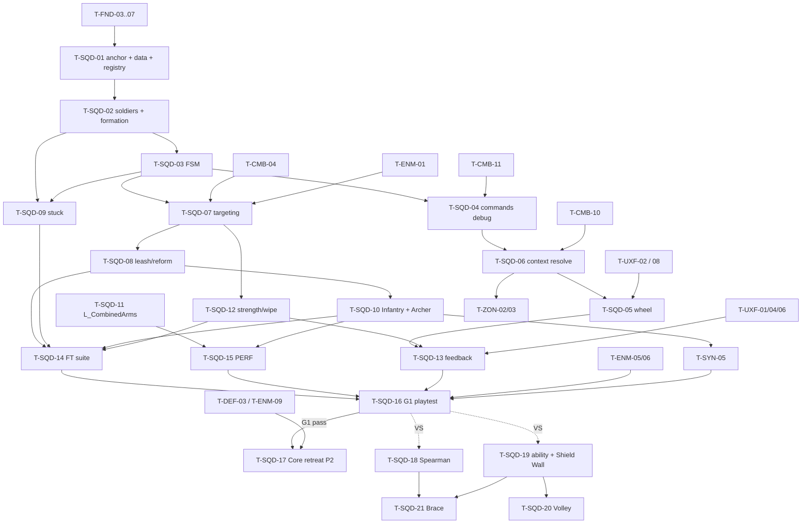

# Squad Command: Tasks

| | |
|---|---|
| Spec / plan | [spec.md](spec.md) · [technical-plan.md](technical-plan.md) |
| Phases | P1 (gate G1) · P2 · VS (provisional) |
| Task count | 21 (P1: 16, P2: 1, VS: 4) |

## 1. Summary

P1 builds the whole command layer: squad anchor + soldiers, FSM, 4 commands, Command Wheel with context target, targeting, leash, stuck recovery, strength/wipe, feedback, the `L_CombinedArms` map, tests, a PERF capture and the G1 gate playtest. P2 adds Core retreat and the structure-defense target rule; ZON builds on the hook from `T-SQD-06`. VS tasks (Spearman, one ability per squad) are provisional: re-validate after G3.

All paths are proposals. Every task ends with the master plan Definition of Done (§8): implemented, integrated, verified in PIE and `L_CombinedArms`, no new warnings, tuning in data, verification recorded.

## 2. Task Overview

| ID | Task | Type | Phase | Priority | Dependencies | Status |
|---|---|---|---|---|---|---|
| T-SQD-01 | `ASquad` anchor + `USquadDefinition` + soldier spawning + registration with `UCommandComponent` | GAMEPLAY | P1 | Must | T-FND-03, T-FND-04, T-FND-05, T-FND-06, T-FND-07 | Todo |
| T-SQD-02 | `ASoldierCharacter` + crowd avoidance + formation slots, stretch and assignment | AI | P1 | Must | T-SQD-01 | Todo |
| T-SQD-03 | Squad FSM states/transitions + decision timer | AI | P1 | Must | T-SQD-02, T-FND-10 | Todo |
| T-SQD-04 | `UCommandComponent` + `FSquadOrder` + 4 commands via debug input | GAMEPLAY | P1 | Must | T-SQD-03, T-FND-09, T-CMB-11 | Todo |
| T-SQD-05 | Command Wheel UI + input flow | UI | P1 | Must | T-SQD-06, T-UXF-02, T-UXF-08 | Todo |
| T-SQD-06 | Context-sensitive target resolution + Tactical Zone extension point | GAMEPLAY | P1 | Must | T-SQD-04, T-CMB-10 | Todo |
| T-SQD-07 | Engagement + target priority per squad type | AI | P1 | Must | T-SQD-03, T-CMB-04, T-ENM-01 | Todo |
| T-SQD-08 | Leash, disengage, reform | AI | P1 | Must | T-SQD-07 | Todo |
| T-SQD-09 | Stuck recovery ladder | AI | P1 | Must | T-SQD-02, T-SQD-03 | Todo |
| T-SQD-10 | Infantry + Archer content incl. archer ranged attack | GAMEPLAY | P1 | Must | T-SQD-07, T-SQD-08 | Todo |
| T-SQD-11 | `L_CombinedArms` map setup + sandbox encounter | DESIGN | P1 | Must | T-FND-01, T-FND-09, T-CMB-01, T-ENM-01, T-ENM-13 | Todo |
| T-SQD-12 | Squad strength, low strength, wipe + respawn, Recover replenish | GAMEPLAY | P1 | Must | T-SQD-03, T-SQD-07 | Todo |
| T-SQD-13 | Command and squad feedback wiring (markers, squad strip, ack/invalid, pings) | UI | P1 | Must | T-SQD-05, T-SQD-12, T-UXF-01, T-UXF-04, T-UXF-06 | Todo |
| T-SQD-14 | Functional Test suite `L_Test_Squad` + regression list | QA | P1 | Must | T-SQD-08, T-SQD-09, T-SQD-10, T-SQD-12 | Todo |
| T-SQD-15 | PERF capture: 3 squads engaged on reference PC | PERF | P1 | Should | T-SQD-10, T-SQD-11, T-FND-08 | Todo |
| T-SQD-16 | G1 gate playtest: Hero alone vs Hero + squads | QA | P1 | Must | T-SQD-05, T-SQD-10, T-SQD-11, T-SQD-13, T-SQD-14, T-SQD-15, T-ENM-05, T-ENM-06, T-SYN-05, T-UXF-08, T-UXF-09, T-ENM-14, T-SYN-04, T-SYN-07, T-SYN-09, T-SYN-10, T-UXF-05, T-UXF-12, T-UXF-13, T-UXF-14 | Todo |
| T-SQD-17 | Retreat to Core + Infantry structure-defense rule | AI | P2 | Must | T-SQD-07, T-SQD-12, T-DEF-03, T-ENM-09 | Todo |
| T-SQD-18 | Spearman squad (provisional) | GAMEPLAY | VS | Could | T-SQD-10, T-SYN-02 | Todo |
| T-SQD-19 | Squad ability slot + Shield Wall (provisional) | GAMEPLAY | VS | Could | T-SQD-05, T-SQD-10, T-PRK-02 | Todo |
| T-SQD-20 | Archer Volley (provisional) | GAMEPLAY | VS | Could | T-SQD-19 | Todo |
| T-SQD-21 | Spearman Brace (provisional) | GAMEPLAY | VS | Could | T-SQD-18, T-SQD-19, T-SYN-01 | Todo |

## 3. Detailed Tasks

## P1

### T-SQD-01 — `ASquad` anchor + `USquadDefinition` + soldier spawning + registration

**Type** GAMEPLAY · **Phase** P1

**Objective**
A placed `BP_Squad_*` spawns its soldiers around its anchor and registers with the player's `UCommandComponent` (cap 3).

**Related Requirements** R-SQD-01, R-SQD-10, R-SQD-12, R-SQD-26 · AC-SQD-11, AC-SQD-15

**Dependencies** T-FND-03, T-FND-04, T-FND-05, T-FND-06, T-FND-07

**Implementation Notes**
- [ ] `USquadDefinition` (`UPrimaryDataAsset`) with all fields from spec §13 except ability, incl. `BaseArmor` and embedded `FCombatStateConfig` (same struct as enemy definitions, from FND/SYN); register Primary Asset Type `SquadDefinition`; `IsDataValid` per technical plan §3.2.
- [ ] `SquadTypes.h`: `ESquadState`, `FSquadOrder`, `FSquadTargetRule`, `ESquadTargetRuleType` (types only).
- [ ] `ASquad`: root scene component, `Definition`, `HomeTransform` (BeginPlay transform), `TArray<FSoldierRuntime>`; spawn `Definition->SoldierCount` soldiers with `SpawnActorDeferred` at grid offsets (temporary until T-SQD-02), set squad back-pointer and team id 0.
- [ ] Bare `ASoldierCharacter` (`ACharacter`, `UHealthComponent`, `UCombatStateComponent`, `IGenericTeamAgentInterface`); components initialised from the definition (HP, `BaseArmor`, `FCombatStateConfig`); behavior comes in T-SQD-02.
- [ ] `UCommandComponent` skeleton on `AHeroPlayerController`: `RegisterSquad` / `UnregisterSquad`, refuses beyond `UGameTuningSettings::MaxActiveSquads` (add field, default 3), `GetSquads()`, `OnSquadsChanged`.
- [ ] `ASquad::BeginPlay` registers with the first local player controller's component; `EndPlay` unregisters.
- [ ] Add tags `Unit.Squad.*` leaves if missing; `game.debug.Squads` CVar draws anchor + soldier ids.

**Expected Files / Assets** `Army/SquadTypes.h`, `Army/SquadDefinition.*`, `Army/Squad.*`, `Army/SoldierCharacter.*`, `Player/CommandComponent.*`; `DA_Squad_Test`, `BP_Squad_Test`

**Test Case** Place 4 `BP_Squad_Test` in a test map → PIE → 3 squads spawn soldiers and register; the 4th logs an error and spawns nothing.

**Acceptance Criteria**
- [ ] Soldier count matches definition; changing count in the DA changes spawned soldiers without code change.
- [ ] Registry never exceeds `MaxActiveSquads`.
- [ ] Definition with 0 soldiers or no soldier class fails `IsDataValid`.

**Verification** Automation Spec for registry cap (component in isolation); PIE check with `game.debug.Squads 1`.

### T-SQD-02 — `ASoldierCharacter` + crowd avoidance + formation slots

**Type** AI · **Phase** P1

**Objective**
Soldiers hold slots around a moving anchor using Detour crowd avoidance; the formation narrows through chokes and restores after.

**Related Requirements** R-SQD-12, R-SQD-13, R-SQD-15 · AC-SQD-08

**Dependencies** T-SQD-01

**Implementation Notes**
- [ ] `ASoldierAIController : ADetourCrowdAIController`; team id; set avoidance groups so soldiers avoid soldiers (verify `UCrowdFollowingComponent` group API in UE docs).
- [ ] Soldier capsule overlaps the Hero's object channel so the Hero is never body-blocked (NEW-SQD-10); keeps blocking enemies.
- [ ] `SquadFormation`: pure `BuildSlots(Columns, Count, Spacing)`, `ComputeColumns(FreeWidth, Spacing, Min, Max)`, `AssignSlotsGreedy(SoldierPositions, SlotPositions)` (`ponytail:` greedy O(n²), n ≤ 12).
- [ ] `ASquad` anchor movement: `FindPathToLocationSynchronously` (verify), advance along path points by speed × dt in a temporary timer (T-SQD-03 replaces it), breadcrumb ring buffer every `Spacing` metres.
- [ ] Width probe: two `NavigationRaycast` calls (verify) left/right; columns from `ComputeColumns`; in column mode rows sample breadcrumbs (tech plan §6.1).
- [ ] Slot world points projected to navmesh; soldiers `MoveToLocation(slot)` only when slot moved > accept radius.
- [ ] Anchor throttle: slow down when median non-stuck soldier slot error > `WaitDistance` (data).
- [ ] Debug draw slots, breadcrumbs, width probe.

**Expected Files / Assets** `Army/SoldierAIController.*`, `Army/SquadFormation.*`, `Tests/SquadFormation.spec.cpp`; edits `Army/Squad.*`, `Army/SoldierCharacter.*`

**Test Case** Debug-move a 4×2 squad through a 1.6 m gap (spacing 1.5 m) in a test map → squad becomes 1 column, passes, returns to 4 columns within the reform timeout after exit.

**Acceptance Criteria**
- [ ] Spec tests: slot grid counts, column reduction by width, greedy assignment gives every soldier one unique slot.
- [ ] No soldier gets an individual long-range path; only the anchor pathfinds the route.
- [ ] Hero can walk through the formation.

**Verification** Automation Spec `SquadFormation.spec.cpp`; PIE with debug draw; Visual Logger shows column changes.

### T-SQD-03 — Squad FSM states/transitions + decision timer

**Type** AI · **Phase** P1

**Objective**
Squad behavior is driven by the spec §4.1 state machine, evaluated on a game-time timer, with every transition tested.

**Related Requirements** R-SQD-11, R-SQD-14, R-SQD-27

**Dependencies** T-SQD-02, T-FND-10

**Implementation Notes**
- [ ] `SquadStateMachine`: `FSquadStateInputs` (order command, has order, arrived, enemy in engage, targets in leash, under attack, reformed or timed out, alive count, respawn ready, full strength, focus valid, hero alive) and pure `NextState(State, Inputs) → ESquadState`.
- [ ] Decision timer at `UGameTuningSettings::SquadDecisionInterval` (add, default 0.2 s) with random start offset; replaces T-SQD-02 movement timer.
- [ ] Tick order per tech plan §4 flowchart; candidate cache = one `OverlapMultiByObjectType` sphere at leash centre, hostile + alive filter.
- [ ] `OnSquadStateChanged(Squad, Old, New)` dynamic delegate; Visual Logger entry per change.
- [ ] Reform: done when ≥ `ReformCompleteRatio` of non-stuck soldiers are in slots or `ReformTimeout` elapsed.
- [ ] Engage/attack execution is a stub here (soldiers face target); real attacks in T-SQD-07.

**Expected Files / Assets** `Army/SquadStateMachine.*`, `Tests/SquadStateMachine.spec.cpp`; edits `Army/Squad.*`

**Test Case** Spec: for each spec §4.1 row, build inputs → assert next state. PIE: spawn dummy enemy (cheat) next to an Idle squad → state goes Idle → Engage; kill it → Reform → Idle.

**Acceptance Criteria**
- [ ] Every row of spec §4.1 has a passing Spec case.
- [ ] No squad logic runs in `Tick`; timer interval change in settings takes effect.
- [ ] State changes visible in debug text and Visual Logger.

**Verification** Automation Spec; PIE with `game.debug.Squads 1`; `stat game` shows no per-frame squad cost spikes.

### T-SQD-04 — `UCommandComponent` + `FSquadOrder` + 4 commands via debug input

**Type** GAMEPLAY · **Phase** P1

**Objective**
All four commands execute end to end from a cheat command, before any UI exists.

**Related Requirements** R-SQD-03, R-SQD-04, R-SQD-10, R-SQD-18 (leash centres), R-SQD-21, R-SQD-25 · AC-SQD-04..07 (movement part)

**Dependencies** T-SQD-03, T-FND-09, T-CMB-11

**Implementation Notes**
- [ ] `ASquad::IssueOrder(const FSquadOrder&) → bool`: validate (alive, target present for Attack), project destination (`ProjectPointToNavigation`, 3 m), path check; reject returns false with no state change.
- [ ] Guard: anchor to point, facing = order facing (default: Hero → point direction).
- [ ] Attack: move toward `TargetActor`; Attack leash centre = target position at order time; target dead/invalid/out of leash → convert to Guard at current position (NEW-SQD-04).
- [ ] Follow: anchor = Hero location + `UGameTuningSettings::FollowOffsets[registry index]` rotated by Hero yaw; re-path when Hero moved > `FollowRepathDistance`; bind `AHeroCharacter::OnHeroDeath` → Guard at current position (NEW-SQD-05).
- [ ] Retreat: path to retreat point (P1 = `HomeTransform`, NEW-SQD-03), never Engage; arrival → Recover (reform only; replenish is T-SQD-12) → Idle.
- [ ] Attack never applies Marked (A-06).
- [ ] `UCommandComponent::IssueOrder(SquadIndex, CommandTag, Context)`; `OnOrderIssued`; cheat `SquadOrder <index> <Guard|Attack|Follow|Retreat>` using the camera centre trace for location/target.
- [ ] `OnOrderChanged` delegate on `ASquad`.

**Expected Files / Assets** edits `Army/Squad.*`, `Player/CommandComponent.*`, `Core/GameCheatManager.*`; `UGameTuningSettings` fields `FollowOffsets`, `MaxCommandDistance`

**Test Case** In a test map: `SquadOrder 0 Guard` at a point → squad goes there; `SquadOrder 0 Follow` → trails Hero; `SquadOrder 0 Attack` on a dummy → squad attacks it, dummy dies → squad holds; `SquadOrder 0 Retreat` → squad walks home and goes Idle.

**Acceptance Criteria**
- [ ] Each command produces the spec behavior with no UI.
- [ ] Unreachable destination returns false and leaves the squad unchanged.
- [ ] Hero death converts Follow to Guard.

**Verification** PIE script above; Functional Test cases added in T-SQD-14.

### T-SQD-05 — Command Wheel UI + input flow

**Type** UI · **Phase** P1

**Objective**
The player issues orders mid-combat with the hold-aim-select-release flow, without pausing.

**Related Requirements** R-SQD-05, R-SQD-07, R-SQD-08, R-SQD-09 · AC-SQD-01, AC-SQD-02, AC-SQD-03

**Dependencies** T-SQD-06, T-UXF-02, T-UXF-08

**Implementation Notes**
- [ ] Input actions `IA_CommandWheel` (hold), `IA_SquadSelect1..3`, `IA_CommandCycle` (mouse wheel axis), `IA_CommandConfirm` (LMB), `IA_CommandCancel` (RMB) in `IMC_CommandWheel` (NEW-SQD-09 defaults; pick a wheel key that no `IMC_Combat` binding uses).
- [ ] On Started: add `IMC_CommandWheel` at higher priority than `IMC_Combat` (movement, sprint, dodge stay active; LMB/RMB consumed by the wheel); enable component tick; `OnWheelOpened`.
- [ ] While open: resolve context each frame (T-SQD-06); fire `OnWheelContextChanged` only on change; cycling moves highlight over the 4 commands; 1–3 change and remember the current squad.
- [ ] On Completed or Confirm: issue highlighted command; on Cancel: close without order. Close removes the context and disables tick.
- [ ] No time dilation, no pause (assert global time dilation unchanged).
- [ ] `WBP_CommandWheel`: 4 entries, squad entries (icon, state, strength), highlighted entry, context label, unavailable entries greyed; binds to delegates only.
- [ ] Telemetry (T-UXF-08): per order — squad, command, context kind, wheel open duration, enemies within 10 m of Hero (mid-combat flag), accepted/rejected.

**Expected Files / Assets** `Core/Input/IA_*`, `IMC_CommandWheel`, `UI/WBP_CommandWheel`; edits `Player/CommandComponent.*`

**Test Case** In `L_CombinedArms` with enemies attacking the Hero: hold wheel while strafing, aim ground, press 2, release → squad 2 gets Guard; Hero kept moving the whole time; log shows open duration.

**Acceptance Criteria**
- [ ] Hero movement and dodge work while the wheel is held.
- [ ] Time dilation stays 1.0 while the wheel is open.
- [ ] Telemetry line written for every order.
- [ ] All wheel inputs are Enhanced Input actions (no hard-coded keys).

**Verification** PIE manual script; Functional Test drives `UCommandComponent` API (open, set context, confirm) and checks the order arrives.

### T-SQD-06 — Context-sensitive target resolution + Tactical Zone extension point

**Type** GAMEPLAY · **Phase** P1

**Objective**
What the player aims at pre-selects the command and fills the order target, with one documented place where ZON inserts zone context in P2.

**Related Requirements** R-SQD-06, R-SQD-31 · AC-SQD-03

**Dependencies** T-SQD-04, T-CMB-10

**Implementation Notes**
- [ ] `FCommandTargetContext` (`Player/CommandTypes.h`) per tech plan §3.2.
- [ ] `UCommandComponent::ResolveContext(const FHitResult&, const ASquad&)`, ordered checks:
  1. Hero lock-on target (`GetLockOnTarget`) or hostile pawn under reticle, or nearest hostile within `AttackAimAssistRadius` of the hit → Enemy, suggest Attack.
  2. *(ZON insertion point, P2: zone containing the hit point → Zone.)*
  3. Walkable ground within `MaxCommandDistance` (navmesh projection) → Ground, suggest Guard.
  4. Hit near the Hero (`FollowSuggestRadius`) or no valid hit → Hero/None, suggest Follow.
  Retreat is never suggested.
- [ ] Trace from the active camera (works for the Hero camera now; TFM/CSM cameras later) up to `MaxCommandDistance`.
- [ ] `FSquadOrder` built from context: `ContextActor`, `LeashRadiusOverride` (≤0 = definition), `DisplayText` empty in P1. Comment the insertion point in code with "ZON T-ZON-02".
- [ ] Command validity per context (Attack needs Enemy) exposed for the wheel to grey entries.

**Expected Files / Assets** `Player/CommandTypes.h`; edits `Player/CommandComponent.*`

**Test Case** Spec with fake hits: enemy actor hit → Attack; ground hit 20 m → Guard; ground hit 80 m (beyond max) → Follow/None; hit 1 m from Hero → Follow; lock-on target set + ground hit → Attack on lock-on target.

**Acceptance Criteria**
- [ ] Resolution order matches the list; Retreat never pre-selected.
- [ ] Attack is unavailable when no enemy is resolved.
- [ ] Insertion point documented in code and in this task.

**Verification** Automation Spec on the resolver with a minimal test world; PIE aiming check.

### T-SQD-07 — Engagement + target priority per squad type

**Type** AI · **Phase** P1

**Objective**
Squads in Engage pick targets by their ordered rules and soldiers deal real hits.

**Related Requirements** R-SQD-16, R-SQD-17, R-SQD-20, R-SQD-15 · AC-SQD-10

**Dependencies** T-SQD-03, T-CMB-04, T-ENM-01

**Implementation Notes**
- [ ] `SquadTargeting`: candidate struct (location, archetype tag, HP ratio, state tags, `bIsFocus`), pure `RankCandidates(Rules, StateScoreWeights, Candidates, Context)` returning per candidate a **tier** (first matching rule index) and a numeric **score** (rule metric + Σ state weights), and `AssignTargets(Ranked, Soldiers, MaxAttackersPerTarget, Current)` with stickiness (tech plan §6.3).
- [ ] Rule types: `InGuardArea`, `FocusTarget`, `NearestWithTags`, `LowestHealthWithTags`, `NearestToGuardCenter`. `AttackingStructureNearGuard` evaluates false until T-SQD-17.
- [ ] `StateScoreWeights` map in `USquadDefinition`, empty by default; `T-SYN-05` fills it (Staggered / Armor Broken / Marked).
- [ ] Attack order: `FocusTarget` moved to first while the target is inside the Attack leash.
- [ ] Candidate archetype tag read from `AEnemyCharacter` definition; enemies without one get no archetype tag.
- [ ] Soldier melee: `UMeleeTraceComponent` + hit-window notify on `AM_Soldier_Attack`; `FCombatHit` (source layer `Army`, damage/poise from definition) through `UCombatLibrary::DeliverHit`; attack cooldown from definition.
- [ ] Soldiers in Engage `MoveToActor(target, AttackRange × 0.8)` with crowd; under attack flag set from soldier `OnDamaged` (NEW-SQD-06).
- [ ] Debug draw target lines and rule index.

**Expected Files / Assets** `Army/SquadTargeting.*`, `Tests/SquadTargeting.spec.cpp`; edits `Army/Squad.*`, `Army/SoldierCharacter.*`; `AM_Soldier_Attack` placeholder

**Test Case** Spec: Infantry rules with one enemy inside guard area (12 m from soldier) and one outside (4 m) → inside wins; Archer rules with Focus + nearer Swarm → Focus; Archer with Armored at 40 % and Swarm nearer → Armored; with a `Staggered` weight set, a staggered enemy outranks an equal unstaggered one in the same tier but never jumps a higher tier.

**Acceptance Criteria**
- [ ] Each rule type and the tier-then-score ordering have Spec coverage; tier and score are visible in debug draw.
- [ ] Infantry spreads (no more than `MaxAttackersPerTarget` per enemy); Archers focus.
- [ ] Soldier hits damage enemies through the shared pipeline (enemy HP drops, feedback plays).

**Verification** Automation Spec; PIE with dummies and debug draw.

### T-SQD-08 — Leash, disengage, reform

**Type** AI · **Phase** P1

**Objective**
Squads never chase without limit and always come back into formation.

**Related Requirements** R-SQD-14, R-SQD-18 · AC-SQD-04, AC-SQD-05

**Dependencies** T-SQD-07

**Implementation Notes**
- [ ] Leash centre per spec §4.2; leash radius from definition or `FSquadOrder::LeashRadiusOverride`.
- [ ] Soldier farther than leash from centre drops target and returns to slot (individual leash).
- [ ] Squad Engage → Reform when no candidate inside leash; Reform → Engage if enemy in engage radius again.
- [ ] `IsDataValid`: engage radius ≤ leash radius (hysteresis).
- [ ] On Reform, rerun slot assignment for current soldier positions.
- [ ] Debug draw leash ring (guard), follow leash ring (around Hero).

**Expected Files / Assets** edits `Army/Squad.*`, `Army/SquadDefinition.*`

**Test Case** Guard squad engages a cheat-controlled dummy enemy; drag the dummy 30 m away (leash 15 m) → soldiers stop at leash, return, reform within `ReformTimeout`, state Guard.

**Acceptance Criteria**
- [ ] No soldier ends more than leash + 2 m from leash centre during the test.
- [ ] Reform completes within timeout even if one soldier is stuck.
- [ ] Follow squads stay within follow leash of the Hero when the Hero sprints away mid-fight.

**Verification** Functional Test (added to T-SQD-14 suite); PIE with debug rings.

### T-SQD-09 — Stuck recovery ladder

**Type** AI · **Phase** P1

**Objective**
A stuck soldier recovers or is ignored, and is only teleported when nobody can see it.

**Related Requirements** R-SQD-19, R-SQD-15 · AC-SQD-09

**Dependencies** T-SQD-02, T-SQD-03

**Implementation Notes**
- [ ] Per-soldier progress tracking in the decision tick (`FSoldierRuntime`: last position, stuck time, step).
- [ ] Ladder per tech plan §6.4; values in `UGameTuningSettings` (`StuckMinProgress`, `StuckWindow`, `StuckRepathTime`, `StuckReassignTime`, `StuckTeleportTime`, `HiddenMinTime`, `HiddenTeleportMaxDistance`).
- [ ] Hidden check: `WasRecentlyRendered(HiddenMinTime)` false **and** destination outside the active camera frustum (dot test with FOV). Verify `WasRecentlyRendered` semantics in UE docs.
- [ ] Stuck soldiers excluded from reform completion and anchor throttle.
- [ ] Visual Logger + telemetry event per teleport (count is a G1 metric).
- [ ] Cheat `SquadStuckTest <index>` spawns a blocking cage around one soldier.

**Expected Files / Assets** edits `Army/Squad.*`, `Army/SoldierCharacter.*`, `Core/GameCheatManager.*`, `Core/GameTuningSettings.*`

**Test Case** Cage a soldier while the camera looks at it → squad completes Guard order, soldier not teleported; turn camera away → soldier teleported within `StuckTeleportTime` + `HiddenMinTime`.

**Acceptance Criteria**
- [ ] Squad never waits on a stuck soldier.
- [ ] No teleport while the soldier was rendered in the last `HiddenMinTime`.
- [ ] Each ladder step logged.

**Verification** Functional Test (camera-facing and camera-away variants) in T-SQD-14; Visual Logger review.

### T-SQD-10 — Infantry + Archer content incl. archer ranged attack

**Type** GAMEPLAY · **Phase** P1

**Objective**
The two P1 squad types exist as data + Blueprints and play differently.

**Related Requirements** R-SQD-02, R-SQD-16, R-SQD-17, R-SQD-26 · AC-SQD-10, AC-SQD-15

**Dependencies** T-SQD-07, T-SQD-08

**Implementation Notes**
- [ ] `ACombatProjectile` (`Combat/`): projectile movement, sphere, team filter, `DeliverHit` on first hostile hit, lifetime; aim = target location + velocity × flight time.
- [ ] Archer soldiers attack from slots (NEW-SQD-08); engage radius = weapon range.
- [ ] `DA_Squad_Infantry`: 8 soldiers 4×2, rules `[InGuardArea, NearestWithTags(melee archetypes), AttackingStructureNearGuard, FocusTarget]`, spread cap 3 (placeholders, spec §12).
- [ ] `DA_Squad_Archer`: 6 soldiers 3×2, rules `[FocusTarget, LowestHealthWithTags(Armored, Siege, Boss), NearestToGuardCenter]`, focus cap high. Flying entry omitted (DEFERRED).
- [ ] `BP_Squad_Infantry/Archer`, `BP_Soldier_Infantry/Archer` (placeholder meshes, ally tint per §28.2), `BP_Projectile_Arrow`, attack montages.
- [ ] Leave `StateScoreWeights` (Marked, Staggered, Armor Broken) to `T-SYN-05`; set `BaseArmor` and `FCombatStateConfig` placeholders per squad type.

**Expected Files / Assets** `Combat/CombatProjectile.*`; `Content/<Game>/Army/DA_Squad_Infantry`, `DA_Squad_Archer`, `BP_Squad_*`, `BP_Soldier_*`, `BP_Projectile_Arrow`, `AM_Soldier_*`

**Test Case** In `L_CombinedArms`, Guard both squads side by side, spawn a Swarm pack + one Armored → Infantry spreads over Swarm in its guard area; Archers shoot the Armored.

**Acceptance Criteria**
- [ ] Both definitions pass `IsDataValid`.
- [ ] Arrows damage enemies, never allies.
- [ ] Testers can tell the two squad types apart at 40 m.

**Verification** PIE scenario above; Functional Test "archer focuses Armored" in T-SQD-14.

### T-SQD-11 — `L_CombinedArms` map setup + sandbox encounter

**Type** DESIGN · **Phase** P1

**Objective**
One P1 map that exercises every squad behavior and gives G1 a repeatable encounter.

**Related Requirements** R-SQD-13, R-SQD-19 · AC-SQD-01, AC-SQD-16

**Dependencies** T-FND-01, T-FND-09, T-CMB-01, T-ENM-01, T-ENM-13 (sandbox goal waypoints, R-ENM-16)

**Implementation Notes**
- [ ] ~80×80 m area: open field, a 3 m choke between walls, a 5 m bridge-like walkway over a non-walkable gap, a gentle slope, scattered rocks, a U-shaped nook for stuck checks.
- [ ] NavMeshBoundsVolume; Recast runtime = Dynamic Modifiers Only (D-09).
- [ ] PlayerStart, `BP_Squad_Infantry` and `BP_Squad_Archer` placed (homes near start).
- [ ] 2–3 enemy spawn points + ENM sandbox goal waypoints (R-ENM-16).
- [ ] `BP_SandboxEncounter` (labeled prototype-only, replaced by DIR at P2): fixed "Encounter A" (Swarm waves + Armored pair, fixed timing) started by cheat `StartEncounter A`; same composition every run.
- [ ] Cheat `SetSquadsEnabled 0/1` (hide + unregister squads) for the G1 Hero-alone run.
- [ ] Game mode: `BP_SandboxGameMode` (CMB).

**Expected Files / Assets** `Content/<Game>/Maps/L_CombinedArms`, `BP_SandboxEncounter`; edits `Core/GameCheatManager.*`

**Test Case** Open map → PIE → `StartEncounter A` twice in two sessions → same enemy types, counts and spawn times (log compare).

**Acceptance Criteria**
- [ ] Choke, walkway, nook and slope all exist and are navigable.
- [ ] Encounter A is deterministic in composition and timing.
- [ ] Squads can be disabled for a Hero-alone run.

**Verification** PIE; log diff of two encounter runs.

### T-SQD-12 — Squad strength, low strength, wipe + respawn, Recover replenish

**Type** GAMEPLAY · **Phase** P1

**Objective**
Losses are tracked, warned about and recovered from; a wiped squad never soft-locks.

**Related Requirements** R-SQD-24, R-SQD-25 · AC-SQD-07, AC-SQD-13

**Dependencies** T-SQD-03, T-SQD-07

**Implementation Notes**
- [ ] Soldier `OnDeath` → remove from runtime list, reassign slots, corpse destroy after delay; `OnStrengthChanged(Alive, Max)`.
- [ ] Low strength: crossing below `LowStrengthThreshold` fires once, re-arms above it (NEW-SQD-11). No auto-retreat.
- [ ] Recover replenish: one soldier per `ReplenishInterval` at the retreat point while no enemy is in engage range (NEW-SQD-01); then Idle.
- [ ] Wipe: alive = 0 → clear order, state Wiped, `OnSquadWiped`, start `WipeRespawnDelay`; `IssueOrder` returns false while Wiped; on timer respawn full squad at retreat point, Idle, `OnSquadRespawned` (NEW-SQD-02).
- [ ] Soldier destroyed outside combat (kill volume, cheat) handled like death.
- [ ] Cheats `KillSquad <index>`, `DamageSquad <index> <n>`.

**Expected Files / Assets** edits `Army/Squad.*`, `Army/SquadDefinition.*`, `Core/GameCheatManager.*`

**Test Case** `DamageSquad 0 6` on an 8-soldier squad → low strength fires once; Retreat → Recover refills to 8 → Idle. `KillSquad 1` → Wiped, `SquadOrder 1 Guard` rejected, squad respawns at home after the delay.

**Acceptance Criteria**
- [ ] Low strength event count = threshold crossings.
- [ ] Wiped squad rejects orders and respawns once.
- [ ] Replenish stops while an enemy is in engage range.

**Verification** Functional Tests (low strength, wipe → respawn, replenish) in T-SQD-14.

### T-SQD-13 — Command and squad feedback wiring

**Type** UI · **Phase** P1

**Objective**
Every order and squad state change is readable by marker, HUD and sound (feedback contract, spec §14).

**Related Requirements** R-SQD-22, R-SQD-23, R-SQD-28 · AC-SQD-12, AC-SQD-14

**Dependencies** T-SQD-05, T-SQD-12, T-UXF-01, T-UXF-04, T-UXF-06

**Implementation Notes**
- [ ] Add tags `Feedback.Command.Acknowledged`, `Feedback.Command.Invalid`, `Feedback.Squad.LowStrength`, `Feedback.Squad.Wiped`, `Feedback.Squad.Reinforced`; request rows in `DT_Feedback` (placeholder sounds per squad type for acknowledgement).
- [ ] `UCommandComponent` plays Acknowledged / Invalid with location and squad type in the feedback context.
- [ ] `ASquad` plays LowStrength, Wiped, Reinforced.
- [ ] Squad world marker (UXF marker component) at soldier centroid: order icon, strength, warning colour, greyed when wiped.
- [ ] `WBP_SquadStrip` in `WBP_GameHUD`: one icon per squad (order, strength, respawn timer).
- [ ] Order ping: ground ring at destination / outline flash on target for ~1.5 s; guard ring for selected squad while the wheel is open.
- [ ] No audio for plain state changes (spam rule).

**Expected Files / Assets** `UI/WBP_SquadStrip`, marker widget for squads, `DT_Feedback` rows, ping decal/material; edits `Player/CommandComponent.*`, `Army/Squad.*`

**Test Case** Issue 10 orders mixed valid/invalid → 10 feedback events with the right tags; damage a squad below threshold → one low strength cue; wipe → marker greys, strip shows timer.

**Acceptance Criteria**
- [ ] Every row of spec §14 has its visual + audio (placeholder ok).
- [ ] Squad location and order readable from 40 m in `L_CombinedArms`.
- [ ] Widgets bind to delegates, no Tick polling.

**Verification** PIE checklist against spec §14; `T-UXF-09` audit entry.

### T-SQD-14 — Functional Test suite `L_Test_Squad` + regression list

**Type** QA · **Phase** P1

**Objective**
Every squad behavior scenario runs unattended from the command line.

**Related Requirements** R-SQD-11..19, R-SQD-24, R-SQD-25 · AC-SQD-04..13

**Dependencies** T-SQD-08, T-SQD-09, T-SQD-10, T-SQD-12

**Implementation Notes**
- [ ] `Maps/Test/L_Test_Squad` with sub-areas (open, choke, cage, home point) and `AFunctionalTest` actors:
  - [ ] FT_Squad_GuardLeash · FT_Squad_FollowLeash · FT_Squad_AttackTargetDies · FT_Squad_RetreatRecover
  - [ ] FT_Squad_ChokeStretch · FT_Squad_StuckVisible (no teleport) · FT_Squad_StuckHidden (teleport)
  - [ ] FT_Squad_WipeRespawn · FT_Squad_LowStrengthOnce · FT_Squad_Cap3 · FT_Squad_InfantryGuardPriority · FT_Squad_ArcherFocusArmored
- [ ] Each test: setup via cheats/API → timeout → assert on squad state, positions, event counts.
- [ ] Regression list in §5 of this file; run before each SQD merge.

**Expected Files / Assets** `Maps/Test/L_Test_Squad`, `FT_Squad_*` actors

**Test Case** `-ExecCmds="Automation RunTests <Game>.Squad"` (plus Functional tests filter) → all pass.

**Acceptance Criteria**
- [ ] All listed tests pass 5 runs in a row (flake check).
- [ ] Total suite time < 5 min.

**Verification** Command-line runner (T-FND-10); results attached to the task.

### T-SQD-15 — PERF capture: 3 squads engaged on reference PC

**Type** PERF · **Phase** P1

**Objective**
Know the cost of 3 full squads in combat before G1 and before P2 adds towers and more enemies.

**Related Requirements** R-SQD-27 · §31.2

**Dependencies** T-SQD-10, T-SQD-11, T-FND-08

**Implementation Notes**
- [ ] Scenario: 2 Infantry + 1 Archer (cap test) in `L_CombinedArms`, Encounter A, all squads engaged.
- [ ] Packaged Development build on the reference PC; Unreal Insights trace 60 s; `stat unit`, `stat ai`, `stat game`.
- [ ] Record: squad decision tick ms (sum), crowd manager ms, soldier CharacterMovement ms, frame p95.
- [ ] Placeholder budget (Assumption, revisit with the `T-FND-08` frame budget): all squad logic ≤ 1.0 ms game thread.
- [ ] If over budget: first lower soldier counts in data, then open a PERF follow-up; no pooling/Mass without evidence (D-15).

**Expected Files / Assets** `ai/game/playtests/perf/P1_squads_<date>.md` (results), trace file stored outside Git or in LFS

**Test Case** Run the scenario 3 times → numbers within 10 % of each other.

**Acceptance Criteria**
- [ ] Numbers recorded with build id and PC spec.
- [ ] Over-budget result has a follow-up task or data change recorded.

**Verification** Insights trace review; results file.

### T-SQD-16 — G1 gate playtest: Hero alone vs Hero + squads

**Type** QA · **Phase** P1

**Objective**
Answer the G1 question: does Hero + squads play better than the Hero alone? (§32 P1, §36 Command Core DoD)

**Related Requirements** R-SQD-08, R-SQD-15, R-SQD-22 · AC-SQD-01, AC-SQD-02, AC-SQD-14, AC-SQD-16

**Dependencies** T-SQD-05, T-SQD-10, T-SQD-11, T-SQD-13, T-SQD-14, T-SQD-15, T-ENM-05, T-ENM-06, T-SYN-05, T-UXF-08, T-UXF-09. Gate evidence (all phase QA/content tasks): T-ENM-14, T-SYN-04, T-SYN-07, T-SYN-09, T-SYN-10, T-UXF-05, T-UXF-12, T-UXF-13, T-UXF-14

**Implementation Notes**
- [ ] Hypothesis: "With Infantry + Archer and the wheel, players clear Encounter A better and enjoy it more than alone, and can order mid-combat in ≤ 3 s." Evidence: telemetry + ratings below. KEEP / CHANGE / DELETE per hypothesis.
- [ ] Protocol: 3–5 testers (solo dev + others if possible). Each plays Encounter A twice: A = Hero alone (`SetSquadsEnabled 0`), B = Hero + squads; alternate order between testers. 2 min wheel tutorial before B.
- [ ] Tune Encounter A so the Hero alone struggles but can survive (§1.1).
- [ ] Metrics (T-UXF-08): clear time, Hero damage taken, Hero deaths, orders issued, median/90th wheel open duration, % orders mid-combat, invalid orders, stuck teleports, squad wipes.
- [ ] Questions (1–5): "B more fun than A?", "Could you order without stopping the fight?", "Did squads act sensibly without you fixing them?"; spot check: pause-free "where is squad 2 and what is it doing?" answered within 2 s.
- [ ] Fill the master plan §3 G1 checklist; run `T-UXF-09` feedback audit for P1 states.
- [ ] Write `ai/game/playtests/G1_<date>.md`: results, checklist, decision, follow-up tasks (e.g. NEW-SQD-09 binding change, NEW-SQD-13).

**Expected Files / Assets** `ai/game/playtests/G1_<date>.md`

**Test Case** Gate review: all G1 checks have evidence; decision recorded.

**Acceptance Criteria**
- [ ] Every master plan G1 checkbox has a pass/fail with evidence.
- [ ] Median wheel duration ≤ 3 s or a CHANGE decision recorded.
- [ ] A vs B comparison table present.
- [ ] KEEP / CHANGE / DELETE decision per hypothesis; P2 starts only on pass.

**Verification** Review of the playtest file against the G1 checklist.

## P2

### T-SQD-17 — Retreat to Core + Infantry structure-defense rule

**Type** AI · **Phase** P2

**Objective**
Retreat returns to the Core, and Infantry defends structures near its guard position.

**Related Requirements** R-SQD-29, R-SQD-30 · AC-SQD-17

**Dependencies** T-SQD-07, T-SQD-12, T-DEF-03, T-ENM-09

**Implementation Notes**
- [ ] Retreat point: Core location from `ARunGameState` Core ref when set (projected to navmesh around the Core footprint); else `HomeTransform`. Wipe respawn uses the same point.
- [ ] `AttackingStructureNearGuard`: candidate flag true when the enemy's current target (ENM `EEnemyTargetKind` Path Obstacle / Combat Tower / Blocker / Objective) is a structure within `StructureDefenseRadius` (data) of the guard anchor.
- [ ] Anchor re-path when DEF fires a route/nav change near its path (or path following fails); else Guard at current position + Invalid.
- [ ] Functional Tests: FT_Squad_RetreatToCore, FT_Squad_DefendTower (in `L_Test_Squad` with a Core and a Barricade).

**Expected Files / Assets** edits `Army/Squad.*`, `Army/SquadTargeting.*`; FT actors

**Test Case** Infantry Guard near a Barricade; one enemy hits the Barricade, another walks past outside the guard area → Infantry attacks the Barricade attacker. Retreat → squad goes to the Core.

**Acceptance Criteria**
- [ ] Retreat target is the Core whenever one exists.
- [ ] Spec test for the structure rule passes.
- [ ] Placing a structure on a squad's path never leaves it standing still.

**Verification** Functional Tests above; PIE in `L_SiegeSite_Proto`.

## VS (provisional — re-validate after G3)

### T-SQD-18 — Spearman squad

**Type** GAMEPLAY · **Phase** VS

**Objective**
Third squad type with anti-Giant/Armored identity.

**Related Requirements** R-SQD-33, R-SQD-34 · AC-SQD-18

**Dependencies** T-SQD-10, T-SYN-02

**Implementation Notes**
- [ ] `DA_Squad_Spearman`: rules `[NearestWithTags(Siege), NearestWithTags(Armored), FocusTarget, NearestWithTags(melee)]`; placeholder count 8.
- [ ] `BP_Soldier_Spearman` with reach longer than Infantry (data `AttackRange`).
- [ ] Armor Broken benefit through SYN (`T-SYN-02` armor reduction; any Spearman-only multiplier is SYN data).
- [ ] Answer §10.3 synergy questions in the definition description field.

**Expected Files / Assets** `DA_Squad_Spearman`, `BP_Squad_Spearman`, `BP_Soldier_Spearman`, montages

**Test Case** Guard Spearmen; spawn Swarm + Armored + Siege → Spearmen target Siege first, then Armored.

**Acceptance Criteria**
- [ ] Priority order matches R-SQD-33.
- [ ] Squad type count stays ≤ 3.

**Verification** Spec test on rule data; PIE.

### T-SQD-19 — Squad ability slot + Shield Wall

**Type** GAMEPLAY · **Phase** VS

**Objective**
Each squad can have one ability triggered from the wheel; Infantry gets Shield Wall.

**Related Requirements** R-SQD-32 · AC-SQD-18

**Dependencies** T-SQD-05, T-SQD-10, T-PRK-02

**Implementation Notes**
- [ ] Confirm NEW-SQD-12 (trigger + effects) before starting.
- [ ] `USquadAbility` (`EditInlineNew` UObject) in `USquadDefinition`: `CanActivate`, `Activate`, `End`, `Cooldown`, `Duration`.
- [ ] Wheel: 5th entry "Ability" for the selected squad, greyed on cooldown.
- [ ] Shield Wall (proposal): squad stops, holds facing, incoming frontal damage reduced while active; any move order ends it. Duration read through the stat query (`Stat.Army.ShieldWallDuration`) so the §23.2 perk works.
- [ ] Feedback rows: activate/end.

**Expected Files / Assets** `Army/SquadAbility.*`, `Army/Abilities/SquadAbility_ShieldWall.*`; wheel edits

**Test Case** Activate Shield Wall facing an enemy group → frontal damage taken drops by the data value; Guard order elsewhere ends it.

**Acceptance Criteria**
- [ ] Max one ability per squad enforced by data type (single slot).
- [ ] Cooldown respected.

**Verification** Functional Test; PIE.

### T-SQD-20 — Archer Volley

**Type** GAMEPLAY · **Phase** VS

**Objective** Archer ability: area volley at the aimed point (proposal, NEW-SQD-12).

**Related Requirements** R-SQD-32

**Dependencies** T-SQD-19

**Implementation Notes**
- [ ] `SquadAbility_Volley`: target = context ground point; telegraph decal; after delay, damage enemies in radius via `DeliverHit` (source Army).
- [ ] Values (radius, delay, damage, cooldown) in data.

**Expected Files / Assets** `Army/Abilities/SquadAbility_Volley.*`, decal, feedback rows

**Test Case** Volley on a Swarm pack → enemies in radius take damage after the telegraph; enemies outside do not.

**Acceptance Criteria**
- [ ] Telegraph visible before impact.
- [ ] No ally damage.

**Verification** Functional Test; PIE.

### T-SQD-21 — Spearman Brace

**Type** GAMEPLAY · **Phase** VS

**Objective** Spearman ability: braced stance that punishes enemies hitting the front (proposal, NEW-SQD-12).

**Related Requirements** R-SQD-32, §9.7 (certain squad ability deals poise damage)

**Dependencies** T-SQD-18, T-SQD-19, T-SYN-01

**Implementation Notes**
- [ ] `SquadAbility_Brace`: squad stationary; enemies that attack braced soldiers from the front take poise damage (`FCombatHit.PoiseDamage`), which can break to Staggered through SYN.
- [ ] Values in data.

**Expected Files / Assets** `Army/Abilities/SquadAbility_Brace.*`, feedback rows

**Test Case** Armored attacks braced Spearmen from the front → Armored poise drops, eventually Staggered.

**Acceptance Criteria**
- [ ] Poise damage only from the front arc.
- [ ] Brace ends on move order.

**Verification** Functional Test; PIE.

## 4. Dependency Graph

Parallel: T-SQD-11 can start right after FND/CMB-01; T-SQD-09 runs parallel to T-SQD-04..07; T-SQD-12 parallel to T-SQD-08.

## 5. Integration / Regression Checklist

- [ ] `L_Test_Squad` Functional Tests all pass (T-SQD-14).
- [ ] Squad Automation Specs pass (formation, FSM, targeting, resolver).
- [ ] Hero combat unaffected: P0 combat Functional Tests still pass with squads in the map.
- [ ] Wheel open never changes time dilation; Hero moves and dodges while it is open.
- [ ] Hero never body-blocked by allies.
- [ ] No squad logic in Tick (`stat game` shows only the decision timer).
- [ ] Every feedback tag in spec §14 has a `DT_Feedback` row.
- [ ] Telemetry line for every order and every hidden teleport.
- [ ] P2: Retreat reaches the Core; structures placed on squad paths never freeze squads.
- [ ] P3 (owned by CSM/TFM, re-run here): orders still work with the Hero dead and inside Tactical Focus.

## 6. Final Definition of Done

- All P1 tasks Done; G1 checklist passed and recorded in `ai/game/playtests/G1_<date>.md`.
- Command Core DoD (§36): 4 commands in combat without pause; squads execute reliably; no per-soldier micro; stuck recovery works.
- All [TUNABLE] values in `DA_Squad_*` or `UGameTuningSettings`; NEW-SQD answers recorded in spec §12.
- P2 task Done before G2. VS tasks re-planned after G3.
