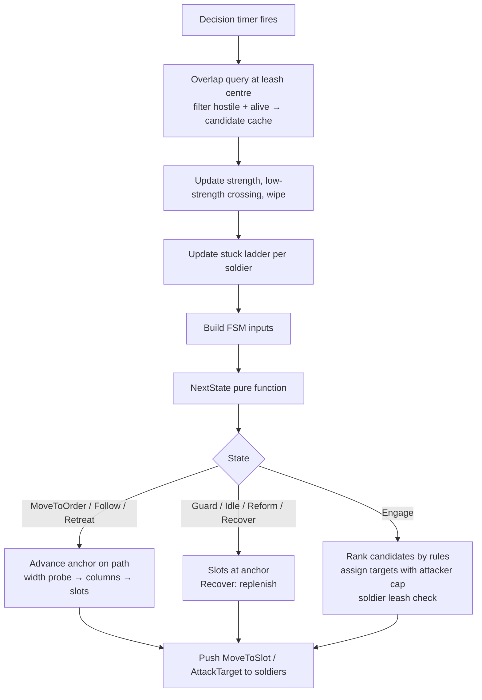
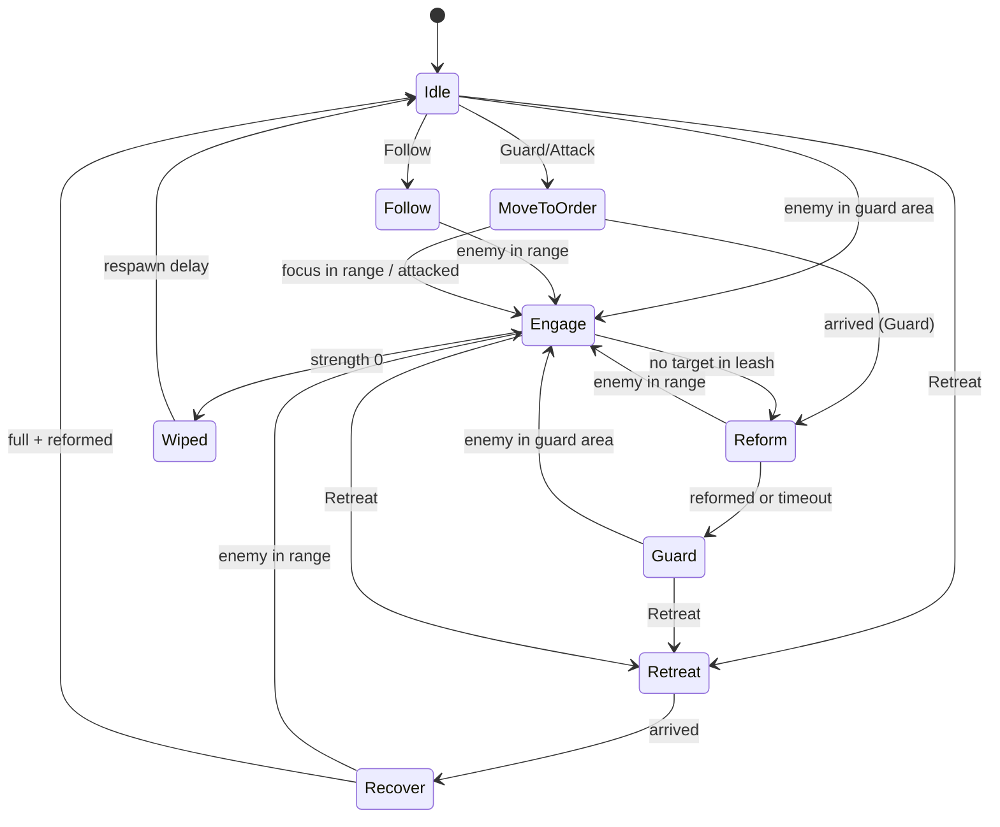

# Squad Command: Technical Plan

| | |
|---|---|
| Spec | [spec.md](spec.md) |
| Architecture baseline | [00-foundation/technical-plan.md](../00-foundation/technical-plan.md), master plan D-01..D-20 |
| Phases | P1 (core), P2 (Core retreat, structure rule, zone hook), VS (provisional) |

> Foundation and P0 exist. T-SQD-01's registry/definition/spawn source is being implemented; its editor content and verification remain pending. Later squad command/formation/combat classes and behavior below remain proposals until their owning tasks land.

## 1. Technical Overview

- A squad is an invisible **anchor actor** (`ASquad`) that owns the order, the FSM, the formation and all decisions. Soldiers (`ASoldierCharacter`) are thin bodies that move to a slot or attack a target when the squad tells them to.
- The squad runs **one decision tick on a timer** (default 0.2 s, game time). Each tick: gather hostile candidates once, update strength and stuck data, compute the next FSM state with a pure function, then push slot/target commands to soldiers.
- Only the anchor pathfinds the route (navmesh path). Soldiers move to nearby slot points with Detour crowd avoidance. In narrow spaces the formation drops columns and lays rows along the anchor's breadcrumb trail.
- The player side is `UCommandComponent` on `AHeroPlayerController`: squad registry (cap 3), current squad, Command Wheel state, context target resolution and order issue. It lives on the controller so it survives Hero death (R-SQD-10).
- Pure logic (formation slots, slot assignment, FSM transitions, target rules) lives in free functions over plain structs so Automation Specs can test it without a world (D-16).

## 2. Existing System Impact

| System | Impact |
|---|---|
| Combat contract (FND/CMB) | Soldiers use `UHealthComponent`, `UCombatStateComponent`, `FCombatHit` (source layer `Army`). Every soldier hit goes through `UCombatLibrary::DeliverHit`. Melee soldiers reuse the CMB hit-window notify state + `UMeleeTraceComponent` (`T-CMB-04`) |
| Input (FND) | Future wheel integration requests `PushMode(EPlayerMode::Wheel, Reason)` / `PopMode(Reason)`; controller ModeInput owns composed contexts, preserving movement/dodge where specified (D-19). T-SQD-01 adds only the controller-lifetime registry |
| Enemies (ENM) | Enemies already target soldiers in P1 (R-ENM-15, no SQD change). SQD reads archetype tag + HP from `AEnemyCharacter` |
| Synergy (SYN) | Target scorer = priority tier + numeric score; SYN adds state weights (Staggered / Armor Broken / Marked) to the score term (`T-SYN-05`) |
| UI/Feedback (UXF) | Fires `Feedback.Command.*` / `Feedback.Squad.*`; uses the world marker component; adds `WBP_CommandWheel` and a squad strip in `WBP_GameHUD` |
| Navigation | Uses the Recast navmesh; no strategic lane layer use in P1. P2: re-path on structure changes |
| Structures (DEF, P2) | Retreat to `ACoreStructure`; Infantry structure-defense rule |
| Zones (ZON, P2) | `FSquadOrder` carries a context actor + overrides; resolver has a documented insertion point |

## 3. Proposed Architecture

### 3.1 Runtime owner and lifetime

| Object | Owner | Created | Destroyed |
|---|---|---|---|
| `ASquad` | Level (placed) or cheat/run spawner | BeginPlay registers with the local player's `UCommandComponent` (refused if 3 are registered) | Level end; unregisters in EndPlay |
| `ASoldierCharacter` | Its `ASquad` (spawned with `SpawnActorDeferred`, squad + slot set before finish) | Squad BeginPlay, replenish, respawn | On death after a corpse delay; on squad destroy |
| `ASoldierAIController` | Auto-possess on spawn | With soldier | With soldier |
| `UCommandComponent` | `AHeroPlayerController` | Controller construction | Controller end (survives Hero death and Commander Spirit) |
| `FSquadOrder` | Value inside `ASquad` | On issue | Replaced by next order |

### 3.2 Main UE types

| Type | Kind | Folder | Responsibility |
|---|---|---|---|
| `USquadDefinition` | `UGameDefinition` (foundation §9), Primary Asset Type `SquadDefinition` | `Army/` | All squad tuning (spec §13 data model), incl. `BaseArmor` and an embedded `FCombatStateConfig` (MaxPoise, regen delay, regen rate, StaggerDuration; same struct as enemy definitions) used to init soldier `UHealthComponent` / `UCombatStateComponent`, and `TMap<FGameplayTag, float> StateScoreWeights` (filled by SYN). `IsDataValid` checks soldier class, count > 0, columns > 0, engage ≤ leash, at least one target rule |
| `ASquad` | `AActor` (root scene component, no mesh) | `Army/` | Anchor transform, order, FSM, formation, `TArray<FSoldierRuntime>`, candidate cache, strength, timers, delegates |
| `ASoldierCharacter` | `ACharacter` + `IGenericTeamAgentInterface` | `Army/` | Body; health/state components; `MoveToSlot(Location)`, `AttackTarget(Actor)`, `StopAttack()`, `HiddenTeleport(Location)`; attack execution (melee montage or projectile) |
| `ASoldierAIController` | `ADetourCrowdAIController` | `Army/` | Team id; crowd avoidance group setup; move requests |
| `ACombatProjectile` | `AActor` + `UProjectileMovementComponent` + sphere | `Combat/` | Arrow; `DeliverHit` on first hostile hit. Generic: DEF's `ATowerProjectile` (P2) can derive from it instead of duplicating flight/hit code |
| `UCommandComponent` | `UActorComponent` | `Player/` | Squad registry, current squad, wheel open/close, per-frame aim resolve while open (tick enabled only while open), issue order, delegates |
| `FSquadOrder` | `USTRUCT` | `Army/SquadTypes.h` | `CommandTag`, `Location`, `Facing`, `TWeakObjectPtr<AActor> TargetActor`, `TWeakObjectPtr<AActor> ContextActor` (zone, P2), `LeashRadiusOverride` (≤0 = none), `OrderId` |
| `FCommandTargetContext` | `USTRUCT` | `Player/CommandTypes.h` | Kind (`None, Ground, Enemy, Hero`; ZON adds `Zone`), hit location, target actor, context actor, suggested command, display text, `bValid` |
| `ESquadState` | `UENUM` | `Army/SquadTypes.h` | Idle, Follow, MoveToOrder, Guard, Engage, Reform, Retreat, Recover, Wiped |
| `FSquadTargetRule` | `USTRUCT` | `Army/SquadTypes.h` | `ESquadTargetRuleType` (`InGuardArea, FocusTarget, NearestWithTags, LowestHealthWithTags, NearestToGuardCenter, AttackingStructureNearGuard`), `FGameplayTagContainer Tags`, `float MaxRange`. Rule order = priority tier |
| Formation / FSM / targeting logic | Free functions | `Army/SquadFormation.*`, `Army/SquadStateMachine.*`, `Army/SquadTargeting.*` | Pure, Spec-tested |

Gameplay Tag leaves (added to the `T-FND-04` tag file): `Feedback.Command.Acknowledged`, `Feedback.Command.Invalid`, `Feedback.Squad.LowStrength`, `Feedback.Squad.Wiped`, `Feedback.Squad.Reinforced`. `Command.*` and `Unit.Squad.*` already exist.

`UGameTuningSettings` additions: `MaxActiveSquads` (3), `SquadDecisionInterval` (0.2 s), `MaxCommandDistance` (60 m), `AttackAimAssistRadius` (2.5 m), `FollowSuggestRadius` (3 m), `FollowOffsets[3]` (per registry index), stuck values (§6.4), `HiddenTeleportMaxDistance` (8 m). All placeholders.

### 3.3 Data ownership

| Data | Where | Mutable at runtime |
|---|---|---|
| Squad tuning | `DA_Squad_*` (`USquadDefinition`) | Never |
| Global command/stuck tuning | `UGameTuningSettings` | Never (config) |
| Order, FSM state, soldiers, strength | `ASquad` | Yes, only by `ASquad` |
| Soldier HP / combat states | Soldier components | Yes, by combat contract |
| Registry, current squad, wheel state | `UCommandComponent` | Yes |
| Presentation (montages, meshes, VFX, sounds) | BP children, `DT_Feedback` | — |

### 3.4 Communication flow

- Controller → squad: direct call `ASquad::IssueOrder(const FSquadOrder&) → bool` (owner knows the target, D-10).
- Squad → observers: dynamic multicast delegates `OnSquadStateChanged`, `OnOrderChanged`, `OnStrengthChanged`, `OnSquadWiped`, `OnSquadRespawned`. Markers, wheel, HUD strip, TFM, ZON bind to these.
- Squad → soldiers: direct calls. Soldier → squad: `OnDeath` / `OnDamaged` bound by the squad at spawn.
- Gameplay → presentation: `UFeedbackSubsystem::Play(Tag, Context)` only.
- Telemetry: `UCommandComponent` writes order events through the UXF playtest log (`T-UXF-08`).

```mermaid
sequenceDiagram
  participant P as Player input
  participant CC as UCommandComponent
  participant W as WBP_CommandWheel
  participant S as ASquad
  participant F as UFeedbackSubsystem
  P->>CC: IA_CommandWheel Started
  CC->>CC: controller PushMode(Wheel, reason); enable wheel-only tick
  CC-->>W: OnWheelOpened(view state)
  loop each frame while open
    CC->>CC: camera trace → ResolveContext(hit, current squad)
    CC-->>W: OnWheelContextChanged (only when changed)
  end
  P->>CC: IA_SquadSelect / IA_CommandCycle (optional)
  P->>CC: IA_CommandWheel Completed (or IA_CommandConfirm)
  CC->>S: IssueOrder(FSquadOrder)
  alt accepted
    S-->>CC: true
    CC->>F: Play(Feedback.Command.Acknowledged)
  else rejected
    S-->>CC: false
    CC->>F: Play(Feedback.Command.Invalid)
  end
  CC->>CC: log telemetry, remove IMC_CommandWheel, disable tick
  CC-->>W: OnWheelClosed
```

### 3.5 C++ / Blueprint split

| C++ | Blueprint |
|---|---|
| `ASquad` decisions, FSM, formation, targeting, leash, stuck, strength, wipe/respawn | `BP_Squad_Infantry/Archer` (definition ref only) |
| `ASoldierCharacter` attack timing, hit dispatch, teleport | `BP_Soldier_*` mesh, AnimBP, montages, team tint |
| `UCommandComponent` input handling, resolve, issue | `WBP_CommandWheel`, `WBP_SquadStrip` layout and animation |
| `ACombatProjectile` | `BP_Projectile_Arrow` mesh/trail |
| Debug draw, cheats | Feedback rows, sounds |

### 3.6 Asset references / loading

Hard references inside `USquadDefinition` (soldier class, icon, projectile class) are fine: few squads, all loaded with the map. Revisit at VS per foundation §9.

### 3.7 AI / navigation impact

- Anchor route: `UNavigationSystemV1::FindPathToLocationSynchronously` on order (≤3 squads, rare calls). Anchor advances along path points in the decision tick at squad speed × throttle (slows when soldiers lag; stuck soldiers ignored). Verify API names in UE docs.
- Width probe for stretch: two navmesh raycasts left/right of the anchor per decision tick while moving (`NavigationRaycast`, verify).
- Slot points projected with `ProjectPointToNavigation`; failure → nearest breadcrumb point.
- Soldiers: `ADetourCrowdAIController` + `MoveToLocation` to slot. Re-issue only when the slot moved more than an accept radius.
- Crowd groups: soldiers avoid soldiers and enemies; the Hero is not blocked by soldiers (soldier capsule overlaps the Hero's object channel, NEW-SQD-10). Verify `UCrowdFollowingComponent` avoidance group API in UE docs.
- Visual Logger category `LogSquad`: state changes, orders, target picks, stuck ladder steps, teleports.

### 3.8 UI impact

- `WBP_CommandWheel`: 4 command entries, squad entries 1–3 (icon, state, strength pips, greyed when wiped + timer), pre-selected command, context label (`DisplayText`, used by ZON for "Hold Bridge"). Binds to `UCommandComponent` delegates; no Tick polling (D-11).
- `WBP_SquadStrip` inside `WBP_GameHUD`: one compact icon per squad (order icon, strength). Same data, always visible.
- World markers above each squad via the UXF marker component (`T-UXF-04`), placed at the soldiers' centroid, not the anchor, to avoid jitter.

### 3.9 Save impact

None in prototype (A-11). Order and squad state use tags, locations and weak pointers; a future run save stores definition `FPrimaryAssetId`, order tag, location, strength (D-14).

### 3.10 Existing systems reused

Combat contract + `UCombatLibrary::DeliverHit`, team interface, `UFeedbackSubsystem`, world marker component, Enhanced Input contexts, `UGameTuningSettings`, `UGameCheatManager`, `game.debug.*` CVar pattern, Visual Logger, CMB hit window notify + `UMeleeTraceComponent`, `AHeroCharacter::GetLockOnTarget` / `OnHeroDeath`, UXF telemetry log.

### 3.11 New files proposed

```text
Source/<Game>/Army/   SquadTypes.h, SquadDefinition.h/.cpp, Squad.h/.cpp, SoldierCharacter.h/.cpp,
                      SoldierAIController.h/.cpp, SquadFormation.h/.cpp, SquadStateMachine.h/.cpp,
                      SquadTargeting.h/.cpp
Source/<Game>/Player/ CommandTypes.h, CommandComponent.h/.cpp
Source/<Game>/Combat/ CombatProjectile.h/.cpp
Source/<Game>/Tests/  SquadFormation.spec.cpp, SquadStateMachine.spec.cpp, SquadTargeting.spec.cpp
Content/<Game>/Army/  DA_Squad_Infantry, DA_Squad_Archer, BP_Squad_*, BP_Soldier_*, BP_Projectile_Arrow, AM_Soldier_*
Content/<Game>/Core/Input/  IA_CommandWheel, IA_SquadSelect1..3, IA_CommandCycle, IA_CommandConfirm, IA_CommandCancel, IMC_CommandWheel
Content/<Game>/UI/    WBP_CommandWheel, WBP_SquadStrip
Content/<Game>/Maps/  L_CombinedArms, Test/L_Test_Squad
```

### 3.12 Trade-offs

| Choice | Alternative | Why |
|---|---|---|
| Invisible anchor actor | Leader soldier | Leader death would break the squad; anchor keeps the squad whole (§13.3) |
| One central squad loop | Per-soldier brain | §31.2 group logic first; one candidate query per squad |
| Mouse wheel cycles commands, camera keeps aiming | Radial selection by mouse direction | Mouse direction would fight the aim; most orders use the pre-selected command. Measured in G1 (NEW-SQD-09) |
| Greedy slot assignment, O(n²) | Hungarian | n ≤ 12; greedy is enough. Upgrade only if crossings look bad |
| Breadcrumb column for chokes | Per-slot nav validation | One width probe per tick; rows follow a path the anchor already walked |
| Sync path query on order | Async | ≤3 squads, rare calls. Switch to async if Insights shows a hitch |

### 3.13 Verification

Automation Specs (formation, assignment, FSM, targeting), Functional Tests in `L_Test_Squad`, PIE checks in `L_CombinedArms`, PERF capture (`T-SQD-15`), G1 playtest (`T-SQD-16`).

## 4. Runtime Flow



## 5. State / Data



All states accept any new order (arrows omitted). The full transition table is spec §4.1; `NextState(State, Order, Inputs) → State` encodes it and is covered row by row by `SquadStateMachine.spec.cpp`.

Placeholder data defaults are listed in spec §12. Definition fields in spec §13.

## 6. Main Implementation Areas

### 6.1 Formation and stretch (pseudocode)

```text
freeWidth   = navRaycastLeft(anchor) + navRaycastRight(anchor)        // capped at full width
columns     = clamp(floor(freeWidth / spacing), def.MinColumns, def.Columns)
rows        = ceil(aliveCount / columns)
if columns == def.Columns: slots = grid behind anchor in anchor facing
else:                      slot(row, col) = breadcrumb[row * spacing] + lateral(col)   // column follows trail
slot = ProjectPointToNavigation(slot) or nearest breadcrumb
```

Breadcrumbs: anchor pushes its position every `spacing` metres travelled (ring buffer, ~rows+2 entries).

### 6.2 Slot assignment

Greedy: for slots front-to-back, pick the nearest unassigned, non-stuck soldier. Runs on formation change, soldier death, reform, stuck reassignment. `ponytail: greedy O(n²), Hungarian only if visible crossings in G1.`

### 6.3 Target selection

1. Candidates from the cache: location, archetype tag, HP ratio, combat state tags, `bIsFocus`, `bAttackingStructureNearGuard` (P2).
2. Rules in definition order; an Attack order moves `FocusTarget` to the front while the target is inside the Attack leash (R-SQD-16).
3. Each candidate gets a **tier** (first matching rule index) and a **score** = rule metric term (e.g. −distance, −HP ratio) + Σ `StateScoreWeights[tag]` for its active `State.Combat.*` tags (SYN fills the weights, `T-SYN-05`). Sort by tier, then score. The scorer returns both values so SYN and debug draw can read them.
4. Soldiers take the best candidate whose attacker count < `MaxAttackersPerTarget` (Infantry spreads, Archer focuses: large cap). Keep the current target unless a lower rule index appears (stickiness, avoids thrashing).
5. Soldier farther than leash from leash centre drops its target and returns to its slot.

### 6.4 Stuck ladder (values in `UGameTuningSettings`, placeholders)

| Step | Trigger (soldier has a move goal, not attacking, > 2× accept radius from goal) | Action |
|---|---|---|
| Detect | progress < 0.5 m over 1.5 s | mark stuck, exclude from reform completion and anchor throttle |
| 1 | stuck ≥ 1.5 s | re-issue move with goal re-projected |
| 2 | stuck ≥ 3 s | slot reassignment (give it the slot nearest to its position) |
| 3 | stuck ≥ 6 s **and** not rendered for ≥ 1 s **and** destination outside camera frustum | teleport ≤ `HiddenTeleportMaxDistance` to a projected point near its slot; log to Visual Logger + telemetry |

If step 3 conditions never hold, the soldier stays stuck and excluded; the squad keeps working.

### 6.5 Strength, wipe, recover

Strength = alive / definition count. Low strength crossing fires once and re-arms above the threshold. Recover refills one soldier per `ReplenishInterval` at the retreat point while no enemy is in engage range. Wipe: release order, state Wiped, start `WipeRespawnDelay` timer, respawn full squad at retreat point, state Idle.

## 7. Error and Edge-Case Handling

| Case | Handling |
|---|---|
| Register beyond cap | `RegisterSquad` returns false, `UE_LOG` error, squad stays inert |
| Invalid definition | `IsDataValid` fails in editor; at runtime squad logs error and does not spawn soldiers |
| No path | Try `ProjectPointToNavigation` within 3 m; else reject (Invalid) |
| Path invalid mid-move | Re-query once; on failure Guard at current position + Invalid |
| Target destroyed between ticks | Weak pointers; candidate cache rebuilt each tick |
| Hero null (dead/respawning) | Follow converts to Guard; context resolver uses the active view target |
| Soldier destroyed outside squad (cheat, kill volume) | `OnDestroyed` handler removes it like a death |
| Time dilation | All timers on world time (D-13) |

## 8. Testing Strategy

| Level | What | Where |
|---|---|---|
| Automation Spec | Slot grid, column reduction by width, breadcrumb placement, greedy assignment (no duplicates, all assigned), every FSM table row, each target rule type, tier-then-score ordering, state weight term, Attack focus promotion, stickiness | `Tests/Squad*.spec.cpp` |
| Functional Test | Guard + leash disengage, Follow leash, Attack target dies → Guard, Retreat → Recover → Idle, choke pass + width restore, caged soldier, hidden teleport never on screen, wipe → respawn, 4th squad refused | `Maps/Test/L_Test_Squad` (`T-SQD-14`) |
| PIE manual | Wheel feel, context pre-selection, readability | `L_CombinedArms` |
| PERF | 3 squads engaged, packaged Development, reference PC | `T-SQD-15` |
| Playtest | G1 checklist | `T-SQD-16` |

## 9. Performance Risks

| Risk | Mitigation |
|---|---|
| `CharacterMovement` + crowd for 36 soldiers | Measure in `T-SQD-15`; reduce soldier count in data before any code change |
| Re-issuing `MoveTo` every tick | Only when slot moved > accept radius |
| Target queries | One overlap per squad per tick, shared cache; no per-soldier scans |
| Wheel trace | Only while wheel open |
| Projectiles | Archer fire rate × count is low; no pooling until measured (D-15) |

## 10. Dependencies and Risks

| Item | Note |
|---|---|
| ENM targeting of soldiers in P1 | Covered by ENM R-ENM-15 / AC-ENM-11 (enemies fight soldiers they meet). SQD only needs soldiers to carry the ally team id |
| Crowd vs enemies | ENM starts with CharacterMovement RVO while soldiers use Detour crowd; mixed agents may not avoid each other (capsules still block). ENM `T-ENM-16` measures; SQD keeps capsule blocking so Infantry can hold a line |
| Formation at chokes | High risk (master plan risk register). Width probe + breadcrumb column + stuck ladder from day one; Visual Logger |
| Wheel input feel | Mouse-wheel cycling may be slow for Retreat; G1 measures; alternative bindings are data only |
| Lock-on interplay | Uses `AHeroCharacter::GetLockOnTarget` (`T-CMB-10`) |
| Zone hook | `FSquadOrder.ContextActor` + resolver insertion point are the only P1 cost for ZON |

No change requests to D-01..D-18.

## 11. Requirement Coverage

| Requirement | Technical area | Notes |
|---|---|---|
| R-SQD-01 | `UCommandComponent` registry + `MaxActiveSquads` | `T-SQD-01` |
| R-SQD-02 | `DA_Squad_Infantry/Archer` | `T-SQD-10` |
| R-SQD-03 | Orders only via `ASquad::IssueOrder` | No soldier API exposed to input |
| R-SQD-04 | `Command.*` tags, `FSquadOrder` | `T-SQD-04` |
| R-SQD-05 | `IMC_CommandWheel`, `WBP_CommandWheel` | `T-SQD-05` |
| R-SQD-06 | `ResolveContext` | `T-SQD-06` |
| R-SQD-07 | Context priority; no time dilation; movement in `IMC_Combat` | `T-SQD-05` |
| R-SQD-08 | Telemetry wheel duration | `T-SQD-05`, `T-SQD-16` |
| R-SQD-09 | Enhanced Input actions | `T-SQD-05` |
| R-SQD-10 | Component on controller | `T-SQD-01` |
| R-SQD-11 | `NextState` + `ESquadState` | `T-SQD-03` |
| R-SQD-12 | Anchor path + crowd slots | `T-SQD-01/02` |
| R-SQD-13 | Width probe + breadcrumb column | `T-SQD-02` |
| R-SQD-14 | Reform state | `T-SQD-08` |
| R-SQD-15 | Combined behavior | `T-SQD-14`, `T-SQD-16` |
| R-SQD-16, R-SQD-17 | Target rules data + `SquadTargeting` | `T-SQD-07`, `T-SQD-10` |
| R-SQD-18 | Leash centres per order | `T-SQD-08` |
| R-SQD-19 | Stuck ladder | `T-SQD-09` |
| R-SQD-20 | Tier + score, `StateScoreWeights` | `T-SQD-07` (scorer), `T-SYN-05` (weights) |
| R-SQD-21 | No Marked application in Attack | `T-SQD-04` |
| R-SQD-22 | Markers + squad strip | `T-SQD-13` |
| R-SQD-23 | Feedback tags | `T-SQD-13`, `T-UXF-06` |
| R-SQD-24 | Wiped state + respawn | `T-SQD-12` |
| R-SQD-25 | Recover + home point | `T-SQD-12` |
| R-SQD-26 | `USquadDefinition`, settings | `T-SQD-01` |
| R-SQD-27 | Decision timer | `T-SQD-03` |
| R-SQD-28 | Squad delegates reused by TFM | `T-SQD-13`, `T-TFM-03` |
| R-SQD-29, R-SQD-30 | Core lookup, structure rule | `T-SQD-17` |
| R-SQD-31 | `ContextActor`, overrides, resolver insertion point | `T-SQD-06`; behavior `T-ZON-02/03` |
| R-SQD-32 | Ability slot | `T-SQD-19..21` |
| R-SQD-33, R-SQD-34 | Spearman data | `T-SQD-18` |
