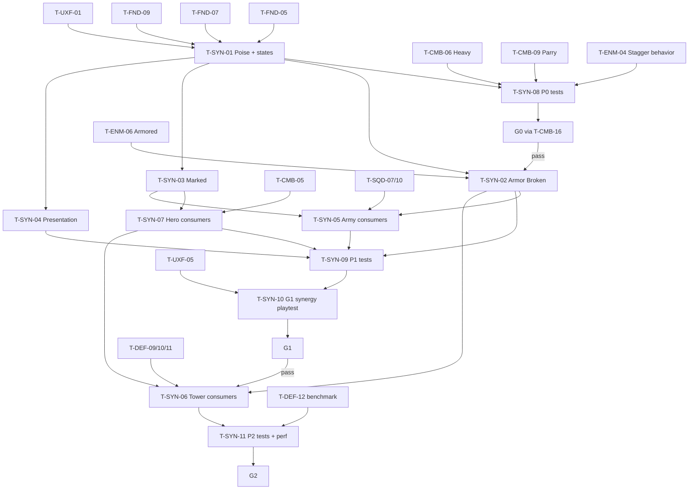

# Battlefield Synergy (Shared Combat States): Tasks

| | |
|---|---|
| Feature | SYN (`04-battlefield-synergy`) |
| Spec / plan | [spec.md](spec.md), [technical-plan.md](technical-plan.md) |
| Phases | P0 (T-SYN-01, 08) · P1 (T-SYN-02, 03, 04, 05, 07, 09, 10) · P2 (T-SYN-06, 11) |
| Gates | Contributes to G0 (poise → Staggered), G1 (Hero → Army synergy), G2 (Hero → Tower synergy); evidence for G3 "one meaningful synergy" ([master plan §3](../main_implement_plan.md#gate-checklists)) |

## 1. Summary

P0 fills `UCombatStateComponent` with poise and timed states so Heavy and Parry can stagger the P0 enemy. P1 adds Armor Broken, Marked, the presentation contract and the Hero and Army consumers, then checks the synergy at G1. P2 adds the Tower consumers and the G2 regression. Elemental/status states are [DEFERRED] and have no task.

Recommended order: T-SYN-01 → T-SYN-08 (P0) · T-SYN-02 → 03 → 04 → 07 → 05 → 09 → 10 (P1) · T-SYN-06 → 11 (P2).

All paths are proposals (no UE project exists yet). Every task also follows the master plan Definition of Done (§8).

## 2. Task Overview

| ID | Task | Type | Phase | Priority | Dependencies | Status |
|---|---|---|---|---|---|---|
| T-SYN-01 | `UCombatStateComponent` logic: timed states + poise damage/regen + poise break → Staggered | GAMEPLAY | P0 | Must | T-FND-05, T-FND-07, T-FND-09, T-FND-10, T-UXF-01 | Done |
| T-SYN-02 | Armor Broken from Warlord Heavy + armor reduction | GAMEPLAY | P1 | Must | T-SYN-01, T-CMB-06, T-ENM-01 | Todo |
| T-SYN-03 | Marked state infrastructure (debug/perk source only, A-06) | GAMEPLAY | P1 | Must | T-SYN-01, T-FND-09 | Todo |
| T-SYN-04 | State presentation contract via UXF | UI | P1 | Must | T-SYN-01, T-UXF-01 | Todo |
| T-SYN-05 | Army consumers of states (Infantry/Archer target preference) | AI | P1 | Must | T-SQD-07, T-SQD-10, T-SYN-02, T-SYN-03 | Todo |
| T-SYN-06 | Tower consumers (Ballista vs Armor Broken/Marked, heavy tower impact poise) | GAMEPLAY | P2 | Must | T-DEF-09, T-DEF-10, T-DEF-11, T-SYN-02, T-SYN-07 | Todo |
| T-SYN-07 | Hero consumers (follow-up on Staggered, Marked bonus) | GAMEPLAY | P1 | Must | T-SYN-01, T-SYN-03, T-CMB-05, T-CMB-06 | Todo |
| T-SYN-08 | P0 Functional Tests: poise → Staggered on the P0 enemy | QA | P0 | Must | T-SYN-01, T-CMB-06, T-CMB-09, T-ENM-04 | Todo |
| T-SYN-09 | P1 synergy Functional Tests (`L_Test_SynergyArmy`) | QA | P1 | Must | T-SYN-02, T-SYN-03, T-SYN-04, T-SYN-05, T-SYN-07 | Todo |
| T-SYN-10 | G1 synergy playtest + synergy matrix review | QA | P1 | Must | T-SYN-09, T-UXF-05 | Todo |
| T-SYN-11 | P2 tower synergy Functional Tests + G2 regression + burst perf check | QA | P2 | Must | T-SYN-06, T-DEF-12 | Todo |

## 3. Detailed Tasks

## P0

### T-SYN-01 — `UCombatStateComponent` logic: timed states + poise damage/regen + poise break → Staggered

**Type** GAMEPLAY · **Phase** P0

**Objective** Every combat unit tracks poise and timed states; poise break applies Staggered; states expire, refresh and clear correctly with no Tick.

**Related Requirements** R-SYN-01…R-SYN-10; AC-SYN-01…AC-SYN-05

**Dependencies** T-FND-05, T-FND-07, T-FND-09, T-FND-10, T-UXF-01

**Implementation Notes**
- [x] `CombatStateTypes.h`: `FCombatStateConfig` (MaxPoise, PoiseRegenDelay, PoiseRegenRate, StaggerDuration), `FActiveCombatState` (tag, expiry, weak instigator), `FCombatStatePresentationRow` with P0 columns only (StateTag, AppliedFeedback, RemovedFeedback).
- [x] `FCombatStateModel` (plain struct, explicit `Now`): `GetPoise`, `ApplyPoiseDamage`, `ApplyState` (refresh to longer, no stacking), `RemoveState`, `RemoveExpired`, `ClearAll`, `NextExpiry` (technical-plan §4.3).
- [x] Fill the FND component: `Init(const FCombatStateConfig&)` called by the owner at BeginPlay; `ApplyPoiseDamage`, `ApplyState`, `RemoveState`, `ClearAllStates`, `HasState`, `GetStateRemaining`, `GetCurrentPoise`, `GetStateInstigator`; delegates `OnStateAdded(Tag, Instigator)` (new states only) and `OnStateRemoved(Tag)`.
- [x] One `FTimerHandle` set to the earliest expiry; on fire remove every expired state and reschedule. Game time via `GetWorld()->GetTimeSeconds()`.
- [x] Bind sibling `UHealthComponent::OnDeath` → `ClearAllStates`; clear the timer in `EndPlay`.
- [x] Duration resolution: hit duration > 0, else unit `StaggerDuration` for poise breaks, else `UGameTuningSettings.StateDefaultDurations[Tag]` (add the field, Staggered fallback 1.5 s); 0 → do not apply, warn.
- [x] `UGameTuningSettings.CombatStatePresentationTable` (soft ref); create `DT_CombatStatePresentation` with the Staggered row; on add/remove call `UFeedbackSubsystem::Play` with the row's tag (missing row → one warning, state still works).
- [x] `game.debug.CombatStates 1`: poise `cur/max` and active states with remaining seconds above each unit; Visual Logger entry on add/remove with instigator.
- [x] Cheats: `SetPoise <Value>`, `ApplyState <TagLeaf> [Duration]`, `ClearStates` on the crosshair (or lock-on) target.
- [x] Header comment: ENM/SQD/BOS definitions embed `FCombatStateConfig`; hero uses MaxPoise 0.

**Expected Files / Assets** `Source/<Game>/Combat/CombatStateComponent.h/.cpp`, `CombatStateModel.h/.cpp`, `CombatStateTypes.h`; `Source/<Game>/Tests/CombatState.spec.cpp`; `Content/<Game>/Feedback/DT_CombatStatePresentation`

**Test Case** Spec, Max 50 / delay 2 / rate 25 / stagger 1.5: 40 poise damage at t=0 → poise 10; t=1 → 10; t=2.4 → 20; 20 damage at t=2.4 → 0 → Staggered until 3.9; 30 damage at t=3.0 → ignored; t=3.9 → Staggered removed, poise 50. Refresh: Marked 8 s at t=0, then 3 s at t=1 → expiry 8; then 10 s at t=1 → expiry 11; `OnStateAdded` fired once. Clear with two states → `OnStateRemoved` twice. MaxPoise 0: poise damage never staggers, direct `ApplyState(Staggered)` works.

**Acceptance Criteria**
- [x] AC-SYN-01…AC-SYN-05 pass.
- [x] Component has Tick disabled; no timer active when no state is active.
- [x] Feedback for Staggered plays once per new Staggered.

**Verification** Automation Spec `<Game>.Combat.States`; PIE with `game.debug.CombatStates 1` and the cheats on an FND test dummy.

**Progress (2026-10-05, Claude Code, `feat/04-battlefield-synergy`)** Done (user checked the `game.debug.CombatStates` overlay and cheats in rendered PIE, 2026-10-05). Built as listed: `CombatStateTypes.h`, `CombatStateModel.h/.cpp`, component logic, `StateDefaultDurations` (Staggered 1.5 s) and `CombatStatePresentationTable` in Game Tuning, `DT_CombatStatePresentation` (Staggered row, made by `Tools/create_feedback_assets.bat`), `game.debug.CombatStates` (canvas draw via `UDebugDrawService`, no Tick), Visual Logger add/remove, cheats `SetPoise` / `ApplyState` / `ClearStates` on the crosshair target. `ATestDummy` now has a `UCombatStateComponent` (MaxPoise 50, other values default 2 / 25 / 1.5). Existing API kept for CMB: `ApplyPoiseDamage`, `ApplyState`, `HasState`, `GetActiveStates` (now by value). Verified: editor and game builds; `Tools/run_tests.bat` 40/40 (`Combat.States` 11: the spec timeline, refresh, late timer, MaxPoise 0, Tick off and timer only while active, timer expiry over real frames, poise break on the dummy with one Staggered feedback, death clear, duration fallback, authored row and default); standalone `-game` on `L_Boot` with the cheats on a spawned dummy: `SetPoise 10` gives 10 / 50, `ApplyState Staggered` plays `Feedback.State.Staggered.Applied`, an unknown leaf warns, `ApplyState Marked` is refused (no default until T-SYN-03). Not seen yet: the `game.debug.CombatStates` overlay in rendered PIE.

---

### T-SYN-08 — P0 Functional Tests: poise → Staggered on the P0 enemy

**Type** QA · **Phase** P0

**Objective** Prove in a real map that Heavy and Parry stagger the P0 melee enemy and that the enemy stops acting while Staggered (G0 evidence).

**Related Requirements** R-SYN-03, R-SYN-05, R-SYN-06; AC-SYN-06

**Dependencies** T-SYN-01, T-CMB-06, T-CMB-09, T-ENM-04

**Status** Done

**Implementation Notes**
- [x] `L_Test_CombatStates` with the hero, one ENM P0 melee enemy (MaxPoise 50) and functional tests.
- [x] `FT_PoiseBreakStagger`: hero `RequestAction` Heavy + Light + Light on the enemy → `HasState(Staggered)`; enemy attack montage interrupted; no enemy hit lands on the hero for `StaggerDuration`; one `Feedback.State.Staggered.Applied` in the log.
- [x] `FT_ParryStagger`: wait for the enemy's hit window begin event, hero `RequestAction(Parry)` → enemy poise −60 → Staggered.
- [x] `FT_PoiseRegen`: 40 poise damage, wait `PoiseRegenDelay` + 1 s → poise 35 (±1).
- [x] Tests wait on events (state added, window begin), not fixed delays.
- [x] Group under `<Game>.Combat.States`; add to the CMB pre-merge run (T-CMB-15 checklist).

**Expected Files / Assets** `Content/<Game>/Maps/Test/L_Test_CombatStates`; functional test actors; `Source/<Game>/Tests/PoiseStagger.spec.cpp`

**Test Case** Command-line `Automation RunTests <Game>.Combat.States` → tests pass.

**Acceptance Criteria**
- [x] AC-SYN-06 passes.
- [x] Setting the enemy MaxPoise to 0 makes `FT_PoiseBreakStagger` fail (test catches regressions).

**Verification**
- Focused run `Tools/run_tests.bat -Filter "CastleDefender.Combat.States"`: 15/15 passed, 0 failed, 0 warnings, editor exit code 0.
- Full suite `Tools/run_tests.bat`: 198/198 passed, 0 failed, 0 warnings, editor exit code 0 (including `L_Test_CombatStates.FT_PoiseBreakStagger`).
- Negative test verified: runtime `MaxPoise 0` fails to stagger from poise damage (regression guard).

## P1

### T-SYN-02 — Armor Broken from Warlord Heavy + armor reduction

**Type** GAMEPLAY · **Phase** P1

**Objective** Warlord Heavy breaks armor on armored targets, and every layer's damage benefits while Armor Broken is active.

**Related Requirements** R-SYN-11, R-SYN-12, R-SYN-13, R-SYN-14; AC-SYN-07, AC-SYN-08

**Dependencies** T-SYN-01, T-CMB-06, T-ENM-01 (armored test enemy via `BaseArmor`)

**Consumers (not dependencies)** T-ENM-06 Armored archetype builds on this task

**Implementation Notes**
- [ ] `UHealthComponent`: `BaseArmor` (clamped 0–0.9) set by the owner from its definition; in `ApplyHit` damage × (1 − effective armor), effective = `BaseArmor × (HasState(ArmorBroken) ? ArmorBrokenArmorMultiplier : 1)`.
- [ ] `UGameTuningSettings`: `ArmorBrokenArmorMultiplier` (0.25), `StateDefaultDurations[ArmorBroken]` (6 s).
- [ ] `UCombatStateComponent` eligibility: `State.Combat.ArmorBroken` only when the sibling `UHealthComponent::GetBaseArmor() > 0`.
- [ ] `DA_HeroClass_Warlord` Heavy: `AppliedStates = {State.Combat.ArmorBroken}`, `StateDuration 0` (default).
- [ ] `DT_CombatStatePresentation` Armor Broken row (feedback tags; icon in T-SYN-04).
- [ ] `ArmorMath` Automation Spec on a pure helper `ComputeDamageAfterArmor(Damage, BaseArmor, bArmorBroken, Multiplier)`.
- [ ] Cheat `DebugHitTarget <Damage> <Poise>` delivers a hit from a simulated Army source to the crosshair target through `DeliverHit`.
- [ ] Note NEW-SYN-02 in the DA field tooltip: if Armor Broken becomes perk-granted, move this entry into a PRK effect.

**Expected Files / Assets** `Source/<Game>/Combat/HealthComponent.cpp`, `CombatStateComponent.cpp`; `Source/<Game>/Tests/ArmorMath.spec.cpp`; `DA_HeroClass_Warlord`; `DT_CombatStatePresentation`

**Test Case** Armored test enemy (`DA_Enemy_Test` with `BaseArmor 0.5`): `DebugHitTarget 20 0` → 10 damage. Warlord Heavy → Armor Broken added. `DebugHitTarget 20 0` → 17.5. After 6 s → 10 again. Heavy on a `BaseArmor 0` unit → no state, no feedback.

**Acceptance Criteria**
- [ ] AC-SYN-07 and AC-SYN-08 pass.
- [ ] `ArmorMath` Spec passes (0, 0.5, 0.9 armor; with and without Armor Broken).
- [ ] The Heavy hit that applies Armor Broken is itself reduced by full armor (state affects later hits only).

**Verification** Automation Spec `<Game>.Combat.Armor`; PIE with `game.debug.CombatStates 1`.

---

### T-SYN-03 — Marked state infrastructure (debug/perk source only, A-06)

**Type** GAMEPLAY · **Phase** P1

**Objective** Marked exists as a working timed state that consumers can use, applied only by a cheat now and by perks in P3.

**Related Requirements** R-SYN-15; AC-SYN-09

**Dependencies** T-SYN-01, T-FND-09

**Implementation Notes**
- [ ] `StateDefaultDurations[Marked]` = 8 s.
- [ ] Cheat `MarkTarget [Duration]`: lock-on target if any, else camera line trace target; calls `ApplyState(State.Combat.Marked, …)` with the hero as instigator.
- [ ] Document `UCombatStateComponent::ApplyState` as the PRK entry point (header comment + spec link). No extra helper.
- [ ] `DT_CombatStatePresentation` Marked row (feedback tags).
- [ ] Review step: search SQD command code for `Marked`; Attack/Focus Target must not apply it (A-06, Q-14). Record the result in the task.

**Expected Files / Assets** `CombatStateComponent.h` (doc comment), cheat in `UGameCheatManager`; `DT_CombatStatePresentation`

**Test Case** Aim at an enemy, `MarkTarget` → `HasState(Marked)` true for 8 s, then false; Focus Target command on another enemy → no Marked.

**Acceptance Criteria**
- [ ] AC-SYN-09 passes.
- [ ] Review note confirms no gameplay code path other than the cheat applies Marked.

**Verification** PIE with `game.debug.CombatStates 1`; code search result recorded.

---

### T-SYN-04 — State presentation contract via UXF

**Type** UI · **Phase** P1

**Objective** One data table defines how each state looks and sounds everywhere; the component emits applied/removed feedback and exposes sorted active states for UXF widgets.

**Related Requirements** R-SYN-20, R-SYN-21, R-SYN-22; AC-SYN-13 (event part; visual part with T-UXF-05)

**Dependencies** T-SYN-01, T-UXF-01

**Implementation Notes**
- [ ] Extend `FCombatStatePresentationRow`: `Icon` (soft texture), `Colour`, `DisplayPriority`, `LoopVFX` (soft Niagara).
- [ ] Rows for Staggered (priority 0), Armor Broken (1), Marked (2) with the fixed state colours from [production-plan.md](../production-plan.md) (never reused elsewhere).
- [ ] `UCombatLibrary::GetStatePresentation(Tag, OutRow)` (`BlueprintPure`, cached tag → row map).
- [ ] `UCombatStateComponent::GetActiveStatesSorted()` (`BlueprintPure`) ordered by `DisplayPriority`.
- [ ] With UXF: `DT_Feedback` rows for `Feedback.State.<State>.Applied` (and `.Removed` where a sound is needed); Armor Broken gets a dedicated armor-break sound (§28.3, coordinate with T-UXF-06).
- [ ] Hand-off note to T-UXF-05: widgets bind `OnStateAdded/Removed`, read rows, attach `LoopVFX` to the owner, show max 3 icons in order.
- [ ] Add the three states to the UXF feedback contract audit list (T-UXF-09).

**Expected Files / Assets** `CombatStateTypes.h`, `CombatLibrary.cpp`, `CombatStateComponent.cpp`; `DT_CombatStatePresentation`; rows in `DT_Feedback`

**Test Case** `ApplyState` each state on one dummy → log shows exactly one applied feedback per state with the right tag; `GetActiveStatesSorted` returns Staggered, Armor Broken, Marked; remove one → one removed feedback.

**Acceptance Criteria**
- [ ] Every state has a complete row (`IsDataValid`-style check on the table rows: icon, colour, applied feedback set).
- [ ] Event part of AC-SYN-13 passes; visual part checked after T-UXF-05 in T-SYN-09.

**Verification** PIE + log; table validation; integration check listed in §5.

---

### T-SYN-07 — Hero consumers (follow-up on Staggered, Marked bonus)

**Type** GAMEPLAY · **Phase** P1

**Objective** Hero hits deal data-driven bonus damage to Staggered (follow-up) and Marked targets, through one helper every attacker can reuse.

**Related Requirements** R-SYN-18 (helper), R-SYN-19; AC-SYN-12

**Dependencies** T-SYN-01, T-SYN-03, T-CMB-05, T-CMB-06

**Implementation Notes**
- [ ] `FStateDamageMultipliers` (`TMap<FGameplayTag, float>`) in `CombatStateTypes.h`.
- [ ] `UCombatLibrary::GetStateDamageMultiplier(Target, Multipliers)`: product over the target's active states found in the map; 1.0 when none. Automation Spec.
- [ ] Extend `UCombatLibrary::DeliverHit(Target, Hit, const FStateDamageMultipliers& Multipliers = {})`: multiply `Hit.Damage` first, before interceptors and before the hit's own states (technical-plan §3.13).
- [ ] `FHeroAttackData.StateDamageMultipliers`; `UMeleeTraceComponent::SetPendingAttack` stores it and passes it to `DeliverHit`.
- [ ] DA values: Light {Staggered 1.25}; Heavy {Staggered 1.5, Marked 1.2}.
- [ ] `game.debug.Combat` log shows the multiplier used per hit.
- [ ] Re-run `<Game>.Combat` (T-CMB-15) to confirm no regression.

**Expected Files / Assets** `Source/<Game>/Combat/CombatLibrary.h/.cpp`, `MeleeTraceComponent.cpp`, `CombatStateTypes.h`; `Source/<Game>/Hero/HeroCombatTypes.h`; `Source/<Game>/Tests/StateDamageMultiplier.spec.cpp`; `DA_HeroClass_Warlord`

**Test Case** Dummy (armor 0): `ApplyState Staggered 5` → Light 10 → 12.5; Heavy 30 → 45. `ClearStates`, `MarkTarget` → Heavy 36, Light 10. Staggered + Marked → Heavy 54.

**Acceptance Criteria**
- [ ] AC-SYN-12 passes.
- [ ] Spec covers 0, 1 and 2 matching states and a state not in the map.
- [ ] `<Game>.Combat` suite still passes.

**Verification** Automation Spec `<Game>.Combat.StateMultiplier`; PIE log.

---

### T-SYN-05 — Army consumers of states (Infantry/Archer target preference)

**Type** AI · **Phase** P1

**Objective** Squads use openings: Archers put Marked targets in their top tier; Infantry and Archers prefer Staggered and Armor Broken enemies inside their current tier and leash.

**Related Requirements** R-SYN-16, R-SYN-17; AC-SYN-10, AC-SYN-11

**Dependencies** T-SQD-07, T-SQD-10, T-SYN-02, T-SYN-03

**Implementation Notes**
- [ ] `USquadDefinition` target rules: `StatePreferenceWeights` (`TMap<FGameplayTag, float>`); allow state tags in tier lists. `DA_Squad_Archer`: tier 0 = Focus Target + `State.Combat.Marked`. Both squads: Staggered 1.0, Armor Broken 1.0.
- [ ] In the SQD target scorer (T-SQD-07): compare candidates by (tier, state score = Σ weights of active states, SQD base score). Weight 0 disables a state.
- [ ] Candidates come from SQD's existing range/leash-filtered set; no new queries.
- [ ] State changes are picked up at the next SQD decision tick; SQD's existing retarget hysteresis applies (no forced retarget on state add).
- [ ] Visual Logger: chosen target with reason (`tier`, `state:<Tag>`).
- [ ] Coordinate with the SQD owner: the edit lives in SQD's scorer file, the rule in this task.

**Expected Files / Assets** SQD target scorer source (from T-SQD-07); `Source/<Game>/Army/SquadDefinition.h`; `DA_Squad_Infantry`, `DA_Squad_Archer`

**Test Case** Archer squad, two Swarm at equal range, `MarkTarget` on the left one → squad shoots left. Infantry on Guard, two enemies at equal distance, `ApplyState ArmorBroken` on one → Infantry engages it; move that enemy outside leash → Infantry ignores it; an enemy touching the Guard Zone beats a Staggered enemy elsewhere.

**Acceptance Criteria**
- [ ] AC-SYN-10 and AC-SYN-11 pass.
- [ ] Setting all weights to 0 restores pure SQD behavior (no state influence).

**Verification** PIE in `L_CombinedArms` with Visual Logger; functional tests in T-SYN-09.

---

### T-SYN-09 — P1 synergy Functional Tests (`L_Test_SynergyArmy`)

**Type** QA · **Phase** P1

**Objective** Automated regression for every P1 state rule and consumer.

**Related Requirements** AC-SYN-04, AC-SYN-07…AC-SYN-13

**Dependencies** T-SYN-02, T-SYN-03, T-SYN-04, T-SYN-05, T-SYN-07

**Implementation Notes**
- [ ] `L_Test_SynergyArmy` with hero, one Infantry squad, one Archer squad, Armored and Swarm enemies (ENM P1).
- [ ] `FT_ArmorBrokenWindow` (AC-SYN-07/08), `FT_ArcherMarkedPriority` (AC-SYN-10), `FT_InfantryStatePreference` (AC-SYN-11), `FT_HeroFollowUp` (AC-SYN-12), `FT_StateClearOnDeath` (AC-SYN-04 in world), `FT_PresentationEvents` (AC-SYN-13 event part).
- [ ] After T-UXF-05: manual check that icons/VFX are identical for hero-applied and cheat-applied states (AC-SYN-13 visual part); screenshot attached.
- [ ] Group under `<Game>.Synergy`; add to the pre-merge run for SYN, SQD, ENM and CMB changes.

**Expected Files / Assets** `Content/<Game>/Maps/Test/L_Test_SynergyArmy`; functional test actors

**Test Case** `Automation RunTests <Game>.Synergy` → all pass.

**Acceptance Criteria**
- [ ] All listed tests pass from the command line.
- [ ] Visual AC-SYN-13 check recorded.

**Verification** Command-line output attached; screenshot.

---

### T-SYN-10 — G1 synergy playtest + synergy matrix review

**Type** QA · **Phase** P1

**Objective** Show at G1 that Hero-created openings are seen and used by squads, and that every P1 unit answers the §10.3 questions.

**Related Requirements** R-SYN-23, R-SYN-24; AC-SYN-14; master plan §3 G1 ("Hero + squads plays better than Hero alone", "player understands what each squad is doing")

**Dependencies** T-SYN-09, T-UXF-05 (runs inside the G1 gate session held by SQD)

**Implementation Notes**
- [ ] Scenario "Armored push" in `L_CombinedArms`: 2 Armored + Swarm on one lane; Infantry on Guard, Archer behind; tester told only the controls.
- [ ] Observe and ask: which enemy had armor broken, who broke it, who used it (AC-SYN-14); can the tester read the three states at gameplay distance in 1–2 s (§28.1–28.2); any stunlock loop (NEW-SYN-06); does the Infantry/Archer preference look smart or erratic (NEW-SYN-07).
- [ ] Decide NEW-SYN-01, -02, -06, -07, -08 and record the decisions in the spec.
- [ ] Synergy matrix review (§10.3, §19.5): Warlord, Infantry, Archer, Swarm, Armored each answer create / use / support; update spec §4.6.
- [ ] Record per `game-development-workflow` playtesting format; KEEP / CHANGE / DELETE per hypothesis; tune one value at a time.
- [ ] Save in the G1 record `ai/game/playtests/G1_<YYYY-MM-DD>.md` (SYN section).

**Expected Files / Assets** `ai/game/playtests/G1_<YYYY-MM-DD>.md` (SYN section); spec §4.5, §4.6, §12 updates

**Test Case** Gate review: AC-SYN-14 answered with tester quotes or observations.

**Acceptance Criteria**
- [ ] AC-SYN-14 passes or the record states the failure and the next iteration.
- [ ] Matrix updated; open questions above have decisions or explicit defaults.

**Verification** Lead review together with the G1 checklist.

## P2

### T-SYN-06 — Tower consumers (Ballista vs Armor Broken/Marked, heavy tower impact poise)

**Type** GAMEPLAY · **Phase** P2

**Objective** Towers join the synergy loop: Ballista exploits Armor Broken and Marked; Bombard impacts deal poise damage; tower data can apply states.

**Related Requirements** R-SYN-25, R-SYN-26, R-SYN-27; AC-SYN-15, AC-SYN-16, AC-SYN-17

**Dependencies** T-DEF-09, T-DEF-10, T-DEF-11, T-SYN-02, T-SYN-07

**Implementation Notes**
- [ ] Tower weapon data in `UStructureDefinition` (from T-DEF-09): add `PreferredStates` (ordered), `PoiseDamage`, `AppliedStates`, `FStateDamageMultipliers` if DEF did not.
- [ ] `UTowerWeaponComponent` target choice: first by index of the first matching `PreferredStates` entry (no match = last), then DEF's default rule. Candidates from DEF's existing in-range set.
- [ ] Impact builds `FCombatHit` (SourceLayer Tower, `PoiseDamage`, `AppliedStates`) and calls `DeliverHit` with the weapon multipliers; multipliers use target states at impact time.
- [ ] `DA_Structure_Ballista`: `PreferredStates [ArmorBroken, Marked]`, multipliers {ArmorBroken 1.5}. `DA_Structure_Bombard`: `PoiseDamage 30` per unit in splash. `AppliedStates` empty on both (NEW-SYN-05).
- [ ] No accuracy change for Marked (NEW-SYN-04) unless DEF adds shot spread.
- [ ] Visual Logger: tower target reason (`state:<Tag>`).
- [ ] Update spec §4.6 synergy matrix with Ballista, Bombard, Barricade (Barricade creates/uses no state; supports Hero/Army by delaying).

**Expected Files / Assets** DEF tower weapon source (from T-DEF-09); `DA_Structure_Ballista`, `DA_Structure_Bombard`

**Test Case** Ballista, two Armored in range, `ApplyState ArmorBroken` on the farther one → Ballista shoots it first; damage shows ×1.5 on top of armor reduction. Bombard shell into 5 Swarm-like units with MaxPoise 20 → all 5 Staggered. Add `State.Combat.ArmorBroken` to Ballista `AppliedStates` → its hits apply Armor Broken (remove after the test).

**Acceptance Criteria**
- [ ] AC-SYN-15, AC-SYN-16, AC-SYN-17 pass.
- [ ] With all tower state fields empty, tower behavior equals DEF's baseline.

**Verification** PIE in `L_SiegeSite_Proto` with Visual Logger; functional tests in T-SYN-11.

---

### T-SYN-11 — P2 tower synergy Functional Tests + G2 regression + burst perf check

**Type** QA · **Phase** P2

**Objective** Automated checks for tower consumers, a regression run of all state suites before G2, and a measured cost for mass stagger.

**Related Requirements** AC-SYN-15…AC-SYN-17; R-SYN-28; GDD §31.2; master plan §3 G2

**Dependencies** T-SYN-06, T-DEF-12

**Implementation Notes**
- [ ] `L_Test_SynergyTower`: `FT_BallistaArmorBrokenPriority`, `FT_BombardStagger`, `FT_TowerAppliedStatesHook`; group `<Game>.Synergy`.
- [ ] Regression: run `<Game>.Combat`, `<Game>.Combat.States`, `<Game>.Synergy` on the G2 build.
- [ ] Perf: on the T-DEF-12 benchmark map, 40 enemies, Bombard AoE staggering ≥ 15 at once; capture Unreal Insights on the reference PC packaged build; record frame time of the burst frame with and without state VFX. Over budget → open a UXF throttle task (do not optimize inside SYN without the measurement).
- [ ] Review R-SYN-28: confirm no elemental/status tags, rows or code exist.
- [ ] Prepare the G3 synergy evidence scenario (Hero Heavy → Armor Broken → Ballista focus, §33 06:00) and note it in the G2 record for the G3 review.

**Expected Files / Assets** `Content/<Game>/Maps/Test/L_Test_SynergyTower`; Insights trace + notes in `ai/game/playtests/G2_<YYYY-MM-DD>.md` (SYN section)

**Test Case** Command-line run of the three suites → all pass; perf note lists burst frame time vs baseline.

**Acceptance Criteria**
- [ ] All tower synergy tests and regression suites pass.
- [ ] Perf result recorded with a keep / throttle decision.
- [ ] No deferred elemental content present.

**Verification** Command-line output and Insights trace attached to the G2 record.

## 4. Dependency Graph

## 5. Integration / Regression Checklist

| Area | Expected | When |
|---|---|---|
| `<Game>.Combat.States` Spec + Functional Tests | All pass | Every SYN, CMB, ENM merge |
| `<Game>.Synergy` Functional Tests | All pass | Every SYN, SQD, DEF, ENM merge (from P1) |
| New attacker (enemy, soldier, tower, boss) | Delivers hits through `DeliverHit`; poise/states/armor apply | Each new attacker |
| New unit definition | Embeds `FCombatStateConfig` and `BaseArmor`; validates | Each new definition |
| Presentation | Each state identical across sources; icons ordered; colours unique | After T-UXF-05, every gate |
| Death / reset | No icon or VFX left after death, squad wipe, boss reset | P1, P3 (BOS) |
| Time dilation | States and poise regen slow with Tactical Focus | P3 (TFM) |
| Perks | `OnStateAdded` with instigator available to PRK; Marked via `ApplyState` | P3 (PRK) |
| Deferred | No elemental/status content | Every gate |
| Performance | No Tick on `UCombatStateComponent`; burst cost measured | G2 |

## 6. Final Definition of Done

- [ ] P0: poise → Staggered works on the P0 enemy and is part of the G0 evidence.
- [ ] P1: Armor Broken, Marked, presentation contract, Hero and Army consumers done; `<Game>.Synergy` passes; G1 synergy section recorded with KEEP / CHANGE / DELETE.
- [ ] P2: Ballista and Bombard consumers done; G2 regression and perf note recorded.
- [ ] Every [TUNABLE] value lives in a definition, `UGameTuningSettings` or a data table; no hard-coded state numbers.
- [ ] Synergy matrix in spec §4.6 is current for every unit, squad and tower in scope.
- [ ] NEW-SYN-01…08 decided or carried forward with a default in the spec.
- [ ] No elemental/status states exist ([DEFERRED]).
