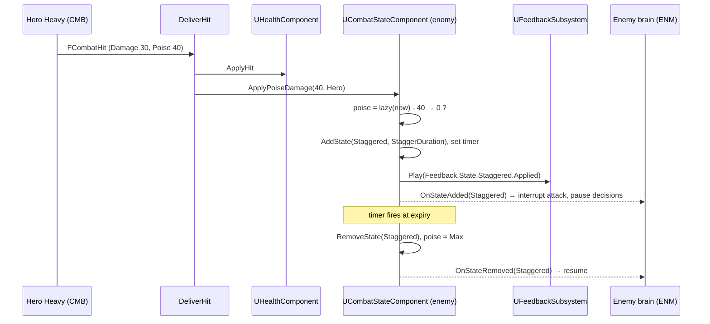
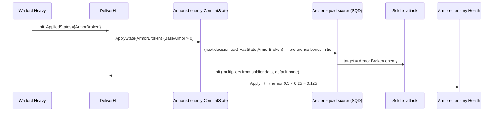
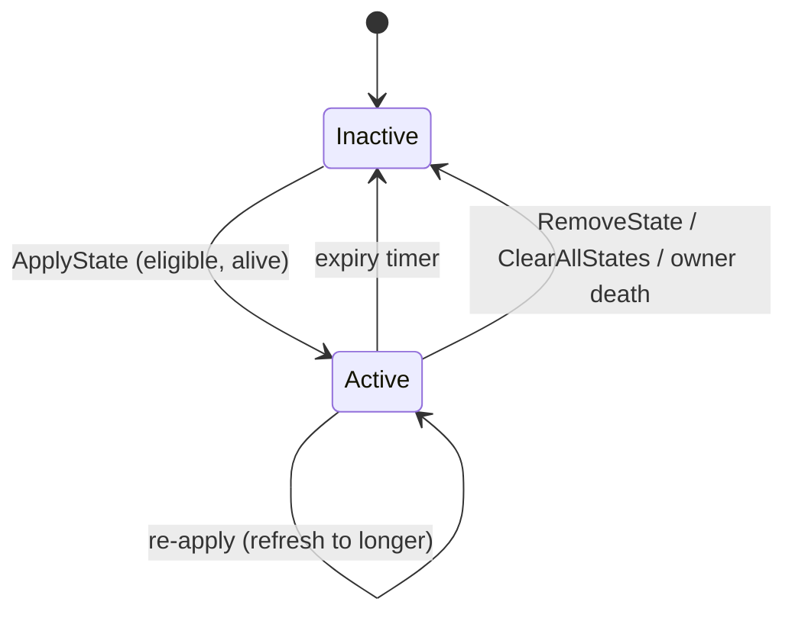

# Battlefield Synergy (Shared Combat States): Technical Plan

| | |
|---|---|
| Feature | SYN (`04-battlefield-synergy`) |
| Spec | [spec.md](spec.md) (R-SYN-01…28, AC-SYN-01…17) |
| Architecture baseline | [00-foundation/technical-plan.md §7](../00-foundation/technical-plan.md#7-shared-combat-contract-d-05) (D-05), decisions D-01…D-18 in [main_implement_plan.md §7](../main_implement_plan.md#7-architecture-baseline) |
| Hit pipeline | `UCombatLibrary::DeliverHit` from [01-hero-combat/technical-plan.md §4.2](../01-hero-combat/technical-plan.md#42-hit-resolution-deliverhit) |
| Phases | P0 (T-SYN-01, T-SYN-08), P1 (T-SYN-02…05, 07, 09, 10), P2 (T-SYN-06, 11) |
| Status | Draft v1. No UE project exists yet: every path, class and asset name is a **proposal** |

## 1. Technical Overview

All state logic lives in the FND skeleton `UCombatStateComponent`, one per unit (hero, soldier, enemy, boss). It stores poise lazily (computed on read, no Tick) and up to three active states as tag + expiry + weak instigator, with one timer set to the earliest expiry. The math sits in a plain struct `FCombatStateModel` so an Automation Spec can test it without a world.

States arrive two ways: inside an `FCombatHit` through `DeliverHit` (poise damage, `AppliedStates`), or through a direct `ApplyState` call (hero block break, cheats, perk API). Consumers never copy state: they call `HasState`.

Consumers are small data-driven terms added to existing systems:
- `UHealthComponent::ApplyHit` reduces armor while Armor Broken is active.
- `DeliverHit` gets an optional `FStateDamageMultipliers` argument; attackers (hero attacks, tower weapons, later Spearman) pass their per-state multipliers.
- SQD and DEF target scoring add a state preference term from their definition data.

Presentation goes through `UFeedbackSubsystem` (one-shots) plus a `DT_CombatStatePresentation` table that UXF widgets read for icon, colour, priority and looping VFX (D-10, D-11).

No GAS (D-04). No new module or plugin (D-01).

## 2. Existing System Impact

| System | Impact |
|---|---|
| FND `UCombatStateComponent` (T-FND-05) | Logic filled by T-SYN-01 (poise, states, timer, events, clear) |
| FND `UHealthComponent` (T-FND-05) | Armor field `BaseArmor` + Armor Broken reduction in `ApplyHit` (T-SYN-02) |
| FND `UGameTuningSettings` (T-FND-07) | New fields: `StateDefaultDurations`, `ArmorBrokenArmorMultiplier`, `CombatStatePresentationTable` |
| FND tags (T-FND-04) | Uses `State.Combat.Staggered | ArmorBroken | Marked`; adds `Feedback.State.<State>.Applied/Removed` leaves |
| FND cheats/CVars (T-FND-09) | Adds `game.debug.CombatStates`, cheats `ApplyState`, `ClearStates`, `MarkTarget`, `SetPoise` |
| CMB `DeliverHit` (T-CMB-04) | Already applies poise and `AppliedStates`; T-SYN-07 adds the optional multipliers argument |
| CMB hero data (T-CMB-05/06) | `FHeroAttackData.StateDamageMultipliers`; Heavy `AppliedStates = {ArmorBroken}` in `DA_HeroClass_Warlord` |
| ENM definitions (T-ENM-01, -06) | Embed `FCombatStateConfig` and `BaseArmor`; T-ENM-04 reacts to `OnStateAdded(Staggered)` |
| SQD target selection (T-SQD-07) | State preference term + Marked in Archer top tier (T-SYN-05) |
| DEF tower weapon (T-DEF-09…11) | Preferred states, impact poise, applied states, multipliers in weapon data (T-SYN-06) |
| UXF (T-UXF-01, -05, -06) | Feedback rows; state icon/VFX widgets read `DT_CombatStatePresentation` and bind component delegates |
| PRK (P3) | Binds `OnStateAdded`; perk API calls `ApplyState` (Marked) |
| BOS (P3) | Calls `ClearAllStates` on boss reset |

## 3. Proposed Architecture

### 3.1 Runtime owner and lifetime
- `UCombatStateComponent` on each combat unit; lifetime = owning actor. Cleared on death (`UHealthComponent::OnDeath`) and on `EndPlay` (timer cleared).
- Global defaults in `UGameTuningSettings` (config lifetime). Per-unit config copied from the unit's definition at BeginPlay.
- No subsystem, no manager: states are per unit, consumers query the target they already hold.

### 3.2 Main UE types

| Type | Kind | Responsibility | Phase |
|---|---|---|---|
| `UCombatStateComponent` | `UActorComponent` (FND skeleton) | Poise, timed states, timer, events, presentation calls | P0 |
| `FCombatStateModel` | plain C++ struct | Pure poise/state math with explicit `Now` | P0 |
| `FCombatStateConfig` | `USTRUCT` | MaxPoise, PoiseRegenDelay, PoiseRegenRate, StaggerDuration (embedded in unit definitions) | P0 |
| `FActiveCombatState` | `USTRUCT` | Tag, ExpiryTime, `TWeakObjectPtr<AActor>` Instigator | P0 |
| `FCombatStatePresentationRow` | `FTableRowBase` | StateTag, AppliedFeedback, RemovedFeedback (P0); Icon, Colour, DisplayPriority, LoopVFX (P1) | P0/P1 |
| `UHealthComponent` armor | FND component | `BaseArmor`, effective armor under Armor Broken | P1 |
| `FStateDamageMultipliers` | `USTRUCT` wrapping `TMap<FGameplayTag, float>` | Attacker-side bonus per target state | P1 |
| `UCombatLibrary::GetStateDamageMultiplier` | static function | Product of multipliers for the target's active states | P1 |

### 3.3 Data ownership

| Data | Owner | Mutated at runtime? |
|---|---|---|
| Poise config per unit | `FCombatStateConfig` inside `UEnemyArchetypeDefinition`, `USquadDefinition`, `UBossDefinition`, `UHeroClassDefinition` | Never |
| `BaseArmor` per unit | Same definitions | Never |
| Default durations, Armor Broken multiplier | `UGameTuningSettings` | Never |
| Presentation per state | `DT_CombatStatePresentation` | Never |
| Current poise, active states | `UCombatStateComponent` | Yes, transient |
| Attacker multipliers / preferred states | Hero attack data, squad target rules, tower weapon data | Never |

State duration resolution: `Hit.StateDuration > 0` → that; else for Staggered from poise break → unit `StaggerDuration`; else `StateDefaultDurations[Tag]`.

### 3.4 Communication flow
- Producers → `DeliverHit` (or direct `ApplyState`) → target `UCombatStateComponent` (direct call).
- `UCombatStateComponent` → `OnStateAdded` / `OnStateRemoved` dynamic multicast delegates → ENM brain (stagger behavior), UXF widgets (icons/VFX), PRK (P3 perks), CMB hero (own Staggered).
- `UCombatStateComponent` → `UFeedbackSubsystem::Play(row.AppliedFeedback / RemovedFeedback, context)` for one-shots.
- Consumers → `HasState(Tag)` on targets they already reference (squad candidates, tower candidates, hit target).
- No global event bus (D-10).

### 3.5 C++ / Blueprint split

| C++ | Blueprint / data |
|---|---|
| Poise math, state storage, timer, events, eligibility, armor math, multiplier helper, state terms in SQD/DEF scorers | `DT_CombatStatePresentation` rows, feedback rows, state VFX/icons (UXF), tuning values in definitions and settings |

Blueprint API: `HasState`, `GetStateRemaining`, `GetCurrentPoise` are `BlueprintPure`; `ApplyState`, `RemoveState`, `ClearAllStates` are `BlueprintCallable` (perk/cheat entry points); delegates `BlueprintAssignable`.

### 3.6 Asset references / loading
- `UGameTuningSettings.CombatStatePresentationTable` is a soft reference loaded once on first use and cached as a tag → row map.
- Icons and Niagara systems in rows are soft references; UXF loads them (small, always used; sync load is fine in prototype).

### 3.7 AI / navigation impact
- No navigation impact.
- ENM brain pauses decisions while Staggered (T-ENM-04). SQD and DEF scorers read states on cached candidate sets only.

### 3.8 UI impact
- UXF T-UXF-05 builds the state icon row in the world marker and attaches looping VFX, driven by delegates + presentation rows. SYN supplies the data and events, not widgets.
- Debug view `game.debug.CombatStates` (poise and remaining state time per unit) is developer-only.

### 3.9 Save impact
None. States and poise are transient and are not part of run-state structs (D-14). If mid-run save arrives later, states are dropped on load (acceptable: seconds-long effects).

### 3.10 Performance risks
See §9.

### 3.11 Existing systems reused
FND combat contract, tags, tuning settings, cheats, CVars, test harness; CMB `DeliverHit` and `UMeleeTraceComponent`; UXF feedback subsystem and world markers; SQD target scorer; DEF tower weapon; PRK stat modifiers are **not** used (states are not stat modifiers).

### 3.12 New types / files proposed

```text
Source/<Game>/Combat/   CombatStateComponent.h/.cpp (fill FND skeleton), CombatStateModel.h/.cpp,
                        CombatStateTypes.h (FCombatStateConfig, FActiveCombatState, FCombatStatePresentationRow,
                        FStateDamageMultipliers), HealthComponent.cpp (armor), CombatLibrary.cpp (multiplier helper)
Source/<Game>/Tests/    CombatState.spec.cpp, ArmorMath.spec.cpp, StateDamageMultiplier.spec.cpp
Content/<Game>/Feedback/ DT_CombatStatePresentation; rows in DT_Feedback (with UXF)
Content/<Game>/Maps/Test/ L_Test_CombatStates (P0), L_Test_SynergyArmy (P1), L_Test_SynergyTower (P2)
```

### 3.13 Trade-offs

| Choice | Alternative | Why this one |
|---|---|---|
| Lazy poise (computed on read) | Tick or regen timer per unit | Zero per-frame cost for hundreds of units; exact at read time |
| One timer per unit to the earliest expiry | Timer per state | Fewer handles; at most 3 states |
| Tags + expiry in a small array | GAS GameplayEffects | D-04; three states, no stacking, no attributes |
| Armor reduction inside `UHealthComponent` | Each attacker computes armor | Every layer benefits automatically (R-SYN-13) and nobody forgets it |
| Attacker multipliers passed into `DeliverHit` | Multipliers stored in `FCombatHit` | Keeps the FND hit struct unchanged; one place reads target states |
| States evaluated before the hit's own states apply | Apply states first | A hit's own Armor Broken / Staggered only affects later hits; prevents "self-bonus" double-dipping and keeps order simple |
| Armor Broken eligibility check by `BaseArmor > 0` | Per-unit immunity list | One rule, matches readability goal; immunity list added only if BOS needs it |
| Presentation table separate from `DT_Feedback` | Put icon/colour columns in `DT_Feedback` | `DT_Feedback` stays one-shot events (D-10); state rows need persistent display data |

### 3.14 Verification
Automation Specs for the model, armor math and multiplier helper; Functional Tests per phase; G1 synergy playtest; G2 regression and perf check. Details in §8.

## 4. Runtime Flow

### 4.1 P0: poise break → Staggered



### 4.2 P1: Armor Broken opening used by the Army



### 4.3 Poise model (pseudocode)

```text
GetPoise(now):
  if Max <= 0: return 0
  if Has(Staggered): return 0
  regen = max(0, now - LastPoiseDamageTime - RegenDelay) * RegenRate
  return min(Max, StoredPoise + regen)

ApplyPoiseDamage(amount, instigator, now):
  if Max <= 0 or amount <= 0 or Has(Staggered): return
  StoredPoise = max(0, GetPoise(now) - amount); LastPoiseDamageTime = now
  if StoredPoise == 0: ApplyState(Staggered, StaggerDuration, instigator)

OnRemoved(Staggered): StoredPoise = Max; LastPoiseDamageTime = -inf

ApplyState(tag, duration, instigator, now):
  if owner dead or !CanReceive(tag): return          // ArmorBroken needs BaseArmor > 0
  if active(tag): expiry = max(expiry, now + duration); instigator = new; return   // no OnStateAdded
  add {tag, now + duration, instigator}; reschedule timer; OnStateAdded; Play(row.AppliedFeedback)
```

### 4.4 State lifecycle



## 5. State / Data

| Struct / asset | Fields |
|---|---|
| `FCombatStateConfig` | `MaxPoise` (0 = no poise), `PoiseRegenDelay`, `PoiseRegenRate`, `StaggerDuration` |
| `FActiveCombatState` | `StateTag`, `ExpiryTime` (game seconds), `Instigator` (weak) |
| `UCombatStateComponent` runtime | `StoredPoise`, `LastPoiseDamageTime`, `TArray<FActiveCombatState>` (≤3), `FTimerHandle` |
| `UHealthComponent` | `BaseArmor` (0–0.9) set from the owner definition |
| `UGameTuningSettings` | `TMap<FGameplayTag, float> StateDefaultDurations` (ArmorBroken 6, Marked 8, Staggered 1.5 fallback), `ArmorBrokenArmorMultiplier` 0.25, `TSoftObjectPtr<UDataTable> CombatStatePresentationTable` |
| `FCombatStatePresentationRow` | `StateTag`, `AppliedFeedback`, `RemovedFeedback`, `Icon`, `Colour`, `DisplayPriority`, `LoopVFX` |
| `FStateDamageMultipliers` | `TMap<FGameplayTag, float>`; product over the target's active states |
| SQD target rules (in `USquadDefinition`) | `TMap<FGameplayTag, float> StatePreferenceWeights`; tier lists may contain state tags (Archer tier 0: Focus Target + `State.Combat.Marked`) |
| DEF tower weapon data (in `UStructureDefinition`) | `TArray<FGameplayTag> PreferredStates` (ordered), `PoiseDamage`, `AppliedStates`, `FStateDamageMultipliers` |

Time base: `UWorld::GetTimeSeconds()` (game time). Timers via `FTimerManager`, so global time dilation (TFM, D-13) slows states with the world; confirm in UE docs that world timers follow global time dilation for the pinned version.

## 6. Main Implementation Areas

| Area | Tasks |
|---|---|
| Poise + timed states + Staggered, debug, Spec | T-SYN-01 |
| Armor Broken source, eligibility, armor math | T-SYN-02 |
| Marked state, cheat, perk-facing API | T-SYN-03 |
| Presentation contract (table, feedback, priority) | T-SYN-04 |
| Army consumers (SQD scorer terms) | T-SYN-05 |
| Hero consumers (`DeliverHit` multipliers, hero data) | T-SYN-07 |
| Tower consumers (Ballista, Bombard, tower data hook) | T-SYN-06 |
| QA: P0 functional, P1 functional, G1 synergy playtest, P2 functional + G2 regression | T-SYN-08, T-SYN-09, T-SYN-10, T-SYN-11 |

## 7. Error and Edge-Case Handling

| Case | Handling |
|---|---|
| Owner dead when a state arrives | `ApplyState` returns without effect |
| Owner destroyed with active states | `EndPlay` clears the timer; no delegate calls after destruction |
| Instigator destroyed | Weak pointer reads null; consumers must null-check |
| Missing presentation row | State works; feedback call skipped; one warning per tag (`LogCombatStates`) |
| Missing `FCombatStateConfig` on a definition | Defaults (MaxPoise 0) → no poise; `IsDataValid` on ENM/SQD definitions warns when `MaxPoise < 0` or `StaggerDuration <= 0` with `MaxPoise > 0` |
| Duration 0 resolved | Falls back to `StateDefaultDurations`; if still 0, state is not applied and logs a warning |
| Timer fires late (hitch) | Removes every state with expiry ≤ now, not just the first |
| Hit stop via `CustomTimeDilation` on one actor | World timers ignore actor dilation; states keep running for the few frames of hit stop (accepted) |
| Many units staggered in one frame (Bombard AoE) | Each plays its feedback; UXF budget/throttle handles bursts (risk) |
| Boss reset | BOS calls `ClearAllStates`; poise reset to max |

## 8. Testing Strategy

| Layer | What | Where |
|---|---|---|
| Automation Spec | `FCombatStateModel`: lazy poise, regen delay, break → Staggered, ignore while Staggered, refill, refresh, expiry order, clear | `Tests/CombatState.spec.cpp` (T-SYN-01) |
| Automation Spec | Armor math with/without Armor Broken; eligibility at `BaseArmor 0` | `Tests/ArmorMath.spec.cpp` (T-SYN-02) |
| Automation Spec | Multiplier product for 0/1/2 active states | `Tests/StateDamageMultiplier.spec.cpp` (T-SYN-07) |
| Functional Test | P0: Heavy + Lights stagger the ENM enemy, enemy passive for the duration | `L_Test_CombatStates` (T-SYN-08) |
| Functional Test | P1: Armor Broken damage window; Archer picks Marked; Infantry tie-break; hero follow-up multiplier | `L_Test_SynergyArmy` (T-SYN-09) |
| Functional Test | P2: Ballista priority + bonus; Bombard poise stagger; tower data hook | `L_Test_SynergyTower` (T-SYN-11) |
| Playtest | G1 synergy scenario; synergy matrix review | T-SYN-10 |
| Perf | 40 units with states + Bombard AoE stagger burst on the P2 benchmark map | T-SYN-11 with T-DEF-12 |
| Debug | `game.debug.CombatStates 1`: poise `cur/max` and state tags with remaining seconds above each unit; Visual Logger entry on add/remove with instigator | all tasks |

## 9. Performance Risks

| Risk | Mitigation |
|---|---|
| Component on every unit (enemy cap from P2 benchmark, Q-04) | No Tick; lazy poise; timer only while a state is active |
| `HasState` in target scoring loops | ≤3-element array scan; scorers run on cached candidate sets at decision-tick rate (SQD/DEF), never all-to-all |
| Feedback/VFX bursts from AoE stagger | UXF throttles one-shots; looping VFX use UXF LOD/culling; measured in T-SYN-11 |
| Presentation table lookup | Cached tag → row map built once |
| Debug draw cost | Only while `game.debug.CombatStates` is on |

## 10. Dependencies and Risks

| Item | Note |
|---|---|
| ENM must embed `FCombatStateConfig` and `BaseArmor` in `UEnemyArchetypeDefinition` (T-ENM-01) | P0 test target needs poise; flagged to ENM |
| All attackers must use `DeliverHit` (CMB T-CMB-04) | Otherwise poise/states/armor are skipped for that layer |
| SQD scorer must expose tiers + a score term (T-SQD-07) | T-SYN-05 edits it; coordinate with SQD owner |
| DEF weapon data must carry poise/states/multipliers and a preferred-states tier (T-DEF-09) | T-SYN-06 fills them; coordinate with DEF owner |
| UXF throttling for bursts | Needed by P2 (Bombard); flagged to UXF |
| NEW-SYN-02 (Armor Broken baseline vs perk) | If the answer is "perk", T-SYN-02 moves the Heavy `AppliedStates` into a PRK effect; no SYN code change |
| Stunlock (NEW-SYN-06) | Watch at G0/G1: Heavy + parry loops on a single enemy |
| Synergy invisible to players | Main identity risk (master plan §13); G1/G3 checks via T-SYN-10 and the G3 review |

No change requests to D-01…D-18.

## 11. Requirement Coverage

| Requirement | Technical area | Notes |
|---|---|---|
| R-SYN-01, -02, -03, -04, -05 | `FCombatStateModel` poise, `FCombatStateConfig` | T-SYN-01 |
| R-SYN-06 | `OnStateAdded/Removed(Staggered)` consumed by ENM/CMB | T-SYN-01, T-ENM-04, T-CMB-08 |
| R-SYN-07 | `ApplyPoiseDamage` + direct `ApplyState` | T-SYN-01 |
| R-SYN-08, -09, -10 | State storage, refresh, clear, single pipeline via `DeliverHit` | T-SYN-01, T-CMB-04 |
| R-SYN-11 | Heavy `AppliedStates` in `DA_HeroClass_Warlord` | T-SYN-02, T-CMB-06 |
| R-SYN-12, -13, -14 | Eligibility check; `UHealthComponent` armor math; settings | T-SYN-02 |
| R-SYN-15 | Marked defaults, cheat, `ApplyState` API for PRK | T-SYN-03 |
| R-SYN-16, -17 | SQD scorer state terms, Archer tier data | T-SYN-05 |
| R-SYN-18 | `FStateDamageMultipliers` on Spearman data at VS | Helper from T-SYN-07 |
| R-SYN-19 | `DeliverHit` multipliers + hero attack data | T-SYN-07 |
| R-SYN-20, -21, -22 | `DT_CombatStatePresentation`, feedback rows; UXF widgets | T-SYN-04, T-UXF-05, T-UXF-06 |
| R-SYN-23, -24 | Synergy matrix review | T-SYN-10 (and class intake later) |
| R-SYN-25 | Tower weapon preferred states + multipliers | T-SYN-06 |
| R-SYN-26 | Bombard weapon `PoiseDamage` | T-SYN-06 |
| R-SYN-27 | Tower weapon `AppliedStates` (default empty) | T-SYN-06 |
| R-SYN-28 | No elemental tags/data/code; new state = tag + row + consumer data | Review in T-SYN-10, T-SYN-11 |
