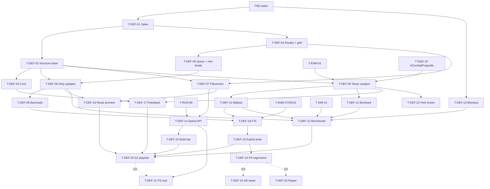

# Structures & Pathing (DEF): Tasks

| | |
|---|---|
| Spec | [spec.md](spec.md) |
| Technical plan | [technical-plan.md](technical-plan.md) |
| Phases | P2 (main; `T-DEF-01` may run right after FND), P3, VS (provisional) |
| Gate | G2 (master plan Section 3), checked in `T-DEF-20` |

## 1. Summary

Run the lane-navigation spike first. If it passes, build structures, the lane layer (grid → query/min-break → dirty updates), placement, then the three prototype structures and towers. Map blockout runs in parallel from day one. Close P2 with Functional Tests, exploit tests, the benchmark that sets the enemy cap, and the G2 gate playtest. P3 adds cost through the run resource, Defense perk hooks and a full-run regression. VS tasks are provisional.

## 2. Task Overview

| ID | Task | Type | Phase | Priority | Dependencies | Status |
|---|---|---|---|---|---|---|
| T-DEF-01 | SPIKE: lane layer + navmesh dynamic modifiers + break-cost search (throwaway, KEEP/CHANGE/DELETE) | AI | P2 (early) | High | T-FND-01, T-FND-03, T-FND-09 | Todo |
| T-DEF-13 | `L_SiegeSite_Proto` blockout: 2 lanes, Core, build zones | DESIGN | P2 | High | T-FND-01 | Todo |
| T-DEF-02 | `AStructureBase` + `UStructureDefinition` + footprint + health + nav modifier | GAMEPLAY | P2 | High | T-DEF-01, T-FND-04, T-FND-05, T-FND-07 | Todo |
| T-DEF-03 | `ACoreStructure` | GAMEPLAY | P2 | High | T-DEF-02 | Todo |
| T-DEF-04 | `ALaneRoute` authoring + `ULaneNavigationSubsystem` corridor grid | AI | P2 | High | T-DEF-01, T-FND-04, T-FND-09 | Todo |
| T-DEF-05 | Route query + blocking detection + minimum-break search | AI | P2 | High | T-DEF-04 | Todo |
| T-DEF-06 | Dirty-region updates + route invalidation events on build/destroy | AI | P2 | High | T-DEF-05, T-DEF-02 | Todo |
| T-DEF-07 | Build zones + soft-grid placement + preview + validation | GAMEPLAY | P2 | High | T-DEF-02, T-DEF-04, T-FND-06, T-CMB-12 | Todo |
| T-DEF-08 | Barricade | GAMEPLAY | P2 | High | T-DEF-06 | Todo |
| T-DEF-09 | `UTowerWeaponComponent` targeting + projectiles | GAMEPLAY | P2 | High | T-DEF-02, T-CMB-04, T-SQD-10, T-ENM-01 | Todo |
| T-DEF-10 | Ballista | GAMEPLAY | P2 | High | T-DEF-09, T-ENM-06 | Todo |
| T-DEF-11 | Bombard | GAMEPLAY | P2 | High | T-DEF-09, T-ENM-05 | Todo |
| T-DEF-14 | Placement ↔ RUN spend API + site structure cap | GAMEPLAY | P2 | High | T-DEF-07, T-RUN-09 | Todo |
| T-DEF-15 | Build bar UI | UI | P2 | Medium | T-DEF-14, T-UXF-02 | Todo |
| T-DEF-16 | Placement route evaluation, route preview, "blocks lane" indicator | GAMEPLAY | P2 | High | T-DEF-06, T-DEF-07 | Todo |
| T-DEF-17 | Structure, tower and Core feedback events + `DT_Feedback` rows | GAMEPLAY | P2 | Medium | T-DEF-03, T-DEF-09, T-UXF-01, T-UXF-04 | Todo |
| T-DEF-18 | Functional Tests: stop-and-attack, resume, series, Core, Structure Collapse | QA | P2 | High | T-DEF-08, T-DEF-10, T-ENM-07, T-ENM-09, T-ENM-10, T-FND-10 | Todo |
| T-DEF-19 | Exploit tests: seal, partial block, gap, maze, build on enemies | QA | P2 | High | T-DEF-18, T-DEF-07 | Todo |
| T-DEF-12 | PERF benchmark → first concurrent enemy cap (Q-04) | PERF | P2 | High | T-DEF-06, T-DEF-10, T-DEF-11, T-DEF-13, T-ENM-09, T-ENM-10, T-SQD-10, T-DIR-01, T-FND-08 | Todo |
| T-DEF-20 | G2 gate playtest (Defense & Pathing) | QA | P2 | High | T-DEF-12, T-DEF-15, T-DEF-16, T-DEF-17, T-DEF-19, T-SYN-06, T-ZON-04, T-ZON-07, T-DIR-10, T-RUN-08, T-UXF-07, T-UXF-08, T-UXF-09, T-DIR-09, T-DIR-11, T-ENM-15, T-ENM-16, T-ENM-17, T-RUN-02, T-RUN-10, T-RUN-11, T-SQD-17, T-SYN-11, T-UXF-15, T-UXF-16, T-UXF-17, T-UXF-18 | Todo |
| T-DEF-21 | P3 build cost data + run resource mode check | GAMEPLAY | P3 | Medium | T-DEF-14, T-RUN-04 | Todo |
| T-DEF-22 | Tower hooks for Defense perks (stat query + shot event) | GAMEPLAY | P3 | Medium | T-DEF-09, T-PRK-01, T-PRK-02 | Todo |
| T-DEF-23 | P3 regression: pathing under full run + benchmark re-check | QA | P3 | High | T-DEF-19, T-DEF-12, T-DIR-12, T-BOS-02 | Todo |
| T-DEF-24 | 4th tower slot (provisional) | DESIGN | VS | Low | T-RUN-18 (G3 passed), T-DEF-09 | Todo |
| T-DEF-25 | Structure repair (provisional) | GAMEPLAY | VS | Low | T-DEF-02, T-CMB-12, T-RUN-04 | Todo |

## 3. Detailed Tasks

## P2

### T-DEF-01 — SPIKE: lane layer + navmesh dynamic modifiers + break-cost search
**Type** AI · **Phase** P2 (run right after FND as a side spike if possible)

**Objective** Answer, cheaply and before any production DEF code, whether D-09 (Recast "Dynamic Modifiers Only" + corridor grid with break-cost fields) gives correct, fast, stuck-free blocking behavior.

**Related Requirements** R-DEF-05, R-DEF-07, R-DEF-08, R-DEF-10, R-DEF-11; AC-DEF-03..07, AC-DEF-15

**Dependencies** T-FND-01, T-FND-03, T-FND-09

**Hypothesis** If enemies follow waypoints from a per-route reverse-Dijkstra field over a corridor grid where structure cells cost their break time, and structures carry Null-area nav modifiers, then enemies stop at blockers, pick the minimum-break structure on a full seal, and resume after destruction, with field rebuild ≤ 1 ms/route and no stuck enemies.

**Evidence needed** Six scripted scenarios with 50 capsule pawns (two radii: 40 cm and 90 cm): open lane; partial block with a 1-cell gap; one-lane seal; all-lane seal with mixed-HP blockers; destroy mid-attack; 10 build/destroy in 10 s. Metrics: field rebuild ms per route, nav tile rebuild ms and latency, destroy → moving latency, stuck count (no movement and no attack > 3 s), worst frame hitch on a structure change.

**Implementation Notes**
- [ ] Throwaway branch `spike/lane-nav`; never merged. Map `L_Spike_LaneNav` (2 corridors, Core box).
- [ ] Nav settings: Runtime Generation = Dynamic Modifiers Only; try 2 tile sizes. Verify in UE docs that a runtime-spawned `UNavModifierComponent` rebuilds tiles in this mode; compare with collision `bDynamicObstacle` if not.
- [ ] Minimal grid + field + query per technical plan §6.2 (dilation for the large class); blockers = box actors with HP; pawns = `AAIController` + `MoveToLocation` waypoint hops.
- [ ] Debug draw: corridor cells, field path, chosen obstacle. Insights trace scopes for field build and query.
- [ ] Measure waypoint spacing that keeps pawns in the corridor (output for ENM `T-ENM-07`).
- [ ] Write the result (numbers, decision, debt list) into `technical-plan.md` §6.1 and tell the lead to update D-09 status.

**Exit criteria**
- KEEP: all 6 scenarios correct; field rebuild ≤ 1 ms/route; nav rebuild latency ≤ 0.5 s; no hitch > 5 ms; 0 stuck over 3 runs.
- CHANGE: logic correct, numbers or gap behavior off → adjust cell size, tile size, dilation, modifier type, retry policy; rerun once.
- DELETE → fallback **per-lane flow field**: enemies steer on the field's `Next` pointers with simple separation; navmesh only for Hero/squads. Record `CHANGE REQUEST: D-09` with evidence.

**Expected Files / Assets** Spike branch only; result section in `technical-plan.md`

**Test Case** All-lane seal with a 400 HP and a 1200 HP blocker on the same corridor → all pawns on that corridor attack the 400 HP blocker; destroy it → all move within 0.5 s.

**Acceptance Criteria**
- [ ] KEEP / CHANGE / DELETE written with the measured numbers.
- [ ] Recommended cell size, tile size, waypoint spacing, size classes recorded.

**Verification** PIE with debug draw + Insights trace attached to the result note.

---

### T-DEF-13 — `L_SiegeSite_Proto` blockout: 2 lanes, Core, build zones
**Type** DESIGN · **Phase** P2

**Objective** A greybox Siege Site that supports every P2 scenario and the §33 decisions (bridge, high ground, choke).

**Related Requirements** R-DEF-01, R-DEF-22; §5.3, §33 (00:00–17:00)

**Dependencies** T-FND-01

**Implementation Notes**
- [ ] Greybox terrain ~150 × 150 m (starting size, tune in playtest); playable bounds blocked by terrain/volumes.
- [ ] Lane Left: longer, one choke (≈ 8 m wide) and one bridge. Lane Right: shorter, open approach with a high-ground ledge beside it. Both converge on a Core plateau.
- [ ] Mark (blockout meshes + text render) where `T-DEF-04` will place `ALaneRoute` splines, `T-DEF-07` build zones (one per choke, one on high ground, one near Core: 4–6 total), `T-DIR-01` spawn points (2 per lane) and a boss entry, and ZON tactical zone spots (Bridge, Chokepoint, High Ground, Rally Point).
- [ ] Keep build zones away from spawn points (level rule; no code check).
- [ ] Lighting: one directional light, readable silhouettes; no final art.
- [ ] Navmesh bounds volume covering the whole site.

**Expected Files / Assets** `Content/<Game>/Maps/L_SiegeSite_Proto.umap`

**Test Case** Hero runs each lane spawn → Core; timing noted; navmesh shows continuous green on both lanes.

**Acceptance Criteria**
- [ ] Both lanes walkable end to end; choke and bridge narrow enough that one Barricade + gap is a real choice.
- [ ] Core visible from both lane exits; high ground overlooks Lane Right.
- [ ] Marker list documented at the top of the map (text actors).

**Verification** PIE walk-through; `show Navigation`.

---

### T-DEF-02 — `AStructureBase` + `UStructureDefinition` + footprint + health + nav modifier
**Type** GAMEPLAY · **Phase** P2

**Objective** One structure base that every Core/tower/blocker uses: data-driven, damageable, with a grid footprint and a local nav footprint.

**Related Requirements** R-DEF-13, R-DEF-14, R-DEF-20, R-DEF-27; AC-DEF-08

**Dependencies** T-DEF-01 (KEEP/CHANGE), T-FND-04, T-FND-05, T-FND-07

**Implementation Notes**
- [ ] `UStructureDefinition` (Primary Data Asset) with fields from spec §13; register Primary Asset Type `StructureDefinition`.
- [ ] `IsDataValid`: exactly one `Structure.Role.*` tag; a `Structure.Type.*` tag; footprint ≥ 1×1; MaxHealth > 0; towers (non-zero `Range`) need projectile class and the five `DesignNotes` items (R-DEF-20).
- [ ] `AStructureBase`: box collision sized from footprint × `GridCellSize`, `UHealthComponent` init from definition, `UNavModifierComponent` with `UNavArea_Null` (or the type the spike chose), team = player (`IGenericTeamAgentInterface`).
- [ ] Footprint cells + rotation (0/90/180/270) set before `FinishSpawning`; `GetFootprintCells()`, `GetClosestPointOnFootprint(FVector)`.
- [ ] Health events → `OnStructureDamaged`, `OnStructureCritical` (once per crossing of `CriticalHealthFraction`), `OnStructureDestroyed`.
- [ ] Death order: broadcast destroyed → unregister from lane layer (stub call until `T-DEF-06`) → disable collision + nav modifier → `SetLifeSpan(DebrisDelay)`.
- [ ] No Tick (`PrimaryActorTick.bCanEverTick = false`).
- [ ] Add leaf tags `Structure.Type.Core|Ballista|Bombard|Barricade`.
- [ ] Add collision object channel `Structure` (Project Settings → Collision); structure collision uses it so ENM aggro scans and placement overlaps can filter structures.

**Expected Files / Assets** `Source/<Game>/Structures/StructureDefinition.*`, `StructureBase.*`; `Content/<Game>/Structures/BP_Structure_Test`, `DA_Structure_Test`

**Test Case** Place `BP_Structure_Test` (200 HP, 2×2) in a test map → cheat-hit for 160 → critical fires once → hit for 40 → destroyed fires, collision off, navmesh hole closes within 0.5 s, actor gone after delay.

**Acceptance Criteria**
- [ ] Definition with two role tags fails validation with a clear message.
- [ ] Rotated 3×1 footprint reports correct cells for all 4 rotations (Automation Spec).
- [ ] Nav hole appears on spawn and disappears on death (visual check).

**Verification** Automation Spec `<Game>.Structures.Footprint`; PIE in `Maps/Test/L_Test_Structures`.

---

### T-DEF-03 — `ACoreStructure`
**Type** GAMEPLAY · **Phase** P2

**Objective** The protected objective at the end of every lane, readable and bound by RUN for the lose condition.

**Related Requirements** R-DEF-21, R-DEF-26; AC-DEF-14

**Dependencies** T-DEF-02

**Implementation Notes**
- [ ] `ACoreStructure : AStructureBase`; `DA_Structure_Core` (role `Structure.Role.Core`, MaxHealth placeholder 1000 [TUNABLE]).
- [ ] Not in any buildable list; level-placed only; `IsDataValid` on the map side: warn if 0 or 2+ Cores (RUN `T-RUN-02` also checks at run start).
- [ ] Registers with `ULaneNavigationSubsystem` as the goal (`RegisterCore`) when `T-DEF-04` exists; until then, no-op.
- [ ] Throttled under-attack signal: on damage, if `Now - LastUnderAttack > CoreUnderAttackThrottle` (default 5 s), broadcast `OnCoreUnderAttack` (feedback in `T-DEF-17`).
- [ ] BP hook `OnCoreDamageStateChanged(Fraction)` for placeholder damage visuals.
- [ ] Place the Core in `L_SiegeSite_Proto`.

**Expected Files / Assets** `Source/<Game>/Structures/CoreStructure.*`; `BP_Structure_Core`, `DA_Structure_Core`

**Test Case** `DamageCore 300` three times within 2 s → one `OnCoreUnderAttack`; HP 100; `DamageCore 100` → `UHealthComponent::OnDeath` fires once.

**Acceptance Criteria**
- [ ] RUN can bind the Core's `UHealthComponent` without any DEF-specific delegate.
- [ ] Under-attack signal never fires more than once per throttle window.

**Verification** PIE with cheats; covered again by `T-DEF-18`.

---

### T-DEF-04 — `ALaneRoute` authoring + `ULaneNavigationSubsystem` corridor grid
**Type** AI · **Phase** P2

**Objective** Authored lane routes and the world grid that every route, structure and placement check reads.

**Related Requirements** R-DEF-03, R-DEF-06, R-DEF-11; AC-DEF-18

**Dependencies** T-DEF-01, T-FND-04, T-FND-09

**Implementation Notes**
- [ ] `ALaneRoute`: `USplineComponent`, `LaneTag` (`Lane.*`; root needs FND approval, see spec §12), `CorridorHalfWidth`, `MajorCheckpoints` (spline distances), `SelectionWeight`, `bValid`.
- [ ] `FLaneGrid` (plain struct): origin, cell size, dims, `Walkable[k]`, `Occupant[k]`, `BuildZoneRoles`, `RouteMask`; index/world helpers; erosion per size class.
- [ ] `ULaneNavigationSubsystem::OnWorldBeginPlay`: gather routes and build zones (`TActorIterator`), compute bounds, sample walkability by projecting cell centers to navmesh (verify `ProjectPointToNavigation` signature in UE docs), assign corridor cells per route.
- [ ] Validation: route end must reach Core goal cells, else error naming the route and `bValid = false`.
- [ ] `SelectRoute(LaneTag, FRandomStream&)`: weighted pick among valid routes of the lane; fallback to any valid route + error (R-DEF-06).
- [ ] `RegisterStructure/UnregisterStructure/RegisterCore` write `Occupant[k]` (field rebuild arrives in `T-DEF-05/06`).
- [ ] CVar `game.debug.Lanes 1`: draw corridor cells per route, blocked cells, build zone cells.
- [ ] Place both routes in `L_SiegeSite_Proto`.

**Expected Files / Assets** `Source/<Game>/Navigation/LaneRoute.*`, `LaneNavigationSubsystem.*`, `LaneGrid.*`, `LaneTypes.h`; `Tests/LaneGrid.spec.cpp`

**Test Case** Synthetic 20×10 grid with a 3-wide corridor → corridor cell count matches; erosion for k=2 removes the edge row; a route whose spline stops 10 m short of the Core is flagged invalid.

**Acceptance Criteria**
- [ ] Grid builds in < 50 ms for the proto map (log).
- [ ] Debug draw shows both corridors fully covered up to the Core.
- [ ] Spec `<Game>.Lane.Grid` passes.

**Verification** Automation Spec; PIE debug draw on `L_SiegeSite_Proto`.

---

### T-DEF-05 — Route query + blocking detection + minimum-break search
**Type** AI · **Phase** P2

**Objective** The route field and query that tell an enemy "walk these waypoints" or "break this structure first".

**Related Requirements** R-DEF-02, R-DEF-05, R-DEF-07, R-DEF-08, R-DEF-09, R-DEF-10; AC-DEF-01, -02, -04, -06

**Dependencies** T-DEF-04

**Implementation Notes**
- [ ] `FLaneGrid::BuildField(route, k)` and `Query(route, k, from)` exactly as technical plan §6.2: reverse Dijkstra from goal cells; break cost added once when entering a structure; no corner cutting; dilation by k−1.
- [ ] `FLaneRouteResult`: `Status` (Clear/Blocked/NoRoute), `Waypoints` (downsampled every `WaypointSpacing`, with `bCheckpoint` flags from `MajorCheckpoints`), `Obstacles` (ordered: weak ptr + distance along the route; first = Path Obstacle Target), `AttackLocation`, `EndTarget` (Core), `RouteVersion`, `bRouteValid` (ENM contract).
- [ ] `ULaneNavigationSubsystem::QueryRoute(Route, From, ClearanceCells)`; `RequiredClearanceCells(capsule radius)` helper; `GetObjective(Route)`; `GetStructuresInRadius(Location, Radius)` (linear scan, ≤ 15 structures).
- [ ] Settings in `UGameTuningSettings` Lane group: `RefMoveSpeed`, `RefBreakDPS`, `BreakCostMultiplier` (default 1000 = strict), `WaypointSpacing`.
- [ ] Visual Logger: each query logs route, status, obstacle, path.
- [ ] Debug draw: field path from each route start, obstacle highlighted.

**Expected Files / Assets** `LaneGrid.*`, `LaneNavigationSubsystem.*`, `Tests/LaneGrid.spec.cpp`

**Test Case** Spec cases: (1) empty corridor → Clear; (2) full-width blocker → Blocked with that blocker; (3) 1-cell gap → Clear for k=1, Blocked for k=2; (4) two blockers 400/1200 HP side by side sealing → picks 400; (5) series blockers → first one; (6) maze adding 60 s walk vs 30 s barricade: strict → Clear, multiplier 1 → Blocked; (7) start cell outside corridor → projected; (8) terrain-enclosed start → NoRoute.

**Acceptance Criteria**
- [ ] Spec `<Game>.Lane.Query` passes all 8 cases.
- [ ] Field build ≤ 1 ms for a 3000-cell route (Insights or `FPlatformTime` log).

**Verification** Automation Spec; PIE debug draw with test blockers.

---

### T-DEF-06 — Dirty-region updates + route invalidation events on build/destroy
**Type** AI · **Phase** P2

**Objective** Build/destroy updates only the affected cells and routes, once per frame, and tells enemies.

**Related Requirements** R-DEF-04, R-DEF-11, R-DEF-27; AC-DEF-03, -07, -15

**Dependencies** T-DEF-05, T-DEF-02

**Implementation Notes**
- [ ] Register/unregister mark footprint ∪ dilation cells; collect affected routes from `RouteMask`; one `SetTimerForNextTick` rebuild.
- [ ] Rebuild each dirty route × size class once; bump `Version`; recompute `bBlockedFromStart`.
- [ ] `OnRouteInvalidated(LaneTag, bOpened)` multicast, one broadcast per affected lane (contract with ENM); `bOpened` when a structure was removed or a route of the lane went blocked → clear.
- [ ] `GetRouteVersion(Route)` for cheap checks.
- [ ] Wire `AStructureBase` death order to `UnregisterStructure` (replaces the `T-DEF-02` stub) and spawn to `RegisterStructure`.
- [ ] Core death: subsystem marks all routes NoRoute and stops rebuilding.
- [ ] Cycle stat `STAT_LaneFieldBuild` for profiling.

**Expected Files / Assets** `LaneNavigationSubsystem.*`, `StructureBase.cpp`

**Test Case** In `L_Test_Structures`, spawn 3 structures in one frame on the same route → log shows one rebuild for that route and one `OnRouteInvalidated`; destroy one → `bOpened = true`.

**Acceptance Criteria**
- [ ] Multiple changes in one frame coalesce into one rebuild per route.
- [ ] Routes not touching the dirty cells keep their version.
- [ ] Spec: register/unregister restores the original field exactly.

**Verification** Automation Spec `<Game>.Lane.Dirty`; PIE log + `stat game`.

---

### T-DEF-07 — Build zones + soft-grid placement + preview + validation
**Type** GAMEPLAY · **Phase** P2

**Objective** The player places structures inside authored zones on the grid, with a ghost that explains every refusal.

**Related Requirements** R-DEF-15, R-DEF-22, R-DEF-24, R-DEF-34; AC-DEF-09

**Dependencies** T-DEF-02, T-DEF-04, T-FND-06, T-CMB-12

**Implementation Notes**
- [ ] `ABuildZone` (`UBoxComponent`, `AllowedRoles`); subsystem writes `BuildZoneRoles` per cell at BeginPlay.
- [ ] `ABuildZone` implements `IInteractable` (`Core/Interactable.h`, `T-CMB-12`): Interact near a zone enters build mode focused on it (first consumer of the interface); `IA_Build_Toggle` also works anywhere.
- [ ] `UStructurePlacementComponent` on `AHeroPlayerController`: `BuildableStructures` list, `EnterBuildMode/Exit`, `Select(i)`, `Rotate()`, `Confirm()`, `Cancel()`.
- [ ] `IMC_Build` actions: `IA_Build_Toggle`, `IA_Build_Select` (1–3), `IA_Build_Rotate`, `IA_Build_Confirm`, `IA_Build_Cancel`; IMC_Build at higher priority than the current mode context while active (Hero can still move).
- [ ] Exit restores the input mode that was active on entry (`IMC_Combat` or `IMC_CommanderSpirit`); store the previous mode on enter, never hard-code Combat.
- [ ] Camera trace (max `BuildTraceDistance`) → cell → footprint for rotation; re-validate only when cell/rotation changes or on `OnRouteInvalidated`.
- [ ] Validation order and reasons: NotInZone, RoleNotAllowed, NotWalkable, Occupied, PawnOverlap (`OverlapAnyTestByChannel` with footprint box), then cost hooks (`T-DEF-14`).
- [ ] Ghost actor: definition mesh with a valid/invalid material parameter; reason text via `OnPlacementChanged`.
- [ ] Confirm: `SpawnActorDeferred(StructureClass)` → set definition/cells/rotation → `FinishSpawning`; `OnStructurePlaced`.
- [ ] Place build zones in `L_SiegeSite_Proto`.

**Expected Files / Assets** `Source/<Game>/Structures/BuildZone.*`, `StructurePlacementComponent.*`; `IA_Build_*`, `IMC_Build`; `Tests/Placement.spec.cpp`

**Test Case** Aim a Ballista at a zone that allows only Blockers → red, "Role not allowed"; aim at a free Combat zone cell → green; walk the Hero into the ghost → "Blocked by unit"; confirm valid → Ballista spawns on the exact cells.

**Acceptance Criteria**
- [ ] Every reason above reproducible in PIE.
- [ ] Placement works from a non-Hero view (controller trace), ready for CSM; leaving build mode from Commander Spirit returns to Commander Spirit input.
- [ ] Spec `<Game>.Structures.Placement` covers each reason.

**Verification** Automation Spec; PIE on `L_SiegeSite_Proto`.

---

### T-DEF-08 — Barricade
**Type** GAMEPLAY · **Phase** P2

**Objective** The Delay / Path Blocking structure: no damage, high HP, makes enemies stop and break it.

**Related Requirements** R-DEF-13, R-DEF-18, R-DEF-20; AC-DEF-13

**Dependencies** T-DEF-06

**Implementation Notes**
- [ ] `DA_Structure_Barricade`: role Blocker, type Barricade, footprint 3×1 (placeholder), MaxHealth placeholder 800, no weapon, DesignNotes (role: delay; preferred target: none; weakness: no damage, Siege; synergy: holds enemies in Bombard splash; placement question: block fully or leave a gap).
- [ ] `BP_Structure_Barricade` (plain `AStructureBase` child), placeholder wood mesh, damage-state BP hook.
- [ ] Add to `BuildableStructures` on the controller BP.
- [ ] Wood physical material for impact SFX selection (`T-DEF-17`).

**Expected Files / Assets** `DA_Structure_Barricade`, `BP_Structure_Barricade`

**Test Case** Barricade fully across the Lane Left choke, 10 Swarm → all stop and attack; time to break logged ≈ HP / group DPS (± 20%).

**Acceptance Criteria**
- [ ] Barricade never applies damage.
- [ ] Fully blocking placement shows "blocks lane" once `T-DEF-16` lands.

**Verification** PIE; scenario automated in `T-DEF-18`.

---

### T-DEF-09 — `UTowerWeaponComponent` targeting + projectiles
**Type** GAMEPLAY · **Phase** P2

**Objective** A data-driven tower weapon that acquires, scores, aims and fires projectiles delivering `FCombatHit`.

**Related Requirements** R-DEF-16, R-DEF-17, R-DEF-19, R-DEF-29

**Dependencies** T-DEF-02, T-CMB-04, T-SQD-10, T-ENM-01

**Implementation Notes**
- [ ] `FTowerWeaponParams` (spec §13) in `UStructureDefinition`, including `PreferredStates`, `PoiseDamage`, `AppliedStates`, `StateDamageMultipliers` (values filled by SYN `T-SYN-06`); `ATowerStructure` adds `UTowerWeaponComponent`.
- [ ] Acquisition timer (0.25 s, data): sphere overlap on the enemy pawn channel; team filter; score = Σ priority tag weights − DistanceWeight × distance; splash weapons add candidates within SplashRadius; keep current target unless new score is 20% higher (technical plan §6.5).
- [ ] Fire timer at `FireInterval`: lead (`LeadFactor`) + spread (`AimSpreadDegrees`); optional LoS trace (`bRequiresLineOfSight`).
- [ ] Projectiles reuse `ACombatProjectile` (`Combat/`, SQD `T-SQD-10`). Arcing launch via `SuggestProjectileVelocity` (verify in UE docs). If the base lacks splash/arc, add a thin `ASplashProjectile : ACombatProjectile` (sphere overlap at impact), never a parallel base.
- [ ] On hit: `FCombatHit` with `SourceLayer = Tower`, damage × `StateDamageMultipliers` for states the target has, `PoiseDamage`, `AppliedStates`; delivered with `UCombatLibrary::DeliverHit` (`T-CMB-04`) to the target or each splash target; lifetime expiry.
- [ ] No pooling (D-15); count projectiles in a stat for the benchmark.
- [ ] Pure scoring function in `TowerScoring.h` for testing.
- [ ] BP event `OnTowerFired` for muzzle VFX.

**Expected Files / Assets** `TowerStructure.*`, `TowerWeaponComponent.*`, `SplashProjectile.*` (only if needed), `TowerScoring.h`; `Tests/TowerScoring.spec.cpp`

**Test Case** Test tower with priority `Unit.Enemy.Armored` = 10, two dummies (one Armored-tagged, nearer one untagged) → targets the Armored; remove its tag → switches only after the 20% margin.

**Acceptance Criteria**
- [ ] Spec `<Game>.Structures.TowerScoring` passes (priority, cluster, hysteresis).
- [ ] Projectile damage arrives through `UCombatLibrary::DeliverHit`; allies never hit.

**Verification** Automation Spec; PIE `Maps/Test/FT_Tower_Targeting`.

---

### T-DEF-10 — Ballista
**Type** GAMEPLAY · **Phase** P2

**Objective** Anti-Armor / Anti-Elite tower whose role is obvious in play.

**Related Requirements** R-DEF-14, R-DEF-16, R-DEF-19, R-DEF-20; AC-DEF-11

**Dependencies** T-DEF-09, T-ENM-06

**Implementation Notes**
- [ ] `DA_Structure_Ballista`: role CombatTower, type Ballista, footprint 2×2; placeholders: FireInterval 2.5 s, Damage high, SplashRadius 0, fast projectile, LeadFactor 1, small spread, LoS on (NEW-DEF-08).
- [ ] Priority: `Unit.Enemy.Armored`, `Unit.Enemy.Siege`, `Unit.Enemy.Boss`, `Unit.Enemy.Elite` high; `State.Combat.ArmorBroken`/`Marked` weights left at 0 for `T-SYN-06` to set.
- [ ] DesignNotes: role, preferred target (Armored/Giant), weakness (slow vs Swarm), synergy (Armor Broken), placement question (high ground vs lane).
- [ ] `BP_Structure_Ballista` + `BP_TowerProjectile_Bolt` (`ACombatProjectile` child; long bolt silhouette, tracer).

**Expected Files / Assets** `DA_Structure_Ballista`, `BP_Structure_Ballista`, `BP_TowerProjectile_Bolt`

**Test Case** `FT_Tower_Roles`: 1 Armored + 6 Swarm walk past Ballista → first shot at Armored; shots-to-kill Armored logged and lower than Bombard's in the same test.

**Acceptance Criteria**
- [ ] Ballista prefers Armored/Siege whenever one is in range.
- [ ] Ballista on a corridor that blocks the route becomes a Path Obstacle (R-DEF-14).

**Verification** Functional Test `FT_Tower_Roles` (shared with `T-DEF-11`).

---

### T-DEF-11 — Bombard
**Type** GAMEPLAY · **Phase** P2

**Objective** Anti-Swarm / AoE tower: slow shells, splash, strong at chokes, weak vs fast lone targets.

**Related Requirements** R-DEF-17, R-DEF-19, R-DEF-20; AC-DEF-12

**Dependencies** T-DEF-09, T-ENM-05

**Implementation Notes**
- [ ] `DA_Structure_Bombard`: role CombatTower, type Bombard, footprint 2×2; placeholders: FireInterval 3 s, moderate damage, SplashRadius 300 cm, slow arcing shell, LeadFactor 0, LoS off, PoiseDamage > 0 (heavy tower impact, §10.2).
- [ ] Priority: `Unit.Enemy.Swarm` + cluster score dominant.
- [ ] DesignNotes: role, preferred target (clumps at chokes), weakness (fast/lone), synergy (Barricade holds clumps; poise → Staggered via SYN), placement question (cover the choke vs the Core).
- [ ] `BP_Structure_Bombard` + `BP_TowerProjectile_Shell` (`ASplashProjectile` or `ACombatProjectile` child) with splash decal sized to `SplashRadius`.

**Expected Files / Assets** `DA_Structure_Bombard`, `BP_Structure_Bombard`, `BP_TowerProjectile_Shell`

**Test Case** `FT_Tower_Roles`: 8 Swarm held at a Barricade → one shell hits ≥ 3; single fast dummy crossing at full speed → Bombard hit rate over 20 shots logged below Ballista's.

**Acceptance Criteria**
- [ ] Splash damage applies once per target per shell.
- [ ] Shell lands at its aim point if the target dies mid-flight.

**Verification** Functional Test `FT_Tower_Roles`.

---

### T-DEF-14 — Placement ↔ RUN spend API + site structure cap
**Type** GAMEPLAY · **Phase** P2

**Objective** Placement respects RUN's build allowance (P2) and later the run resource (P3) through one call, plus a DEF structure cap.

**Related Requirements** R-DEF-23, R-DEF-31; AC-DEF-10

**Dependencies** T-DEF-07, T-RUN-09

**Implementation Notes**
- [ ] In validation: if `GetAuthGameMode<ARunGameMode>()` exists → `CanAfford(FRunCost{Def->BuildCost, 1})`; reason from RUN ("No builds left" / "Not enough"). Sandbox GameMode → free.
- [ ] Confirm: `TrySpend(Cost, ERunSpendReason::Build)` before spawning; if it fails, abort and play deny feedback.
- [ ] Site cap: count registered non-Core structures; ≥ `MaxStructuresPerSite` → reason "Structure limit".
- [ ] Re-validate the ghost on `OnBuildAllowanceChanged` / `OnRunResourceChanged` (RUN delegates).

**Expected Files / Assets** `StructurePlacementComponent.cpp`; `Tests/Placement.spec.cpp` additions

**Test Case** `DA_Run_P2` with 3 builds per window → place 3 → 4th ghost red "No builds left" → next Intermission → green again.

**Acceptance Criteria**
- [ ] No structure spawns without a successful `TrySpend` in run maps.
- [ ] Sandbox maps still allow free placement.

**Verification** PIE on `L_SiegeSite_Proto`; RUN Functional Test `T-RUN-11` covers the allowance side.

---

### T-DEF-15 — Build bar UI
**Type** UI · **Phase** P2

**Objective** A small HUD bar showing what can be built, its hotkey and the remaining allowance or cost.

**Related Requirements** R-DEF-23, R-DEF-31; spec §14 placement row

**Dependencies** T-DEF-14, T-UXF-02

**Implementation Notes**
- [ ] `WBP_BuildBar` added to `WBP_GameHUD` slot; visible only in build mode (bind `OnBuildModeChanged`).
- [ ] 3 slots from `BuildableStructures` (icon, name, hotkey, cost); selected slot highlighted.
- [ ] Allowance/resource from RUN delegates; slot greyed when not affordable; no Tick bindings.
- [ ] Reason text line under the crosshair from `OnPlacementChanged`.

**Expected Files / Assets** `Content/<Game>/UI/WBP_BuildBar`

**Test Case** Enter build mode → bar appears with 3 slots and "Builds 3/3" → place one → "2/3" → exit → bar hidden.

**Acceptance Criteria**
- [ ] Bar never shows stale counts after a placement or window reset.
- [ ] Readable at 1080p from normal camera distance.

**Verification** PIE manual steps above.

---

### T-DEF-16 — Placement route evaluation, route preview, "blocks lane" indicator
**Type** GAMEPLAY · **Phase** P2

**Objective** Before confirming, the player sees whether a placement blocks a lane and where enemies will go; TFM can reuse the preview.

**Related Requirements** R-DEF-25, R-DEF-33, R-DEF-01; AC-DEF-01

**Dependencies** T-DEF-06, T-DEF-07

**Implementation Notes**
- [ ] `EvaluatePlacement(Def, Cells)`: copy affected route fields to scratch, insert a virtual occupant, rebuild, report `BlockedRoutes` and preview path; run only on cell/rotation change.
- [ ] `GetRoutePreview(Route, k)` → polyline from route start to Core or to the first obstacle + obstacle ref (consumer: `T-TFM-03`).
- [ ] Ghost "blocks lane" icon + lane name; route preview line from each affected route start (debug lines or spline mesh placeholder, P2).
- [ ] Performance guard: evaluation ≤ 2 ms (log if exceeded).

**Expected Files / Assets** `LaneNavigationSubsystem.*`, `StructurePlacementComponent.*`, `BP_PlacementGhost`

**Test Case** Ghost a Barricade across the full Lane Left choke → "Blocks Lane Left" + preview line ends at the ghost; slide it to leave a gap → icon gone, line passes through the gap.

**Acceptance Criteria**
- [ ] Preview never mutates the live fields (Spec: fields identical before/after evaluation).
- [ ] Evaluation result matches what enemies do after confirming (checked in `T-DEF-18`).

**Verification** Automation Spec `<Game>.Lane.Evaluate`; PIE.

---

### T-DEF-17 — Structure, tower and Core feedback events + `DT_Feedback` rows
**Type** GAMEPLAY · **Phase** P2

**Objective** Every state in spec §14 plays its visual/audio/UI feedback through `UFeedbackSubsystem`.

**Related Requirements** R-DEF-26, R-DEF-27; AC-DEF-17

**Dependencies** T-DEF-03, T-DEF-09, T-UXF-01, T-UXF-04

**Implementation Notes**
- [ ] Add leaf tags `Feedback.Build.Placed|Denied`, `Feedback.Structure.Hit|Critical|Destroyed`, `Feedback.Lane.PathOpened`, `Feedback.Core.UnderAttack`, `Feedback.Tower.Fire.Ballista|Bombard`, `Feedback.Tower.Impact.Ballista|Bombard` (names checked with UXF).
- [ ] Call `UFeedbackSubsystem::Play` from: placement confirm/deny, structure damaged (physical material variant), critical, destroyed, `OnRouteInvalidated` with `bOpened` (location = first cell of the opened segment), Core under attack, tower fire/impact.
- [ ] Structure HP marker (UXF world marker component) on every `AStructureBase`: shown on damage, hidden after a few seconds, critical state on `OnStructureCritical`.
- [ ] Placeholder rows in `DT_Feedback` (sounds/Niagara from `Placeholder/`).

**Expected Files / Assets** `DT_Feedback` rows; `StructureBase.cpp`, `CoreStructure.cpp`, `TowerWeaponComponent.cpp`, `LaneNavigationSubsystem.cpp`

**Test Case** Damage a Barricade to critical then destroy it while it blocks Lane Left → hit SFX, critical stinger once, collapse VFX, path-opened cue on Lane Left, marker removed.

**Acceptance Criteria**
- [ ] Each spec §14 row reproducible in PIE with placeholder assets.
- [ ] Core under-attack cue respects the throttle.

**Verification** PIE; `T-UXF-09` feedback audit.

---

### T-DEF-18 — Functional Tests: stop-and-attack, resume, series, Core, Structure Collapse
**Type** QA · **Phase** P2

**Objective** Automated proof of the Defense Core DoD behaviors.

**Related Requirements** R-DEF-02, R-DEF-05, R-DEF-27, R-DEF-28; AC-DEF-01, AC-DEF-03, AC-DEF-06, AC-DEF-07, AC-DEF-14, AC-DEF-19

**Dependencies** T-DEF-08, T-DEF-10, T-ENM-07, T-ENM-09, T-ENM-10, T-FND-10

**Implementation Notes**
- [ ] Test maps under `Maps/Test/` reusing a small 2-lane layout; shared helper actor that counts idle-stuck enemies (speed < 10 cm/s, not attacking, > 3 s).
- [ ] `FT_Lane_StopAndAttack`: full-width Barricade → all Swarm attack it within 10 s of arrival.
- [ ] `FT_Lane_Resume`: destroy blocker by cheat → all enemies moving within 1 s.
- [ ] `FT_Lane_Series`: two Barricades in series → second attacked after first, no idle.
- [ ] `FT_Lane_BuildInFront`: spawn a blocker 5 m ahead of walking enemies → stop and attack within 1 s.
- [ ] `FT_Lane_CoreReached`: open lane → enemies attack Core; Core HP drops.
- [ ] `FT_Lane_StructureCollapse` (§33 17:00): Ballista blocking the corridor, 1 Giant + 10 Swarm → Giant breaks it → enemies pass its cells.

**Expected Files / Assets** `Maps/Test/FT_Lane_*.umap`, `Tests/LaneTestHelpers.*`

**Test Case** Each FT above passes from the command line runner.

**Acceptance Criteria**
- [ ] All 6 FTs pass 5 runs in a row.
- [ ] Idle-stuck count = 0 in every FT.

**Verification** `-ExecCmds="Automation RunTests <Game>.FT.Lane; Quit"`.

---

### T-DEF-19 — Exploit tests: seal, partial block, gap, maze, build on enemies
**Type** QA · **Phase** P2

**Objective** Show that blocking is not a free exploit and that no layout leaves enemies standing still (G2 check "blocking tower có exploit không").

**Related Requirements** R-DEF-07, R-DEF-08, R-DEF-09, R-DEF-10, R-DEF-24; AC-DEF-02, -04, -05

**Dependencies** T-DEF-18, T-DEF-07

**Implementation Notes**
- [ ] `FT_Exploit_SealOneLane`: Lane Left fully sealed with 400 HP + 1200 HP blockers → all Left enemies attack the 400 HP one; Right lane enemies unaffected; nobody switches lane.
- [ ] `FT_Exploit_SealAll`: both lanes + Core ring sealed, 3 min mixed waves → idle-stuck = 0; every enemy has a target.
- [ ] `FT_Exploit_PartialBlock`: blocker covering 2/3 of the corridor → Swarm pass without attacking.
- [ ] `FT_Exploit_Gap`: 1-cell gap → Swarm pass; Giant attacks a blocker; no Giant wedged in the gap.
- [ ] `FT_Exploit_Maze`: in-corridor maze adding ≥ 60 s of walking → record behavior with default (strict) and with `BreakCostMultiplier = 1`; write findings for NEW-DEF-02.
- [ ] `FT_Exploit_BuildOnEnemies`: placement over enemies refused; ring built around an enemy group → they break out.
- [ ] Write a one-page summary in `ai/game/playtests/DEF-exploits-<date>.md`.

**Expected Files / Assets** `Maps/Test/FT_Exploit_*.umap`, summary note

**Test Case** Each FT above passes; maze FT records times instead of asserting.

**Acceptance Criteria**
- [ ] 5 asserting FTs pass; maze findings recorded with a KEEP/CHANGE recommendation for the multiplier.

**Verification** Command-line Functional Test run; summary reviewed in `T-DEF-20`.

---

### T-DEF-12 — PERF benchmark → first concurrent enemy cap (Q-04)
**Type** PERF · **Phase** P2

**Objective** Measure on the reference PC how many concurrent enemies the P2 stack can run smoothly and readably, and set the first cap.

**Related Requirements** R-DEF-29, R-DEF-30, R-DEF-11; AC-DEF-15, AC-DEF-16

**Dependencies** T-DEF-06, T-DEF-10, T-DEF-11, T-DEF-13, T-ENM-09, T-ENM-10, T-SQD-10, T-DIR-01, T-FND-08

**Implementation Notes**
- [ ] `L_Benchmark_Siege` (copy of `L_SiegeSite_Proto`); cheat `Bench.Run <N>`: 70% Swarm / 25% Armored / 5% Giant split over both lanes through the DIR spawner (cap disabled), 3 squads, 6 towers, one structure built/destroyed every 5 s.
- [ ] Steps N = 25, 50, 75, 100, 150, 200; 60 s each; packaged Development build on the reference PC (`T-FND-08`).
- [ ] Record avg/p95/p99 frame time, game thread ms, `stat ai`, `stat navigation`, `STAT_LaneFieldBuild`, projectile count, worst hitch on structure change; Insights trace per step.
- [ ] Performance cap = largest N meeting the `T-FND-08` frame budget (default p95 ≤ 16.6 ms) with no hitch > 33 ms.
- [ ] Readability check: 2 testers name the elite and the threatened lane within 2 s at the chosen N (§28.1); lower the cap if they fail. Cap = min(performance, readability).
- [ ] Write `UGameTuningSettings::MaxConcurrentEnemies`; report in `ai/game/perf/benchmark-p2.md`; tell the lead the Q-04 answer.
- [ ] If cap < 35 (size of the §8.1 illustrative composition), open PERF follow-up tasks (movement/anim cost) before G2; no optimization inside this task.

**Expected Files / Assets** `Maps/Test/L_Benchmark_Siege.umap`, `ai/game/perf/benchmark-p2.md`, benchmark cheat

**Test Case** `Bench.Run 50` on the reference PC → report row with all metrics filled.

**Acceptance Criteria**
- [ ] Report lists method, hardware, build config, every step's numbers, chosen cap and reason.
- [ ] Cap value committed in config and used by the DIR spawner.

**Verification** Report review; spot-check one step re-run within ±10%.

---

### T-DEF-20 — G2 gate playtest (Defense & Pathing)
**Type** QA · **Phase** P2

**Objective** Run the G2 gate review and record KEEP / CHANGE / DELETE per hypothesis.

**Related Requirements** All P2 R-DEF; AC-DEF-20; master plan Section 3 G2 checklist

**Dependencies** T-DEF-12, T-DEF-15, T-DEF-16, T-DEF-17, T-DEF-19, T-SYN-06, T-ZON-04, T-ZON-07 (ZON QA feeds this gate), T-DIR-10, T-RUN-08, T-UXF-07, T-UXF-08, T-UXF-09. Gate evidence (all phase QA/content tasks): T-DIR-09, T-DIR-11, T-ENM-15, T-ENM-16, T-ENM-17, T-RUN-02, T-RUN-10, T-RUN-11, T-SQD-17, T-SYN-11, T-UXF-15, T-UXF-16, T-UXF-17, T-UXF-18

**Implementation Notes**
- [ ] Packaged Development build, `L_SiegeSite_Proto`, `DA_Run_P2` (3 authored waves), telemetry on.
- [ ] ≥ 3 sessions (dev + 2 testers if possible); script: free build → wave 1 → intermission rebuild → waves 2–3; one forced "seal everything" attempt.
- [ ] Walk the master plan G2 checklist item by item.
- [ ] Hypotheses: H1 placement creates real choices (testers can explain why they blocked or left a lane open); H2 breaking is readable (testers name the structure being attacked within 2 s); H3 Ballista/Bombard/Barricade roles distinct (testers describe each correctly); H4 no free exploit (seal/maze attempts cost structures/time).
- [ ] Review Q-05 (soft grid) and NEW-DEF-02/03/06/07/08 with evidence.
- [ ] Notes in `ai/game/playtests/G2-<date>.md`; KEEP / CHANGE / DELETE per hypothesis; new tasks for CHANGE items.

**Expected Files / Assets** `ai/game/playtests/G2-<date>.md`

**Test Case** Full gate session completes without a blocker bug.

**Acceptance Criteria**
- [ ] Every G2 checklist item marked pass/fail with evidence.
- [ ] Q-05 answered or explicitly deferred with reason.
- [ ] Gate decision recorded (pass → P3; fail → listed fixes inside P2).

**Verification** Gate review note signed off by the developer.

---

## P3

### T-DEF-21 — P3 build cost data + run resource mode check
**Type** GAMEPLAY · **Phase** P3

**Objective** Structures cost the run resource in P3 with no placement code change.

**Related Requirements** R-DEF-31; AC-DEF-21

**Dependencies** T-DEF-14, T-RUN-04

**Implementation Notes**
- [ ] Set placeholder `BuildCost` on Ballista, Bombard, Barricade (Barricade cheapest).
- [ ] Build bar shows cost instead of allowance when RUN is in resource mode.
- [ ] Confirm deny reason "Not enough" comes from RUN.

**Expected Files / Assets** `DA_Structure_*` updates, `WBP_BuildBar`

**Test Case** `DA_Run_P3`, resource 100, Ballista cost 60 → place one (40 left) → second Ballista denied "Not enough" → Barricade (cost 20) allowed.

**Acceptance Criteria**
- [ ] Resource never goes negative; denied placement spawns nothing.

**Verification** PIE; RUN `FT_Run_Spend` (`T-RUN-16`).

---

### T-DEF-22 — Tower hooks for Defense perks (stat query + shot event)
**Type** GAMEPLAY · **Phase** P3

**Objective** PRK can implement Defense perks (e.g. "Ballista shot N pierces") without editing tower classes.

**Related Requirements** R-DEF-32; AC-DEF-22

**Dependencies** T-DEF-09, T-PRK-01, T-PRK-02

**Implementation Notes**
- [ ] Before each shot, read `Stat.Tower.Damage`, `Stat.Tower.FireInterval`, `Stat.Tower.Range` multipliers through the PRK stat modifier query (filtered by tower type tag).
- [ ] `FTowerShotParams` (damage, pierce count, extra applied states) built per shot; `OnTowerShotPreparing(Tower, ShotIndex, FTowerShotParams&)` delegate so a perk effect can modify it.
- [ ] Pierce support (`PierceCount`: continue after hit, max N targets) added to `ACombatProjectile` or the tower subclass, agreed with SQD.
- [ ] Test perk `DA_Perk_Test_BallistaPierce` (owned by PRK content) in a test map.

**Expected Files / Assets** `TowerWeaponComponent.*`, projectile class from `T-DEF-09`

**Test Case** Test perk active → every 3rd Ballista bolt passes through the first enemy and hits a second.

**Acceptance Criteria**
- [ ] No tower class changed when adding the test perk (only data + PRK effect).
- [ ] Without perks, shot behavior identical to P2 (regression FT `FT_Tower_Roles`).

**Verification** PIE; `FT_Tower_Roles` re-run.

---

### T-DEF-23 — P3 regression: pathing under full run + benchmark re-check
**Type** QA · **Phase** P3

**Objective** Lane/structure behavior and the enemy cap still hold with Director waves, boss structure-breaking and Tactical Focus time dilation.

**Related Requirements** R-DEF-10, R-DEF-27, R-DEF-30; AC-DEF-05, AC-DEF-15

**Dependencies** T-DEF-19, T-DEF-12, T-DIR-12, T-BOS-02

**Implementation Notes**
- [ ] Re-run all `FT_Lane_*` and `FT_Exploit_*`; add one run of each with global time dilation 0.25 (TFM).
- [ ] New FT `FT_Lane_BossBreaks`: boss phase 1 breaks a blocking tower; adds follow through.
- [ ] Re-run `Bench.Run` at the current cap with P3 content (boss + summons); lower the cap if p95 exceeds budget; report delta.
- [ ] Check DIR respects the (possibly updated) cap.

**Expected Files / Assets** `Maps/Test/FT_Lane_BossBreaks.umap`, `ai/game/perf/benchmark-p3.md`

**Test Case** Full regression suite passes from the command line; benchmark delta recorded.

**Acceptance Criteria**
- [ ] All lane FTs pass at normal and dilated time.
- [ ] Cap confirmed or updated with evidence.

**Verification** Command-line run; report review.

---

## VS (provisional: re-validate after G3)

### T-DEF-24 — 4th tower slot (provisional)
**Type** DESIGN · **Phase** VS

**Objective** Decide whether a 4th tower earns a place (VS allows 3–4 towers) and add it as data if approved.

**Related Requirements** R-DEF-20, R-DEF-35; AC-DEF-23

**Dependencies** T-RUN-18 (G3 passed), T-DEF-09

**Implementation Notes**
- [ ] List candidates with the five §21.3 items (role, preferred target, weakness, synergy, placement question) and the §40 intake answers.
- [ ] §21.2 roles are [DEFERRED]: picking one needs an explicit re-request recorded in the master plan.
- [ ] If approved and the role fits `FTowerWeaponParams`: new `DA_Structure_*` + BP only. Any new behavior (e.g. slow) becomes its own GAMEPLAY task.
- [ ] Add to an FT role test.

**Expected Files / Assets** Decision note in this folder; optional `DA_Structure_<Name>`

**Test Case** Candidate review against §21.3 → approved/rejected with reasons.

**Acceptance Criteria**
- [ ] Decision written; no code if rejected.

**Verification** Review with the VS plan.

---

### T-DEF-25 — Structure repair (provisional)
**Type** GAMEPLAY · **Phase** VS (pull into P3 if the G3 run needs a Reconfigure spend, NEW-DEF-04)

**Objective** The player repairs damaged structures during Reconfigure (§6.3), paying resource.

**Related Requirements** R-DEF-36; AC-DEF-24

**Dependencies** T-DEF-02, T-CMB-12, T-RUN-04

**Implementation Notes**
- [ ] `AStructureBase` implements `IInteractable` (CMB): hold Interact on a damaged structure.
- [ ] Repair cost from definition (`RepairCostPerHP` [TUNABLE]); `TrySpend(FRunCost{Cost, 0}, Repair)`.
- [ ] Restore HP via `UHealthComponent`; clear critical; refresh HP marker.
- [ ] Block repair while the structure took damage in the last few seconds (no tank-repair loop): open question for VS, default on.

**Expected Files / Assets** `StructureBase.*`, definition fields

**Test Case** Barricade at 30% → hold Interact → HP full, resource reduced by cost.

**Acceptance Criteria**
- [ ] Repair never exceeds MaxHealth; denied repair spends nothing.

**Verification** PIE.

---

## 4. Dependency Graph

Parallel: `T-DEF-13` from day one; `T-DEF-04/05` alongside `T-DEF-02/03`; towers (`T-DEF-09..11`) alongside placement (`T-DEF-07`, `T-DEF-14..16`).

## 5. Integration / Regression Checklist

- [ ] ENM consumes `QueryRoute` (ordered obstacles with route distance, end target) / per-lane `OnRouteInvalidated` / `GetObjective` / `GetStructuresInRadius` / the `Structure` collision channel exactly as spec §13 (review with `T-ENM-07/09`).
- [ ] Tower hits go through `UCombatLibrary::DeliverHit`; tower projectiles derive from `ACombatProjectile`.
- [ ] RUN binds the Core's `UHealthComponent` (death, critical); no duplicate Core critical feedback from DEF.
- [ ] DIR spawner reads `MaxConcurrentEnemies` after `T-DEF-12` writes it.
- [ ] SYN `T-SYN-06` sets Ballista Armor Broken weight/bonus and Bombard poise through data only.
- [ ] ZON tactical zones do not overlap build zones unless intended; squads can still reach zones when a lane is sealed (or SQD recovery handles it).
- [ ] TFM overlay uses `GetRoutePreview` (P3).
- [ ] UXF audit (`T-UXF-09`) passes the spec §14 rows.
- [ ] `FT_Lane_*`, `FT_Exploit_*`, `FT_Tower_Roles`, Specs `<Game>.Lane.*`, `<Game>.Structures.*` green before every gate.

## 6. Final Definition of Done

- Implemented + integrated + verified in PIE and in `L_SiegeSite_Proto` (master plan Section 8).
- All P2 AC-DEF pass; Functional Tests and Specs green from the command line.
- No new warnings/errors in the log during the G2 session.
- Every [TUNABLE] value in a definition asset or `UGameTuningSettings`.
- Spike result, benchmark report and G2 notes written and linked here.
- G2 checklist DEF items pass (`T-DEF-20`).
