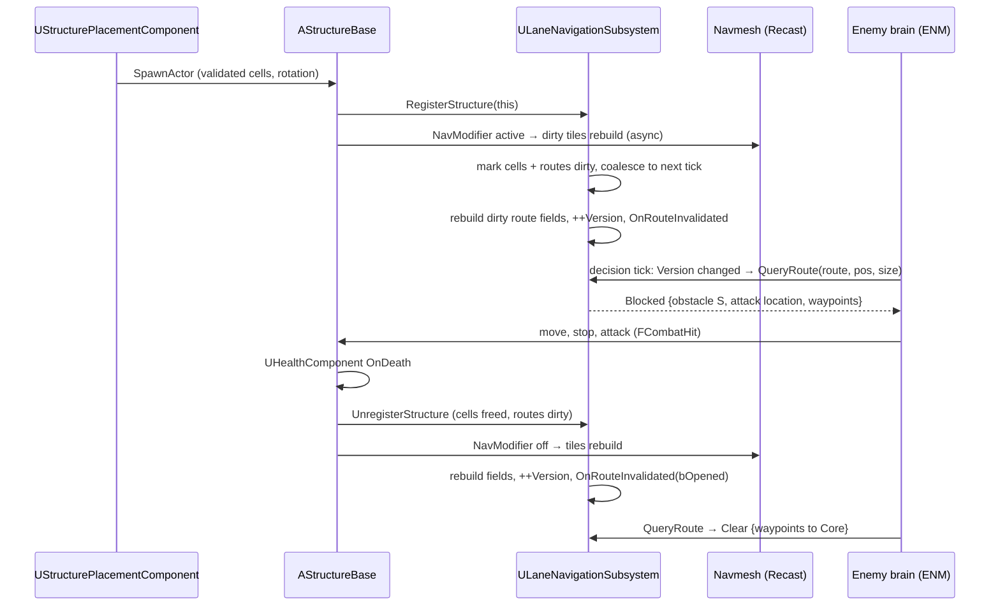
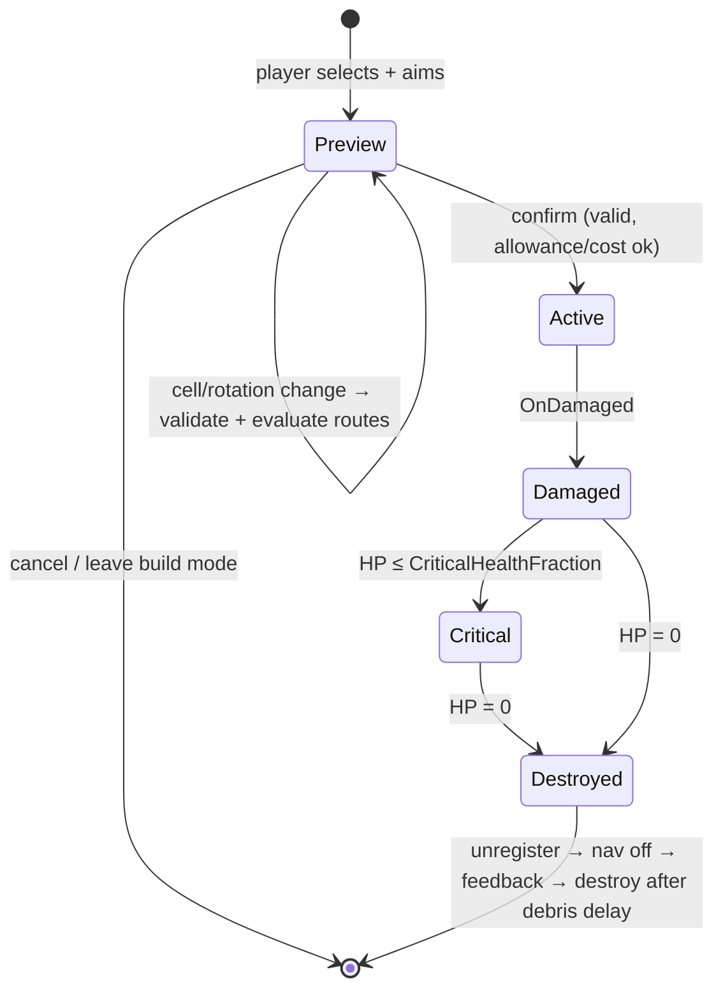
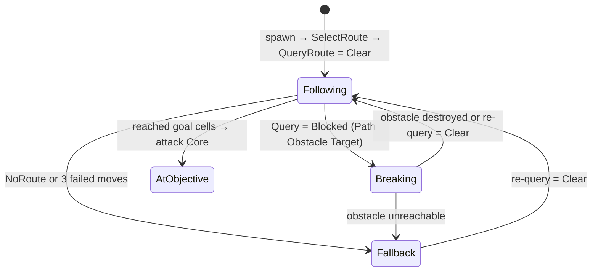

# Structures & Pathing (DEF): Technical Plan

| | |
|---|---|
| Spec | [spec.md](spec.md) |
| Decisions applied | D-03, D-05, D-06, D-09 (pending spike `T-DEF-01`), D-10, D-14, D-15, D-16 |
| Status | Draft v1. All paths and classes are proposals; no UE project exists yet |

## 1. Technical Overview

Two layers, as D-09 says:

1. **Local movement**: Recast navmesh, Runtime Generation = Dynamic Modifiers Only. Every structure carries a `UNavModifierComponent` (Null area) sized to its footprint, so building or destroying it rebuilds only the overlapped nav tiles.
2. **Strategic lane layer** (`ULaneNavigationSubsystem`): one world-aligned grid over the Siege Site. Each authored `ALaneRoute` owns the set of grid cells inside its corridor. For each route and each enemy size class the subsystem keeps a **cost field** toward the Core computed by a reverse Dijkstra where structure cells are passable at a break cost. An enemy query is a walk down that field: it either reaches the Core (Clear) or hits a structure first (Blocked → that structure is the Path Obstacle Target). The full-seal case (§14.4) needs no special code: the cheapest path simply crosses the cheapest blocker.

The field is recomputed only for routes whose corridor touches a dirty cell, once per frame at most. Enemies notice through a per-route version number checked on their existing decision tick, so there is no delegate storm and no per-frame repath (§14.2).

Placement uses the same grid: build zones mark cells as buildable for given roles, so footprint checks, path-blocking evaluation and the "blocks lane" preview all read one data structure.

## 2. Existing System Impact

| System | Impact |
|---|---|
| Combat contract (FND/CMB) | Structures use `UHealthComponent` only (D-05). Tower projectiles build `FCombatHit` with `SourceLayer = Tower` and deliver it through `UCombatLibrary::DeliverHit` (`T-CMB-04`) |
| Squads (SQD) projectile | Tower projectiles reuse `ACombatProjectile` from `Combat/` (`T-SQD-10`) |
| Interact (CMB) | `ABuildZone` and (VS) damaged structures implement `IInteractable` (`Core/Interactable.h`, `T-CMB-12`) |
| Enemies (ENM) | Consume the route query contract (spec §13). Size class comes from the enemy capsule, so ENM needs no new data field |
| Synergy (SYN) | `T-SYN-06` configures Ballista priority/bonus vs Armor Broken and Bombard poise via `FTowerWeaponParams` |
| Squads (SQD) | Navmesh sees structures through nav modifiers; squads path around them. Full seals can cut squads off (SQD stuck recovery) |
| Input (FND) | `IMC_Build` actions added by `T-DEF-07` |
| Encounter (DIR) | Reads `Lane.*` tags on spawn points; reads `MaxConcurrentEnemies` |
| Run (RUN) | Binds the Core's `UHealthComponent` (death `T-RUN-02`, critical `T-RUN-13`); placement calls `ARunGameMode::CanAfford/TrySpend` (`T-RUN-09`, free when the GameMode is not `ARunGameMode`) |
| HUD/Feedback (UXF) | Structure HP marker, Core HP bar, lane danger indicator, `DT_Feedback` rows |
| Tactical Focus (TFM), Commander Spirit (CSM), Boss (BOS) | Read-only consumers of route preview, structure queries, placement API |
| Save | None in prototype; structure/run state ready to serialize by IDs (D-14) |

## 3. Proposed Architecture

### 3.1 Runtime owner and lifetime

| Object | Owner | Lifetime |
|---|---|---|
| `ULaneNavigationSubsystem` (UWorldSubsystem) | World | Loaded Siege Site level. Builds grid in `OnWorldBeginPlay` from all `ALaneRoute` and `ABuildZone` actors |
| `AStructureBase` and children | Level (Core, pre-placed) or spawned by `UStructurePlacementComponent` | Until destroyed; registers with the subsystem in `BeginPlay`, unregisters on death |
| `UStructurePlacementComponent` | `AHeroPlayerController` | Controller lifetime, survives Hero death (usable from Commander Spirit, R-DEF-34) |
| `UTowerWeaponComponent` | Tower actor | Tower lifetime |
| Tower projectile (`ACombatProjectile` child) | Spawned by tower weapon | Until impact or lifetime expiry |

### 3.2 Main UE types

| Type | Kind | Purpose |
|---|---|---|
| `UStructureDefinition` | UPrimaryDataAsset | All structure tuning (spec §13 data model) |
| `FTowerWeaponParams` | USTRUCT inside the definition | Tower weapon tuning; zeroed for non-towers |
| `AStructureBase` | AActor | Mesh, box collision, `UHealthComponent`, `UNavModifierComponent`, footprint cells, rotation; death flow; `GetClosestPointOnFootprint` |
| `ACoreStructure` | AStructureBase child | Objective; registers as lane goal; throttled under-attack feedback; not buildable |
| `ATowerStructure` | AStructureBase child | Adds `UTowerWeaponComponent`. Barricade is a plain `AStructureBase` Blueprint |
| `UTowerWeaponComponent` | UActorComponent | Timer-driven acquisition, scoring, aim (lead + spread), fire |
| Tower projectiles | BP children of `ACombatProjectile` (SQD, `Combat/`) | Ballista bolt as a plain BP child; Bombard shell uses `ASplashProjectile : ACombatProjectile` (C++) only if the base lacks arc/splash; hits via `DeliverHit` |
| `ALaneRoute` | AActor + `USplineComponent` | Authored route; lane tag, corridor width, checkpoints, weight, valid flag |
| `ABuildZone` | AActor + `UBoxComponent`, implements `IInteractable` | Allowed roles; marks grid cells buildable; Interact enters build mode for that zone |
| `ULaneNavigationSubsystem` | UWorldSubsystem | Grid, structure registry, route fields, queries, placement evaluation, debug draw |
| `FLaneGrid` | plain C++ struct | Cell arrays + pure functions (field build, query, dilation). No UObject, so Automation Specs build synthetic grids |
| `FLaneRouteResult` | USTRUCT | Status, waypoints (checkpoint flags), ordered obstacles (weak ptr + distance along route), attack location, end target (Core), route version, valid flag |
| `UStructurePlacementComponent` | UActorComponent | Build mode, ghost, validation, spend via RUN, confirm/cancel |
| `WBP_BuildBar` | UMG | Structure choices + allowance/cost |

### 3.3 Data ownership

- Definition data: `DA_Structure_Core`, `DA_Structure_Ballista`, `DA_Structure_Bombard`, `DA_Structure_Barricade` (never mutated at runtime).
- Level data: `ALaneRoute`, `ABuildZone`, `ACoreStructure` placement in `L_SiegeSite_Proto`.
- Global tunables: `UGameTuningSettings` Lane/Build groups (spec §13).
- Runtime state: structure HP/cells on the actor; grid/fields in the subsystem; build allowance (P2) and run resource (P3) in `ARunGameState` (RUN).
- Structure State is registered with the lane layer for path queries (D-07 table).

### 3.4 Communication flow



- Direct calls owner → owned (D-10). Delegates for state changes: `OnStructureDamaged/Critical/Destroyed`, `OnRouteInvalidated(Lane, bOpened)` (per lane). ENM sets a dirty flag from `OnRouteInvalidated` and re-queries on its own decision timer; the per-route `Version` lets an enemy skip re-queries it does not need.
- Presentation: `UFeedbackSubsystem::Play(Feedback.*)` from structure/tower/placement code (spec §14).

### 3.5 C++ / Blueprint split

| C++ | Blueprint / data |
|---|---|
| Grid, fields, queries, dilation, placement validation, structure lifecycle, tower scoring/aim/fire, projectile hit/splash | `BP_Structure_*` (mesh, materials, ghost material), `BP_TowerProjectile_*` (`ACombatProjectile` children: mesh, trail), definition values, feedback rows, `WBP_BuildBar`, route preview visuals |

`BlueprintImplementableEvent` hooks: `OnStructureDamageStateChanged` (cracks), `OnTowerFired`, `OnPlacementPreviewChanged`.

### 3.6 Asset references / loading

Definitions hard-reference small meshes and projectile classes (fine at prototype scale, foundation §9). The placement component holds hard references to the 3 prototype definitions through a `TArray<UStructureDefinition*> BuildableStructures` set on the controller Blueprint. Switch to soft references at VS only if load profiling shows a need.

### 3.7 AI / navigation impact

- Navmesh: Dynamic Modifiers Only; tile size tuned in the spike (smaller tiles = cheaper local rebuild, more memory). Verify in UE docs for the pinned version that runtime-spawned `UNavModifierComponent` triggers tile rebuilds in this mode.
- Size classes: `RequiredClearanceCells = ceil(capsule diameter / GridCellSize)`, computed at spawn. The subsystem builds one field per distinct class in use (expected 1 and 2).
- Configuration space per class k: terrain walkability eroded by (k−1) cells, structure footprints dilated by (k−1) cells and owned by that structure. A 1-cell gap is open for k=1 and owned by a structure (break cost) for k=2.
- Corner cutting: a diagonal step is allowed only if both orthogonal neighbors are passable without break.
- Enemies keep inside the corridor because they walk lane-layer waypoints (downsampled field path), and navmesh only solves the short hop to the next waypoint.
- Structures use a dedicated collision object channel `Structure` (added in `T-DEF-02`); ENM aggro scans and placement overlaps filter on it.
- Risk: the boss (and possibly Giant) capsule may exceed the navmesh agent radius. The lane layer handles it with size classes; the navmesh may need a second Supported Agent (extra navmesh build/memory). The spike measures whether one agent radius is enough.

### 3.8 UI impact

- `WBP_BuildBar` (T-DEF-15): 3 slots, hotkey, allowance or cost, greyed when unavailable.
- Placement ghost + reason text + "blocks lane" icon + route preview line (T-DEF-16). Route preview uses debug-line or spline-mesh placeholder in P2.
- Structure HP markers and Core HP/lane danger are UXF widgets (`T-UXF-04`, `T-UXF-07`) bound to DEF delegates.

### 3.9 Save impact

None in prototype (A-11). Structures are identified by `FPrimaryAssetId` of their definition + cell + rotation + HP, so a future run save can rebuild them (D-14). The grid is derived data, never saved.

### 3.10 Performance risks

See Section 9. Main ones: navmesh tile rebuild cost/latency, field recompute with many routes, many enemies re-querying at once, Bombard cluster scoring, projectile count.

### 3.11 Existing systems reused

`UHealthComponent`/`FCombatHit` (FND), `UCombatLibrary::DeliverHit` and `IInteractable` (CMB), `ACombatProjectile` (SQD), `IGenericTeamAgentInterface` teams, `UFeedbackSubsystem` (UXF), `UGameTuningSettings`, `game.debug.*` CVars and Visual Logger (FND), `IMC_Build` (FND), engine `USplineComponent`, `UNavModifierComponent`, `UProjectileMovementComponent`, overlap queries.

### 3.12 New types / files proposed

```text
Source/<Game>/Structures/  StructureDefinition.h/.cpp, StructureBase.h/.cpp, CoreStructure.h/.cpp,
                           TowerStructure.h/.cpp, TowerWeaponComponent.h/.cpp, SplashProjectile.h/.cpp (only if needed),
                           StructurePlacementComponent.h/.cpp, BuildZone.h/.cpp
Source/<Game>/Navigation/  LaneNavigationSubsystem.h/.cpp, LaneRoute.h/.cpp, LaneGrid.h/.cpp (pure), LaneTypes.h
Source/<Game>/Tests/       LaneGrid.spec.cpp, Placement.spec.cpp, TowerScoring.spec.cpp
Content/<Game>/Structures/ DA_Structure_{Core,Ballista,Bombard,Barricade}, BP_Structure_*, BP_TowerProjectile_*
Content/<Game>/UI/         WBP_BuildBar
Content/<Game>/Maps/       L_SiegeSite_Proto, Test/FT_Lane_*, Test/FT_Tower_*, Test/L_Benchmark_Siege
```

### 3.13 Trade-offs

| Choice | Alternative | Why this |
|---|---|---|
| One world grid + per-route corridor fields | Lane graph only | Grid handles gaps, footprints and placement with one structure; graph cannot answer "does this 1-cell gap let a Giant through" |
| Break cost from max HP | Current HP | Deterministic, no recompute per hit, player can predict it. `ponytail:` damaged blockers are not preferred; switch to HP buckets (25%) if playtests show enemies ignoring nearly broken blockers |
| One cost model for all archetypes | Per-archetype DPS in cost | One field per route/size class, readable behavior. Upgrade if Siege needs "smarter structure targeting" (§25.1) at higher difficulty |
| Version polling on decision tick | Delegate per enemy | Hundreds of enemies binding/unbinding is churn; an int compare is free and fits the existing timer tick |
| Navmesh for local moves | Flow-field steering for enemies | Reuses UE crowd/avoidance; flow field is the spike fallback |

### 3.14 Verification

Automation Specs on `FLaneGrid` (synthetic grids), placement validation and tower scoring; Functional Tests in `Maps/Test/` for every spec scenario; Insights traces for nav/field cost; G2 gate playtest.

## 4. Runtime Flow

### Structure lifecycle



### Enemy route status (ENM view of DEF results)



## 5. State / Data

| Grid data (per cell) | Notes |
|---|---|
| `Walkable[k]` | Sampled from navmesh at BeginPlay (project cell center), eroded per class k |
| `Occupant[k]` | Structure index or none; footprint dilated by k−1 |
| `BuildZoneRoles` | Role mask from overlapping `ABuildZone`s |
| `RouteMask` | Bit per route whose corridor contains the cell |

| Per route × class | Notes |
|---|---|
| `Cost[]`, `Next[]` over the route's cells | Cost-to-goal in seconds; `Next` points one step toward the Core |
| `Version` | Increments on every rebuild |
| `bBlockedFromStart` | Path from the spawn end crosses a structure; drives lane UI and `OnRouteInvalidated` |

Grid bounds = union of route corridor bounds and build zones, snapped to `GridCellSize`. At 100 cm cells a 200 × 200 m site is 40k cells; one route corridor is ~1–3k cells.

## 6. Main Implementation Areas

### 6.1 Spike first (`T-DEF-01`)

- **Hypothesis**: a corridor grid with per-route break-cost fields on top of Recast "Dynamic Modifiers Only" makes enemies stop at blockers, pick the minimum-break target on full seals and resume after destruction, cheaply and without stuck enemies.
- **Evidence needed**: 6 scripted scenarios (open lane, partial block with gap, one-lane seal, all-lane seal with mixed HP, destroy mid-attack, 10 build/destroy in 10 s) with 50 capsule enemies of two sizes; metrics: field recompute ms per route, nav tile rebuild ms and latency, destroy → moving latency, stuck count (no movement and no attack > 3 s), max frame hitch on structure change.
- **KEEP**: all scenarios correct; field recompute ≤ 1 ms/route; nav rebuild latency ≤ 0.5 s with no hitch > 5 ms; 0 stuck over 3 runs.
- **CHANGE**: logic correct but numbers or gap behavior off → adjust cell size, nav tile size, dilation, modifier vs dynamic obstacle, retry policy; rerun.
- **DELETE** (fallback): navmesh lag or grid/navmesh disagreement causes stuck enemies that tuning cannot fix → **per-lane flow field**: enemies steer directly on the route field's `Next` pointers with simple separation; navmesh kept for Hero and squads only. Record as `CHANGE REQUEST: D-09` with the evidence.
- Spike code lives on a throwaway branch and is not merged; `T-DEF-04..06` re-implement cleanly (workflow prototyping debt rule).

### 6.2 Break-cost search (route field build)

```text
BuildField(route, k):                         // reverse Dijkstra toward the Core, per size class k
  for c in route.Cells: Cost[c] = INF; Next[c] = NONE
  for g in GoalCells(route, k):               // free cells touching the Core's dilated footprint
      Cost[g] = 0; heap.push(g, 0)
  while heap not empty:
      c = heap.popMin()
      for n in Neighbors8(c) where n in route.Cells and Walkable[k][n] and not CornerCut(c, n, k):
          step = Dist(c, n) / RefMoveSpeed
          s = Occupant[k][n]
          if s != NONE and s != Occupant[k][c]:        // entering a structure: pay its break cost once
              step += BreakCostMultiplier * s.MaxHP / RefBreakDPS
          if Cost[c] + step < Cost[n]:
              Cost[n] = Cost[c] + step; Next[n] = c; heap.push(n, Cost[n])
  ++route.Version[k]

Query(route, k, fromPos):
  c = NearestRouteCell(route, k, fromPos)       // projects off-corridor enemies back
  if c == NONE or Cost[c] == INF: return NoRoute
  path = [c]; obstacles = []; attackAt = NONE
  while c not in Goal:
      n = Next[c]
      s = Occupant[k][n]
      if s != NONE and s != Occupant[k][c]:          // entering a structure on the path
          obstacles.add(s, PathDistance(path)); if attackAt == NONE: attackAt = Center(c)
      path.add(n); c = n
  status = obstacles.empty ? Clear : Blocked        // obstacles[0] = Path Obstacle Target
  return {status, Downsample(path), obstacles, attackAt, endTarget = Core}
```

With the default high multiplier any open path beats any break, so enemies only break when sealed (literal §14.3/§14.4), and among break paths the lowest total HP wins with distance as tie-break. Lowering the multiplier is the anti-maze knob (NEW-DEF-02).

### 6.3 Dirty-region updates (`T-DEF-06`)

Register/unregister writes `Occupant[k]` for the footprint ∪ dilation, ORs the `RouteMask` of those cells into a pending set, and schedules one `SetTimerForNextTick`. The next tick rebuilds each pending route × class once, bumps versions, recomputes `bBlockedFromStart`, and broadcasts `OnRouteInvalidated(Lane, bOpened)` once per affected lane, where `bOpened` = a route of that lane was blocked and is now clear, or a structure was removed. Several builds in one frame cost one rebuild.

### 6.4 Placement (`T-DEF-07`, `T-DEF-14..16`)

Controller trace from the camera (max distance in settings) → cell → footprint cells for the current rotation → checks in spec R-DEF-24 order, first failure gives the reason; last check is `ARunGameMode::CanAfford(FRunCost{BuildCost, 1})` (skipped in sandbox maps), and confirm calls `TrySpend(..., Build)` before spawning. Pawn overlap = `OverlapAnyTestByChannel` with the footprint box. On cell/rotation change only, `EvaluatePlacement` copies affected fields into scratch, inserts a virtual occupant, rebuilds, and reports which routes would become blocked and the preview path. Confirm spawns `StructureClass` deferred, sets cells/rotation, finishes spawning.

### 6.5 Towers (`T-DEF-09..11`)

Acquisition timer (default 0.25 s): `OverlapMultiByObjectType` sphere at range on the enemy pawn channel → candidate list (team check). Score = Σ priority weights for tags present (`Unit.Enemy.*`, `State.Combat.*`) − DistanceWeight × distance; for splash weapons add the count of candidates within SplashRadius of the candidate (`ponytail:` O(n²) over candidates in range, fine below ~60; bucket if the benchmark flags it). Keep current target unless a new one scores 20% higher. Fire timer at FireInterval: aim = target position + velocity × time-to-hit × LeadFactor, plus random spread; optional LoS trace. Projectile (`ACombatProjectile` child) builds `FCombatHit` on impact: damage × `StateDamageMultipliers` for states the target has, `PoiseDamage`, `AppliedStates`; delivered with `UCombatLibrary::DeliverHit` to one target or to each target in a sphere overlap.

### 6.6 Benchmark (`T-DEF-12`)

`L_Benchmark_Siege` (copy of `L_SiegeSite_Proto`) + cheat `Bench.Run N` spawning a fixed archetype mix at both lanes, 3 squads, 6 towers, one structure built/destroyed every 5 s. Steps N = 25, 50, 75, 100, 150, 200, 60 s each, packaged Development build on the reference PC. Cap = largest N meeting the frame budget from `T-FND-08` (default 60 fps p95), then lowered if the readability check fails.

## 7. Error and Edge-Case Handling

| Situation | Handling |
|---|---|
| MoveTo to a waypoint fails (nav tile not rebuilt) | ENM retries after `MoveRetryDelay` (0.25 s), up to 3 times, then R-DEF-10 fallback |
| Enemy inside a structure's dilated zone after a new build | Query from its cell returns Blocked with that structure and its current position as attack location |
| Route corridor does not reach the Core goal cells | BeginPlay validation error naming the route; route `bValid = false` |
| No valid route left in an assigned lane | `SelectRoute` falls back to any valid route, logs an error |
| Structure destroyed during the same frame it is targeted | Weak pointers; enemy re-queries on next tick |
| Grid says open, navmesh disagrees at a gap | Spike sets cell size ≥ navmesh agent diameter; fallback through retries + R-DEF-10 |
| Placement ghost over another structure being destroyed | Preview listens to `OnRouteInvalidated` and re-validates |
| Core destroyed | Subsystem stops answering queries with routes (returns NoRoute); RUN handles lose |
| Definition missing role tag / weapon data on a tower | `IsDataValid` error; placement list skips invalid definitions |

## 8. Testing Strategy

| Level | What | Task |
|---|---|---|
| Automation Spec | Field build, query (clear/blocked/no route), dilation, corner cutting, series blockers, min-break choice, maze with strict vs low multiplier | `T-DEF-05` |
| Automation Spec | Placement validation reasons, rotation footprints, structure cap, spend-denied reason | `T-DEF-07`, `T-DEF-14` |
| Automation Spec | Tower scoring (priority tags, cluster count, hysteresis) | `T-DEF-09` |
| Functional Test | Stop-and-attack, destroy → resume, series, Core reached, Structure Collapse §33 | `T-DEF-18` |
| Functional Test | Exploits: seal one lane, seal all + Core ring, partial block, gap by size, maze, build on enemies | `T-DEF-19` |
| Perf | Insights traces for field/nav cost; benchmark | `T-DEF-01`, `T-DEF-12` |
| Playtest | G2 gate | `T-DEF-20` |

Command line: `-ExecCmds="Automation RunTests <Game>.Lane; Automation RunTests <Game>.Structures; Quit"`.

## 9. Performance Risks

| Risk | Watch | Mitigation |
|---|---|---|
| Nav tile rebuild cost / latency | `stat navigation`, Insights | Tile size from spike; nav modifiers only on footprint |
| Field rebuild with many routes | Custom cycle stat `STAT_LaneFieldBuild` | Only dirty routes; coalesce per frame; cells limited to corridors |
| Re-query burst after a destroy | Query count per frame | Queries are O(path) walks; decision timers already staggered |
| Bombard cluster scoring | Tower acquisition ms | Candidate cap; bucket if measured |
| Projectile count | Actor count, spawn cost | Pool only if benchmark shows spawn churn (D-15) |
| Character movement of many enemies | Game thread ms | Benchmark sets the cap; optimizations become separate PERF tasks |

## 10. Dependencies and Risks

- Depends on FND (`T-FND-04..10`), ENM (`T-ENM-01, 05, 06, 07, 08, 09, 10`), SYN `T-SYN-06`, DIR `T-DIR-01`, RUN `T-RUN-02, 09, 04`, UXF `T-UXF-01, 04, 07`, PRK `T-PRK-01, 02` (P3).
- Risk: grid/navmesh disagreement at gaps → spike measures; fallback per-lane flow field.
- Risk: players find the strict rule exploitable by mazing → exploit test + multiplier knob (NEW-DEF-02).
- Risk: soft grid feels restrictive → G2 review answers Q-05.
- Risk: boss/Giant capsule larger than the navmesh agent radius → may need a second Supported Agent navmesh (cost measured in the spike and in `T-DEF-23`).
- Risk: `ACombatProjectile` (SQD) may lack arc/splash/pierce; DEF adds a thin subclass rather than a parallel projectile base.
- Request (not a D-xx change): new Gameplay Tag root `Lane.*` in `00-foundation/technical-plan.md` / `T-FND-04`.
- No `CHANGE REQUEST` against D-xx at this time. D-09 stays pending until the spike result is recorded here.

## 11. Requirement Coverage

| Requirement | Technical area | Notes |
|---|---|---|
| R-DEF-01 | Lane fields + placement evaluation | Placement changes field → enemy behavior |
| R-DEF-02 | Query contract + ENM brain | Clear/Blocked statuses |
| R-DEF-03 | `ALaneRoute` lane tag, `GetObjective`; ENM data | |
| R-DEF-04 | Version + checkpoints + destroy event; ENM tick | No per-frame repath |
| R-DEF-05 | `Query` Blocked + `GetClosestPointOnFootprint` | §6.2 |
| R-DEF-06 | Corridor-restricted search; `bValid`; `AssignLane` | |
| R-DEF-07 | Size classes, erosion/dilation | §3.7 |
| R-DEF-08 | Break-cost field | §6.2 |
| R-DEF-09 | `UGameTuningSettings` Lane group | Multiplier knob |
| R-DEF-10 | Fallback + `GetStructuresInRadius` | §7 |
| R-DEF-11 | Nav modifiers + dirty routes | §6.3 |
| R-DEF-12 | Structures targetable; ENM aggro rule | |
| R-DEF-13 | `RoleTag` + `IsDataValid` | |
| R-DEF-14 | Towers occupy cells like blockers | |
| R-DEF-15 | `ABuildZone::AllowedRoles` | VS content |
| R-DEF-16..18 | `FTowerWeaponParams` per definition | `T-DEF-08/10/11` |
| R-DEF-19 | Priority tags, PoiseDamage in params | `T-SYN-06` configures |
| R-DEF-20 | `DesignNotes` five items + validation | |
| R-DEF-21 | `ACoreStructure` + its `UHealthComponent` | RUN binds death/critical |
| R-DEF-22..24 | `UStructurePlacementComponent`, `ABuildZone`, grid, RUN spend API | §6.4, `T-DEF-14` |
| R-DEF-25 | `EvaluatePlacement` + preview | `T-DEF-16` |
| R-DEF-26 | Feedback rows + UXF markers | `T-DEF-17` |
| R-DEF-27 | Destroy flow + `bOpened` | §7 |
| R-DEF-28 | Functional Test Structure Collapse | `T-DEF-18` |
| R-DEF-29 | No pooling by default | D-15 |
| R-DEF-30 | Benchmark | §6.6 |
| R-DEF-31 | Cost check via RUN resource | `T-DEF-21` |
| R-DEF-32 | Stat query + shot event hooks | `T-DEF-22` |
| R-DEF-33 | `GetRoutePreview` | `T-DEF-16` |
| R-DEF-34 | Placement on controller | §3.1 |
| R-DEF-35 | Data-only 4th tower | `T-DEF-24` |
| R-DEF-36 | Repair via Interact | `T-DEF-25` |
