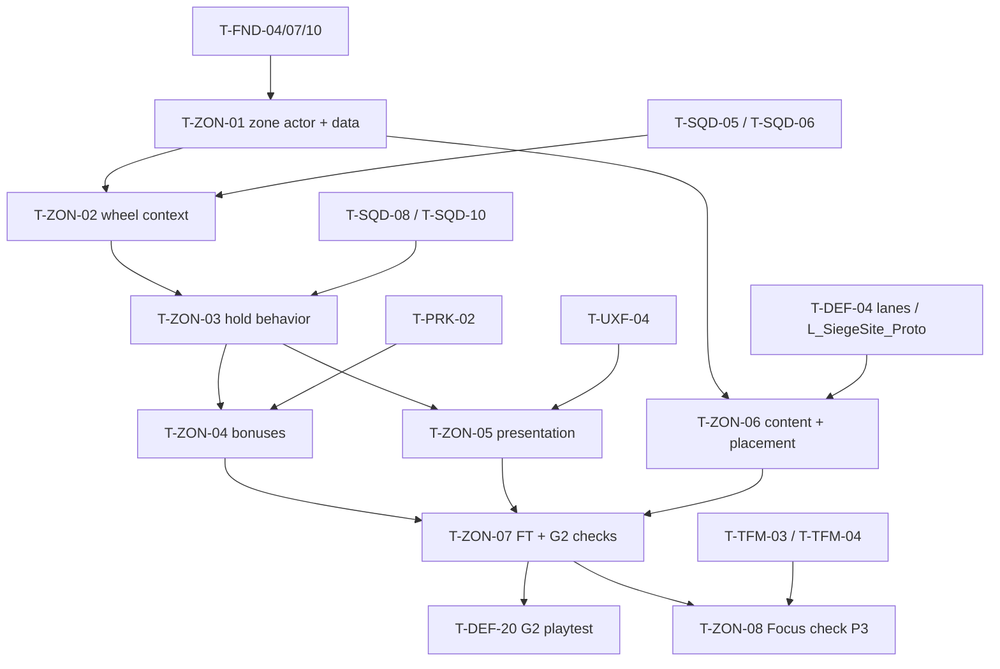

# Tactical Zones: Tasks

| | |
|---|---|
| Spec / plan | [spec.md](spec.md) · [technical-plan.md](technical-plan.md) |
| Phases | P2 (core) · P3 (Focus check) |
| Task count | 8 (P2: 7, P3: 1) |

## 1. Summary

P2 builds zone actors and data, plugs the zone into the SQD Command Wheel resolver, gives squads hold-zone behavior (anchor, formation, leash, facing, zone-area engagement, zone state), adds light bonuses through the PRK stat query, presents zones, places them in `L_SiegeSite_Proto`, and tests everything. Zone checks are reported inside the G2 gate playtest owned by DEF (`T-DEF-20`). P3 only verifies zones inside Tactical Focus (TFM builds the overlay).

All paths are proposals. Every task ends with the master plan Definition of Done (§8).

## 2. Task Overview

| ID | Task | Type | Phase | Priority | Dependencies | Status |
|---|---|---|---|---|---|---|
| T-ZON-01 | `ATacticalZone` + `UTacticalZoneDefinition` + anchor component | GAMEPLAY | P2 | Must | T-FND-04, T-FND-07, T-FND-10 | Todo |
| T-ZON-02 | Zone context in the Command Wheel | GAMEPLAY | P2 | Must | T-ZON-01, T-SQD-05, T-SQD-06 | Todo |
| T-ZON-03 | Squad hold-zone behavior: anchor, formation, leash, facing lane, zone state | AI | P2 | Must | T-ZON-02, T-SQD-08, T-SQD-10 | Todo |
| T-ZON-04 | Zone bonuses via stat modifiers | GAMEPLAY | P2 | Must | T-ZON-03, T-PRK-02 | Todo |
| T-ZON-05 | Zone presentation: outline, marker, state colours, bonus icon | UI | P2 | Must | T-ZON-03, T-UXF-04 | Todo |
| T-ZON-06 | Zone content + placement in `L_SiegeSite_Proto` | DESIGN | P2 | Must | T-ZON-01, T-DEF-04 | Todo |
| T-ZON-07 | Functional Tests `L_Test_Zones` + regression + G2 zone checks | QA | P2 | Must | T-ZON-04, T-ZON-05, T-ZON-06 | Todo |
| T-ZON-08 | Zones in Tactical Focus: verification | QA | P3 | Should | T-ZON-07, T-TFM-03, T-TFM-04 | Todo |

## 3. Detailed Tasks

## P2

### T-ZON-01 — `ATacticalZone` + `UTacticalZoneDefinition` + anchor component

**Type** GAMEPLAY · **Phase** P2

**Objective**
Designers can place a zone with an area, role-tagged anchors and a definition, and code can ask "is this point in the zone?".

**Related Requirements** R-ZON-01, R-ZON-02, R-ZON-09, R-ZON-17 · AC-ZON-09

**Dependencies** T-FND-04, T-FND-07, T-FND-10

**Implementation Notes**
- [ ] `UTacticalZoneDefinition` (`UPrimaryDataAsset`, register Primary Asset Type `TacticalZoneDefinition`): `ZoneTag`, `DisplayName`, `HoldLabel`, `Icon`, `LeashRadius`, `TArray<FZoneBonus> Bonuses` (`FZoneBonus` uses PRK `EStatModOp`; if `T-PRK-02` is not merged yet, declare the struct with a TODO to swap the enum).
- [ ] `IsDataValid` per technical plan §3.2.
- [ ] `UZoneAnchorComponent : UArrowComponent` with `FGameplayTag Role`; tags `Zone.Anchor.Melee`, `Zone.Anchor.Ranged` added to the tag file.
- [ ] `ATacticalZone`: `UBoxComponent Area` (collision off), `Definition`, `ContainsPoint(FVector)` (inverse transform + extent compare), `GetAreaVolume()`, `GetAnchors()`.
- [ ] Map check (editor-only, verify `AActor::CheckForErrors` in UE docs): warn when no anchors, no definition, or box half-diagonal > `LeashRadius`.
- [ ] `game.debug.Zones` CVar draws box, anchors with role colour and facing.

**Expected Files / Assets** `Zones/TacticalZoneDefinition.*`, `Zones/TacticalZone.*`, `Zones/ZoneAnchorComponent.*`, `Zones/ZoneTypes.h`, `Tests/TacticalZone.spec.cpp`; `BP_TacticalZone`, `DA_Zone_Test`

**Test Case** Spec: box rotated 45° and scaled → points inside/outside/on edge return expected values. Definition with empty label → `IsDataValid` fails.

**Acceptance Criteria**
- [ ] `ContainsPoint` Spec cases pass for rotated and scaled boxes.
- [ ] Zone with no anchors produces a map check warning.
- [ ] Anchors show facing arrows in the editor.

**Verification** Automation Spec; editor map check; PIE with `game.debug.Zones 1`.

### T-ZON-02 — Zone context in the Command Wheel

**Type** GAMEPLAY · **Phase** P2

**Objective**
Aiming into a zone with the wheel shows "Hold <Zone>" and issues a Guard order carrying the zone.

**Related Requirements** R-ZON-01, R-ZON-04, R-ZON-05 · AC-ZON-01, AC-ZON-02

**Dependencies** T-ZON-01, T-SQD-05, T-SQD-06

**Implementation Notes**
- [ ] On wheel open, `UCommandComponent` caches zones with `TActorIterator<ATacticalZone>` (skip zones without definition).
- [ ] Add `Zone` to the context kind enum; insert the zone check at the `T-SQD-06` insertion point (after enemy, before ground): zones whose `ContainsPoint(hit location)` is true; smallest `GetAreaVolume()` wins.
- [ ] Context: suggested command Guard, `ContextActor` = zone, `DisplayText` = `HoldLabel`, location = hit point (anchor chosen in T-ZON-03).
- [ ] Highlight: call `ATacticalZone::SetAimHighlight(bool)` on enter/leave (BlueprintImplementableEvent `OnAimHighlightChanged`); clear on wheel close.
- [ ] Follow and Retreat ignore zone context.

**Expected Files / Assets** edits `Player/CommandComponent.*`, `Player/CommandTypes.h`, `Zones/TacticalZone.*`

**Test Case** Two overlapping zones (big Rally Point, small Bridge inside it): aim inside both → Bridge wins; aim at an enemy standing on the bridge → Attack context.

**Acceptance Criteria**
- [ ] Any walkable point inside the zone gives the zone context.
- [ ] Enemy under reticle always beats the zone.
- [ ] Wheel label shows the definition's `HoldLabel`.

**Verification** Automation Spec on resolver with fake zone + hits; PIE aiming check.

### T-ZON-03 — Squad hold-zone behavior

**Type** AI · **Phase** P2

**Objective**
A squad ordered to hold a zone picks a sensible anchor, forms facing the lane, defends the zone area within the zone leash and reforms after; the zone reports Unheld / Held / Contested.

**Related Requirements** R-ZON-06, R-ZON-07, R-ZON-08, R-ZON-09, R-ZON-10, R-ZON-16 · AC-ZON-03, AC-ZON-04, AC-ZON-05, AC-ZON-08

**Dependencies** T-ZON-02, T-SQD-08, T-SQD-10

**Implementation Notes**
- [ ] `USquadDefinition::PreferredAnchorRole`; Infantry = Melee, Archer = Ranged.
- [ ] `ATacticalZone::ClaimAnchor(AActor* Squad, FGameplayTag Role) → FZoneAnchorClaim` per technical plan §5 (preferred free → any free → stacked behind nearest holder); `Release(AActor*)`; `PreviewAnchor(Role)` const (no claim) for the aim preview.
- [ ] `ASquad::IssueOrder` with a zone context: claim anchor, set order location/facing from the claim, `LeashRadiusOverride` = zone leash; store `FSquadZoneHold`; claim failure → reject (Invalid). Re-ordering to the same zone keeps the anchor.
- [ ] While holding: guard-area test = `Zone->ContainsPoint`; candidate query radius = max(zone leash, engage radius); report `SetEnemyInside(Squad, bAny)` each decision tick (only on change).
- [ ] Release on order change, wipe, destroy (one code path).
- [ ] Zone state derivation + `OnZoneStateChanged` / `OnHoldersChanged`; prune stale weak refs.
- [ ] Visual Logger: claims, releases, state changes.

**Expected Files / Assets** edits `Zones/TacticalZone.*`, `Army/Squad.*`, `Army/SquadDefinition.*`, `Army/SquadTypes.h`

**Test Case** Bridge zone with one Melee anchor and one Ranged anchor: hold with Infantry, then Archer → Infantry on Melee, Archer on Ranged, both facing the anchor arrows. Send a second Infantry squad → it stands behind the first. Enemy walks onto the far end of the bridge (inside box, outside normal engage radius) → Infantry engages, zone Contested; enemy dies → Reform at anchor, zone Held.

**Acceptance Criteria**
- [ ] Spec: anchor pick order and state derivation table pass.
- [ ] Facing within 10° of anchor arrow after reform.
- [ ] No soldier goes beyond the zone leash.
- [ ] Wiping the holding squad frees the anchor and sets Unheld.

**Verification** Automation Spec (`TacticalZone.spec.cpp`); Functional Tests in T-ZON-07; PIE with debug draw.

### T-ZON-04 — Zone bonuses via stat modifiers

**Type** GAMEPLAY · **Phase** P2

**Objective**
Holding High Ground, Chokepoint or Rally Point gives its light bonus through the shared stat query, and only while held.

**Related Requirements** R-ZON-11, R-ZON-12, R-ZON-13, R-ZON-14 · AC-ZON-06, AC-ZON-07

**Dependencies** T-ZON-03, T-PRK-02

**Implementation Notes**
- [ ] On claim: for each `FZoneBonus` whose `SquadTypes` is empty or contains the squad type, `UStatModifierSubsystem::AddModifier` (target = squad, source = zone), keep handles in `FSquadZoneHold`. On release: `RemoveModifier` each handle, clear.
- [ ] Read points in SQD code (technical plan §6 item 4):
  - [ ] Archer range / engage radius: `GetStatFor(Squad, Stat.Army.RangedRange, Def.AttackRange)` at acquisition and fire.
  - [ ] Infantry incoming damage: soldier `ICombatHitInterceptor` step scales damage by (1 − clamp(`GetStatFor(Squad, Stat.Army.BlockEfficiency, 0)`, 0, 0.9)); add the interceptor if soldiers do not have one.
  - [ ] Reform: walk speed × `GetStatFor(Squad, Stat.Army.ReformSpeed, 1)`, reform timeout ÷ same value.
- [ ] Use the stat tags from the PRK registry exactly; add them to the tag file if PRK has not yet.
- [ ] Debug: `game.debug.Zones 1` lists active zone modifiers per squad.

**Expected Files / Assets** edits `Army/Squad.*`, `Army/SoldierCharacter.*`, `Zones/TacticalZone.*`; `DA_Zone_HighGround`, `DA_Zone_Chokepoint`, `DA_Zone_RallyPoint` bonus values (placeholders, spec §4.1)

**Test Case** Archer base range 25 m, High Ground +0.15: dummy at 27 m → not attacked outside the hold, attacked while holding High Ground; order the squad away → dummy no longer attacked within one decision interval. Same hit on an Infantry soldier deals 100 % outside, 85 % while holding Chokepoint. Reform time with Rally Point hold < without.

**Acceptance Criteria**
- [ ] Bonus removed on order change, wipe and squad destroy (no leaked modifiers in the debug list).
- [ ] Changing a magnitude in `DA_Zone_*` changes the effect without code change.
- [ ] Two squads holding one zone get independent modifiers.

**Verification** PRK `FT_Stat_ZoneModifier` + ZON Functional Tests in T-ZON-07; debug modifier list.

### T-ZON-05 — Zone presentation

**Type** UI · **Phase** P2

**Objective**
Zones are readable during normal play, obvious when aimed, and show holder, state and bonus (spec §14).

**Related Requirements** R-ZON-15 · AC-ZON-05

**Dependencies** T-ZON-03, T-UXF-04

**Implementation Notes**
- [ ] `BP_TacticalZone`: subtle ground outline decal sized to the box (`M_ZoneOutline`), colours per state (Unheld neutral, Held ally, Contested warning pulse), strong highlight on `OnAimHighlightChanged`.
- [ ] Anchor preview while aimed: ghost marker at `PreviewAnchor(selected squad role)`.
- [ ] Zone marker via UXF marker component: zone icon + display name + holder squad icon.
- [ ] Squad marker / squad strip: small bonus icon while `FSquadZoneHold` has modifier handles.
- [ ] No zone audio (spec §14); hold acknowledgement comes from SQD.
- [ ] All bound to delegates/events; no Tick.

**Expected Files / Assets** `BP_TacticalZone` graph, `M_ZoneOutline`, zone marker widget, icon textures (placeholder)

**Test Case** In `L_SiegeSite_Proto` at run start, a tester points at every zone and names it within 2 s; hold a zone and let an enemy in → colour changes to Contested and back.

**Acceptance Criteria**
- [ ] Every row of spec §14 has its visual.
- [ ] Outline does not hide enemies or telegraphs (check against ENM telegraph decals).
- [ ] Bonus icon appears only while a bonus is active.

**Verification** PIE checklist against spec §14; `T-UXF-09` audit entry.

### T-ZON-06 — Zone content + placement in `L_SiegeSite_Proto`

**Type** DESIGN · **Phase** P2

**Objective**
Six zone definitions exist and the P2 Siege Site has the zones of the §33 example run on its two lanes.

**Related Requirements** R-ZON-02, R-ZON-03, R-ZON-09, R-ZON-12 · AC-ZON-09

**Dependencies** T-ZON-01, T-DEF-04

**Implementation Notes**
- [ ] `DA_Zone_Bridge`, `DA_Zone_Gate`, `DA_Zone_HighGround`, `DA_Zone_Chokepoint`, `DA_Zone_ResourceCamp`, `DA_Zone_RallyPoint` with labels, leash and placeholder bonuses (spec §4.1).
- [ ] Place in `L_SiegeSite_Proto` (map owned by DEF; this task adds zone actors only): a Bridge on one lane, a Chokepoint on the other, a High Ground overlooking a lane, a Rally Point between lanes near the Core. Gate / Resource Camp only if the blockout has a fitting spot (NEW-ZON-08).
- [ ] Each zone: ≥1 Melee and ≥1 Ranged anchor (Rally Point: 2–3 any-role), facing toward the incoming lane, box inside leash.
- [ ] Check build zones (DEF) and tactical zones can coexist (§33 Ballista on high ground) without anchors on build cells where possible.
- [ ] Run map check: zero zone warnings.

**Expected Files / Assets** `Content/<Game>/Zones/DA_Zone_*`; zone actors in `L_SiegeSite_Proto`

**Test Case** Open `L_SiegeSite_Proto` → map check clean; PIE: hold each placed zone with Infantry and Archer → all anchors reachable, facing the lane.

**Acceptance Criteria**
- [ ] All six definitions pass `IsDataValid`.
- [ ] Bridge, High Ground, Chokepoint, Rally Point placed and holdable.
- [ ] No anchor unreachable at level start.

**Verification** Map check; PIE walk-through.

### T-ZON-07 — Functional Tests `L_Test_Zones` + regression + G2 zone checks

**Type** QA · **Phase** P2

**Objective**
Zone behavior runs unattended, and G2 gets the evidence to judge zones.

**Related Requirements** R-ZON-01..17 · AC-ZON-01..10

**Dependencies** T-ZON-04, T-ZON-05, T-ZON-06

**Implementation Notes**
- [ ] `Maps/Test/L_Test_Zones` with `AFunctionalTest` actors:
  - [ ] FT_Zone_AimContext · FT_Zone_EnemyBeatsZone · FT_Zone_OverlapSmallestWins
  - [ ] FT_Zone_AnchorRoles · FT_Zone_StackBehind · FT_Zone_BoxEngageLeash · FT_Zone_ContestedState
  - [ ] FT_Zone_BonusRange · FT_Zone_BonusBlock · FT_Zone_BonusReform · FT_Zone_WipeReleases
- [ ] Add zone regression items to §5 of this file; re-run the SQD suite (`L_Test_Squad`) since ZON edits squad code.
- [ ] G2 zone checks for `T-DEF-20` notes: % of Guard orders that used a zone (telemetry context kind), rating "zones helped me order fast" (1–5), rating "a zone felt mandatory" (1–5), bonus noticed (yes/no), KEEP / CHANGE / DELETE for zones and for each bonus.

**Expected Files / Assets** `Maps/Test/L_Test_Zones`, `FT_Zone_*`; zone section in `ai/game/playtests/G2_<date>.md`

**Test Case** Command-line run of zone + squad Functional Tests → all pass 5 times in a row.

**Acceptance Criteria**
- [ ] All listed tests pass; SQD suite still passes.
- [ ] G2 notes contain the zone section with a decision.

**Verification** Command-line runner (T-FND-10); G2 review.

## P3

### T-ZON-08 — Zones in Tactical Focus: verification

**Type** QA · **Phase** P3

**Objective**
Confirm zones show in the Tactical Focus overlay and can be held from the tactical camera (R-ZON-18). TFM builds the overlay; this task only verifies and fixes zone-side gaps.

**Related Requirements** R-ZON-18 · AC-ZON-11

**Dependencies** T-ZON-07, T-TFM-03, T-TFM-04

**Implementation Notes**
- [ ] Enter Focus in `L_SiegeSite_Proto`: every zone icon visible, same icons as third-person.
- [ ] Aim at a zone from the tactical camera → "Hold <Zone>" → squad holds; bonus applied.
- [ ] Hold with time dilation active → claim/release and state updates still correct.
- [ ] Fix zone-side issues only (e.g. marker visibility flag); overlay issues go to TFM.

**Expected Files / Assets** none expected; fixes in `Zones/` if needed

**Test Case** Focus → hold Bridge with Infantry → exit Focus → squad on bridge, bonus list correct.

**Acceptance Criteria**
- [ ] All zones visible in Focus.
- [ ] Hold order from Focus behaves the same as from third-person.

**Verification** PIE checklist; add a Functional Test variant with Focus active if TFM exposes an API for it.

## 4. Dependency Graph

Parallel: T-ZON-06 runs as soon as T-ZON-01 and the DEF lanes exist; T-ZON-05 parallel to T-ZON-04.

## 5. Integration / Regression Checklist

- [ ] `L_Test_Zones` and `L_Test_Squad` Functional Tests pass.
- [ ] `TacticalZone.spec.cpp` passes.
- [ ] Guard on plain ground still works exactly as in P1 (no zone side effects).
- [ ] Enemy under reticle never resolves to a zone.
- [ ] No leaked stat modifiers after order changes, wipes or level end (debug list empty).
- [ ] Zones never block navigation or projectiles (collision off).
- [ ] Map check clean for `L_SiegeSite_Proto`.
- [ ] P3: zones work in Tactical Focus and from Commander Spirit (same resolver).

## 6. Final Definition of Done

- All P2 ZON tasks Done; zone section of the G2 notes recorded with a KEEP / CHANGE / DELETE decision.
- All [TUNABLE] values in `DA_Zone_*`; NEW-ZON answers recorded in spec §12.
- No zone code path outside the stat query changes squad numbers.
- P3 check (`T-ZON-08`) Done before G3.
