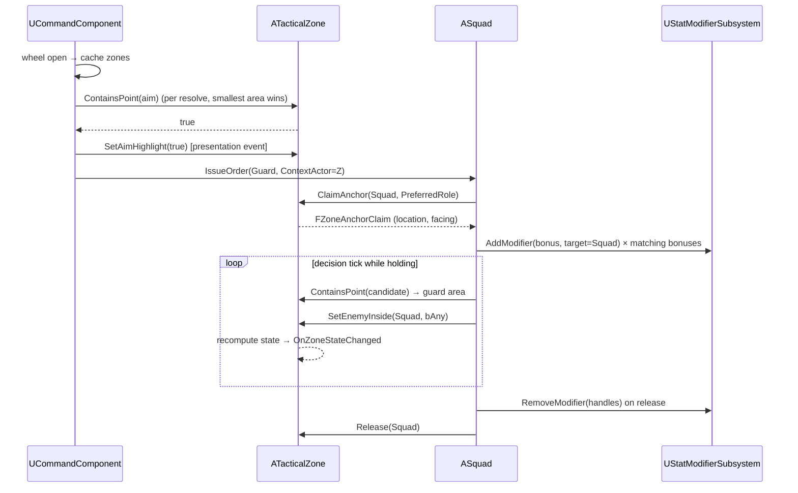
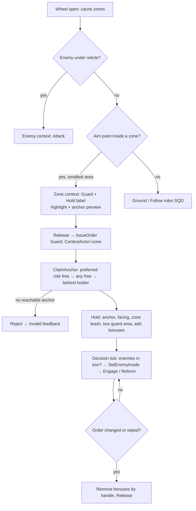
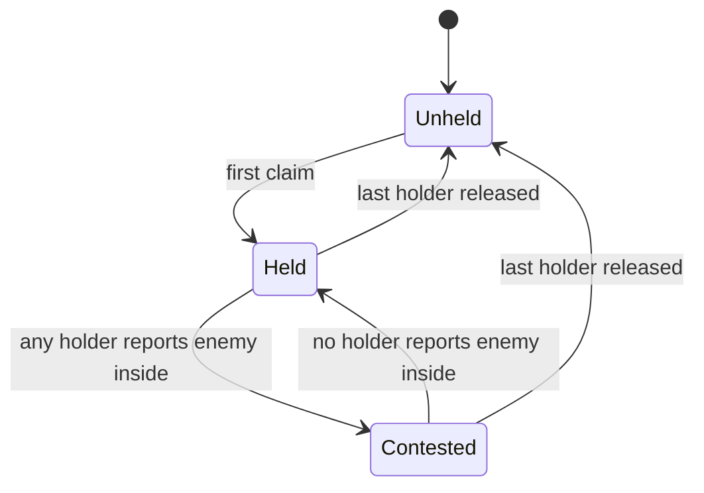

# Tactical Zones: Technical Plan

| | |
|---|---|
| Spec | [spec.md](spec.md) |
| Architecture baseline | [00-foundation/technical-plan.md](../00-foundation/technical-plan.md), master plan D-01..D-18 |
| Builds on | SQD [technical-plan.md](../03-squad-command/technical-plan.md) (resolver, `FSquadOrder`), PRK [technical-plan.md](../11-perks/technical-plan.md) (`UStatModifierSubsystem`) |
| Phases | P2 (core), P3 (Focus check) |

> No UE project exists yet. Every class, file and asset path below is a **proposal**.

## 1. Technical Overview

- `ATacticalZone` is a passive level actor: a box area, a few anchor components, a definition reference and a small holder table. It has no Tick and no overlap events.
- The SQD resolver (`UCommandComponent::ResolveContext`) gets one extra check at the insertion point left by `T-SQD-06`: "is the aim point inside a cached zone?" If yes, the context becomes `Zone` with Guard pre-selected and the zone's hold label.
- When a Guard order carries a zone, the squad claims an anchor (location + facing), uses the zone leash and the zone box as its guard area, reports enemies inside to the zone, and adds its bonus modifiers to `UStatModifierSubsystem`. On release it removes them by handle.
- Dependency direction is one way: `Army/` and `Player/` call `Zones/`. `Zones/` does not include squad headers (holders are stored as weak `AActor` pointers). This avoids an Army ↔ Zones cycle.

## 2. Existing System Impact

| System | Impact |
|---|---|
| SQD `UCommandComponent` | Caches zones on wheel open; resolver adds the zone check between enemy and ground; sets `ContextActor` and `DisplayText` |
| SQD `ASquad` | Zone hold: claim/release anchor, leash override, guard-area test via `ContainsPoint`, enemy-inside report, bonus handles. Read points for 3 stats |
| SQD `USquadDefinition` | New field `PreferredAnchorRole` (`Zone.Anchor.Melee` / `Zone.Anchor.Ranged`) |
| SQD `ASoldierCharacter` | Implements CMB `ICombatHitInterceptor` damage scaling for `BlockEfficiency` (only if it does not already) |
| PRK `UStatModifierSubsystem` | Consumer: `AddModifier` / `RemoveModifier` / `GetStatFor` |
| UXF marker component | Zone marker + bonus icon on squad marker |
| DEF `L_SiegeSite_Proto` | Zone actors placed on its lanes |
| TFM (P3) | Reads zones (same cached list approach) for the overlay; uses the same resolver |
| Gameplay Tags | New leaves `Zone.Anchor.Melee`, `Zone.Anchor.Ranged` under the existing `Zone` root |

## 3. Proposed Architecture

### 3.1 Runtime owner and lifetime

| Object | Owner | Lifetime |
|---|---|---|
| `ATacticalZone` | Level (placed by designer) | Level |
| `UTacticalZoneDefinition` | Asset | Static, never mutated |
| Holder table | `ATacticalZone` | Level; entries are weak refs, pruned when invalid |
| Zone hold (zone, anchor index, modifier handles) | `ASquad` (`FSquadZoneHold` value) | Until order change, wipe or zone release |
| Zone cache for aim | `UCommandComponent` | Rebuilt on wheel open (`TActorIterator<ATacticalZone>`, ≤ ~10 actors) |

### 3.2 Main UE types

| Type | Kind | Folder | Responsibility |
|---|---|---|---|
| `UTacticalZoneDefinition` | `UPrimaryDataAsset` | `Zones/` | `ZoneTag`, `DisplayName`, `HoldLabel`, `Icon`, `LeashRadius`, `TArray<FZoneBonus> Bonuses`. `IsDataValid`: tag set, label set, leash > 0, bonus stat tags under `Stat.`, magnitudes within a sanity range (−0.5..0.5 for multiply) |
| `FZoneBonus` | `USTRUCT` | `Zones/` | `StatTag`, `EStatModOp Op` (PRK enum), `Magnitude`, `FGameplayTagContainer SquadTypes` (empty = all) |
| `ATacticalZone` | `AActor` | `Zones/` | `UBoxComponent Area` (no collision), anchors, `Definition`; `ContainsPoint`, `GetAreaVolume`, `ClaimAnchor`, `Release`, `SetEnemyInside`, `GetState`; delegates; presentation events |
| `UZoneAnchorComponent` | `UArrowComponent` subclass | `Zones/` | `FGameplayTag Role`; facing = component forward; editor-visible arrow |
| `ETacticalZoneState` | `UENUM` | `Zones/` | Unheld, Held, Contested |
| `FZoneAnchorClaim` | `USTRUCT` | `Zones/` | `bValid`, `Location`, `Facing`, `AnchorIndex`, `bStackedBehind` |
| `FSquadZoneHold` | `USTRUCT` | `Army/` | Weak zone, anchor index, `TArray<FStatModifierHandle>` |
| `BP_TacticalZone`, `DA_Zone_*` | Content | `Content/<Game>/Zones/` | Six definitions, one Blueprint child with outline decal + marker |

### 3.3 Data ownership

| Data | Where |
|---|---|
| Zone tuning (label, leash, bonuses) | `DA_Zone_*` |
| Area shape, anchors, facing | Level instance of `BP_TacticalZone` |
| Preferred anchor role | `DA_Squad_*` |
| Who holds what | `ATacticalZone` holder table (zone side) and `FSquadZoneHold` (squad side); squad is the writer, zone validates |
| Bonus values in effect | `UStatModifierSubsystem` (PRK) |

### 3.4 Communication flow



- Zone → presentation: `BlueprintImplementableEvent` `OnAimHighlightChanged(bool)`, `OnZoneStateVisualChanged(State)` on `BP_TacticalZone` (foundation §8 presentation hook pattern).
- Zone state → others: `OnZoneStateChanged` dynamic delegate (UXF marker, TFM overlay).

### 3.5 C++ / Blueprint split

| C++ | Blueprint |
|---|---|
| Zone actor logic, anchor claim, state, `ContainsPoint` | Outline decal, marker icon, highlight and state colours |
| Resolver zone check, squad hold, bonus apply/remove, stat read points | `DA_Zone_*` values, zone placement in maps |

### 3.6 Asset references / loading

Definitions hard-reference an icon only. Zones are level actors; nothing is loaded at runtime.

### 3.7 AI / navigation impact

- Anchor reachability: `ProjectPointToNavigation` (3 m) at claim time; the SQD path check then applies as for any Guard order.
- Facing: anchor arrow, authored toward the incoming lane. `ponytail:` authored, not derived from `ALaneRoute`; derive only if authoring mistakes show up in G2.
- Guard area: while holding, SQD Infantry rule `InGuardArea` and the Engage trigger use `Zone->ContainsPoint(EnemyLocation)` instead of the engage radius; leash centre = anchor, radius = zone `LeashRadius`. Candidate query radius = max(zone leash, engage radius) so enemies anywhere in the zone are seen (zones should be authored so the box fits inside the leash; `IsDataValid` cannot check this, map check warns when the box half-diagonal > leash).

### 3.8 UI impact

- Wheel label from `FCommandTargetContext::DisplayText` = `HoldLabel` (SQD widget already shows it).
- Anchor preview: `BP_TacticalZone` shows the anchor the current squad would claim while aimed (`PreviewAnchor(Role)` const query, no claim).
- Zone marker via UXF marker component: icon, label, holder icon, state colour. Bonus icon on the squad marker when `FSquadZoneHold` has handles.

### 3.9 Save impact

None in prototype. A future run save would store zone actor name/GUID + anchor index per squad (D-14).

### 3.10 Existing systems reused

SQD resolver insertion point, `FSquadOrder.ContextActor` / `LeashRadiusOverride`, SQD formation/leash/targeting, PRK `UStatModifierSubsystem` and `EStatModOp`, CMB `ICombatHitInterceptor`, UXF marker component, `UGameTuningSettings`, `game.debug.*` CVars, Visual Logger.

### 3.11 New files proposed

```text
Source/<Game>/Zones/  TacticalZoneDefinition.h/.cpp, TacticalZone.h/.cpp, ZoneAnchorComponent.h/.cpp, ZoneTypes.h
Source/<Game>/Tests/  TacticalZone.spec.cpp
Content/<Game>/Zones/ BP_TacticalZone, DA_Zone_{Bridge,Gate,HighGround,Chokepoint,ResourceCamp,RallyPoint}, M_ZoneOutline
Content/<Game>/Maps/Test/ L_Test_Zones
Edits: Army/Squad.*, Army/SquadDefinition.*, Army/SoldierCharacter.*, Player/CommandComponent.*
```

### 3.12 Trade-offs

| Choice | Alternative | Why |
|---|---|---|
| Zone always suggests Guard | Per-squad-type command map | Only Guard takes a location (§11.2); a map would always say Guard |
| Point-in-box over cached list | Collision channel + overlap query | ≤ 10 zones; no collision setup, no trace channel |
| Contested from squad scans | Zone overlap events on enemy pawns | Overlap events on many enemies cost; state only matters while held, and holders already scan |
| Authored anchors with role tags | Auto-generated anchors | Designer control at choke/bridge mouths; GDD zones are hand-authored (§27.1) |
| Bonus only on explicit hold | Any squad inside the box | Readable ("hold to get it"), no per-frame inside checks |
| Army → Zones one-way | Zone pushes bonuses into squads | Avoids a cycle; zone stays passive data |

### 3.13 Verification

Automation Spec (box test, anchor selection order, state derivation, `IsDataValid`), Functional Tests in `L_Test_Zones` (`T-ZON-07`), PIE in `L_SiegeSite_Proto`, G2 zone checks in `T-DEF-20`, PRK `FT_Stat_ZoneModifier` (shared).

## 4. Runtime Flow



## 5. State / Data



State is derived (`Holders.Num() == 0 → Unheld`, `any EnemyInside → Contested`, else `Held`) and recomputed on every claim, release and report; the delegate fires only on change.

Anchor selection (`ClaimAnchor`), short:

```text
free = anchors not held by a valid holder (prune stale weak refs first)
pick = nearest(free with Role == preferred, to squad) ?? nearest(free, to squad)
if pick: project to navmesh (3 m) → claim; if projection fails, drop it and retry
else: holder = nearest held anchor; location = holder anchor − facing × holder formation depth
      (bStackedBehind = true, not tracked as an anchor owner)
```

## 6. Main Implementation Areas

1. **Zone actor + data** (`T-ZON-01`): definition, actor, anchor component, `ContainsPoint` (inverse-transform point into box space, compare to extent), map-check warnings.
2. **Wheel context** (`T-ZON-02`): resolver check, zone cache, smallest-area tie break, label, highlight/preview events.
3. **Hold behavior** (`T-ZON-03`): claim/release, leash override, box guard area, enemy-inside report, state.
4. **Bonuses** (`T-ZON-04`): add/remove through PRK; read points:
   - `Stat.Army.RangedRange` (Multiply) → Archer weapon range and engage radius at acquisition and fire: `GetStatFor(Squad, RangedRange, Def.AttackRange)`.
   - `Stat.Army.BlockEfficiency` (Add, base 0) → Infantry soldier incoming damage × (1 − clamp(value, 0, 0.9)) inside the soldier's `ICombatHitInterceptor` step.
   - `Stat.Army.ReformSpeed` (Multiply, base 1) → soldier walk speed while in Reform ×value; reform timeout ÷value.
5. **Presentation** (`T-ZON-05`): marker, outline, state colours, bonus icon.
6. **Content + placement** (`T-ZON-06`), **QA** (`T-ZON-07`), **Focus check** (`T-ZON-08`).

## 7. Error and Edge-Case Handling

| Case | Handling |
|---|---|
| Zone without definition or anchors | `IsDataValid` / map check error; runtime: resolver skips zones without definition; zero anchors → fallback to zone centre + actor facing |
| Stale holder (squad destroyed) | Weak ref pruned on next claim/report/release; state recomputed |
| Squad wiped | SQD clears order → hold release path runs (same code as order change) |
| Bonus source removed twice | Handles cleared after removal; removing an empty list is a no-op |
| Anchor blocked by a structure | Projection fails → next anchor; path check fails → Invalid |
| Box larger than leash | Map check warning; squad engages only to leash |
| Overlapping zones | Smallest box volume wins |
| Tactical Focus time dilation (P3) | No zone timers; all logic driven by squad decision ticks |

## 8. Testing Strategy

| Level | What | Where |
|---|---|---|
| Automation Spec | `ContainsPoint` with rotated/scaled box, anchor pick order (preferred → any → stacked), state derivation table, `IsDataValid` cases | `Tests/TacticalZone.spec.cpp` |
| Functional Test | Aim context + label, enemy beats zone, Infantry/Archer anchor roles + facing, box engagement + zone leash, Contested state, bonus add/remove (3 stats), stacking behind holder, overlapping zones, wipe while holding | `Maps/Test/L_Test_Zones` (`T-ZON-07`) |
| PIE | Hold Bridge / High Ground in `L_SiegeSite_Proto` during a scripted wave | `T-ZON-06` |
| Playtest | Zone checks inside G2 | `T-DEF-20` |

## 9. Performance Risks

| Risk | Mitigation |
|---|---|
| Zone lookup while wheel open | ≤ 10 point-in-box tests per resolve; cache rebuilt on open |
| Guard-area test | One `ContainsPoint` per candidate per decision tick for holding squads only |
| Stat reads | At use time (attack, hit, reform), small modifier list (PRK: < 50) |
| Presentation | Decals/markers only; no zone Tick |

## 10. Dependencies and Risks

| Item | Note |
|---|---|
| `T-PRK-02` API | Uses `UStatModifierSubsystem::AddModifier/RemoveModifier/GetStatFor`, `EStatModOp`, `FStatModifierHandle`, actor scope, as written in the PRK plan. If names change, only `T-ZON-04` changes |
| `ICombatHitInterceptor` on soldiers | Needed for `BlockEfficiency`; if SQD soldiers do not implement it, `T-ZON-04` adds it |
| `L_SiegeSite_Proto` | Owned by DEF; ZON only adds zone actors. Needs lanes from `T-DEF-04` |
| Bonus balance | Placeholders; G2 decides. Risk: Chokepoint + Bombard is already strong (§21.1), keep Chokepoint bonus small |
| Authoring errors (facing, box > leash) | Map check warnings + debug draw `game.debug.Zones 1` |

No change requests to D-01..D-18.

## 11. Requirement Coverage

| Requirement | Technical area | Notes |
|---|---|---|
| R-ZON-01 | `ContainsPoint` + resolver zone check | `T-ZON-01`, `T-ZON-02` |
| R-ZON-02 | `Zone.*` tags + `DA_Zone_*` | `T-ZON-01`, `T-ZON-06` |
| R-ZON-03 | Placed level actors | `T-ZON-06` |
| R-ZON-04 | Context Guard + `HoldLabel` | `T-ZON-02` |
| R-ZON-05 | Resolver order: enemy → zone → ground | `T-ZON-02` |
| R-ZON-06 | `ClaimAnchor`, `PreferredAnchorRole` | `T-ZON-03` |
| R-ZON-07 | SQD formation at claimed anchor | `T-ZON-03` |
| R-ZON-08 | `LeashRadiusOverride` | `T-ZON-03` |
| R-ZON-09 | `UZoneAnchorComponent` facing | `T-ZON-01`, `T-ZON-03` |
| R-ZON-10 | Box guard area, `SetEnemyInside`, `ETacticalZoneState` | `T-ZON-03` |
| R-ZON-11, R-ZON-13 | `FZoneBonus` + `UStatModifierSubsystem` + 3 read points | `T-ZON-04` |
| R-ZON-12 | Placeholder magnitudes, G2 check | `T-ZON-06`, `T-ZON-07` |
| R-ZON-14 | Add on claim, remove on release | `T-ZON-04` |
| R-ZON-15 | Outline + marker + highlight | `T-ZON-05` |
| R-ZON-16 | Guard on zone uses SQD MoveToOrder | `T-ZON-03` (no extra code) |
| R-ZON-17 | `UTacticalZoneDefinition` | `T-ZON-01` |
| R-ZON-18 | TFM overlay reads zones; same resolver | `T-TFM-03`, `T-TFM-04`, check in `T-ZON-08` |
