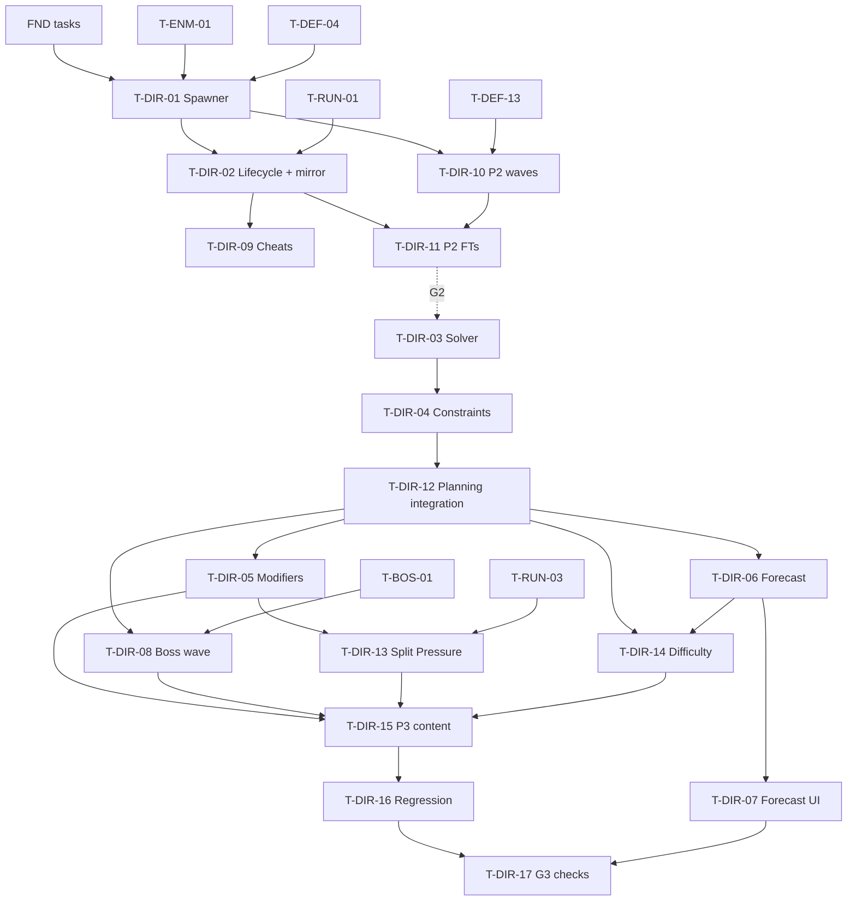

# Encounter Director (DIR): Tasks

| | |
|---|---|
| Spec | [spec.md](spec.md) |
| Technical plan | [technical-plan.md](technical-plan.md) |
| Phases | P2 (authored spawner, A-08) → P3 (Director, constraints, modifiers, forecast, boss wave, difficulty hooks) |
| Gates | Feeds G2 (`T-DEF-20` uses `T-DIR-10`) and G3 (`T-DIR-17`, RUN `T-RUN-18`) |

## 1. Summary

P2 builds the data type, spawn points and a spawner that executes an `FWavePlan` under the concurrent cap, plus lifecycle events RUN needs, cheats, the 3 authored P2 waves and their Functional Tests. P3 adds the pure solver and constraints (Automation Specs with fixed seeds first), wires planning into `PrepareWave`, then modifiers, forecast, UI, boss wave, mid-run event, difficulty hooks, content and the regression sweep that proves "the Director never generates an impossible wave".

## 2. Task Overview

| ID | Task | Type | Phase | Priority | Dependencies | Status |
|---|---|---|---|---|---|---|
| T-DIR-01 | `UWaveDefinition` + lane spawn points + authored wave spawner | GAMEPLAY | P2 | High | T-FND-04, T-FND-07, T-ENM-01, T-DEF-04 | Todo |
| T-DIR-02 | Wave lifecycle events + `ARunGameState` mirror + stall guard | GAMEPLAY | P2 | High | T-DIR-01, T-RUN-01 | Todo |
| T-DIR-09 | Encounter cheats + debug overlay | TOOLS | P2 | Medium | T-DIR-02, T-FND-09 | Todo |
| T-DIR-10 | Author the 3 P2 waves + place spawn points | DESIGN | P2 | High | T-DIR-01, T-DEF-13, T-ENM-05, T-ENM-06, T-ENM-10 | Todo |
| T-DIR-11 | P2 Functional Tests: lanes, cap, cleared, stop, stall | QA | P2 | High | T-DIR-02, T-DIR-10, T-FND-10 | Todo |
| T-DIR-03 | Threat budget solver, pure logic + Automation Spec | GAMEPLAY | P3 | High | T-DIR-01 | Todo |
| T-DIR-04 | Director constraints: lanes, schedule, elite cap, hard-counter rule, validator, fallback | GAMEPLAY | P3 | High | T-DIR-03, T-DEF-05, T-SQD-01 | Todo |
| T-DIR-12 | Planning integration in `PrepareWave`: seed, input builder, spawn variation, warning guard | GAMEPLAY | P3 | High | T-DIR-04, T-DIR-02 | Todo |
| T-DIR-05 | Modifiers (`UEncounterModifierDefinition`, Armored Legion, modifier pool) | GAMEPLAY | P3 | High | T-DIR-12 | Todo |
| T-DIR-06 | Threat Forecast generation into `ARunGameState` | GAMEPLAY | P3 | High | T-DIR-12, T-RUN-01 | Todo |
| T-DIR-07 | Forecast UI (panel + HUD strip) | UI | P3 | High | T-DIR-06, T-UXF-02 | Todo |
| T-DIR-08 | Curated boss wave hook + scripted spawns | GAMEPLAY | P3 | High | T-DIR-12, T-BOS-01 | Todo |
| T-DIR-13 | Mid-run pressure event: Split Pressure modifier (Q-17 default) | GAMEPLAY | P3 | High | T-DIR-05, T-RUN-03 | Todo |
| T-DIR-14 | Difficulty hooks (`UEncounterDifficultyDefinition`, §25) | GAMEPLAY | P3 | Medium | T-DIR-12, T-DIR-06 | Todo |
| T-DIR-15 | P3 wave content: 5 waves, boss wave, modifiers, difficulties | DESIGN | P3 | High | T-DIR-05, T-DIR-08, T-DIR-13, T-DIR-14 | Todo |
| T-DIR-16 | Director regression: fixed-seed sweep + full-run Functional Test | QA | P3 | High | T-DIR-15, T-DIR-11 | Todo |
| T-DIR-17 | G3 Director/Forecast checks + forecast readability playtest notes | QA | P3 | High | T-DIR-16, T-DIR-07, T-RUN-12, T-RUN-14 | Todo |

## 3. Detailed Tasks

## P2

### T-DIR-01 — `UWaveDefinition` + lane spawn points + authored wave spawner
**Type** GAMEPLAY · **Phase** P2

**Objective** Authored waves spawn at lane spawn points through a queue that never exceeds the concurrent enemy cap.

**Related Requirements** R-DIR-01, R-DIR-02, R-DIR-03, R-DIR-12; AC-DIR-01, AC-DIR-02

**Dependencies** T-FND-04, T-FND-07, T-ENM-01, T-DEF-04

**Implementation Notes**
- [ ] `UWaveDefinition` (Primary Asset Type `WaveDefinition`) with `Mode` (Authored only implemented now; Budget/Boss fields declared) and `AuthoredGroups` [archetype, count, lane tag, start time, interval]. `IsDataValid`: archetype set, count > 0, lane tag valid.
- [ ] `AEnemySpawnPoint`: `LaneTag`, `SpawnRadius`, `Weight`, `bBossEntry`; editor billboard.
- [ ] `EncounterTypes.h`: `FWaveSpawnGroup` (archetype `FPrimaryAssetId`, count, lane, pulse time, bElite), `FWavePlan`, `EWaveState`.
- [ ] `UEncounterDirectorComponent` (Tick off): `PrepareWave(Wave, WaveNumber, ModifierTags)` (authored → plan), `StartPreparedWave()`, `StartWave(...)` (prepare + start, for P2 RUN), `StopAndClear()`.
- [ ] Spawn timer (0.1 s): due entries, `MaxSpawnsPerTick` (4), skip while `Alive ≥ MaxConcurrentEnemies`; spawn point weighted by seeded `FRandomStream`; point in radius projected to navmesh (verify `ProjectPointToNavigation`); `SpawnActorDeferred(EnemyClass)` → `InitFromSpawn(Archetype, FEnemySpawnParams{Route = SelectRoute(Lane, Rng)})` → `FinishSpawning`; bind `OnEnemyRemoved`.
- [ ] `TrySpawnEnemy(Archetype, Lane, Params)` returns null when the cap is full; `RequestScriptedSpawn(Group)` queues (used by BOS later).
- [ ] Add `UGameTuningSettings` Encounter fields: `MaxConcurrentEnemies` (placeholder 40, set by `T-DEF-12`), `MaxSpawnsPerTick`, `SpawnTickSeconds`.
- [ ] Spawn failure: retry next tick; after 3 failures use another spawn point of the lane.

**Expected Files / Assets** `Source/<Game>/Encounter/WaveDefinition.*`, `EnemySpawnPoint.*`, `EncounterDirectorComponent.*`, `EncounterTypes.h`; `Tests/EncounterSpawner.spec.cpp`; `DA_Wave_Test_Small`

**Test Case** Test map, 2 spawn points on `Lane.Left`, `DA_Wave_Test_Small` (12 Swarm, interval 0.5 s), cap set to 5 → never more than 5 alive; kill them one by one → remaining spawn as slots free.

**Acceptance Criteria**
- [ ] Spec `<Game>.Encounter.Spawner`: authored def converts to the expected plan; queue ordering by due time.
- [ ] Alive count never exceeds the cap (log check).
- [ ] `TrySpawnEnemy` returns null at cap.

**Verification** Automation Spec; PIE in `Maps/Test/FT_Encounter_Spawner`.

---

### T-DIR-02 — Wave lifecycle events + `ARunGameState` mirror + stall guard
**Type** GAMEPLAY · **Phase** P2

**Objective** RUN, HUD and other features can observe wave progress; a wave can always finish.

**Related Requirements** R-DIR-04, R-DIR-05, R-DIR-06, R-DIR-07; AC-DIR-03, AC-DIR-04, AC-DIR-05, AC-DIR-06

**Dependencies** T-DIR-01, T-RUN-01

**Implementation Notes**
- [ ] Delegates on the component: `OnWavePrepared(N)`, `OnWaveStarted(N)`, `OnWaveCleared(N)`, `OnEnemySpawned(Enemy, Lane)`, `OnWaveEnemyRemoved(Enemy, Archetype, Lane, Cause)` (cause from ENM `EEnemyRemovedReason`: Killed / Despawned / OutOfWorld; RUN uses Killed for rewards), `OnAliveCountChanged`.
- [ ] Cleared check after each removal and when the queue empties: queue empty and alive = 0 → state Cleared, `OnWaveCleared` once (answers RUN NEW-RUN-1).
- [ ] `FWaveStateView` (wave number, state, alive total, alive per lane) + `ARunGameState::SetWaveState` / `OnWaveStateChanged` (add to RUN's class; null-safe when the GameState is not a run GameState).
- [ ] Weak-pointer sweep each spawn tick for enemies destroyed without the removal event.
- [ ] Stall guard: if `Active`, alive ≤ `StallMaxAlive` (3) and no removal for `WaveStallTimeoutSeconds` (90 s) → `UE_LOG` Error + Visual Logger entry per straggler (name, location, brain state), destroy them, wave clears.
- [ ] `StopAndClear`: stop timers, clear queue, destroy alive enemies, state Stopped, no events after.

**Expected Files / Assets** `EncounterDirectorComponent.*`, `EncounterTypes.h`, `Run/RunGameState.*` (slot only)

**Test Case** Wave of 3 → kill 2 → `OnWaveCleared` not fired → kill the last → fired once within 1 s; a second wave with one invulnerable enemy (cheat) → after 90 s error + cleared.

**Acceptance Criteria**
- [ ] `OnWaveCleared` never fires before the queue is empty.
- [ ] Every removal fires `OnWaveEnemyRemoved` exactly once with the right cause.
- [ ] `StopAndClear` leaves 0 enemies and no pending spawns.

**Verification** Functional Tests in `T-DIR-11`; PIE log.

---

### T-DIR-09 — Encounter cheats + debug overlay
**Type** TOOLS · **Phase** P2

**Objective** Developers can start, clear and reproduce waves and see the spawner state at a glance.

**Related Requirements** AC-DIR-07; D-16

**Dependencies** T-DIR-02, T-FND-09

**Implementation Notes**
- [ ] `UGameCheatManager`: `Encounter.StartWave <WaveAsset> [N]`, `Encounter.ClearWave` (kills alive, empties queue), `Encounter.Seed <int>` (sets run seed for the next prepare), `Encounter.Cap <int>` (temporary cap override, dev builds only).
- [ ] CVar `game.debug.Encounter 1`: on-screen text with state, seed, cap, queue length, alive per lane, current plan groups (archetype × count × lane).
- [ ] Visual Logger category `LogEncounter` for spawns, holds by cap, removals.

**Expected Files / Assets** `Core/GameCheatManager.cpp` additions, `EncounterDirectorComponent.cpp`

**Test Case** `Encounter.StartWave DA_Wave_P2_01` in PIE → overlay shows the plan and counts; `Encounter.ClearWave` → cleared event fires.

**Acceptance Criteria**
- [ ] All cheats work in PIE and in a Development build; overlay has no per-frame allocations beyond text.

**Verification** PIE manual steps above.

---

### T-DIR-10 — Author the 3 P2 waves + place spawn points
**Type** DESIGN · **Phase** P2

**Objective** Three authored waves that exercise the DEF/G2 questions: blocking, structure breaking, split lanes.

**Related Requirements** R-DIR-01, R-DIR-02, R-DIR-22; AC-DIR-01; §33 (02:00 Swarm, 06:00 Armored, 17:00 Structure Collapse)

**Dependencies** T-DIR-01, T-DEF-13, T-ENM-05, T-ENM-06, T-ENM-10

**Implementation Notes**
- [ ] Place 2 `AEnemySpawnPoint` per lane and one `bBossEntry` point (unused in P2) at the `T-DEF-13` markers in `L_SiegeSite_Proto`.
- [ ] `DA_Wave_P2_01`: Swarm only, Lane Left (tests Barricade + Bombard at the choke).
- [ ] `DA_Wave_P2_02`: Armored + Swarm, both lanes, Armored on Lane Right (tests Ballista + Heavy/Armor Broken).
- [ ] `DA_Wave_P2_03`: Giant/Siege + Swarm + Armored, both lanes (tests structure breaking and collapse).
- [ ] Counts are placeholders sized under the current cap; note intent per wave in the asset description.
- [ ] Hand the asset list to RUN for `DA_Run_P2`.

**Expected Files / Assets** `Content/<Game>/Encounter/DA_Wave_P2_01..03`; spawn points in `L_SiegeSite_Proto`

**Test Case** Play `DA_Run_P2` → each wave spawns on the intended lanes; wave 3 Giant reaches and attacks a blocking structure.

**Acceptance Criteria**
- [ ] All 3 assets pass `IsDataValid`.
- [ ] Each wave completes in a solo dev playthrough with placeholder towers.

**Verification** PIE playthrough; G2 sessions (`T-DEF-20`).

---

### T-DIR-11 — P2 Functional Tests: lanes, cap, cleared, stop, stall
**Type** QA · **Phase** P2

**Objective** Automated proof of the P2 spawner contract.

**Related Requirements** R-DIR-02, R-DIR-03, R-DIR-05, R-DIR-07; AC-DIR-01..06

**Dependencies** T-DIR-02, T-DIR-10, T-FND-10

**Implementation Notes**
- [ ] `FT_Encounter_Lanes`: each group spawns only at its lane's spawn points.
- [ ] `FT_Encounter_Cap`: cap 10, 30-enemy wave, auto-kill helper → alive sampled on every spawn ≤ 10; all 30 spawn eventually.
- [ ] `FT_Encounter_Cleared`: cleared fires once, after the last removal, never early.
- [ ] `FT_Encounter_Stop`: `StopAndClear` mid-spawn → 0 alive, no further spawns for 5 s.
- [ ] `FT_Encounter_Stall`: invulnerable straggler with timeout set to 3 s → error logged (test expects it) and wave clears.
- [ ] `FT_Encounter_RemovalCauses`: kill one, push one out of world → causes Killed and OutOfWorld.

**Expected Files / Assets** `Maps/Test/FT_Encounter_*.umap`

**Test Case** All FTs pass from the command line runner.

**Acceptance Criteria**
- [ ] 6 FTs pass 5 runs in a row.

**Verification** `-ExecCmds="Automation RunTests <Game>.FT.Encounter; Quit"`.

---

## P3

### T-DIR-03 — Threat budget solver, pure logic + Automation Spec
**Type** GAMEPLAY · **Phase** P3

**Objective** A deterministic function that turns a budget, archetype costs and caps into a composition.

**Related Requirements** R-DIR-10, R-DIR-11, R-DIR-13, R-DIR-16 (share rule), R-DIR-17 (per-wave elite cap), R-DIR-21; AC-DIR-10, AC-DIR-12

**Dependencies** T-DIR-01

**Implementation Notes**
- [ ] Plain structs `FDirectorSolveInput`, `FSolverArchetype` (id, tags, cost, weight, min, max, elite, counter tags), `FSolverRules`; no UObjects.
- [ ] `EncounterSolver::SolveComposition(input) → counts` per technical plan §6.2: minimums first, then weighted fill with seeded `FRandomStream`, type caps, budget, counter share, elite cap.
- [ ] Return spent and unspent budget; unspent > 10% flagged as a warning (not an error).
- [ ] Spec `<Game>.Encounter.Solver` with fixed seeds 1..50: same seed → identical counts; never above budget; never above type caps; minimums honored when affordable; uncountered archetype share ≤ cap; uncountered elites = 0; an archetype with cap 0 never appears.
- [ ] Timing log: 1000 solves < 50 ms total in the Spec.

**Expected Files / Assets** `Source/<Game>/Encounter/EncounterSolver.h/.cpp`; `Tests/EncounterSolver.spec.cpp`

**Test Case** Budget 100, Swarm 2 (max 30), Armored 8 (max 5), Siege 25 (max 1, elite), loadout without Ballista/ArmorBroken → Armored threat ≤ 25 and no Siege; with full loadout → mixes of all three, each ≤ cap, spent ≤ 100.

**Acceptance Criteria**
- [ ] Spec passes; all seeds printed on failure.

**Verification** Automation Spec from the command line.

---

### T-DIR-04 — Director constraints: lanes, schedule, elite cap, hard-counter rule, validator, fallback
**Type** GAMEPLAY · **Phase** P3

**Objective** Every plan respects all §8.2 constraints or is replaced by an authored safe wave.

**Related Requirements** R-DIR-12, R-DIR-13, R-DIR-14, R-DIR-16, R-DIR-17, R-DIR-20; AC-DIR-11, AC-DIR-13, AC-DIR-14

**Dependencies** T-DIR-03, T-DEF-05, T-SQD-01

**Implementation Notes**
- [ ] `AssignLanes` and `Schedule` per technical plan §6.3 (min lanes, max lane share, pulses ≤ min(PulseMaxSize, cap), separate elite pulses, jitter, simultaneous first pulses flag).
- [ ] `Validate(plan, input) → errors` per §6.4; each error type has a Spec case.
- [ ] `PlanBudgetWave`: up to 8 seeds, then `FallbackGroups` (+ `bIsFallback`, error with seed).
- [ ] Runtime elite cap in the spawner: hold elite spawns while `AliveElites ≥ MaxConcurrentElites`.
- [ ] Loadout snapshot builder (§6.7): DEF structure type tags, SQD squad tags, difficulty base tags.
- [ ] Add `CounterTags` (any-of) to ENM's `UEnemyArchetypeDefinition` after agreeing with ENM (NEW-DIR-02); fill prototype values (Swarm: `Structure.Type.Bombard`, `Unit.Squad.Infantry`; Armored and Siege: `Structure.Type.Ballista`, `State.Combat.ArmorBroken`).
- [ ] `UWaveDefinition::IsDataValid`: Budget mode requires `FallbackGroups`; costs > 0; lanes valid.

**Expected Files / Assets** `EncounterSolver.*`, `EncounterDirectorComponent.*`, `WaveDefinition.cpp`, ENM `EnemyArchetypeDefinition.h` (one field); `Tests/EncounterConstraints.spec.cpp`

**Test Case** Spec: MinLanes 2 → both lanes used, each share > 0; MaxLaneShare 0.6 → no lane above 0.6; elite pulses never contain > MaxConcurrentElites elites; a forced-invalid input (all archetypes cap 0) → fallback plan returned and flagged.

**Acceptance Criteria**
- [ ] Spec `<Game>.Encounter.Constraints` passes, one case per validator error.
- [ ] Fallback path covered by a test and logs an error with the seed.

**Verification** Automation Spec; PIE with `game.debug.Encounter`.

---

### T-DIR-12 — Planning integration in `PrepareWave`: seed, input builder, spawn variation, warning guard
**Type** GAMEPLAY · **Phase** P3

**Objective** `PrepareWave` plans Budget waves through the solver and the spawner executes them with seeded variation, never before the warning time.

**Related Requirements** R-DIR-10, R-DIR-15, R-DIR-21, R-DIR-33; AC-DIR-17, AC-DIR-19

**Dependencies** T-DIR-04, T-DIR-02

**Implementation Notes**
- [ ] Run seed: random at first `PrepareWave` unless set by `Encounter.Seed`; wave seed = `HashCombine(RunSeed, WaveNumber)`; log both.
- [ ] Input builder: wave data + difficulty (null-safe default) + modifiers (stub until `T-DIR-05`) + loadout snapshot taken now.
- [ ] Mode switch: Authored → convert; Budget → `PlanBudgetWave`; Boss → `T-DIR-08`.
- [ ] Spawn variation inside authored bounds: spawn point choice, radius, pulse jitter from the wave seed (R-DIR-21).
- [ ] Store `ForecastPublishTime` at prepare; `StartPreparedWave` before `MinWarningSeconds` (setting, default 20 s) → warning + first spawn delayed until met. `GetMinWarningSeconds()` for RUN `T-RUN-12`.
- [ ] Plan is frozen after prepare: building/structure changes do not re-plan.

**Expected Files / Assets** `EncounterDirectorComponent.*`

**Test Case** `Encounter.Seed 42` → prepare W2 twice in two PIE sessions → identical plan logs; call `StartPreparedWave` 5 s after prepare with warning 20 s → first spawn at ≥ 20 s.

**Acceptance Criteria**
- [ ] Same seed + same loadout → same plan across sessions.
- [ ] No first spawn earlier than the warning time in any wave.

**Verification** PIE logs; telemetry check in `T-DIR-17`.

---

### T-DIR-05 — Modifiers (`UEncounterModifierDefinition`, Armored Legion, modifier pool)
**Type** GAMEPLAY · **Phase** P3

**Objective** Modifiers change costs and rules, and the forecast can name them.

**Related Requirements** R-DIR-19, R-DIR-21; AC-DIR-15

**Dependencies** T-DIR-12

**Implementation Notes**
- [ ] `UEncounterModifierDefinition`: tag (`Modifier.Encounter.*`), name, forecast text, icon, budget multiplier, archetype rules (tag match → cost ×, cap ×, weight ×), lane override (min lanes, min lane share, simultaneous first pulses). `IsDataValid`: multipliers > 0.
- [ ] Component `KnownModifiers` array; resolve RUN tags; unknown tag → log + ignore.
- [ ] Wave `ModifierPool` + `ModifierChance`: one seeded pick added to RUN tags.
- [ ] Apply in the input builder (§6.6); plan stores active modifier tags.
- [ ] `DA_Modifier_ArmoredLegion` (Armored cost × 0.6, cap × 1.5, weight × 2).
- [ ] Spec: over seeds 1..200, mean Armored threat share with Armored Legion > without; plans with the modifier still pass `Validate`.

**Expected Files / Assets** `Encounter/EncounterModifierDefinition.*`, `DA_Modifier_ArmoredLegion`; `Tests/EncounterSolver.spec.cpp` additions

**Test Case** Prepare W2 with `Modifier.Encounter.ArmoredLegion` → plan log shows more Armored than the same seed without it.

**Acceptance Criteria**
- [ ] Statistical Spec passes; modifier tags present in the plan.

**Verification** Automation Spec; PIE log.

---

### T-DIR-06 — Threat Forecast generation into `ARunGameState`
**Type** GAMEPLAY · **Phase** P3

**Objective** A truthful forecast built from the plan is published once per wave for UI and RUN.

**Related Requirements** R-DIR-30, R-DIR-31, R-DIR-32, R-DIR-33; AC-DIR-18, AC-DIR-19

**Dependencies** T-DIR-12, T-RUN-01

**Implementation Notes**
- [ ] `FThreatForecast` + entries + `EThreatLevel` (None, Low, Medium, High, Unknown) in `EncounterTypes.h`.
- [ ] `ThreatForecastBuilder::Build(plan, displayTypes, hiddenSlots, thresholds, rng)` per technical plan §6.5; display types from `DT_ForecastTypeDisplay` row tags.
- [ ] Always visible: lanes, modifiers, elite warning; at least one non-None type visible.
- [ ] `ARunGameState::SetForecast` + `OnForecastChanged` (slot in RUN's class); called once in `PrepareWave`.
- [ ] Settings: `ForecastLowShare` 0.2, `ForecastMediumShare` 0.45.
- [ ] Spec `<Game>.Encounter.Forecast`: thresholds, lane levels, 0/1/2 hidden slots, never all hidden, modifiers present, boss hint copied.

**Expected Files / Assets** `Encounter/ThreatForecastBuilder.h/.cpp`, `EncounterTypes.h`, `Run/RunGameState.*` (slot); `Tests/ThreatForecast.spec.cpp`

**Test Case** Plan: Swarm 60 threat, Armored 40, lanes Left 100% → forecast Swarm High, Armored Medium, Siege None, Lane Left High, Right None.

**Acceptance Criteria**
- [ ] Spec passes.
- [ ] Forecast identical at publication and at wave start (log compare).

**Verification** Automation Spec; PIE log.

---

### T-DIR-07 — Forecast UI (panel + HUD strip)
**Type** UI · **Phase** P3

**Objective** The player reads the next wave's threat, lanes and modifiers in 1–2 s.

**Related Requirements** R-DIR-31, R-DIR-32, R-DIR-34; AC-DIR-18, AC-DIR-21

**Dependencies** T-DIR-06, T-UXF-02

**Implementation Notes**
- [ ] `DT_ForecastTypeDisplay` rows: type tag, icon, display name (Swarm, Armored, Siege).
- [ ] `WBP_ThreatForecast`: one row per type (icon + 3-step level bar or "?"), lane arrows with level, elite warning icon, modifier name + one-line text, boss hint line. Opens on `OnForecastChanged` during Prep/Intermission/PerkChoice (RUN phase), collapses to the strip at wave start.
- [ ] `WBP_ForecastCompact` on `WBP_GameHUD`: icons + levels + lane arrows only.
- [ ] Bind to delegates only; no Tick bindings.
- [ ] Feedback `Feedback.Encounter.ForecastUpdated` (soft cue) via `UFeedbackSubsystem`.
- [ ] Unknown slot uses a "?" icon visually different from "None".

**Expected Files / Assets** `Content/<Game>/UI/WBP_ThreatForecast`, `WBP_ForecastCompact`, `DT_ForecastTypeDisplay`; `DT_Feedback` row

**Test Case** `Encounter.Seed 7`, prepare W4 with Split Pressure → panel shows both lane arrows, modifier text, levels; with `DA_Difficulty_Hard` one "?" row.

**Acceptance Criteria**
- [ ] Panel and strip update on every prepare; no stale content after StopAndClear.
- [ ] Readable at 1080p; colors not the only cue for level (bar length + label).

**Verification** PIE; readability check in `T-DIR-17`.

---

### T-DIR-08 — Curated boss wave hook + scripted spawns
**Type** GAMEPLAY · **Phase** P3

**Objective** The boss wave is authored, spawns the boss at the boss entry and routes boss summons through the Director caps.

**Related Requirements** R-DIR-18, R-DIR-30; AC-DIR-20

**Dependencies** T-DIR-12, T-BOS-01

**Implementation Notes**
- [ ] Boss mode in `UWaveDefinition`: `BossDefinition` (BOS), `BossSpawnTag`, `BossForecastHint`, authored adds.
- [ ] `PrepareWave` (Boss): plan = boss entry + authored adds; forecast with `bBossWave` + hint.
- [ ] Start: boss spawns first at the `bBossEntry` point, bypassing the cap (reserved slot); `OnBossSpawned(Boss)`.
- [ ] BOS summons use `TrySpawnEnemy` (null at cap) or `RequestScriptedSpawn` (queued); both count toward alive and caps.
- [ ] Boss removed with cause other than Killed → `OnBossRemovedUnexpectedly` for BOS reset (`T-BOS-05`); wave stays Active.
- [ ] Boss wave is not cleared by the Director while the boss lives; RUN ends the step on BOS "boss defeated".

**Expected Files / Assets** `WaveDefinition.*`, `EncounterDirectorComponent.*`; `Maps/Test/FT_Encounter_Boss`

**Test Case** FT: boss wave with cap 5 and a test boss that requests 10 summons → boss present, alive never > 5 + boss, summons spawn as slots free.

**Acceptance Criteria**
- [ ] Boss always spawns even at cap; summons never exceed cap.
- [ ] Forecast for the boss wave shows the hint.

**Verification** Functional Test `FT_Encounter_Boss`; integration in BOS `T-BOS-05`.

---

### T-DIR-13 — Mid-run pressure event: Split Pressure modifier (Q-17 default)
**Type** GAMEPLAY · **Phase** P3

**Objective** The PressureEvent step before W4 makes W4 hit both lanes at once (§33 13:00 Split Pressure).

**Related Requirements** R-DIR-23, R-DIR-14; AC-DIR-16

**Dependencies** T-DIR-05, T-RUN-03

**Implementation Notes**
- [ ] `DA_Modifier_SplitPressure` (`Modifier.Encounter.SplitPressure`): MinLanes 2, MinLaneShare 0.35, simultaneous first pulses; forecast text "Both lanes attack together".
- [ ] Validator check for `MinLaneShare` when a modifier sets it (if not already in `T-DIR-04`).
- [ ] Confirm with RUN that `DA_Run_P3`'s PressureEvent step carries this tag and that it reaches W4 only.
- [ ] Spec: 200 seeds with the modifier → every plan uses 2 lanes, each ≥ 0.35 share, first pulses at t = 0 on both lanes.

**Expected Files / Assets** `DA_Modifier_SplitPressure`; Spec additions

**Test Case** Short P3 run (`DA_Run_Test_Short_P3`) → W4 forecast lists Split Pressure; first enemies appear on both lanes within 5 s.

**Acceptance Criteria**
- [ ] Spec passes; W3 and W5 plans are unaffected by the modifier.

**Verification** Automation Spec; PIE short run.

---

### T-DIR-14 — Difficulty hooks (`UEncounterDifficultyDefinition`, §25)
**Type** GAMEPLAY · **Phase** P3

**Objective** Difficulty changes composition, lanes, elite timing, forecast precision and timing, not HP.

**Related Requirements** R-DIR-32, R-DIR-40, R-DIR-41; AC-DIR-18, AC-DIR-22

**Dependencies** T-DIR-12, T-DIR-06

**Implementation Notes**
- [ ] `UEncounterDifficultyDefinition` with fields from spec §13; `Difficulty` reference on the Director component (set on `BP_RunGameMode`).
- [ ] Apply in the input builder: budget multiplier, `EliteFirstWave`, `MaxElitesPerWave`, `MaxConcurrentElites`, `ExtraMinLanes`, `PulseGapMultiplier`, `MaxShareWithoutCounter`, `BaseLoadoutTags`; in the forecast: `ForecastHiddenTypeSlots`.
- [ ] `IsDataValid`: Health/Damage multipliers ≤ `MaxStatScale` (1.25); fields are not applied to enemies in prototype (NEW-DIR-05).
- [ ] `DA_Difficulty_Standard` (all neutral, hidden slots 0) and `DA_Difficulty_Hard` (test values: budget × 1.15, elites one wave earlier, +1 min lane from W3, 1 hidden slot).
- [ ] Spec: Hard vs Standard on seeds 1..100 → more lanes used on average, elites appear earlier, exactly one Unknown entry, plans still valid.

**Expected Files / Assets** `Encounter/EncounterDifficultyDefinition.*`, `DA_Difficulty_Standard`, `DA_Difficulty_Hard`; Spec additions

**Test Case** Set Health multiplier 1.5 on a copy of Hard → data validation error.

**Acceptance Criteria**
- [ ] Spec passes; validation rejects stat scale above the cap.

**Verification** Automation Spec; data validation run.

---

### T-DIR-15 — P3 wave content: 5 waves, boss wave, modifiers, difficulties
**Type** DESIGN · **Phase** P3

**Objective** Wave data that follows the escalating-tension curve of §2 and §33 within the ~25-minute run.

**Related Requirements** R-DIR-11, R-DIR-22; §33

**Dependencies** T-DIR-05, T-DIR-08, T-DIR-13, T-DIR-14

**Implementation Notes**
- [ ] `DA_Wave_P3_01`: Budget, Swarm-heavy, 1 lane, no elites (02:00 Swarm).
- [ ] `DA_Wave_P3_02`: Armored introduced, 1–2 lanes, pool may roll Armored Legion (06:00 Armored).
- [ ] `DA_Wave_P3_03`: mixed composition, 2 lanes allowed, first Siege possible.
- [ ] `DA_Wave_P3_04`: 2 lanes (Split Pressure arrives from RUN), higher budget (13:00).
- [ ] `DA_Wave_P3_05`: Siege-heavy to erode defenses (17:00 Structure Collapse).
- [ ] `DA_Wave_P3_Boss`: Boss mode with the BOS definition and a small authored add set (21:00).
- [ ] Every Budget wave has `FallbackGroups`; budgets are placeholders to tune with RUN pacing (`T-RUN-17`).
- [ ] Note intent per wave in the asset description.

**Expected Files / Assets** `Content/<Game>/Encounter/DA_Wave_P3_01..05`, `DA_Wave_P3_Boss`

**Test Case** Seed sweep (`T-DIR-16`) passes on this content; one full dev run reaches the boss.

**Acceptance Criteria**
- [ ] All assets pass `IsDataValid`; curve matches the notes above.

**Verification** Sweep Spec; PIE run.

---

### T-DIR-16 — Director regression: fixed-seed sweep + full-run Functional Test
**Type** QA · **Phase** P3

**Objective** Prove the §36 Full Run DoD item "Director never generates an impossible wave due to a logic bug" on real content.

**Related Requirements** R-DIR-20, R-DIR-12..17; AC-DIR-11, AC-DIR-13

**Dependencies** T-DIR-15, T-DIR-11

**Implementation Notes**
- [ ] Spec `<Game>.Encounter.Sweep`: loads every P3 wave asset; seeds 1..1000 × loadouts {empty, base only, full prototype loadout} × difficulties {Standard, Hard} → `Validate` passes, plan not empty, `bIsFallback` false. Print failing (asset, seed, loadout).
- [ ] FT `FT_Encounter_FullRun`: short timings, auto-kill helper, 5 waves + boss stub → each wave cleared once; alive never > cap; elites alive never > cap; no Error log except expected ones.
- [ ] Re-run all P2 FTs (`T-DIR-11`).
- [ ] Add the sweep and FTs to the pre-gate test command.

**Expected Files / Assets** `Tests/EncounterSweep.spec.cpp`, `Maps/Test/FT_Encounter_FullRun.umap`

**Test Case** Sweep and FTs green from the command line.

**Acceptance Criteria**
- [ ] 0 failures over the full sweep; FTs pass 3 runs in a row.

**Verification** `-ExecCmds="Automation RunTests <Game>.Encounter; Automation RunTests <Game>.FT.Encounter; Quit"`.

---

### T-DIR-17 — G3 Director/Forecast checks + forecast readability playtest notes
**Type** QA · **Phase** P3

**Objective** Evidence for the G3 items "Threat Forecast works before every wave" and "Director never generates an impossible wave".

**Related Requirements** R-DIR-15, R-DIR-30, R-DIR-34; AC-DIR-17, AC-DIR-21, AC-DIR-23; master plan Section 3 G3 checklist

**Dependencies** T-DIR-16, T-DIR-07, T-RUN-12, T-RUN-14

**Implementation Notes**
- [ ] During the G3 sessions (RUN `T-RUN-18`), collect telemetry: `forecast_published`, `wave_started` (first spawn), modifiers, fallback flags per wave.
- [ ] Check every wave: first spawn − publish ≥ `MinWarningSeconds`; no fallback used; no cap exceeded.
- [ ] Readability: after opening the forecast, each tester names the main threat and its lane within 2 s (3 waves per tester).
- [ ] Ask testers whether any loss felt like hidden information (§7.1); log answers.
- [ ] Notes in `ai/game/playtests/G3-<date>-director.md`; KEEP / CHANGE / DELETE for: forecast levels, unknown slots, Split Pressure, Armored Legion.

**Expected Files / Assets** `ai/game/playtests/G3-<date>-director.md`

**Test Case** Full G3 session data reviewed against the checks above.

**Acceptance Criteria**
- [ ] Both G3 Director/Forecast items marked pass/fail with evidence.
- [ ] CHANGE items turned into new tasks.

**Verification** Review with the G3 gate decision in `T-RUN-18`.

---

## 4. Dependency Graph

Parallel: `T-DIR-03/04` (pure logic) can start before G2 closes if capacity allows, since they touch no P2 runtime code. `T-DIR-07` UI in parallel with `T-DIR-08`.

## 5. Integration / Regression Checklist

- [ ] RUN: `PrepareWave` / `StartPreparedWave` / `StopAndClear` / `GetMinWarningSeconds` / `OnWaveCleared` / `OnWaveEnemyRemoved` match RUN `T-RUN-08`, `T-RUN-12`.
- [ ] ENM: spawn via `SpawnActorDeferred` → `InitFromSpawn` → `FinishSpawning`; `OnEnemyRemoved` bound per enemy.
- [ ] DEF: cap value from `T-DEF-12` in config; `SelectRoute` used for every spawn; lane tags agree with `ALaneRoute`.
- [ ] BOS: summons only through `TrySpawnEnemy` / `RequestScriptedSpawn`; reset hook bound.
- [ ] UXF: lane danger reads `FWaveStateView`; forecast feedback row exists.
- [ ] Specs `<Game>.Encounter.*` and FTs `<Game>.FT.Encounter.*` green before every gate.

## 6. Final Definition of Done

- Implemented + integrated + verified in PIE and in `L_SiegeSite_Proto` (master plan Section 8).
- All AC-DIR for the phase pass; Specs with fixed seeds and Functional Tests green from the command line.
- Every [TUNABLE] value in a definition asset or `UGameTuningSettings`.
- No new warnings/errors in the log during gate sessions (stall guard errors count as bugs).
- G2 (P2 waves used by `T-DEF-20`) and G3 (`T-DIR-17`) evidence written.
