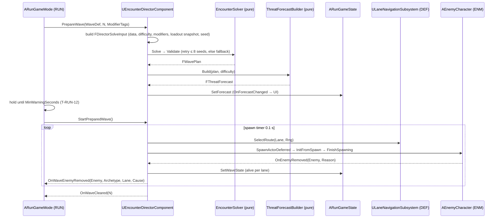
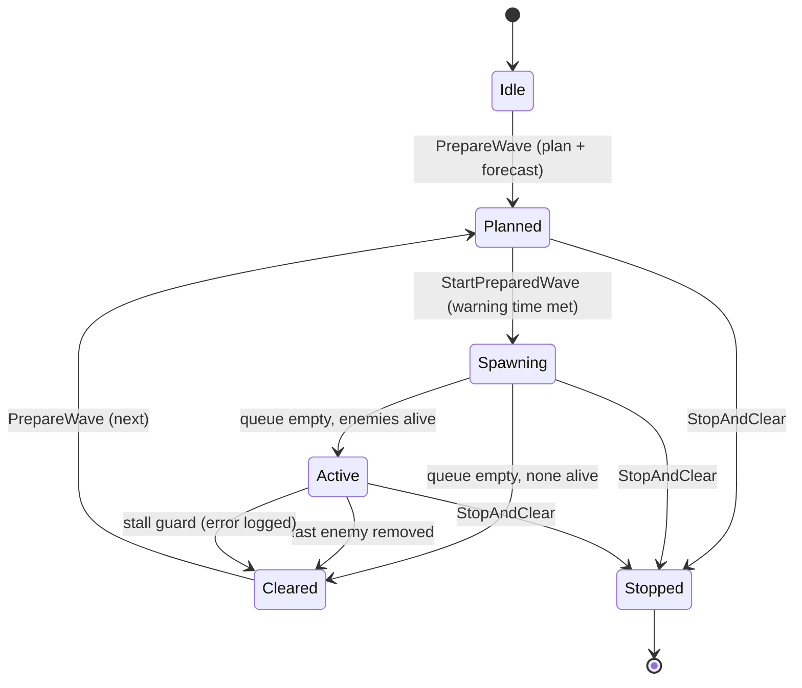

# Encounter Director (DIR): Technical Plan

| | |
|---|---|
| Spec | [spec.md](spec.md) |
| Decisions applied | D-03, D-06, D-07, D-10, D-14, D-15, D-16 |
| Status | Draft v1. All paths and classes are proposals; no UE project exists yet |

## 1. Technical Overview

One `UEncounterDirectorComponent` on `ARunGameMode` owns Wave State (D-07). It has two halves:

1. **Spawner** (P2): executes an `FWavePlan` (list of spawn groups with lane and pulse time) through a timer-driven queue that never exceeds the concurrent cap, spawns enemies at lane spawn points, tracks alive enemies per lane, and reports wave lifecycle.
2. **Planner** (P3): builds the `FWavePlan` for a budget wave with pure functions: `EncounterSolver::Solve` (composition, lanes, schedule) → `EncounterSolver::Validate` → retry/fallback, then `ThreatForecastBuilder::Build` writes a truthful `FThreatForecast` into `ARunGameState`.

In P2 an authored `UWaveDefinition` converts straight into an `FWavePlan`, so P3 adds planning without touching the spawner. Pure logic takes plain structs, never assets or actors, so Automation Specs run it with fixed seeds and synthetic data (D-16).

RUN drives the calls (prepare → forecast → hold for warning time → start → cleared). The Director never advances the run itself.

## 2. Existing System Impact

| System | Impact |
|---|---|
| Run (RUN) | Hosts the component on `ARunGameMode`; calls `PrepareWave / StartPreparedWave / StopAndClear`; binds `OnWaveCleared`, `OnWaveEnemyRemoved`; reads `GetMinWarningSeconds()`. DIR adds `FWaveStateView` and `FThreatForecast` slots + delegates to `ARunGameState` |
| Enemies (ENM) | Spawner calls `SpawnActorDeferred(Archetype->EnemyClass)` → `InitFromSpawn(Archetype, FEnemySpawnParams)` → `FinishSpawning`, binds `OnEnemyRemoved(Enemy, Reason)`. Reads `ThreatCost`, `Unit.Enemy.*` tags incl. `Unit.Enemy.Elite`; adds `CounterTags` field (NEW-DIR-02) |
| Lanes (DEF) | `Lane.*` tags on spawn points; `ULaneNavigationSubsystem::SelectRoute(Lane, Rng)` gives the route handle for `FEnemySpawnParams`; route validity; structure type tags for the loadout snapshot; `MaxConcurrentEnemies` from `T-DEF-12` |
| Squads (SQD) | Squad definition tags for the loadout snapshot (read-only) |
| Boss (BOS) | Boss wave spawns the boss class from the boss wave data; BOS summons call `TrySpawnEnemy` / `RequestScriptedSpawn`; `OnBossSpawned`, `OnBossRemovedUnexpectedly` |
| HUD (UXF) | Lane danger indicator reads alive per lane from `FWaveStateView`; Forecast widgets are DIR's (`T-DIR-07`) |
| Tactical Focus (TFM) | Lane pressure in the overlay reads `FWaveStateView` |
| Save | None. `FWavePlan` and `FThreatForecast` are plain structs with `FPrimaryAssetId` and tags (D-14) |

## 3. Proposed Architecture

### 3.1 Runtime owner and lifetime

| Object | Owner | Lifetime |
|---|---|---|
| `UEncounterDirectorComponent` | `ARunGameMode` (default subobject; any test GameMode can add it) | One run |
| `AEnemySpawnPoint` | Level | Map |
| `FWavePlan`, spawn queue, alive sets | Director component | Current wave |
| Run seed | Director component | One run |
| `FThreatForecast`, `FWaveStateView` | `ARunGameState` (written by the Director) | Until replaced |
| Spawned enemies | World; tracked by weak pointer | Until removed (`OnEnemyRemoved`) |

### 3.2 Main UE types

| Type | Kind | Purpose |
|---|---|---|
| `UWaveDefinition` | UPrimaryDataAsset | Authored / Budget / Boss wave data (spec §13) |
| `UEncounterModifierDefinition` | UPrimaryDataAsset | Cost/cap/weight/budget/lane overrides + forecast text |
| `UEncounterDifficultyDefinition` | UPrimaryDataAsset | §25 hooks, counter share, base loadout tags, stat scale (validated) |
| `AEnemySpawnPoint` | AActor (billboard, editor-only arrow) | Lane tag, radius, weight, boss entry flag |
| `UEncounterDirectorComponent` | UActorComponent, Tick off | API, planning orchestration, spawner, tracking, mirror, stall guard |
| `FWavePlan`, `FWaveSpawnGroup` | USTRUCT | Plan (archetype as `FPrimaryAssetId`, count, lane, pulse time, elite flag) |
| `FThreatForecast` (+ entry structs, `EThreatLevel`) | USTRUCT | Forecast content |
| `FWaveStateView` | USTRUCT | Wave number, `EWaveState`, alive total, alive per lane |
| `FDirectorSolveInput`, `FSolverArchetype`, `FSolverLane`, `FSolverRules` | plain C++ structs | Solver input, no UObjects |
| `EncounterSolver` | namespace (pure) | `Solve`, `Validate`, `AssignLanes`, `Schedule` |
| `ThreatForecastBuilder` | namespace (pure) | `Build` |
| `WBP_ThreatForecast`, `WBP_ForecastCompact`, `DT_ForecastTypeDisplay` | UMG / Data Table | Forecast UI; icon + name per type tag |

### 3.3 Data ownership

- Definitions (never mutated): `DA_Wave_P2_01..03`, `DA_Wave_P3_01..05`, `DA_Wave_P3_Boss`, `DA_Modifier_ArmoredLegion`, `DA_Modifier_SplitPressure`, `DA_Difficulty_Standard`, `DA_Difficulty_Hard` (test of hooks).
- Archetype data stays in ENM's `UEnemyArchetypeDefinition`; DIR reads it.
- Global tunables: `UGameTuningSettings` Encounter group (spec §13).
- Runtime: plan, queue, alive sets in the component; forecast and wave view mirrored to `ARunGameState`.
- Which difficulty applies: a `Difficulty` reference on the Director component (set on `BP_RunGameMode`); RUN may later pass it from `URunDefinition`.
- Modifier tags from RUN are resolved through a `KnownModifiers` array on the component (set on `BP_RunGameMode`); unknown tags are logged and ignored.

### 3.4 Communication flow



- Owner → owned: direct calls (GameMode → component). Component → RUN: delegates. Enemy → Director: the enemy's own `OnEnemyRemoved` delegate, bound per spawn. No global bus (D-10).
- UI observes `ARunGameState` delegates only (D-11).

### 3.5 C++ / Blueprint split

| C++ | Blueprint / data |
|---|---|
| Solver, validator, forecast builder, spawner queue, caps, tracking, stall guard, data validation | Wave/modifier/difficulty assets, `BP_RunGameMode` component settings, forecast widget layout, `DT_ForecastTypeDisplay`, feedback rows |

### 3.6 Asset references / loading

`URunDefinition` hard-references wave assets (RUN). Wave assets hard-reference archetype definitions, which hard-reference enemy classes (ENM). Fine at prototype size; `FWavePlan` stores `FPrimaryAssetId` and resolves through the Asset Manager (`UAssetManager::GetPrimaryAssetObject`, verify signature) because the assets are already loaded. Switch to async loading only if VS profiling shows a hitch at wave start.

### 3.7 AI / navigation impact

- Spawn location: random point in `SpawnRadius` projected to navmesh (`UNavigationSystemV1::ProjectPointToNavigation`, verify in UE docs); `ESpawnActorCollisionHandlingMethod::AdjustIfPossibleButDontSpawnIfColliding`; failure → retry next tick.
- Route handle from DEF `SelectRoute` with the Director's seeded `FRandomStream`, so route choice is reproducible.
- Concurrent cap protects CharacterMovement/animation cost measured in `T-DEF-12`.

### 3.8 UI impact

- `WBP_ThreatForecast` (panel, Prep/Intermission) and `WBP_ForecastCompact` (HUD strip) bound to `OnForecastChanged`.
- Per type: icon + level bar (None / Low / Medium / High / "?"); lane arrows with level; elite warning icon; modifier name + text; boss hint line.
- Debug overlay `game.debug.Encounter`: plan groups, queue, alive per lane, cap, seed.

### 3.9 Save impact

None (A-11). Run seed + wave number + modifier tags + loadout tags are enough to rebuild a plan if mid-run save ever arrives (D-14).

### 3.10 Performance risks

Spawn hitches (many Characters in one frame), solver cost (tiny), straggler stalls (correctness, not perf). See Section 9.

### 3.11 Existing systems reused

ENM spawn init + removal event, DEF lane layer and cap, RUN host and GameState, `UGameTuningSettings`, `UFeedbackSubsystem`, `FRandomStream`, Asset Manager IDs, FND cheats/CVars/test harness.

### 3.12 New types / files proposed

```text
Source/<Game>/Encounter/  WaveDefinition.*, EncounterModifierDefinition.*, EncounterDifficultyDefinition.*,
                          EnemySpawnPoint.*, EncounterDirectorComponent.*, EncounterTypes.h (plan, forecast, view),
                          EncounterSolver.h/.cpp (pure), ThreatForecastBuilder.h/.cpp (pure)
Source/<Game>/Tests/      EncounterSolver.spec.cpp, ThreatForecast.spec.cpp, EncounterSpawner.spec.cpp
Content/<Game>/Encounter/ DA_Wave_P2_01..03, DA_Wave_P3_01..05, DA_Wave_P3_Boss, DA_Modifier_*, DA_Difficulty_*
Content/<Game>/UI/        WBP_ThreatForecast, WBP_ForecastCompact, DT_ForecastTypeDisplay
Content/<Game>/Maps/Test/ FT_Encounter_*
```

### 3.13 Trade-offs

| Choice | Alternative | Why this |
|---|---|---|
| Component on GameMode | WorldSubsystem | Matches D-07; lifetime = run; RUN owns it directly |
| Greedy weighted fill + validator | Exact integer optimization | Simple, seeded, readable; validator + fallback guarantee correctness. `ponytail:` may leave budget unspent under tight caps; acceptable (weaker, not impossible) |
| Runtime cap enforcement in the spawner | Predict concurrency in the plan | Kill speed is unknowable; the spawner is the only place that can guarantee the cap |
| Forecast from the plan | Separate forecast generator | Cannot drift from what spawns (R-DIR-33) |
| Counter rule as share cap | Remove uncountered archetypes | Keeps variety; a capped share is still answerable by Hero/squads |

### 3.14 Verification

Automation Specs with fixed seeds for solver, validator, lanes, schedule, forecast; Functional Tests for spawner caps, lifecycle, stall guard, boss summons; telemetry for warning time; G3 checks.

## 4. Runtime Flow



Boss wave: `Spawning` spawns the boss at the boss entry first (reserved slot), then authored adds; it stays `Active` until RUN ends the step on BOS "boss defeated" (RUN `T-RUN-03`); the Director does not clear a boss wave on its own while the boss lives.

## 5. State / Data

| Director state | Type | Notes |
|---|---|---|
| `RunSeed` | int32 | Random at first prepare unless `Encounter.Seed` cheat/test sets it; logged |
| `CurrentPlan` | `FWavePlan` | Seed = `HashCombine(RunSeed, WaveNumber)` + attempt |
| `WaveState` | `EWaveState` | Idle, Planned, Spawning, Active, Cleared, Stopped |
| `Queue` | array of {group index, due time, remaining} | Sorted by due time |
| `Alive` | map lane → set of weak enemy ptrs | Total and per lane for the view |
| `AliveElites` | int32 | For the concurrent elite cap |
| `ForecastPublishTime` | float (game time) | Own early-start guard |
| `LastProgressTime` | float | Stall guard |

## 6. Main Implementation Areas

### 6.1 Spawner (P2, `T-DIR-01`)

Timer every `SpawnTickSeconds` (0.1 s): for due queue entries in order, while spawned this tick < `MaxSpawnsPerTick`: skip if `AliveTotal ≥ MaxConcurrentEnemies` (boss exempt) or elite and `AliveElites ≥ MaxConcurrentElites`; pick spawn point of the lane (weighted, seeded); spawn; bind removal; update view. `TrySpawnEnemy(Archetype, Lane, Params)` is the same path called immediately: returns null when a cap blocks it. `RequestScriptedSpawn(Group)` appends to the queue.

### 6.2 Threat budget solver (P3, `T-DIR-03`)

```text
Solve(in):                                    // pure; same in + seed → same plan
  rng = FRandomStream(in.Seed)
  B = in.BaseBudget * in.Difficulty.BudgetMult * Π mod.BudgetMult
  for a in in.Archetypes:                     // allowed by the wave; elites dropped if wave < EliteFirstWave
      a.Cost   = a.ThreatCost * Π mod.CostMult(a)                       // > 0, validated
      a.Cap    = floor(a.MaxCount * Π mod.CapMult(a)); if a.Elite: a.Cap = min(a.Cap, in.Rules.MaxElitesPerWave)
      a.Weight = a.Weight * Π mod.WeightMult(a)
      a.Share  = HasAnyTag(in.Loadout, a.CounterTags) or a.CounterTags.empty ? 1
                 : (a.Elite ? 0 : in.Rules.MaxShareWithoutCounter)      // R-DIR-16
  for a in in.Archetypes: add min(a.MinCount, a.Cap) units if within B and a.Share   // authored minimums first
  loop:
      opts = [a | n[a] < a.Cap and spent + a.Cost ≤ B and threat[a] + a.Cost ≤ a.Share * B]
      if opts empty: break
      a = WeightedPick(opts, a.Weight, rng); n[a]++; spent += a.Cost; threat[a] += a.Cost
  groups = AssignLanes(n, in.Lanes, in.Rules, rng)
  return Schedule(groups, in.Rules, rng)
```

### 6.3 Lanes and schedule (P3, `T-DIR-04`)

```text
AssignLanes(n, lanes, rules, rng):
  k = clamp(rules.MinLanes + difficulty.ExtraMinLanes, 1, |valid allowed lanes|)
  used = WeightedPickDistinct(valid allowed lanes, k, rng)
  for each unit (shuffled by rng): put it on the used lane with the lowest threat share
                                    that stays ≤ rules.MaxLaneShare (else lowest share)
Schedule(groups, rules, rng):
  split each (archetype, lane) group into pulses of ≤ min(PulseMaxSize, MaxConcurrentEnemies)
  elite units get their own pulses, spaced ≥ EliteSpacingSeconds
  spread pulses over SpawnWindowSeconds * PulseGapMult, ± PulseJitterSeconds (seeded)
  if rules.bSimultaneousFirstPulses: first pulse of every used lane at t = 0
```

### 6.4 Validator and fallback (P3, `T-DIR-04`)

`Validate(plan, in)` returns a list of errors: no units; spent > B; any type > cap; elites > cap; lanes used < k or a lane share above `MaxLaneShare` (or below `MinLaneShare` when the modifier sets one); a used lane without a valid route; a pulse larger than the cap; an uncountered archetype above its share. `PlanWave` tries `Solve` with `Seed + attempt` for 8 attempts, then converts `FallbackGroups` (authored, required by `IsDataValid` for Budget mode), marks `bIsFallback`, logs an error with the seed. Authored and Boss waves skip the solver but still run `Validate` for caps.

### 6.5 Threat Forecast (P3, `T-DIR-06`)

```text
Build(plan, displayTypes, difficulty, thresholds, rng):
  for t in displayTypes (rows of DT_ForecastTypeDisplay):  share = threat(t) / plan.Spent → Level(share)
  for lane in plan lanes:                                  share = threat(lane) / plan.Spent → Level(share)
  eliteWarning = any elite group; modifiers = all plan.ModifierTags (never hidden)
  bossHint = plan is Boss ? wave.BossForecastHint : empty
  hide = min(difficulty.ForecastHiddenTypeSlots, count(types) - 1)
  mark `hide` type entries Unknown (seeded), keeping at least one non-None type visible
Level(share) = 0 → None; ≤ ForecastLowShare → Low; ≤ ForecastMediumShare → Medium; else High
```

Forecast is written once per `PrepareWave`; nothing rewrites it until the next prepare (R-DIR-33).

### 6.6 Modifiers and the mid-run event (P3, `T-DIR-05`, `T-DIR-13`)

Active modifiers = RUN-supplied tags (PressureEvent) ∪ one optional pick from the wave's `ModifierPool` (seeded, `ModifierChance`). Archetype rules match by tag on the archetype. Lane override takes the stricter value (max of min lanes, max of min share). `DA_Modifier_SplitPressure`: MinLanes 2, MinLaneShare 0.35, simultaneous first pulses. `DA_Modifier_ArmoredLegion`: Armored cost × 0.6, cap × 1.5, weight × 2.

### 6.7 Loadout snapshot (P3, `T-DIR-04`)

At `PrepareWave`: tags = difficulty `BaseLoadoutTags` (Hero-provided counters, e.g. `State.Combat.ArmorBroken` from Warlord Heavy) ∪ `Structure.Type.*` of registered structures (DEF) ∪ squad tags of alive `ASquad` actors (SQD). Perks do not add tags in the prototype (NEW-DIR-03).

### 6.8 Boss wave (P3, `T-DIR-08`)

Boss mode: spawn `BossDefinition`'s boss class at the `bBossEntry` spawn point, bypassing the cap; then authored adds through the normal queue. `TrySpawnEnemy` / `RequestScriptedSpawn` for BOS summons. Boss `OnEnemyRemoved` with reason other than Killed → `OnBossRemovedUnexpectedly` for BOS reset (`T-BOS-05`).

### 6.9 Difficulty hooks (P3, `T-DIR-14`)

Applied only in the input builder (6.2–6.4) and forecast builder (6.5). `IsDataValid` fails when Health/Damage multipliers exceed `MaxStatScale`; the multipliers are not applied to enemies in the prototype (NEW-DIR-05).

## 7. Error and Edge-Case Handling

| Situation | Handling |
|---|---|
| Wave definition invalid (Budget without fallback, cost ≤ 0, unknown lane tag) | `IsDataValid` error; at runtime log + skip the group |
| No spawn point for a lane | Group moves to another allowed lane with spawn points; error |
| Spawn fails 3 times at a point | Try another point of the same lane; then requeue with delay |
| Lane route invalid | `Validate` rejects lane; runtime fallback to another lane + error |
| Enemy removed (any reason) | Remove from alive set; broadcast `OnWaveEnemyRemoved` with cause; check cleared |
| Enemy destroyed without removal event (EndPlay edge) | Weak pointer sweep on each spawn tick |
| No progress for `WaveStallTimeoutSeconds` with ≤ `StallMaxAlive` alive | Error log with enemy names/locations (Visual Logger), remove stragglers, wave clears (R-DIR-07) |
| Start called before warning time | Warning log; first spawn delayed until met |
| `StopAndClear` during spawning | Queue cleared, timers stopped, alive enemies destroyed, state Stopped |
| Unknown modifier tag | Logged, ignored |

## 8. Testing Strategy

| Level | What | Task |
|---|---|---|
| Automation Spec `<Game>.Encounter.Spawner` | Authored def → plan conversion, queue ordering, cap gating logic (pure part) | `T-DIR-01` |
| Automation Spec `<Game>.Encounter.Solver` | Determinism, budget, type caps, minimums, counter share, elite filter, Armored Legion statistics over seeds 1..200 | `T-DIR-03`, `T-DIR-05` |
| Automation Spec `<Game>.Encounter.Constraints` | Lane assignment, Split Pressure shares, schedule pulse sizes, validator each error, fallback path | `T-DIR-04`, `T-DIR-13` |
| Automation Spec `<Game>.Encounter.Forecast` | Levels, lanes, hidden slots never hide everything, modifiers always shown, boss hint | `T-DIR-06` |
| Automation Spec `<Game>.Encounter.Sweep` | Seeds 1..1000 × every P3 wave asset × 3 loadouts → 0 failures, 0 fallbacks | `T-DIR-16` |
| Functional Test | P2 waves on lanes, cap never exceeded, cleared once, stop and clear, stall guard, boss summons queue | `T-DIR-11`, `T-DIR-08`, `T-DIR-16` |
| Telemetry | Forecast → first spawn ≥ warning time | `T-DIR-17` |
| Playtest | G3 forecast readability | `T-DIR-17` |

Fixed seed lists live in the spec files; a failing seed is printed so it can be replayed with `Encounter.Seed`.

## 9. Performance Risks

| Risk | Watch | Mitigation |
|---|---|---|
| Spawn hitch from many Characters in one frame | Insights at wave start | `MaxSpawnsPerTick`; pooling only if `T-DEF-12`/`T-DEF-23` show churn (D-15) |
| Solver/validator cost | Spec timing log | Expected < 1 ms; runs once per wave |
| Weak pointer sweep | Per spawn tick | Sets are ≤ cap size |
| Forecast UI rebuild | Widget | Rebuilt only on `OnForecastChanged` |

## 10. Dependencies and Risks

- Depends on ENM `T-ENM-01` (+ `T-ENM-05/06/10` content), DEF `T-DEF-04/05/12/13`, RUN `T-RUN-01/03/12`, SQD `T-SQD-01`, BOS `T-BOS-01/05`, UXF `T-UXF-01/02/07`, FND `T-FND-04/07/09/10`.
- Cross-feature field: `CounterTags` on ENM's `UEnemyArchetypeDefinition` (NEW-DIR-02), added in `T-DIR-04` after agreement with ENM.
- Cross-feature class edits: `ARunGameState` gets `FWaveStateView` (`T-DIR-02`) and `FThreatForecast` (`T-DIR-06`) slots; RUN owns the class.
- Risk: greedy fill + caps leave waves under budget → visible as weaker waves; tune caps/budgets in `T-DIR-15`.
- Risk: spawner cap too low makes waves drag → RUN pacing telemetry (`T-RUN-14`) and the benchmark re-check (`T-DEF-23`).
- Risk: stall guard hides real stuck bugs → it logs an Error that fails Functional Tests and is counted in playtest notes.
- No `CHANGE REQUEST` against D-xx.

## 11. Requirement Coverage

| Requirement | Technical area | Notes |
|---|---|---|
| R-DIR-01 | Authored def → `FWavePlan` | `T-DIR-01`, `T-DIR-10` |
| R-DIR-02 | `AEnemySpawnPoint` lane tag, boss entry | `T-DIR-01` |
| R-DIR-03 | Spawner cap gating, `MaxSpawnsPerTick` | §6.1 |
| R-DIR-04 | Component state + `FWaveStateView` mirror | `T-DIR-02` |
| R-DIR-05 | Cleared check | §4 |
| R-DIR-06 | `OnWaveEnemyRemoved` | `T-DIR-02` |
| R-DIR-07 | Stall guard | §7 |
| R-DIR-10, R-DIR-11 | Solver | §6.2 |
| R-DIR-12 | Pulse ≤ cap + runtime cap | §6.3, §6.1 |
| R-DIR-13 | Type cap in solver + validator | §6.2, §6.4 |
| R-DIR-14 | `AssignLanes` + validator | §6.3 |
| R-DIR-15 | Forecast publish time + early-start guard; RUN gate | §7, `T-RUN-12` |
| R-DIR-16 | Counter share + loadout snapshot | §6.2, §6.7 |
| R-DIR-17 | Elite cap in solver, schedule, spawner | §6.1–6.3 |
| R-DIR-18 | Boss mode | §6.8 |
| R-DIR-19 | Modifiers | §6.6 |
| R-DIR-20 | Validator, retries, fallback, sweep Spec | §6.4, `T-DIR-16` |
| R-DIR-21 | Seeded RNG for composition, modifier pick, spawn point, jitter | §6.2–6.6 |
| R-DIR-22 | Wave content curve | `T-DIR-15` |
| R-DIR-23 | Split Pressure modifier | §6.6, `T-DIR-13` |
| R-DIR-30..33 | Forecast builder + publish once | §6.5 |
| R-DIR-34 | Forecast UI | `T-DIR-07` |
| R-DIR-40, R-DIR-41 | Difficulty definition + validation | §6.9, `T-DIR-14` |
