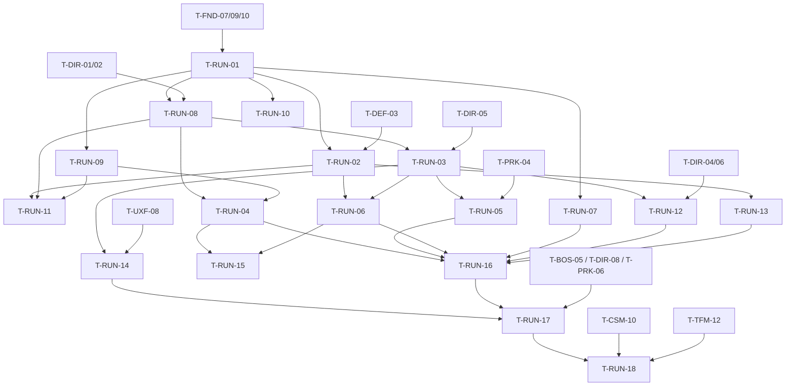

# Run Flow (RUN): Tasks

## 1. Summary

Eighteen tasks. P2 builds the run framework, a 3-wave authored run, Core loss, the build allowance and the run HUD (T-RUN-01, 02, 08, 09, 10, 11). P3 extends it to the full §6.2 run with forecast gating, pressure event, perk step, boss, one run resource, resolve, boundary, Core critical, pacing instrumentation, serializable state, tests, a tuning pass and the G3 gate playtest. Anchors T-RUN-01…07 keep their fixed meanings; T-RUN-08…18 are added after them.

Spec: [spec.md](spec.md) · Plan: [technical-plan.md](technical-plan.md)

## 2. Task Overview

| ID | Task | Type | Phase | Priority | Dependencies | Status |
|---|---|---|---|---|---|---|
| T-RUN-01 | Run framework classes + `URunDefinition` + phase state machine (P2-minimal) | GAMEPLAY | P2 | High | T-FND-07, T-FND-09, T-FND-10 | Todo |
| T-RUN-02 | Core destroyed → run lost + resolve stub | GAMEPLAY | P2 | High | T-RUN-01, T-DEF-03 | Todo |
| T-RUN-08 | Wave steps driven by Director scripted waves | GAMEPLAY | P2 | High | T-RUN-01, T-DIR-01, T-DIR-02 | Todo |
| T-RUN-09 | P2 build allowance + spend API for placement | GAMEPLAY | P2 | High | T-RUN-01 | Todo |
| T-RUN-10 | Run status HUD widget | UI | P2 | Medium | T-RUN-01, T-UXF-02 | Todo |
| T-RUN-11 | P2 Functional Tests (sequence, Core loss, Hero death, allowance) | QA | P2 | High | T-RUN-02, T-RUN-08, T-RUN-09 | Todo |
| T-RUN-03 | Full run step sequence: prep, intermissions, mid-run event, boss, resolve | GAMEPLAY | P3 | High | T-RUN-08, T-DIR-05; soft: T-DIR-08, T-BOS-05 | Todo |
| T-RUN-12 | Forecast handshake + minimum warning time gate | GAMEPLAY | P3 | High | T-RUN-03, T-DIR-04, T-DIR-06 | Todo |
| T-RUN-04 | Run resource earn/spend | GAMEPLAY | P3 | High | T-RUN-08, T-RUN-09 | Todo |
| T-RUN-05 | Perk-offer step hook | GAMEPLAY | P3 | High | T-RUN-03, T-PRK-04; soft: T-PRK-05 | Todo |
| T-RUN-06 | Win/lose resolve + run result + reward stub | GAMEPLAY | P3 | High | T-RUN-02, T-RUN-03 | Todo |
| T-RUN-07 | Siege Site boundary handling (Q-16) | GAMEPLAY | P3 | Medium | T-RUN-01, T-CMB-01, T-UXF-01 | Todo |
| T-RUN-13 | Core critical HP state + feedback | GAMEPLAY | P3 | Medium | T-RUN-02, T-UXF-01 | Todo |
| T-RUN-14 | Pacing instrumentation (~25 min target) | TOOLS | P3 | High | T-RUN-03, T-UXF-08 | Todo |
| T-RUN-15 | Run state snapshot structs + serialization round-trip spec | TOOLS | P3 | Medium | T-RUN-04, T-RUN-06 | Todo |
| T-RUN-16 | P3 Functional Tests (full short run, warning gate, spend, boundary, resolve) | QA | P3 | High | T-RUN-04, T-RUN-05, T-RUN-06, T-RUN-07, T-RUN-12, T-RUN-13 | Todo |
| T-RUN-17 | Pacing tuning pass toward ~25 min using the §33 script | DESIGN | P3 | High | T-RUN-14, T-RUN-16, T-DIR-08, T-BOS-05, T-PRK-06 | Todo |
| T-RUN-18 | G3 gate playtest: 5 waves + boss end-to-end, replay desire | QA | P3 | High | T-RUN-17, T-CSM-10, T-TFM-12, T-UXF-09 | Todo |

## 3. Detailed Tasks

## P2

### T-RUN-01 — Run framework classes + `URunDefinition` + phase state machine (P2-minimal)
**Type** GAMEPLAY · **Phase** P2

**Objective** A Siege Site map runs Prep → waves → intermissions → Resolve from a data asset, with waves completed by cheat until DIR is wired (T-RUN-08).

**Related Requirements** R-RUN-01, R-RUN-02, R-RUN-03, R-RUN-04, R-RUN-10, R-RUN-11, AC-RUN-01, AC-RUN-06

**Dependencies** T-FND-07, T-FND-09, T-FND-10

**Implementation Notes**
- [ ] `RunTypes.h`: `ERunPhase`, `ERunEconomyMode`, `ERunOutcome`, `ERunEndReason`, `FRunStep`, `FRunStateData`, `FRunPlayerData` (fields in technical-plan §5). No UObject pointers in state structs.
- [ ] `URunDefinition : UGameDefinition` with `Steps`, economy and pacing fields; register Primary Asset Type `RunDefinition`.
- [ ] `RunSequence::Validate(const URunDefinition&, TArray<FText>& OutErrors)`: first step Prep, last step Resolve, exactly one Resolve, ≥ 1 Wave, Wave/Boss steps have `Wave` set, timed steps have `DurationSeconds > 0`, PerkChoice not first, PressureEvent has `ModifierTag` and a later Wave before Resolve. Warning (not error) when a Boss step exists and Wave count ≠ 5. Call it from `IsDataValid`.
- [ ] `ARunGameState`: `FRunStateData RunState`; setters that broadcast `OnRunPhaseChanged`. `ARunPlayerState`: `FRunPlayerData PlayerData`.
- [ ] `ARunGameMode`: `RunDefinition` property; `StartRun()` after the first player is spawned (`HandleStartingNewPlayer` or `BeginPlay` + check, verify order); `EnterStep(int32)`, `AdvanceStep()`; timed steps use one `FTimerHandle`; Wave steps wait for `NotifyWaveCleared()` (called by cheat now, by DIR in T-RUN-08).
- [ ] Cheats in `UGameCheatManager`: `RunSkipStep`, `RunCompleteWave`, `RunJumpToStep <i>`.
- [ ] `LogGameRun` line on every phase change: step index, phase, game time, real time.
- [ ] `BP_RunGameMode`, `DA_Run_P2` (R-RUN-03 list, Prep 120 s, Intermission 45 s), `DA_Run_Test_Short` (2 s windows).

**Expected Files / Assets** `Source/<Game>/Run/RunTypes.h`, `RunDefinition.h/.cpp`, `RunSequence.h/.cpp`, `RunGameMode.h/.cpp`, `RunGameState.h/.cpp`, `Source/<Game>/Player/RunPlayerState.h/.cpp`, `Source/<Game>/Tests/RunSequence.spec.cpp`, `Content/<Game>/Run/BP_RunGameMode`, `DA_Run_P2`, `DA_Run_Test_Short`

**Test Case** `DA_Run_Test_Short` in an empty test map → PIE → Prep (2 s) → Wave 1 → `RunCompleteWave` → Intermission (2 s) → … → Resolve; log shows 7 phase changes in order.

**Acceptance Criteria**
- [ ] Spec `<Game>.Run.Sequence.Validate` covers every error rule above and passes.
- [ ] Sequence runs in order with the short definition; timers match data.
- [ ] Invalid definition: `StartRun` refuses, logs an error and shows it on screen.

**Verification** Automation Spec; PIE with `DA_Run_Test_Short`.

---

### T-RUN-02 — Core destroyed → run lost + resolve stub
**Type** GAMEPLAY · **Phase** P2

**Objective** Destroying the Core ends the run as lost in any step; clearing the last P2 wave ends it as won; a stub screen shows the result with Restart.

**Related Requirements** R-RUN-06, R-RUN-07, R-RUN-08, AC-RUN-02, AC-RUN-03, AC-RUN-04

**Dependencies** T-RUN-01, T-DEF-03

**Implementation Notes**
- [ ] `StartRun` finds exactly one `ACoreStructure` (`TActorIterator`); 0 or 2+ → error, run not started. Store a `TWeakObjectPtr` on GameMode (not in the state struct).
- [ ] Bind the Core `UHealthComponent::OnDeath` → `ResolveRun(ERunOutcome::Lost, ERunEndReason::CoreDestroyed, Hit)`.
- [ ] `ResolveRun`: return if already latched; clear the step timer; set `Outcome`, `EndReason`, phase Resolve; broadcast. After T-RUN-08 also tell the Director to stop and clear.
- [ ] Last Wave cleared with Resolve next → `ResolveRun(Won, WavesSurvived)`.
- [ ] Do not bind Hero death anywhere in RUN (R-RUN-06).
- [ ] `WBP_RunResolve` stub: outcome text, reason, wave number, Restart button (`UGameplayStatics::OpenLevel` with the current map; verify full reset), Quit.
- [ ] Cheat `DamageCore <amount>` (applies an `FCombatHit` to the Core).

**Expected Files / Assets** `RunGameMode.cpp` (resolve), `Content/<Game>/UI/WBP_RunResolve`

**Test Case** `L_SiegeSite_Proto` with `DA_Run_P2` → during Intermission 1 run `DamageCore 99999` → phase becomes Resolve, outcome Lost; `RunSkipStep` has no effect; Restart → fresh Prep.

**Acceptance Criteria**
- [ ] Core death in Prep, Wave and Intermission each resolves as lost in the same frame.
- [ ] Hero death (`KillHero`) never changes phase or outcome.
- [ ] A second `DamageCore` after the latch logs "ignored" and changes nothing.

**Verification** PIE manual steps above; covered again by T-RUN-11.

---

### T-RUN-08 — Wave steps driven by Director scripted waves
**Type** GAMEPLAY · **Phase** P2

**Objective** Wave steps start the step's authored `UWaveDefinition` through the Director and end on the Director's wave cleared event.

**Related Requirements** R-RUN-05, R-RUN-08, AC-RUN-01

**Dependencies** T-RUN-01, T-DIR-01, T-DIR-02

**Implementation Notes**
- [ ] Add (or find) the `UEncounterDirectorComponent` on `ARunGameMode` (follow DIR's hosting choice).
- [ ] On entering a Wave step: call the Director's start-wave API with `Step.Wave`; set `WaveNumber`.
- [ ] Bind wave cleared → `NotifyWaveCleared(WaveIndex)`; ignore events for a wave that is not current.
- [ ] Bind the per-enemy killed event (used by T-RUN-04 kill rewards and `EnemiesKilled` stat). If T-DIR-02 has only spawn events, bind each spawned enemy's `UHealthComponent::OnDeath`.
- [ ] On `ResolveRun`: Director stop spawning + remove alive enemies.
- [ ] Start a one-shot `WaveSoftLimitSeconds` timer per wave: on fire, log a pacing warning (no gameplay change).
- [ ] Keep `RunCompleteWave` cheat working (asks the Director to clear the wave).

**Expected Files / Assets** `RunGameMode.h/.cpp`, `DA_Run_P2` wave references (`DA_Wave_P2_01..03` from DIR)

**Test Case** `L_SiegeSite_Proto` + `DA_Run_P2` → let W1 spawn → kill all enemies → phase changes to Intermission within 1 s of the last death.

**Acceptance Criteria**
- [ ] Each Wave step spawns its own wave data.
- [ ] Wave clear advances the step; stale events are ignored.
- [ ] Resolve stops spawning and removes enemies.

**Verification** PIE; Functional Test in T-RUN-11.

---

### T-RUN-09 — P2 build allowance + spend API for placement
**Type** GAMEPLAY · **Phase** P2

**Objective** One spend API that DEF placement calls; in P2 it enforces a per-window build allowance (A-05).

**Related Requirements** R-RUN-09, R-RUN-18, AC-RUN-05

**Dependencies** T-RUN-01 (consumer: T-DEF-07)

**Implementation Notes**
- [ ] `FRunCost { int32 Resource; int32 BuildSlots; }`, `ERunSpendReason { Build, Repair }`.
- [ ] `RunEconomy` pure functions: `CanAfford(State, Mode, Cost)`, `Spend(State, Mode, Cost) -> bool` (atomic, never negative), `Grant(State, Amount)`, `ResetAllowance(State, BuildsPerWindow)`.
- [ ] `ARunGameMode::CanAfford(const FRunCost&) const`, `TrySpend(const FRunCost&, ERunSpendReason)`; broadcast `OnBuildAllowanceChanged`; on failure play `Feedback.Run.CannotAfford` with a reason.
- [ ] Reset the allowance on entering Prep and every Intermission/PressureEvent.
- [ ] Reject all spends after the latch.
- [ ] Note for DEF: placement builds `FRunCost{Def->Cost, 1}`; if the GameMode is not `ARunGameMode` (sandbox), placement is free.

**Expected Files / Assets** `Source/<Game>/Run/RunEconomy.h/.cpp`, `Source/<Game>/Tests/RunEconomy.spec.cpp`

**Test Case** Spec: allowance 3 → three `Spend({0,1})` succeed, fourth fails, state unchanged; `ResetAllowance` → 3 again.

**Acceptance Criteria**
- [ ] Spec `<Game>.Run.Economy` passes (BuildLimit mode cases).
- [ ] PIE: 4th placement in a window refused with feedback; next window allows 3.

**Verification** Automation Spec; PIE with DEF placement.

---

### T-RUN-10 — Run status HUD widget
**Type** UI · **Phase** P2 (extended in P3)

**Objective** The player reads phase, countdown, wave n/N and build allowance (P3: resource) in one glance.

**Related Requirements** R-RUN-04, R-RUN-09, §28.1, spec §14

**Dependencies** T-RUN-01, T-UXF-02

**Implementation Notes**
- [ ] `WBP_RunStatus` in `WBP_GameHUD`; binds `OnRunPhaseChanged`, `OnBuildAllowanceChanged`, later `OnRunResourceChanged`.
- [ ] Countdown text from `StepEndGameTime - GetTimeSeconds()`, refreshed by a 0.25 s widget timer (no Tick binding).
- [ ] Wave label: "Wave n/N", "Boss" in Boss step, nothing in Resolve.
- [ ] Last 10 s of a window: play `Feedback.Run.WaveCountdown` once per second.
- [ ] Shows "Builds: x" in BuildLimit mode, resource amount in RunResource mode.

**Expected Files / Assets** `Content/<Game>/UI/WBP_RunStatus`, `DT_Feedback` rows `Feedback.Run.WindowOpen`, `WaveCountdown`, `WaveStart`, `WaveCleared`

**Test Case** PIE `DA_Run_P2` → watch Prep countdown reach 0 → label switches to "Wave 1/3" in the same second.

**Acceptance Criteria**
- [ ] All fields update on events; no gameplay value is owned by the widget.
- [ ] Readable at 1080p from normal play distance (playtest note).

**Verification** PIE manual; screenshot in playtest notes.

---

### T-RUN-11 — P2 Functional Tests
**Type** QA · **Phase** P2

**Objective** Automated regression for the P2 run contract before G2.

**Related Requirements** AC-RUN-01…AC-RUN-05

**Dependencies** T-RUN-02, T-RUN-08, T-RUN-09

**Implementation Notes**
- [ ] `FT_Run_P2_Sequence`: short definition with 1-enemy authored waves; the test kills enemies by cheat; asserts phase order and Resolve Won.
- [ ] `FT_Run_CoreLoss`: Core to 0 in Intermission → Lost, no further phase change for 5 s.
- [ ] `FT_Run_HeroDeathNoLoss`: kill the Hero in Prep and in Wave → phase and outcome unchanged; timers keep counting.
- [ ] `FT_Run_Allowance`: 4 placements via DEF API in one window → 3 succeed.
- [ ] Add all to the CLI runner group `<Game>.Run.`.

**Expected Files / Assets** `Content/<Game>/Maps/Test/FT_Run_P2_Sequence`, `FT_Run_CoreLoss`, `FT_Run_HeroDeathNoLoss`, `FT_Run_Allowance`

**Test Case** `Tools/run_tests` with filter `<Game>.Run.` → 4 Functional Tests + 2 Specs pass.

**Acceptance Criteria**
- [ ] All pass from the command line.
- [ ] Each test finishes in < 30 s.

**Verification** CLI runner output attached to the G2 review.

## P3

### T-RUN-03 — Full run step sequence: prep, intermissions, mid-run event, boss, resolve
**Type** GAMEPLAY · **Phase** P3

**Objective** `DA_Run_P3` plays the §6.2 baseline: 5 waves, the PressureEvent before W4, PerkChoice slots, the Boss step and Resolve.

**Related Requirements** R-RUN-12, R-RUN-14, R-RUN-16, R-RUN-24, AC-RUN-07, AC-RUN-09

**Dependencies** T-RUN-08, T-DIR-05; soft (stub until ready): T-DIR-08, T-BOS-05

**Implementation Notes**
- [ ] PressureEvent step: timed window; play `Feedback.Run.PressureEvent` with the modifier display name; resets build allowance (BuildLimit mode).
- [ ] `RunSequence::CollectModifiersUntil(Def, From, NextCombatIndex)`; pass the collected modifier tags to the Director only for that next wave.
- [ ] Boss step: lead-in timer (`DurationSeconds`, default 20 s) with `Feedback.Run.BossIncoming`, then start the boss wave (DIR T-DIR-08); bind BOS boss defeated → `ResolveRun(Won, BossDefeated)`. Until BOS exists, `RunCompleteWave` on the Boss step resolves as won.
- [ ] PerkChoice step placeholder: until T-RUN-05, auto-advance and log "perk step (no PRK)".
- [ ] Remaining enemies at boss defeat are removed at Resolve (NEW-RUN-2).
- [ ] Author `DA_Run_P3` with the 15-step table in technical-plan §5 and wave references `DA_Wave_P3_01..05`, `DA_Wave_P3_Boss`.
- [ ] Extend the Spec: modifier collection returns the PressureEvent tag for W4 only.

**Expected Files / Assets** `RunGameMode.cpp`, `RunSequence.cpp`, `Content/<Game>/Run/DA_Run_P3`, `DA_Run_Test_Short_P3`

**Test Case** `DA_Run_Test_Short_P3` → complete waves by cheat → after W3 the PressureEvent banner shows → W4 starts with the modifier in the Director log → after W5 the boss lead-in → `RunCompleteWave` → Resolve Won.

**Acceptance Criteria**
- [ ] Phase order matches the 15-step table.
- [ ] Modifier sent for W4 only.
- [ ] Boss defeat resolves as won exactly once.

**Verification** Automation Spec; PIE short run; Functional Test in T-RUN-16.

---

### T-RUN-12 — Forecast handshake + minimum warning time gate
**Type** GAMEPLAY · **Phase** P3

**Objective** Every wave and the boss have a forecast published when their pre-wave window opens, and never start before the minimum warning time.

**Related Requirements** R-RUN-13, AC-RUN-08

**Dependencies** T-RUN-03, T-DIR-04, T-DIR-06

**Implementation Notes**
- [ ] On entering any non-combat step: `FindNextCombatStep`; if its forecast is not yet published, call the Director's prepare-wave API (wave data + modifiers) and stamp `ForecastPublishedGameTime`.
- [ ] Run start publishes W1's forecast before Prep starts counting.
- [ ] Before starting a combat step: `Remaining = MinWarningSeconds - (Now - ForecastPublishedGameTime)`; if > 0, hold with a one-shot timer and log a warning with the step index.
- [ ] Log `forecast_published` and `wave_started` telemetry events with both timestamps.
- [ ] `IsDataValid` warning when a pre-wave window sum is below the Director's minimum warning time (if DIR exposes it as data; otherwise runtime check only).

**Expected Files / Assets** `RunGameMode.cpp`, `RunSequence.cpp`

**Test Case** Short definition with a 1 s Intermission and `MinWarningSeconds = 5` → W2 starts 5 s after W1 cleared, warning logged.

**Acceptance Criteria**
- [ ] Forecast visible (DIR panel) during PerkChoice and Intermission for the upcoming wave.
- [ ] Log proves `wave_started - forecast_published >= MinWarningSeconds` for every wave in a full run.

**Verification** Functional Test `FT_Run_WarningGate` (T-RUN-16); telemetry check in T-RUN-17.

---

### T-RUN-04 — Run resource earn/spend
**Type** GAMEPLAY · **Phase** P3

**Objective** One run resource: start amount, earn from kills and wave clears, spend on build (and repair when DEF adds it).

**Related Requirements** R-RUN-17, R-RUN-18, AC-RUN-11

**Dependencies** T-RUN-08, T-RUN-09

**Implementation Notes**
- [ ] RunResource mode in `RunEconomy` (Spend uses `Cost.Resource`, ignores `BuildSlots`); extend the Spec.
- [ ] `StartRun` sets `RunResource = StartingResource`.
- [ ] Enemy killed → reward from `KillRewardByUnitTag` using the enemy archetype unit tag (`Unit.Enemy.*`); missing tag = 0, log once per tag.
- [ ] Wave cleared → grant `Step.WaveClearReward` (Collect) + `Feedback.Run.WaveCleared` toast with the amount.
- [ ] Update `FRunPlayerData.ResourceEarned/ResourceSpent/EnemiesKilled`.
- [ ] Broadcast `OnRunResourceChanged(New, Delta)`; `WBP_RunStatus` shows the amount; `Feedback.Run.ResourceGained` throttled.
- [ ] Cheat `GiveRunResource <n>`.
- [ ] `ERunSpendReason::Repair` accepted; no repair UI here (DEF).

**Expected Files / Assets** `RunEconomy.cpp`, `RunGameMode.cpp`, `RunEconomy.spec.cpp`, `WBP_RunStatus`

**Test Case** Start 300 → kill 5 Swarm (2 each) → 310 → clear wave (reward 50) → 360 → place Ballista cost 400 → refused, 360 kept, red flash.

**Acceptance Criteria**
- [ ] Spec covers RunResource mode: atomic, never negative.
- [ ] Earn and spend values match data in PIE.
- [ ] No spending or earning after Resolve.

**Verification** Automation Spec; PIE scenario above.

---

### T-RUN-05 — Perk-offer step hook
**Type** GAMEPLAY · **Phase** P3

**Objective** PerkChoice steps request a 1-of-3 offer from PRK and wait for the pick.

**Related Requirements** R-RUN-15, AC-RUN-10

**Dependencies** T-RUN-03, T-PRK-04; soft: T-PRK-05 (UI)

**Implementation Notes**
- [ ] On entering PerkChoice: call PRK's offer API on `ARunPlayerState`'s `UPerkManagerComponent`; bind its chosen callback → `AdvanceStep()`.
- [ ] If PRK returns no offer (empty pool), log a warning and advance (no stall).
- [ ] No timer; world time keeps running (no `SetGamePaused`).
- [ ] If the run resolves while the offer is open, tell PRK to close the offer.
- [ ] Telemetry: `perk_offered` (offer IDs), `perk_chosen` (ID, seconds to choose).

**Expected Files / Assets** `RunGameMode.cpp`

**Test Case** Short P3 run → W1 cleared → offer appears → wait 10 s (step does not advance) → pick → Intermission starts.

**Acceptance Criteria**
- [ ] PerkChoice appears after W1, W3, W4 only.
- [ ] Empty pool never stalls the run.
- [ ] Choosing while dead (Commander Spirit Mode) works (checked with CSM).

**Verification** PIE; Functional Test in T-RUN-16 with a test perk pool.

---

### T-RUN-06 — Win/lose resolve + run result + reward stub
**Type** GAMEPLAY · **Phase** P3

**Objective** Resolve shows outcome, reason and summary, emits the `FRunResult` record, and offers Restart/Quit. No meta reward (MET is VS).

**Related Requirements** R-RUN-19, R-RUN-20, R-RUN-08, AC-RUN-12, AC-RUN-13

**Dependencies** T-RUN-02, T-RUN-03

**Implementation Notes**
- [ ] Build `FRunResult` in `ResolveRun`: fields in technical-plan §5; `KillerUnitTag` from the Core-killing hit instigator's archetype tag; `PerkIds` copied from PRK.
- [ ] Broadcast `OnRunResolved(FRunResult)` on `ARunGameMode` (MET binds at VS). This delegate is the reward stub; no persistent writes.
- [ ] Write a `run_end` telemetry event with all result fields.
- [ ] Replace the stub with full `WBP_RunResolve`: win/lose header, one-line reason ("Core destroyed during Wave 4 by Siege" / "Boss defeated"), summary rows, Restart (focused by default), Quit.
- [ ] Input mode UI only; Hero input disabled; CSM respawn cancelled via `OnRunPhaseChanged(Resolve)`.
- [ ] Feedback `Feedback.Run.Victory` / `Feedback.Run.Defeat` / `Feedback.Run.CoreDestroyed`.

**Expected Files / Assets** `RunGameMode.cpp`, `RunTypes.h`, `Content/<Game>/UI/WBP_RunResolve`

**Test Case** Short P3 run → `DamageCore 99999` in W4 → screen reads "Core destroyed during Wave 4"; telemetry has `run_end` with `Outcome=Lost`; Restart → new Prep with fresh state.

**Acceptance Criteria**
- [ ] Win and loss screens both show reason + summary + Restart/Quit.
- [ ] `run_end` contains every `FRunResult` field.
- [ ] Nothing is written to disk except telemetry.

**Verification** PIE both outcomes; Functional Test in T-RUN-16.

---

### T-RUN-07 — Siege Site boundary handling (Q-16)
**Type** GAMEPLAY · **Phase** P3

**Objective** Soft boundary: warning when leaving the play area, hard stop at the edge, recovery if the Hero gets outside, never a run fail.

**Related Requirements** R-RUN-22, AC-RUN-15

**Dependencies** T-RUN-01, T-CMB-01, T-UXF-01

**Implementation Notes**
- [ ] `ASiegeSiteBoundary`: `InnerBounds` and `OuterBounds` `UBoxComponent`s (overlap only, Pawn channel). Hard edge: level-placed blocking geometry or `ABlockingVolume` between the boxes.
- [ ] Inner end-overlap by the Hero → `OnBoundaryWarningChanged(true)` + `Feedback.Run.BoundaryWarning`; begin-overlap → clear.
- [ ] Outer end-overlap by the Hero → teleport to the nearest `APlayerStart` tagged `SafePoint`, or project the last inside position to navmesh (verify API); `Feedback.Run.BoundaryRecovered`.
- [ ] `GetSiteBounds()` returns the inner box `FBox` for CSM camera clamping.
- [ ] Coordinate with CMB: `FellOutOfWorld` on `AHeroCharacter` calls the same recovery instead of destroying the pawn (verify KillZ behavior).
- [ ] One boundary per map; `StartRun` warns if none.

**Expected Files / Assets** `Source/<Game>/Run/SiegeSiteBoundary.h/.cpp`, `Content/<Game>/Run/BP_SiegeSiteBoundary`, placement in `L_SiegeSite_Proto`

**Test Case** Walk the Hero to the edge → warning shows → keep walking → blocked → `Teleport` cheat to a point outside the outer box → Hero back at a safe point within 1 s; run phase unchanged.

**Acceptance Criteria**
- [ ] Warning appears/clears on crossing the inner bound.
- [ ] Recovery never counts as Hero death or run loss.
- [ ] Event-driven, no Tick.

**Verification** PIE manual; Functional Test `FT_Run_Boundary` in T-RUN-16.

---

### T-RUN-13 — Core critical HP state + feedback
**Type** GAMEPLAY · **Phase** P3

**Objective** A readable Core critical state when Core HP crosses the threshold (§34.4).

**Related Requirements** R-RUN-21, AC-RUN-14

**Dependencies** T-RUN-02, T-UXF-01

**Implementation Notes**
- [ ] Bind Core `UHealthComponent::OnDamaged`; compute fraction; crossing `<= CoreCriticalFraction` sets `bCoreCritical` and broadcasts `OnCoreCriticalChanged(true)` once.
- [ ] Rising above the threshold (repair) clears it.
- [ ] Feedback `Feedback.Run.CoreCritical` (HUD pulse + alarm); UXF's Core HP bar (T-UXF-07) listens to the delegate for the pulse.
- [ ] Telemetry `core_critical` with wave number and game time.

**Expected Files / Assets** `RunGameMode.cpp`, `DT_Feedback` row

**Test Case** Core 1000 HP → `DamageCore 760` → critical fires once → `DamageCore 10` → no second fire.

**Acceptance Criteria**
- [ ] Fires once per crossing, clears on heal above the threshold.
- [ ] No gameplay change in critical state.

**Verification** PIE; Functional Test in T-RUN-16.

---

### T-RUN-14 — Pacing instrumentation (~25 min target)
**Type** TOOLS · **Phase** P3

**Objective** Every run produces step timings and total time compared with targets, in the telemetry log and on a debug overlay.

**Related Requirements** R-RUN-23, AC-RUN-16

**Dependencies** T-RUN-03, T-UXF-08

**Implementation Notes**
- [ ] `FRunStepTiming { StepIndex, Phase, GameSeconds, RealSeconds, TargetSeconds }` recorded on each step exit. Real time via `FPlatformTime::Seconds()` or `UWorld::GetRealTimeSeconds()` (verify behavior under time dilation and pause).
- [ ] Telemetry events: `run_start` (definition ID, map), `step_end` (timing), `run_end` summary with total game/real time vs `TargetRunSeconds` and per-step deltas.
- [ ] Extra counters per wave: Hero deaths, Core HP at wave end, resource at wave end.
- [ ] CVar `game.debug.Run 1`: on-screen step index, phase, step elapsed vs target, run elapsed vs target.
- [ ] One-page note in `ai/game/playtests/README-pacing.md` (or the UXF playtest folder) on how to read the log.

**Expected Files / Assets** `RunGameMode.cpp`, `RunTypes.h`, `Core/GameDebug.cpp` (CVar), playtest note

**Test Case** Short P3 run → log contains 14 `step_end` events and one `run_end` with totals equal to the sum of steps (± 0.1 s).

**Acceptance Criteria**
- [ ] Game and real time both recorded per step.
- [ ] Overlay toggles with the CVar.

**Verification** PIE + log inspection.

---

### T-RUN-15 — Run state snapshot structs + serialization round-trip spec
**Type** TOOLS · **Phase** P3

**Objective** Prove D-14: RUN-owned run state can be captured and serialized without UObject pointers, without building a save system.

**Related Requirements** R-RUN-11, AC-RUN-17

**Dependencies** T-RUN-04, T-RUN-06

**Implementation Notes**
- [ ] `ARunGameMode::CaptureRunSnapshot()` returns `FRunStateData` + `FRunPlayerData` (+ elapsed time in the current step).
- [ ] Spec: fill both structs with non-default values → serialize (`FJsonObjectConverter::UStructToJsonObjectString` or `FMemoryWriter` + `UScriptStruct::SerializeItem`; verify for pinned UE) → deserialize → equal.
- [ ] Spec asserts no `FObjectProperty`/`FWeakObjectProperty` in either struct (iterate `TFieldIterator<FProperty>`).
- [ ] No save file, no load path (A-11).

**Expected Files / Assets** `Source/<Game>/Tests/RunSnapshot.spec.cpp`, `RunGameMode.cpp`

**Test Case** Run the spec → passes; add a `UObject*` field to `FRunStateData` locally → spec fails.

**Acceptance Criteria**
- [ ] Round-trip spec passes.
- [ ] Pointer guard fails on a pointer field.

**Verification** Automation Spec `<Game>.Run.Snapshot`.

---

### T-RUN-16 — P3 Functional Tests
**Type** QA · **Phase** P3

**Objective** Automated regression for the full run contract before G3.

**Related Requirements** AC-RUN-07…AC-RUN-15

**Dependencies** T-RUN-04, T-RUN-05, T-RUN-06, T-RUN-07, T-RUN-12, T-RUN-13

**Implementation Notes**
- [ ] `FT_Run_P3_Sequence`: `DA_Run_Test_Short_P3`, 1-enemy waves, test perk pool, boss stub → asserts the 15-step order and Won.
- [ ] `FT_Run_WarningGate`: 1 s window + 5 s warning → wave start delayed to 5 s.
- [ ] `FT_Run_Spend`: resource earn/spend/refuse values.
- [ ] `FT_Run_Boundary`: teleport outside → recovered, run continues.
- [ ] `FT_Run_CoreCritical`: crossing fires once.
- [ ] `FT_Run_ResolveLatch`: Core death and boss death in the same frame → one result, second logged.
- [ ] Re-run P2 tests (regression).

**Expected Files / Assets** `Content/<Game>/Maps/Test/FT_Run_*` (6 new maps)

**Test Case** CLI runner `<Game>.Run.` → all P2 + P3 tests pass.

**Acceptance Criteria**
- [ ] All pass from the command line in < 3 min total.

**Verification** CLI runner output attached to the G3 review.

---

### T-RUN-17 — Pacing tuning pass toward ~25 min using the §33 script
**Type** DESIGN · **Phase** P3

**Objective** Tune `DA_Run_P3` windows (and request wave budget changes from DIR) until a normal run lands near ~25 min and follows the §2 escalation.

**Related Requirements** R-RUN-04, R-RUN-23, R-RUN-24, AC-RUN-18

**Dependencies** T-RUN-14, T-RUN-16, T-DIR-08, T-BOS-05, T-PRK-06

**Implementation Notes**
- [ ] Play 3 full runs (developer) following the §33 beats as a script: 00:00 forecast read, 01:00 build (Infantry at bridge, Ballista on high ground, Barricade choke), 02:00 W1 Swarm, ~05:00 perk, ~06:00 W2 Armored (Heavy → Armor Broken → Ballista), ~13:00 split pressure (Focus reorder), ~17:00 structure collapse, ~21:00 boss, ~25:00 resolve.
- [ ] Compare each step's real time with its pacing target from the log; record deltas in a table.
- [ ] Change only data: window durations, wave-clear rewards, starting resource; wave budget/composition changes are requested from DIR as notes, not edited here.
- [ ] Check escalation: W1 one lane / one archetype; W4 two lanes at once; W5 Siege pressure on structures.
- [ ] Record results in `ai/game/playtests/P3-pacing-<date>.md`.

**Expected Files / Assets** `DA_Run_P3` (tuned), playtest note

**Test Case** Third tuning run total real time within the working band 22–28 min; each beat within ±2 min of the §33 timestamp.

**Acceptance Criteria**
- [ ] 3 logged runs; the last one is within the band.
- [ ] All changes are data changes.

**Verification** Telemetry logs + playtest note.

---

### T-RUN-18 — G3 gate playtest: 5 waves + boss end-to-end, replay desire
**Type** QA · **Phase** P3

**Objective** Run the G3 Full Run gate review with external or fresh players and record a KEEP / CHANGE / DELETE decision.

**Related Requirements** §32 P3 gate, §36 Full Run DoD, master plan §3 G3 checklist, AC-RUN-07, AC-RUN-18

**Dependencies** T-RUN-17, T-CSM-10, T-TFM-12, T-UXF-09 (and all P3 tasks of DIR, PRK, BOS)

**Implementation Notes**
- [ ] Packaged Development build on the reference PC (T-FND-08), telemetry on.
- [ ] At least 3 testers, each plays one full run without help after a 2-minute briefing; observer uses the §33 beats as the script and notes the actual time of each beat.
- [ ] Walk the G3 checklist from master plan §3: 5 waves + boss end-to-end; forecast before every wave; no impossible wave; Hero death playable via Commander Spirit (T-CSM-10 data); at least one visible Hero ↔ Army ↔ Tower synergy; at least one distinct build from perks; ~25 min; no blocker bug.
- [ ] Replay question, asked right after Resolve before any discussion: "Do you want to play another run right now? (yes / maybe / no) What would you do differently?" Record whether they press Restart unprompted.
- [ ] Attach telemetry: run duration, step deltas, Focus share (T-TFM-12), deaths/time dead (T-CSM-10).
- [ ] Write the decision: pass → VS planning; fail → stay in P3 (no villager economy, open world content or extra classes, §32).

**Expected Files / Assets** `ai/game/playtests/G3-<date>.md` with checklist, answers, telemetry summary, decision

**Test Case** Each tester's run reaches Resolve with no blocker bug; the replay question is answered for every tester.

**Acceptance Criteria**
- [ ] Every G3 checklist item marked pass/fail with evidence.
- [ ] Replay answers recorded per tester; majority "yes" required to pass (G3 last item).
- [ ] KEEP / CHANGE / DELETE written per P3 hypothesis.

**Verification** Gate review document signed off by the developer.

## 4. Dependency Graph

## 5. Integration / Regression Checklist

- [ ] P2 Functional Tests still pass after every P3 task.
- [ ] Sandbox maps (`L_CombatSandbox`, `L_CombinedArms`) still work with `ASandboxGameMode` (no hard dependency on `ARunGameMode` in CMB/SQD code).
- [ ] DEF placement works in both economy modes and in non-run maps (free).
- [ ] Hero death in every phase never changes the run result (CSM regression).
- [ ] Focus held at a step boundary does not break timers (TFM regression).
- [ ] Perk step works while the Hero is dead.
- [ ] No Tick added to RUN actors (`stat game`, Insights spot check).
- [ ] No new warnings in the log during a full short run.

## 6. Final Definition of Done

All AC-RUN-01…18 pass; P2 and P3 Functional Tests and Specs pass from the CLI; `DA_Run_P3` tuned to the ~25 min band with logged evidence; G3 review document written with the replay-desire result; every [TUNABLE] value in `URunDefinition`; no blocker bug open against RUN.
