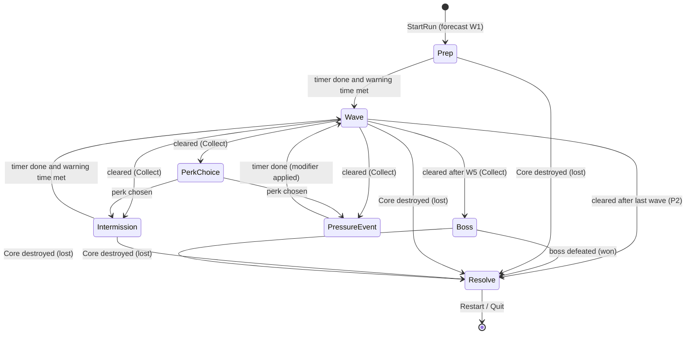
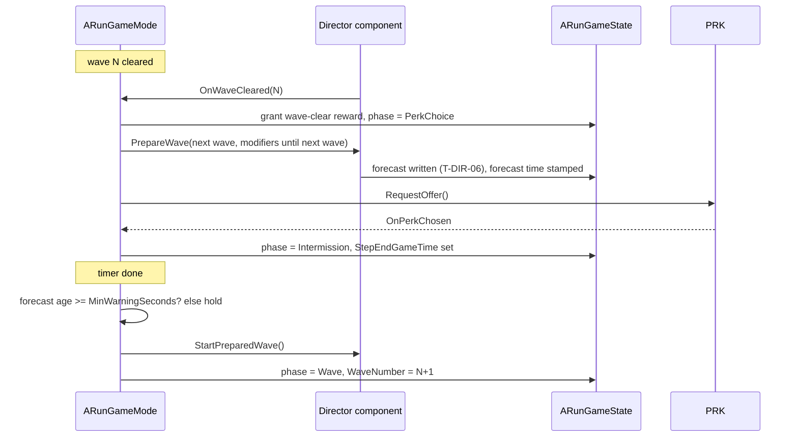

# Run Flow (RUN): Technical Plan

| | |
|---|---|
| Spec | [spec.md](spec.md) |
| Architecture baseline | [00-foundation/technical-plan.md](../00-foundation/technical-plan.md), master plan D-01…D-18 |
| Phases | P2 → P3 |
| Status | Draft v1. All paths and class names are proposals (no UE project exists yet). |

## 1. Technical Overview

`ARunGameMode` walks a flat list of `FRunStep` entries from a `URunDefinition`. Timed steps use one `FTimerManager` timer; untimed steps (Wave, PerkChoice, Boss) advance on events from DIR, PRK and BOS. Run data lives in one plain struct `FRunStateData` on `ARunGameState`, which broadcasts changes to the HUD and other observers. Rules that are easy to get wrong (definition validation, next-forecast lookup, economy spend) are pure functions in `RunSequence` and `RunEconomy` namespaces with Automation Specs. The Siege Site boundary is one actor with two box components and overlap events. Pacing data goes to the T-UXF-08 telemetry log.

No Tick on any RUN actor. No new framework: no step graph, no event bus, no save code.

## 2. Existing System Impact

| System | Impact |
|---|---|
| FND | Adds `Run` properties to `UGameTuningSettings` only if needed (none planned); cheats in `UGameCheatManager`; CVar `game.debug.Run`; log category `LogGameRun` (exists) |
| DIR | RUN calls the Director component on `ARunGameMode`: prepare wave (with modifiers) → forecast; start wave; stop and clear; reads minimum warning time; binds wave cleared and enemy killed events |
| DEF | RUN finds the single `ACoreStructure`, binds its `UHealthComponent`; DEF placement calls `ARunGameMode::CanAfford/TrySpend` |
| BOS | RUN binds the boss defeated event (T-BOS-05) |
| PRK | RUN requests an offer at PerkChoice and waits for the chosen callback; PRK's `UPerkManagerComponent` sits on `ARunPlayerState` |
| CSM | Uses `ARunPlayerState` (death count, revive charges) and `ASiegeSiteBoundary::GetSiteBounds()` |
| TFM | Reads `ARunGameState` phase to block Focus in PerkChoice/Resolve and to measure combat time |
| UXF | `WBP_RunStatus` mounts in `WBP_GameHUD`; `Feedback.Run.*` rows in `DT_Feedback`; telemetry events via T-UXF-08 |
| CMB | Hero spawn via standard `AGameModeBase` flow; KillZ / `FellOutOfWorld` interplay with boundary recovery |

## 3. Proposed Architecture

### 3.1 Runtime owner and lifetime
| Object | Owner | Lifetime |
|---|---|---|
| `ARunGameMode` | World (set by Siege Site World Settings or `BP_RunGameMode`) | One map load = one run |
| `ARunGameState` | GameMode framework | Same as GameMode |
| `ARunPlayerState` | Player controller | Run; survives Hero death and repossession |
| `URunDefinition` | Asset, referenced by `BP_RunGameMode` (or a World Settings override per map) | Read-only at runtime |
| `ASiegeSiteBoundary` | Placed in the Siege Site map | Map |

### 3.2 Main UE types
| Type | Kind | Responsibility |
|---|---|---|
| `ARunGameMode` | `AGameModeBase` (C++) | Step machine, result latch, economy rules, Core binding, Director/BOS/PRK calls, restart |
| `ARunGameState` | `AGameStateBase` (C++) | Holds `FRunStateData`; delegates; forecast slot written by DIR (T-DIR-06) |
| `ARunPlayerState` | `APlayerState` (C++) | Holds `FRunPlayerData`; host for PRK component |
| `URunDefinition` | `UPrimaryDataAsset` via `UGameDefinition` | Steps + economy + pacing data; `IsDataValid` calls `RunSequence::Validate` |
| `FRunStep`, `FRunStateData`, `FRunPlayerData`, `FRunResult`, `FRunCost`, `FRunStepTiming` | USTRUCTs | Plain data, stable IDs only (D-14) |
| `ERunPhase`, `ERunEconomyMode`, `ERunOutcome`, `ERunEndReason`, `ERunSpendReason` | UENUMs | No new tag roots needed |
| `RunSequence`, `RunEconomy` | C++ namespaces, pure functions | Validation, next-combat-step lookup, spend/grant |
| `ASiegeSiteBoundary` | `AActor` with `InnerBounds` and `OuterBounds` `UBoxComponent`s | Warning, recovery teleport, bounds query |
| `WBP_RunStatus`, `WBP_RunResolve` | UMG Blueprints | Phase/countdown/wave/resource; resolve screen |

### 3.3 Data ownership
- Definition data: `URunDefinition` (never mutated at runtime).
- Runtime state: `FRunStateData` (GameState), `FRunPlayerData` (PlayerState). Only `ARunGameMode` writes them, through small setters on GameState/PlayerState that broadcast.
- Presentation: widgets, `DT_Feedback` rows.
- Wave plans, forecast content and modifiers are DIR data; RUN only passes a `UWaveDefinition` reference and modifier tags.

### 3.4 Communication flow
- GameMode → Director component: direct calls (owned component).
- Core, Director, BOS, PRK → GameMode: GameMode binds their delegates at `StartRun`.
- GameMode → observers: GameState/PlayerState multicast delegates.
- DEF placement → GameMode: `GetWorld()->GetAuthGameMode<ARunGameMode>()` then `CanAfford`/`TrySpend`. If the GameMode is not a run mode (sandbox maps), placement treats spending as free.
- Presentation: `UFeedbackSubsystem::Play(Feedback.Run.*)`.

### 3.5 C++ / Blueprint split
C++: everything in 3.2 except widgets. Blueprint: `BP_RunGameMode` (assigns definition, HUD classes), `DA_Run_*` assets, `WBP_RunStatus`, `WBP_RunResolve`, `BP_SiegeSiteBoundary` placement, feedback rows.

### 3.6 Asset references and loading
`URunDefinition` hard-references its `UWaveDefinition` assets; small data, lifecycle matches the run. Revisit with soft references only if load profiling at VS shows a need.

### 3.7 AI / navigation impact
None directly. At Resolve RUN asks the Director to stop spawning and remove alive enemies. Boundary recovery uses a navmesh-projected safe point (`UNavigationSystemV1::ProjectPointToNavigation`, verify signature) or an authored `APlayerStart` tagged `SafePoint`.

### 3.8 UI impact
- `WBP_RunStatus`: phase label, countdown (`StepEndGameTime - GetTimeSeconds()`, text refresh at 4 Hz, not bound to Tick), wave n/N or "Boss", resource or builds left.
- `WBP_RunResolve`: outcome, reason line, summary rows, Restart, Quit.
- Boundary warning uses a `Feedback.Run.BoundaryWarning` UI toast row, no extra widget.
- Forecast panel (DIR), perk cards (PRK), Core HP (UXF) are not RUN widgets.

### 3.9 Save impact
No save (A-11). `FRunStateData` and `FRunPlayerData` contain only `FPrimaryAssetId`, enums, ints and floats. `ARunGameMode::CaptureRunSnapshot()` returns both structs; an Automation Spec round-trips them through `FObjectAndNameAsStringProxyArchive` or `FJsonObjectConverter` (verify which works for the pinned UE version). Structures, squads and enemies are not in the RUN snapshot; their owners keep their own state ID-based (known ceiling for a future run save).

### 3.10 Performance risks
Negligible. Watch: kill reward handler on swarm deaths (constant time, no allocation), resource-gained feedback spam (throttled in feedback row), HUD countdown refresh rate.

### 3.11 Existing systems reused
`AGameModeBase` player spawn/restart, `FTimerManager`, `UHealthComponent` delegates, `UFeedbackSubsystem`, T-UXF-08 telemetry, `UGameCheatManager`, `UGameDefinition` + `IsDataValid`, engine `ABlockingVolume` for the hard edge if the box approach is not enough.

### 3.12 New types / files (proposed)
```text
Source/<Game>/Run/RunTypes.h                  enums, FRunStep, FRunStateData, FRunPlayerData, FRunResult, FRunCost, FRunStepTiming
Source/<Game>/Run/RunDefinition.h/.cpp        URunDefinition + IsDataValid
Source/<Game>/Run/RunSequence.h/.cpp          Validate, FindNextCombatStep, CollectModifiersUntil
Source/<Game>/Run/RunEconomy.h/.cpp           CanAfford, Spend, Grant, ResetAllowance
Source/<Game>/Run/RunGameMode.h/.cpp
Source/<Game>/Run/RunGameState.h/.cpp
Source/<Game>/Player/RunPlayerState.h/.cpp
Source/<Game>/Run/SiegeSiteBoundary.h/.cpp
Source/<Game>/Tests/RunSequence.spec.cpp, RunEconomy.spec.cpp, RunSnapshot.spec.cpp
Content/<Game>/Run/BP_RunGameMode, DA_Run_P2, DA_Run_P3, DA_Run_Test_Short
Content/<Game>/UI/WBP_RunStatus, WBP_RunResolve
Content/<Game>/Maps/Test/FT_Run_*
```

### 3.13 Trade-offs
| Choice | Alternative | Why this |
|---|---|---|
| Flat step list + enum | StateTree / custom graph | GDD sequence is linear (§6.2); a list is easy to validate and tune |
| One enum for step type and phase | Separate enums | Same values; one less mapping |
| Economy mode switch in data (BuildLimit/RunResource) | Two code paths per phase | P2 and P3 share one spend API; DEF never changes |
| Step timers in game time | Real-time timers | Consistent with all gameplay timers under Focus dilation; pacing log records real time separately |
| Kill rewards keyed by unit tag in the run definition | Reward field on `UEnemyArchetypeDefinition` | Keeps run economy in one RUN asset; no ENM data change |

### 3.14 Verification
Automation Specs for pure logic; Functional Tests with `DA_Run_Test_Short` (2 s windows, 1-enemy waves); PIE checks on `L_SiegeSite_Proto`; G3 gate playtest with the §33 script.

## 4. Runtime Flow



Transitions out of a step are always "advance to the next list entry"; the diagram shows which next entries the P3 definition produces.



Next-forecast lookup (pure, `RunSequence`):
```text
FindNextCombatStep(Def, FromIndex):
  mods = []
  for i in FromIndex+1 .. Steps.Num-1:
    if Steps[i].Type == PressureEvent: mods += Steps[i].ModifierTag
    if Steps[i].Type in {Wave, Boss}: return (i, mods)
  return (None, [])
```

## 5. State / Data

### `FRunStateData` (ARunGameState)
| Field | Type | Notes |
|---|---|---|
| `RunDefinitionId` | `FPrimaryAssetId` | Stable ID (D-14) |
| `Phase` | `ERunPhase` | `None, Prep, Wave, PerkChoice, Intermission, PressureEvent, Boss, Resolve` |
| `StepIndex` | int32 | Index into `Steps` |
| `StepStartGameTime`, `StepEndGameTime` | float | End = 0 for untimed steps |
| `ForecastPublishedGameTime` | float | For the warning-time gate |
| `WaveNumber`, `WaveCount` | int32 | 1-based; boss not counted |
| `RunResource`, `BuildAllowance` | int32 | One is used depending on `EconomyMode` |
| `bCoreCritical` | bool | |
| `Outcome`, `EndReason` | enums | `None/Won/Lost`; `CoreDestroyed/BossDefeated/WavesSurvived/ObjectiveFailed` |

### `FRunPlayerData` (ARunPlayerState)
`HeroDeaths`, `EnemiesKilled`, `ResourceEarned`, `ResourceSpent`, `ReviveCharges` (written by CSM). Perk IDs stay in PRK's component as `FPrimaryAssetId`s; `FRunResult` copies them at Resolve.

### `URunDefinition`
| Field | P2 default (`DA_Run_P2`) | P3 default (`DA_Run_P3`) |
|---|---|---|
| `Steps[]` (`FRunStep`: `Type`, `DurationSeconds`, `PacingTargetSeconds`, `Wave` (`UWaveDefinition*`), `ModifierTag`, `WaveClearReward`, `DisplayName`) | 7 steps (R-RUN-03) | 15 steps, table below |
| `EconomyMode` | BuildLimit | RunResource |
| `BuildsPerWindow` | 3 | unused |
| `StartingResource` | unused | 300 |
| `KillRewardByUnitTag` | unused | Swarm 2, Armored 8, Siege 20 (placeholders) |
| `CoreCriticalFraction` | 0.25 | 0.25 |
| `TargetRunSeconds` | 600 | 1500 |
| `WaveSoftLimitSeconds` | 360 | 360 |

`DA_Run_P3` step list (pacing targets derived from §33; all [TUNABLE] placeholders):

| # | Step | Duration | Pacing target | §33 reference |
|---|---|---|---|---|
| 0 | Prep (forecast W1) | 120 s | 120 s | 00:00 Scout/Forecast, 01:00 Prepare |
| 1 | Wave 1 | until cleared | 150 s | 02:00 Swarm |
| 2 | PerkChoice | until picked | 20 s | 05:00 Perk |
| 3 | Intermission | 45 s | 45 s | |
| 4 | Wave 2 | until cleared | 180 s | 06:00 Armored |
| 5 | Intermission | 45 s | 45 s | |
| 6 | Wave 3 | until cleared | 180 s | |
| 7 | PerkChoice | until picked | 20 s | |
| 8 | PressureEvent (split-lane modifier) | 45 s | 45 s | 13:00 Split Pressure |
| 9 | Wave 4 | until cleared | 210 s | |
| 10 | PerkChoice | until picked | 20 s | |
| 11 | Intermission | 45 s | 45 s | |
| 12 | Wave 5 | until cleared | 210 s | 17:00 Structure Collapse |
| 13 | Boss (lead-in 20 s) | until boss defeated | 240 s | 21:00 Boss |
| 14 | Resolve | — | — | 25:00 Resolve |

Sum of targets ≈ 1530 s (~25.5 min). The "10:00 Conversion Decision" beat from §33 has no prototype system (CNV is VS).

### `FRunResult`
`Outcome`, `EndReason`, `WaveReached`, `WavesCleared`, `bBossDefeated`, `RunGameSeconds`, `RunRealSeconds`, `HeroDeaths`, `ResourceEarned`, `ResourceSpent`, `PerkIds[]`, `KillerUnitTag` (from the hit that destroyed the Core, if any).

## 6. Main Implementation Areas

| Area | Tasks |
|---|---|
| Framework classes, definition, step machine (P2 minimal) | T-RUN-01 |
| Core loss + resolve stub | T-RUN-02 |
| Wave steps ↔ Director scripted waves | T-RUN-08 |
| P2 build allowance + spend API | T-RUN-09 |
| Run status HUD | T-RUN-10 |
| P2 Functional Tests | T-RUN-11 |
| Full P3 sequence (pressure event, boss step) | T-RUN-03 |
| Forecast handshake + warning-time gate | T-RUN-12 |
| Run resource earn/spend | T-RUN-04 |
| Perk step hook | T-RUN-05 |
| Resolve + reward stub + run result | T-RUN-06 |
| Boundary | T-RUN-07 |
| Core critical | T-RUN-13 |
| Pacing instrumentation | T-RUN-14 |
| Snapshot structs + round-trip spec | T-RUN-15 |
| P3 Functional Tests | T-RUN-16 |
| Pacing tuning pass | T-RUN-17 |
| G3 gate playtest | T-RUN-18 |

## 7. Error and Edge-Case Handling

| Case | Handling |
|---|---|
| Invalid definition | `RunSequence::Validate` runs in `IsDataValid` and in `StartRun`; on error `StartRun` logs `LogGameRun` Error, prints on screen, does not start |
| 0 or 2+ Cores | `StartRun` error, run not started |
| Result latch | `ResolveRun()` returns early if `Outcome != None`; all event handlers check the latch first |
| Window shorter than warning time | `TryStartNextCombatStep()` computes remaining warning time; if > 0, sets a one-shot timer for the remainder and logs a warning |
| Stuck wave | One-shot timer at `WaveSoftLimitSeconds` logs a pacing warning + telemetry event; no gameplay change |
| Unknown modifier | Director's responsibility; RUN logs the tag it sent |
| Hero outside outer bounds | `OuterBounds` end-overlap → teleport to safe point next tick; also handle `FellOutOfWorld` in CMB by calling the same recovery (coordinate) |
| Restart | `UGameplayStatics::OpenLevel` with the current map name (verify that it fully resets GameMode/GameState) |

## 8. Testing Strategy

| Level | What |
|---|---|
| Automation Spec | `RunSequence::Validate` (each error rule), `FindNextCombatStep` + modifier collection, `RunEconomy` (spend atomicity, never negative, allowance reset), snapshot round-trip |
| Functional Test | `FT_Run_P2_Sequence` (short definition completes), `FT_Run_CoreLoss` (Core to 0 → lost, no further step), `FT_Run_HeroDeathNoLoss`, `FT_Run_P3_Sequence` (short P3 definition incl. pressure + boss stub), `FT_Run_WarningGate`, `FT_Run_Spend`, `FT_Run_Boundary` |
| PIE manual | HUD readability, resolve screen, restart loop |
| Playtest | G3 gate with §33 script (T-RUN-18) |

`DA_Run_Test_Short` uses 2 s windows and waves completed by cheat or by 1-enemy wave data so Functional Tests finish in seconds.

## 9. Performance Risks

| Risk | Mitigation |
|---|---|
| Swarm deaths spam resource feedback | Feedback row throttle; HUD counter updates on delegate, not Tick |
| HUD countdown | Text refresh timer at 4 Hz |
| Telemetry writes | Buffered by T-UXF-08; RUN writes one event per step and one summary |

## 10. Dependencies and Risks

| Item | Note |
|---|---|
| Ordering with DIR | T-RUN-01 does not depend on DIR: waves can be completed by cheat. T-RUN-08 wires real waves once T-DIR-02 exists, so there is no task cycle whichever way DIR hosts its component. |
| DIR per-enemy death event | Kill rewards need it. If T-DIR-02 only exposes spawn events, RUN binds `UHealthComponent::OnDeath` on each spawned enemy. Confirm with DIR. |
| Repair interaction | A-05 says the resource is spent on build/repair, but no anchored DEF task builds repair. RUN exposes `TrySpend(..., Repair)`; until DEF adds repair, P3 spending is build only. |
| Telemetry API name | Uses whatever T-UXF-08 defines (`13-hud-feedback`). |
| Time dilation | Step timers slow under Focus (D-13). Accepted; pacing records real time. |
| D-xx | No change request. |

## 11. Requirement Coverage

| Requirement | Technical Area | Notes |
|---|---|---|
| R-RUN-01 | `ARunGameMode::StartRun` on BeginPlay/first player | One run per map load |
| R-RUN-02 | `URunDefinition.Steps`, step machine | Flat list |
| R-RUN-03 | `DA_Run_P2` | |
| R-RUN-04 | `FRunStep.DurationSeconds`, timer | |
| R-RUN-05 | Director `OnWaveCleared` binding | NEW-RUN-1 |
| R-RUN-06 | Only Core death calls `ResolveRun(Lost)`; no hero binding | |
| R-RUN-07 | Last Wave cleared + next step Resolve → Won/WavesSurvived | |
| R-RUN-08 | Result latch, Director stop and clear | |
| R-RUN-09 | `RunEconomy` BuildLimit mode, `ResetAllowance` at window start | |
| R-RUN-10 | GameMode/GameState/PlayerState split | D-07 |
| R-RUN-11 | Plain structs, snapshot spec | D-14 |
| R-RUN-12 | `DA_Run_P3` | |
| R-RUN-13 | `FindNextCombatStep`, `ForecastPublishedGameTime`, warning gate | |
| R-RUN-14 | PressureEvent step, `CollectModifiersUntil` | Q-17 |
| R-RUN-15 | PerkChoice step, PRK request/callback | |
| R-RUN-16 | Boss step lead-in, BOS defeated binding | |
| R-RUN-17 | `RunEconomy` RunResource mode, kill/wave rewards | |
| R-RUN-18 | `RunEconomy::Spend` atomic | Spec |
| R-RUN-19 | `FRunResult`, `WBP_RunResolve`, `OnRunResolved` | MET binds later |
| R-RUN-20 | Not built | DEFERRED |
| R-RUN-21 | Core `OnDamaged` threshold check | |
| R-RUN-22 | `ASiegeSiteBoundary` | Q-16 |
| R-RUN-23 | `FRunStepTiming` records → telemetry | |
| R-RUN-24 | `DA_Run_P3` wave order; DIR wave content | Checked in T-RUN-17 |
