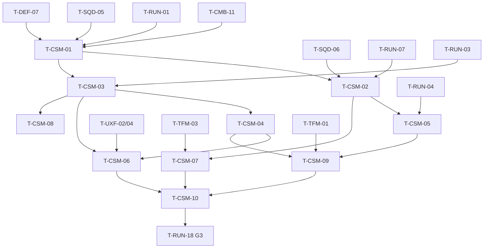

# Commander Spirit (CSM): Tasks

## 1. Summary

Ten P3 tasks. Anchors T-CSM-01…05 build the flow (death → spirit, camera + commanding, respawn, revive, placement). T-CSM-06…10 add the HUD, overlay reuse, feedback, Functional Tests and the G3 checks that feed the gate item "Hero death stays playable through Commander Spirit Mode" (§36).

Spec: [spec.md](spec.md) · Plan: [technical-plan.md](technical-plan.md)

## 2. Task Overview

| ID | Task | Type | Phase | Priority | Dependencies | Status |
|---|---|---|---|---|---|---|
| T-CSM-01 | Hero death → Commander Spirit entry | GAMEPLAY | P3 | High | T-CMB-11, T-RUN-01, T-FND-06, T-SQD-05, T-DEF-07 | Todo |
| T-CSM-02 | Commander camera pawn + commanding squads in spirit mode | GAMEPLAY | P3 | High | T-CSM-01, T-SQD-06, T-RUN-07 | Todo |
| T-CSM-03 | Respawn timer + respawn | GAMEPLAY | P3 | High | T-CSM-01, T-RUN-03 | Todo |
| T-CSM-04 | Revive charge | GAMEPLAY | P3 | High | T-CSM-03 | Todo |
| T-CSM-05 | Limited tower/defense interaction in spirit mode | GAMEPLAY | P3 | Medium | T-CSM-02, T-DEF-07, T-RUN-04 | Todo |
| T-CSM-06 | Commander Spirit HUD (banner, countdown, charges, respawn marker) | UI | P3 | High | T-CSM-03, T-CSM-04, T-UXF-02, T-UXF-04 | Todo |
| T-CSM-07 | Tactical overlay in spirit mode | UI | P3 | Medium | T-CSM-02, T-TFM-03 | Todo |
| T-CSM-08 | Spirit feedback rows + post-process | VFX | P3 | Medium | T-CSM-03, T-UXF-01 | Todo |
| T-CSM-09 | Functional Tests (entry, commands, respawn, revive, Focus, resolve) | QA | P3 | High | T-CSM-04, T-CSM-05, T-TFM-01 | Todo |
| T-CSM-10 | G3 checks: Hero death playable + Q-06/Q-07 data | QA | P3 | High | T-CSM-09, T-CSM-06, T-CSM-07, T-UXF-08 | Todo |

## 3. Detailed Tasks

## P3

### T-CSM-01 — Hero death → Commander Spirit entry
**Type** GAMEPLAY · **Phase** P3

**Objective** When the Hero dies, cleanup happens in the death frame, and after the death presentation the player controls a spirit pawn in `IMC_CommanderSpirit`. The run never changes because of it.

**Related Requirements** R-CSM-01, R-CSM-02, R-CSM-11, R-CSM-12, R-CSM-13, R-CSM-15, AC-CSM-01, AC-CSM-10

**Dependencies** T-CMB-11, T-RUN-01, T-FND-06, T-SQD-05, T-DEF-07

**Implementation Notes**
- [ ] `UCommanderSpiritComponent` on `AHeroPlayerController`; `ESpiritState { Alive, Dying, Spirit, Ended }`; bind `AHeroCharacter::OnHeroDeath` whenever the controller possesses a Hero (possessed-pawn-changed hook; verify delegate name).
- [ ] On death (only if `Alive`): state `Dying`; cancel the Command Wheel via `UCommandComponent` (no order issued); cancel any placement preview via `UStructurePlacementComponent`; `ARunPlayerState` `HeroDeaths++`.
- [ ] After `DeathPresentationSeconds`: spawn `BP_CommanderSpiritPawn` above the death location; `SetViewTargetWithBlend(SpiritPawn, SpiritBlendSeconds)`; possess it (verify that possessing keeps the blend; otherwise possess after the blend); destroy the dead Hero pawn; `SetInputMode(CommanderSpirit)`; state `Spirit`.
- [ ] `IMC_CommanderSpirit` contains pan/rotate/zoom/revive, `IA_CommandWheel`, the DEF build-mode entry action; it has no `IA_TacticalFocus`, no combat actions, no `IA_Interact`.
- [ ] Bind `ARunGameState::OnRunPhaseChanged`: Resolve → clear timers, state `Ended`.
- [ ] Remove reliance on CMB's sandbox respawn: `BP_RunGameMode` has no `OnHeroDeath` binding (check).
- [ ] Telemetry `hero_death` (wave, phase, killer unit tag, game time).
- [ ] Use `UGameTuningSettings` Respawn category values (add properties).

**Expected Files / Assets** `Source/<Game>/Player/CommanderSpiritComponent.h/.cpp`, `CommanderSpiritRules.h` (enum), `Content/<Game>/Core/Input/IMC_CommanderSpirit`, `IA_SpiritPan`, `IA_SpiritRotate`, `IA_SpiritZoom`, `IA_Revive`, `BP_HeroPlayerController` (component added)

**Test Case** `L_SiegeSite_Proto` during W1 with the Command Wheel open → `KillHero` → wheel closes, no order; 1.5 s death montage; 0.75 s blend; WASD now moves the spirit camera; run phase still Wave.

**Acceptance Criteria**
- [ ] Spirit control within 2.5 s with defaults.
- [ ] No order issued and nothing spent by the death-frame cleanup.
- [ ] Run phase/result unchanged; a second `OnHeroDeath` is ignored.

**Verification** PIE steps above; `FT_Spirit_Enter` in T-CSM-09.

---

### T-CSM-02 — Commander camera pawn + commanding squads in spirit mode
**Type** GAMEPLAY · **Phase** P3

**Objective** A tactical camera that pans, rotates and zooms over the whole Siege Site, from which the player issues Guard, Attack and Retreat with the normal Command Wheel.

**Related Requirements** R-CSM-03, R-CSM-05, AC-CSM-02, AC-CSM-03, AC-CSM-04

**Dependencies** T-CSM-01, T-SQD-06, T-RUN-07

**Implementation Notes**
- [ ] `ACommanderSpiritPawn`: root scene, `USpringArmComponent` (no collision test, pitch `SpiritPitchDegrees`), `UCameraComponent`, `UFloatingPawnMovement` (verify settings); collision disabled.
- [ ] Pan: `IA_SpiritPan` input → movement in camera-yaw space at `SpiritPanSpeed`; rotate: `IA_SpiritRotate` → yaw at `SpiritYawSpeed`; zoom: `IA_SpiritZoom` → arm length between `SpiritZoomMin` and `SpiritZoomMax`.
- [ ] Fixed height plane at the Core's Z (`ponytail:` comment: add a ground trace if the VS site has large elevation changes).
- [ ] Clamp location to `ASiegeSiteBoundary::GetSiteBounds()` every move; no boundary → no clamp + warning.
- [ ] Command Wheel: confirm SQD target resolution traces from the active view target (screen centre) and works with this pawn; confirm Follow is hidden when the controller's pawn is not an `AHeroCharacter` (coordinate with SQD T-SQD-05/06 if not).
- [ ] Centre reticle widget (part of T-CSM-06; placeholder crosshair until then).
- [ ] Count orders issued while dead → per-spirit-period counter for telemetry.

**Expected Files / Assets** `Source/<Game>/Player/CommanderSpiritPawn.h/.cpp`, `Content/<Game>/Player/BP_CommanderSpiritPawn`

**Test Case** Kill the Hero → pan to the far lane → open the wheel aiming at a lane point → Guard for Infantry → Infantry moves there; aim at an enemy → Attack for Archers → Archers engage; Retreat → squads return. Pan into a corner → camera stops at the bounds.

**Acceptance Criteria**
- [ ] All three commands work for each squad from spirit mode; Follow not offered.
- [ ] A squad on Follow at death is holding (Guard) at its position.
- [ ] Camera never leaves the site bounds; zoom stays in limits.

**Verification** PIE; `FT_Spirit_Command` in T-CSM-09.

---

### T-CSM-03 — Respawn timer + respawn
**Type** GAMEPLAY · **Phase** P3

**Objective** The respawn time follows the data formula, and the Hero comes back as a fresh pawn at the respawn point with combat control.

**Related Requirements** R-CSM-07, R-CSM-08, R-CSM-12, R-CSM-14, R-CSM-15, AC-CSM-07, AC-CSM-08, AC-CSM-11

**Dependencies** T-CSM-01, T-RUN-03

**Implementation Notes**
- [ ] `FRespawnRules` + `CommanderSpirit::ComputeRespawnSeconds` (technical-plan §5) + Spec `<Game>.Spirit.RespawnFormula` (base, per death, per wave, cap, cap < base, negative inputs).
- [ ] On death: prior deaths = `HeroDeaths - 1`; wave index from `ARunGameState` (Boss step = `WaveCount + 1`); schedule the respawn timer from the death time; broadcast `OnRespawnScheduled(EndGameTime)`; schedule the `RespawnWarningSeconds` warning.
- [ ] Timer end: if the Command Wheel is open, set `bRespawnDeferred` and respawn on wheel close; cancel any placement preview.
- [ ] Respawn: find `APlayerStart` tagged `HeroRespawn` (fallback `FindPlayerStart` + warning); `GetAuthGameMode()->RestartPlayerAtPlayerStart(PC, Start)`; destroy the spirit pawn; `SetInputMode(Combat)`; state `Alive`; rebind `OnHeroDeath` on the new pawn.
- [ ] Place one `HeroRespawn` start near the Core in `L_SiegeSite_Proto`; keep build zones off it (note to DEF/level).
- [ ] State `Ended` (Resolve) cancels the timer.
- [ ] Telemetry `hero_respawn` (time dead, revive=false, orders/placements while dead).

**Expected Files / Assets** `Source/<Game>/Player/CommanderSpiritRules.h/.cpp`, `CommanderSpiritComponent.cpp`, `Source/<Game>/Tests/CommanderSpiritRules.spec.cpp`, `L_SiegeSite_Proto` (respawn start)

**Test Case** Defaults → kill the Hero 3 times in W2 → respawn after 10 s, 12 s, 14 s; each time the Hero is at the respawn point with full HP and stamina, no Staggered/Armor Broken, combat input works.

**Acceptance Criteria**
- [ ] Spec passes.
- [ ] Measured respawn times match the formula ± 0.1 s game time.
- [ ] Resolve while dead → no respawn.

**Verification** Automation Spec; PIE; `FT_Spirit_Respawn`, `FT_Spirit_Resolve` in T-CSM-09.

---

### T-CSM-04 — Revive charge
**Type** GAMEPLAY · **Phase** P3

**Objective** A limited per-run revive charge gives an instant respawn from spirit mode; no Gold or resource revive.

**Related Requirements** R-CSM-09, R-CSM-10, R-CSM-14, AC-CSM-09

**Dependencies** T-CSM-03

**Implementation Notes**
- [ ] `FRunPlayerData.ReviveCharges` initialized from `StartingReviveCharges` in `ARunPlayerState::BeginPlay` (fresh PlayerState each run because Restart reloads the map).
- [ ] `ARunPlayerState::TryConsumeReviveCharge() -> bool`, `AddReviveCharges(int32)` (for perks/rewards), `OnReviveChargesChanged`.
- [ ] `IA_Revive` in state `Spirit` only: consume → respawn now (same path as T-CSM-03, same deferral rules) + `Feedback.Spirit.ReviveUsed`; no charge → `Feedback.Spirit.ReviveDenied`.
- [ ] Ignored in `Dying` and `Ended`.
- [ ] Telemetry `hero_respawn` with `revive=true`; run-end summary includes charges used.
- [ ] Cheat `GiveReviveCharge <n>`.

**Expected Files / Assets** `Source/<Game>/Player/RunPlayerState.h/.cpp`, `CommanderSpiritComponent.cpp`

**Test Case** 1 charge → die → press Revive during the death montage (ignored) → press again in spirit mode → Hero respawns within 0.5 s, charges 0 → die again → Revive → denied feedback, timer continues.

**Acceptance Criteria**
- [ ] Charge spent exactly once per revive.
- [ ] `AddReviveCharges` updates HUD through the delegate.
- [ ] No code path spends run resource for a revive.

**Verification** PIE; `FT_Spirit_Revive` in T-CSM-09.

---

### T-CSM-05 — Limited tower/defense interaction in spirit mode
**Type** GAMEPLAY · **Phase** P3

**Objective** The player can place structures from the commander camera with the normal rules and costs; Hero-proximity interactions stay unavailable.

**Related Requirements** R-CSM-04, AC-CSM-06

**Dependencies** T-CSM-02, T-DEF-07, T-RUN-04

**Implementation Notes**
- [ ] Entering build mode from spirit mode uses DEF's `UStructurePlacementComponent` (controller-owned, R-DEF-34); placement aim from the active view target.
- [ ] On build-mode exit, return to `CommanderSpirit` input mode if the spirit state is `Spirit` (add the check where DEF restores the previous mode, or make `SetInputMode` callers ask the spirit component).
- [ ] Same spend path (`ARunGameMode::TrySpend`) and same phase rules as when alive.
- [ ] `IA_Interact` is not in `IMC_CommanderSpirit`; Interact prompts hidden while dead.
- [ ] Count placements while dead for telemetry.

**Expected Files / Assets** `CommanderSpiritComponent.cpp`, DEF build-mode exit hook (small change, coordinate with DEF)

**Test Case** Die during Intermission → enter build mode → place a Barricade in a valid zone → resource decreases by its cost → exit build mode → still in spirit camera; invalid placement shows the same red preview as when alive.

**Acceptance Criteria**
- [ ] Placement rules, costs and feedback identical to alive placement.
- [ ] Exiting build mode never switches to combat input while dead.
- [ ] No Interact while dead.

**Verification** PIE; covered in `FT_Spirit_Command` (placement step) in T-CSM-09.

---

### T-CSM-06 — Commander Spirit HUD
**Type** UI · **Phase** P3

**Objective** Spirit mode shows the banner, respawn countdown, revive charges + prompt, a centre reticle and the respawn point marker (R-CSM-06).

**Related Requirements** R-CSM-06, §28.1, spec §14

**Dependencies** T-CSM-03, T-CSM-04, T-UXF-02, T-UXF-04

**Implementation Notes**
- [ ] `WBP_CommanderSpirit` shown on `OnSpiritStateChanged(Spirit)`, hidden otherwise; Hero bars hidden in spirit mode.
- [ ] Countdown from `OnRespawnScheduled(EndGameTime)` refreshed at 4 Hz; highlight at `RespawnWarningSeconds`.
- [ ] Charges from `OnReviveChargesChanged`; prompt shows the bound key of `IA_Revive` (Enhanced Input key query; verify API).
- [ ] Respawn point marker: UXF world marker on the `HeroRespawn` start, visible only while dead, readable at max zoom.
- [ ] Core HP, forecast panel and run status stay visible.

**Expected Files / Assets** `Content/<Game>/UI/WBP_CommanderSpirit`, marker setup in `L_SiegeSite_Proto`

**Test Case** Die → banner, countdown 10 → 0, "Revive (R) ×1", reticle, marker at the respawn point; zoom out fully → marker still readable.

**Acceptance Criteria**
- [ ] Every element updates from delegates; no gameplay state in the widget.
- [ ] Hero HUD rebinds to the new pawn after respawn (with UXF).

**Verification** PIE screenshots in the playtest note.

---

### T-CSM-07 — Tactical overlay in spirit mode
**Type** UI · **Phase** P3

**Objective** Reuse the Tactical Focus overlay while dead so the player reads squads, lane pressure, enemy classes, tower HP, routes and zones from above.

**Related Requirements** R-CSM-05, AC-CSM-05

**Dependencies** T-CSM-02, T-TFM-03

**Implementation Notes**
- [ ] On state `Spirit`: `RequestTacticalOverlay(CommanderSpirit, true)`; on leaving `Spirit`: `false`.
- [ ] Predicted routes from T-TFM-06 show too when available (same request).
- [ ] No time dilation (overlay only).
- [ ] Check readability at spirit zoom levels; note marker scale issues for UXF.

**Expected Files / Assets** `CommanderSpiritComponent.cpp`

**Test Case** Die → squad icons, enemy class icons, tower HP bars, zone outlines appear; respawn → they hide (unless Focus is active).

**Acceptance Criteria**
- [ ] Overlay on exactly while in `Spirit`.
- [ ] No flicker when the Hero dies during Focus (reason hand-over).

**Verification** PIE; `FT_Spirit_DeathInFocus` in T-CSM-09.

---

### T-CSM-08 — Spirit feedback rows + post-process
**Type** VFX · **Phase** P3

**Objective** Spirit mode reads as "dead but in command" through post-process, audio and toasts (spec §14).

**Related Requirements** R-CSM-02, R-CSM-06, spec §14

**Dependencies** T-CSM-03, T-UXF-01

**Implementation Notes**
- [ ] Post-process on the spirit pawn camera (desaturation + vignette placeholder material) so it applies only while viewing through it.
- [ ] `DT_Feedback` rows: `Feedback.Spirit.Enter`, `RespawnSoon`, `Respawn`, `ReviveUsed`, `ReviveDenied` (placeholder SFX, Niagara pillar at the respawn point).
- [ ] Audio: muffled battle sound mix while in spirit mode (Sound Mix push/pop on enter/exit).
- [ ] Production list item "Commander Spirit view: distinct post-process" (production-plan.md) satisfied with placeholders.

**Expected Files / Assets** `Content/<Game>/Feedback/` rows, `M_PP_CommanderSpirit` (placeholder), `NS_HeroRespawn`, SFX placeholders

**Test Case** Die → desaturated view + whoosh + muffled mix → respawn → pillar VFX + sting, colors and mix back to normal.

**Acceptance Criteria**
- [ ] Every spec §14 row has visual and audio placeholders.
- [ ] Mix and post-process always restored after respawn and at Resolve.

**Verification** PIE; UXF feedback audit (T-UXF-09).

---

### T-CSM-09 — Functional Tests
**Type** QA · **Phase** P3

**Objective** Automated regression for the death → spirit → respawn contract.

**Related Requirements** AC-CSM-01…AC-CSM-12

**Dependencies** T-CSM-04, T-CSM-05, T-TFM-01

**Implementation Notes**
- [ ] `FT_Spirit_Enter`: kill Hero in a wave → spirit state within 2.5 s; run phase unchanged.
- [ ] `FT_Spirit_Command`: kill Hero → issue Guard/Attack/Retreat through the `UCommandComponent` API (same entry the wheel uses) → squad orders change; place one structure from spirit mode → cost spent.
- [ ] `FT_Spirit_Respawn`: three deaths → measured times 10/12/14 s (test data may shorten values); new pawn has full HP/stamina, no states.
- [ ] `FT_Spirit_Revive`: 1 charge used, second denied.
- [ ] `FT_Spirit_DeathInFocus`: enter Focus, kill Hero → global time dilation 1.0 in that frame.
- [ ] `FT_Spirit_Resolve`: kill Hero, then `DamageCore` to 0 → no respawn after the timer.
- [ ] Add to the CLI group `<Game>.Spirit.`.

**Expected Files / Assets** `Content/<Game>/Maps/Test/FT_Spirit_*` (6 maps or one map with 6 tests)

**Test Case** CLI runner `<Game>.Spirit.` → all tests + formula Spec pass.

**Acceptance Criteria**
- [ ] All pass from the command line, < 2 min total.

**Verification** CLI output attached to the G3 review.

---

### T-CSM-10 — G3 checks: Hero death playable + Q-06/Q-07 data
**Type** QA · **Phase** P3

**Objective** Evidence for the G3 item "Hero death stays playable through Commander Spirit Mode" and data to answer Q-06 (timer formula) and Q-07 (token vs Gold).

**Related Requirements** AC-CSM-13, AC-CSM-14, R-CSM-15, master plan §3 G3 checklist

**Dependencies** T-CSM-09, T-CSM-06, T-CSM-07, T-UXF-08

**Implementation Notes**
- [ ] Runs inside the G3 session (T-RUN-18). Ensure every tester dies at least once; if not, the observer uses `KillHero` once in W3 and notes it.
- [ ] From telemetry per run: deaths, respawn times, total time dead, % of spirit periods with ≥ 1 order or placement, revives used and when.
- [ ] Ask after Resolve: "When you were dead, did you have something useful to do?" (yes/partly/no), "Did respawn times feel fair?" (too short/fair/too long), "Did you save the revive charge or use it? Why?"
- [ ] Pass rule proposed for the review: no run blocked by a death; majority "yes"/"partly" on the first question; ≥ 50% of spirit periods contain an action. Values are review defaults, set at G3.
- [ ] Write formula and revive recommendations (keep / change values) for Q-06 and Q-07 in the G3 document.

**Expected Files / Assets** Section "Commander Spirit" in `ai/game/playtests/G3-<date>.md`

**Test Case** G3 session completes with at least one death per tester and the three answers recorded.

**Acceptance Criteria**
- [ ] Data table and answers recorded per tester.
- [ ] Q-06/Q-07 recommendation written (KEEP / CHANGE values).

**Verification** G3 review document.

## 4. Dependency Graph

## 5. Integration / Regression Checklist

- [ ] Sandbox maps still use CMB's sandbox respawn (no CSM component behavior without `ARunGameMode`).
- [ ] Command Wheel works the same alive and dead (SQD regression).
- [ ] Placement works alive and dead; input mode returns correctly (DEF regression).
- [ ] Perks still apply after respawn on the new pawn (PRK regression).
- [ ] HUD bars bind to the new pawn after respawn (UXF regression).
- [ ] Focus exits on death; no stuck time dilation (TFM regression).
- [ ] RUN P3 Functional Tests still pass with deaths injected.

## 6. Final Definition of Done

All AC-CSM-01…14 pass; formula Spec and `FT_Spirit_*` pass from the CLI; every [TUNABLE] value in `UGameTuningSettings`; G3 document has the Commander Spirit section with Q-06/Q-07 recommendations; no blocker bug in the death/respawn flow.
