# Commander Spirit (CSM): Technical Plan

| | |
|---|---|
| Spec | [spec.md](spec.md) |
| Architecture baseline | [00-foundation/technical-plan.md](../00-foundation/technical-plan.md), master plan D-01…D-18 |
| Phase | P3 |
| Status | Draft v1. All paths and class names are proposals. |

## 1. Technical Overview

A `UCommanderSpiritComponent` on `AHeroPlayerController` listens for `AHeroCharacter::OnHeroDeath`. After the death presentation it spawns an `ACommanderSpiritPawn` (spring arm + camera + floating movement), blends the view to it, possesses it and switches input to `IMC_CommanderSpirit`. Commanding and placement keep working because `UCommandComponent` (SQD) and `UStructurePlacementComponent` (DEF) live on the controller and aim from the active view target. A pure function computes the respawn time; a timer respawns the Hero through the standard `AGameModeBase::RestartPlayerAtPlayerStart` as a fresh pawn. Revive charges live in `FRunPlayerData` on `ARunPlayerState`.

No new framework: one component, one pawn, one pure function, one widget.

## 2. Existing System Impact

| System | Impact |
|---|---|
| CMB | CSM binds `OnHeroDeath`. Run maps use `BP_RunGameMode`, so the sandbox respawn binding in `BP_SandboxGameMode` (T-CMB-11) never runs there. Dead hero pawn is destroyed after the spirit pawn is possessed |
| SQD | No new squad code. Needs: wheel aims from the active view target (already planned), Follow → Guard on Hero death (NEW-SQD-05), Follow option hidden when the controller has no `AHeroCharacter` (confirm in T-SQD-05) |
| DEF | Placement component on the controller is reused (R-DEF-34). Leaving build mode must return to the spirit input mode, not combat |
| RUN | Reads phase/wave index; writes `HeroDeaths` and `ReviveCharges` in `FRunPlayerData`; uses `ASiegeSiteBoundary::GetSiteBounds()` |
| TFM | Calls the overlay request API with reason `CommanderSpirit`; relies on TFM's own force-exit on Hero death |
| PRK | A fresh Hero pawn on respawn means pawn-side perk effects must be re-applied when the PlayerState's pawn changes (PRK must support pawn change) |
| UXF | HUD must rebind Hero bars on pawn change; `Feedback.Spirit.*` rows; telemetry events |
| FND | Input mode `CommanderSpirit` in `AHeroPlayerController::SetInputMode`; Respawn category in `UGameTuningSettings`; `KillHero` cheat |

## 3. Proposed Architecture

### 3.1 Runtime owner and lifetime
| Object | Owner | Lifetime |
|---|---|---|
| `UCommanderSpiritComponent` | `AHeroPlayerController` | Controller lifetime (whole run) |
| `ACommanderSpiritPawn` | Spawned by the component | From spirit entry to respawn; destroyed on respawn |
| Revive charges, death count | `ARunPlayerState` (`FRunPlayerData`) | Run |
| Respawn point | `APlayerStart` tagged `HeroRespawn` in the map | Map |

### 3.2 Main UE types
| Type | Kind | Responsibility |
|---|---|---|
| `UCommanderSpiritComponent` | `UActorComponent` (C++) | Flow FSM, timers, revive, respawn, input mode switch, overlay request, telemetry |
| `ACommanderSpiritPawn` | `APawn` (C++) + `BP_CommanderSpiritPawn` | `USpringArmComponent`, `UCameraComponent` (post-process settings), `UFloatingPawnMovement` (verify), bounds clamp, pan/rotate/zoom handlers |
| `FRespawnRules` | USTRUCT in `Player/CommanderSpiritRules.h` | Copy of the Respawn settings used by the pure function |
| `CommanderSpirit::ComputeRespawnSeconds` | Pure function | R-CSM-07 formula |
| `ESpiritState` | UENUM | `Alive, Dying, Spirit, Ended` |
| `WBP_CommanderSpirit` | UMG | Banner, countdown, charges + prompt, centre reticle |
| `IMC_CommanderSpirit`, `IA_SpiritPan`, `IA_SpiritRotate`, `IA_SpiritZoom`, `IA_Revive` | Enhanced Input assets | Spirit input; `IA_CommandWheel` and the build entry action are added to the context too |

### 3.3 Data ownership
- Definition: `UGameTuningSettings` Respawn category (global; move to `URunDefinition` only when difficulty levels need per-run values, §25.1).
- Runtime: spirit state and respawn end time on the component; deaths and charges in `FRunPlayerData` (plain ints, D-14).
- Presentation: widget, post-process on the spirit camera, feedback rows.

### 3.4 Communication flow
- Hero → component: `OnHeroDeath` delegate (bound in the controller's possessed-pawn-changed hook; verify the UE 5.x delegate name, e.g. `OnPossessedPawnChanged`).
- Component → controller: `Possess`, `SetViewTargetWithBlend`, `SetInputMode(CommanderSpirit/Combat)`.
- Component → SQD/DEF: cancel wheel / cancel preview calls on their controller components.
- Component → TFM: `RequestTacticalOverlay(Reason, bool)`.
- Component → GameMode: `RestartPlayerAtPlayerStart(Controller, Start)` (engine API).
- `ARunGameState::OnRunPhaseChanged(Resolve)` → component enters `Ended`.
- Component → observers: `OnSpiritStateChanged`, `OnRespawnScheduled`; `ARunPlayerState::OnReviveChargesChanged`.

### 3.5 C++ / Blueprint split
C++: component, pawn movement/clamp, formula, flow. Blueprint: `BP_CommanderSpiritPawn` (camera values, post-process material), `WBP_CommanderSpirit`, input assets, feedback rows.

### 3.6 Asset references and loading
Spirit pawn class and widget class are referenced from `BP_HeroPlayerController` (small assets, hard references fine).

### 3.7 AI / navigation impact
None new. The dead Hero must not stay targetable: the pawn is destroyed after spirit entry; during the death presentation its collision is already off (CMB death handling; confirm) and `UHealthComponent` reports dead so ENM local aggro drops it.

### 3.8 UI impact
`WBP_CommanderSpirit` shown in Spirit state; Hero bars hidden. Countdown text from `RespawnEndGameTime` refreshed at 4 Hz. Respawn point marker via the UXF world marker component on a `BP_HeroRespawnPoint` (or a marker spawned at the tagged start).

### 3.9 Save impact
None (A-11). `HeroDeaths` and `ReviveCharges` are ints in `FRunPlayerData`, covered by RUN's snapshot spec (T-RUN-15).

### 3.10 Performance risks
None significant. The spirit pawn's tick runs only while possessed. Overlay cost is measured by TFM (T-TFM-11).

### 3.11 Existing systems reused
`AGameModeBase::RestartPlayerAtPlayerStart`, `APlayerStart` tags, `SetViewTargetWithBlend`, `UFloatingPawnMovement`, `USpringArmComponent`, `UCommandComponent`, `UStructurePlacementComponent`, TFM overlay, UXF markers/feedback/telemetry, `UGameTuningSettings`, `KillHero` cheat.

### 3.12 New types / files (proposed)
```text
Source/<Game>/Player/CommanderSpiritComponent.h/.cpp
Source/<Game>/Player/CommanderSpiritPawn.h/.cpp
Source/<Game>/Player/CommanderSpiritRules.h/.cpp      FRespawnRules, ESpiritState, ComputeRespawnSeconds
Source/<Game>/Tests/CommanderSpiritRules.spec.cpp
Content/<Game>/Player/BP_CommanderSpiritPawn
Content/<Game>/Core/Input/IMC_CommanderSpirit, IA_SpiritPan, IA_SpiritRotate, IA_SpiritZoom, IA_Revive
Content/<Game>/UI/WBP_CommanderSpirit
Content/<Game>/Maps/Test/FT_Spirit_*
```

### 3.13 Trade-offs
| Choice | Alternative | Why this |
|---|---|---|
| Fresh Hero pawn via `RestartPlayerAtPlayerStart` | Revive the same actor | Engine path already used by the sandbox (T-CMB-11); no leftover combat/anim state. Cost: PRK and HUD must handle pawn change (they should anyway) |
| Possessed spirit pawn | Camera actor + view target only | Free movement component and input routing; Command Wheel aim works through the view target unchanged |
| Fixed-height camera plane (Core Z) + zoom | Ground-following height | Prototype site is mostly flat. `ponytail: fixed plane, add a 10 Hz ground trace if the VS site has large elevation changes` |
| Respawn values in `UGameTuningSettings` | In `URunDefinition` | Matches Foundation (Respawn category); per-run values are speculative until difficulty exists |
| Screen-centre aim | Mouse cursor aim | Same aim model as third person and Tactical Focus; gamepad-ready (§29.2) |

### 3.14 Verification
Automation Spec for the formula; Functional Tests in `FT_Spirit_*`; PIE checks in `L_SiegeSite_Proto`; G3 checks (T-CSM-10).

## 4. Runtime Flow

```mermaid
stateDiagram-v2
  [*] --> Alive
  Alive --> Dying: OnHeroDeath (cleanup: wheel, preview, lock-on; TFM exits itself)
  Dying --> Spirit: DeathPresentationSeconds elapsed, blend + possess spirit pawn
  Spirit --> Alive: respawn timer done (deferred while wheel open)
  Spirit --> Alive: revive charge spent
  Dying --> Ended: run resolved
  Spirit --> Ended: run resolved
  Alive --> Ended: run resolved
  Ended --> [*]
```



```mermaid
sequenceDiagram
  participant H as AHeroCharacter
  participant C as UCommanderSpiritComponent
  participant PC as AHeroPlayerController
  participant GM as ARunGameMode
  participant PS as ARunPlayerState
  H->>C: OnHeroDeath
  C->>PS: HeroDeaths++ ; read prior deaths
  C->>C: T = ComputeRespawnSeconds(rules, prior, wave) ; schedule timers
  C->>PC: cancel wheel, cancel placement preview
  Note over C: DeathPresentationSeconds
  C->>PC: spawn spirit pawn, SetViewTargetWithBlend, Possess, SetInputMode(CommanderSpirit)
  C->>C: RequestTacticalOverlay(CommanderSpirit, on) ; destroy dead hero
  Note over C: respawn timer fires (or Revive)
  C->>GM: RestartPlayerAtPlayerStart(PC, HeroRespawn)
  GM-->>PC: new AHeroCharacter possessed
  C->>PC: SetInputMode(Combat) ; overlay off ; destroy spirit pawn
```

## 5. State / Data

| Setting (`UGameTuningSettings`, Respawn) | Placeholder | Notes |
|---|---|---|
| `DeathPresentationSeconds` | 1.5 | Death montage readable |
| `SpiritBlendSeconds` | 0.75 | View blend |
| `RespawnBaseSeconds` | 10 | First death |
| `RespawnPerDeathSeconds` | 2 | Per prior death |
| `RespawnPerWaveSeconds` | 0 | Per wave after W1 (§18.3 option) |
| `RespawnMaxSeconds` | 20 | Cap ("tăng nhẹ") |
| `StartingReviveCharges` | 1 | Per run |
| `RespawnWarningSeconds` | 3 | `Feedback.Spirit.RespawnSoon` |
| `SpiritPanSpeed` / `SpiritYawSpeed` | 2500 cm/s / 90 °/s | Camera |
| `SpiritZoomMin` / `SpiritZoomMax` / `SpiritPitchDegrees` | 1500 / 5000 cm / −55° | Camera |

Formula (pure, R-CSM-07):
```text
ComputeRespawnSeconds(R, PriorDeaths, WaveIndex):
  t = R.Base + R.PerDeath * max(PriorDeaths, 0) + R.PerWave * max(WaveIndex - 1, 0)
  return clamp(t, R.Base, max(R.Max, R.Base))
```
`WaveIndex` = `ARunGameState.WaveNumber`, or `WaveCount + 1` during the Boss step.

## 6. Main Implementation Areas

| Area | Task |
|---|---|
| Death → spirit entry, cleanup, possession, input | T-CSM-01 |
| Spirit pawn camera + commanding squads | T-CSM-02 |
| Respawn timer + respawn | T-CSM-03 |
| Revive charges | T-CSM-04 |
| Placement from spirit mode | T-CSM-05 |
| Spirit HUD | T-CSM-06 |
| Overlay reuse | T-CSM-07 |
| Feedback + post-process | T-CSM-08 |
| Functional Tests | T-CSM-09 |
| G3 checks | T-CSM-10 |

## 7. Error and Edge-Case Handling

| Case | Handling |
|---|---|
| `OnHeroDeath` fires twice | Ignored unless state is `Alive` |
| Respawn while wheel open | Set `bRespawnDeferred`; bind wheel closed; respawn on close |
| Respawn during placement preview | Cancel preview first |
| No `HeroRespawn` start | `FindPlayerStart` fallback + warning |
| Bounds missing | No clamp + warning |
| Resolve | Clear timers, state `Ended`, keep the current view |
| Pawn spawn fails | Retry next frame up to 3 times, then log error and restart via `RestartPlayer` default |

## 8. Testing Strategy

| Level | What |
|---|---|
| Automation Spec | Formula: base, per death, per wave, cap, negative inputs, cap < base |
| Functional Test | `FT_Spirit_Enter` (death → spirit within time, run unchanged), `FT_Spirit_Command` (Guard/Attack/Retreat issued from spirit), `FT_Spirit_Respawn` (timer values, fresh pawn state), `FT_Spirit_Revive` (charge use/deny), `FT_Spirit_DeathInFocus` (time scale 1.0), `FT_Spirit_Resolve` (no respawn) |
| PIE manual | Camera feel, readability from above, placement from spirit |
| Playtest | G3 checks (T-CSM-10) |

## 9. Performance Risks

| Risk | Mitigation |
|---|---|
| Overlay with many markers while dead | Measured by TFM T-TFM-11 |
| Pawn spawn hitch on respawn | Small actor; check in Insights during T-CSM-09 |

## 10. Dependencies and Risks

| Item | Note |
|---|---|
| Possess vs view target blend order | Verify in UE docs that `Possess` does not cut the blend; if it does, possess first and blend from a temporary camera |
| PRK pawn change | Fresh pawn requires PRK to re-apply pawn-side effects on pawn change. Not covered by a PRK anchor; raise with PRK (T-PRK-01) |
| HUD pawn change | UXF HUD must rebind on pawn change (T-UXF-02) |
| SQD Follow option while dead | Confirm the wheel hides Follow when no Hero pawn (T-SQD-05) |
| Input mode return after build | FND `SetInputMode` is a switch, not a stack; DEF build exit must return to `CommanderSpirit` while dead (T-CSM-05 adds the check) |
| Mouse wheel | Used by SQD to cycle commands while the wheel is open and by spirit zoom otherwise; `IMC_CommandWheel` must have higher priority |
| D-xx | No change request |

## 11. Requirement Coverage

| Requirement | Technical Area | Notes |
|---|---|---|
| R-CSM-01 | No resolve call in CSM | RUN owns results |
| R-CSM-02 | Dying timer, blend, possess | T-CSM-01 |
| R-CSM-03 | `UCommandComponent` via view target; SQD Follow → Guard | T-CSM-02 |
| R-CSM-04 | `UStructurePlacementComponent` from spirit; no `IA_Interact` in context | T-CSM-05 |
| R-CSM-05 | Spirit pawn, bounds clamp, overlay request | T-CSM-02, T-CSM-07 |
| R-CSM-06 | `WBP_CommanderSpirit`, respawn marker | T-CSM-06 |
| R-CSM-07 | `ComputeRespawnSeconds` + settings | T-CSM-03 |
| R-CSM-08 | `RestartPlayerAtPlayerStart`, deferral | T-CSM-03 |
| R-CSM-09 | `FRunPlayerData.ReviveCharges`, `IA_Revive` | T-CSM-04 |
| R-CSM-10 | Not built | Documented |
| R-CSM-11 | Death-frame cleanup | T-CSM-01 |
| R-CSM-12 | Phase listener, Ended state | T-CSM-01, T-CSM-03 |
| R-CSM-13 | `IMC_CommanderSpirit` without `IA_TacticalFocus` | T-CSM-01 |
| R-CSM-14 | `ARunPlayerState` data | T-CSM-03, T-CSM-04 |
| R-CSM-15 | Telemetry events | T-CSM-01, T-CSM-03, T-CSM-04 |
