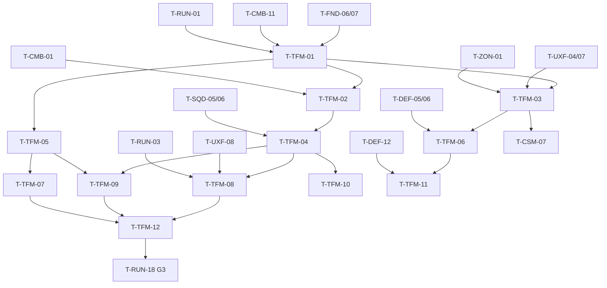

# Tactical Focus (TFM): Tasks

## 1. Summary

Twelve P3 tasks (A-01). Anchors T-TFM-01…05 build the meter and time dilation, the tactical camera, the overlay, commands in Focus, and the anti-exploit rules with the boss restriction hook. T-TFM-06…12 add the predicted route display, meter HUD and feedback, telemetry, Functional Tests, the time-dilation side-effect audit, an overlay performance check and the G3 checks with the telemetry acceptance metric (% of combat time in Focus).

Spec: [spec.md](spec.md) · Plan: [technical-plan.md](technical-plan.md)

## 2. Task Overview

| ID | Task | Type | Phase | Priority | Dependencies | Status |
|---|---|---|---|---|---|---|
| T-TFM-01 | `UTacticalFocusComponent` meter + time dilation rules | GAMEPLAY | P3 | High | T-FND-06, T-FND-07, T-CMB-11, T-RUN-01 | Todo |
| T-TFM-02 | Tactical camera transition | GAMEPLAY | P3 | High | T-TFM-01, T-CMB-01 | Todo |
| T-TFM-03 | Tactical overlay (overlay component, markers, zones, tower HP, lane pressure) | UI | P3 | High | T-TFM-01, T-UXF-04, T-UXF-07, T-ZON-01 | Todo |
| T-TFM-04 | Commands while in Focus + `IMC_TacticalFocus` | GAMEPLAY | P3 | High | T-TFM-02, T-SQD-05, T-SQD-06 | Todo |
| T-TFM-05 | Anti-exploit rules + boss restriction hook | GAMEPLAY | P3 | High | T-TFM-01 | Todo |
| T-TFM-06 | Predicted route display | UI | P3 | Medium | T-TFM-03, T-DEF-05, T-DEF-06 | Todo |
| T-TFM-07 | Focus meter HUD + feedback rows | UI | P3 | High | T-TFM-05, T-UXF-01, T-UXF-02 | Todo |
| T-TFM-08 | Focus telemetry (share of combat time) | TOOLS | P3 | High | T-TFM-04, T-UXF-08, T-RUN-03 | Todo |
| T-TFM-09 | Functional Tests (enter/exit, drain, exits, wheel, restriction, combat blocked) | QA | P3 | High | T-TFM-04, T-TFM-05 | Todo |
| T-TFM-10 | Time-dilation side-effect audit | QA | P3 | High | T-TFM-04 | Todo |
| T-TFM-11 | Overlay performance at the enemy cap | PERF | P3 | Medium | T-TFM-06, T-DEF-12 | Todo |
| T-TFM-12 | G3 checks + telemetry acceptance metric | QA | P3 | High | T-TFM-08, T-TFM-09, T-TFM-07 | Todo |

## 3. Detailed Tasks

## P3

### T-TFM-01 — `UTacticalFocusComponent` meter + time dilation rules
**Type** GAMEPLAY · **Phase** P3

**Objective** Holding Focus slows the world to `FocusTimeScale` while a real-time meter drains; release or an empty meter restores full speed in the same frame; the meter recharges only in normal play.

**Related Requirements** R-TFM-01…R-TFM-06, R-TFM-08, R-TFM-15, R-TFM-16, AC-TFM-01, AC-TFM-02, AC-TFM-03, AC-TFM-11

**Dependencies** T-FND-06, T-FND-07, T-CMB-11, T-RUN-01

**Implementation Notes**
- [ ] `FTacticalFocusMeter` + free functions (`TickActive`, `TickInactive`, `OnExit`, `CanEnter`) per technical-plan §4; Spec `<Game>.Focus.Meter` (drain, no refill while active, delay, rate, frozen while dead).
- [ ] Focus category in `UGameTuningSettings` (§5 table); validation: `FocusTimeScale` in 0.1–0.9 (warn outside 0.2–0.3), capacity > `MinMeterToEnterSeconds`, rate > 0.
- [ ] `UTacticalFocusComponent` on `AHeroPlayerController`: bind `IA_TacticalFocus` Started → `TryEnter`, Completed/Canceled → `Exit(Released)`.
- [ ] Real delta: read `UWorld::DeltaRealTimeSeconds` or `FApp::GetDeltaTime()` (verify which excludes dilation); tick enabled only while active or recharging.
- [ ] Enter: `SetGlobalTimeDilation(EffectiveTimeScale)` then `SetInputMode(TacticalFocus)`; exit: dilation 1.0 first, then input mode back, then `Meter.OnExit`.
- [ ] Forced exit + entry block on: Hero `OnHeroDeath`, `ARunGameState::OnRunPhaseChanged` to PerkChoice/Resolve, CSM spirit state ≠ Alive; meter frozen while dead.
- [ ] `EndPlay` and `ARunGameMode::StartRun` force dilation 1.0.
- [ ] CVar `game.debug.Focus 1`: meter, state, current global dilation on screen.
- [ ] Delegates `OnFocusStateChanged`, `OnFocusMeterChanged` (throttled 20 Hz real).

**Expected Files / Assets** `Source/<Game>/Player/TacticalFocusMeter.h/.cpp`, `TacticalFocusComponent.h/.cpp`, `Source/<Game>/Tests/TacticalFocusMeter.spec.cpp`, `Content/<Game>/Core/Input/IA_TacticalFocus`, `IMC_TacticalFocus` (minimal), `Core/GameTuningSettings` (Focus properties)

**Test Case** PIE `L_SiegeSite_Proto` W1 → hold Focus → `game.debug.Focus` shows dilation 0.25 → keep holding → exits at 5.0 s real (stopwatch / log timestamps) with dilation 1.0 → wait 1.5 s → meter rises 0.33 per second.

**Acceptance Criteria**
- [ ] Spec passes.
- [ ] Dilation changes in the press and release frames (log frame numbers).
- [ ] Death, PerkChoice and Resolve force-exit; no entry while dead.

**Verification** Automation Spec; PIE; `FT_Focus_EnterExit`, `FT_Focus_Drain`, `FT_Focus_Death`, `FT_Focus_Phase` in T-TFM-09.

---

### T-TFM-02 — Tactical camera transition
**Type** GAMEPLAY · **Phase** P3

**Objective** On enter the view rises and zooms out to the tactical pose in real time; on exit it returns to the third-person camera without delaying control.

**Related Requirements** R-TFM-08, R-TFM-09, R-TFM-17, AC-TFM-06

**Dependencies** T-TFM-01, T-CMB-01

**Implementation Notes**
- [ ] `ATacticalFocusCamera` (`UCameraComponent` + post-process settings), spawned once per controller.
- [ ] On enter: copy the current camera POV (`PlayerCameraManager` location/rotation/FOV), `SetViewTarget(TacticalCamera)` with no engine blend, interpolate to the target pose over `CameraEnterBlendSeconds` using real delta. Target pose: Hero location + yaw-rotated offset (`CameraDistance`, `CameraHeight`), pitch `CameraPitch`, yaw from control rotation, `CameraFOV`.
- [ ] While active: follow the Hero and control yaw with real-delta smoothing (camera actor reads real delta; it must not depend on its dilated tick delta).
- [ ] On exit: dilation is already 1.0 (T-TFM-01 order) → `SetViewTargetWithBlend(Hero, CameraExitBlendSeconds)`; input already restored.
- [ ] Post-process: desaturation + outline placeholder material on the tactical camera only.
- [ ] Camera collision: none in the prototype (high pose); note if it clips terrain on the Siege Site.

**Expected Files / Assets** `Source/<Game>/Player/TacticalFocusCamera.h/.cpp`, `Content/<Game>/Player/BP_TacticalFocusCamera`, `M_PP_TacticalFocus` (placeholder)

**Test Case** Hold Focus → camera reaches the tactical pose in 0.2 s real (not 0.8 s) while enemies move at quarter speed; mouse look rotates the view; release → full-speed control in the same frame, camera back within 0.1 s.

**Acceptance Criteria**
- [ ] Enter blend duration measured in real time.
- [ ] Exit never blocks input.
- [ ] Mouse look and Hero movement direction stay consistent (camera yaw = control yaw).

**Verification** PIE with `game.debug.Focus`; screen capture of enter/exit at 60 fps for the playtest note.

---

### T-TFM-03 — Tactical overlay
**Type** UI · **Phase** P3

**Objective** One overlay switch, shared with CSM, that shows squad icons, enemy class icons, tower HP, tactical zones and lane pressure.

**Related Requirements** R-TFM-10, AC-TFM-07

**Dependencies** T-TFM-01, T-UXF-04, T-UXF-07, T-ZON-01

**Implementation Notes**
- [ ] `UTacticalOverlayComponent` on the controller: `Request(FName Reason, bool bOn)`; visible when the reason set is not empty; `OnTacticalOverlayChanged`.
- [ ] On change: set the UXF world marker system to its tactical display mode (squad, enemy class, structure HP, zone icons all visible; API per T-UXF-04; if missing, add it with UXF).
- [ ] Lane pressure: show the T-UXF-07 lane danger level per lane in world space (lane label/icon at each lane entry, colored by level); routes get the same color in T-TFM-06.
- [ ] Focus component requests reason `Focus` on enter/exit; CSM requests `CommanderSpirit` (T-CSM-07); cheat `ShowTacticalOverlay 0/1` uses `Debug`.
- [ ] Readability pass: icon size and color rules from §28.2 (ally blue, enemy red, elite/siege accent, state colors).

**Expected Files / Assets** `Source/<Game>/Player/TacticalOverlayComponent.h/.cpp`, `Content/<Game>/UI/WBP_LanePressureMarker` (if UXF has no lane marker)

**Test Case** W2 with 3 squads, 2 towers, enemies on both lanes → hold Focus → all squad icons, Armored/Swarm icons, both tower HP bars, bridge/high ground/chokepoint zone icons and two lane pressure markers are visible; release → hidden. Request `CommanderSpirit` and `Focus` together, remove `Focus` → overlay stays.

**Acceptance Criteria**
- [ ] Five element types visible in Focus (routes come in T-TFM-06).
- [ ] Reason set prevents flicker on overlapping requests.
- [ ] No gameplay state held by the overlay.

**Verification** PIE; screenshot in the playtest note; `FT_Focus_EnterExit` checks the overlay flag.

---

### T-TFM-04 — Commands while in Focus + `IMC_TacticalFocus`
**Type** GAMEPLAY · **Phase** P3

**Objective** During Focus the player can issue all four squad commands through the normal Command Wheel, aiming from the tactical camera, while combat actions are unavailable.

**Related Requirements** R-TFM-11, R-TFM-12, R-TFM-18, AC-TFM-08, AC-TFM-09

**Dependencies** T-TFM-02, T-SQD-05, T-SQD-06

**Implementation Notes**
- [ ] `IMC_TacticalFocus`: `IA_Move`, `IA_Look`, `IA_TacticalFocus`, `IA_CommandWheel`. `SetInputMode(TacticalFocus)` removes `IMC_Combat` and adds this context; SQD adds `IMC_CommandWheel` on top when the wheel opens.
- [ ] Verify SQD target resolution uses the active view target (tactical camera centre) and that the wheel works with the camera at height (trace length ≥ camera distance + `MaxCommandDistance`).
- [ ] Focus release / depletion while the wheel is open: Focus exits, the input mode returns to Combat with `IMC_CommandWheel` still on top, the wheel stays open (coordinate with SQD on mode switching while open).
- [ ] Wheel Hold trigger timing under dilation: check in T-TFM-10; if the hold threshold stretches, enable the trigger's time-dilation option (verify name) or document.
- [ ] Count orders issued while Focus is active (bind `UCommandComponent` order-issued delegate) for T-TFM-08.

**Expected Files / Assets** `Content/<Game>/Core/Input/IMC_TacticalFocus`, `TacticalFocusComponent.cpp`

**Test Case** §33 13:00 scenario: both lanes attacked → hold Focus → wheel: Infantry Guard on the right-lane chokepoint zone, Archers Attack an Armored, Follow for the third squad, Retreat one squad → release → all four orders executing; pressing attack during Focus does nothing.

**Acceptance Criteria**
- [ ] All four commands issued in one Focus use.
- [ ] Wheel survives Focus exit.
- [ ] No combat action fires in Focus.

**Verification** PIE; `FT_Focus_WheelRelease`, `FT_Focus_CombatBlocked` in T-TFM-09.

---

### T-TFM-05 — Anti-exploit rules + boss restriction hook
**Type** GAMEPLAY · **Phase** P3

**Objective** Toggle spam can never gain meter, depletion locks entry until the threshold, and a boss phase can restrict but never disable Focus. The design ceiling stays under the anti-goal limit.

**Related Requirements** R-TFM-07, R-TFM-13, R-TFM-14 (a), AC-TFM-04, AC-TFM-05, AC-TFM-10, AC-TFM-12

**Dependencies** T-TFM-01

**Implementation Notes**
- [ ] `OnExit` restarts the recharge delay on every exit; `CanEnter` requires `!bLocked && Current >= MinMeterToEnterSeconds`; depletion sets `bLocked`; lock clears at the threshold.
- [ ] Entry only on the `Started` trigger event; holding after a forced exit never re-enters.
- [ ] Denied entry → `Feedback.Focus.Denied`, counter `FocusDenied`.
- [ ] `FTacticalFocusRestriction` + `Clamp()` (technical-plan §5); `ApplyRestriction` recomputes effective settings, clamps `Current` to the new capacity; `ClearRestriction` restores; `OnFocusRestrictionChanged`.
- [ ] Note for BOS: author restrictions in boss phase data; apply on phase enter, clear on phase exit and boss death/reset.
- [ ] Spec additions: 20 s of 0.5 s taps → meter never increases; lock/unlock; held key after depletion; restriction clamp (capacity 0 request → entry still possible); `DesignDutyCycle(current settings) <= MaxDesignDutyCycle`.
- [ ] Cheats `FocusRestrict <cap> <scale> <rate>` and `FocusRestrictClear`.

**Expected Files / Assets** `TacticalFocusMeter.h/.cpp`, `TacticalFocusComponent.cpp`, `TacticalFocusMeter.spec.cpp`

**Test Case** Meter at 3 s → tap Focus 40 times over 20 s → meter ≤ 3 s at the end. `FocusRestrict 0 0.5 0.5` → capacity clamped to ~1.25 s, dilation 0.5 in Focus, entry still possible.

**Acceptance Criteria**
- [ ] All Spec cases pass, including the duty-cycle guard (≈ 23% with defaults).
- [ ] Restriction never makes entry impossible.

**Verification** Automation Spec; PIE cheats; `FT_Focus_Restriction` in T-TFM-09.

---

### T-TFM-06 — Predicted route display
**Type** UI · **Phase** P3

**Objective** In the overlay, each lane's current enemy route is drawn on the ground and colored by lane pressure.

**Related Requirements** R-TFM-10 (predicted route), AC-TFM-07

**Dependencies** T-TFM-03, T-DEF-05, T-DEF-06

**Implementation Notes**
- [ ] `ATacticalRouteDisplay`: per lane, a `USplineComponent` built from the DEF route query polyline + `USplineMeshComponent` segments (placeholder arrow material), hidden by default.
- [ ] Rebuild a lane only on DEF route invalidation (blocked, structure destroyed, minimum-break target changed); while hidden, mark dirty and rebuild on show.
- [ ] Show the minimum-break target structure (if any) with a marker at the route break point.
- [ ] Color from lane pressure level (T-TFM-03 source).
- [ ] Visible with the overlay (any reason).

**Expected Files / Assets** `Source/<Game>/UI/TacticalRouteDisplay.h/.cpp`, `Content/<Game>/UI/BP_TacticalRouteDisplay`, `M_RouteArrow` (placeholder)

**Test Case** Two open lanes → Focus shows two routes → place a Barricade sealing one lane → in Focus the route ends at the Barricade with a break marker → destroy it → route continues to the Core.

**Acceptance Criteria**
- [ ] Routes match DEF's current routes after every invalidation.
- [ ] No rebuild while nothing changed (log count).

**Verification** PIE with `game.debug.Lanes` to compare against DEF debug draw.

---

### T-TFM-07 — Focus meter HUD + feedback rows
**Type** UI · **Phase** P3

**Objective** The player always sees the meter, its lock and any restriction, and hears/sees every Focus state change (spec §14).

**Related Requirements** R-TFM-07, R-TFM-13, spec §14

**Dependencies** T-TFM-05, T-UXF-01, T-UXF-02

**Implementation Notes**
- [ ] `WBP_FocusMeter` in `WBP_GameHUD`: fill from `OnFocusMeterChanged` (real-time value, no UMG animation for the fill), threshold tick mark, lock icon, restriction frame + reduced capacity mark.
- [ ] `DT_Feedback` rows: `Feedback.Focus.Enter`, `Exit`, `MeterLow`, `Depleted`, `Denied`, `Ready`, `Restricted` (placeholder SFX/VFX).
- [ ] Slow-time audio: low-pass Sound Mix pushed on enter, popped on exit (always popped on forced exits too).
- [ ] Hidden while dead (CSM HUD replaces it) and at Resolve.

**Expected Files / Assets** `Content/<Game>/UI/WBP_FocusMeter`, feedback rows, Sound Mix asset

**Test Case** Drain to 0 → low warning at 1 s, depleted sound, lock icon → recharge to threshold → ready chime, lock gone → apply a restriction → frame color change.

**Acceptance Criteria**
- [ ] Every spec §14 row has a placeholder visual and audio.
- [ ] Sound Mix is never left pushed after any exit path.

**Verification** PIE; UXF feedback audit (T-UXF-09).

---

### T-TFM-08 — Focus telemetry (share of combat time)
**Type** TOOLS · **Phase** P3

**Objective** Every run logs how much of combat time the player spends in Focus, so the §3 anti-goal is measured, not guessed.

**Related Requirements** R-TFM-14 (b), AC-TFM-13

**Dependencies** T-TFM-04, T-UXF-08, T-RUN-03

**Implementation Notes**
- [ ] Counters in the Focus component (technical-plan §5): entries, denied, depleted exits, forced exits, Focus real seconds, combat real seconds (phase Wave/Boss and Hero alive), orders in Focus, orders total.
- [ ] Real seconds from the same real delta used by the meter.
- [ ] Log `focus_wave` at each wave/boss end and `focus_run` at Resolve via T-UXF-08: all counters + `FocusShare = FocusRealSeconds / CombatRealSeconds`.
- [ ] Also log each Focus use (`focus_use`: start game time, real duration, exit reason, orders issued) for distribution analysis.
- [ ] Extend the playtest log reader/README with the share calculation.

**Expected Files / Assets** `TacticalFocusComponent.cpp`, playtest README section

**Test Case** Short P3 run: hold Focus 5 s in W1 (combat 60 s real) → `focus_wave` W1 shows FocusRealSeconds 5.0 ± 0.1, share ≈ 0.083.

**Acceptance Criteria**
- [ ] Counters match a stopwatch run within 0.1 s.
- [ ] Combat time excludes Prep, Intermission, PerkChoice and time dead.

**Verification** PIE + log inspection.

---

### T-TFM-09 — Functional Tests
**Type** QA · **Phase** P3

**Objective** Automated regression for Focus rules with time dilation active.

**Related Requirements** AC-TFM-01…AC-TFM-11

**Dependencies** T-TFM-04, T-TFM-05

**Implementation Notes**
- [ ] Drive Focus through the component API (same calls as the input bindings) so tests do not need simulated keys.
- [ ] `FT_Focus_EnterExit`: dilation 0.25 after enter, 1.0 after exit, overlay flag on/off.
- [ ] `FT_Focus_Drain`: exit after 5 s real (test measures real time).
- [ ] `FT_Focus_Death`: kill Hero in Focus → 1.0 in the same frame; entry blocked while dead.
- [ ] `FT_Focus_Phase`: force PerkChoice phase → exit; entry blocked.
- [ ] `FT_Focus_WheelRelease`: open wheel in Focus, exit → wheel still open.
- [ ] `FT_Focus_Restriction`: apply/clear; capacity-0 request clamped.
- [ ] `FT_Focus_CombatBlocked`: light attack request in Focus → no attack action started.
- [ ] Add to CLI group `<Game>.Focus.`.

**Expected Files / Assets** `Content/<Game>/Maps/Test/FT_Focus_*`

**Test Case** CLI runner `<Game>.Focus.` → 7 Functional Tests + meter Spec pass.

**Acceptance Criteria**
- [ ] All pass from the command line, < 2 min total; global dilation is 1.0 at the end of every test.

**Verification** CLI output attached to the G3 review.

---

### T-TFM-10 — Time-dilation side-effect audit
**Type** QA · **Phase** P3

**Objective** Find and fix or document everything that misbehaves at 0.25 global dilation (risk register "Time dilation side effects").

**Related Requirements** R-TFM-17, D-13

**Dependencies** T-TFM-04

**Implementation Notes**
- [ ] Checklist run with Focus held (or `SetTimeDilation 0.25` cheat) and recorded in `ai/game/10-tactical-focus/dilation-audit.md`:
  - [ ] Gameplay timers (CMB windows, stamina regen, SYN state expiry, squad/enemy decision timers, DIR spawns, RUN step timers) slow consistently, none stuck.
  - [ ] Animation notifies and montage end events still fire.
  - [ ] Enhanced Input timed triggers (Command Wheel hold): real vs dilated threshold (verify option name for the pinned UE).
  - [ ] UMG animations, HUD countdowns, Focus meter: real vs dilated.
  - [ ] Audio pitch/time unaffected or intended; Sound Mix restored.
  - [ ] Niagara effects slow as expected; no burst on exit.
  - [ ] Projectiles (Ballista/Bombard) and physics stable at low dilation.
  - [ ] Hit stop (T-UXF-03) does not change global dilation during Focus.
  - [ ] Camera managers / spring arm lag behave.
- [ ] File a fix task or a "documented, accepted" line for each failure.

**Expected Files / Assets** `ai/game/10-tactical-focus/dilation-audit.md`

**Test Case** Full W2 played with repeated Focus use → no stuck state, no missed notify, global dilation 1.0 after every exit (CVar readout).

**Acceptance Criteria**
- [ ] Every checklist line marked OK / fixed / accepted with reason.
- [ ] Hit stop confirmed as per-actor dilation (or a fix task exists).

**Verification** Audit document reviewed before G3.

---

### T-TFM-11 — Overlay performance at the enemy cap
**Type** PERF · **Phase** P3

**Objective** Focus with the full overlay stays within the frame budget at the concurrent enemy cap.

**Related Requirements** R-TFM-10, §31.2, D-15

**Dependencies** T-TFM-06, T-DEF-12

**Implementation Notes**
- [ ] Packaged Development build on the reference PC (T-FND-08); scene at the enemy cap from T-DEF-12 with 3 squads and max structures.
- [ ] Capture Unreal Insights traces: 10 s normal, 10 s Focus with overlay (enter/exit spikes included).
- [ ] Record frame time delta, marker draw/update cost, spline rebuild cost, post-process cost.
- [ ] If over budget: report to UXF (marker architecture) and propose NEW-TFM-6 (Swarm aggregation) instead of cutting overlay elements.

**Expected Files / Assets** Results section in `ai/game/10-tactical-focus/dilation-audit.md` or `perf-focus.md`; traces stored outside git

**Test Case** Enemy cap scene → Focus on → frame time within the budget recorded in T-FND-08; enter/exit spike < one frame budget.

**Acceptance Criteria**
- [ ] Numbers recorded with build ID and hardware.
- [ ] Pass or a written follow-up decision.

**Verification** Insights traces + note.

---

### T-TFM-12 — G3 checks + telemetry acceptance metric
**Type** QA · **Phase** P3

**Objective** Show at G3 that Focus helps big decisions and does not become the dominant way to play (§3, §12.1).

**Related Requirements** R-TFM-14, AC-TFM-14, master plan §3 G3 checklist, risk register "Tactical Focus becomes the dominant mode"

**Dependencies** T-TFM-08, T-TFM-09, T-TFM-07

**Implementation Notes**
- [ ] Runs inside the G3 session (T-RUN-18).
- [ ] From `focus_run`/`focus_wave` per tester: Focus share of combat time, entries per wave, depleted-exit rate, orders in Focus / orders total, use during the split-pressure wave (W4).
- [ ] Acceptance metric (review defaults, [TUNABLE] targets): **median Focus share ≤ 15%** across testers and **no tester above 25%** (design ceiling ≈ 23% with default data). Informational: ≥ half of testers use Focus at least once in W4.
- [ ] Interpretation: share near the ceiling for most testers → Focus is dominant → CHANGE (longer recharge, lower capacity). Share near 0 and no W4 use → Focus has no value → CHANGE overlay/clarity, not more slow time.
- [ ] Ask: "When did you use Tactical Focus, and why?", "Did you ever want to stay in it longer?" Record answers.
- [ ] Recommend Q-01 / Q-02 values (KEEP / CHANGE) in the G3 document.

**Expected Files / Assets** Section "Tactical Focus" in `ai/game/playtests/G3-<date>.md`

**Test Case** G3 telemetry for every tester contains `focus_run`; the share table and both thresholds are evaluated.

**Acceptance Criteria**
- [ ] Share table per tester with median and max.
- [ ] Pass/fail against both thresholds written with a KEEP / CHANGE decision.
- [ ] Q-01 / Q-02 recommendation recorded.

**Verification** G3 review document.

## 4. Dependency Graph

## 5. Integration / Regression Checklist

- [ ] Global time dilation is 1.0 after every exit path (release, depletion, death, PerkChoice, Resolve, map change).
- [ ] Combat input and Command Wheel work normally after Focus (CMB/SQD regression).
- [ ] RUN step timers and pacing log consistent with Focus use.
- [ ] CSM overlay request still works with Focus overlay logic changes.
- [ ] Hit stop during Focus does not reset dilation (UXF).
- [ ] Focus Functional Tests and meter Spec pass from the CLI.
- [ ] No Tick left enabled on Focus components when inactive and full.

## 6. Final Definition of Done

All AC-TFM-01…14 pass; meter Spec (including anti-spam and duty-cycle guard) and `FT_Focus_*` pass from the CLI; dilation audit and overlay perf notes written; every [TUNABLE] value in `UGameTuningSettings`; G3 document has the Tactical Focus section with the share metric result and Q-01/Q-02 recommendations.
