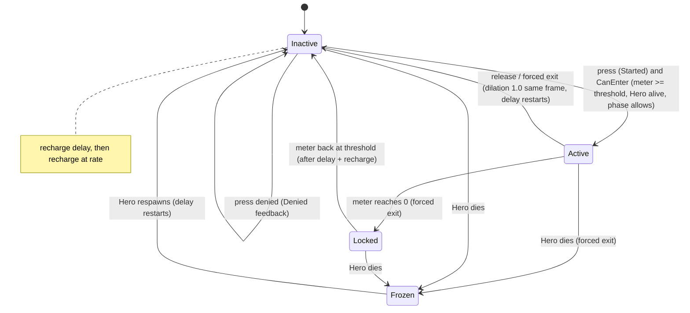

# Tactical Focus (TFM): Technical Plan

| | |
|---|---|
| Spec | [spec.md](spec.md) |
| Architecture baseline | [00-foundation/technical-plan.md](../00-foundation/technical-plan.md), master plan D-01…D-18 (D-12, D-13 central here) |
| Phase | P3 |
| Status | Draft v1. All paths and class names are proposals. |

## 1. Technical Overview

Two controller components and one camera actor:

- `UTacticalFocusComponent` owns the Focus Meter (a plain struct with pure update functions), enter/exit rules, global time dilation, input mode switch, restrictions and telemetry counters.
- `UTacticalOverlayComponent` owns overlay visibility as a set of request reasons (`Focus`, `CommanderSpirit`, `Debug`). When the set becomes non-empty it switches UXF markers to their tactical display mode and shows the predicted-route display; when empty it hides them. CSM uses it without Focus.
- `ATacticalFocusCamera` is a camera actor that interpolates to the tactical pose using real delta time. The controller switches its view target to it on enter and back to the Hero on exit.

Global time dilation is set with `UGameplayStatics::SetGlobalTimeDilation` (D-13). Anything that must stay responsive reads real delta time instead of game delta.

## 2. Existing System Impact

| System | Impact |
|---|---|
| FND | `TacticalFocus` input mode in `AHeroPlayerController::SetInputMode`; `IMC_TacticalFocus`, `IA_TacticalFocus`; Focus category in `UGameTuningSettings`; CVar `game.debug.Focus` |
| CMB | No change. Hero keeps moving at dilated speed; combat actions unmapped in Focus. Reads `OnHeroDeath` |
| SQD | Command Wheel used unchanged; its aim from the active view target makes it work from the tactical camera. SQD never touches time (R-SQD-07) |
| UXF | Needs a global tactical display mode on the world marker system (T-UXF-04) and lane danger values (T-UXF-07). Hit stop (T-UXF-03) must not write global time dilation |
| DEF | Reads lane routes (T-DEF-05) and route invalidation events (T-DEF-06) for the route display |
| ZON | Zone icons are UXF markers; nothing new in ZON |
| RUN | Reads phase (PerkChoice/Resolve exits; combat time = Wave/Boss) |
| CSM | Calls `UTacticalOverlayComponent::Request(CommanderSpirit, bool)`; TFM exits itself on Hero death |
| BOS | Calls `UTacticalFocusComponent::ApplyRestriction/ClearRestriction` on phase enter/exit |

## 3. Proposed Architecture

### 3.1 Runtime owner and lifetime
| Object | Owner | Lifetime |
|---|---|---|
| `UTacticalFocusComponent` | `AHeroPlayerController` | Controller (run); survives Hero death so the meter value persists |
| `UTacticalOverlayComponent` | `AHeroPlayerController` | Controller |
| `ATacticalFocusCamera` | Spawned once by the Focus component | Controller lifetime; hidden/idle when not in use |
| `ATacticalRouteDisplay` | Spawned once by the overlay component | Map; rebuilt on route invalidation |

### 3.2 Main UE types
| Type | Kind | Responsibility |
|---|---|---|
| `FTacticalFocusMeter` | USTRUCT + free functions in `Player/TacticalFocusMeter.h` | `Current`, `Capacity`, `RechargeDelayRemaining`, `bLocked`; `TickActive(RealDt)`, `TickInactive(RealDt, bHeroAlive)`, `CanEnter()`, `OnExit()`; pure, Spec-tested |
| `FTacticalFocusSettings` | USTRUCT | Snapshot of settings × restriction (effective values); `ComputeDesignDutyCycle()` |
| `FTacticalFocusRestriction` | USTRUCT (BlueprintType) | `CapacityMultiplier`, `TimeScaleOverride`, `RechargeRateMultiplier`; `Clamp()` guarantees R-TFM-13 |
| `UTacticalFocusComponent` | `UActorComponent` (C++) | Input handling, enter/exit, dilation, input mode, camera switch, overlay request, restriction, telemetry |
| `UTacticalOverlayComponent` | `UActorComponent` (C++) | Reason set, UXF marker mode, route display visibility |
| `ATacticalFocusCamera` | `AActor` + `UCameraComponent` (post-process) | Real-time follow and enter blend |
| `ATacticalRouteDisplay` | `AActor` with `USplineComponent` + `USplineMeshComponent` per lane | Predicted routes colored by lane pressure |
| `WBP_FocusMeter` | UMG | Meter, lock, restriction icon |

### 3.3 Data ownership
- Settings: `UGameTuningSettings` Focus category (global tunables, D-06).
- Restriction data: `FTacticalFocusRestriction` authored in BOS phase data (struct defined here).
- Runtime: meter struct and flags on the component (no save need; meter resets per run).
- Overlay content: owned by UXF (markers), DEF (routes), ZON (zones). TFM only toggles visibility.

### 3.4 Communication flow
- `IA_TacticalFocus` Started → `TryEnter()`; Completed/Canceled → `Exit(Released)`.
- `AHeroCharacter::OnHeroDeath`, `ARunGameState::OnRunPhaseChanged`, CSM `OnSpiritStateChanged` → `Exit(Forced)` + block.
- Component → controller: `SetInputMode(TacticalFocus/Combat)`, `SetViewTarget`.
- Component → overlay: `Request(Focus, bool)` → UXF marker mode + route display.
- DEF `OnRouteInvalidated` → route display rebuild for that lane (only while visible; otherwise mark dirty).
- Component → HUD: `OnFocusMeterChanged` (broadcast at most every 0.05 s real time while changing).
- BOS → component: `ApplyRestriction(const FTacticalFocusRestriction&)`, `ClearRestriction()`.

### 3.5 C++ / Blueprint split
C++: meter, rules, dilation, input, camera interpolation, overlay reasons, route display build. Blueprint: `BP_TacticalFocusCamera` (pose values, post-process material), `BP_TacticalRouteDisplay` (spline mesh and material), `WBP_FocusMeter`, input assets, feedback rows.

### 3.6 Asset references and loading
Camera, route display and widget classes referenced from `BP_HeroPlayerController`; small assets, hard references.

### 3.7 AI / navigation impact
None. AI slows with the world (decision timers on game time, D-13). Route display only reads DEF data.

### 3.8 UI impact
`WBP_FocusMeter` in `WBP_GameHUD` (always visible, small). Overlay elements are UXF markers in tactical mode. UMG animations on the meter must run in real time (verify whether UMG animations are affected by global time dilation; if they are, drive the meter fill from the real-time value instead of an animation).

### 3.9 Save impact
None. Meter resets at run start.

### 3.10 Performance risks
| Risk | Note |
|---|---|
| Marker count in tactical mode (Swarm × enemy cap) | Main cost; measured in T-TFM-11 |
| Spline mesh rebuild | Only on route invalidation, per lane |
| Component tick | Enabled only while active, recharging or blending |

### 3.11 Existing systems reused
`UGameplayStatics::SetGlobalTimeDilation`, Enhanced Input triggers (Started/Completed), `SetViewTarget(WithBlend)`, camera post-process settings, `USplineComponent`/`USplineMeshComponent`, UXF markers and telemetry, DEF route query, SQD Command Wheel.

### 3.12 New types / files (proposed)
```text
Source/<Game>/Player/TacticalFocusMeter.h/.cpp      FTacticalFocusMeter, FTacticalFocusSettings, FTacticalFocusRestriction
Source/<Game>/Player/TacticalFocusComponent.h/.cpp
Source/<Game>/Player/TacticalOverlayComponent.h/.cpp
Source/<Game>/Player/TacticalFocusCamera.h/.cpp
Source/<Game>/UI/TacticalRouteDisplay.h/.cpp
Source/<Game>/Tests/TacticalFocusMeter.spec.cpp
Content/<Game>/Player/BP_TacticalFocusCamera, BP_TacticalRouteDisplay
Content/<Game>/Core/Input/IA_TacticalFocus, IMC_TacticalFocus
Content/<Game>/UI/WBP_FocusMeter
Content/<Game>/Maps/Test/FT_Focus_*
```

### 3.13 Trade-offs
| Choice | Alternative | Why this |
|---|---|---|
| Global time dilation (D-13) | Per-actor dilation of enemies/allies only | Decision already made; one switch slows everything consistently |
| Meter as pure struct | Logic inside the component | Spec-testable without a world; anti-exploit rules are the risky part |
| Separate overlay component with reasons | Overlay inside Focus component | CSM needs the overlay without Focus; reasons avoid on/off fights during death-in-Focus |
| Own camera actor with real-time interpolation | Engine view-target blend for enter | Engine blend timing under dilation is uncertain; manual interpolation is predictable. Exit uses the engine blend after dilation is already 1.0 |
| Remove `IMC_Combat` during Focus | Keep it and consume actions | Explicit list of what works in Focus; no accidental attacks |
| Splines for routes | Debug lines | `DrawDebug*` is compiled out of Shipping; splines are shippable and stylable |

### 3.14 Verification
Automation Spec for the meter (including anti-spam and ceiling), Functional Tests `FT_Focus_*`, time-dilation audit checklist (T-TFM-10), packaged-build overlay benchmark (T-TFM-11), G3 telemetry acceptance (T-TFM-12).

## 4. Runtime Flow



Meter update (pure, real-time `Dt`):
```text
TickActive(M, Dt):            M.Current = max(0, M.Current - Dt); if M.Current == 0: M.bLocked = true  (caller exits)
OnExit(M, S):                 M.RechargeDelayRemaining = S.RechargeDelay      // every exit restarts the delay
TickInactive(M, S, Dt, Alive):
  if !Alive: return                                   // frozen while dead
  if M.RechargeDelayRemaining > 0: M.RechargeDelayRemaining -= Dt; return
  M.Current = min(S.Capacity, M.Current + S.RechargeRate * Dt)
  if M.bLocked and M.Current >= S.MinToEnter: M.bLocked = false
CanEnter(M, S):               !M.bLocked and M.Current >= S.MinToEnter
DesignDutyCycle(S):           S.Capacity / (S.Capacity + S.RechargeDelay + S.Capacity / S.RechargeRate)
```

Enter / exit order (same frame):
```text
Enter: SetGlobalTimeDilation(EffectiveTimeScale) → SetInputMode(TacticalFocus) → camera starts real-time blend
       → Overlay.Request(Focus, true) → Feedback.Focus.Enter → telemetry counter
Exit:  SetGlobalTimeDilation(1.0) → SetInputMode(Combat or current) → SetViewTargetWithBlend(Hero, ExitBlend)
       → Overlay.Request(Focus, false) → Meter.OnExit → Feedback.Focus.Exit/Depleted → telemetry
```

## 5. State / Data

| Setting (`UGameTuningSettings`, Focus) | Default | Source |
|---|---|---|
| `FocusTimeScale` | 0.25 | §12.3 "20–30%", Q-02 |
| `MeterCapacitySeconds` | 5.0 | §12.3 "~5 s", Q-01 |
| `RechargeDelaySeconds` | 1.5 | Placeholder |
| `RechargeRatePerSecond` | 0.33 | Placeholder (full in ~15 s) |
| `MinMeterToEnterSeconds` | 1.0 | Placeholder |
| `MeterLowWarningSeconds` | 1.0 | Placeholder |
| `CameraHeight` / `CameraDistance` / `CameraPitch` / `CameraFOV` | 1200 cm / 1600 cm / −50° / 80 | Placeholders |
| `CameraEnterBlendSeconds` / `CameraExitBlendSeconds` | 0.2 / 0.1 (real time) | Placeholders |
| `MaxDesignDutyCycle` | 0.25 | R-TFM-14 guard |

`FTacticalFocusRestriction::Clamp()`: `CapacityMultiplier` in [MinToEnter/Capacity + 0.05, 1]; `RechargeRateMultiplier` in [0.25, 1]; `TimeScaleOverride` 0 = no override, else in [`FocusTimeScale`, 0.9].

Telemetry counters (per wave, reset at wave start; summed per run): `FocusEntries`, `FocusDenied`, `FocusDepletedExits`, `FocusForcedExits`, `FocusRealSeconds`, `CombatRealSeconds` (Wave/Boss phase, Hero alive), `OrdersInFocus`, `OrdersTotal` (from `UCommandComponent` order delegate).

## 6. Main Implementation Areas

| Area | Task |
|---|---|
| Meter + dilation + enter/exit | T-TFM-01 |
| Tactical camera | T-TFM-02 |
| Overlay component + marker mode + lane pressure | T-TFM-03 |
| Commands in Focus + input context | T-TFM-04 |
| Anti-exploit + boss restriction | T-TFM-05 |
| Predicted route display | T-TFM-06 |
| Meter HUD + feedback | T-TFM-07 |
| Telemetry | T-TFM-08 |
| Functional Tests | T-TFM-09 |
| Time-dilation side-effect audit | T-TFM-10 |
| Overlay performance | T-TFM-11 |
| G3 checks + acceptance metric | T-TFM-12 |

## 7. Error and Edge-Case Handling

| Case | Handling |
|---|---|
| Dilation stuck after an unexpected path (component destroyed, map change) | `EndPlay` and `Exit` both force 1.0; `ARunGameMode` sets 1.0 at `StartRun` |
| Another system wrote global dilation | `game.debug.Focus 1` shows the current global value; Functional Test asserts 1.0 after exit; hit stop must use per-actor dilation (UXF) |
| Input focus loss while held | Meter drains to 0 → forced exit; verify Enhanced Input flushes keys on focus loss |
| Restriction extremes | `Clamp()`; log when clamping changed a value |
| Phase blocks entry | `CanEnter` also checks phase ∉ {PerkChoice, Resolve} and spirit state `Alive` |
| Hold continues after forced exit | Re-entry only on `Started`, never on `Triggered`/held |

## 8. Testing Strategy

| Level | What |
|---|---|
| Automation Spec | Drain, no refill while active, delay restart on every exit, rate, threshold, lock/unlock, frozen while dead, tap-spam scenario (20 s of 0.5 s taps → no gain), restriction clamp, design duty cycle ≤ `MaxDesignDutyCycle` with current settings |
| Functional Test | `FT_Focus_EnterExit` (dilation values same frame), `FT_Focus_Drain` (5 s real), `FT_Focus_Death` (death exit), `FT_Focus_Phase` (PerkChoice exit), `FT_Focus_WheelRelease` (wheel stays open), `FT_Focus_Restriction`, `FT_Focus_CombatBlocked` |
| Audit | T-TFM-10 checklist with dilation 0.25 |
| PERF | Packaged build, enemy cap, Focus on/off frame time |
| Playtest | Share metric (T-TFM-12) |

## 9. Performance Risks

| Risk | Mitigation |
|---|---|
| Hundreds of marker widgets in tactical mode | UXF marker design (one HUD canvas vs widget components); measure at cap; NEW-TFM-6 aggregation if needed |
| Post-process cost on the tactical camera | Simple material; measure |
| Frequent meter broadcasts | Throttle to 20 Hz real time |

## 10. Dependencies and Risks

| Item | Note |
|---|---|
| UXF marker global mode | T-UXF-04 must offer a tactical display mode toggle (proposal: a setter on the marker system's world-level owner, e.g. `UFeedbackSubsystem` or a marker subsystem; name per 13-hud-feedback). Not explicit in the anchor; needed by T-TFM-03 |
| UXF hit stop | T-UXF-03 must use per-actor `CustomTimeDilation`, not global dilation; otherwise hit stop resets Focus to 1.0. Needs confirmation from UXF |
| Lane pressure values | Reuse T-UXF-07 lane danger values; if they are HUD-internal, expose them on a queryable owner |
| Enhanced Input timed triggers under dilation | The wheel's Hold trigger may stretch in real time during Focus; verify the timed trigger time-dilation option for the pinned UE version (T-TFM-10) |
| UMG animations under dilation | Verify (T-TFM-10) |
| Run step timers slow in Focus | Accepted by RUN; pacing log uses real time |
| D-13 | Kept. No change request; risk handled by the single-writer rule R-TFM-17 |

## 11. Requirement Coverage

| Requirement | Technical Area | Notes |
|---|---|---|
| R-TFM-01 | `IA_TacticalFocus` Started/Completed | T-TFM-01 |
| R-TFM-02 | `SetGlobalTimeDilation(EffectiveTimeScale)` | T-TFM-01 |
| R-TFM-03 | Settings validation | T-TFM-01 |
| R-TFM-04 | `FTacticalFocusMeter::TickActive` (real Dt) | T-TFM-01 |
| R-TFM-05 | No recharge path while active | T-TFM-01 |
| R-TFM-06 | `TickInactive` delay + rate | T-TFM-01 |
| R-TFM-07 | `OnExit` delay restart, `CanEnter`, lock, Started-only entry | T-TFM-05 |
| R-TFM-08 | Exit order, same frame | T-TFM-01, T-TFM-02 |
| R-TFM-09 | `ATacticalFocusCamera` | T-TFM-02 |
| R-TFM-10 | `UTacticalOverlayComponent`, UXF markers, route display | T-TFM-03, T-TFM-06 |
| R-TFM-11 | `IMC_TacticalFocus` with `IA_CommandWheel`; view-target aim | T-TFM-04 |
| R-TFM-12 | `IMC_Combat` removed during Focus | T-TFM-04 |
| R-TFM-13 | `FTacticalFocusRestriction::Clamp`, apply/clear API | T-TFM-05 |
| R-TFM-14 | Duty-cycle Spec; telemetry share | T-TFM-05, T-TFM-08, T-TFM-12 |
| R-TFM-15 | Death/phase/spirit exits | T-TFM-01 |
| R-TFM-16 | Spirit check, frozen meter | T-TFM-01 |
| R-TFM-17 | Single writer, real-time paths, audit | T-TFM-10 |
| R-TFM-18 | Enhanced Input actions | T-TFM-04 |
