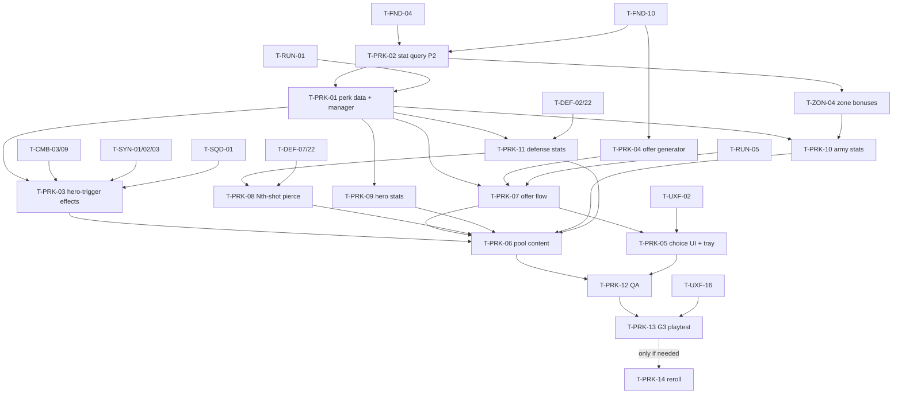

# Perks (PRK): Tasks

## 1. Summary

14 tasks. `T-PRK-02` (P2) ships the stat modifier query that ZON uses for zone bonuses. P3 tasks build perk data, effects, offers, UI, stat read points in Hero/Army/Defense code and the 11-perk pool, then verify build diversity at G3. `T-PRK-14` (reroll) is conditional on the G3 playtest. Spec: [spec.md](spec.md). Plan: [technical-plan.md](technical-plan.md).

## 2. Task Overview

| ID | Task | Type | Phase | Priority | Dependencies | Status |
|---|---|---|---|---|---|---|
| T-PRK-02 | Stat modifier query (`Stat.*` tags), actor-scoped, used by zone bonuses first | GAMEPLAY | P2 | High | T-FND-04, T-FND-10 | Todo |
| T-PRK-01 | `UPerkDefinition` + `UPerkEffect` + `UPerkManagerComponent` on `ARunPlayerState` | GAMEPLAY | P3 | High | T-PRK-02, T-RUN-01, T-FND-07 | Todo |
| T-PRK-04 | 1-of-3 offer generation with weights, pure logic + Spec | GAMEPLAY | P3 | High | T-FND-10 | Todo |
| T-PRK-07 | Offer flow: pool asset, manager offer state, RUN step integration | GAMEPLAY | P3 | High | T-PRK-01, T-PRK-04, T-RUN-05 | Todo |
| T-PRK-05 | Perk choice UI + HUD perk tray | UI | P3 | High | T-PRK-07, T-UXF-02 | Todo |
| T-PRK-03 | Event-triggered perk effects (hero triggers) | GAMEPLAY | P3 | High | T-PRK-01, T-CMB-03, T-CMB-09, T-SYN-01, T-SYN-02, T-SYN-03, T-SQD-01 | Todo |
| T-PRK-09 | Hero stat read points (`Stat.Hero.*`) | GAMEPLAY | P3 | Medium | T-PRK-01, T-CMB-03, T-CMB-06, T-SYN-02 | Todo |
| T-PRK-10 | Army stat read points + squad identity tags | GAMEPLAY | P3 | Medium | T-PRK-01, T-SQD-07, T-SQD-10, T-ZON-04 | Todo |
| T-PRK-11 | Defense stat read points + structure identity tags | GAMEPLAY | P3 | Medium | T-PRK-01, T-DEF-02, T-DEF-22 | Todo |
| T-PRK-08 | Every Nth Ballista shot pierces | GAMEPLAY | P3 | Medium | T-PRK-11, T-DEF-22, T-DEF-07 | Todo |
| T-PRK-06 | Initial perk pool content (11 perks) | DESIGN | P3 | High | T-PRK-03, T-PRK-07, T-PRK-08, T-PRK-09, T-PRK-10, T-PRK-11 | Todo |
| T-PRK-12 | Perk Functional Tests + regression | QA | P3 | High | T-PRK-06, T-PRK-05 | Todo |
| T-PRK-13 | G3 build-diversity playtest | QA | P3 | High | T-PRK-12, T-UXF-16, T-UXF-11, T-RUN-03 | Todo |
| T-PRK-14 | Reroll (conditional on T-PRK-13 decision) | GAMEPLAY | P3 | Low | T-PRK-13, T-PRK-05 | Todo |

## 3. Detailed Tasks

## P2

### T-PRK-02 — Stat modifier query (`Stat.*` tags), actor-scoped
**Type** GAMEPLAY · **Phase** P2

**Objective** One query that returns a stat value after modifiers, so ZON can apply zone bonuses without touching squad code paths twice.

**Related Requirements** R-PRK-01..06, AC-PRK-01, AC-PRK-02, AC-PRK-03 (with ZON)

**Dependencies** T-FND-04 (tags), T-FND-10 (test harness)

**Consumers (not dependencies)** T-ZON-04

**Implementation Notes**
- [ ] `Perks/StatModifierTypes.h`: `EStatModOp {Add, Multiply}`, `FStatModifier {FGameplayTag Stat; EStatModOp Op; float Magnitude;}` (`BlueprintType`), `FStatModifierHandle {int32 Id}`.
- [ ] `Perks/StatModifierSubsystem` (`UWorldSubsystem`, game worlds only): `AddModifier(const FStatModifier&, AActor* Target, UObject* Source) → Handle`, `RemoveModifier(Handle)`, `RemoveModifiersFromSource(UObject*)`, `GetStat(const AActor* Target, FGameplayTag Stat, float Base) const`, static `GetStatFor(...)` that returns `Base` when the world/subsystem is missing. All `BlueprintCallable`/`BlueprintPure` where useful.
- [ ] Formula from technical plan §5.1; exact tag match; clamp ≥ 0.
- [ ] Entries hold `TWeakObjectPtr` for target and source; invalid ones are skipped in `GetStat` and compacted on the next add/remove.
- [ ] `OnStatModifiersChanged(FGameplayTag)` native multicast, fired on add/remove.
- [ ] Native tags in `Perks/StatTags.h/.cpp`: `Stat.Army.RangedRange`, `Stat.Army.BlockEfficiency`, `Stat.Army.ReformSpeed` (names proposed; ZON may rename in T-ZON-04, then update the registry in spec §13.1).
- [ ] CVar `game.debug.Stats 1`: on-screen list of active modifiers (target, stat, op, magnitude, source).
- [ ] Mark the linear scan with a `ponytail:` comment (ceiling: hundreds of modifiers; upgrade: per-target cache).

**Expected Files / Assets** `Source/<Game>/Perks/StatModifierTypes.h`, `StatModifierSubsystem.h/.cpp`, `StatTags.h/.cpp`, `Source/<Game>/Tests/StatModifier.spec.cpp`

**Test Case** Spec: target A base 10, Add +2, Multiply +0.5 → 18. Add second Multiply −2.0 → clamps to 0. Remove source → 10. Modifier on A, query B → 10. Destroy A's actor → no crash, entry gone after next add.

**Acceptance Criteria**
- [ ] All Spec cases pass.
- [ ] `game.debug.Stats 1` shows a modifier added via cheat or test.
- [ ] No Tick on the subsystem.

**Verification** Automation Spec `<Game>.Perks.StatModifier`; PIE in `L_SiegeSite_Proto` with ZON's zone hold (joint check with T-ZON-04).

---

## P3

### T-PRK-01 — `UPerkDefinition` + `UPerkEffect` + `UPerkManagerComponent`
**Type** GAMEPLAY · **Phase** P3

**Objective** Perks exist as data, can be granted to the player state, activate their effects, and survive Hero death.

**Related Requirements** R-PRK-07, R-PRK-15, R-PRK-16, R-PRK-17, AC-PRK-09

**Dependencies** T-PRK-02, T-RUN-01 (`ARunPlayerState`), T-FND-07 (`UGameDefinition`, asset types)

**Implementation Notes**
- [ ] `UPerkDefinition : UGameDefinition` with the fields in technical plan §3.3; register Primary Asset Type `PerkDefinition`.
- [ ] `IsDataValid`: ≥ 1 category, only `Perk.Category.*`; `Weight > 0`; ≥ 1 effect; `bGenericStat` ⇒ only `UPerkEffect_StatModifier` effects; non-generic ⇒ `SynergyNote` not empty.
- [ ] `UPerkEffect` (abstract, `EditInlineNew`, `DefaultToInstanced`): `Activate(const FPerkEffectContext&)`, `Deactivate()`, `OnHeroChanged(AHeroCharacter*)`; helper `NotifyTriggered(FVector Location)`.
- [ ] Extend `FStatModifier` with `FGameplayTagQuery TargetFilter`; subsystem: unset target + filter matches `IGameplayTagAssetInterface` owned tags (empty filter = any target).
- [ ] `UPerkEffect_StatModifier`: `TArray<FStatModifier>`; activate → run-wide modifiers with source = this; deactivate → `RemoveModifiersFromSource(this)`.
- [ ] `UPerkManagerComponent` (added to `ARunPlayerState` BP or C++ default subobject): `GrantPerk(UPerkDefinition*)` duplicates each effect with `DuplicateObject(Template, this)` then activates; rejects already-owned perks; `OnPerkAcquired`, `OnPerkTriggered`; `ClearAll()` on `EndPlay`; `ToRunState()`.
- [ ] Bind the controller's possessed-pawn-changed delegate (verify name in pinned UE) → `OnHeroChanged` on all effects. Respawn spawns a fresh pawn (CSM), so this is the only re-apply path for pawn-side effects.
- [ ] Cheats in `UGameCheatManager`: `PerkGrant <AssetName>`, `PerkList`, `PerkClear`.

**Expected Files / Assets** `Source/<Game>/Perks/PerkDefinition.h/.cpp`, `PerkEffect.h/.cpp`, `Effects/PerkEffect_StatModifier.h/.cpp`, `PerkManagerComponent.h/.cpp`, `PerkTypes.h` (`FPerkEffectContext`, `FPerkRunState`), `Content/<Game>/Perks/Test/DA_Perk_Test_Stat`

**Test Case** `PerkGrant DA_Perk_Test_Stat` (+0.5 `Stat.Hero.StaminaRegen`) → `GetStatFor(Hero, StaminaRegen, 10)` = 15. `KillHero`, wait for respawn → still 15. `PerkClear` → 10. Grant the same perk twice → second call rejected with a warning.

**Acceptance Criteria**
- [ ] Data validation catches each invalid case listed above.
- [ ] Definition assets are never modified at runtime (effect instances are copies).
- [ ] Perks persist across Hero death; cleared at run end.

**Verification** PIE with cheats; Functional Test `FT_Perk_HeroRespawn` (finished in T-PRK-12); editor Data Validation.

---

### T-PRK-04 — 1-of-3 offer generation with weights, pure logic + Spec
**Type** GAMEPLAY · **Phase** P3

**Objective** A deterministic, testable offer generator that enforces hybrid priority and the generic cap.

**Related Requirements** R-PRK-08..12, AC-PRK-05, AC-PRK-06, AC-PRK-07

**Dependencies** T-FND-10. No UObject dependency, can start any time in P3 (or earlier).

**Implementation Notes**
- [ ] `FPerkOfferRules` (USTRUCT) with defaults from technical plan §3.3.
- [ ] `FPerkOfferCandidate {int32 Index; float Weight; bool bHybrid; bool bGeneric;}`.
- [ ] `PerkOffer::Generate(Candidates, Rules, FRandomStream&) → TArray<int32>` per technical plan §5.2.
- [ ] `PerkOffer::ValidatePool(Candidates, Rules, TArray<FText>& OutErrors) → bool`.
- [ ] Caller sorts candidates by Primary Asset ID before calling (document in header).

**Expected Files / Assets** `Source/<Game>/Perks/PerkOffer.h/.cpp`, `Source/<Game>/Tests/PerkOffer.spec.cpp`

**Test Case** Spec: (1) seed 42 twice → identical sequences; (2) 10,000 offers from an 11-candidate pool → no duplicates in any offer; (3) never > 1 generic per offer; (4) 2 candidates → offer of 2; 0 → empty; (5) one hybrid and one non-hybrid with equal weight, multiplier 1.5 → pick ratio 1.5 ± 10% over 10,000 single picks; (6) a weight of 0 fails validation; (7) 6/11 generic fails validation with `MaxGenericPoolShare` 0.4.

**Acceptance Criteria**
- [ ] All Spec cases pass from the CLI runner.
- [ ] Generator has no world, asset or UI dependency.

**Verification** Automation Spec `<Game>.Perks.Offer`.

---

### T-PRK-07 — Offer flow: pool asset, manager offer state, RUN step integration
**Type** GAMEPLAY · **Phase** P3

**Objective** The run asks for an offer after A-07 waves, the manager produces it, and the run continues only after a pick.

**Related Requirements** R-PRK-11, R-PRK-12, R-PRK-18, AC-PRK-04, AC-PRK-11

**Dependencies** T-PRK-01, T-PRK-04, T-RUN-05 (perk-offer step hook)

**Implementation Notes**
- [ ] `UPerkPoolDefinition : UGameDefinition`: `Perks`, `OfferRules`; `IsDataValid` calls `PerkOffer::ValidatePool`.
- [ ] Add `TObjectPtr<UPerkPoolDefinition> PerkPool` (and optional `int32 PerkSeed`, 0 = random) to `URunDefinition`, agreed with the RUN owner of T-RUN-05.
- [ ] Manager: `GenerateOffer() → bool` (pool − owned, sorted, generator, `PendingOffer`, `OnOfferReady`, `Feedback.Perk.Offered` with `Detail` = `"A|B|C"` asset names); `ChoosePerk(int32)` (validate, grant, clear pending, `OnOfferResolved`, `Feedback.Perk.Chosen`); `HasPendingOffer()`.
- [ ] Seed the stream on run start; log the seed through the playtest log (`UPlaytestLogSubsystem::LogEvent("perk_seed", ...)`, UXF T-UXF-08).
- [ ] RUN step: calls `GenerateOffer`; `false` → completes immediately; otherwise waits for `OnOfferResolved` (NEW-PRK-4 default).
- [ ] Cheat `PerkOffer` (forces an offer outside the schedule).

**Expected Files / Assets** `Source/<Game>/Perks/PerkPoolDefinition.h/.cpp`, edits to `PerkManagerComponent`, `Run/RunDefinition.h` (field), `Content/<Game>/Perks/DA_PerkPool_P3` (test content until T-PRK-06)

**Test Case** PIE in `L_SiegeSite_Proto` with `DA_Run_P3`: clear wave 1 → offer event fires with 3 IDs; wave 2 does not start; `ChoosePerk(1)` → perk owned, wave 2 countdown starts. `PerkOffer` twice → second ignored with warning. Pool asset with 1 perk → offer of 1. Empty pool → step completes, warning in log.

**Acceptance Criteria**
- [ ] Offers fire only on the A-07 schedule (plus cheat).
- [ ] Run cannot stall: empty offer completes the step.
- [ ] Telemetry file shows offer and pick lines.

**Verification** PIE; telemetry file inspection; Spec from T-PRK-04 still green.

---

### T-PRK-05 — Perk choice UI + HUD perk tray
**Type** UI · **Phase** P3

**Objective** The player reads three cards, picks one, and always sees owned perks.

**Related Requirements** R-PRK-07, R-PRK-18, R-PRK-20, AC-PRK-10, spec §14

**Dependencies** T-PRK-07, T-UXF-02 (HUD shell, modal layer)

**Integrates with (not blocking)** T-TFM-01: cancel Tactical Focus when the offer opens; skip that step if TFM is not built yet

**Implementation Notes**
- [ ] `WBP_PerkChoice` (plain UMG, D-11) in the HUD modal slot: per card name, icon, category badges (icons from UXF T-UXF-12), "Hybrid" label when `IsHybrid()`, description.
- [ ] Open on `OnOfferReady`: cancel Tactical Focus through its owner if active; perk flow calls controller `PushMode(EPlayerMode::Modal, Reason)`; presentation observes `OnPlayerModeChanged`. Controller owns Game+UI input/cursor; keys 1/2/3 via widget key handler, mouse click, Escape ignored. Close by popping only the offer's reason; verify nested mode/HUD restoration (D-19).
- [ ] On pick: `ChoosePerk(i)`; close; restore input mode and layer.
- [ ] `WBP_PerkTray` in the HUD perks slot: one icon per owned perk in pick order, tooltip with description; pulse animation on `OnPerkTriggered`.
- [ ] Rows `Feedback.Perk.Offered/Chosen/Triggered` authored in `DT_Feedback` (UXF table).

**Expected Files / Assets** `Content/<Game>/UI/Perks/WBP_PerkChoice`, `WBP_PerkCard`, `WBP_PerkTray`

**Test Case** PIE: `PerkOffer` → modal with 3 cards; hybrid card shows badge + "Hybrid"; press 2 → card 2 granted and appears in tray; Escape during offer → nothing. `KillHero` then `PerkOffer` → modal works in Commander Spirit. Hold Tactical Focus, trigger offer → Focus ends, modal opens.

**Acceptance Criteria**
- [ ] Pick works with mouse and with keys 1/2/3.
- [ ] Tray icon pulses when its perk triggers.
- [ ] Input mode and HUD layers restored after the pick.

**Verification** PIE manual steps above.

---

### T-PRK-03 — Event-triggered perk effects (hero triggers)
**Type** GAMEPLAY · **Phase** P3

**Objective** Perks that react to Hero parries and Armor Break hits: restore stamina, apply Marked to the attacker, buff nearby Infantry.

**Related Requirements** R-PRK-14, R-PRK-15, R-PRK-17, AC-PRK-08, AC-PRK-09

**Dependencies** T-PRK-01, T-CMB-03 (stamina), T-CMB-09 (`OnParrySucceeded`), T-SYN-01 (`OnStateAdded(Tag, Instigator)`, new states only), T-SYN-02 (Armor Broken), T-SYN-03 (Marked), T-SQD-01 (squad registry)

**Implementation Notes**
- [ ] Bind only existing events: `UHeroCombatComponent::OnParrySucceeded(Attacker)` (CMB) and `UCombatStateComponent::OnStateAdded(Tag, Instigator)` (SYN, fires for new states only). Do not add a second event path.
- [ ] `UPerkEffect_HeroTriggered` (abstract): `Trigger {ParrySucceeded, StateAppliedByHero}`, `RequiredState`; parry trigger binds the Hero in `OnHeroChanged` (fresh pawn after respawn); state trigger binds hostile actors' `OnStateAdded` per technical plan §4.4 (existing actors + actor-spawned handler, verify `UWorld::AddOnActorSpawnedHandler`) and checks `Instigator == current Hero pawn`; unbind all on deactivate; virtual `HandleTrigger(const FHeroPerkTriggerEvent&)`.
- [ ] `UPerkEffect_RestoreStamina {Amount}`. If `UStaminaComponent` has no restore entry point, add `Restore(float)` (clamped, broadcasts `OnStaminaChanged`) with the CMB owner reviewing.
- [ ] `UPerkEffect_ApplyStateToAttacker {StateTag, Duration}` → attacker's `UCombatStateComponent::ApplyState`.
- [ ] `UPerkEffect_BuffNearbySquads {SquadTypeTag, Radius, FStatModifier Modifier, Duration}`: squads from `UCommandComponent` with matching type within `Radius` of the Hero → actor-scoped modifier + game-time timer removal; re-trigger refreshes.
- [ ] Every `HandleTrigger` calls `NotifyTriggered` (tray pulse + `TriggerFeedbackTag`).

**Expected Files / Assets** `Source/<Game>/Perks/Effects/PerkEffect_HeroTriggered.h/.cpp`, `PerkEffect_RestoreStamina.*`, `PerkEffect_ApplyStateToAttacker.*`, `PerkEffect_BuffNearbySquads.*`, `Content/<Game>/Maps/Test/FT_Perk_HeroTriggers`

**Test Case** `FT_Perk_HeroTriggers` (test broadcasts the hero delegates directly): (a) Second Wind: stamina 50 → parry event → 65. (b) Rallying Parry: Infantry squad at 8 m, Archer squad at 8 m, Infantry squad at 20 m → only the near Infantry reads `Stat.Army.AttackSpeed` ×1.25 for 6 s, then base. (c) Exposing Parry: attacker `HasState(State.Combat.Marked)` for 6 s. (d) Breaker's Breath: `ApplyState(ArmorBroken, Instigator = Hero)` on a fresh enemy → +20; refresh on the same enemy (no new `OnStateAdded`) → +0; `ApplyState(ArmorBroken, Instigator = Ballista)` → +0; enemy spawned after activation → +20 on its first Armor Break. (e) Respawn: kill Hero, respawn fresh pawn → (a) and (d) still work.

**Acceptance Criteria**
- [ ] All four scenarios pass.
- [ ] After `KillHero`, triggers do nothing; after respawn they work again.
- [ ] Re-trigger refreshes the buff duration without stacking magnitude.

**Verification** Functional Test from CLI; PIE with real parries against the P0 melee enemy.

---

### T-PRK-09 — Hero stat read points (`Stat.Hero.*`)
**Type** GAMEPLAY · **Phase** P3

**Objective** Hero code reads the perk-modifiable Hero stats through the query.

**Related Requirements** R-PRK-01, R-PRK-06, AC-PRK-08

**Dependencies** T-PRK-01, T-CMB-03, T-CMB-06, T-SYN-02

**Implementation Notes**
- [ ] Add tags `Stat.Hero.StaminaRegen`, `Stat.Hero.ArmorBrokenDuration` to `StatTags`.
- [ ] `UStaminaComponent` regen step: `Rate = GetStatFor(Owner, Stat.Hero.StaminaRegen, BaseRate)`.
- [ ] Where the Heavy hit is built from `FHeroAttackData.StateDuration` (CMB) for Armor Broken: resolve the default duration first (0 = SYN `StateDefaultDurations`), then apply `Stat.Hero.ArmorBrokenDuration`.
- [ ] No caching (both read at use time).

**Expected Files / Assets** edits in `Source/<Game>/Hero/StaminaComponent.cpp`, `Hero/HeroCombatComponent.cpp` (or wherever CMB builds the Heavy hit), `Perks/StatTags.*`

**Test Case** `FT_Perk_StatReads` (Hero part): grant Steady Breath → stamina regained over 2 s is 1.15× baseline (±2%). Grant Sundering Blows → Armor Broken on an Armored dummy lasts 1.5× default.

**Acceptance Criteria**
- [ ] Both values change only while the perk is owned.
- [ ] No change in behavior without perks (regression: CMB tests still pass).

**Verification** Functional Test; CMB Automation Specs re-run.

---

### T-PRK-10 — Army stat read points + squad identity tags
**Type** GAMEPLAY · **Phase** P3

**Objective** Soldiers read perk-modifiable Army stats with their squad as target; squads expose their type tag for perk filters.

**Related Requirements** R-PRK-01, R-PRK-06, AC-PRK-08

**Dependencies** T-PRK-01, T-SQD-07 (engagement), T-SQD-10 (Infantry/Archer content), T-ZON-04 (soldier → squad target pattern already used for zone stats)

**Implementation Notes**
- [ ] `ASquad` implements `IGameplayTagAssetInterface::GetOwnedGameplayTags` → `USquadDefinition` type tag (`Unit.Squad.Infantry` / `.Archer`).
- [ ] Add tags `Stat.Army.AttackSpeed`, `Stat.Army.Damage`, `Stat.Army.PoiseDamage`.
- [ ] Soldier attack: interval ÷ `AttackSpeed` stat (or montage play rate, following SQD's attack implementation); hit damage × `Damage`; hit poise + `PoiseDamage`. Target for all queries = owning `ASquad`.

**Expected Files / Assets** edits in `Source/<Game>/Army/Squad.*`, `Army/SoldierCharacter.cpp` (attack code), `Perks/StatTags.*`

**Test Case** `FT_Perk_StatReads` (Army part): Drilled Ranks → Infantry hit on a dummy deals 1.1× damage. Shieldbreakers (filter `Unit.Squad.Infantry`) → Infantry hit poise +10, Archer hit poise unchanged. Rallying Parry modifier → Infantry attacks/min ×1.25 (±5%).

**Acceptance Criteria**
- [ ] Filters separate Infantry and Archer correctly.
- [ ] Zone bonuses from T-ZON-04 still work (regression).

**Verification** Functional Test; `FT_Stat_ZoneModifier` re-run.

---

### T-PRK-11 — Defense stat read points + structure identity tags
**Type** GAMEPLAY · **Phase** P3

**Objective** Towers read perk-modifiable Defense stats; structures expose role + type tags for perk filters.

**Related Requirements** R-PRK-01, R-PRK-06, AC-PRK-08

**Dependencies** T-PRK-01, T-DEF-02 (`Structure.Type.*`), T-DEF-22 (tower stat reads + shot hook)

**Implementation Notes**
- [ ] `AStructureBase` implements `IGameplayTagAssetInterface` → `RoleTag` + `TypeTag` from `UStructureDefinition` (`Structure.Type.Ballista/Bombard/...`, DEF `T-DEF-02`), unless `T-DEF-22` already did.
- [ ] Use DEF's existing reads (`Stat.Tower.FireInterval`, `Stat.Tower.Damage`, `Stat.Tower.Range`, `T-DEF-22`); add tag `Stat.Tower.PoiseDamage` and its read where the tower builds `FCombatHit.PoiseDamage` (Add). Target = owning structure.
- [ ] Quick Crank data: `Stat.Tower.FireInterval` Multiply −0.09 (≈ +10% fire rate).

**Expected Files / Assets** edits in `Source/<Game>/Structures/StructureBase.*`, `Structures/TowerWeaponComponent.cpp` (poise read only), `Perks/StatTags.*`

**Test Case** `FT_Perk_StatReads` (Defense part): Quick Crank → Ballista and Bombard shots over 30 s ×1.1 (±1 shot). Concussive Shells (filter `Structure.Type.Bombard`) → Bombard hit poise +15, Ballista unchanged; a Swarm group under Bombard fire reaches Staggered in fewer hits.

**Acceptance Criteria**
- [ ] Filters separate Ballista and Bombard.
- [ ] DEF Functional Tests still pass (regression).

**Verification** Functional Test; DEF test maps re-run.

---

### T-PRK-08 — Every Nth Ballista shot pierces
**Type** GAMEPLAY · **Phase** P3

**Objective** The §23.2 Defense example works on every Ballista, including ones built later.

**Related Requirements** R-PRK-15, AC-PRK-08, NEW-PRK-6

**Dependencies** T-PRK-11 (structure tags), T-DEF-22 (`OnTowerShotPreparing`, `FTowerShotParams`, projectile `PierceCount`), T-DEF-07 (`OnStructurePlaced`)

**Implementation Notes**
- [ ] Use DEF's hook `OnTowerShotPreparing(Tower, ShotIndex, FTowerShotParams&)` and `FTowerShotParams` pierce count (`T-DEF-22`). DEF's `ShotIndex` is per tower, which matches NEW-PRK-6 (per-tower count); if it is global, keep a per-tower counter in the effect.
- [ ] Bind towers from DEF's `UStructurePlacementComponent::OnStructurePlaced` (`T-DEF-07`); on activate also bind existing structures (`TActorIterator<AStructureBase>`, once). Destroyed towers drop out via weak pointers.
- [ ] `UPerkEffect_EveryNthShot {FGameplayTagQuery StructureFilter (Structure.Type.Ballista); int32 N; int32 ExtraPierceTargets;}`; on `ShotIndex % N == 0` add pierce and call `NotifyTriggered`.

**Expected Files / Assets** `Source/<Game>/Perks/Effects/PerkEffect_EveryNthShot.h/.cpp`, `Content/<Game>/Maps/Test/FT_Perk_BallistaPierce` (replaces DEF's `DA_Perk_Test_BallistaPierce` with the real perk)

**Test Case** `FT_Perk_BallistaPierce`: Ballista, 3 dummies in a line, N=4, extra 2. Fire 8 shots → shots 4 and 8 damage all 3 dummies, others only the first. Bombard in the same map → never pierces. Build a second Ballista after granting → it pierces on its own 4th shot. Destroy the first Ballista mid-count → no error.

**Acceptance Criteria**
- [ ] Counts are per tower.
- [ ] Late-built Ballistas are covered.
- [ ] Trigger feedback plays on pierce shots only.

**Verification** Functional Test from CLI.

---

### T-PRK-06 — Initial perk pool content (11 perks)
**Type** DESIGN · **Phase** P3

**Objective** Author the P3 pool from spec §4.3 so at least one distinct build is possible.

**Related Requirements** R-PRK-08, R-PRK-09, R-PRK-14, R-PRK-19, R-PRK-21, AC-PRK-07, AC-PRK-08

**Dependencies** T-PRK-03, T-PRK-07, T-PRK-08, T-PRK-09, T-PRK-10, T-PRK-11

**Implementation Notes**
- [ ] Resolve NEW-PRK-5 and NEW-PRK-7 with the designer (approve, replace or cut each proposal); update spec §4.3 with the decision.
- [ ] Create the 11 `DA_Perk_*` assets with effect properties and descriptions that state the numbers.
- [ ] Fill `SynergyNote` for every non-generic perk (§10.3 answer).
- [ ] `DA_PerkPool_P3` with the 11 perks and default `FPerkOfferRules`; reference it from `DA_Run_P3`.
- [ ] Placeholder icons (from UXF T-UXF-12 icon set or simple shapes) and category badges.
- [ ] Do not author the Shield Wall perk (VS).

**Expected Files / Assets** `Content/<Game>/Perks/DA_Perk_*.uasset` (11), `DA_PerkPool_P3.uasset`

**Test Case** Data Validation on `Content/<Game>/Perks/` → 0 errors. PIE: `PerkGrant` each perk in turn → its effect is observed per the spec table (checklist ticked per perk).

**Acceptance Criteria**
- [ ] Generic share 3/11 passes validation; hybrid count ≥ 5.
- [ ] Each of the three builds in spec §4.3 can be granted together and works.
- [ ] Design decisions for NEW-PRK-5/7 recorded in spec.

**Verification** Editor Data Validation; PIE checklist.

---

### T-PRK-12 — Perk Functional Tests + regression
**Type** QA · **Phase** P3

**Objective** All perk behavior is covered by tests that run from the CLI before G3.

**Related Requirements** AC-PRK-01..10

**Dependencies** T-PRK-06, T-PRK-05

**Implementation Notes**
- [ ] Finish `FT_Perk_HeroRespawn`: grant one Hero, one Army, one Defense perk; kill Hero → Army/Defense perks still fire during Commander Spirit Mode; Hero perks fire after respawn.
- [ ] Ensure `FT_Perk_HeroTriggers`, `FT_Perk_BallistaPierce`, `FT_Perk_StatReads`, `FT_Stat_ZoneModifier` use the real pool assets.
- [ ] Add a zone + perk stacking case: Archer on High Ground with a perk modifying `Stat.Army.RangedRange` (test-only perk) → formula result matches.
- [ ] Run all PRK Specs + FTs plus CMB/SQD/DEF test maps touched by T-PRK-09..11.

**Expected Files / Assets** `Content/<Game>/Maps/Test/FT_Perk_*`, test data under `Content/<Game>/Perks/Test/`

**Test Case** CLI `run_tests` with filter `<Game>.Perks` and the FT maps → all pass.

**Acceptance Criteria**
- [ ] All tests pass from the CLI.
- [ ] Touched features' existing tests still pass.

**Verification** CLI runner log attached to the task.

---

### T-PRK-13 — G3 build-diversity playtest
**Type** QA · **Phase** P3

**Objective** Answer the G3 checklist item "at least one distinct build emerges from perks" (master plan §3) and decide whether reroll is needed.

**Related Requirements** R-PRK-13, R-PRK-19, AC-PRK-12

**Dependencies** T-PRK-12, T-UXF-16 (run telemetry summary), T-UXF-11 (playtest notes template), T-RUN-03 (full run)

**Implementation Notes**
- [ ] Play at least 3 full runs on `L_SiegeSite_Proto` with `DA_Run_P3`; different testers if possible.
- [ ] From telemetry: offers shown, picks, % offers with a hybrid, which builds (spec §4.3) were assembled.
- [ ] Per offer, ask the tester: "was there a meaningful choice?" Count meaningless offers.
- [ ] Record KEEP / CHANGE / DELETE for: pool content, weights, offer schedule (A-07), reroll (start `T-PRK-14` only if meaningless offers are frequent), NEW-PRK-8.
- [ ] Notes in `ai/game/playtests/<date>_G3_perks.md` from the template.

**Expected Files / Assets** playtest notes file, telemetry `.jsonl` files (not committed)

**Test Case** Not applicable (playtest). Evidence = notes + telemetry summary lines.

**Acceptance Criteria**
- [ ] At least one build assembled and a changed play pattern described, or the gate item is marked failed with a follow-up plan.
- [ ] Reroll decision written down.

**Verification** Gate review reads the notes.

---

### T-PRK-14 — Reroll (conditional)
**Type** GAMEPLAY · **Phase** P3

**Objective** Let the player reroll an offer a limited number of times per run, only if T-PRK-13 shows it is needed (§23.4 "later").

**Related Requirements** R-PRK-13

**Dependencies** T-PRK-13 (decision = build it), T-PRK-05

**Implementation Notes**
- [ ] Do not start unless T-PRK-13 recorded "reroll: CHANGE/ADD".
- [ ] `UPerkManagerComponent::RerollOffer()`: if rerolls left > 0, regenerate excluding the current offer's perks when the pool allows, else allow repeats; decrement; broadcast `OnOfferReady`.
- [ ] `RerollsPerRun` from `FPerkOfferRules` (set > 0 in `DA_PerkPool_P3`).
- [ ] Reroll button with remaining count in `WBP_PerkChoice`; hidden at 0.
- [ ] Add tag `Feedback.Perk.Rerolled` + DT row (telemetry picks it up).
- [ ] Extend `PerkOffer` Spec with the exclusion case.

**Expected Files / Assets** edits to `PerkManagerComponent`, `PerkOffer`, `WBP_PerkChoice`, `DA_PerkPool_P3`

**Test Case** Spec: pool 11, current offer {A,B,C}, reroll → no A/B/C. PIE: rerolls 1 → button shows 1, use it → new cards, button hidden.

**Acceptance Criteria**
- [ ] Reroll never returns a card from the previous offer when ≥ 6 candidates exist.
- [ ] Count resets each run.

**Verification** Spec + PIE.

## 4. Dependency Graph

Parallel-safe: `T-PRK-04` any time; `T-PRK-09/10/11` in parallel after `T-PRK-01`; `T-PRK-05` in parallel with effect tasks.

## 5. Integration / Regression Checklist

- [ ] Zone bonuses (ZON) still apply/release correctly after P3 changes to `FStatModifier`.
- [ ] CMB, SQD, DEF test maps pass with no perks owned (no behavior change at zero modifiers).
- [ ] Perks survive Hero death and Commander Spirit Mode; Hero perks rebind after respawn.
- [ ] Run cannot stall on an offer step (empty pool, pending offer, hero dead).
- [ ] Tactical Focus is cancelled when the modal opens; input mode restored after the pick.
- [ ] Telemetry shows seed, offers and picks for every run.
- [ ] No perk data written to any save file.
- [ ] `DT_Feedback` rows exist for every `Feedback.Perk.*` tag (UXF audit `T-UXF-09` coverage test).

## 6. Final Definition of Done

All tasks except the conditional `T-PRK-14` are done; AC-PRK-01..12 pass; Specs and Functional Tests run green from the CLI; the G3 notes record the build-diversity result and the reroll decision; master plan DoD per task holds (PIE + phase map verified, no new warnings, tunables in data).
