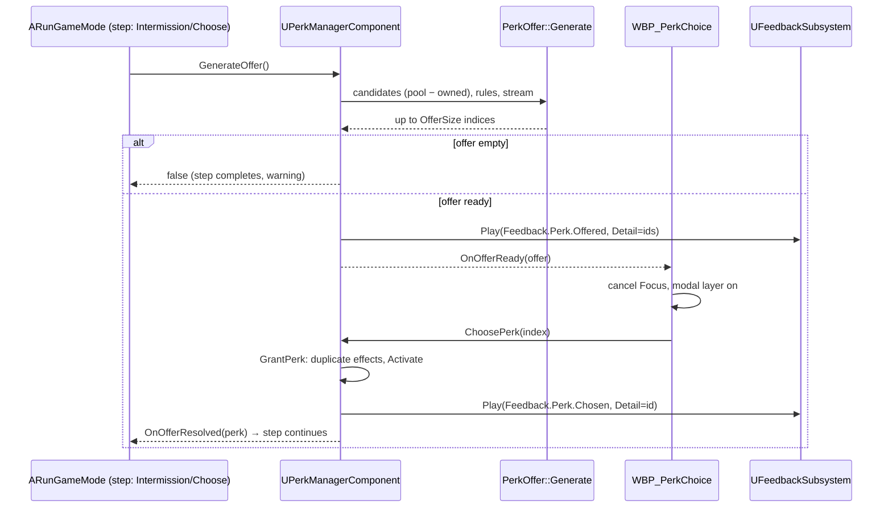
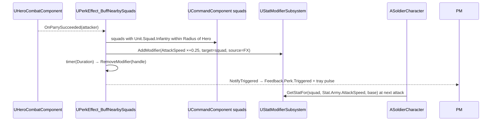

# Perks (PRK): Technical Plan

| | |
|---|---|
| Spec | [spec.md](spec.md) |
| Architecture baseline | [00-foundation/technical-plan.md](../00-foundation/technical-plan.md), master plan D-01..D-18 |
| Phases | P2 (stat query), P3 (perks) |
| Status | Draft v1. All paths and types are proposals |

## 1. Technical Overview

- **P2:** a `UStatModifierSubsystem` (WorldSubsystem) keeps a flat list of active stat modifiers. Consumers call `GetStatFor(Target, StatTag, Base)` at use time. ZON adds an actor-scoped modifier when a squad holds a zone and removes it on release.
- **P3:** perks are `UPerkDefinition` Primary Data Assets with instanced `UPerkEffect` objects. `UPerkManagerComponent` on `ARunPlayerState` owns the run's perks, duplicates effect templates into runtime instances, activates them, and generates offers with a pure, seeded weighted generator. Stat-modifier effects register run-wide modifiers filtered by target tags. Event effects bind to existing gameplay delegates: CMB `OnParrySucceeded`, SYN `UCombatStateComponent::OnStateAdded(Tag, Instigator)`, DEF `OnTowerShotPreparing` and structure placed events. No GAS (D-04), no event bus (D-10).

## 2. Existing System Impact

| System | Impact |
|---|---|
| RUN (`ARunPlayerState`, `URunDefinition`, run steps) | Hosts `UPerkManagerComponent`; `URunDefinition` gets a `PerkPool` reference; the A-07 offer step calls the manager and waits for the pick (`T-RUN-05`) |
| ZON | P2 consumer: adds/removes actor-scoped modifiers (`T-ZON-04`) |
| CMB | Reads `Stat.Hero.*` (added by `T-PRK-09`); `UHeroCombatComponent::OnParrySucceeded(Attacker)` (exists, `T-CMB-09`); `UStaminaComponent` needs a restore entry point (add in `T-PRK-03` if missing) |
| SYN | `OnStateAdded(Tag, Instigator)` fires for new states only (AC-SYN-04): used for "Armor Break by the Hero"; `ApplyState` for Marked |
| SQD | `ASquad` exposes identity tags; soldiers read `Stat.Army.*` with their squad as target; squad registry used by the nearby-Infantry buff |
| DEF | `T-DEF-22` already reads `Stat.Tower.Damage/FireInterval/Range`, exposes `OnTowerShotPreparing(Tower, ShotIndex, FTowerShotParams&)` and projectile `PierceCount`; `UStructureDefinition.TypeTag` (`Structure.Type.Ballista/Bombard/...`); PRK adds the `Stat.Tower.PoiseDamage` read and identity tags if missing (`T-PRK-11`) |
| UXF | Feedback rows `Feedback.Perk.*`; HUD slot for perk tray; modal layer; telemetry |
| TFM | Modal open cancels Focus |
| Save | None now; owned perks stored as Primary Asset IDs so a run save stays possible (D-14) |

## 3. Proposed Architecture

### 3.1 Runtime owner and lifetime

| Object | Owner | Lifetime |
|---|---|---|
| `UStatModifierSubsystem` | World | One battlefield map (sandbox or Siege Site run) |
| `UPerkManagerComponent` | `ARunPlayerState` | One run; survives Hero death/respawn |
| Runtime `UPerkEffect` instances | `UPerkManagerComponent` (outer) | From pick until run end |
| `UPerkDefinition`, `UPerkPoolDefinition` | Asset (read-only at runtime) | Asset lifetime; never mutated (foundation principle 4) |

### 3.2 Main UE types (new)

| Type | Kind | Folder | Purpose |
|---|---|---|---|
| `EStatModOp`, `FStatModifier`, `FStatModifierHandle` | enum/USTRUCT | `Perks/` | Modifier data (stat tag, op, magnitude, `TargetFilter` added in P3) |
| `UStatModifierSubsystem` | `UWorldSubsystem` | `Perks/` | Add/remove/query, change event |
| `StatTags` | native tags | `Perks/` | `Stat.*` leaves (`UE_DEFINE_GAMEPLAY_TAG`, verify macro for pinned UE) |
| `UPerkDefinition` | `UGameDefinition` (Primary Data Asset) | `Perks/` | Perk content |
| `UPerkPoolDefinition` | `UGameDefinition` | `Perks/` | Pool list + `FPerkOfferRules`; pool validation |
| `FPerkOfferRules`, `FPerkOfferCandidate`, `PerkOffer::Generate/ValidatePool` | USTRUCT + pure functions | `Perks/` | Offer logic, Spec-tested |
| `UPerkEffect` | abstract `UObject`, `EditInlineNew`, `DefaultToInstanced` | `Perks/` | `Activate(Context)`, `Deactivate()`, `OnHeroChanged(Hero)` |
| `UPerkEffect_StatModifier` | effect | `Perks/Effects/` | Run-wide modifiers |
| `UPerkEffect_HeroTriggered` | abstract effect | `Perks/Effects/` | `Trigger` enum {ParrySucceeded, StateAppliedByHero}; binds the Hero's `OnParrySucceeded`, or hostile actors' `OnStateAdded` filtered by `Instigator == Hero` |
| `UPerkEffect_RestoreStamina` | effect | `Perks/Effects/` | Breaker's Breath, Second Wind |
| `UPerkEffect_ApplyStateToAttacker` | effect | `Perks/Effects/` | Exposing Parry |
| `UPerkEffect_BuffNearbySquads` | effect | `Perks/Effects/` | Rallying Parry (timed actor-scoped modifier) |
| `UPerkEffect_EveryNthShot` | effect | `Perks/Effects/` | Piercing Bolts |
| `UPerkManagerComponent` | `UActorComponent` | `Perks/` | Owned perks, offers, effect lifecycle, events |
| `FPerkRunState` | USTRUCT | `Perks/` | Owned IDs, pending offer IDs, offers made, seed (save-ready, D-14) |
| `WBP_PerkChoice`, `WBP_PerkTray` | UMG Blueprint | `Content/<Game>/UI/Perks/` | Choice modal, tray (D-11 plain UMG) |

### 3.3 Data ownership

- Base values: consumer definitions (`USquadDefinition`, `UStructureDefinition`, `UHeroClassDefinition`).
- Modifier magnitudes: the source (`UTacticalZoneDefinition`, `UPerkDefinition` effect properties).
- Offer rules + pool: `UPerkPoolDefinition` (`DA_PerkPool_P3`), referenced by `URunDefinition.PerkPool`.
- Offer schedule (A-07): `URunDefinition` (RUN).
- Runtime: `UStatModifierSubsystem` (modifiers), `UPerkManagerComponent` (owned, pending offer, effect instances).

`UPerkDefinition` fields:

| Field | Type | Notes |
|---|---|---|
| `DisplayName`, `Description` | FText | Description written with the actual numbers |
| `Icon` | `TSoftObjectPtr<UTexture2D>` | Loaded when the card/tray shows |
| `Categories` | `FGameplayTagContainer` | Only `Perk.Category.*`, ≥ 1. `IsHybrid()` = count ≥ 2 |
| `bGenericStat` | bool | Generic stat perk (R-PRK-09); validation: only `UPerkEffect_StatModifier` effects |
| `Weight` | float | > 0, default 1.0 |
| `SynergyNote` | FText (editor) | §10.3 answer; required when not generic |
| `Effects` | `TArray<TObjectPtr<UPerkEffect>>` (Instanced) | ≥ 1 |
| `TriggerFeedbackTag` | FGameplayTag | Default `Feedback.Perk.Triggered` |

`FPerkOfferRules`: `OfferSize`=3, `HybridWeightMultiplier`=1.5, `MaxGenericPerOffer`=1, `MaxGenericPoolShare`=0.4, `RerollsPerRun`=0 (all starting values, [TUNABLE]).

### 3.4 Communication flow

- Consumers → subsystem: direct call `UStatModifierSubsystem::GetStatFor` (static helper, returns base when no subsystem).
- Sources → subsystem: `AddModifier` / `RemoveModifier` / `RemoveModifiersFromSource`.
- Target identity tags: UE's `IGameplayTagAssetInterface::GetOwnedGameplayTags` on `ASquad` (squad type tag) and `AStructureBase` (role tag + `Structure.Type.*` from `UStructureDefinition`). Hero stats need no filter (only the Hero reads `Stat.Hero.*`).
- Gameplay → effects: native/dynamic multicast delegates already owned by the gameplay features (D-10). Effects bind on activate / hero change and unbind on deactivate.
- Manager → UI/RUN: `OnOfferReady`, `OnOfferResolved`, `OnPerkAcquired`, `OnPerkTriggered`.
- Manager/effects → presentation: `UFeedbackSubsystem::Play(Feedback.Perk.*, Context{Detail = perk asset name})`. Telemetry gets offers/picks from these feedback events (UXF `T-UXF-08`).

### 3.5 C++ / Blueprint split

| C++ | Blueprint / data |
|---|---|
| Subsystem, formula, offer generator, manager, all effect classes, delegate binding | `DA_Perk_*` content, effect property values, `DA_PerkPool_P3`, `WBP_PerkChoice`, `WBP_PerkTray`, card layout, icons |

### 3.6 Asset references / loading

Pool → perks: hard references (11 small assets). Icons: soft, loaded synchronously when the card opens (small textures; switch to async only if a hitch is measured).

### 3.7 AI / navigation impact

None. Perks only change numbers that AI already reads (attack rate, damage, range) and apply Marked, which SQD/DEF target priority already consumes (SYN `T-SYN-05`, `T-SYN-06`).

### 3.8 UI impact

`WBP_PerkChoice` (modal layer of `WBP_GameHUD`, UXF), `WBP_PerkTray` (HUD slot). Opening the modal: cancel Tactical Focus, set Game+UI input with cursor, keys 1/2/3 handled by the widget's key handler (no new mapping context). Escape does nothing while an offer is pending.

### 3.9 Save impact

No save in prototype (A-11). `FPerkRunState` uses Primary Asset IDs and ints only (D-14). Runtime counters inside effects (Nth-shot) are not saved; acceptable loss if run save ever ships.

### 3.10 Performance risks

Negligible. Watch only: `GetStatFor` called per soldier per attack (≤ 36 soldiers). `ponytail:` linear scan; add a per-(target, stat) cache invalidated by `OnStatModifiersChanged` only if Insights shows it.

### 3.11 Existing systems reused

`UGameDefinition` + Asset Manager types (FND), Gameplay Tags + `IGameplayTagAssetInterface`, `FGameplayTagQuery`, `FRandomStream`, `FTimerManager` (game time, so Focus dilation applies consistently), `DuplicateObject` for effect instances, `UFeedbackSubsystem`, `UGameCheatManager`.

### 3.12 Trade-offs

| Choice | Alternative | Why |
|---|---|---|
| One world subsystem with a flat list | `UStatModifierComponent` on every actor | Run-wide perk modifiers would need pushing into every new squad/tower; one list handles both scopes |
| C++ effect subclasses with data properties | Generic data-only "trigger → response" table | 5 effect types cover the pool; subclasses are testable and readable; generic system is speculative |
| Read at use time | Push recalculated stats into consumers | Fewer moving parts; caching consumers listen to the change event |
| Separate `UPerkPoolDefinition` | Fields directly on `URunDefinition` | PRK owns its data and validation; VS meta can add pools/families without touching RUN |
| Per-tower Nth-shot counter | Global counter | Matches "each Ballista's Nth shot"; confirm NEW-PRK-6 |

### 3.13 Verification

Automation Specs (`<Game>.Perks.StatModifier`, `<Game>.Perks.Offer`), Functional Test maps (`FT_Perk_HeroTriggers`, `FT_Perk_BallistaPierce`, `FT_Perk_StatReads`, `FT_Perk_HeroRespawn`, `FT_Stat_ZoneModifier`), PIE checks with cheats, G3 playtest with telemetry.

## 4. Runtime Flow

### 4.1 Offer and pick (P3)



### 4.2 Event effect (Rallying Parry)



### 4.3 Hero change

Commander Spirit respawn creates a fresh Hero pawn (CSM), so pawn-side effects must re-apply. The manager binds the `AHeroPlayerController` possessed-pawn-changed delegate (verify name/signature in the pinned UE version, e.g. `OnPossessedPawnChanged`). On change it calls `OnHeroChanged(NewHeroOrNull)` on every effect. `UPerkEffect_HeroTriggered` unbinds from the old pawn and binds to the new one; `StateAppliedByHero` compares `Instigator` with the current pawn. Run-wide `Stat.Hero.*` modifiers need no re-apply: they have no target actor and are read from whichever pawn queries them.

### 4.4 "Armor Break by the Hero" trigger

```text
Activate (Trigger == StateAppliedByHero):
  bind OnStateAdded on every existing actor with UCombatStateComponent that is hostile to the player team
  World->AddOnActorSpawnedHandler → bind newly spawned hostile actors (verify API)
OnStateAdded(Tag, Instigator): if Tag == RequiredState and Instigator == current Hero pawn → HandleTrigger
Deactivate: remove spawn handler, unbind all
```

## 5. State / Data

### 5.1 Stat formula

```text
add = Σ Magnitude where Op == Add
mul = Σ Magnitude where Op == Multiply
value = max(0, (Base + add) * (1 + mul))
match: modifier.Stat == Stat (exact)
       and (modifier.Target == Target
            or (modifier.Target unset and modifier.TargetFilter matches Target's owned tags; empty filter = any))
```

### 5.2 Offer generation

```text
candidates sorted by PrimaryAssetId (determinism)
offer = []
generic = 0
repeat OfferSize:
  eligible = candidates − offer − (generic ones if generic >= MaxGenericPerOffer)
  if eligible empty: break
  w(c) = c.Weight * (c.bHybrid ? HybridWeightMultiplier : 1)
  pick c with probability w(c)/Σw using stream
  offer += c; if c.bGeneric: generic++
```

`ValidatePool`: ≥ `OfferSize` perks, all weights > 0, generic share ≤ `MaxGenericPoolShare` (< 0.5), no duplicates.

### 5.3 Manager state

```text
UPerkManagerComponent
  OwnedPerks        TArray<{UPerkDefinition*, int32 WaveAcquired}>
  ActiveEffects     TMap<UPerkDefinition*, TArray<UPerkEffect*>>  (runtime copies)
  PendingOffer      TArray<UPerkDefinition*>   (empty = none)
  OffersMade        int32
  Stream            FRandomStream (seed from URunDefinition or random; seed logged)
  ToRunState() -> FPerkRunState (IDs only)
```

## 6. Main Implementation Areas

| Area | Tasks |
|---|---|
| Stat query (P2) | `T-PRK-02` |
| Perk data + effect base + manager + stat-modifier effect | `T-PRK-01` |
| Offer generator (pure) | `T-PRK-04` |
| Offer flow + pool asset + RUN integration | `T-PRK-07` |
| Choice UI + tray | `T-PRK-05` |
| Hero-triggered event effects | `T-PRK-03` |
| Nth-shot pierce | `T-PRK-08` |
| Stat read points in Hero / Army / Defense code | `T-PRK-09`, `T-PRK-10`, `T-PRK-11` |
| Pool content | `T-PRK-06` |
| QA, G3 playtest, conditional reroll | `T-PRK-12`, `T-PRK-13`, `T-PRK-14` |

## 7. Error and Edge-Case Handling

| Case | Handling |
|---|---|
| Invalid perk/pool data | `IsDataValid` errors in editor; at runtime invalid perks are skipped with a warning |
| Target actor destroyed | Weak pointer; skipped in queries, compacted on next add/remove |
| Source object gone | `RemoveModifiersFromSource` on effect `Deactivate`; stale-source entries pruned on compaction |
| `GenerateOffer` while pending | Return false, warning, keep pending |
| `ChoosePerk` with no pending or bad index | Ignore, warning |
| Empty/short pool | Fewer cards; empty → RUN step completes |
| Hero null (dead) | Hero effects unbound; triggers impossible; stat perks for Hero stay registered (read when Hero exists) |
| Timed buff re-trigger | Remove previous handle, add new one, restart timer |
| Run end / player state destroyed | `EndPlay` → deactivate all effects → subsystem sources removed |
| Missing delegate in a dependency (name differs) | Adapt binding in the PRK task; do not add a parallel event path in the other feature |

## 8. Testing Strategy

| Test | Type | Covers |
|---|---|---|
| `<Game>.Perks.StatModifier` | Automation Spec | Formula, scope, removal, pruning, filter (R-PRK-01..06, AC-PRK-01/02) |
| `<Game>.Perks.Offer` | Automation Spec | Determinism, no duplicates/owned, generic cap, hybrid weighting, pool validation (AC-PRK-05..07) |
| `FT_Stat_ZoneModifier` | Functional Test | Zone hold/release changes squad stat (AC-PRK-03, with ZON) |
| `FT_Perk_HeroTriggers` | Functional Test | Restore stamina, Marked on attacker, nearby Infantry buff (broadcasts hero delegates directly; real parry is CMB's test) |
| `FT_Perk_BallistaPierce` | Functional Test | Every 4th shot pierces; Bombard unaffected; tower destroyed mid-count |
| `FT_Perk_StatReads` | Functional Test | Each stat perk changes its consumer value |
| `FT_Perk_HeroRespawn` | Functional Test | Perks survive death; rebind after respawn (AC-PRK-09) |
| PIE with cheats | Manual | `PerkGrant`, `PerkOffer`, `PerkList`, `game.debug.Stats 1` |
| G3 playtest | Manual + telemetry | Build diversity (AC-PRK-12) |

## 9. Performance Risks

| Risk | Note |
|---|---|
| Query per soldier attack | ≤ 36 soldiers × attack rate; linear scan over < 50 entries; fine. Cache only if measured |
| Delegate fan-out on structures and hostile actors | ≤ ~15 structures; ≤ enemy cap actors for `OnStateAdded`, bound only while needed |
| Many timed buffs | One timer per active buff; < 10 expected |

## 10. Dependencies and Risks

| Risk | Impact | Mitigation |
|---|---|---|
| Dependency APIs missing or shaped differently (stamina restore, structure placed event, `Stat.Tower.PoiseDamage` read) | Event effects blocked | Listed as explicit dependencies; PRK tasks add the small missing entry point with the owner reviewing; never a parallel event path |
| Binding `OnStateAdded` on every hostile actor | Many bindings with large waves | One binding per actor via the world actor-spawned handler (verify `UWorld::AddOnActorSpawnedHandler`); bound only while a perk with that trigger is owned; ≤ enemy cap |
| Generic perks feel more reliable than hybrids, players pick them | Builds collapse to stats | Generic cap per offer, weights, G3 telemetry on picks |
| 3 picks per run (A-07) too few to assemble a build | §36 build DoD fails | G3 decides: more offers (RUN data), build-affinity (NEW-PRK-8) or reroll (`T-PRK-14`) |
| §33 vs §10.2 Armor Broken source conflict (NEW-PRK-5) | Wrong perk content | Default to baseline; design answer before `T-PRK-06` |
| Perk effects reach into many features | Coupling | Effects only bind to public delegates/APIs; no feature depends on PRK except through the stat query |

No change request to D-01..D-18. D-04 (no GAS) fits: 5 effect classes and a flat modifier list cover the P3 pool. Re-evaluate at G3 as D-04 says if perk count or status complexity grows.

## 11. Requirement Coverage

| Requirement | Technical area | Notes |
|---|---|---|
| R-PRK-01 | `UStatModifierSubsystem::GetStatFor` | Base stays in consumer data |
| R-PRK-02 | `FStatModifier`, actor scope | `TargetFilter` added P3 |
| R-PRK-03 | Formula §5.1 | Spec-tested |
| R-PRK-04 | ZON `T-ZON-04` using `T-PRK-02` | Magnitudes in zone data |
| R-PRK-05 | `RemoveModifiersFromSource`, weak target pruning | |
| R-PRK-06 | Use-time reads, `OnStatModifiersChanged` | |
| R-PRK-07 | `UPerkDefinition.Categories`, `IsHybrid()` | |
| R-PRK-08 | `HybridWeightMultiplier` in generator; pool content | |
| R-PRK-09 | `ValidatePool` generic share | Editor validation |
| R-PRK-10 | Generator generic cap | |
| R-PRK-11 | `FPerkOfferRules.OfferSize`; RUN schedule A-07 | `T-RUN-05` |
| R-PRK-12 | Weighted pick, seeded stream, owned excluded | |
| R-PRK-13 | `RerollsPerRun` = 0; `T-PRK-14` conditional | |
| R-PRK-14 | `SynergyNote` validation + content review | `T-PRK-06` |
| R-PRK-15 | `UPerkEffect` instanced subclasses | |
| R-PRK-16 | Manager on `ARunPlayerState`, cleared at `EndPlay`; no SaveGame | |
| R-PRK-17 | Hero change rebinding §4.3 | |
| R-PRK-18 | Manager offer API + RUN step wait; modal no-close | |
| R-PRK-19 | Pool content §4.3 of spec | `T-PRK-06`, `T-PRK-13` |
| R-PRK-20 | `WBP_PerkTray`, `OnPerkTriggered`, feedback | |
| R-PRK-21 | Shield Wall perk not authored in P3 | VS |
