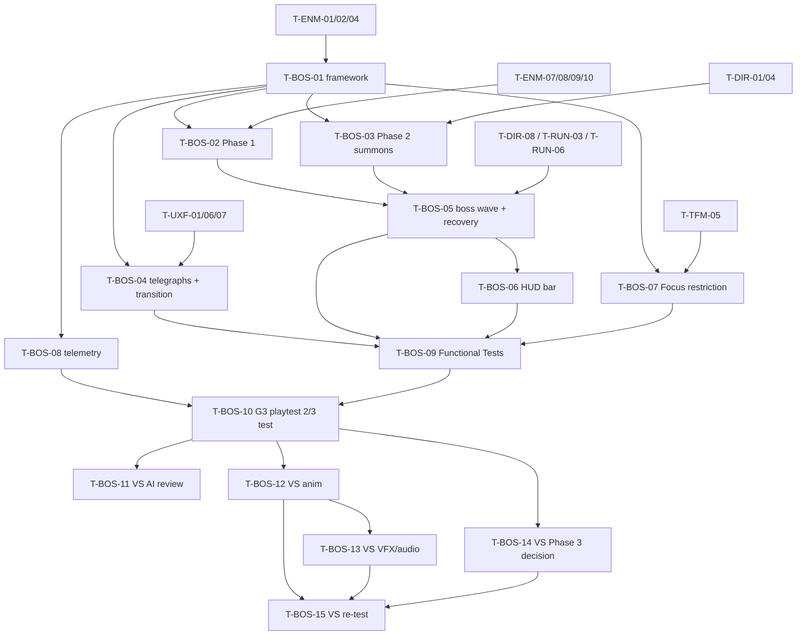

# Boss (BOS): Tasks

## 1. Summary

Builds the boss framework and one two-phase boss (Siege Behemoth variant, A-09) for Prototype 3, then lists provisional Vertical Slice polish tasks. Spec: [spec.md](spec.md). Plan: [technical-plan.md](technical-plan.md). The boss is an `AEnemyCharacter` subclass, so ENM P2 tasks must be done first. All paths are proposals.

Anchor IDs T-BOS-01..06 keep the meanings fixed in the shared brief. T-BOS-07..15 are added after them. VS tasks (T-BOS-11..15) are provisional: re-validate after G3.

Rule with no task by design: R-BOS-21 (difficulty phase variation is a data hook only, carried by T-BOS-01 phase data).

## 2. Task Overview

| ID | Task | Type | Phase | Priority | Dependencies | Status |
|---|---|---|---|---|---|---|
| T-BOS-01 | `ABossCharacter` + `UBossDefinition` + phase controller | GAMEPLAY | P3 | Must | T-ENM-01, T-ENM-02, T-ENM-04, T-FND-07 | Todo |
| T-BOS-02 | Phase 1 lane advance + structure-breaking priority | AI | P3 | Must | T-BOS-01, T-ENM-07, T-ENM-08, T-ENM-09, T-ENM-10, T-SYN-02 | Todo |
| T-BOS-03 | Phase 2 split-pressure summons | GAMEPLAY | P3 | Must | T-BOS-01, T-DIR-01, T-DIR-04, T-ENM-07 | Todo |
| T-BOS-04 | Telegraphs + phase transition feedback | VFX | P3 | Must | T-BOS-01, T-ENM-03, T-UXF-01, T-UXF-06, T-UXF-07 | Todo |
| T-BOS-05 | Boss wave integration + boss reset/bug recovery | GAMEPLAY | P3 | Must | T-BOS-02, T-BOS-03, T-DIR-08, T-RUN-03, T-RUN-06, T-ENM-15 | Todo |
| T-BOS-06 | Boss HUD bar | UI | P3 | Must | T-BOS-05, T-UXF-02 | Todo |
| T-BOS-07 | Tactical Focus restriction wiring | GAMEPLAY | P3 | Should | T-BOS-01, T-TFM-05 | Todo |
| T-BOS-08 | Boss telemetry for the 2/3 Layer Test | TOOLS | P3 | Must | T-BOS-01, T-UXF-08 | Todo |
| T-BOS-09 | Boss Functional Tests | QA | P3 | Must | T-BOS-02, T-BOS-03, T-BOS-04, T-BOS-05, T-BOS-06, T-BOS-07, T-FND-10 | Todo |
| T-BOS-10 | G3 boss playtest + 2/3 Layer Test | QA | P3 | Must | T-BOS-08, T-BOS-09, T-CSM-01 | Todo |
| T-BOS-11 | VS: boss AI re-evaluation (C++ FSM vs StateTree) | AI | VS | Should | T-BOS-10 (G3 passed) | Todo |
| T-BOS-12 | VS: boss animation set to target quality | ANIM | VS | Should | T-BOS-10 | Todo |
| T-BOS-13 | VS: boss VFX + audio to target quality | AUDIO | VS | Should | T-BOS-10, T-BOS-12 | Todo |
| T-BOS-14 | VS: Phase 3 decision (duel zone / arena pressure) | DESIGN | VS | Could | T-BOS-10 | Todo |
| T-BOS-15 | VS: polished boss re-test + 2/3 Layer Test | QA | VS | Should | T-BOS-12, T-BOS-13, T-BOS-14 | Todo |

## 3. Detailed Tasks

## P3

### T-BOS-01 — Boss character, definition, phase controller

- **Type / Phase:** GAMEPLAY / P3
- **Objective:** A boss built on the enemy base that reads phases from data, detects thresholds on damage, runs a timed transition and applies per-phase overrides.
- **Related Requirements:** R-BOS-01, R-BOS-02, R-BOS-03, R-BOS-10, R-BOS-11, R-BOS-19, R-BOS-20; AC-BOS-01
- **Dependencies:** T-ENM-01, T-ENM-02, T-ENM-04 (Staggered), T-FND-07 (Primary Asset Types, `IsDataValid`)

**Implementation Notes**
- [ ] `UBossDefinition` (`UPrimaryDataAsset`, register type): base archetype, phases (`FBossPhaseDefinition`, each with a short `PhaseHintText` (`FText`) that T-DIR-06 may show in the forecast, R-BOS-19), max transition time. `FBossSummonEntry` struct defined now, used in T-BOS-03.
- [ ] `BossPhaseRules`: `ComputePhaseIndex`, `ValidatePhases` (2–3 phases, first at 1.0, strictly descending in (0, 1], union of `LayersTested` ≥ 2 distinct). `IsDataValid` calls `ValidatePhases`.
- [ ] `ABossCharacter : AEnemyCharacter`, tag `Unit.Enemy.Boss`. `InitBoss(Def, Lane, EntryPoint)` calls the enemy init with the base archetype.
- [ ] Bind `OnDamaged`: if `ComputePhaseIndex` > current, start transition to current + 1 (one phase at a time; a queued jump runs the next transition right after).
- [ ] Transition: `PauseDecisions()`, play transition montage (BP event), timer = max transition time; end on montage end or timer, whichever first. Apply overrides to `FEnemyRuntimeParams` (priority, speed, attacks, `bFollowLane`), `ResumeDecisions()`, `ForceRepath()`.
- [ ] Events: `OnBossSpawned`, `OnBossPhaseChanged(Old, New)`, `OnBossDefeated` (once, from enemy death), `OnBossRecovered(Reason)`.
- [ ] Cheats: `BossSpawn`, `BossSetPhase <n>`, `BossKill`.

**Expected Files / Assets:** `Source/<Game>/Boss/BossCharacter.h/.cpp`, `BossDefinition.h/.cpp`, `BossPhaseRules.h/.cpp`; `Tests/BossPhaseRules.spec.cpp`; `BP_Boss_Test`, `DA_Boss_Test`; `L_Test_Boss`.

**Test Case:** `DA_Boss_Test` with phases at 1.0 and 0.5 → cheat damage to 49% → `OnBossPhaseChanged(0, 1)` fires once after the transition; brain was paused during it; runtime speed equals phase 2 multiplier; the DA is unchanged.

**Acceptance Criteria**
- [ ] Phase rules Automation Spec passes (normal, exact threshold, multi-phase jump, invalid orders).
- [ ] A definition with one phase or with ascending thresholds fails `IsDataValid`.
- [ ] Transition always ends within max transition time, even with a missing montage.

**Verification:** Automation Spec `Boss.PhaseRules`; Functional Test `FT_Boss_PhaseTransition`.

### T-BOS-02 — Phase 1: lane advance + structure-breaking priority

- **Type / Phase:** AI / P3
- **Objective:** The Siege Behemoth enters the main lane and breaks blockers and towers on and near its route, testing defense placement.
- **Related Requirements:** R-BOS-04, R-BOS-05, R-BOS-08, R-BOS-09; AC-BOS-03, AC-BOS-06
- **Dependencies:** T-BOS-01, T-ENM-07, T-ENM-08, T-ENM-09, T-ENM-10, T-SYN-02

**Implementation Notes**
- [ ] `DA_Enemy_Boss_SiegeBehemoth`: high HP, high armor, high poise, short Staggered duration, slow walk, structure damage multiplier (~3×), 2–3 telegraphed melee attacks (one long-wind-up structure slam).
- [ ] `DA_Boss_SiegeBehemoth` Phase 1 "Breach": priority override Path Obstacle, Combat Tower, Blocker, Hero, Soldier, Objective; larger aggro radius; `LayersTested` = Tower (Defense), Hero.
- [ ] `BP_Boss_SiegeBehemoth`: placeholder large silhouette (scaled Siege placeholder, distinct material; production-plan owns final art).
- [ ] Check the large capsule against the navmesh agent settings; if lanes need a second agent radius, raise it with DEF and record the result.
- [ ] Verify no single boss attack kills a full-HP Warlord (use `DA_HeroClass_Warlord` max HP).

**Expected Files / Assets:** `DA_Enemy_Boss_SiegeBehemoth`, `DA_Boss_SiegeBehemoth`, `BP_Boss_SiegeBehemoth`, `AM_Boss_*`.

**Test Case:** In `L_Test_Boss`: Barricade on the main lane + Ballista 6 m off the lane → boss stops at the Barricade and breaks it, then walks to the Ballista and breaks it, then resumes and damages the Core.

**Acceptance Criteria**
- [ ] Boss never detours around a route-blocking Barricade.
- [ ] Boss stays within leash when going for the off-route tower.
- [ ] Warlord at full HP survives every boss attack (test with block off).

**Verification:** Functional Tests `FT_Boss_BreaksBlocker`, `FT_Boss_TowerInRadius`, `FT_Boss_NoOneShot`.

### T-BOS-03 — Phase 2: split-pressure summons

- **Type / Phase:** GAMEPLAY / P3
- **Objective:** In Phase 2 the boss summons minions on two other lanes through the spawner, forcing the player to split squads.
- **Related Requirements:** R-BOS-06, R-BOS-07, R-BOS-13; AC-BOS-05, AC-BOS-10
- **Dependencies:** T-BOS-01, T-DIR-01 (lane spawn points + spawner), T-DIR-04 (cap), T-ENM-07

**Implementation Notes**
- [ ] Phase 2 "Split Pressure" data: summons = Swarm ×6 per side lane every 20 s, max alive 18 (placeholders), `bFollowLane = true`, `LayersTested` = Army, Hero.
- [ ] On phase enter: start a looping summon timer per entry (game time). Each fire: ask the spawner for `Count` enemies at the entry's lane spawn point; enemies the spawner refuses (cap) stay queued for the next fire.
- [ ] Track summons by weak ref + `OnEnemyRemoved`; respect `max alive`.
- [ ] On boss defeat or despawn: stop timers, despawn live summons (NEW-BOS-1).
- [ ] Spread a burst over several frames only if Insights shows a spawn spike.

**Expected Files / Assets:** `BossCharacter.cpp`, `DA_Boss_SiegeBehemoth` phase 2 data; `L_Test_Boss` with 3 lane spawn points.

**Test Case:** Set cap to 20 via cheat, enter Phase 2 → summons appear at the two side spawn points; alive count never exceeds 20; kill all summons → next interval spawns more; kill boss → remaining summons despawn.

**Acceptance Criteria**
- [ ] Summons spawn only at the two configured spawn points and follow their lanes.
- [ ] Alive enemy count ≤ cap at all times (logged every second).
- [ ] No summon remains after boss defeat.

**Verification:** Functional Tests `FT_Boss_SummonTwoLanes`, `FT_Boss_SummonRespectsCap`, `FT_Boss_SummonsCleanup`.

### T-BOS-04 — Telegraphs + phase transition feedback

- **Type / Phase:** VFX / P3 (placeholder VFX/SFX)
- **Objective:** Every boss attack, the phase change and each summon wave are readable without looking at the HUD.
- **Related Requirements:** R-BOS-04, R-BOS-11, R-BOS-18; AC-BOS-04, AC-BOS-05, AC-BOS-06
- **Dependencies:** T-BOS-01, T-ENM-03 (telegraph path), T-UXF-01, T-UXF-06 (§28.3 audio set), T-UXF-07 (lane danger indicators)

**Implementation Notes**
- [ ] Add tags `Feedback.Boss.Spawn/Telegraph/PhaseChange/Summon/FocusRestricted/Defeated`; rows in `DT_Feedback` with placeholder assets.
- [ ] Boss attacks play `Feedback.Boss.Telegraph` instead of the enemy telegraph tag (data on the attack or override in `ABossCharacter`).
- [ ] Transition start: `Feedback.Boss.PhaseChange` (roar SFX, camera shake, VFX burst, HUD banner text from phase name).
- [ ] Each summon fire: `Feedback.Boss.Summon` at each spawn point (location in context) and raise the lane danger indicator for those lanes (UXF-07 API).
- [ ] Spawn and defeat: `Feedback.Boss.Spawn`, `Feedback.Boss.Defeated`.

**Expected Files / Assets:** `DT_Feedback` rows, `NS_Boss_*`, `SFX_Boss_*` placeholders, `AM_Boss_Roar`.

**Test Case:** Record a Functional Test run → feedback log shows PhaseChange once at the transition, Summon once per lane per wave, Telegraph before each boss hit.

**Acceptance Criteria**
- [ ] Phase change audible with the camera facing away from the boss.
- [ ] Each summon wave marks exactly the two affected lanes.
- [ ] Telegraph precedes every boss hit by ≥ min telegraph time (same check as ENM).

**Verification:** Functional Test `FT_Boss_FeedbackEvents` (asserts on feedback subsystem log); PIE readability check.

### T-BOS-05 — Boss wave integration + boss reset/bug recovery

- **Type / Phase:** GAMEPLAY / P3
- **Objective:** The boss is spawned by the curated boss wave, ends the run on defeat through RUN, and can never soft-lock the run.
- **Related Requirements:** R-BOS-12, R-BOS-15, R-BOS-16, R-BOS-17; AC-BOS-02, AC-BOS-09, AC-BOS-10, AC-BOS-11
- **Dependencies:** T-BOS-02, T-BOS-03, T-DIR-08 (curated boss wave hook), T-RUN-03 (boss step), T-RUN-06 (resolve), T-ENM-15 (stuck ladder)

**Implementation Notes**
- [ ] DIR-08 hook spawns the boss: `SpawnActorDeferred(BP class)` → `InitBoss(Def, MainLane, BossEntry)` → finish. RUN binds `OnBossDefeated` → win resolve.
- [ ] Add `ActiveBoss` (weak) + `OnActiveBossChanged` to `ARunGameState` (coordinate with RUN owner); boss sets it on spawn, clears on defeat/despawn.
- [ ] `FBossSnapshot` (phase, HP fraction) stored by the integration; updated on phase change and on damage.
- [ ] Recovery in `ABossCharacter`: last valid route point recorded at checkpoints; `FellOutOfWorld` override and a Siege Site boundary check on the decision-rate timer → teleport to last valid point, `ForceRepath`, fire `OnBossRecovered`. Stuck uses the ENM ladder.
- [ ] Integration: if the boss reports removal (not defeat) while RUN is in the boss step → respawn at boss entry from the snapshot.
- [ ] Run end (any phase change out of the boss step): despawn boss and summons; restriction cleared (T-BOS-07).
- [ ] Hero death: nothing special (boss drops Hero target via ENM).
- [ ] Cheat `BossForceRecovery <reason>`.

**Expected Files / Assets:** `BossCharacter.cpp`; DIR-08 hook call site; `ARunGameState` field; `L_SiegeSite_Proto` boss entry.

**Test Case:** Run P3 flow to the boss step → boss spawns at entry. Teleport boss below kill height → it returns to the last route point with the same HP/phase. Destroy the boss actor via console → it respawns at entry with the same HP fraction and phase. Kill boss → one win resolve.

**Acceptance Criteria**
- [ ] Boss can only appear through the boss wave (no other spawn path outside cheats).
- [ ] Every recovery keeps HP and phase.
- [ ] `OnBossDefeated` fires exactly once per run.
- [ ] Hero death mid-fight changes nothing on the boss.

**Verification:** Functional Tests `FT_Boss_OutOfBoundsRecovery`, `FT_Boss_ActorLostRespawn`, `FT_Boss_DefeatOnce`, `FT_Boss_HeroDeathNoReset`; full-run PIE check.

### T-BOS-06 — Boss HUD bar

- **Type / Phase:** UI / P3
- **Objective:** Boss name, HP, phase markers and current phase readable at a glance.
- **Related Requirements:** R-BOS-18; AC-BOS-08
- **Dependencies:** T-BOS-05 (`ActiveBoss`), T-UXF-02 (HUD shell)

**Implementation Notes**
- [ ] `WBP_BossBar` in a `WBP_GameHUD` slot; hidden by default.
- [ ] On `ARunGameState::OnActiveBossChanged`: bind boss `UHealthComponent::OnDamaged`, `OnBossPhaseChanged`, `OnBossDefeated`; set name; draw phase ticks from definition thresholds.
- [ ] Bar fill interpolation is the only per-frame work; no Tick bindings for gameplay values.
- [ ] Phase change: highlight current phase marker, show phase name briefly.
- [ ] Hide on defeat or `ActiveBoss` cleared.

**Expected Files / Assets:** `Content/<Game>/UI/WBP_BossBar`.

**Test Case:** Spawn boss via cheat → bar appears with 1 tick at 50% → damage to 40% → bar shows phase 2 marker → kill → bar hides.

**Acceptance Criteria**
- [ ] Bar values always match `UHealthComponent` (checked at 5 sample points).
- [ ] Widget holds no gameplay state.

**Verification:** PIE manual steps above; Functional Test `FT_Boss_BarBinding` (widget reads match health).

### T-BOS-07 — Tactical Focus restriction wiring

- **Type / Phase:** GAMEPLAY / P3
- **Objective:** A boss phase can restrict (never disable) Tactical Focus through the TFM hook, and the restriction is always cleared.
- **Related Requirements:** R-BOS-14; AC-BOS-07; NEW-BOS-3
- **Dependencies:** T-BOS-01, T-TFM-05 (restriction hook)

**Implementation Notes**
- [ ] `FBossPhaseDefinition` holds TFM's restriction struct (+ `bRestrictFocus`).
- [ ] On phase enter: find `UTacticalFocusComponent` on the local player controller; apply restriction with the boss as source; play `Feedback.Boss.FocusRestricted`.
- [ ] Clear on: phase exit, boss defeat, boss despawn, recovery respawn (re-apply after if the phase has one), run end, `EndPlay` guard.
- [ ] Prototype data default: no restriction (NEW-BOS-3). Test with `DA_Boss_Test`.

**Expected Files / Assets:** `BossCharacter.cpp`, `BossDefinition.h`.

**Test Case:** `DA_Boss_Test` phase 2 has a restriction → enter phase 2 → TFM reports restriction active and Focus still usable → kill boss → restriction cleared.

**Acceptance Criteria**
- [ ] Restriction active only during its phase.
- [ ] No exit path leaves a restriction behind (test each path).

**Verification:** Functional Test `FT_Boss_FocusRestrictionLifecycle`.

### T-BOS-08 — Boss telemetry for the 2/3 Layer Test

- **Type / Phase:** TOOLS / P3
- **Objective:** Objective evidence per session for which layers the boss tested.
- **Related Requirements:** R-BOS-02; AC-BOS-12
- **Dependencies:** T-BOS-01, T-UXF-08 (telemetry log)

**Implementation Notes**
- [ ] Log rows via T-UXF-08: boss spawn time, phase change times, defeat/lose time.
- [ ] Damage to boss summed by `FCombatHit.SourceLayer` (Hero / Army / Tower) per phase.
- [ ] Player structures attacked/destroyed by the boss per phase; time from spawn to first Core damage.
- [ ] Per summon wave: lane, number of summons engaged by soldiers, Core damage caused by summons per lane.
- [ ] Hero dodges/blocks/parries vs boss attacks if CMB exposes the events; otherwise note as observer-only.

**Expected Files / Assets:** `BossCharacter.cpp` (log calls); score sheet template `ai/game/playtests/templates/boss-2of3.md`.

**Test Case:** Play a boss fight → log contains all rows; damage by layer sums to total boss damage.

**Acceptance Criteria**
- [ ] Damage-by-layer totals match boss max HP on a kill (± rounding).
- [ ] Score sheet can be filled from log + notes alone.

**Verification:** Run one fight, inspect log; fill the score sheet.

### T-BOS-09 — Boss Functional Tests

- **Type / Phase:** QA / P3
- **Objective:** All boss scenarios automated in `L_Test_Boss` and runnable from the command line.
- **Related Requirements:** AC-BOS-01..11
- **Dependencies:** T-BOS-02, T-BOS-03, T-BOS-04, T-BOS-05, T-BOS-06, T-BOS-07, T-FND-10

**Implementation Notes**
- [ ] Collect: `FT_Boss_PhaseTransition`, `FT_Boss_BreaksBlocker`, `FT_Boss_TowerInRadius`, `FT_Boss_NoOneShot`, `FT_Boss_SummonTwoLanes`, `FT_Boss_SummonRespectsCap`, `FT_Boss_SummonsCleanup`, `FT_Boss_FeedbackEvents`, `FT_Boss_OutOfBoundsRecovery`, `FT_Boss_ActorLostRespawn`, `FT_Boss_DefeatOnce`, `FT_Boss_HeroDeathNoReset`, `FT_Boss_BarBinding`, `FT_Boss_FocusRestrictionLifecycle`.
- [ ] Event-based waits with timeouts; no fixed sleeps. Use `BossSetPhase` to start phase-2 tests directly.
- [ ] Regression: rerun ENM P2 tests (boss changes must not affect enemies).

**Expected Files / Assets:** `L_Test_Boss` with tests.

**Test Case:** `-ExecCmds="Automation RunTests <Game>.Boss"` → all pass; then `<Game>.Enemy` → all pass.

**Acceptance Criteria**
- [ ] All boss tests green 3 runs in a row.
- [ ] ENM regression green.

**Verification:** Command-line automation logs.

### T-BOS-10 — G3 boss playtest + 2/3 Layer Test

- **Type / Phase:** QA / P3
- **Objective:** Decide if the boss passes §22 in real runs, as part of the G3 gate.
- **Related Requirements:** R-BOS-01, R-BOS-02, R-BOS-04; AC-BOS-12; master plan §3 G3
- **Dependencies:** T-BOS-08, T-BOS-09, T-CSM-01 (Hero death path playable)

**Implementation Notes**
- [ ] ≥ 3 full-run sessions reaching the boss (`L_SiegeSite_Proto`), at least one with Hero death during the fight.
- [ ] Fill the 2/3 score sheet per session (spec AC-BOS-12 criteria) from telemetry + observer notes.
- [ ] Check: telegraphs readable, no one-shots, phase change noticed, summon lanes understood, fight length.
- [ ] Record NEW-BOS-3 (Focus restriction needed?) and NEW-BOS-4 (Phase 3 needed?) evidence.
- [ ] Record KEEP / CHANGE / DELETE for the boss; feed G3 checklist "5 waves + boss end-to-end".

**Expected Files / Assets:** `ai/game/playtests/G3_boss_*.md` with score sheets.

**Test Case:** Session score sheet shows ≥ 2 layers tested; if < 2 in any session → CHANGE with a concrete tuning or design note.

**Acceptance Criteria**
- [ ] ≥ 2 of 3 layers tested in every session (or CHANGE recorded).
- [ ] No blocker bug in boss flow across sessions.

**Verification:** Playtest notes reviewed at the G3 gate.

## VS (provisional, re-plan after G3)

### T-BOS-11 — Boss AI re-evaluation (C++ FSM vs StateTree)

- **Type / Phase:** AI / VS
- **Objective:** Decide whether the polished boss stays on the ENM FSM or moves to StateTree (D-08 review point).
- **Related Requirements:** R-BOS-24; AC-BOS-14
- **Dependencies:** T-BOS-10 (G3 passed)

**Implementation Notes**
- [ ] List boss behaviors planned for VS that the FSM + phase overrides cannot express cleanly.
- [ ] If any: 1-day spike in a throwaway map with StateTree for one phase; compare authoring effort and debuggability.
- [ ] Record KEEP / CHANGE in `00-foundation/technical-plan.md` decisions log via the lead (do not edit it directly).

**Expected Files / Assets:** spike notes `ai/game/spikes/boss-statetree.md`.

**Test Case:** Same Phase 1 Functional Test passes on the spike implementation, if built.

**Acceptance Criteria**
- [ ] Written decision with evidence.

**Verification:** Lead review.

### T-BOS-12 — Boss animation set to target quality

- **Type / Phase:** ANIM / VS
- **Objective:** Replace placeholder boss animations with target-quality ones while keeping telegraph timings.
- **Related Requirements:** R-BOS-22, R-BOS-04; AC-BOS-13
- **Dependencies:** T-BOS-10

**Implementation Notes**
- [ ] Follow production-plan.md for sourcing; keep hit-window notify timing ≥ min telegraph time.
- [ ] Entry, attacks, roar transition, stagger, death.
- [ ] Re-run `FT_Boss_FeedbackEvents` and telegraph checks.

**Expected Files / Assets:** final `AM_Boss_*`, AnimBP updates.

**Test Case:** Telegraph gap test passes with final montages.

**Acceptance Criteria**
- [ ] All boss Functional Tests green with final animations.

**Verification:** Automation run + PIE review.

### T-BOS-13 — Boss VFX + audio to target quality

- **Type / Phase:** AUDIO / VS (with VFX)
- **Objective:** Final telegraph, phase change, summon and defeat presentation.
- **Related Requirements:** R-BOS-22, R-BOS-11; AC-BOS-13
- **Dependencies:** T-BOS-10, T-BOS-12

**Implementation Notes**
- [ ] Replace placeholder `Feedback.Boss.*` rows; keep tags unchanged.
- [ ] Phase change audio distinct from all other §28.3 events.
- [ ] VFX density with LOD (§31.2).

**Expected Files / Assets:** `NS_Boss_*`, `MS_Boss_*` / `SFX_Boss_*`, `DT_Feedback` rows.

**Test Case:** Blindfold audio check: observer identifies phase change and summon cues by sound only.

**Acceptance Criteria**
- [ ] Feedback contract audit (T-UXF-09) passes for boss rows.

**Verification:** UXF-09 audit + PIE.

### T-BOS-14 — Phase 3 decision (duel zone / arena pressure)

- **Type / Phase:** DESIGN / VS
- **Objective:** Decide with evidence whether the polished boss needs a third phase (§22.3 allows 2–3).
- **Related Requirements:** R-BOS-23; NEW-BOS-4; AC-BOS-14
- **Dependencies:** T-BOS-10

**Implementation Notes**
- [ ] Read G3 score sheets: which layer was weakest.
- [ ] If a layer was weak and a Phase 3 would fix it, write a short spec addendum (rules + ACs) and new tasks; otherwise record "no Phase 3".
- [ ] Run the GDD §40 intake check on the proposal.

**Expected Files / Assets:** decision note appended to `spec.md` Section 12.

**Test Case:** n/a (design decision).

**Acceptance Criteria**
- [ ] Decision recorded as REQUIRED / IMPROVEMENT / FUTURE / OUT OF SCOPE.

**Verification:** Lead review.

### T-BOS-15 — Polished boss re-test + 2/3 Layer Test

- **Type / Phase:** QA / VS
- **Objective:** Confirm the polished boss still passes §22 and readability with final assets.
- **Related Requirements:** AC-BOS-13
- **Dependencies:** T-BOS-12, T-BOS-13, T-BOS-14

**Implementation Notes**
- [ ] Full boss Functional Test suite.
- [ ] ≥ 3 VS playtest sessions with the 2/3 score sheet.
- [ ] Packaged Development build on the reference PC: no hitch at boss spawn or summon waves (Insights capture).

**Expected Files / Assets:** `ai/game/playtests/VS_boss_*.md`.

**Test Case:** Same as T-BOS-10 with final assets.

**Acceptance Criteria**
- [ ] AC-BOS-01..12 pass again.
- [ ] No frame spike at spawn/summon above the VS budget.

**Verification:** Automation log, playtest notes, Insights trace.

## 4. Dependency Graph

Parallel-safe after T-BOS-01: T-BOS-02, T-BOS-03, T-BOS-04, T-BOS-07, T-BOS-08.

## 5. Integration / Regression Checklist

| Area | Expected | Result | Notes |
|---|---|---|---|
| Boss wave (DIR-08) | Boss spawns only from curated wave at boss entry | | |
| Run resolve (RUN-06) | One win on defeat; Core loss still loses | | |
| Enemy base (ENM) | ENM P2 tests unchanged | | |
| Lane rules (DEF) | Boss stops at blockers, no detour | | |
| Cap (DIR-04 / DEF-12) | Summons never exceed cap | | |
| Shared states (SYN) | Staggered/Armor Broken on boss | | |
| Commander Spirit (CSM) | Fight continues on Hero death | | |
| Tactical Focus (TFM) | Restriction applied/cleared; time dilation slows boss timers | | |
| HUD (UXF) | Bar, banners, lane danger indicators | | |
| Audio (UXF-06) | Boss phase change event plays | | |
| Packaged build | Same as PIE | | |

## 6. Final Definition of Done

- P3 tasks implemented, integrated and verified in PIE, `L_Test_Boss` and `L_SiegeSite_Proto`.
- Boss Automation Spec + Functional Tests and ENM regression pass from the command line.
- No new warnings/errors in the log during boss tests.
- All boss tunables in `UBossDefinition` / boss base archetype; no constants in code.
- G3 boss playtest notes include the 2/3 Layer Test score sheets and a KEEP / CHANGE / DELETE decision.
- VS tasks re-planned after G3 before any of them starts.
