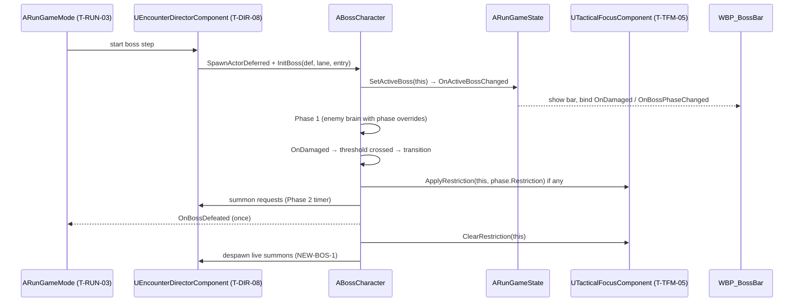
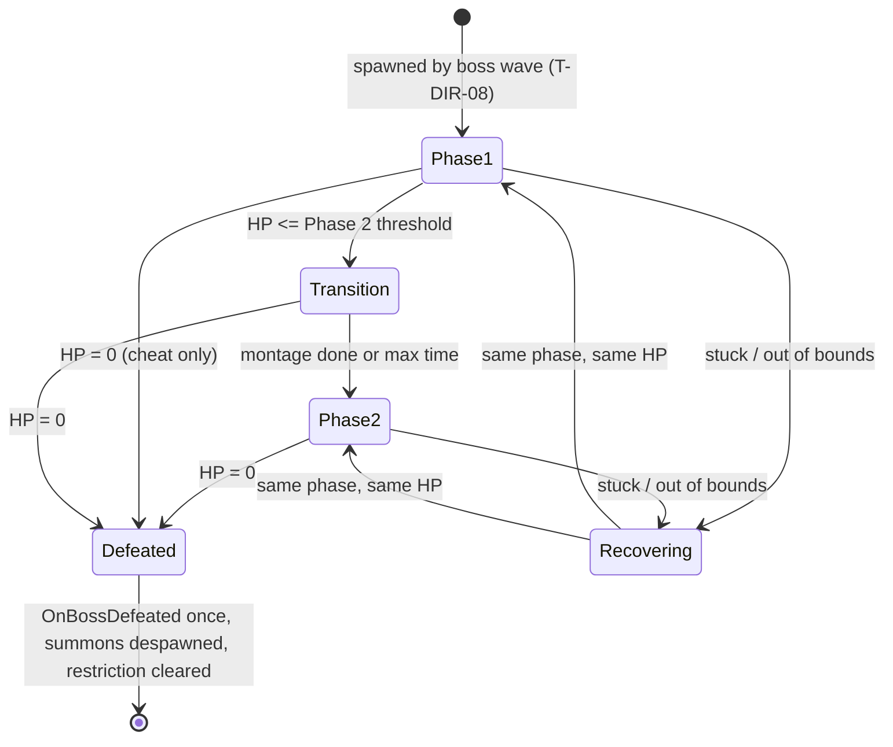

# Boss (BOS): Technical Plan

| | |
|---|---|
| Spec | [spec.md](spec.md) |
| Architecture baseline | [00-foundation/technical-plan.md](../00-foundation/technical-plan.md), D-01..D-18 in [main_implement_plan.md §7](../main_implement_plan.md#7-architecture-baseline) |
| Builds on | [02-enemies/technical-plan.md](../02-enemies/technical-plan.md) (extension points §3.14) |
| Phases | P3; VS provisional |
| Status | Draft v1. All paths and names are proposals |

## 1. Technical Overview

`ABossCharacter` is a subclass of `AEnemyCharacter`. It reuses the enemy brain unchanged: lane following, Path Obstacle attacks, Local Aggro, leash, Staggered, stuck recovery. The boss adds only what enemies lack:

1. A **phase controller** in `ABossCharacter`: on every `OnDamaged`, compare HP fraction with the next threshold (pure helper, tested). Crossing it starts a **transition** (brain paused, transition montage, `Feedback.Boss.PhaseChange`), then applies the new phase's overrides to the enemy's `FEnemyRuntimeParams`.
2. **Summons**: a timer per active phase that asks the DIR spawner for minions at two lane spawn points; the spawner enforces the cap.
3. **Recovery watchdog**: boundary/out-of-world and transition-timeout checks; snapshot respawn handled by the boss wave integration.
4. **Focus restriction** requests to TFM on phase enter/exit.
5. **Boss bar** data via delegates and an `ActiveBoss` reference on `ARunGameState`.

No new AI architecture (D-08: C++ FSM for the prototype boss; StateTree re-evaluated at VS).

## 2. Existing System Impact

| System | Impact |
|---|---|
| ENM | Uses extension points: `FEnemyRuntimeParams`, `PauseDecisions/ResumeDecisions`, `ForceRepath`, `SetAssignedLane`, `OnBrainStateChanged`, removal reporting. No ENM code change expected |
| DIR | T-DIR-08 spawns the boss from the curated boss wave; T-DIR-01 spawner used for summons; T-DIR-04 cap applies; T-DIR-06 reads phase hints |
| RUN | T-RUN-03 boss step starts the boss wave; T-RUN-06 resolves win on `OnBossDefeated`. BOS adds `ActiveBoss` + `OnActiveBossChanged` to `ARunGameState` (small cross-feature edit, coordinate with RUN) |
| TFM | Calls the restriction hook from T-TFM-05 |
| UXF | New `Feedback.Boss.*` rows; boss bar widget in the HUD shell; telemetry rows in the T-UXF-08 log |
| SYN / DEF / SQD | No change; boss is a normal consumer/target |

## 3. Proposed Architecture

### 3.1 Runtime owner and lifetime
- `ABossCharacter`: spawned by the boss wave hook; lives until defeat (+ despawn delay) or run end.
- Phase state, summon timers and recovery data live on `ABossCharacter`. One boss at a time; no subsystem needed.
- `UBossDefinition`: read-only Primary Data Asset.
- `FBossSnapshot` (phase index, HP fraction): kept by the boss wave integration (T-BOS-05) so it survives the boss actor (plain struct, D-14 style).

### 3.2 Main UE types

| Type | Kind | Notes |
|---|---|---|
| `ABossCharacter` | `AEnemyCharacter` subclass | Phase controller, transition, summons, recovery checks, Focus requests. Tag `Unit.Enemy.Boss` |
| `UBossDefinition` | `UPrimaryDataAsset` | Base archetype ref, phases, max transition time. `IsDataValid` = AC-BOS-01 rules |
| `FBossPhaseDefinition` | USTRUCT | Enter fraction, name, hint, layers tested (`TArray<ECombatLayer>`), priority override, speed multiplier, `bFollowLane`, attacks override, summons, Focus restriction, transition montage |
| `FBossSummonEntry` | USTRUCT | Archetype, count, lane spawn point reference (per T-DIR-01), interval, max alive |
| `FBossSnapshot` | USTRUCT | Phase index, HP fraction |
| `BossPhaseRules` | Pure helpers | `ComputePhaseIndex(thresholds, hpFraction)`, `ValidatePhases(...)` |
| `WBP_BossBar` | UMG Blueprint | Binds to boss delegates; no C++ base unless typed data is needed |

### 3.3 Data ownership
- `DA_Boss_SiegeBehemoth` (`UBossDefinition`) + `DA_Enemy_Boss_SiegeBehemoth` (`UEnemyArchetypeDefinition`: stats, armor, poise, attacks, structure multiplier).
- Phase overrides are written into the boss's own `FEnemyRuntimeParams` copy, never into either Data Asset.
- Global: none new in `UGameTuningSettings` except recovery boundary margin if needed.

### 3.4 Communication flow



- Damage → phase: `UHealthComponent::OnDamaged` (event), no polling.
- Summons: boss keeps weak refs to its summons and binds their `OnEnemyRemoved` to count alive.
- Presentation: `UFeedbackSubsystem::Play(Feedback.Boss.*)`; transition and entry animation via BlueprintImplementableEvents on `BP_Boss_SiegeBehemoth`.

### 3.5 C++ / Blueprint split

| C++ | Blueprint / data |
|---|---|
| Phase evaluation, transition timing, overrides, summon timers, recovery, Focus requests, events | Montages, VFX/SFX rows, boss bar layout, placeholder mesh, all tuning in DAs |

### 3.6 Asset references / loading
Hard references in prototype (boss DA → base archetype, montages, summon archetypes). The boss is only loaded in the boss wave; if VS load profiling shows a hitch at boss spawn, switch the boss wave's boss reference to a soft reference loaded during the last intermission.

### 3.7 AI / navigation impact
- Same lane query, obstacle and leash logic as enemies. Phase 1 priority override puts Path Obstacle, Combat Tower and Blocker first, so the boss leaves its route (within leash) to break towers near the lane.
- Boss capsule is large: verify the navmesh agent settings support it (a second nav agent radius may be needed; check in T-BOS-02 and coordinate with DEF if the lane layer's corridor width assumes one agent size).
- Summons are normal enemies assigned to their spawn lane by the spawner.

Phase evaluation (pure, tested):

```text
ComputePhaseIndex(EnterFractions[0..n-1] descending, hp):
  idx = 0
  for i in 1..n-1: if hp <= EnterFractions[i]: idx = i
  return idx            // a big hit can jump phases; transitions run in order, one per phase
```

### 3.8 UI impact
`WBP_BossBar` placed in a slot of `WBP_GameHUD` (T-UXF-02). Shown on `OnActiveBossChanged`, bound to boss delegates, hidden on defeat. Phase tick marks from the definition's thresholds. Bar fill may interpolate (only per-frame widget work allowed).

### 3.9 Save / network impact
None. No mid-run save (A-11). `FBossSnapshot` uses ints/floats only, so it would serialize if mid-run save ever arrives (D-14).

### 3.10 Performance risks
One boss actor; summon bursts are bounded by `max alive` and the spawner cap. Watch for a spawn hitch when a summon wave spawns several enemies in one frame: spread spawns over a few frames inside the summon timer if Insights shows a spike.

### 3.11 Existing systems reused
Everything in ENM (brain, attacks with telegraph, Staggered, lane route, Local Aggro, Path Obstacle, stuck recovery, removal reporting), FND contract and settings, DIR spawner and cap, RUN boss step and resolve, TFM hook, UXF feedback/HUD/telemetry, Gameplay Tags.

### 3.12 New types / files proposed

```text
Source/<Game>/Boss/
  BossCharacter.h/.cpp        ABossCharacter, FBossSnapshot
  BossDefinition.h/.cpp       UBossDefinition, FBossPhaseDefinition, FBossSummonEntry
  BossPhaseRules.h/.cpp       pure helpers
Source/<Game>/Tests/
  BossPhaseRules.spec.cpp
Content/<Game>/Boss/
  BP_Boss_SiegeBehemoth, DA_Boss_SiegeBehemoth, DA_Enemy_Boss_SiegeBehemoth
  AM_Boss_<Attack>, AM_Boss_Roar, AM_Boss_Entry, AM_Boss_Death
Content/<Game>/UI/
  WBP_BossBar
Content/<Game>/Maps/Test/
  L_Test_Boss
```

New leaf tags: `Feedback.Boss.Spawn`, `Feedback.Boss.Telegraph`, `Feedback.Boss.PhaseChange`, `Feedback.Boss.Summon`, `Feedback.Boss.FocusRestricted`, `Feedback.Boss.Defeated`.

### 3.13 Trade-offs

| Choice | Alternative | Why |
|---|---|---|
| Subclass `AEnemyCharacter` | Separate boss pawn | Lane rules, obstacle attack, stagger come free; §22.4 Phase 1 is "an enemy that breaks structures" |
| Phase = data overrides on runtime params | Per-phase C++ behavior classes | Two phases share the same brain; no class per phase until a phase needs new behavior |
| Phase controller inside `ABossCharacter` | `UBossPhaseComponent` | One user; pure helpers are already testable |
| Summons via DIR spawner | Boss spawns actors itself | Cap and lane caps enforced in one place (§8.2, §31.2) |
| `ActiveBoss` on `ARunGameState` | Boss finds HUD / subsystem | GameState is the owner of state UI observes (D-07, D-11) |
| No HP clamp at thresholds | Clamp to force each phase | Per-hit damage is small vs a 50% window; transitions still run in order |

### 3.14 Verification
Automation Spec for phase rules and definition validation; Functional Tests in `L_Test_Boss` (Section 8); G3 playtest with 2/3 Layer Test score sheet.

## 4. Runtime Flow



Inside each phase the ENM brain FSM runs as for any enemy. `Transition` = brain `Paused`; Staggered during it has no behavior effect.

## 5. State / Data

| State | Owner | Changed by | Read by |
|---|---|---|---|
| Phase index, transition flag | `ABossCharacter` | `OnDamaged`, transition end | HUD, telemetry, TFM requests |
| Runtime params (with overrides) | `ABossCharacter` (ENM field) | Phase enter | ENM brain |
| Summon timers, alive summons | `ABossCharacter` | Timer, summon removal | Boss |
| Last valid route point | `ABossCharacter` | Checkpoint passed | Recovery |
| `FBossSnapshot` | Boss wave integration (T-BOS-05) | Phase change, periodic HP update | Respawn after actor loss |
| Active boss | `ARunGameState` | Boss spawn/defeat | HUD |

## 6. Main Implementation Areas

1. **Framework (T-BOS-01):** definition, validation, phase helper, boss class, phase enter/transition, events, cheats.
2. **Phase 1 content (T-BOS-02):** base archetype data, priority override, structure multiplier, armored, attacks; large-agent nav check.
3. **Phase 2 summons (T-BOS-03):** summon timer, spawner requests, two-lane selection, alive tracking, cleanup.
4. **Presentation (T-BOS-04):** telegraph tags, transition montage + feedback, summon announcement.
5. **Integration + recovery (T-BOS-05):** DIR-08 spawn path, RUN resolve, `ActiveBoss`, snapshot respawn, boundary/out-of-world/timeout recovery, run-end cleanup.
6. **HUD bar (T-BOS-06).**
7. **Focus restriction wiring (T-BOS-07).**
8. **Telemetry (T-BOS-08):** damage by `SourceLayer`, structures broken per phase, summon lanes engaged, phase times.

## 7. Error and Edge-Case Handling

| Case | Handling |
|---|---|
| Invalid definition at spawn | Log error; spawn fails loudly in editor; in packaged build fall back to base archetype with phase 1 only and log (run stays winnable) |
| Transition montage missing/interrupted | Timer ends transition at max time |
| Spawner returns no actor (cap / blocked) | Keep entry in the summon queue; retry next interval |
| Summon lane spawn point missing in the level | Validation warning in the boss test map; at runtime skip that entry and log |
| Boss leaves boundary / falls | `FellOutOfWorld` override + boundary check on decision-rate timer → teleport to last valid route point, re-query route |
| Boss actor destroyed without `OnDeath` | `OnEnemyRemoved(Despawned/OutOfWorld)` while run is in boss step → integration respawns from snapshot |
| Run ends mid-fight | RUN phase change → boss `Despawn`, summons despawn, restriction cleared |
| Restriction left active by a bug | Cleared in `EndPlay` as a final guard |

## 8. Testing Strategy

| Layer | What | Where |
|---|---|---|
| Automation Spec | `ComputePhaseIndex` (normal, exact threshold, multi-phase jump), `ValidatePhases` (order, range, ≥2 layers) | `Tests/BossPhaseRules.spec.cpp` |
| Functional Test | Phase 1 breaks Barricade on route; tower in radius attacked; phase change at threshold with feedback event; summons at two spawn points; cap respected; restriction applied/cleared; recovery (out of bounds, stuck, timeout, actor lost); defeat once + summons despawned; Hero death no reset | `L_Test_Boss` |
| Integration | Full P3 run reaching the boss (RUN + DIR + CSM + TFM) | `L_SiegeSite_Proto` |
| Playtest | G3 boss section + 2/3 Layer Test score sheet | `ai/game/playtests/G3_*.md` |

## 9. Performance Risks

| Risk | Mitigation |
|---|---|
| Summon burst spawn hitch | Spawn over several frames if Insights shows a spike |
| Boss + summons push enemy count over cap | Spawner cap (T-DIR-04); summon `max alive` in data |
| Large boss capsule pathing cost / failures | Nav agent check in T-BOS-02; stuck recovery |
| Boss loads at spawn | Soft ref + intermission preload at VS if needed |

## 10. Dependencies and Risks

| Dependency | Needed for | Risk / note |
|---|---|---|
| ENM extension points (T-ENM-01/02/07/08/09/15) | Everything | If ENM changes `FEnemyRuntimeParams`, BOS overrides follow |
| T-DIR-08 curated boss wave hook | Spawn | Must call `InitBoss(def, lane, entry)` |
| T-DIR-01 spawner returning null when cap full | Summons | Requested behavior; confirm with DIR |
| T-RUN-03 / T-RUN-06 | Boss step, win | RUN listens to `OnBossDefeated` |
| `ARunGameState.ActiveBoss` | HUD | No anchor covers it; added in T-BOS-05 with RUN's agreement |
| T-TFM-05 restriction API | Focus restriction | BOS passes TFM's struct; TFM enforces "never full disable" |
| T-UXF-06 audio set | Phase change audio | §28.3 boss phase change row |
| Large nav agent | Phase 1 movement | May need a second agent radius (DEF) |

### Change requests
None. D-08 (C++ FSM for the prototype boss, StateTree at VS) fits; T-BOS-11 performs the VS re-evaluation.

## 11. Requirement Coverage

| Requirement | Technical area | Notes |
|---|---|---|
| R-BOS-01, R-BOS-02 | Areas 1–3, 8; `ValidatePhases` | Layer declaration + playtest evidence |
| R-BOS-03 | `UBossDefinition` validation | 2–3 phases, prototype 2 |
| R-BOS-04 | Areas 2, 4 | Telegraphs, no one-shot check in FT |
| R-BOS-05 | Area 2 | Priority override, ENM obstacle logic |
| R-BOS-06, R-BOS-07 | Area 3 | Summons + `bFollowLane` |
| R-BOS-08, R-BOS-09 | Area 2 | Base archetype poise/armor; SYN states |
| R-BOS-10, R-BOS-11 | Area 1, 4 | Phase helper, transition |
| R-BOS-12 | Area 5 | DIR-08 only spawn path |
| R-BOS-13 | Area 3 | Spawner + cap |
| R-BOS-14 | Area 7 | TFM hook, cleared on every exit path |
| R-BOS-15 | Area 5 | Recovery + snapshot |
| R-BOS-16 | Area 5 | `OnBossDefeated` once |
| R-BOS-17 | Area 5 | No reset on Hero death |
| R-BOS-18 | Area 6 | Boss bar |
| R-BOS-19 | Data | Phase hint read by DIR-06 |
| R-BOS-20, R-BOS-21 | Data model | |
| R-BOS-22..24 | VS tasks T-BOS-11..15 | Provisional |
