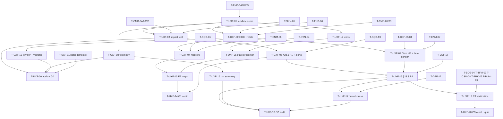

# HUD & Feedback (UXF): Tasks

## 1. Summary

20 tasks across P0–P3. P0 builds the feedback pipeline, HUD shell, combat impact feel, Hero vitals feedback, telemetry and the audit tooling (G0 depends on them). P1 adds markers, state presentation, the §28.3 audio rules and the icon set. P2 adds Core HP, lane danger, structure/Core alert rules, run telemetry summary and a crowd stress check. P3 verifies P3 rows and HUD layers. Each gate gets an explicit audit task. Spec: [spec.md](spec.md). Plan: [technical-plan.md](technical-plan.md).

Owners of other panels and rows are listed in technical plan §5.3 and spec §14; UXF tasks here never build another feature's panel.

## 2. Task Overview

| ID | Task | Type | Phase | Priority | Dependencies | Status |
|---|---|---|---|---|---|---|
| T-UXF-01 | `UFeedbackSubsystem` + `DT_Feedback` + row struct (variants, throttle, HUD layers, coverage) | GAMEPLAY | P0 | Blocker | T-FND-04, T-FND-07, T-FND-09 | Review |
| T-UXF-02 | `WBP_GameHUD` shell + Hero HP/stamina + pawn rebinding | UI | P0 | Blocker | T-UXF-01, T-FND-06, T-CMB-01, T-CMB-03 | Todo |
| T-UXF-03 | Hit stop, camera shake, impact SFX/VFX per material and hit type | GAMEPLAY | P0 | Blocker | T-UXF-01, T-CMB-04, T-CMB-08, T-CMB-09, T-SYN-01 | Todo |
| T-UXF-08 | Playtest telemetry log per session/run + generic `LogEvent` | TOOLS | P0 | High | T-UXF-01, T-FND-09 | Todo |
| T-UXF-10 | Hero low-HP feedback + damage vignette | UI | P0 | High | T-UXF-02, T-CMB-11 | Todo |
| T-UXF-11 | Playtest notes template | DESIGN | P0 | High | none | Todo |
| T-UXF-09 | Feedback contract audit tooling + G0 audit | QA | P0 | High | T-UXF-03, T-UXF-08, T-UXF-10, T-UXF-11, T-CMB-04, T-ENM-03, T-SYN-01 | Todo |
| T-UXF-04 | World marker component (squad, enemy class, structure HP) + tactical display | UI | P1 | High | T-UXF-01, T-UXF-02, T-SQD-01, T-ENM-06 | Todo |
| T-UXF-05 | Combat state icons/VFX (state presenter on `DT_CombatStatePresentation`) | VFX | P1 | High | T-UXF-01, T-SYN-04, T-UXF-12 | Todo |
| T-UXF-06 | Audio event set from §28.3: classes, concurrency, ducking, P1 events, alert feed | AUDIO | P1 | High | T-UXF-03, T-SYN-02 | Todo |
| T-UXF-12 | Icon set + color tokens (§28.2) | ART | P1 | Medium | T-UXF-01 | Todo |
| T-UXF-13 | Feedback Functional Test maps | QA | P1 | High | T-UXF-03, T-UXF-04, T-UXF-05 | Todo |
| T-UXF-14 | G1 feedback audit + readability check | QA | P1 | High | T-UXF-04, T-UXF-05, T-UXF-06, T-UXF-13, T-SQD-13 | Todo |
| T-UXF-07 | Core HP + lane danger (`ULaneDangerSubsystem` + strip) | UI | P2 | High | T-UXF-02, T-DEF-03, T-DEF-04, T-ENM-07, T-RUN-01 | Todo |
| T-UXF-15 | §28.3 P2 alert rules: tower critical, Core under attack, structure/lane toasts | AUDIO | P2 | High | T-UXF-06, T-UXF-07, T-DEF-17 | Todo |
| T-UXF-16 | Run telemetry summary: Core HP curve, deaths, Focus time, perks | TOOLS | P2 | High | T-UXF-08, T-DEF-03, T-RUN-01 | Todo |
| T-UXF-17 | Crowd feedback stress check | PERF | P2 | Medium | T-UXF-15, T-DEF-12 | Todo |
| T-UXF-18 | G2 feedback audit + readability check | QA | P2 | High | T-UXF-15, T-UXF-16, T-UXF-17 | Todo |
| T-UXF-19 | P3 contract verification: boss phase change, Focus/Spirit/Modal layers, P3 rows | QA | P3 | High | T-UXF-15, T-BOS-04, T-TFM-03, T-CSM-08, T-PRK-05, T-RUN-06 | Todo |
| T-UXF-20 | G3 feedback audit + §28.1 readability quiz | QA | P3 | High | T-UXF-19, T-UXF-16 | Todo |

## 3. Detailed Tasks

## P0

### T-UXF-01 — `UFeedbackSubsystem` + `DT_Feedback` + row struct
**Type** GAMEPLAY · **Phase** P0

**Objective** One entry point for all presentation feedback, driven by data, throttled, with world-level HUD layer state and coverage tooling.

**Related Requirements** R-UXF-01, R-UXF-02, R-UXF-03, R-UXF-06, R-UXF-23; AC-UXF-01

**Dependencies** T-FND-04 (tag root), T-FND-07 (settings), T-FND-09 (CVars)

**Implementation Notes**
- [x] `Feedback/FeedbackTypes.h`: `FFeedbackRow` (technical plan §5.1), `FFeedbackEventContext` (§5.2: Instigator, Target, `bIsHeavy`, `bTargetArmored`, Surface, Variant, Lane, Magnitude, Detail, Location, Direction).
- [x] `Feedback/FeedbackTags.h/.cpp`: native P0 leaves (`Feedback.Combat.Hit.Light/.Heavy` + `.Armored` variants, `Feedback.Combat.Block/BlockBreak/Parry`, `Feedback.Hero.Damaged/Death/StaminaInsufficient/LowHealth`, `Feedback.Enemy.Telegraph/.Telegraph.Heavy/Death`, `Feedback.State.Staggered.Applied/.Removed`). Later phases add their leaves in their own tasks.
- [x] `UFeedbackSubsystem` (`UWorldSubsystem`, `ShouldCreateSubsystem` = game/PIE worlds): load `UGameTuningSettings.FeedbackTable` at init; build tag → row and (tag, variant) → row maps; warn when row name ≠ tag.
- [x] `Play(Tag, Ctx)` per technical plan §4.1 (sound 2D/at location with surface map, Niagara at location/attached, cooldown, burst limit, `OnFeedbackPlayed`). Hit stop and shake fields are wired in T-UXF-03.
- [x] HUD layers: `EHUDLayer` flags, `SetHUDLayerActive(Layer, bool)`, `GetHUDLayers()`, `IsTacticalDisplay()`, `OnHUDLayersChanged`.
- [x] Missing row: dev on-screen + `UE_LOG` Warning once per tag; Shipping log once.
- [x] `game.debug.Feedback 1`: last 10 played tags on screen. Console `game.feedback.Coverage`: declared `Feedback.*` leaves not played in this world.
- [x] Create `DT_Feedback` with P0 rows (placeholder assets; T-UXF-03 completes hit rows).

**Expected Files / Assets** `Source/<Game>/Feedback/FeedbackTypes.h`, `FeedbackTags.h/.cpp`, `FeedbackSubsystem.h/.cpp`; `Source/<Game>/Tests/FeedbackThrottle.spec.cpp`, `FeedbackVariant.spec.cpp`; `Content/<Game>/Feedback/DT_Feedback`

**Test Case** Spec: cooldown 1 s → second play at 0.5 s rejected, at 1.1 s accepted; per-actor cooldown → two actors both play; burst limit 4 / 0.25 s → 20 calls in one frame play 4. Variant: `Hit.Light` with `bTargetArmored` → `.Armored` row; variant missing → base row. PIE: `Play` unknown tag → one warning, no crash; `SetHUDLayerActive(TacticalFocus, true)` → `OnHUDLayersChanged` fires once.

**Acceptance Criteria**
- [x] Spec cases pass.
- [x] No gameplay code needed to change a sound/VFX (data only).
- [x] Coverage command lists unplayed tags.

**Verification** Automation Specs `<Game>.Feedback.Throttle`, `<Game>.Feedback.Variant`; PIE checks above.

**Progress (2026-10-05, Claude Code, `feat/13-hud-feedback`)** Review. Built as listed; `FFeedbackContext` is named `FFeedbackEventContext` because the engine owns the old name (technical plan §5.2, §8a updated). Placeholder: non-hit rows play the engine `1kSineTonePing`; hit rows are empty for T-UXF-03. `DT_Feedback` is made by `Tools/create_feedback_assets.bat` (idempotent). Verified: editor and game builds, `Tools/run_tests.bat` 29/29 (Throttle 9, Variant 5); the PIE cases ran in a real game `UWorld` inside `Feedback.Throttle`; a standalone `-game` session on `L_Boot` loaded the table and `game.feedback.Coverage` listed all 16 P0 tags. Not seen on screen yet: the `game.debug.Feedback` overlay and the missing-row on-screen message, because nothing calls `Play` in PIE until CMB/SYN integration.

---

### T-UXF-02 — `WBP_GameHUD` shell + Hero HP/stamina + pawn rebinding
**Type** UI · **Phase** P0

**Objective** A HUD shell every feature plugs into, with Hero HP and stamina that survive Hero respawn as a fresh pawn.

**Related Requirements** R-UXF-13, R-UXF-19, R-UXF-23; AC-UXF-02, AC-UXF-08

**Dependencies** T-UXF-01, T-FND-06 (controller), T-CMB-01 (hero), T-CMB-03 (stamina delegates)

**Implementation Notes**
- [ ] `UI/GameHUDWidget` (C++ base): binds `UFeedbackSubsystem::OnHUDLayersChanged`; `BlueprintImplementableEvent ApplyLayers(Flags)` for panel visibility per technical plan §5.3.
- [ ] `AHeroPlayerController` creates `WBP_GameHUD` at BeginPlay (class set on the controller BP), exposes `GetGameHUD()`.
- [ ] `WBP_GameHUD` named slots: Vitals, LockOn, Alerts, Squads, CoreLanes, RunStatus, Forecast, Focus, Spirit, Boss, Perks, Modal, Prompt, Debug. Empty slots collapsed. Layout keeps the center and lock-on target clear.
- [ ] `UI/HeroVitalsWidget` (C++ base) + `WBP_HeroVitals`: bind possessed pawn's `UHealthComponent::OnDamaged` and `UStaminaComponent::OnStaminaChanged/OnStaminaSpendFailed`; stamina bar lerp in `NativeTick` (only allowed per-frame widget work).
- [ ] Rebind on the controller's possessed-pawn-changed delegate (verify name in pinned UE); unbind old pawn; hide bars while no pawn.
- [ ] Stamina flash on `OnFeedbackPlayed(Feedback.Hero.StaminaInsufficient)`.

**Expected Files / Assets** `Source/<Game>/UI/GameHUDWidget.h/.cpp`, `HeroVitalsWidget.h/.cpp`; `Content/<Game>/UI/WBP_GameHUD`, `WBP_HeroVitals`

**Test Case** PIE `L_CombatSandbox`: take a hit → HP drops; dodge → stamina drops and regens smoothly; spam dodge to empty → bar flashes. `KillHero` → sandbox respawn spawns a new pawn → bars show the new pawn's full values and react to its damage.

**Acceptance Criteria**
- [ ] Bars bind by delegates (no polling except stamina lerp).
- [ ] Respawn rebinds correctly (AC-UXF-08).
- [ ] Layer flags hide/show panels per matrix (P0: Combat only).

**Verification** PIE manual steps; `FT_Feedback_Layers` (T-UXF-13) later.

---

### T-UXF-03 — Hit stop, camera shake, impact SFX/VFX per material and hit type
**Type** GAMEPLAY · **Phase** P0

**Objective** Combat impacts feel heavy and readable (§9.8): distinct normal / armored / parry / stagger hits, surface-based sounds, controlled hit stop and shake.

**Related Requirements** R-UXF-07..12, R-UXF-05; AC-UXF-03..06

**Dependencies** T-UXF-01, T-CMB-04 (`DeliverHit` plays with context), T-CMB-08 (block), T-CMB-09 (parry), T-SYN-01 (`Staggered.Applied`)

**Implementation Notes**
- [ ] Physical surfaces in Project Settings: Flesh, Armor, Shield, Wood, Stone; `PM_*` assets on placeholder meshes (hero shield = Shield, Armored = Armor). Confirm with CMB that melee traces return physical materials (`bReturnPhysicalMaterial`, verify) and fill `Ctx.Surface`.
- [ ] Hit stop: on rows with `HitStopSeconds > 0` and `bHeroOnly` satisfied, set `CustomTimeDilation = HitStopDilation` on Instigator and Target only; restore after real-time duration (technical plan §4.2; verify approach with a global dilation of 0.25 active); overlaps extend; cap `MaxHitStopSeconds`. Never call global time dilation.
- [ ] Camera shake: radius 0 → `StartCameraShake` on the local player only if Hero involved; otherwise `PlayWorldCameraShake` with radii; stop the previous instance of the same tag; scale × `CameraShakeScale`.
- [ ] Rows: `Hit.Light` (no stop/shake), `Hit.Heavy` (stop ~0.08 s, light shake), `.Armored` variants (dull sparks, metal sound), `Block`, `BlockBreak` (stop + shake), `Parry` (longest stop ~0.12 s, unique sound), `State.Staggered.Applied` (stop + shake when Hero instigated, burst limit). Four clearly different VFX colors/shapes (production plan).
- [ ] Input check with CMB: buffered input during hit stop executes after it (CMB buffer must use real time or tolerate actor dilation).

**Expected Files / Assets** edits `FeedbackSubsystem.*`; `Content/<Game>/Feedback/PM_*`, `BP_Shake_HitHeavy`, `BP_Shake_BlockBreak`, `BP_Shake_Parry`, `NS_Hit_*`, `SFX_Hit_*` placeholders, rows in `DT_Feedback`; `Content/<Game>/Maps/Test/FT_Feedback_HitStop`

**Test Case** PIE vs P0 enemy and an Armor-PM dummy: Light → spark, no freeze. Heavy → hero + target freeze ~0.08 s while a second enemy keeps moving. Parry → freeze + unique ring. Heavy on Armor dummy → armored variant VFX/SFX. `CameraShakeScale 0` → no shakes. `FT_Feedback_HitStop`: global dilation set to 0.25 by test → heavy hit → global dilation still 0.25 after restore. Buffer Light during a Heavy hit stop → Light executes.

**Acceptance Criteria**
- [ ] Blind test: tester names hit type in ≥ 8/10 (AC-UXF-03).
- [ ] Global time dilation never written by UXF (grep + FT).
- [ ] No input lost.

**Verification** PIE; Functional Test `FT_Feedback_HitStop`; blind test noted in G0 notes.

---

### T-UXF-08 — Playtest telemetry log per session/run + generic `LogEvent`
**Type** TOOLS · **Phase** P0

**Objective** Every playtest produces a local JSON Lines log any feature can add events to (RUN pacing, SQD orders, BOS layer damage, CMB G0 metrics).

**Related Requirements** R-UXF-27; AC-UXF-07

**Dependencies** T-UXF-01, T-FND-09

**Implementation Notes**
- [ ] `Feedback/PlaytestLogSubsystem` (`UWorldSubsystem`, game worlds, `#if !UE_BUILD_SHIPPING`); CVar `game.playtest.Log` (default 1 in Development).
- [ ] On world begin play: open `Saved/Playtest/<yyyyMMdd_HHmmss>_<Map>.jsonl` (`FPaths::ProjectSavedDir()`), write `session_start` (schema technical plan §5.4).
- [ ] Subscribe `OnFeedbackPlayed` → `fb` lines.
- [ ] `LogEvent(FName, TMap<FName,float>, TMap<FName,FString>)` + `BlueprintCallable` static wrapper with world context; every line gets `t`, `rt`.
- [ ] Hero binder: possessed Hero's `OnActionStateChanged` → `hero_action`; `UHealthComponent::OnDamaged` → `hero_damaged`; rebind on pawn change.
- [ ] `FPlaytestSummary` (pure): counts per tag, Hero deaths, parries, block breaks, action counts; `summary` line on world teardown (`result: Session`). Run fields come in T-UXF-16.
- [ ] Append + flush per line (verify `IFileManager::CreateFileWriter` append flag or `FFileHelper::SaveStringToFile` with `FILEWRITE_Append`); write failure → one warning, logging off for the session.
- [ ] Local file only; no network; no personal data.

**Expected Files / Assets** `Source/<Game>/Feedback/PlaytestLogSubsystem.h/.cpp`, `PlaytestSummary.h/.cpp`; `Source/<Game>/Tests/PlaytestSummary.spec.cpp`

**Test Case** Spec: synthetic stream (2 × `Hero.Death`, 3 × `Combat.Parry`) → summary counts 2 and 3. PIE: 2 minutes in sandbox, call `LogEvent("test", {x:1}, {s:"a"})` from cheat, quit → file exists, each line valid JSON (`jq -c . file.jsonl`), test event and summary present.

**Acceptance Criteria**
- [ ] One file per world; valid JSON per line.
- [ ] `LogEvent` usable from C++ and Blueprint.
- [ ] Compiled out of Shipping.

**Verification** Automation Spec `<Game>.Feedback.PlaytestSummary`; manual file check.

---

### T-UXF-10 — Hero low-HP feedback + damage vignette
**Type** UI · **Phase** P0

**Objective** The player feels damage and knows when HP is low without reading numbers.

**Related Requirements** R-UXF-03(c), R-UXF-13; AC-UXF-09; FC-09, FC-10

**Dependencies** T-UXF-02, T-CMB-11 (`Feedback.Hero.Damaged` play)

**Implementation Notes**
- [ ] `WBP_DamageVignette` in the Vitals slot: edge flash ≤ 0.3 s on `OnFeedbackPlayed(Feedback.Hero.Damaged)`; never covers the center.
- [ ] Low-HP latch in `UHeroVitalsWidget`: ratio ≤ `HeroLowHealthThreshold` (0.30) → `Play(Feedback.Hero.LowHealth)` once + persistent vignette pulse; above re-arm (0.40) → pulse off, latch re-armed. Reset on pawn change.
- [ ] Rows: `Feedback.Hero.Damaged` (hurt sound), `Feedback.Hero.LowHealth` (heartbeat sting), `Feedback.Hero.Death`, `Feedback.Hero.StaminaInsufficient` (soft fail sound) with placeholders.

**Expected Files / Assets** `Content/<Game>/UI/WBP_DamageVignette`; edits `HeroVitalsWidget.*`; rows in `DT_Feedback`

**Test Case** PIE: damage Hero to 29% → one heartbeat + pulse; more damage → no new heartbeat; cheat heal to 45% → pulse stops; damage to 25% → heartbeat again. Respawn → pulse off.

**Acceptance Criteria**
- [ ] Once per crossing (AC-UXF-09).
- [ ] Vignette never blocks the center.

**Verification** PIE manual; `FT_Feedback_HitTypes` covers the damaged row (T-UXF-13).

---

### T-UXF-11 — Playtest notes template
**Type** DESIGN · **Phase** P0

**Objective** Every gate playtest records evidence in the same shape (master plan §3 gate rule).

**Related Requirements** R-UXF-28

**Dependencies** none

**Integrates with (not blocking)** T-UXF-08 telemetry schema (the template links to its summary fields)

**Implementation Notes**
- [ ] Create `ai/game/playtests/_template.md` with the sections in technical plan §5.5 (header, gate checklist by reference to master plan §3, telemetry summary, §28.1 quiz table, sound-only test, feedback audit table, observations table with the workflow playtest fields, KEEP/CHANGE/DELETE, follow-ups).
- [ ] Add a short `ai/game/playtests/README.md` line on naming: `<YYYY-MM-DD>_<gate>_<scenario>.md`; telemetry files stay in `Saved/Playtest/` (not committed).

**Expected Files / Assets** `ai/game/playtests/_template.md`, `ai/game/playtests/README.md`

**Test Case** Fill the template for a dry-run G0 session → each G0 checklist item has a place for evidence; reviewer confirms.

**Acceptance Criteria**
- [ ] Template covers every gate checklist item through the reference.
- [ ] Observations table uses the playtesting fields (issue type Design vs Bug, decision).

**Verification** Review by the gate owner.

---

### T-UXF-09 — Feedback contract audit tooling + G0 audit
**Type** QA · **Phase** P0 (procedure reused by T-UXF-14, T-UXF-18, T-UXF-20)

**Objective** A repeatable audit that proves every contract row in scope works, run first at G0.

**Related Requirements** R-UXF-01, R-UXF-29; AC-UXF-10

**Dependencies** T-UXF-03, T-UXF-08, T-UXF-10, T-UXF-11, T-CMB-04, T-ENM-03, T-SYN-01 (their P0 feedback rows are what G0 audits)

**Implementation Notes**
- [ ] Editor automation test `<Game>.Feedback.TableCoverage` (technical plan §5.6 step 1), including `DT_CombatStatePresentation` applied tags once SYN adds rows.
- [ ] Write the audit checklist into the G0 notes from the template: rows FC-02..07, FC-09..14, FC-16, FC-17, FC-65.
- [ ] Play the G0 scenario in `L_CombatSandbox` with telemetry on; run `game.feedback.Coverage`; explain or fix every unplayed P0 tag.
- [ ] Blind hit-type sound test (AC-UXF-03).
- [ ] Each failing row → task in the owner feature.

**Expected Files / Assets** `Source/<Game>/Tests/FeedbackTableCoverage.cpp`; `ai/game/playtests/<date>_G0_feedback-audit.md`

**Test Case** Remove one P0 row from `DT_Feedback` → coverage test fails naming the tag; restore → passes.

**Acceptance Criteria**
- [ ] Coverage test green from the CLI.
- [ ] G0 notes contain the audit with no unresolved P0 gap.

**Verification** CLI test run; gate review reads the notes.

---

## P1

### T-UXF-04 — World marker component (squad, enemy class, structure HP) + tactical display
**Type** UI · **Phase** P1 (structure use in P2)

**Objective** One marker component for squads, elite enemies and structures, with a global tactical display used by Tactical Focus and Commander Spirit.

**Related Requirements** R-UXF-14, R-UXF-16, R-UXF-24; AC-UXF-11, AC-UXF-12

**Dependencies** T-UXF-01 (layers), T-UXF-02, T-SQD-01 (squads to test on), T-ENM-06 (Armored)

**Implementation Notes**
- [ ] `UI/WorldMarkerComponent : UWidgetComponent` (screen space, desired size): `Kind {Squad, EnemyClass, Structure}`, `Icon`, `NormalRule {Always, WhenDamaged, TacticalOnly}`, `MaxDistance`, `bShowHealth`, `HideAfterSeconds` (structures).
- [ ] Auto-bind sibling `UHealthComponent` when `bShowHealth`; setters for owners: `SetOrderIcon(Command tag)`, `SetStrength(float)`, `SetWarning(bool)`, `SetGreyed(bool)`, `SetCritical(bool)`, `SetBonusIcon(bool)`.
- [ ] Visibility: 4 Hz timer (distance + rule); `OnHUDLayersChanged` → `IsTacticalDisplay()` shows all markers (structures with HP) immediately; Modal hides all.
- [ ] `WBP_WorldMarker`: icon, order icon, strength/HP bar, warning/critical states (shape + color, R-UXF-05).
- [ ] Assemble enemy class markers on `BP_Enemy_Armored` (later Siege/Boss); no marker on Swarm. Squad wiring is SQD `T-SQD-13`; structure wiring is DEF `T-DEF-17`.
- [ ] `ponytail:` note in header: one widget component per marked actor; switch to HUD projection if Insights shows cost.

**Expected Files / Assets** `Source/<Game>/UI/WorldMarkerComponent.h/.cpp`; `Content/<Game>/UI/WBP_WorldMarker`

**Test Case** PIE `L_CombinedArms`: Armored shows class icon, Swarm none; marker hidden beyond `MaxDistance`; on a test squad (SQD wiring or debug setters) order icon and strength update. `SetHUDLayerActive(TacticalFocus, true)` → all markers visible same frame; false → back to normal. Test structure dummy: marker appears on hit, hides after `HideAfterSeconds`.

**Acceptance Criteria**
- [ ] AC-UXF-11, AC-UXF-12 pass.
- [ ] No Tick on the component (timer only).

**Verification** PIE; `FT_Feedback_Layers` (T-UXF-13).

---

### T-UXF-05 — Combat state icons/VFX (state presenter)
**Type** VFX · **Phase** P1

**Objective** Staggered, Armor Broken and Marked look identical on every unit and from every source (§28.2).

**Related Requirements** R-UXF-18; AC-UXF-13; FC-26..28

**Dependencies** T-UXF-01, T-SYN-04 (`DT_CombatStatePresentation`, `GetStatePresentation`, `OnStateAdded/Removed`), T-UXF-12 (icons)

**Implementation Notes**
- [ ] `Feedback/CombatStatePresenterComponent`: technical plan §4.3. Binds sibling `UCombatStateComponent::OnStateAdded/OnStateRemoved`; spawns the row's `LoopVFX` attached at socket `FeedbackHead` (fallback bounds top); sets Niagara user params Icon, Colour, Slot = `DisplayPriority` (verify texture user parameter support; fallback: one Niagara system per state with the icon baked in).
- [ ] Add the component to hero, soldier, enemy and boss base BPs; add socket `FeedbackHead` to the shared skeleton.
- [ ] `NS_State_Loop` template: icon sprite above head offset by slot (max 3) + body effect; effect type `NET_StateLoop` with instance budget + distance cull.
- [ ] Applied/removed sounds stay with SYN's `Feedback.State.*` rows (not played here).

**Expected Files / Assets** `Source/<Game>/Feedback/CombatStatePresenterComponent.h/.cpp`; `Content/<Game>/Feedback/NS_State_Loop`, `NET_StateLoop`; BP edits

**Test Case** `FT_Feedback_StatePresenter`: apply Armor Broken to a dummy via Hero Heavy and via cheat → same VFX/icon/color; apply all three → icons in priority order; remove one → its VFX gone; destroy dummy with active states → no errors. PIE: 30 Staggered Swarm → `stat game` frame time noted.

**Acceptance Criteria**
- [ ] AC-UXF-13.
- [ ] No per-unit widget components added for states.

**Verification** Functional Test; screenshot for SYN `T-SYN-09`.

---

### T-UXF-06 — Audio event set from §28.3 (P1 part) + alert feed
**Type** AUDIO · **Phase** P1 (P2/P3 parts in T-UXF-15, T-UXF-19)

**Objective** §28.3 events are distinct and audible over combat; alerts show as toasts.

**Related Requirements** R-UXF-04, R-UXF-21, R-UXF-22; AC-UXF-14; FC-06, FC-19, FC-22, FC-26, FC-67

**Dependencies** T-UXF-03, T-SYN-02 (Armor Broken)

**Consumers (not dependencies)** T-SQD-13 plays `Feedback.Command.*` / `Feedback.Squad.*` through these rows; the blind test with real squad events runs in T-UXF-14.

**Implementation Notes**
- [ ] Sound Classes `SC_SFX` (child `SC_Impact`), `SC_Alert`, `SC_Voice`, `SC_UI`, `SC_Music`; Sound Concurrency `SCON_Impact` (max 8, stop farthest), `SCON_Alert` (max 2, stop oldest), `SCON_Bark` (max 2); passive ducking of `SC_SFX` while `SC_Alert` plays (verify passive sound mix modifiers in pinned UE).
- [ ] Distinct-timbre brief per §28.3 event (row comment + production plan audio list): parry ring, armor-break crunch, per-squad acknowledgement bark (`Feedback.Command.Acknowledged.Infantry/.Archer` variants via `Ctx.Variant`), low-strength horn (spatialized).
- [ ] Assign P1 rows' sounds to the right class/concurrency; positional rows use `ATT_World`, global rows `bSound2D`.
- [ ] `WBP_AlertFeed` in the Alerts slot: rows with `ToastText`; max 3, 3 s, duplicates merged "×2"; `{Detail}`/`{Lane}` formatting.

**Expected Files / Assets** `Content/<Game>/Feedback/Audio/SC_*`, `SCON_*`, `SMix_AlertDuck`, `ATT_World`; `Content/<Game>/UI/WBP_AlertFeed`; row updates

**Test Case** Blind test in `L_CombinedArms` with events fired by a `PlayFeedback <Tag> [Variant]` cheat (add it to `UGameCheatManager` if T-UXF-01 has none): tester faces away; 10 random events from {parry, armor break, order ack Infantry, order ack Archer, low strength} → ≥ 9 identified. Same events fired during a 40-enemy brawl → still heard. Alert toast rows show, merge and expire. The same test with real squad events is repeated in T-UXF-14.

**Acceptance Criteria**
- [ ] AC-UXF-14.
- [ ] Alerts audible in the brawl test.

**Verification** Manual test results in the G1 notes.

---

### T-UXF-12 — Icon set + color tokens (§28.2)
**Type** ART · **Phase** P1

**Objective** One placeholder icon set and color token list so every feature uses the same visual language.

**Related Requirements** R-UXF-05, R-UXF-15, R-UXF-16, R-UXF-18

**Dependencies** T-UXF-01

**Implementation Notes**
- [ ] Icons (placeholder, shape-distinct): states (Staggered, Armor Broken, Marked → handed to SYN rows), enemy class (Armored, Siege, Boss), squad type (Infantry, Archer), orders (Guard, Attack, Follow, Retreat), structures (Core, Ballista, Bombard, Barricade), perk categories (Hero, Army, Defense) for PRK, warning/critical.
- [ ] Color tokens in `UGameTuningSettings` (Feedback category): ally, enemy, elite accent, three reserved state colors (production plan §3), warning, critical.
- [ ] Grayscale check: all icons distinguishable without color.

**Expected Files / Assets** `Content/<Game>/UI/Icons/T_Icon_*`; settings properties

**Test Case** Grayscale screenshot of the icon sheet → each icon named correctly by a second person.

**Acceptance Criteria**
- [ ] Every icon unique by shape.
- [ ] State colors not used by any other UI element (review).

**Verification** Review + grayscale screenshot in G1 notes.

---

### T-UXF-13 — Feedback Functional Test maps
**Type** QA · **Phase** P1

**Objective** Automated regression for the feedback pipeline before each gate.

**Related Requirements** AC-UXF-01, -03, -04, -12, -13

**Dependencies** T-UXF-03, T-UXF-04, T-UXF-05

**Implementation Notes**
- [ ] `FT_Feedback_HitTypes`: drive `DeliverHit` outcomes (light, heavy, armored, block, block break, parry) on dummies; capture `OnFeedbackPlayed` → expected tag/variant each.
- [ ] `FT_Feedback_HitStop` (from T-UXF-03) added to the suite.
- [ ] `FT_Feedback_StatePresenter` (from T-UXF-05) added.
- [ ] `FT_Feedback_Layers`: set/clear each layer → marker tactical display and HUD panel visibility per matrix.
- [ ] Add all to the CLI runner group `<Game>.Feedback`.

**Expected Files / Assets** `Content/<Game>/Maps/Test/FT_Feedback_*`

**Test Case** CLI run of `<Game>.Feedback` → all pass; break one row's tag → `FT_Feedback_HitTypes` fails.

**Acceptance Criteria**
- [ ] Suite green from the CLI.

**Verification** CLI log.

---

### T-UXF-14 — G1 feedback audit + readability check
**Type** QA · **Phase** P1

**Objective** Run the audit (technical plan §5.6) for P0+P1 rows inside the G1 session (SQD `T-SQD-16`).

**Related Requirements** R-UXF-14, R-UXF-20, R-UXF-29; AC-UXF-15

**Dependencies** T-UXF-04, T-UXF-05, T-UXF-06, T-UXF-13, T-SQD-13

**Implementation Notes**
- [ ] Coverage test + `game.feedback.Coverage` after the G1 scenario.
- [ ] Rows FC-02..28 (P1 scope) checked; stuck teleport never seen on screen (FC-25).
- [ ] Partial §28.1 quiz: where squads are, current command state, which enemy is elite (10 paused frames).
- [ ] §28.3 sound-only test results from T-UXF-06.
- [ ] Record in `ai/game/playtests/<date>_G1_feedback-audit.md`.

**Expected Files / Assets** G1 notes file

**Test Case** Not applicable (audit). Evidence = notes.

**Acceptance Criteria**
- [ ] No unresolved P1 coverage gap, or follow-up tasks created.

**Verification** G1 gate review.

---

## P2

### T-UXF-07 — Core HP + lane danger indicators
**Type** UI · **Phase** P2

**Objective** Core HP and per-lane danger are readable in 1–2 s, and lane danger values are available to non-HUD code (TFM, CSM) and to pulses (DEF, BOS).

**Related Requirements** R-UXF-14, R-UXF-25; AC-UXF-16, AC-UXF-17

**Dependencies** T-UXF-02, T-DEF-03 (Core), T-DEF-04 (lanes), T-ENM-07 (enemy assigned lane), T-RUN-01 (`ARunGameState` Core ref)

**Implementation Notes**
- [ ] `Feedback/LaneDangerSubsystem` (`UWorldSubsystem`): lanes from `ULaneNavigationSubsystem`; 2 Hz scoring per technical plan §4.5 (pure `LaneDanger::Score/Level` functions); `PulseLane(Lane, Seconds, Level)`; `GetLaneDanger(Lane)`; `OnLaneDangerChanged`. Idle when no lanes. `ponytail:` comment on the actor scan.
- [ ] Settings: thresholds Low/Medium/High, `NearCoreRadius`, `NearCoreWeight`, default pulse seconds (all starting values).
- [ ] `WBP_LaneDanger` (CoreLanes slot): one segment per lane, level by shape + color; flash on pulse.
- [ ] `WBP_CoreHealth` (CoreLanes slot): binds Core `UHealthComponent::OnDamaged` (flash) and RUN `OnCoreCriticalChanged` (pulse, P3 `T-RUN-13`); always visible in run maps.
- [ ] Tell TFM/CSM/BOS owners the API (`GetLaneDanger`, `PulseLane`).

**Expected Files / Assets** `Source/<Game>/Feedback/LaneDangerSubsystem.h/.cpp`; `Source/<Game>/Tests/LaneDanger.spec.cpp`; `Content/<Game>/UI/WBP_LaneDanger`, `WBP_CoreHealth`

**Test Case** Spec: 10 Swarm (cost 2) far + 2 Armored (cost 8) near Core with weight 1 → expected score/level; pulse High for 3 s overrides Low, expires after 3 s. PIE `L_SiegeSite_Proto`: start wave on left lane → left segment rises within 1 s; `PulseLane(Right, 3)` → right flashes High 3 s; `DamageCore` → Core bar flashes.

**Acceptance Criteria**
- [ ] AC-UXF-16, AC-UXF-17.
- [ ] Widgets hold no danger state of their own.

**Verification** Automation Spec `<Game>.Feedback.LaneDanger`; PIE.

---

### T-UXF-15 — §28.3 P2 alert rules: tower critical, Core under attack, structure/lane toasts
**Type** AUDIO · **Phase** P2

**Objective** The P2 §28.3 events and §34.4 structure cases are distinct, correctly spatialized and never spam.

**Related Requirements** R-UXF-21, R-UXF-22, R-UXF-26; AC-UXF-18; FC-29..35

**Dependencies** T-UXF-06, T-UXF-07, T-DEF-17 (DEF plays and authors its rows)

**Implementation Notes**
- [ ] Review DEF rows against §28.3 rules: `Feedback.Structure.Critical` positional alert class; `Feedback.Core.UnderAttack` 2D alert class with cooldown ≥ DEF throttle; `Feedback.Structure.Destroyed` toast "{Detail} destroyed ({Lane})"; `Feedback.Lane.PathOpened` toast + `PulseLane`.
- [ ] Wire lane pulses: confirm DEF calls `PulseLane` on path opened and on Core attacked (attacker's lane); if not, add the calls in `T-DEF-17` with the DEF owner.
- [ ] Assign Wood/Stone `SurfaceSounds` on `Feedback.Structure.Hit`.
- [ ] Add `Feedback.Run.*` P2 rows to the alert class rules where they are alerts (WaveStart horn vs boss horn distinct).

**Expected Files / Assets** row updates in `DT_Feedback`; possible small edits in DEF BPs (with owner)

**Test Case** PIE `L_SiegeSite_Proto`: Siege enemy breaks a Ballista: critical alarm once (positional, from its side), destroyed toast names the lane, path opened pulses the lane strip. 10 enemies hit the Core for 20 s → under-attack alarm ≤ 1 per throttle window, heard over combat.

**Acceptance Criteria**
- [ ] AC-UXF-18.
- [ ] Sound-only identification of tower critical vs Core under attack ≥ 9/10.

**Verification** PIE; results in G2 notes.

---

### T-UXF-16 — Run telemetry summary: Core HP curve, deaths, Focus time, perks
**Type** TOOLS · **Phase** P2 (P3 fields fill in when TFM/PRK exist)

**Objective** Each run log ends with a summary answering the gate questions without manual counting.

**Related Requirements** R-UXF-27; AC-UXF-20, AC-UXF-24

**Dependencies** T-UXF-08, T-DEF-03 (Core), T-RUN-01

**Implementation Notes**
- [ ] Core HP sampler: every `TelemetryCoreSampleSeconds` while a Core exists → `core_hp`.
- [ ] Extend `FPlaytestSummary`: result from `Feedback.Run.Victory/Defeat` (else Aborted), duration, Core HP min/end, structures destroyed, squads wiped, Focus seconds + % (from `Feedback.Focus.Enter` → `Exit/Depleted`), perks offered/picked (from `Feedback.Perk.Offered/Chosen` details).
- [ ] Do not duplicate RUN timings: wave/step times come from RUN `step_end` (T-RUN-14).
- [ ] Spec cases for Focus intervals (unclosed interval closed at end) and perks parsing.

**Expected Files / Assets** edits `PlaytestLogSubsystem.*`, `PlaytestSummary.*`, `PlaytestSummary.spec.cpp`

**Test Case** Spec: Enter at 10 s, Exit at 13 s, Enter at 50 s, run ends 52 s → focus 5 s, 9.6%. PIE P2 run lost on Core → summary `result: Defeat`, Core curve lines every 5 s.

**Acceptance Criteria**
- [ ] AC-UXF-20; AC-UXF-24 once TFM/PRK exist.

**Verification** Automation Spec; manual log check.

---

### T-UXF-17 — Crowd feedback stress check
**Type** PERF · **Phase** P2

**Objective** Prove that crowd bursts keep frame time in budget and never starve §28.3 alerts (production plan checkpoint).

**Related Requirements** R-UXF-03, R-UXF-04; AC-UXF-19

**Dependencies** T-UXF-15, T-DEF-12 (benchmark map and reference PC build)

**Implementation Notes**
- [ ] On the T-DEF-12 benchmark map, packaged Development build on the reference PC: 50+ hits in one second (Bombard splash on Swarm, squads engaged) while triggering Core under attack and tower critical.
- [ ] Capture Unreal Insights; record burst frame time with and without feedback (`game.debug.Feedback` off; table temporarily empty).
- [ ] Tune burst limits / concurrency / Niagara budgets in data if over budget. Coordinate with SYN `T-SYN-11` (state VFX burst).

**Expected Files / Assets** perf note in G2 notes; data tweaks

**Test Case** Scripted burst → alerts audible, frame time delta from feedback ≤ budget set in T-FND-08 profiling checklist.

**Acceptance Criteria**
- [ ] AC-UXF-19 with measured numbers.

**Verification** Insights trace + note.

---

### T-UXF-18 — G2 feedback audit + readability check
**Type** QA · **Phase** P2

**Objective** Audit P0–P2 rows in the G2 session (DEF `T-DEF-20`).

**Related Requirements** R-UXF-14, R-UXF-17 (tower role readable by shape/VFX), R-UXF-26, R-UXF-29; AC-UXF-21

**Dependencies** T-UXF-15, T-UXF-16, T-UXF-17

**Implementation Notes**
- [ ] Coverage test + `game.feedback.Coverage` after the G2 scenario.
- [ ] Rows up to FC-47 in P2 scope; §34.4 tower destroyed, path opened.
- [ ] §28.1 quiz adds lane danger, tower about to break, Core HP.
- [ ] Decide NEW-UXF-4 (off-screen indicators) from quiz results.
- [ ] Record in `ai/game/playtests/<date>_G2_feedback-audit.md`.

**Expected Files / Assets** G2 notes file

**Test Case** Not applicable (audit).

**Acceptance Criteria**
- [ ] No unresolved P2 gap, or follow-ups created; NEW-UXF-4 decision written.

**Verification** G2 gate review.

---

## P3

### T-UXF-19 — P3 contract verification: boss phase change, layers, P3 rows
**Type** QA · **Phase** P3

**Objective** P3 rows exist and follow the rules; HUD layers behave in Focus, Spirit and Modal.

**Related Requirements** R-UXF-21, R-UXF-22, R-UXF-23, R-UXF-24; AC-UXF-22, AC-UXF-23

**Dependencies** T-UXF-15, T-BOS-04, T-TFM-03, T-CSM-08, T-PRK-05, T-RUN-06

**Implementation Notes**
- [ ] `Feedback.Boss.PhaseChange`: 2D alert class, moderate shake, banner; distinct from `Feedback.Run.BossIncoming` and `Feedback.Boss.Spawn`.
- [ ] Check owners set and clear layers: TFM (TacticalFocus), CSM (CommanderSpirit), PRK/RUN (Modal); markers enter tactical display in Focus and Spirit.
- [ ] Check P3 rows FC-42..64 exist with outputs (coverage test) and that `Feedback.Perk.*`, `Feedback.Focus.*`, `Feedback.Spirit.*` details reach telemetry.
- [ ] Toast texts for `Feedback.Boss.Summon` and lane pulses for summon lanes (BOS calls `PulseLane`).

**Expected Files / Assets** row fixes; layer issues filed to owners

**Test Case** Full short run: enter Focus → markers tactical; die → Spirit layer, vitals hidden; perk offer while dead → Modal over Spirit; respawn → vitals back on the new pawn; boss phase 2 → roar heard with eyes closed.

**Acceptance Criteria**
- [ ] AC-UXF-22, AC-UXF-23.

**Verification** PIE run + `FT_Feedback_Layers`.

---

### T-UXF-20 — G3 feedback audit + §28.1 readability quiz
**Type** QA · **Phase** P3

**Objective** Full audit and the full 1–2 second readability quiz in the G3 session (RUN `T-RUN-18`).

**Related Requirements** R-UXF-14, R-UXF-26, R-UXF-29; AC-UXF-25, AC-UXF-26

**Dependencies** T-UXF-19, T-UXF-16

**Implementation Notes**
- [ ] Coverage test + `game.feedback.Coverage` after a full run: P3 tags all played or explained.
- [ ] All §34.4 cases (FC-14/50, 24, 31, 32, 46, 49, 66).
- [ ] Full §28.1 quiz: 10 random paused frames, 7 questions, ≤ 2 s each; pass bar NEW-UXF-9.
- [ ] Telemetry summary attached (Focus %, perks, deaths, Core curve).
- [ ] Record in `ai/game/playtests/<date>_G3_feedback-audit.md`; list every row needing VS art/audio polish.

**Expected Files / Assets** G3 notes file

**Test Case** Not applicable (audit).

**Acceptance Criteria**
- [ ] AC-UXF-25, AC-UXF-26 recorded with pass/fail.

**Verification** G3 gate review.

## 4. Dependency Graph

Parallel-safe: T-UXF-08, T-UXF-11 alongside T-UXF-02/03; T-UXF-12 any time in P1; T-UXF-07 and T-UXF-16 in parallel in P2.

## 5. Integration / Regression Checklist

- [ ] `<Game>.Feedback` Specs and FT maps green from the CLI before every gate.
- [ ] `TableCoverage` green: every declared `Feedback.*` leaf has a row; no orphan rows.
- [ ] No gameplay C++ outside `Feedback/` calls `PlaySound*` / `SpawnSystem*` directly (grep in review).
- [ ] UXF never writes global time dilation (grep `SetGlobalTimeDilation` in `Feedback/`, `UI/`).
- [ ] HUD and telemetry rebind after Hero respawn (fresh pawn).
- [ ] Every new feature row added to spec §14 in the same change.
- [ ] Alerts audible in the crowd stress scenario.
- [ ] Telemetry compiled out of Shipping.

## 6. Final Definition of Done

All tasks done; AC-UXF-01..26 pass in their phases; each gate's notes contain the feedback audit; the master contract table matches `DT_Feedback`; master plan task DoD holds (PIE + phase map verified, no new warnings, tunables in data).
