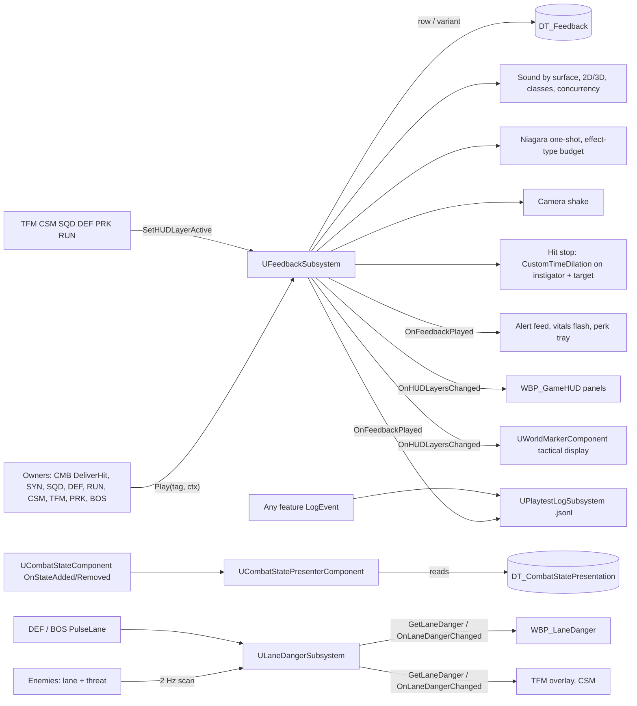
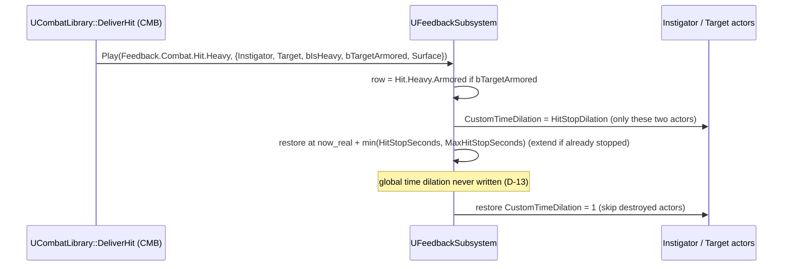
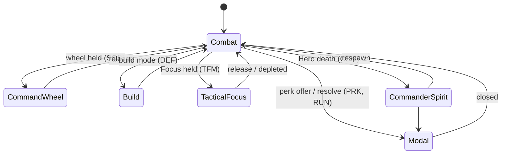

# HUD & Feedback (UXF): Technical Plan

| | |
|---|---|
| Spec | [spec.md](spec.md) |
| Architecture baseline | [00-foundation/technical-plan.md](../00-foundation/technical-plan.md) §10, §12; master plan D-10, D-11, D-13, D-15 |
| Interfaces used | CMB `UCombatLibrary::DeliverHit` ([01-hero-combat/technical-plan.md §4.2](../01-hero-combat/technical-plan.md)); SYN `DT_CombatStatePresentation` + `OnStateAdded/OnStateRemoved` ([04-battlefield-synergy](../04-battlefield-synergy/spec.md)) |
| Phases | P0 → P3 |
| Status | Draft v1. Paths and types are proposals; UE API names marked "verify" must be checked against the pinned engine version |

## 1. Technical Overview

- Gameplay code calls `UFeedbackSubsystem::Play(Tag, Context)` (WorldSubsystem). The subsystem resolves the row in `DT_Feedback` (or a variant row such as `<Tag>.Armored`), applies cooldown and burst limits, then plays sound, Niagara, camera shake and hit stop, and broadcasts `OnFeedbackPlayed` for toasts, HUD flashes and telemetry. One call site per event, one table to audit (D-10).
- CMB's `DeliverHit` already picks one tag per hit outcome and fills Instigator, Target, `bIsHeavy`, `bTargetArmored`. UXF adds surface sounds, the armored variant, hit stop and shake.
- World-level presentation state lives on the subsystem: HUD layer flags (`SetHUDLayerActive`) and the derived marker tactical display. `ULaneDangerSubsystem` owns lane danger values so TFM/CSM/BOS can read or pulse them; widgets only display.
- HUD: `WBP_GameHUD` (C++ base `UGameHUDWidget`) with named slots; feature panels are plain UMG observing delegates (D-11).
- State icons/VFX: `UCombatStatePresenterComponent` on every unit binds SYN's `OnStateAdded/OnStateRemoved` and spawns the row's loop VFX from `DT_CombatStatePresentation`.
- Playtest: `UPlaytestLogSubsystem` writes JSON Lines per world from the feedback stream, a Core HP sampler, and `LogEvent` calls from features.

Engine features reused instead of custom code: Sound Classes, Sound Concurrency, passive Sound Mix ducking, Niagara Effect Types/scalability + user parameters, Physical Materials (`EPhysicalSurface`), `UCameraShakeBase`, `UWidgetComponent`, per-actor `CustomTimeDilation`, Data Tables, `APlayerController` possessed-pawn-changed delegate (verify name, e.g. `OnPossessedPawnChanged`).

## 2. Existing System Impact

| System | Impact |
|---|---|
| FND | `Feedback.*` leaves in `Feedback/FeedbackTags`; `UGameTuningSettings` Feedback category; CVars `game.debug.Feedback`, `game.playtest.Log`; command `game.feedback.Coverage` |
| `AHeroPlayerController` | Creates `WBP_GameHUD`, exposes `GetGameHUD()` |
| CMB | `DeliverHit` calls `Play` with context (done in `T-CMB-04`); stamina/death plays; `WBP_LockOnMarker` placed in a HUD slot |
| SYN | Plays `Feedback.State.<State>.Applied/.Removed`; owns `DT_CombatStatePresentation`; UXF presenter reads it |
| SQD | Plays `Feedback.Command.*`, `Feedback.Squad.*`; wires marker setters and `WBP_SquadStrip` (`T-SQD-13`); sets CommandWheel layer |
| ENM / BOS | Telegraph, death, boss plays; class markers on BPs; BOS calls `PulseLane` and `LogEvent` |
| DEF | Plays structure/tower/Core/lane/build tags (`T-DEF-17`); marker on structures; `PulseLane` on path opened; sets Build layer |
| RUN / CSM / TFM / PRK | Their rows; set layers (Modal, CommanderSpirit, TacticalFocus); `LogEvent` (RUN pacing, CSM data); read lane danger (TFM, CSM) |
| Save | None. Shake scale becomes a user setting at VS (MET) |

## 3. Proposed Architecture

### 3.1 Runtime owner and lifetime

| Object | Owner | Lifetime |
|---|---|---|
| `UFeedbackSubsystem` | World (game/PIE only via `ShouldCreateSubsystem`) | Map |
| `ULaneDangerSubsystem` | World (game/PIE); idle when no lanes are registered | Map |
| `UPlaytestLogSubsystem` | World, compiled out of Shipping | Map = one sandbox session or one Siege Site run |
| `WBP_GameHUD` | `AHeroPlayerController` | Controller lifetime; survives Hero death |
| `UHeroVitalsWidget` | HUD | Rebinds on possessed pawn change |
| `UCombatStatePresenterComponent` | Hero, soldier, enemy, boss base BPs | Owner actor |
| `UWorldMarkerComponent` | Squads, non-Swarm enemies, structures | Owner actor |

### 3.2 Main UE types (new)

| Type | Kind | Folder |
|---|---|---|
| `FFeedbackRow` | `FTableRowBase` | `Feedback/` |
| `FFeedbackContext` | USTRUCT | `Feedback/` |
| `FeedbackTags` | native tags (leaves added per phase) | `Feedback/` |
| `UFeedbackSubsystem`, `EHUDLayer` (bit flags) | `UWorldSubsystem`, enum | `Feedback/` |
| `UCombatStatePresenterComponent` | `UActorComponent` | `Feedback/` |
| `ULaneDangerSubsystem`, `LaneDanger::Score/Level` | `UWorldSubsystem`, pure functions | `Feedback/` |
| `UPlaytestLogSubsystem`, `FPlaytestSummary` | `UWorldSubsystem`, struct | `Feedback/` |
| `UGameHUDWidget`, `UHeroVitalsWidget` | `UUserWidget` bases | `UI/` |
| `UWorldMarkerComponent` | `UWidgetComponent` | `UI/` |
| Blueprints | `WBP_GameHUD`, `WBP_HeroVitals`, `WBP_WorldMarker`, `WBP_AlertFeed`, `WBP_CoreHealth`, `WBP_LaneDanger` | `Content/<Game>/UI/` |
| Assets | `DT_Feedback`, `PM_Flesh/Armor/Shield/Wood/Stone`, `SC_*` sound classes, `SCON_*`, `SMix_AlertDuck`, `NET_Impact/StateLoop`, `BP_Shake_*`, placeholder `NS_*`/`SFX_*`, icon textures | `Content/<Game>/Feedback/`, `UI/Icons/` |

### 3.3 Data ownership

- Per-event presentation: `DT_Feedback` rows (row name = tag string). Rows are authored by the owner feature's feedback task (e.g. DEF `T-DEF-17`, CSM `T-CSM-08`) or by UXF for P0 combat rows (`T-UXF-03`) and UXF's own rows.
- State look: `DT_CombatStatePresentation` (SYN): StateTag, AppliedFeedback, RemovedFeedback, Icon, Colour, DisplayPriority, LoopVFX.
- Global tunables in `UGameTuningSettings` (Feedback category): `FeedbackTable` (soft), `HitStopDilation` 0.05, `MaxHitStopSeconds` 0.15, `CameraShakeScale` 1.0, `DefaultBurstLimit` 4 / `DefaultBurstWindow` 0.25 s, `HeroLowHealthThreshold` 0.30 / re-arm 0.40, `TelemetryCoreSampleSeconds` 5, lane danger thresholds/weights/pulse defaults, team and UI color tokens.
- Marker config: properties on each Blueprint's `UWorldMarkerComponent` (content assembly, D-03).

### 3.4 Communication flow



Rules: gameplay → presentation only; UXF never calls gameplay. Widgets bind delegates on creation.

### 3.5 C++ / Blueprint split

| C++ | Blueprint / data |
|---|---|
| Subsystems, row + variant lookup, cooldown/burst throttle, hit stop, shake routing, layer flags, presenter binding, lane danger scoring, telemetry writer + summary, vitals binding + low-HP latch, marker visibility timer | Widget layouts, row content, marker icons per BP, Niagara systems (icon/color via user parameters), toast texts |

### 3.6 Asset references / loading

`DT_Feedback` soft-referenced from settings, loaded synchronously at subsystem init (small in prototype). Rows hard-reference placeholder sounds/Niagara. `DT_CombatStatePresentation` icons/VFX are soft (SYN); the presenter loads them synchronously on first use (3 rows). Revisit at VS with memory profiling.

### 3.7 AI / navigation impact

None. Lane danger reads enemy lane and threat cost; it never changes AI. R-UXF-20 is audited, not implemented, here.

### 3.8 UI impact

Owns the HUD shell, layers, vitals, alert feed, Core HP, lane danger strip, marker component. Other features own their panels (layout table §5.3).

### 3.9 Save impact

None. Telemetry is a dev log.

### 3.10 Performance risks

See §9: crowd bursts, screen-space widget components, state loop VFX on many Swarm.

### 3.11 Existing systems reused

Listed in §1. Also `UGameplayStatics::PlaySoundAtLocation/PlaySound2D`, `UNiagaraFunctionLibrary::SpawnSystemAtLocation/SpawnSystemAttached`, `APlayerCameraManager::StartCameraShake`, `UGameplayStatics::PlayWorldCameraShake` (verify signatures), `UCombatLibrary::GetStatePresentation` and `UCombatStateComponent::GetActiveStatesSorted` (SYN).

### 3.12 Trade-offs

| Choice | Alternative | Why |
|---|---|---|
| One subsystem + Data Table keyed by tags | Each feature plays assets in Blueprint | One audit point (§34.5), shared throttling, telemetry for free |
| Variant rows by tag suffix (`.Armored`, `.Infantry`) | Extra per-row asset maps | Same row shape everywhere; variants are visible in the table and the audit |
| Surface map for sounds only; VFX by tag/variant | Surface × hit type matrix | §9.8 asks sound by material, VFX by hit type |
| Per-actor `CustomTimeDilation` hit stop | Global time dilation | Global dilation belongs to Tactical Focus (D-13) |
| Burst limit per tag in the subsystem | Rely on engine budgets only | Engine budgets cap voices/instances but not cue count; AoE stagger bursts flagged by SYN |
| HUD layers on the world subsystem | Flags on the HUD widget | Markers and non-UI code (TFM, CSM) need a world-level owner |
| Lane danger in its own subsystem | Inside the lane widget | TFM/CSM/BOS read or pulse it without a widget |
| Lane danger by 2 Hz enemy scan | New Director API | No cross-feature API; ≤ enemy cap. `ponytail:` switch to the spawner's alive list if the scan shows in Insights |
| Niagara user params carry icon/color for state VFX | Widget icon per unit | Works on Swarm without widget components; one look everywhere |
| JSON Lines + generic `LogEvent` | CSV, or per-feature log files | Append-safe, nested fields, one file per run that every feature writes to |
| Screen-space `UWidgetComponent` markers | HUD-side projection | Native; ~30 markers. `ponytail:` switch to HUD projection if widget cost shows up |

### 3.13 Verification

Automation Specs (`<Game>.Feedback.Throttle`, `.Variant`, `.PlaytestSummary`, `.LaneDanger`, `.TableCoverage`), Functional Tests (`FT_Feedback_HitTypes`, `FT_Feedback_HitStop`, `FT_Feedback_StatePresenter`, `FT_Feedback_Layers`), PIE checks, blind sound tests, §28.1 quiz, gate audits.

## 4. Runtime Flow

### 4.1 `Play`

```text
Play(Tag, Ctx):
  if !Tag valid or table missing: dev warning once; return
  Row = Variant(Tag, Ctx.Variant or (Ctx.bTargetArmored ? "Armored" : none)) ?? Row(Tag) ?? warn once, return
  if cooldown active (per tag, or per tag+actor): return
  if plays of Tag in current burst window >= Row.BurstLimit: return
  record time; add Tag to PlayedSet
  Sound: Row.SurfaceSounds[Ctx.Surface] ?? Row.Sound → 2D or at Ctx.Location (concurrency/class on the asset)
  Niagara: at Ctx.Location or attached to Ctx.Target
  heroInvolved = local Hero is Ctx.Instigator or Ctx.Target
  if Row.HitStopSeconds > 0 and (heroInvolved or !Row.bHeroOnly): HitStop({Instigator, Target}, Row.HitStopSeconds)
  if Row.CameraShake: radius 0 → direct shake if heroInvolved; else world shake with radii; stop previous instance of this tag
  broadcast OnFeedbackPlayed(Tag, Ctx)
```

### 4.2 Hit stop



Restore timing in real time (NEW-UXF-7): use a timer whose duration is scaled by the current global time dilation, or a core ticker on real time (verify which is reliable in the pinned UE version). Convention: only `UFeedbackSubsystem` writes `CustomTimeDilation`.

### 4.3 State presenter

```text
BeginPlay: bind sibling UCombatStateComponent.OnStateAdded / OnStateRemoved
OnStateAdded(Tag): row = UCombatLibrary::GetStatePresentation(Tag)
   spawn row.LoopVFX attached to socket "FeedbackHead" (fallback: bounds top)
   set Niagara user params: Icon (texture), Colour, Slot = DisplayPriority  (verify texture user param support)
OnStateRemoved(Tag): destroy that state's component
EndPlay: destroy all
(Applied/Removed sounds are played by SYN through DT_Feedback, not here.)
```

### 4.4 HUD layers



Layers are flags; visibility uses the highest active: Modal > CommanderSpirit > TacticalFocus > Build > CommandWheel > Combat. Marker tactical display = TacticalFocus or CommanderSpirit flag set (and Modal not set).

### 4.5 Lane danger

```text
every 0.5 s (only while lanes exist):
  for each alive AEnemyCharacter: lane = assigned lane (ENM), cost = archetype threat cost
     score[lane] += cost * (dist to Core < NearCoreRadius ? (1 + NearCoreWeight) : 1)
  for each active pulse: level = max(level, pulse.Level) until pulse expires
  level = None/Low/Medium/High by thresholds; broadcast OnLaneDangerChanged on change
PulseLane(Lane, Seconds, Level = High): DEF path opened, DEF Core attacked (attacker's lane), BOS summons
GetLaneDanger(Lane) -> level, score
```

## 5. State / Data

### 5.1 `FFeedbackRow`

| Field | Type | Notes |
|---|---|---|
| `Tag` | FGameplayTag | Must equal row name |
| `Sound`, `SurfaceSounds` | `USoundBase*`, `TMap<TEnumAsByte<EPhysicalSurface>, USoundBase*>` | Surface map for impact rows |
| `bSound2D` | bool | Global alerts |
| `Niagara`, `bAttachToTarget` | `UNiagaraSystem*`, bool | One-shot |
| `CameraShake`, `ShakeScale`, `ShakeInnerRadius`, `ShakeOuterRadius` | `TSubclassOf<UCameraShakeBase>`, floats | Radius 0 = direct shake, Hero-involved only |
| `HitStopSeconds`, `bHeroOnly` | float, bool | 0 = none |
| `ToastText`, `ToastIcon` | FText (`{Detail}`, `{Lane}` args), soft texture | Empty = no toast |
| `CooldownSeconds`, `bCooldownPerActor` | float, bool | Spam guard |
| `BurstLimit`, `BurstWindow` | int32, float | 0 = settings default |

### 5.2 `FFeedbackContext`

`Location`, `Direction`, `Instigator` (weak), `Target` (weak), `Surface` (`EPhysicalSurface`), `bIsHeavy`, `bTargetArmored`, `Variant` (FName), `Lane` (FName), `Magnitude` (default 1), `Detail` (FName: squad type, perk asset name, wave index).

### 5.3 HUD layout and layer matrix

| Panel (slot) | Owner task | Phase | Combat | Wheel | Build | Focus | Spirit | Modal |
|---|---|---|---|---|---|---|---|---|
| Hero vitals (bottom-left) | UXF `T-UXF-02` | P0 | ✓ | ✓ | ✓ | dim | ✗ | ✗ |
| Lock-on marker (on target) | CMB `T-CMB-10` | P0 | ✓ | ✓ | ✗ | ✗ | ✗ | ✗ |
| Alert feed (right edge) | UXF `T-UXF-06` | P1 | ✓ | ✓ | ✓ | ✓ | ✓ | ✗ |
| Squad strip (bottom-right) | SQD `T-SQD-13` | P1 | ✓ | ✓ | ✓ | ✓ | ✓ | ✗ |
| Command Wheel (center) | SQD `T-SQD-05` | P1 | ✗ | ✓ | ✗ | via TFM | via CSM | ✗ |
| Core HP + lane danger (top-center) | UXF `T-UXF-07` | P2 | ✓ | ✓ | ✓ | ✓ | ✓ | ✗ |
| Build bar / placement prompt | DEF `T-DEF-15` | P2 | ✗ | ✗ | ✓ | ✗ | ✗ | ✗ |
| Interact prompt | CMB `T-CMB-12` | P2 | ✓ | ✗ | ✗ | ✗ | ✗ | ✗ |
| Run status: phase, countdown, wave n/N, builds/resource (top) | RUN `T-RUN-10` | P2 | ✓ | ✓ | ✓ | ✓ | ✓ | ✗ |
| Forecast panel (top-right) | DIR `T-DIR-07` | P3 | ✓ | ✓ | ✓ | ✓ | ✓ | ✗ |
| Focus meter | TFM `T-TFM-01` | P3 | ✓ | ✓ | ✗ | ✓ | ✗ | ✗ |
| Tactical overlay (world) | TFM `T-TFM-03`, CSM `T-CSM-07` | P3 | ✗ | ✗ | ✗ | ✓ | ✓ | ✗ |
| Spirit HUD: banner, countdown, charges | CSM `T-CSM-06` | P3 | ✗ | ✗ | ✗ | ✗ | ✓ | ✗ |
| Boss bar (top) | BOS `T-BOS-06` | P3 | ✓ | ✓ | ✓ | ✓ | ✓ | ✗ |
| Perk tray (left edge) | PRK `T-PRK-05` | P3 | ✓ | ✓ | ✓ | ✓ | ✓ | ✗ |
| Modal (perk choice, resolve) | PRK `T-PRK-05`, RUN `T-RUN-06` | P3 | ✗ | ✗ | ✗ | ✗ | ✗ | ✓ |
| Debug overlay (top-left) | FND/UXF | all | dev | dev | dev | dev | dev | dev |
| World markers | UXF `T-UXF-04` | P1 | normal | normal | normal | tactical | tactical | ✗ |

### 5.4 Telemetry schema (JSON Lines)

File: `Saved/Playtest/<yyyyMMdd_HHmmss>_<MapName>.jsonl` (local only, never committed, no personal data). API: `UPlaytestLogSubsystem::LogEvent(FName Event, const TMap<FName, float>& Numbers, const TMap<FName, FString>& Strings)` + `BlueprintCallable` static wrapper with world context. Every line gets `t` (game s) and `rt` (real s).

| `ev` | Fields | Source |
|---|---|---|
| `session_start` | `map`, `build`, `engine`, `date`, `shake_scale` | Subsystem begin play |
| `fb` | `tag`, `loc` [x,y,z], `inst`, `tgt` (classes), `d` (detail), `lane` | `OnFeedbackPlayed` |
| `hero_action` | `action` (Light/Heavy/Dodge/Block/Parry attempt) | Binds `UHeroCombatComponent::OnActionStateChanged` of the possessed Hero (rebinds on pawn change) |
| `hero_damaged` | `amount`, `hp` | Hero `UHealthComponent::OnDamaged` |
| `core_hp` | `hp` (0–1) | Sampler every `TelemetryCoreSampleSeconds` while a Core exists (P2+) |
| feature events | any (`run_start`, `step_end`, `run_end` RUN `T-RUN-14`; per order SQD `T-SQD-05`; boss rows BOS `T-BOS-08`; `perk_seed` PRK `T-PRK-07`; CSM `T-CSM-10`) | `LogEvent` |
| `summary` | `duration`, `result` (from `Feedback.Run.Victory/Defeat`, else Aborted/Session), `hero_deaths`, `parries`, `block_breaks`, `focus_seconds`, `focus_pct`, `perks_offered` [[ids]], `perks_picked` [ids], `core_hp_min`, `core_hp_end`, `structures_destroyed`, `squads_wiped`, `actions` {type: n}, `counts` {tag: n} | `FPlaytestSummary` on run result or world teardown |

Wave and step times come from RUN's `step_end` events (no duplicate). Focus time = `Feedback.Focus.Enter` → `Exit`/`Depleted` intervals (open interval closed at end). Perks from `Feedback.Perk.Offered/Chosen` details.

### 5.5 Playtest notes template (created by `T-UXF-11` at `ai/game/playtests/_template.md`)

Each playtest copies it to `ai/game/playtests/<YYYY-MM-DD>_<gate>_<scenario>.md`.

| Section | Content |
|---|---|
| Header | Date, build/version, gate (G0–G3/VS), map, scenario, tester, session length, telemetry file name |
| Hypotheses / gate checklist | Gate checklist from master plan §3; per item pass/fail + evidence |
| Telemetry summary | Key `summary` fields (deaths, Focus %, perks, Core HP min/end, actions) + RUN step timings |
| §28.1 readability quiz | 7 questions × 10 frames; answered ≤ 2 s? |
| Sound-only test | Events played, identified / total |
| Feedback contract audit | FC rows in scope: pass / fail / note; `game.feedback.Coverage` output |
| Observations | Build/Version, Scenario, Tester, Expected Experience, Observed Behavior, Issue Type (Design / Bug), Severity, Decision (keep / tune / redesign / remove / test again) |
| Decisions | KEEP / CHANGE / DELETE per hypothesis |
| Follow-ups | New task IDs; changed assumptions/questions |

### 5.6 Feedback contract audit procedure (`T-UXF-09`, rerun by `T-UXF-14`, `T-UXF-18`, `T-UXF-20`)

1. Automated: `<Game>.Feedback.TableCoverage`: every native `Feedback.*` leaf has a row; every row tag valid; every row has ≥ 1 output or toast; referenced assets load; every `DT_CombatStatePresentation` `AppliedFeedback` tag has a row.
2. Play the gate scenario with `game.playtest.Log 1`; `game.feedback.Coverage` lists declared tags never played. Every tag of the phase's rows played or explained.
3. Per FC row in phase scope: visual, audio (distinct), UI if listed, readability rule.
4. Sound-only test (P0 hit types; P1+ §28.3 events); §28.1 quiz (partial P1–P2, full P3).
5. Spam check: no alert repeats within its cooldown; bursts capped; thresholds once per crossing.
6. §34.4 failure cases produce their rows (FC-14/50, 24, 31, 32, 46, 49, 66 as phases allow).
7. Record in the gate notes; each failing row becomes a task in the owning feature.

## 6. Main Implementation Areas

| Area | Tasks |
|---|---|
| Feedback core: rows, variants, throttle, layers, debug, coverage | `T-UXF-01` |
| HUD shell + vitals + pawn rebinding | `T-UXF-02` |
| Combat impact feel + P0 hit rows | `T-UXF-03` |
| Hero low-HP feedback + damage vignette | `T-UXF-10` |
| Telemetry (core, generic events) / run summary | `T-UXF-08` / `T-UXF-16` |
| Notes template, audits | `T-UXF-11`, `T-UXF-09`, `T-UXF-14`, `T-UXF-18`, `T-UXF-20` |
| Markers + tactical display | `T-UXF-04` |
| State presenter | `T-UXF-05` |
| Icon set + color tokens | `T-UXF-12` |
| §28.3 audio rules + alert feed | `T-UXF-06` (P1), `T-UXF-15` (P2), `T-UXF-19` (P3) |
| Core HP + lane danger | `T-UXF-07` |
| QA / perf | `T-UXF-13`, `T-UXF-17` |

## 7. Error and Edge-Case Handling

| Case | Handling |
|---|---|
| `FeedbackTable` unset / fails to load | Error log once; `Play` no-ops; dev on-screen warning |
| Row missing / variant missing | Variant missing → base row. Base missing → dev warning once per tag |
| Asset null in a row | That output skipped; coverage test flags rows with no output |
| Target destroyed during hit stop / with state VFX | Weak keys; cleanup skips it; attached Niagara destroyed with owner (verify) |
| Overlapping hit stop | Extend to max, cap `MaxHitStopSeconds` |
| Hit stop during Focus | Global dilation untouched; real-time restore |
| Hero pawn replaced | Vitals, telemetry hero binder rebind on possessed-pawn-changed; low-HP latch resets |
| Layer set by two owners | Flags; cleared only by the owner that set it (owners pair set/clear on their own events) |
| Lane danger without lanes (sandbox) | Subsystem idle, strip hidden |
| Telemetry write fails | Warning once, logger disabled for the session |
| World teardown without result | Summary with `result: Aborted` (run map) or `Session` (sandbox) |

## 8. Testing Strategy

| Test | Type | Covers |
|---|---|---|
| `<Game>.Feedback.Throttle` | Spec | Cooldown (global/per actor), burst limit math (R-UXF-03) |
| `<Game>.Feedback.Variant` | Spec | Variant resolution order (R-UXF-02, R-UXF-12) |
| `<Game>.Feedback.PlaytestSummary` | Spec | Focus intervals, counts, result (R-UXF-27) |
| `<Game>.Feedback.LaneDanger` | Spec | Score, near-Core weight, thresholds, pulses (R-UXF-25) |
| `<Game>.Feedback.TableCoverage` | Automation (editor) | Contract coverage (R-UXF-01, R-UXF-06) |
| `FT_Feedback_HitTypes` | Functional Test | Each `DeliverHit` outcome + armored flag → expected row via `OnFeedbackPlayed` |
| `FT_Feedback_HitStop` | Functional Test | Only hit actors slowed; global dilation unchanged with Focus-style dilation 0.25 active |
| `FT_Feedback_StatePresenter` | Functional Test | Loop VFX on add/remove, same row from two sources, owner destroyed mid-state |
| `FT_Feedback_Layers` | Functional Test | Layer flags → marker tactical display and panel visibility |
| Blind sound tests, §28.1 quiz | Manual | AC-UXF-03, -14, -25 |
| Crowd stress | PERF | AC-UXF-19 (`T-UXF-17`) |

## 9. Performance Risks

| Risk | Mitigation |
|---|---|
| AoE bursts (Bombard staggering 15 Swarm) | Burst limit per tag; `SCON_Impact` voices; `NET_Impact`/`NET_StateLoop` budgets; measured in `T-UXF-17` (and SYN `T-SYN-11`) |
| Screen-space widget components | Markers only on squads, non-Swarm enemies, structures (~30); 4 Hz visibility timer; measured in DEF `T-DEF-12` scene |
| State loop VFX on many units | Niagara sprite; effect type budget |
| Lane danger scan | 2 Hz, ≤ enemy cap; `ponytail:` comment, upgrade path to the spawner's alive list |
| Telemetry I/O | Append + flush per line, dev only; buffer and flush on a timer if Insights shows hitches |

## 10. Dependencies and Risks

| Risk | Impact | Mitigation |
|---|---|---|
| Features play assets directly instead of calling `Play` | Audit blind spots | Coverage test + gate audit; review rule "no `PlaySound*`/`SpawnSystem*` in gameplay C++ outside `Feedback/`" |
| Tag names drift between feature specs and the master table | Broken audit | Owners update spec §14 in the same change; coverage test catches orphan rows |
| Hit stop eats buffered input | G0 feel fails | Verified with CMB in `T-UXF-03`; fallback: shorter stop or Hero excluded |
| Placeholder audio not distinct | §28.3 sound-only tests fail | Distinct-timbre brief in `T-UXF-06`; swap placeholders before the gate |
| Off-screen readability (BOS expects off-screen summon markers) | Split pressure missed | Lane pulses first; NEW-UXF-4 decides off-screen arrows at G2/G3 |
| Readability lost when VS art lands | §28.1 regressions | §28.2 rules are acceptance criteria for final assets (production plan) |

No change request to D-01..D-18: plan follows D-10 (one feedback subsystem + Data Table keyed by `Feedback.*`), D-11 (plain UMG), D-13 (global dilation reserved for Focus; hit stop is per-actor).

## 11. Requirement Coverage

| Requirement | Technical area | Task |
|---|---|---|
| R-UXF-01 | Master table, `TableCoverage`, audit | T-UXF-01, T-UXF-09 |
| R-UXF-02 | `UFeedbackSubsystem`, `DT_Feedback`, variants | T-UXF-01 |
| R-UXF-03 | Cooldown + burst limit | T-UXF-01 |
| R-UXF-04 | Niagara effect types, concurrency | T-UXF-06, T-UXF-17 |
| R-UXF-05 | Icon set, `CameraShakeScale` | T-UXF-12, T-UXF-03 |
| R-UXF-06 | Missing-row handling | T-UXF-01 |
| R-UXF-07..10 | Hit stop, shake routing | T-UXF-03 |
| R-UXF-11 | Physical surfaces + `SurfaceSounds` | T-UXF-03 |
| R-UXF-12 | P0 hit rows + armored variants; StateBonus accent | T-UXF-03 |
| R-UXF-13 | `UHeroVitalsWidget`, pawn rebinding | T-UXF-02, T-UXF-10 |
| R-UXF-14 | §28.1 element table | T-UXF-04, T-UXF-07, T-UXF-20 |
| R-UXF-15..17 | Color tokens, class icons, DEF tower rows audit | T-UXF-12, T-UXF-04, T-UXF-15 |
| R-UXF-18 | `UCombatStatePresenterComponent` + SYN table | T-UXF-05 |
| R-UXF-19 | HUD layout §5.3 | T-UXF-02 |
| R-UXF-20 | Audit only | T-UXF-14 |
| R-UXF-21, R-UXF-22 | Sound classes, ducking, 2D/3D rules | T-UXF-06, T-UXF-15, T-UXF-19 |
| R-UXF-23 | Layers on subsystem; HUD slots | T-UXF-01, T-UXF-02 |
| R-UXF-24 | `UWorldMarkerComponent` + tactical display | T-UXF-04 |
| R-UXF-25 | `WBP_CoreHealth`, `ULaneDangerSubsystem` | T-UXF-07 |
| R-UXF-26 | FC rows for §34.4 | T-UXF-14, T-UXF-18, T-UXF-20 |
| R-UXF-27 | `UPlaytestLogSubsystem`, schema §5.4 | T-UXF-08, T-UXF-16 |
| R-UXF-28 | Template §5.5 | T-UXF-11 |
| R-UXF-29 | Audit §5.6 | T-UXF-09, T-UXF-14, T-UXF-18, T-UXF-20 |
