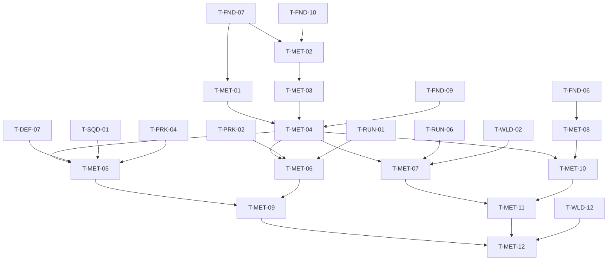

# Meta Progression and Save (MET): Tasks

> **Provisional — re-validate after G3.** No task here starts before G3 passes. Before starting, re-read the G3 notes, update spec rules and re-plan these tasks. Tasks are coarser than prototype tasks (~1–3 days each).

## 1. Summary

Build the persistent profile (`UMetaProgressionSubsystem` + `UMetaSaveGame`) with versioning, migration and corruption fallback; horizontal unlocks and capped vertical upgrades; run result → meta reward (lose keeps part); settings persistence; hub unlock UI and main menu profile flow. Spec: [spec.md](spec.md). Plan: [technical-plan.md](technical-plan.md).

## 2. Task Overview

| ID | Task | Type | Phase | Priority | Dependencies | Status |
|---|---|---|---|---|---|---|
| T-MET-01 | Meta definitions (unlock, upgrade) + tunables + asset types | TOOLS | VS | Must | T-FND-07 | Todo |
| T-MET-02 | `UMetaSaveGame` schema v1 + envelope + A/B slots + load selection | GAMEPLAY | VS | Must | T-FND-07, T-FND-10 | Todo |
| T-MET-03 | Migration steps, redirects, orphan IDs, newer-version guard | GAMEPLAY | VS | Must | T-MET-02 | Todo |
| T-MET-04 | `UMetaProgressionSubsystem` API, save points, cheats | GAMEPLAY | VS | Must | T-MET-01, T-MET-03, T-FND-09 | Todo |
| T-MET-05 | Horizontal unlock flow + consumer filters | GAMEPLAY | VS | Must | T-MET-04, T-DEF-07, T-SQD-01, T-PRK-04 | Todo |
| T-MET-06 | Capped vertical upgrades applied at run start | GAMEPLAY | VS | Should | T-MET-04, T-PRK-02, T-RUN-01 | Todo |
| T-MET-07 | Run result → meta reward (win / lose / abandon) | GAMEPLAY | VS | Must | T-MET-04, T-RUN-06, T-WLD-02 | Todo |
| T-MET-08 | Settings persistence (`UUserGameSettings`, rebinds) + settings menu | UI | VS | Must | T-FND-06 | Todo |
| T-MET-09 | Hub unlock / upgrade screen | UI | VS | Must | T-MET-05, T-MET-06, T-UXF-01 | Todo |
| T-MET-10 | Main menu profile flow, notices, reset progress | UI | VS | Must | T-MET-04, T-MET-08 | Todo |
| T-MET-11 | QA: save robustness suite + regression | QA | VS | Must | T-MET-07, T-MET-10 | Todo |
| T-MET-12 | QA: VS gate playtest, meta loop and catalog review | QA | VS | Must | T-MET-09, T-MET-11, T-WLD-12 | Todo |

## 3. Detailed Tasks

## VS

### T-MET-01 — Meta definitions, tunables and asset types

**Type** TOOLS · **Phase** VS

**Objective** Unlock and upgrade content can be authored as data and validated in the editor.

**Related Requirements** R-MET-02, R-MET-03, R-MET-06, AC-MET-13

**Dependencies** T-FND-07

**Implementation Notes**
- [ ] `EMetaUnlockType` with exactly the 9 GDD types; `UMetaUnlockDefinition` and `UMetaUpgradeDefinition` (fields in technical plan §5).
- [ ] Register Primary Asset Types `MetaUnlock`, `MetaUpgrade`; `IsDataValid` (granted content not empty, Purchase cost > 0, MaxRank ≥ 1).
- [ ] Add `MetaLoseRewardFraction`, `MetaVerticalRankCap` to `UGameTuningSettings`.
- [ ] Author 1 sample of each to prove validation.

**Expected Files / Assets** `Source/<Game>/Meta/MetaUnlockDefinition.h/.cpp`, `MetaUpgradeDefinition.h/.cpp`; `Content/<Game>/Meta/DA_MetaUnlock_Sample`, `DA_MetaUpgrade_Sample`

**Test Case** Create an unlock with empty granted content → Data Validation reports an error; fill it → passes.

**Acceptance Criteria**
- [ ] Both types appear in the Asset Manager with stable IDs.
- [ ] Invalid samples fail validation with a clear message.

**Verification** Editor Data Validation run; `AssetManager` list shows the IDs (PIE log dump).

### T-MET-02 — Save schema v1, envelope, A/B slots

**Type** GAMEPLAY · **Phase** VS

**Objective** A profile can be written and read back safely; a damaged or half-written file never destroys the last good copy.

**Related Requirements** R-MET-15, R-MET-16, R-MET-17, R-MET-19, R-MET-20, R-MET-23, AC-MET-07

**Dependencies** T-FND-07, T-FND-10

**Implementation Notes**
- [ ] `UMetaSaveGame` + `FMetaProfile` + `FCampaignProgress` (facts only), all IDs as `FPrimaryAssetId` / `FName`.
- [ ] Envelope: header {magic, version, sequence, size, CRC32} + `SaveGameToMemory` bytes.
- [ ] Write to `<slot>.tmp` on a background thread, then move over the target slot; alternate A/B by sequence. Verify move semantics on Windows in UE docs.
- [ ] Load: validate both headers, pick the highest valid sequence, report a `EMetaLoadResult` (Fresh, Loaded, Recovered, Reset, TooNew).
- [ ] Both invalid → rename to `.corrupt`, fresh profile.

**Expected Files / Assets** `Source/<Game>/Meta/MetaSaveGame.h/.cpp`, `MetaSaveEnvelope.h/.cpp`, `Tests/MetaSave.spec.cpp`

**Test Case** Write profile twice (A then B), flip one byte in B → load returns A's content and `Recovered`.

**Acceptance Criteria**
- [ ] Round trip equals input.
- [ ] CRC mismatch, short file, bad magic all rejected.
- [ ] Leftover `.tmp` is ignored on load.

**Verification** Automation Spec `MetaSave` (all cases above) from the command-line runner.

### T-MET-03 — Migration, redirects, orphan IDs, newer-version guard

**Type** GAMEPLAY · **Phase** VS

**Objective** Old saves load in new builds; newer saves are never damaged by old builds; removed content does not break loading.

**Related Requirements** R-MET-21, R-MET-22, R-MET-24, AC-MET-08, AC-MET-09, AC-MET-10

**Dependencies** T-MET-02

**Implementation Notes**
- [ ] Ordered list of `MigrateVnToVn1(FMetaProfile&) -> bool`; run on load when version < current; copy the source file to `.premigration` first.
- [ ] One test migration (v1 → v2, e.g. rename a field meaning) with fixture files checked into `Tests/Fixtures/`.
- [ ] Version > current → default profile, saving disabled, result `TooNew`.
- [ ] Apply Primary Asset ID redirects (Asset Manager settings, verify in UE docs); unresolved IDs move to `OrphanIds` and are written back unchanged.

**Expected Files / Assets** `Source/<Game>/Meta/MetaSaveMigration.h/.cpp`, `Tests/MetaMigration.spec.cpp`, `Tests/Fixtures/meta_v1.sav`, `meta_v2_expected.sav`

**Test Case** Load `meta_v1.sav` in a build at version 2 → profile equals `meta_v2_expected`; `.premigration` exists.

**Acceptance Criteria**
- [ ] Fixture migration passes; a forced failing step falls back without writing.
- [ ] A v99 file is untouched after a full session.
- [ ] Orphan IDs survive a save cycle.

**Verification** Automation Spec `MetaMigration`; manual: cheat `meta.SetVersion 99`, play, quit, check file hash unchanged.

### T-MET-04 — Meta subsystem API, save points, cheats

**Type** GAMEPLAY · **Phase** VS

**Objective** One process-lifetime owner answers meta queries and saves only at safe points without hitching.

**Related Requirements** R-MET-05, R-MET-15, R-MET-25, AC-MET-12

**Dependencies** T-MET-01, T-MET-03, T-FND-09

**Implementation Notes**
- [ ] `UMetaProgressionSubsystem : UGameInstanceSubsystem`; load in `Initialize`; broadcast `OnProfileLoaded`.
- [ ] Queries: `IsContentUnlocked`, `IsUnlockOwned`, `GetCurrency`, `GetUpgradeRank`, `GetCampaign`, `GetCompletion`.
- [ ] Mutations (each marks dirty): `AddCurrency`, `GrantUnlock`, `SetCampaignFact`, `MarkTutorialComplete`, `MarkHintSeen`; `RequestSave()` with the coalescing rule from the technical plan.
- [ ] Cheats: `meta.Grant`, `meta.AddCurrency`, `meta.Reset`, `meta.CorruptSlot`, `meta.SetVersion`; CVar `game.debug.MetaSaveDelay` for testing quit-during-write.

**Expected Files / Assets** `Source/<Game>/Meta/MetaProgressionSubsystem.h/.cpp`, cheat additions in `Core/GameCheatManager`

**Test Case** Call `AddCurrency` 10 times in one frame and `RequestSave` each time → exactly one write in flight plus one follow-up write.

**Acceptance Criteria**
- [ ] Subsystem survives `OpenLevel` between two maps with state intact.
- [ ] Save during PIE shows no game-thread spike above budget in Insights.

**Verification** Automation Spec for coalescing; PIE travel test; Insights capture in a packaged Development build.

### T-MET-05 — Horizontal unlock flow and consumer filters

**Type** GAMEPLAY · **Phase** VS

**Objective** Purchased or granted unlocks change what the next run offers; base content is always there.

**Related Requirements** R-MET-02, R-MET-03, R-MET-04, R-MET-05, R-MET-08, R-MET-09, AC-MET-04, AC-MET-06

**Dependencies** T-MET-04, T-DEF-07, T-SQD-01, T-PRK-04

**Implementation Notes**
- [ ] Build the granted-content set from all `MetaUnlock` definitions at load; content outside it = base content.
- [ ] `Purchase(UnlockId)`: Purchase source only, cost check, idempotent; `GrantUnlock` for campaign sources.
- [ ] Filters (small edits, owner reviews): DEF build menu tower list, SQD run-start roster, PRK offer pool by perk family. CNV and WLD integrate in their own tasks.
- [ ] Completion = owned unlocks + bought ranks over catalog total, orphans excluded.
- [ ] Author VS catalog 4–6 items (e.g. Spearman squad, 4th tower blueprint as Grant from a blueprint source, a conversion recipe, a perk family).

**Expected Files / Assets** subsystem additions; edits in DEF/SQD/PRK call sites; `Content/<Game>/Meta/DA_MetaUnlock_*`; `Tests/MetaRules.spec.cpp`

**Test Case** Fresh profile: Spearman absent in run. Cheat currency, purchase Spearman in hub, start run → Spearman squad present.

**Acceptance Criteria**
- [ ] Unlock never appears mid-run.
- [ ] Double grant leaves currency and state unchanged.
- [ ] Completion reaches 100% only with all items owned.

**Verification** Automation Spec `MetaRules` (purchase, grant, completion); PIE manual test above.

### T-MET-06 — Capped vertical upgrades

**Type** GAMEPLAY · **Phase** VS

**Objective** A few small permanent upgrades exist with hard caps and apply through the shared stat modifier path.

**Related Requirements** R-MET-01, R-MET-06, R-MET-07, AC-MET-05

**Dependencies** T-MET-04, T-PRK-02, T-RUN-01

**Implementation Notes**
- [ ] `PurchaseRank(UpgradeId)`: per-upgrade max rank and global `MetaVerticalRankCap`.
- [ ] At run start, register a "Meta" modifier source with T-PRK-02 using `StatTag × rank × ModifierPerRank`.
- [ ] Author 2–3 VS upgrades (examples to validate: Core max HP, starting Gold), max rank 3.

**Expected Files / Assets** subsystem additions; `Content/<Game>/Meta/DA_MetaUpgrade_*`

**Test Case** Buy Core HP rank 3, try rank 4 → refused with reason; start run → Core max HP includes the 3-rank modifier.

**Acceptance Criteria**
- [ ] Cap checks covered by Spec.
- [ ] Modifier visible in the stat modifier debug output at run start.

**Verification** Automation Spec (caps); PIE: `game.debug.Stats 1` (or PRK's debug view) shows the Meta source.

### T-MET-07 — Run result to meta reward

**Type** GAMEPLAY · **Phase** VS

**Objective** Every run end turns into the right meta reward and a saved profile; losing keeps part of it.

**Related Requirements** R-MET-10, R-MET-11, R-MET-12, R-MET-13, R-MET-14, AC-MET-01, AC-MET-02, AC-MET-03

**Dependencies** T-MET-04, T-RUN-06, T-WLD-02

**Implementation Notes**
- [ ] Replace RUN's reward stub with `ApplyRunResult`; add missing result fields (Siege Site ID, waves cleared, boss defeated, outcome incl. Abandon) to RUN's struct with owner review.
- [ ] Reward from the site's reward table: per wave + boss bonus; Win adds first-clear bonus (once) + unlock grants; Lose/Abandon multiply progress part by `MetaLoseRewardFraction`, floor.
- [ ] Call WLD `ApplyRunOutcome` for liberation facts; then `RequestSave`.
- [ ] Pause-menu Abandon → RUN resolve with outcome Abandon.
- [ ] Resolve widget meta section bound to `OnRunRewardApplied`.

**Expected Files / Assets** `Source/<Game>/Meta/MetaReward.h/.cpp`; edits in `Run/` resolve; resolve widget update

**Test Case** Site with 10/wave, boss 30, first clear 50: lose after 3 waves at fraction 0.5 → +15; win full run first time → 50+30+50 = 130; win again → 80.

**Acceptance Criteria**
- [ ] Spec covers win, lose, abandon, repeat win.
- [ ] Process kill mid-run leaves the save file hash unchanged.

**Verification** Automation Spec `MetaRules` reward cases; Functional Test `FT_MetaRunCycle` (cheat win → reload profile → compare).

### T-MET-08 — Settings persistence and settings menu

**Type** UI · **Phase** VS

**Objective** Player settings persist across restarts and are independent of the meta save.

**Related Requirements** R-MET-18, R-MET-26, AC-MET-11

**Dependencies** T-FND-06

**Implementation Notes**
- [ ] `UUserGameSettings : UGameUserSettings` (set as the project's user settings class): audio volumes per sound class, mouse sensitivity, invert Y; clamp on load.
- [ ] Key rebinds through Enhanced Input user settings (verify availability in the pinned UE version; fallback to action → key pairs in `UUserGameSettings`).
- [ ] `WBP_Settings` with apply/revert; reachable from main menu and pause menu.

**Expected Files / Assets** `Source/<Game>/Meta/UserGameSettings.h/.cpp`; `Content/<Game>/UI/Menus/WBP_Settings`

**Test Case** Set music 20%, sensitivity 1.5, invert Y on, rebind Dodge; restart packaged build → all four kept; `meta.Reset` → still kept.

**Acceptance Criteria**
- [ ] Out-of-range ini values snap to defaults/range.
- [ ] Rebinds show in input prompts (ONB uses the same lookup).

**Verification** Manual test in a packaged Development build; inspect `GameUserSettings.ini`.

### T-MET-09 — Hub unlock and upgrade screen

**Type** UI · **Phase** VS

**Objective** In the hub, the player sees what can be unlocked, what it costs, what is owned, and how far the catalog is complete.

**Related Requirements** R-MET-03, R-MET-06, R-MET-08, AC-MET-05, AC-MET-06

**Dependencies** T-MET-05, T-MET-06, T-UXF-01

**Implementation Notes**
- [ ] `WBP_MetaUnlocks`: grouped by unlock type, states (owned / purchasable / too expensive / grant-only with source hint), completion header.
- [ ] `WBP_MetaUpgrades` (or a tab): rank pips, max rank, global cap left.
- [ ] Purchase confirm; refusals show reasons; `Feedback.Meta.*` rows.
- [ ] Opened by the WLD hub station (T-WLD-05); usable standalone from a debug key for testing.

**Expected Files / Assets** `Content/<Game>/UI/Meta/WBP_MetaUnlocks`, `WBP_MetaUpgrades`; DT_Feedback rows

**Test Case** With 40 currency and an item costing 50 → item shows "too expensive"; buy a 30 item → currency 10, item owned, completion +1.

**Acceptance Criteria**
- [ ] Widgets read only subsystem state; no gameplay logic in widgets.
- [ ] Grant-only items show where they come from.

**Verification** PIE manual flow; widget opened via debug key in an empty map.

### T-MET-10 — Main menu profile flow, notices, reset

**Type** UI · **Phase** VS

**Objective** Boot shows load results honestly and routes new and returning players correctly.

**Related Requirements** R-MET-22, R-MET-23, R-MET-27, AC-MET-07, AC-MET-09

**Dependencies** T-MET-04, T-MET-08

**Implementation Notes**
- [ ] `L_MainMenu` + `WBP_MainMenu`: Continue (→ hub), New / first launch (→ ONB entry, T-ONB-09), Settings, Reset progress (confirm; backup kept), Quit.
- [ ] `WBP_ProfileNotice` for Recovered / Reset / TooNew / SaveFailed.
- [ ] Reset waits for any in-flight write.

**Expected Files / Assets** `Content/<Game>/Maps/L_MainMenu`, `Content/<Game>/UI/Menus/WBP_MainMenu`, `WBP_ProfileNotice`

**Test Case** `meta.CorruptSlot B` (B newest), restart → Recovered notice, then Continue → hub with A's data.

**Acceptance Criteria**
- [ ] Each load result shows its notice once.
- [ ] Reset keeps a backup file and settings.

**Verification** Manual run through each load result using cheats in a packaged build.

### T-MET-11 — QA: save robustness suite and regression

**Type** QA · **Phase** VS

**Objective** Prove the save never loses more than one save point and never crashes the game.

**Related Requirements** R-MET-20..R-MET-25, AC-MET-03, AC-MET-07..AC-MET-10, AC-MET-12

**Dependencies** T-MET-07, T-MET-10

**Implementation Notes**
- [ ] Run all Specs (`MetaSave`, `MetaMigration`, `MetaRules`) from the command line.
- [ ] Manual matrix: kill during write (with `MetaSaveDelay`), disk read-only folder, both slots corrupt, v99 file, orphan ID, abandon vs crash mid-run.
- [ ] Record results in `ai/game/playtests/vs-met-save-robustness.md`.

**Expected Files / Assets** test report file; fixes as separate bug tasks

**Test Case** Kill the process during each of 5 consecutive saves → every restart loads a valid profile.

**Acceptance Criteria**
- [ ] All matrix rows pass or have a logged bug.
- [ ] No crash in any row.

**Verification** Report reviewed; Specs green in the command-line run.

### T-MET-12 — QA: VS gate playtest, meta loop and catalog review

**Type** QA · **Phase** VS

**Objective** Check that meta progression supports the VS Gate: losing still feels like progress, unlocks feel horizontal, the catalog has an end.

**Related Requirements** R-MET-01, R-MET-08, R-MET-11, AC-MET-13; master plan Section 3 "VS Gate" checklist

**Dependencies** T-MET-09, T-MET-11, T-WLD-12

**Implementation Notes**
- [ ] Review every `DA_MetaUnlock_*` / `DA_MetaUpgrade_*` against R-MET-01 and §10.3 (does it open a new decision?).
- [ ] Playtest 3+ sessions of win and lose; note whether players understand what a loss kept and want to try another approach.
- [ ] Log KEEP / CHANGE / DELETE for: lose fraction, upgrade cap, catalog size; answer or re-raise NEW-MET-01..05.

**Expected Files / Assets** `ai/game/playtests/vs-met-gate.md`

**Test Case** New profile → lose run 1 → hub shows kept reward → buy one unlock → run 2 uses it.

**Acceptance Criteria**
- [ ] VS Gate items relevant to MET checked with evidence.
- [ ] Open questions updated in spec.md.

**Verification** Playtest notes reviewed at the VS Gate meeting.

## 4. Dependency Graph

## 5. Integration / Regression Checklist

- [ ] Prototype runs (`L_SiegeSite_Proto`) still start and resolve with MET present; no unlock filter hides base content.
- [ ] Build menu, squad roster and perk offers still work with a fresh profile (base content only).
- [ ] Hub ↔ world ↔ Siege Site travel keeps the profile in memory (no reload per level).
- [ ] Saves happen only at listed safe points (log category `LogMeta` shows each write with reason).
- [ ] Settings unaffected by profile reset.
- [ ] Automation Specs `MetaSave`, `MetaMigration`, `MetaRules` green.

## 6. Final Definition of Done

- All tasks Done with their verification recorded; all `AC-MET-*` pass.
- Implemented + integrated + verified in PIE and in a packaged Development build on the reference PC.
- No new warnings/errors in the log; every [TUNABLE] (lose fraction, caps, costs, reward values) is in data.
- spec.md Open Questions updated after T-MET-12.
