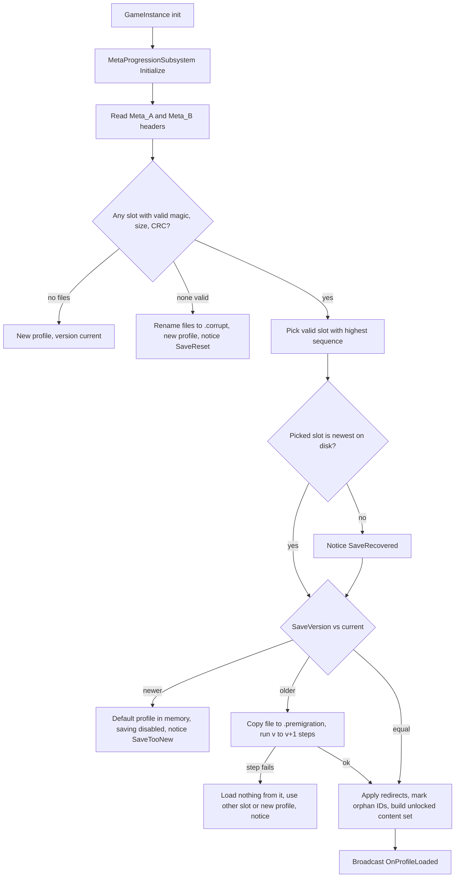
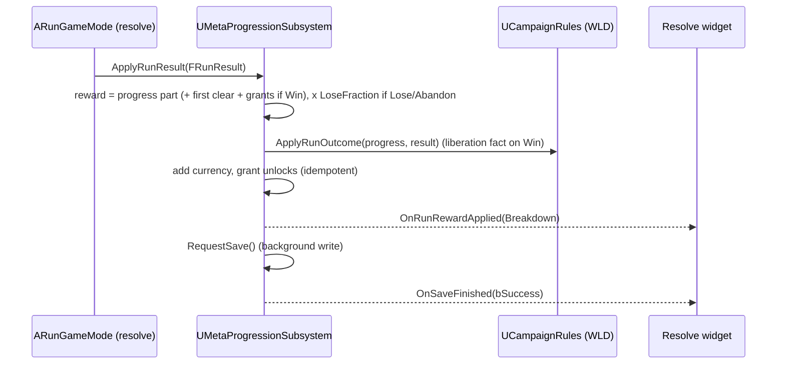

# Meta Progression and Save (MET): Technical Plan

> **Provisional — re-validate after G3.** Decision-level plan. Class names follow `00-foundation/technical-plan.md`; every path is a proposal (no UE project exists yet). Re-check against the real prototype code before starting.

## 1. Technical Overview

One `UGameInstanceSubsystem` owns the player profile for the whole process, so it survives travel between hub, open world and Siege Sites. The profile is a `UMetaSaveGame` holding plain structs with stable IDs. It is serialized with the engine SaveGame serializer into memory, wrapped in a small header (magic, version, sequence, CRC32) and written to one of two slots in turn. Load picks the newest valid slot, migrates old versions step by step, and falls back safely when data is bad.

Unlocks and vertical upgrades are Primary Data Assets found through the Asset Manager. Consumers ask one question, `IsContentUnlocked(FPrimaryAssetId)`, so they never read unlock definitions themselves. Run resolve hands MET a plain run-result struct; MET computes and applies the reward and saves. Settings use a `UGameUserSettings` subclass (config file), not the SaveGame.

## 2. Existing System Impact

| System | Impact |
|---|---|
| RUN (`ARunGameMode`, resolve) | Replace the reward stub from T-RUN-06 with a call to `ApplyRunResult`. Run start asks MET for upgrade modifiers. Pause menu gets Abandon. |
| PRK (stat modifiers, offers) | MET registers a "meta" modifier source at run start (T-PRK-02). Offer generation filters perk families by `IsContentUnlocked` (T-PRK-04). |
| DEF (build menu) | Build menu lists only unlocked tower blueprints (T-DEF-07). |
| SQD (roster) | Squads spawned at run start come from unlocked squad types (T-SQD-01). |
| CNV, WLD, ONB | Use MET queries and mutations (recipes filter, campaign facts, tutorial flag). |
| UXF | New `Feedback.Meta.*` rows; menu widgets (main menu, settings, unlocks). D-11 CommonUI review happens at VS; MET widgets follow whatever UXF decides. |
| FND | New Primary Asset Types; new tunables in `UGameTuningSettings`; new cheats. New domain folder `Meta/` (extends the D-02 list in the same style). |

## 3. Proposed Architecture

| Item | Decision |
|---|---|
| Runtime owner and lifetime | `UMetaProgressionSubsystem : UGameInstanceSubsystem`. Created at process start, loads the profile in `Initialize`, lives across all level travel. One in-memory `UMetaSaveGame*` (the profile). |
| Main UE types | `UMetaProgressionSubsystem`, `UMetaSaveGame : USaveGame`, `FMetaProfile`, `FCampaignProgress` (schema here, semantics in WLD), `UMetaUnlockDefinition : UPrimaryDataAsset`, `UMetaUpgradeDefinition : UPrimaryDataAsset`, `UUserGameSettings : UGameUserSettings`, `FMetaRewardBreakdown`. |
| Data ownership | Definitions are read-only. The profile is mutated only by subsystem methods. Settings are owned by `UUserGameSettings`. Siege Site reward tables belong to WLD (`USiegeSiteDefinition`). |
| Communication | Consumers call subsystem queries directly (`GetGameInstance()->GetSubsystem<>()`). State changes broadcast `OnMetaChanged` / `OnUnlockAcquired`. RUN calls `ApplyRunResult(const FRunResult&)` once at resolve. No event bus (D-10). |
| C++ / Blueprint split | C++: profile, envelope, slots, migration, reward math, unlock/upgrade rules, settings class. Blueprint/UMG: unlock screen, upgrade panel, resolve meta section, notices, settings menu. |
| Asset references / loading | Unlock definitions reference granted content by `FPrimaryAssetId`, not hard refs, so the hub never loads every squad/tower. Icons are soft references loaded by the UI. The subsystem builds the granted-content ID set at load from the Asset Manager list of `MetaUnlock` assets (metadata only; verify in UE docs that `GetPrimaryAssetIdList` works without loading). |
| AI / navigation impact | None. |
| UI impact | `WBP_MetaUnlocks` (catalog by type, cost, state, completion), `WBP_MetaUpgrades` (ranks, caps), meta section in the run resolve widget, `WBP_ProfileNotice`, `WBP_Settings`, main menu entries (continue / new / reset). |
| Save impact | This feature. Slots `Meta_A`, `Meta_B`, plus `*.corrupt` and `*.premigration` copies. Settings in `GameUserSettings.ini` via `UUserGameSettings`; key rebinds via Enhanced Input user settings (UE 5.3+, verify in UE docs). |
| Performance risks | Sync file write hitch; avoided by background write. Asset Manager scan at boot is metadata only. |
| Existing systems reused | `USaveGame`, `UGameplayStatics::SaveGameToMemory` / `LoadGameFromMemory`, `FCrc::MemCrc32`, `FFileHelper`, Asset Manager + Primary Asset ID redirects, `UGameUserSettings`, Enhanced Input user settings, PRK stat modifier query, `UGameCheatManager`. |
| New types proposed | See Section 5 and the file list in tasks. |
| Trade-offs | Two alternating slots + CRC instead of single file + copy: one extra file, but a crash mid-write can never destroy the only good copy. Settings in config instead of SaveGame: survives profile reset/corruption and uses engine-native apply/persist; GDD §30 still holds because settings are persistent. Facts-only campaign storage: a little rule work on load, but no stale derived state after design changes. |
| Verification | Automation Specs for envelope, slot pick, migration, reward math, caps, unlock queries; Functional Test for a full run → resolve → reload cycle; manual corruption checks via cheats. |

## 4. Runtime Flow

### Boot and load



### Run resolve to saved profile



### Save write (short pseudocode, the only tricky part)

```text
RequestSave():
  if saving disabled: return
  if write in flight: bDirty = true; return
  bytes  = SaveGameToMemory(Profile)              // game thread, small
  header = {Magic, SaveVersion, Seq = LastSeq + 1, Size, Crc32(bytes)}
  target = slot not holding LastSeq                // alternate A/B
  background: write header+bytes to target.tmp, then move over target   // verify atomic move on Windows
  on done (game thread): if ok LastSeq = Seq else notice SaveFailed
                         if bDirty: bDirty = false; RequestSave()
```

## 5. State / Data

| Type | Fields (design level) |
|---|---|
| `FMetaProfile` | `SaveVersion`, `MetaCurrency`, `UnlockedIds` (set of `FPrimaryAssetId`), `UpgradeRanks` (map `FPrimaryAssetId` → int), `Campaign` (`FCampaignProgress`), `bTutorialCompleted`, `SeenHintIds` (set of `FName`), `OrphanIds` (kept unknown IDs) |
| `FCampaignProgress` | `DiscoveredSiteIds`, `LiberatedSiteIds`, `ClearedBossDomainIds` (sets of `FPrimaryAssetId`), `DiscoveredPoiIds` (set of `FName`, authored per POI actor). Facts only (R-MET-19). |
| `UMetaUnlockDefinition` | `UnlockType` (enum of the 9 GDD types), `GrantedContent` (array of `FPrimaryAssetId`), `Source` (Purchase / Grant), `Cost`, `DisplayName`, `Description`, `Icon` (soft). `IsDataValid`: granted content not empty; cost > 0 for Purchase. |
| `UMetaUpgradeDefinition` | `StatTag` (`Stat.*`), `ModifierPerRank`, `MaxRank`, `CostPerRank` (array or curve), display data. |
| `UGameTuningSettings` additions | `MetaLoseRewardFraction` (0.5 placeholder), `MetaVerticalRankCap`, slot names. |
| `UUserGameSettings` | Audio volumes per sound class, mouse sensitivity, invert Y, plus inherited video settings. |
| Run result (owned by RUN) | Outcome (Win / Lose / Abandon), Siege Site ID, waves cleared, boss defeated. MET uses RUN's struct; if RUN's stub lacks a field, MET's task adds it. |

Version policy: engine tagged-property serialization tolerates added and removed `UPROPERTY` fields (verify in UE docs for `USaveGame`). Migration steps are only written for semantic changes (rename, split, re-meaning). Each step is a function `MigrateVnToVn1(FMetaProfile&) -> bool`, registered in order.

## 6. Main Implementation Areas

| Area | Tasks |
|---|---|
| Definitions + tunables | T-MET-01 |
| Save envelope, slots, schema v1 | T-MET-02 |
| Migration, redirects, orphan IDs, newer-version guard | T-MET-03 |
| Subsystem API, save points, cheats | T-MET-04 |
| Unlock flow + consumer filters | T-MET-05 |
| Vertical upgrades | T-MET-06 |
| Run result → reward | T-MET-07 |
| Settings persistence | T-MET-08 |
| Hub unlock/upgrade UI | T-MET-09 |
| Main menu profile flow, notices, reset | T-MET-10 |
| Robustness QA, gate playtest | T-MET-11, T-MET-12 |

## 7. Error and Edge-Case Handling

| Failure | Detection | Response |
|---|---|---|
| Newest slot corrupt | Bad magic / size / CRC | Use older slot; notice SaveRecovered |
| Both corrupt | No valid slot | Rename to `.corrupt`; new profile; notice SaveReset |
| Newer version | Header version > current | Default profile; saving disabled; notice SaveTooNew |
| Migration step fails | Step returns false | Discard migrated copy; keep `.premigration`; fall back to other slot or new profile; notice |
| Deserialize fails after CRC ok | `LoadGameFromMemory` returns null or wrong class | Treat slot as corrupt |
| Write fails | File API returns false | Notice SaveFailed; keep dirty; retry at next safe point |
| Unknown ID | Asset Manager has no such ID after redirects | Move to `OrphanIds`; ignore in queries |
| Quit during write | Temp file never moved | Next load ignores temp; other slot valid |
| Abandon / crash mid-run | Abandon → resolve path; crash → no resolve | Lose reward / no change (R-MET-13) |

## 8. Testing Strategy

- Automation Spec `MetaSave.spec.cpp`: envelope round trip; CRC mismatch rejected; slot pick by sequence; both-invalid path; newer-version path; temp file ignored.
- Automation Spec `MetaMigration.spec.cpp`: fixture v1 → v2 test migration equals expected; failing step falls back.
- Automation Spec `MetaRules.spec.cpp`: reward math (win/lose/abandon, fraction, first clear once), upgrade max rank and global cap, idempotent grants, completion count ignoring orphans.
- Functional Test `FT_MetaRunCycle`: start a short test run, force win via cheat, check profile, reload profile from disk, compare.
- Manual: cheats `meta.CorruptSlot A|B`, `meta.SetVersion N`, `meta.Reset`, `meta.Grant <Id>`, `meta.AddCurrency N`; kill process during a forced slow write (debug delay CVar `game.debug.MetaSaveDelay`).

## 9. Performance Risks

| Risk | Mitigation |
|---|---|
| File write on game thread | Background write; only serialization to memory on game thread |
| Save spam (many small changes in a row) | Coalescing dirty flag; saves only at safe points |
| Hub loads all content through unlock refs | `FPrimaryAssetId` + soft icons; check with the reference viewer / size map |
| Boot scan of definitions | Metadata-only ID listing; measure in packaged build |

## 10. Dependencies and Risks

| Item | Note |
|---|---|
| Cross-feature hooks with no anchor | Consumer filters in DEF build menu (T-DEF-07), SQD roster (T-SQD-01), PRK offers (T-PRK-04) are small edits done inside T-MET-05 with the owner's review. Run result fields (Siege Site ID, waves cleared, boss defeated) may need adding to RUN's struct inside T-MET-07. |
| Atomic file replace | Temp-write + move behavior on Windows must be verified (UE docs / platform file API). If a move is not atomic, the A/B scheme still protects the older slot. |
| Enhanced Input user settings | Available from UE 5.3 per engine docs; verify in the pinned version (T-FND-01). Fallback: store rebinds in `UUserGameSettings` as action → key pairs. |
| CommonUI | Menus here are the first real menus; follow the D-11 VS review result from UXF. Not decided here. |
| Design unknowns | NEW-MET-01..05 change data and UI text, not architecture. |
| CHANGE REQUEST | None. D-07 and D-14 fit as written. |

## 11. Requirement Coverage

| Requirement | Technical Area | Notes |
|---|---|---|
| R-MET-01 | Content review (T-MET-12), `UMetaUpgradeDefinition` caps | Design review rule, not code |
| R-MET-02 | `EMetaUnlockType` enum | Exactly 9 values |
| R-MET-03 | `UMetaUnlockDefinition.Source`, `Purchase`, `GrantUnlock` | T-MET-05 |
| R-MET-04 | Granted-content set; base content = not in set | T-MET-05 |
| R-MET-05 | Consumers query at run start / menu open only | T-MET-05 |
| R-MET-06, R-MET-07 | `UMetaUpgradeDefinition`, cap check, PRK meta modifier source | T-MET-06 |
| R-MET-08, R-MET-09 | Completion count, no sink after completion | T-MET-05, T-MET-09 |
| R-MET-10..R-MET-14 | `ApplyRunResult`, `FMetaRewardBreakdown`, Abandon path | T-MET-07 |
| R-MET-15 | `FMetaProfile` fields | T-MET-02 |
| R-MET-16 | No run data in profile; separate slot reserved | T-MET-02 |
| R-MET-17 | ID-only schema | T-MET-02 |
| R-MET-18, R-MET-26 | `UUserGameSettings`, Enhanced Input user settings | T-MET-08 |
| R-MET-19 | `FCampaignProgress` facts only; WLD derives states | T-MET-02, T-WLD-02 |
| R-MET-20, R-MET-21 | Header version, migration steps, `.premigration` | T-MET-03 |
| R-MET-22 | Newer-version guard | T-MET-03 |
| R-MET-23 | Envelope + CRC + A/B slots | T-MET-02 |
| R-MET-24 | Redirects + `OrphanIds` | T-MET-03 |
| R-MET-25 | Safe-point save calls, background write | T-MET-04 |
| R-MET-27 | Reset flow with backup | T-MET-10 |
