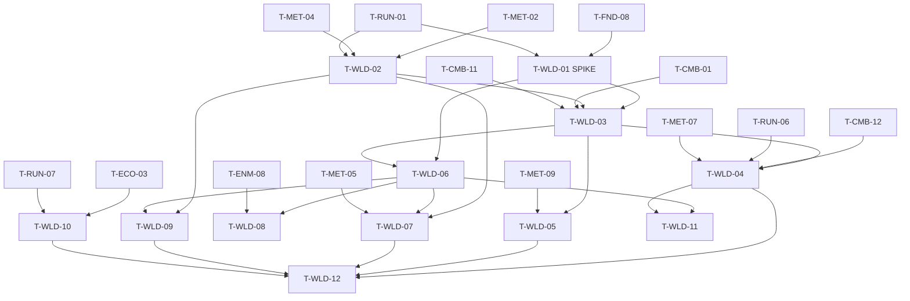

# Hub and Controlled Open World (WLD): Tasks

> **Provisional — re-validate after G3.** No task here starts before G3 passes, except that the spike T-WLD-01 may run as soon as G3 passes and before the rest is re-planned. Tasks are coarser than prototype tasks (~1–3 days each).

## 1. Summary

Decide the transition technique (spike), then build campaign data and rules, the world game mode and travel, the minimal hub, one open world segment with discoverable locations and encounters, the Siege Site entry/return flow, biome gates, the Siege Site map contract and a performance pass. Spec: [spec.md](spec.md). Plan: [technical-plan.md](technical-plan.md).

## 2. Task Overview

| ID | Task | Type | Phase | Priority | Dependencies | Status |
|---|---|---|---|---|---|---|
| T-WLD-01 | SPIKE Q-09 / D-17: seamless vs streaming gate, Level Streaming vs World Partition | TOOLS | VS | Must | T-FND-08, T-RUN-01 | Todo |
| T-WLD-02 | Campaign data (`UBiomeDefinition`, `USiegeSiteDefinition`) + `UCampaignRules` | GAMEPLAY | VS | Must | T-MET-02, T-MET-04, T-RUN-01 | Todo |
| T-WLD-03 | `AWorldGameMode` + `UWorldTravel` + Site URL option in RUN | GAMEPLAY | VS | Must | T-WLD-01, T-WLD-02, T-CMB-01, T-CMB-11 | Todo |
| T-WLD-04 | Siege Site entry and return-to-hub flow | GAMEPLAY | VS | Must | T-WLD-03, T-CMB-12, T-RUN-06, T-MET-07 | Todo |
| T-WLD-05 | Hub level (Final Citadel minimal) + stations | DESIGN | VS | Must | T-WLD-03, T-MET-09 | Todo |
| T-WLD-06 | Open world segment blockout (terrain, routes, bounds, nav) | DESIGN | VS | Must | T-WLD-01, T-WLD-03 | Todo |
| T-WLD-07 | Discovery POIs (landmark, resource point, outpost, blueprint source) | GAMEPLAY | VS | Must | T-WLD-02, T-WLD-06, T-MET-05 | Todo |
| T-WLD-08 | Open-world encounters + enemy no-lane mode | AI | VS | Should | T-WLD-06, T-ENM-01, T-ENM-08 | Todo |
| T-WLD-09 | Biome gates: boss domain link, locked next-biome connection | GAMEPLAY | VS | Must | T-WLD-02, T-WLD-06 | Todo |
| T-WLD-10 | Siege Site map contract test | QA | VS | Must | T-DEF-03, T-DEF-04, T-DEF-07, T-ZON-01, T-DIR-01, T-RUN-07, T-ECO-03 | Todo |
| T-WLD-11 | PERF: traversal and transition budgets on reference PC | PERF | VS | Must | T-WLD-06, T-WLD-04, T-FND-08 | Todo |
| T-WLD-12 | QA: end-to-end campaign loop + VS gate playtest | QA | VS | Must | T-WLD-04, T-WLD-05, T-WLD-07, T-WLD-09, T-WLD-10 | Todo |

## 3. Detailed Tasks

## VS

### T-WLD-01 — SPIKE: transition technique and world streaming (Q-09, D-17)

**Type** TOOLS · **Phase** VS

**Objective** Answer Q-09 and D-17 with measurements before any world content is built.

**Related Requirements** R-WLD-31, R-WLD-16, AC-WLD-01

**Dependencies** T-FND-08, T-RUN-01

**Implementation Notes**
- [ ] Hypothesis: "Separate levels with a loading gate into Siege Sites keep the run architecture unchanged and load within budget; seamless entry needs run ownership to move out of `ARunGameMode`."
- [ ] Throwaway maps (`Maps/Spike/`): a 1–2 km² greybox terrain + the prototype Siege Site.
- [ ] Option A: separate levels + `OpenLevel`. Option B: persistent world + Level Streaming sublevel for the site. Option C: World Partition world, site via `OpenLevel` (verify WP + streaming behavior in UE docs).
- [ ] Measure on the reference PC, packaged Development: load time world → site, traversal hitches (Insights), memory, editor iteration cost, code changes needed in RUN.
- [ ] Write KEEP / CHANGE / DELETE per option; recommend one; list impact on D-07 if B is chosen. Delete spike maps after the decision.

**Expected Files / Assets** `ai/game/21-hub-open-world/spike-q09-report.md`; throwaway `Content/<Game>/Maps/Spike/*` (deleted after)

**Test Case** Walk greybox edge to site entry and enter the site 5 times per option → record min/avg/max load and worst traversal frame.

**Acceptance Criteria**
- [ ] At least two options measured with numbers.
- [ ] A written recommendation the lead can copy into D-17 / Q-09.

**Verification** Report reviewed by the lead; Insights traces attached.

### T-WLD-02 — Campaign data and rules

**Type** GAMEPLAY · **Phase** VS

**Objective** Site and biome states come from stored facts plus definitions through pure, tested rules.

**Related Requirements** R-WLD-19..R-WLD-25, AC-WLD-04, AC-WLD-05, AC-WLD-06

**Dependencies** T-MET-02, T-MET-04, T-RUN-01

**Implementation Notes**
- [ ] `UBiomeDefinition`, `USiegeSiteDefinition` (fields in technical plan §5), Primary Asset Types `Biome`, `SiegeSite`, `IsDataValid` (back references, soft level set, reward non-negative).
- [ ] `UCampaignRules`: `GetSiteState`, `IsBossDomainOpen`, `IsNextBiomeOpen`, `ApplyRunOutcome`, `MarkDiscovered`.
- [ ] Author `DA_Biome_01`, `DA_Site_VS01` (required), `DA_Site_BossDomain01`.

**Expected Files / Assets** `Source/<Game>/World/BiomeDefinition.h/.cpp`, `SiegeSiteDefinition.h/.cpp`, `CampaignRules.h/.cpp`, `Tests/CampaignRules.spec.cpp`; `Content/<Game>/World/DA_Biome_01`, `DA_Site_*`

**Test Case** Biome with 2 required sites, count 2: liberate one → boss domain locked; liberate second → open; lose a replay → still open.

**Acceptance Criteria**
- [ ] Lose/Abandon never changes facts.
- [ ] Unknown IDs in facts are ignored.

**Verification** Automation Spec `CampaignRules`.

### T-WLD-03 — World game mode, travel, Site URL option

**Type** GAMEPLAY · **Phase** VS

**Objective** Hub and world levels run without run logic, and travel between layers carries the chosen Siege Site.

**Related Requirements** R-WLD-01, R-WLD-02, R-WLD-09, R-WLD-26, AC-WLD-08

**Dependencies** T-WLD-01, T-WLD-02, T-CMB-01, T-CMB-11

**Implementation Notes**
- [ ] `AWorldGameMode`: spawn hero at `PlayerStart`, `IMC_Combat` only, no squads; on hero death event start respawn timer (data) → respawn at `PlayerStart` tag `SegmentEntrance`.
- [ ] `UWorldTravel`: `TravelToSite(SiteId)` = `OpenLevel(SiteLevel, "?Site=<id>")`; `TravelToHub()`; `TravelToWorld()`; loading screen. Adjust if the spike chose another technique.
- [ ] RUN edit (owner review): `ARunGameMode::InitGame` parses `Site`, loads `USiegeSiteDefinition` → `URunDefinition`; fallback to default for test maps.

**Expected Files / Assets** `Source/<Game>/World/WorldGameMode.h/.cpp`, `WorldTravel.h/.cpp`; edit `Run/RunGameMode.cpp`; `Content/<Game>/World/BP_WorldGameMode`, `WBP_Loading`

**Test Case** From world call `TravelToSite(DA_Site_VS01)` → site loads with `DA_Run_VS01`; open `L_SiegeSite_Proto` directly → default run definition, warning logged.

**Acceptance Criteria**
- [ ] Hero death in world respawns within the configured delay.
- [ ] No black screen without text during travel.

**Verification** Functional Test `FT_WorldFlow_Respawn`; manual travel in packaged build.

### T-WLD-04 — Siege Site entry and return flow

**Type** GAMEPLAY · **Phase** VS

**Objective** The player chooses a Siege Site in the world, plays the run, and comes back to the hub with progress applied, win or lose.

**Related Requirements** R-WLD-13, R-WLD-14, R-WLD-18, R-WLD-23, R-WLD-24, AC-WLD-02, AC-WLD-05, AC-WLD-06

**Dependencies** T-WLD-03, T-CMB-12, T-RUN-06, T-MET-07

**Implementation Notes**
- [ ] `ASiegeSiteEntry` (`IInteractable`): prompt with name, state, required flag; confirm dialog; `TravelToSite`. Entering also writes the discovered fact.
- [ ] After resolve UI closes: `UWorldTravel::TravelToHub()` (RUN calls it; owner review).
- [ ] Replay of a Liberated site: same run, no first-clear bonus (reward via MET).

**Expected Files / Assets** `Source/<Game>/World/SiegeSiteEntry.h/.cpp`; `BP_SiegeSiteEntry`; RUN resolve edit

**Test Case** Enter site, cheat lose → hub; campaign section of save unchanged except Discovered; enter again, cheat win → Liberated.

**Acceptance Criteria**
- [ ] Hub shows last run summary after both outcomes.
- [ ] Abandon also returns to hub.

**Verification** Manual flow in PIE and packaged build; save diff of campaign section.

### T-WLD-05 — Hub level and stations

**Type** DESIGN · **Phase** VS

**Objective** A small Final Citadel where the VS minimal hub loop happens.

**Related Requirements** R-WLD-11, R-WLD-12, AC-WLD-02

**Dependencies** T-WLD-03, T-MET-09

**Implementation Notes**
- [ ] `L_Hub_FinalCitadel` blockout (small, walkable in < 30 s).
- [ ] `AHubStation` with type Unlocks (opens MET `WBP_MetaUnlocks`), CampaignBoard (`WBP_CampaignBoard`: sites, states, boss domain condition), WorldGate (`TravelToWorld`).
- [ ] Last-run summary widget on arrival (reads MET last result).

**Expected Files / Assets** `Content/<Game>/Maps/L_Hub_FinalCitadel`; `Source/<Game>/World/HubStation.h/.cpp`; `BP_HubStation_*`; `Content/<Game>/UI/World/WBP_CampaignBoard`, `WBP_LastRunSummary`

**Test Case** Arrive after a lost run → summary shows kept reward; board shows site Available; gate travels to world.

**Acceptance Criteria**
- [ ] Every station reachable and usable with Interact.
- [ ] Board shows the boss domain unlock condition.

**Verification** Manual PIE walk-through; screenshot review.

### T-WLD-06 — Open world segment blockout

**Type** DESIGN · **Phase** VS

**Objective** One handcrafted biome segment with controlled routes and every §5.2 element placed.

**Related Requirements** R-WLD-03, R-WLD-04, R-WLD-05, R-WLD-06, R-WLD-28, AC-WLD-03

**Dependencies** T-WLD-01, T-WLD-03

**Implementation Notes**
- [ ] `L_World_Biome01` using the spike's technique: macro terrain, one main valley/pass route with 1–2 side paths, authored edge bounds.
- [ ] Place markers for: landmark, ≥1 resource point, ≥1 outpost, ≥1 blueprint source, VS Siege Site entry, boss domain link, next-biome gate.
- [ ] Danger tiers along the route (area names in data for `Feedback.World.DangerArea`).
- [ ] Navmesh bounds only over walkable routes/explore areas.

**Expected Files / Assets** `Content/<Game>/Maps/L_World_Biome01` (+ sublevels/cells per spike)

**Test Case** Walk entrance → site entry on the main route in a measured time (record it); try to leave bounds at 5 edge points → blocked.

**Acceptance Criteria**
- [ ] All R-WLD-03 elements present and reachable.
- [ ] No procedural terrain or layout tools used.

**Verification** Manual traversal sweep; checklist in the task notes.

### T-WLD-07 — Discovery POIs

**Type** GAMEPLAY · **Phase** VS

**Objective** Discovering locations is rewarded once and remembered forever.

**Related Requirements** R-WLD-07, R-WLD-08, R-WLD-19, AC-WLD-03

**Dependencies** T-WLD-02, T-WLD-06, T-MET-05

**Implementation Notes**
- [ ] `AWorldPoi` (type enum, `PoiId`, radius or interact); on discover: `MarkDiscovered` fact, reward (meta currency or MET `GrantUnlock` for blueprint source), `Feedback.World.Discovered`.
- [ ] Editor validation: unique `PoiId` per level.
- [ ] Discovered POIs show a "discovered" state on revisit, no toast.

**Expected Files / Assets** `Source/<Game>/World/WorldPoi.h/.cpp`; `BP_Poi_*`; DT_Feedback rows

**Test Case** Discover the blueprint source → 4th tower unlock granted; restart game; return → no toast, unlock still owned.

**Acceptance Criteria**
- [ ] Each POI rewards exactly once across restarts.
- [ ] Duplicate `PoiId` fails validation.

**Verification** Functional Test `FT_WorldFlow_Discovery`; manual restart check.

### T-WLD-08 — Open-world encounters

**Type** AI · **Phase** VS

**Objective** Authored enemy groups make the route dangerous without lanes or Director.

**Related Requirements** R-WLD-06, R-WLD-10, R-WLD-29

**Dependencies** T-WLD-06, T-ENM-01, T-ENM-08

**Implementation Notes**
- [ ] `AWorldEncounter`: archetype list + spawn points, trigger/despawn radius, `bOptional` + `ActivationChance` rolled per visit.
- [ ] ENM extension (owner review): brain mode with no lane: idle at home, Local Aggro on hero, leash back to home.
- [ ] Place 2–4 encounters by danger tier; optional ones never on the required route.

**Expected Files / Assets** `Source/<Game>/World/WorldEncounter.h/.cpp`; ENM brain edit; `BP_WorldEncounter_*`

**Test Case** Approach an encounter → enemies aggro; run beyond leash → they return home; die → respawn at entrance, encounter reset.

**Acceptance Criteria**
- [ ] Encounters despawn when the hero leaves the radius.
- [ ] `ActivationChance` 0 / 1 behave as never / always.

**Verification** Functional Test `FT_WorldFlow_Encounter`; Visual Logger for leash.

### T-WLD-09 — Biome gates

**Type** GAMEPLAY · **Phase** VS

**Objective** The boss domain link opens when enough required sites are liberated; the next-biome connection is visibly locked.

**Related Requirements** R-WLD-20, R-WLD-21, R-WLD-22, AC-WLD-04

**Dependencies** T-WLD-02, T-WLD-06

**Implementation Notes**
- [ ] `ABiomeGate` (BossDomain / NextBiome): reads `UCampaignRules` on BeginPlay and `OnMetaChanged`; open/locked presentation; locked message shows the condition.
- [ ] Next-biome gate in VS: always locked with "not in this build" text when `NextBiome` is unset.

**Expected Files / Assets** `Source/<Game>/World/BiomeGate.h/.cpp`; `BP_BiomeGate_*`

**Test Case** Cheat-liberate required sites → reload world → boss domain gate open; `meta.Reset` → closed again.

**Acceptance Criteria**
- [ ] Gate state always matches rules output (no stored gate state).
- [ ] Locked gate always states its condition.

**Verification** Functional Test `FT_WorldFlow_Gates`.

### T-WLD-10 — Siege Site map contract test

**Type** QA · **Phase** VS

**Objective** Every Siege Site map provably has the elements §5.3 requires.

**Related Requirements** R-WLD-15, R-WLD-16, R-WLD-30, AC-WLD-07

**Dependencies** T-DEF-03, T-DEF-04, T-DEF-07, T-ZON-01, T-DIR-01, T-RUN-07, T-ECO-03

**Implementation Notes**
- [ ] Automation test iterating all `USiegeSiteDefinition` levels (plus the ONB tutorial level): load map, check ≥1 `ACoreStructure`, ≥1 `ALaneRoute` + spawn point, ≥1 `ATacticalZone`, ≥1 build zone, ≥1 `AResourcePoint`, a boss entry marker, the boundary volume; and no `AWorldPoi` / `AWorldEncounter` inside. Verify the map-loading automation approach in UE docs.
- [ ] Clear failure messages naming the missing element.

**Expected Files / Assets** `Source/<Game>/Tests/SiegeSiteContract.spec.cpp` (or complex automation test)

**Test Case** Duplicate the VS site map, delete its tactical zone → test fails naming "TacticalZone".

**Acceptance Criteria**
- [ ] VS site and tutorial map pass.
- [ ] Each removed element fails individually.

**Verification** Command-line automation run.

### T-WLD-11 — PERF: traversal and transition budgets

**Type** PERF · **Phase** VS

**Objective** Record and meet traversal and transition budgets on the reference PC.

**Related Requirements** AC-WLD-09; GDD §31

**Dependencies** T-WLD-06, T-WLD-04, T-FND-08

**Implementation Notes**
- [ ] Insights traces in packaged Development: full segment walk, world → site, site → hub.
- [ ] Set budgets (frame time, worst hitch, load seconds) with the lead; tune LOD/HLOD/streaming per spike technique.
- [ ] Record in `ai/game/playtests/vs-wld-perf.md`.

**Expected Files / Assets** perf report; settings changes in levels

**Test Case** Scripted or manual walk of the main route 3 times → worst frame under budget.

**Acceptance Criteria**
- [ ] Budgets written down and met or a bug task logged per miss.

**Verification** Traces attached to the report.

### T-WLD-12 — QA: end-to-end campaign loop and VS gate playtest

**Type** QA · **Phase** VS

**Objective** Prove the hub → world → site → hub loop and check WLD against the VS Gate.

**Related Requirements** R-WLD-17 (boundary handled by T-RUN-07, regression-checked here), R-WLD-23, R-WLD-27, R-WLD-28, R-WLD-29, AC-WLD-02..AC-WLD-06, AC-WLD-10; master plan Section 3 "VS Gate" checklist

**Dependencies** T-WLD-04, T-WLD-05, T-WLD-07, T-WLD-09, T-WLD-10

**Implementation Notes**
- [ ] New profile run-through: tutorial (if present) → hub → world → discover all POIs → site lose → hub → site win → boss domain opens.
- [ ] Content review against §5.4 exclusions and §27 limits.
- [ ] Playtest 3+ players: does the world feel like a campaign, not a menu (§5.1)? Note KEEP / CHANGE / DELETE; answer or re-raise NEW-WLD-01..07.

**Expected Files / Assets** `ai/game/playtests/vs-wld-gate.md`

**Test Case** As above, with a save-file diff after each step.

**Acceptance Criteria**
- [ ] All AC-WLD rows checked with evidence.
- [ ] spec.md open questions updated.

**Verification** Report reviewed at the VS Gate meeting.

## 4. Dependency Graph

## 5. Integration / Regression Checklist

- [ ] Prototype maps still open directly and run with their default `URunDefinition` (no `Site` option needed).
- [ ] Run flow (prep → waves → boss → resolve) unchanged inside the VS Siege Site.
- [ ] RUN boundary handling (T-RUN-07) still works in the VS site.
- [ ] MET profile unchanged across travel; facts written only through MET.
- [ ] `CampaignRules` Spec and Siege Site contract test green.

## 6. Final Definition of Done

- All tasks Done with verification recorded; all `AC-WLD-*` pass.
- Spike decision recorded and applied; D-17 / Q-09 answered in the master plan by the lead.
- Implemented + integrated + verified in PIE and packaged Development build on the reference PC.
- No new warnings/errors; encounter, reward and gate values in data.
