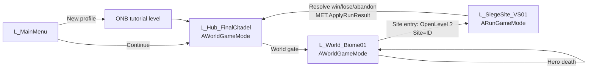
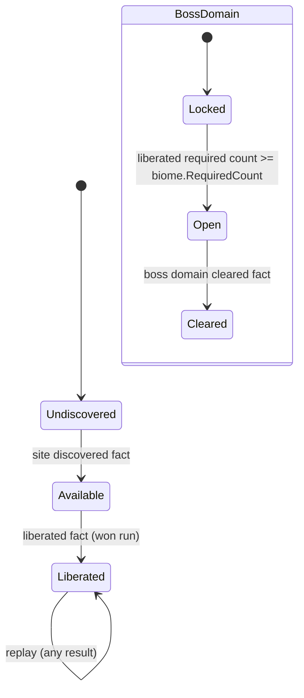

# Hub and Controlled Open World (WLD): Technical Plan

> **Provisional — re-validate after G3.** Decision-level plan. Class names follow `00-foundation/technical-plan.md`; every path is a proposal. The transition technique below is a default until spike T-WLD-01 reports.

## 1. Technical Overview

Three kinds of levels: `L_Hub_FinalCitadel`, one open world segment `L_World_Biome01`, and Siege Site levels (`L_SiegeSite_VS01`, the tutorial variant from ONB). Hub and world use a thin `AWorldGameMode` (hero only, no run). Siege Sites keep `ARunGameMode` unchanged. Default transition is a loading gate: `OpenLevel` with a URL option naming the Siege Site (`?Site=<PrimaryAssetId>`), which `ARunGameMode` reads to pick the `URunDefinition`. The spike may change this.

Campaign state is not owned by any level. Facts live in MET (`FCampaignProgress`). WLD supplies pure rules (`UCampaignRules`) that derive site and biome states from facts + definitions, and world actors (site entry, gates, POIs) that read those states on BeginPlay and on `OnMetaChanged`.

## 2. Existing System Impact

| System | Impact |
|---|---|
| RUN | `ARunGameMode` reads the `Site` URL option in `InitGame` (fallback: its default `URunDefinition` for test maps). After resolve, calls WLD travel to hub. No other change. |
| MET | Stores `FCampaignProgress`; calls `UCampaignRules::ApplyRunOutcome` from `ApplyRunResult`; receives grants for blueprint sources. |
| CMB | Hero spawns in hub/world through `AWorldGameMode`; Interact verb (T-CMB-12) drives stations, entries, POIs. Hero death event (T-CMB-11) handled by `AWorldGameMode` outside runs. |
| ENM | Open-world encounter enemies need a "no lane" brain mode: home position, Local Aggro, leash back home. Extends T-ENM-08 (no anchor covers it; small edit inside T-WLD-08 with owner review). |
| DEF / ZON / DIR / ECO | Their actors make up the Siege Site map contract checked by T-WLD-10. |
| UXF | `Feedback.World.*` rows, loading screen, toasts, campaign board widget. |
| FND | New Primary Asset Types `Biome`, `SiegeSite`; new domain folder `World/` (extends the D-02 list). |

## 3. Proposed Architecture

| Item | Decision |
|---|---|
| Runtime owner and lifetime | `AWorldGameMode` per hub/world level (level lifetime): spawns hero, handles hero death respawn, no run state. Campaign facts: MET subsystem (process lifetime). Rules: stateless `UCampaignRules` (static functions). |
| Main UE types | `AWorldGameMode`, `UCampaignRules` (BlueprintFunctionLibrary), `UWorldTravel` (BlueprintFunctionLibrary: `TravelToSite`, `TravelToHub`, `TravelToWorld`), `ASiegeSiteEntry`, `AWorldPoi` (one class, type enum), `ABiomeGate` (boss domain link, next-biome connection), `AWorldEncounter`, hub stations (`AHubStation` with a station type enum: Unlocks, CampaignBoard, WorldGate), `UBiomeDefinition`, `USiegeSiteDefinition`. |
| Data ownership | Definitions read-only. Facts in MET only. World actors hold no persistent state; they hold an authored ID (`SiteId`, `PoiId`, `BiomeId`) and read derived state. |
| Communication | Actors → `UCampaignRules::GetSiteState(...)` with MET's progress; discovery → `MET::SetCampaignFact` → `OnMetaChanged` → actors refresh. Travel via `UWorldTravel`. No event bus. |
| C++ / Blueprint split | C++: rules, travel, game mode, actor bases, ID validation. Blueprint: entry/POI/gate visuals, station interaction presentation, campaign board widget, level design. |
| Asset references / loading | `USiegeSiteDefinition.Level` is a soft world reference; `URunDefinition` hard ref is fine (small). Loading screen via the engine movie player or a simple widget during `OpenLevel` (verify the loading-screen approach in UE docs for the pinned version). |
| AI / navigation impact | Open world: static Recast navmesh over the segment (navigable routes only); if World Partition is chosen, evaluate navigation invokers or WP navmesh (verify in UE docs). Encounters: existing enemy brain in no-lane mode. |
| UI impact | Campaign board (`WBP_CampaignBoard`), site entry prompt, discovery toast, loading screen, last-run summary in hub, gate locked message. |
| Save impact | Writes facts through MET only; no own save file. |
| Performance risks | Open-world rendering (terrain, foliage, draw distance), traversal streaming hitches, transition load time, encounter actor count. |
| Existing systems reused | MET subsystem, `ARunGameMode`, hero + Interact, enemy archetypes, UXF feedback subsystem, engine `OpenLevel` URL options, Level Streaming / World Partition (per spike). |
| New types proposed | Listed above; files in tasks. |
| Trade-offs | Loading gate (default): keeps `ARunGameMode` as run owner (D-07) and gives a clean run reset, at the cost of a load screen. Seamless streaming: better §5.1 feel, but run logic can no longer rely on a GameMode swap (see Section 10). Stateless rules + facts: tiny recompute cost, no stale state. |
| Verification | Automation Spec for campaign rules; Functional Tests for discovery and gates; contract test over Siege Site maps; end-to-end manual loop; Insights captures for traversal and transitions. |

## 4. Runtime Flow

### Layer travel (default: loading gates)



### Site state derivation



`UCampaignRules` (pure):

```text
GetSiteState(Site, P):  Liberated if Site in P.Liberated
                        else Available if Site in P.DiscoveredSites
                        else Undiscovered
IsBossDomainOpen(Biome, P): count(s in Biome.Sites where s.bRequired and s in P.Liberated) >= Biome.RequiredCount
IsNextBiomeOpen(Biome, P):  Biome.BossDomainSite in P.ClearedBossDomains
ApplyRunOutcome(Result, P): if Win: add Liberated (and ClearedBossDomains if site.bIsBossDomain)
                            Lose/Abandon: no fact change  (R-WLD-23)
```

## 5. State / Data

| Type | Fields (design level) |
|---|---|
| `UBiomeDefinition` | `BiomeId` (asset ID), `Sites` (array of `USiegeSiteDefinition` IDs), `RequiredLiberationCount` (default = number of required sites), `BossDomainSite`, `NextBiome` (optional ID), `WorldLevel` (soft) |
| `USiegeSiteDefinition` | `SiteLevel` (soft world), `RunDefinition`, `Biome`, `bRequiredForLiberation`, `bIsBossDomain`, `Reward` {`PerWaveCleared`, `BossDefeated`, `FirstClearBonus`, `FirstClearUnlocks`}, optional `ReplayModifiers` / `ReplayReward` |
| `AWorldPoi` | `PoiId` (`FName`, unique per world, validated), `PoiType` (Landmark / ResourcePoint / Outpost / BlueprintSource), `DiscoveryRadius`, `bRequireInteract`, `MetaCurrencyReward` or `UnlockId` |
| `ASiegeSiteEntry` | `SiteId`, prompt presentation |
| `ABiomeGate` | `BiomeId`, `GateKind` (BossDomain / NextBiome), locked/open presentation |
| `AWorldEncounter` | enemy archetype list + spawn points, `bOptional`, `ActivationChance` (§27.2, data), trigger radius, despawn radius |
| Transient | Current layer (from game mode class), pending travel site ID in URL options only |

All IDs validated: `PoiId` unique (editor validation in T-WLD-07), every site in a biome points back to it (`IsDataValid`).

## 6. Main Implementation Areas

| Area | Tasks |
|---|---|
| Spike Q-09 / D-17 | T-WLD-01 |
| Campaign data + rules | T-WLD-02 |
| World game mode + travel | T-WLD-03 |
| Siege Site entry and return flow | T-WLD-04 |
| Hub level + stations | T-WLD-05 |
| Open world segment blockout | T-WLD-06 |
| Discovery POIs | T-WLD-07 |
| Open-world encounters | T-WLD-08 |
| Biome gates | T-WLD-09 |
| Siege Site map contract | T-WLD-10 |
| Streaming / traversal performance | T-WLD-11 |
| End-to-end QA + gate playtest | T-WLD-12 |

## 7. Error and Edge-Case Handling

| Failure | Response |
|---|---|
| Site level fails to load / soft ref broken | `UWorldTravel` falls back to hub, logs error, shows notice; caught earlier by `IsDataValid` + contract test |
| `Site` URL option missing in a Siege Site | `ARunGameMode` uses its default run definition (test maps); log warning; no campaign facts written (no site ID) |
| Hero dies in world | `AWorldGameMode` timer → respawn at `PlayerStart` tagged `SegmentEntrance`; encounters in range reset |
| Duplicate `PoiId` | Editor validation error; at runtime the second POI logs an error and is disabled |
| Facts reference removed site | MET orphan handling; rules ignore unknown IDs |
| Gate state after data change | Recomputed from facts on load (R-WLD-25) |
| Player stuck at segment edge | Collision authored; nav bounds limit AI; manual QA sweep in T-WLD-12 |

## 8. Testing Strategy

- Automation Spec `CampaignRules.spec.cpp`: site states, boss domain open count, next biome after clear, lose leaves facts unchanged, replay keeps Liberated.
- Functional Tests in `FT_WorldFlow`: POI discovery writes fact once; gate opens after cheat-liberating required sites; hero death respawn.
- Contract test (T-WLD-10) over every `USiegeSiteDefinition` level.
- Manual: full loop hub → world → site → win/lose → hub in a packaged build; traversal sweep for collision holes.
- Insights traces: walk the segment start to end; transition world → site → hub.

## 9. Performance Risks

| Risk | Mitigation |
|---|---|
| Transition load time too long | Measure in spike; keep Siege Site levels lean; soft refs; loading screen |
| Traversal hitches (streaming) | Spike chooses technique; cell/sublevel sizes tuned in T-WLD-11 |
| Terrain/foliage cost | HLOD / LOD settings per spike result; budgets recorded on reference PC |
| Too many encounter actors | Spawn on approach, despawn on leave; cap per area in data |
| Large navmesh | Nav bounds only on routes and explorable areas |

## 10. Dependencies and Risks

| Item | Note |
|---|---|
| Spike may pick seamless Siege Site entry | Then the Siege Site cannot rely on a GameMode swap: `ARunGameMode` would no longer own run rules while the world level is persistent. That needs a **conditional CHANGE REQUEST: D-07** (run state owner moves to a component activated on site entry). Not raised now because the default (loading gate) keeps D-07 valid. |
| D-17 | Answered by T-WLD-01; result recorded in master plan by the lead, not here. |
| ENM no-lane brain mode | No anchor; done inside T-WLD-08 as a small extension of T-ENM-08 with owner review. |
| RUN `Site` option + return travel | Small edit in RUN inside T-WLD-03 / T-WLD-04 with owner review. |
| Art direction (Q-13) | Final biome art needs Q-13; blockout does not. |
| Open design questions | NEW-WLD-01..07 change content and small rules, not the architecture. |

## 11. Requirement Coverage

| Requirement | Technical Area | Notes |
|---|---|---|
| R-WLD-01, R-WLD-02 | Level set + `AWorldGameMode` | T-WLD-03, T-WLD-05, T-WLD-06 |
| R-WLD-03, R-WLD-04, R-WLD-05 | Segment blockout + bounds | T-WLD-06 |
| R-WLD-06 | Encounter authoring per area | T-WLD-08 |
| R-WLD-07, R-WLD-08 | `AWorldPoi` rewards / outpost type | T-WLD-07 |
| R-WLD-09 | No squad spawning in `AWorldGameMode` | T-WLD-03 |
| R-WLD-10 | `AWorldEncounter`, no-lane brain mode | T-WLD-08 |
| R-WLD-11, R-WLD-12 | Hub level + stations + summary | T-WLD-05 |
| R-WLD-13 | `UWorldTravel::TravelToHub` after resolve | T-WLD-04 |
| R-WLD-14, R-WLD-18 | `ASiegeSiteEntry` + confirm | T-WLD-04 |
| R-WLD-15, R-WLD-16 | Map contract test; world systems absent in site levels | T-WLD-10 |
| R-WLD-17 | RUN T-RUN-07 + MET Abandon | Referenced |
| R-WLD-19..R-WLD-22, R-WLD-25 | `UCampaignRules`, facts in MET, gates | T-WLD-02, T-WLD-09 |
| R-WLD-23 | `ApplyRunOutcome` lose path | T-WLD-02, T-WLD-04 |
| R-WLD-24 | Replay data on site definition | T-WLD-02, T-WLD-04 |
| R-WLD-26 | `AWorldGameMode` respawn | T-WLD-03 |
| R-WLD-27, R-WLD-28, R-WLD-30 | Content review checklist | T-WLD-12 |
| R-WLD-29 | `AWorldEncounter.ActivationChance`; ECO active nodes | T-WLD-08 |
| R-WLD-31 | Spike | T-WLD-01 |
