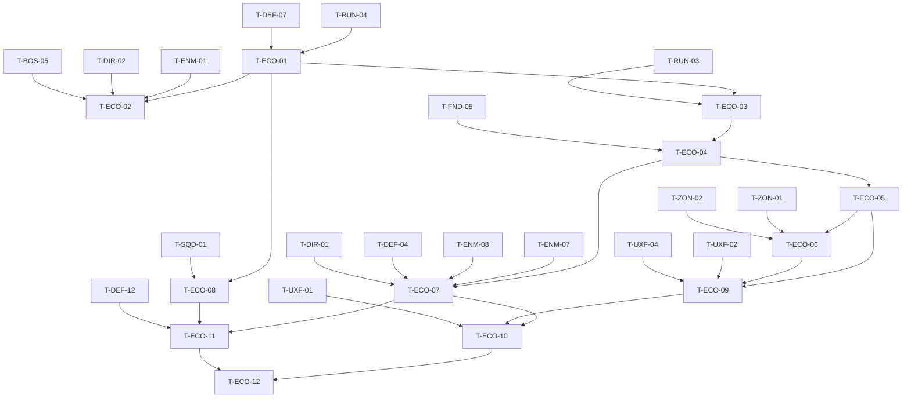

# Villager Economy (ECO): Tasks

> **Provisional — re-validate after G3.** No task here starts before G3 passes (GDD §32 P3 gate). Re-read the G3 notes, update the spec and re-plan before starting. Tasks are coarser than prototype tasks (~1–3 days each).

## 1. Summary

Replace the single run resource with Food / Gold / Monster Material, add resource points, physical villagers with workforce-level management (jobs, priority, evacuate, protect through Resource Camp zones), enemy pressure on villagers (Local Aggro, raids), Food reinforcement, economy UI and feedback, then benchmark and tune. Spec: [spec.md](spec.md). Plan: [technical-plan.md](technical-plan.md).

## 2. Task Overview

| ID | Task | Type | Phase | Priority | Dependencies | Status |
|---|---|---|---|---|---|---|
| T-ECO-01 | `URunEconomyComponent` ledger; replace single run resource; build/repair → Gold | GAMEPLAY | VS | Must | T-RUN-04, T-DEF-07 | Todo |
| T-ECO-02 | Earn sources: kills → MM, wave clear → Gold, boss → MM | GAMEPLAY | VS | Must | T-ECO-01, T-ENM-01, T-DIR-02, T-BOS-05 | Todo |
| T-ECO-03 | `AResourcePoint` + definitions + production + interruption + active-node roll | GAMEPLAY | VS | Must | T-ECO-01, T-RUN-03 | Todo |
| T-ECO-04 | `AVillagerCharacter` + FSM + spawn/shelter + stuck handling | AI | VS | Must | T-ECO-03, T-FND-05 | Todo |
| T-ECO-05 | `UWorkforceComponent` allocation (targets, priority) + snapshot | GAMEPLAY | VS | Must | T-ECO-04 | Todo |
| T-ECO-06 | Evacuate zone + protect via linked Resource Camp zone | GAMEPLAY | VS | Must | T-ECO-05, T-ZON-01, T-ZON-02 | Todo |
| T-ECO-07 | Enemy interaction: villagers in Local Aggro, raid routes | AI | VS | Must | T-ECO-04, T-ENM-07, T-ENM-08, T-DEF-04, T-DIR-01 | Todo |
| T-ECO-08 | Food spend: squad reinforcement | GAMEPLAY | VS | Must | T-ECO-01, T-SQD-01 | Todo |
| T-ECO-09 | Workforce panel, resource HUD, villager/zone markers | UI | VS | Must | T-ECO-05, T-ECO-06, T-UXF-02, T-UXF-04 | Todo |
| T-ECO-10 | `Feedback.Economy.*` rows: VFX, audio, toasts | AUDIO | VS | Should | T-ECO-07, T-ECO-09, T-UXF-01 | Todo |
| T-ECO-11 | PERF benchmark (villagers + enemy cap) + economy tuning pass | PERF | VS | Must | T-ECO-07, T-ECO-08, T-DEF-12 | Todo |
| T-ECO-12 | QA: Functional Test suite, input audit, VS gate playtest | QA | VS | Must | T-ECO-10, T-ECO-11 | Todo |

## 3. Detailed Tasks

## VS

### T-ECO-01 — Economy ledger replaces the single run resource

**Type** GAMEPLAY · **Phase** VS

**Objective** Food, Gold and MM exist as one run-scoped ledger; the prototype run resource is gone; build and repair cost Gold.

**Related Requirements** R-ECO-01, R-ECO-05, R-ECO-07, R-ECO-08, R-ECO-10, R-ECO-11, AC-ECO-01, AC-ECO-02

**Dependencies** T-RUN-04, T-DEF-07

**Implementation Notes**
- [ ] Tag root `Resource.*` (`Food`, `Gold`, `MonsterMaterial`); `FResourceAmount`; `URunEconomyComponent` on `ARunGameState` (`Add`, `CanAfford`, atomic `TrySpend(list)`, `bClosed` at resolve, delegates).
- [ ] Run/site data: `StartingResources` list.
- [ ] Migrate every T-RUN-04 call site; delete the old field, UI counter and cheat. Cheat `eco.Add <Res> <N>`.
- [ ] DEF: `UStructureDefinition.Cost` → `FResourceAmount` list (Gold); repair spends Gold (owner review).

**Expected Files / Assets** `Source/<Game>/Economy/RunEconomyComponent.h/.cpp`, `ResourceTypes.h`, `Tests/RunEconomy.spec.cpp`; edits in `Run/`, `Structures/`

**Test Case** Start run with 100 Gold, build a 60 Gold Ballista → 40; try a second → refused "Need 20 Gold".

**Acceptance Criteria**
- [ ] Grep finds no reference to the old run resource.
- [ ] Multi-resource spend deducts all or nothing.

**Verification** Automation Spec `RunEconomy`; PIE build/repair check in the VS Siege Site.

### T-ECO-02 — Earn sources

**Type** GAMEPLAY · **Phase** VS

**Objective** Kills give MM, wave clears give Gold, the boss gives MM, all from data.

**Related Requirements** R-ECO-04, R-ECO-06, R-ECO-09, AC-ECO-03

**Dependencies** T-ECO-01, T-ENM-01, T-DIR-02, T-BOS-05

**Implementation Notes**
- [ ] `UEnemyArchetypeDefinition.Rewards`, `UBossDefinition.Rewards` as `FResourceAmount` lists (owner review).
- [ ] `ARunGameMode` enemy-death handler credits rewards; wave-cleared handler credits `UWaveDefinition.ClearReward`.
- [ ] Float text at kill location through `Feedback.Economy.ResourceGained` (row added in T-ECO-10; stub row now).

**Expected Files / Assets** edits in `Enemy/`, `Boss/`, `Encounter/`, `Run/RunGameMode.cpp`; updated `DA_Enemy_*`, `DA_Wave_*`

**Test Case** Swarm reward 1 MM, Armored 4 MM; kill 3 Swarm + 1 Armored → +7 MM; clear wave with 25 Gold reward → +25 Gold.

**Acceptance Criteria**
- [ ] Credits stop after resolve (ledger closed).
- [ ] Values only in data.

**Verification** Functional Test in `FT_Workforce` (spawn + kill via cheat, assert totals).

### T-ECO-03 — Resource points, production, interruption

**Type** GAMEPLAY · **Phase** VS

**Objective** Resource points turn present, working villagers into Food or Gold, and stop while threatened.

**Related Requirements** R-ECO-32 (resource points inside the Siege Site boundary), R-ECO-02, R-ECO-04, R-ECO-26, R-ECO-27, R-ECO-28, R-ECO-31, R-ECO-33, AC-ECO-04, AC-ECO-06

**Dependencies** T-ECO-01, T-RUN-03

**Implementation Notes**
- [ ] `UResourcePointDefinition` (PDA, `ResourcePoint` type); `AResourcePoint` with work spots, threat sphere (overlap events, hostile team only), `LinkedZone`, `ActiveChance` rolled at run start.
- [ ] State: Inactive / Active / Interrupted / Evacuated / Unstaffed; delegate on change.
- [ ] Production timer (`ProductionInterval` in `UGameTuningSettings`) owned by `UWorkforceComponent` (stub roster until T-ECO-04): `working × RatePerWorker`.
- [ ] Build validation rejects footprints overlapping a point (DEF owner review).
- [ ] Author `DA_ResourcePoint_Farm`, `DA_ResourcePoint_Mine`.

**Expected Files / Assets** `Source/<Game>/Economy/ResourcePoint.h/.cpp`, `ResourcePointDefinition.h/.cpp`; `BP_ResourcePoint_*`; `Content/<Game>/Economy/DA_ResourcePoint_*`

**Test Case** Point with 2 debug workers, rate 3, interval 5 s → +6 per 5 s; spawn enemy inside radius → 0 next interval; kill it → resumes.

**Acceptance Criteria**
- [ ] No Tick on resource points.
- [ ] `ActiveChance` 0/1 gives never/always active.

**Verification** Functional Test `FT_Workforce_Production`.

### T-ECO-04 — Villager character and FSM

**Type** AI · **Phase** VS

**Objective** Villagers walk to work, work, cower when threatened, evacuate to the shelter and die when killed.

**Related Requirements** R-ECO-12..R-ECO-17, R-ECO-28

**Dependencies** T-ECO-03, T-FND-05

**Implementation Notes**
- [ ] `AVillagerCharacter`: `UHealthComponent`, team 0, tag `Unit.Villager`, `AAIController` + navmesh `MoveTo`, timer-driven `EVillagerState` FSM (diagram in technical plan).
- [ ] `AVillagerShelter` marker near the Core; spawn `VillagerCount` from run/site data at run start.
- [ ] Death → notify `UWorkforceComponent`; no respawn.
- [ ] Stuck: no progress N s → repath; again and not recently rendered → teleport to target (NEW-ECO-07).
- [ ] BP: work loop, cower, flee anims (placeholder until VS art).

**Expected Files / Assets** `Source/<Game>/Economy/VillagerCharacter.h/.cpp`, `VillagerShelter.h/.cpp`; `Content/<Game>/Economy/BP_Villager`

**Test Case** Assign 2 villagers to a point via debug → they commute and switch to Working; place a blocker on their path → they repath; enemy in radius → Interrupted.

**Acceptance Criteria**
- [ ] Villagers have no combat behavior.
- [ ] Decision interval from data; no Tick logic.

**Verification** Functional Test `FT_Workforce_Villager`; Visual Logger shows FSM transitions.

### T-ECO-05 — Workforce allocation

**Type** GAMEPLAY · **Phase** VS

**Objective** Player targets and priority decide who works where, without per-villager control.

**Related Requirements** R-ECO-18, R-ECO-20, R-ECO-21, R-ECO-22, R-ECO-25, AC-ECO-05

**Dependencies** T-ECO-04

**Implementation Notes**
- [ ] `UWorkforceComponent` on `ARunGameMode`: `SetTarget(cat, n)`, `SetPriority(order)`; pure `Allocate(...)` (pseudocode in technical plan); deferred single re-run per frame on any change or death.
- [ ] `FWorkforceSnapshot` mirrored to `ARunGameState` + `OnWorkforceChanged`.
- [ ] Default targets/priority from run data.

**Expected Files / Assets** `Source/<Game>/Economy/WorkforceComponent.h/.cpp`, `WorkforceAllocation.h/.cpp`, `Tests/WorkforceAllocation.spec.cpp`

**Test Case** 8 villagers, targets Food 6 / Gold 6, priority Gold > Food → Gold 6, Food 2, Food short by 4; kill 2 Gold workers → Gold 6, Food 0.

**Acceptance Criteria**
- [ ] Valid assignments are kept across re-runs (no shuffling).
- [ ] Slot caps respected.

**Verification** Automation Spec `WorkforceAllocation`; PIE with `game.debug.Workforce 1` overlay.

### T-ECO-06 — Evacuate and protect

**Type** GAMEPLAY · **Phase** VS

**Objective** The player can pull villagers out of a zone and send a squad to guard it, with existing systems.

**Related Requirements** R-ECO-23, R-ECO-24, AC-ECO-07, AC-ECO-08

**Dependencies** T-ECO-05, T-ZON-01, T-ZON-02

**Implementation Notes**
- [ ] `SetEvacuated(point, bool)` → evacuated set → re-allocate; villagers without a new point go `Evacuating` → `Sheltered`.
- [ ] Each VS resource point gets a linked `ATacticalZone` (`Zone.ResourceCamp`); editor validation warns if missing.
- [ ] No new command: Guard on that zone uses the T-ZON-02 Command Wheel context.

**Expected Files / Assets** `WorkforceComponent` additions; level edits in the VS Siege Site

**Test Case** Two Food points, evacuate A → A's workers move to B's free slots, rest shelter; reopen A → reassigned; aim Command Wheel at A's zone → Infantry Guard.

**Acceptance Criteria**
- [ ] Evacuated and interrupted states are distinct in the snapshot.
- [ ] Protect needs no ECO-specific input.

**Verification** Functional Test `FT_Workforce_Evacuate`; PIE manual Guard check.

### T-ECO-07 — Enemy interaction: aggro and raids

**Type** AI · **Phase** VS

**Objective** Enemies can hurt the economy: they hit villagers in range and raids target resource zones.

**Related Requirements** R-ECO-13, R-ECO-29, R-ECO-30, AC-ECO-09

**Dependencies** T-ECO-04, T-ENM-07, T-ENM-08, T-DEF-04, T-DIR-01

**Implementation Notes**
- [ ] ENM (owner review): Local Aggro candidate filter adds `Unit.Villager` at lowest priority.
- [ ] DEF/ENM (owner review): `ALaneRoute` optional `ObjectiveActor` + `ContinuationRoute`; enemy treats an `AResourcePoint` objective as reached when inside its radius, attacks villagers there, and after `RaidContinueDelay` with no working villagers follows the continuation route to the Core (§14.2 special objective).
- [ ] DIR: wave entries can name a raid route; author one raid in a VS wave.

**Expected Files / Assets** edits in `Enemy/EnemyBrainComponent`, `Navigation/LaneRoute`, `Encounter/WaveDefinition`; `DA_Wave_VS_*` raid entry

**Test Case** Raid group of 4 Swarm on raid route → reaches Mine, villagers Interrupted and attacked; evacuate → after delay the group follows continuation to the Core.

**Acceptance Criteria**
- [ ] Enemies never prefer a villager over Hero/Squad/structures in range.
- [ ] Raid groups never stand idle at an empty point.

**Verification** Functional Test `FT_Workforce_Raid`; Visual Logger for objective switch.

### T-ECO-08 — Food spend: squad reinforcement

**Type** GAMEPLAY · **Phase** VS

**Objective** Food has a clear army use: replacing lost soldiers.

**Related Requirements** R-ECO-03, AC-ECO-10

**Dependencies** T-ECO-01, T-SQD-01

**Implementation Notes**
- [ ] If SQD/ZON already reinforce soldiers (Rally Point §15.4): add a Food cost per soldier through `TrySpend`.
- [ ] Else add a minimal reinforce: `ASquad::AddSoldiers(N)` (owner review), button on the squad card during Prep/Intermission, cost per soldier in `USquadDefinition` (`FResourceAmount`).
- [ ] New soldiers spawn at the Core and join their formation slots.

**Expected Files / Assets** edits in `Army/Squad`, `USquadDefinition`; squad card widget update

**Test Case** Infantry at 7/10, Food 20, cost 4 → reinforce 3 → 10/10, Food 8; with Food 3 → refused "Need 4 Food".

**Acceptance Criteria**
- [ ] Never exceeds the squad's max soldiers.
- [ ] No per-soldier selection.

**Verification** Functional Test in `FT_Workforce`; PIE manual.

### T-ECO-09 — Workforce panel, resource HUD, markers

**Type** UI · **Phase** VS

**Objective** The player reads and changes the economy in seconds.

**Related Requirements** R-ECO-18..R-ECO-25, AC-ECO-01, AC-ECO-05, AC-ECO-07

**Dependencies** T-ECO-05, T-ECO-06, T-UXF-02, T-UXF-04

**Implementation Notes**
- [ ] Resource HUD: three counters bound to `OnResourceChanged`, replacing the run resource counter.
- [ ] `WBP_WorkforcePanel` as a build-mode tab: per job target +/-, priority up/down, short-by-N; per point state + evacuate toggle; "guarded" indicator if a squad holds the linked zone (read-only).
- [ ] Villager and zone markers through the world marker component (hidden by default, shown when threatened and in Tactical Focus).

**Expected Files / Assets** `Content/<Game>/UI/Economy/WBP_ResourceHUD`, `WBP_WorkforcePanel`, marker widgets

**Test Case** Open build mode during a wave, change Gold target 4 → 6 → villagers move within one allocation; zone under attack shows the warning marker on screen edge.

**Acceptance Criteria**
- [ ] Panel fits one screen at 1080p; no game pause.
- [ ] Widgets only observe snapshot/ledger.

**Verification** PIE manual; screenshot review against the feedback contract.

### T-ECO-10 — Economy feedback rows

**Type** AUDIO · **Phase** VS

**Objective** Every economy state in the feedback contract has its visual/audio/UI cue, throttled.

**Related Requirements** Spec §14; AC-ECO-06

**Dependencies** T-ECO-07, T-ECO-09, T-UXF-01

**Implementation Notes**
- [ ] `DT_Feedback` rows for all `Feedback.Economy.*` tags in spec §14.
- [ ] Throttling: resource-gain ticks aggregated per second; villager-attacked cry max once per zone per N s.
- [ ] Placeholder SFX/VFX until VS audio pass.

**Expected Files / Assets** `DT_Feedback` rows; `SFX_Economy_*`, `NS_Economy_*` placeholders

**Test Case** 20 Swarm enter a mine radius → one alarm, not 20; villager death → toast with remaining count.

**Acceptance Criteria**
- [ ] All spec §14 rows present.
- [ ] No cue fires more often than its throttle.

**Verification** T-UXF-09 feedback audit checklist run for `Feedback.Economy.*`.

### T-ECO-11 — PERF benchmark and economy tuning

**Type** PERF · **Phase** VS

**Objective** Villager count fits the budget beside the enemy cap, and the three-resource economy paces a ~25-minute run.

**Related Requirements** AC-ECO-12; R-ECO-08, R-ECO-16, R-ECO-27 values

**Dependencies** T-ECO-07, T-ECO-08, T-DEF-12

**Implementation Notes**
- [ ] Benchmark map: VS villager count working + DEF enemy cap attacking; Insights in packaged Development on reference PC.
- [ ] Adjust villager cap / LOD before touching enemy cap; record numbers.
- [ ] Tuning pass: starting resources, rates, rewards, costs; check §33 beats (Gold for prep builds, MM for a conversion at ~10:00).

**Expected Files / Assets** `ai/game/playtests/vs-eco-perf-tuning.md`; data changes

**Test Case** Benchmark scenario 3 runs → frame time within budget.

**Acceptance Criteria**
- [ ] Budget met or bug task logged.
- [ ] Tuned values only in data.

**Verification** Traces attached; tuning notes reviewed.

### T-ECO-12 — QA: Functional Tests, input audit, VS gate playtest

**Type** QA · **Phase** VS

**Objective** Prove economy rules and check that resource zone defense matters without micro.

**Related Requirements** R-ECO-19, R-ECO-26, AC-ECO-01..AC-ECO-12; master plan Section 3 "VS Gate" checklist

**Dependencies** T-ECO-10, T-ECO-11

**Implementation Notes**
- [ ] Run all `FT_Workforce_*` tests and Specs from the command line.
- [ ] Input audit: list every Input Action per mapping context; none selects/moves a villager (AC-ECO-11).
- [ ] Playtest 3+ VS runs: do players defend or evacuate zones? Does managing workforce stay under a few seconds? KEEP / CHANGE / DELETE; answer or re-raise NEW-ECO-01..07 and Q-08.

**Expected Files / Assets** `ai/game/playtests/vs-eco-gate.md`

**Test Case** Raid on the mine mid-wave → player notices within 2 s (marker/audio) and acts.

**Acceptance Criteria**
- [ ] All AC-ECO rows checked with evidence.
- [ ] spec.md open questions updated.

**Verification** Report reviewed at the VS Gate meeting.

## 4. Dependency Graph

## 5. Integration / Regression Checklist

- [ ] P3 full run still runs end-to-end with ECO (5 waves + boss, resolve).
- [ ] Build placement, repair, path-blocking and minimum-break unchanged except currency (DEF Functional Tests green).
- [ ] Enemy route behavior unchanged for non-raid lanes (ENM/DEF tests green).
- [ ] Squad commands unchanged; Guard on Resource Camp zone works like any zone.
- [ ] CNV spends MM through the same ledger.
- [ ] Specs `RunEconomy`, `WorkforceAllocation` green.

## 6. Final Definition of Done

- All tasks Done with verification recorded; all `AC-ECO-*` pass.
- Single prototype run resource fully removed.
- Implemented + integrated + verified in PIE and packaged Development build on the reference PC.
- No new warnings/errors; every rate, cost, reward, count and radius in data.
