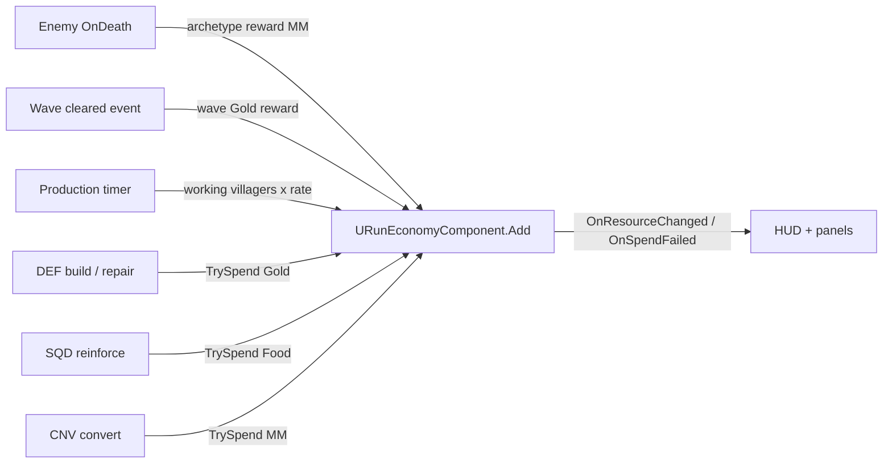
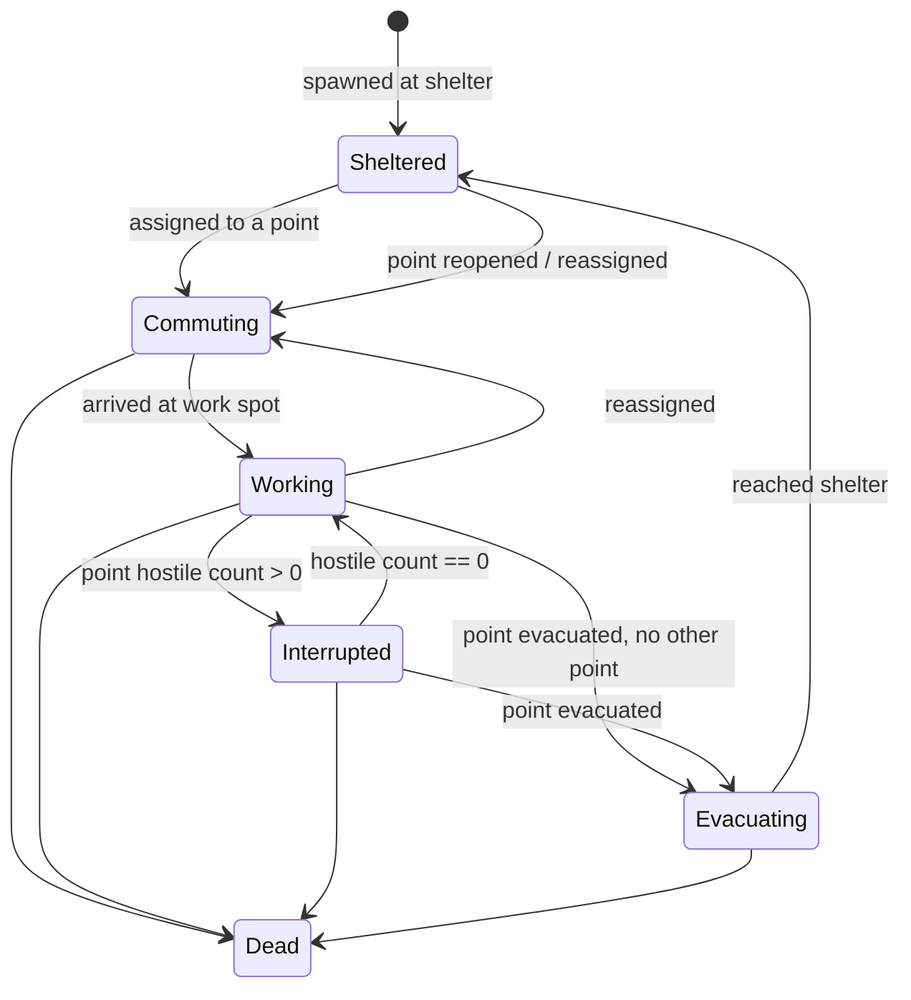

# Villager Economy (ECO): Technical Plan

> **Provisional — re-validate after G3.** Decision-level plan. Class names follow `00-foundation/technical-plan.md`; every path is a proposal. Re-check against the real RUN/DEF/ENM code from P3 before starting.

## 1. Technical Overview

The P3 single run resource (T-RUN-04) is replaced by `URunEconomyComponent` on `ARunGameState`: a small ledger keyed by `Resource.*` Gameplay Tags with `TrySpend` / `Add` and change delegates. Every existing earn and spend site moves to it (kills → MM, waves → Gold, build/repair → Gold).

Villagers are `AVillagerCharacter`s with a timer-driven C++ FSM (same pattern as soldiers/enemies, D-08). `UWorkforceComponent` on `ARunGameMode` owns the roster, the player's targets and priority, the evacuated set, and runs a pure allocation function whenever an input changes. One production timer pays out per working villager. `AResourcePoint` actors detect hostiles with an overlap volume (no Tick) and switch to Interrupted. Enemies treat villagers as lowest-priority Local Aggro targets and can be authored onto raid routes that end at a resource point.

## 2. Existing System Impact

| System | Impact |
|---|---|
| RUN (T-RUN-04) | Single resource field and its UI removed; starting resources and villager count move to run/site data as `FResourceAmount` lists. |
| DEF | `UStructureDefinition` cost becomes `FResourceAmount` (Gold); repair spends Gold. Build validation rejects resource point footprints. |
| ENM | Archetype reward becomes a `FResourceAmount` list (MM). Local Aggro candidate filter accepts `Unit.Villager` at lowest priority (extends T-ENM-08). Route objective may be an `AResourcePoint` with a continuation route (extends T-ENM-07). No anchor covers these; small edits with owner review inside ECO tasks. |
| DEF lane layer | `ALaneRoute` gets an optional objective actor + continuation route for raids (extends T-DEF-04). Owner review. |
| DIR | Wave data: Gold reward per wave, raid group entries. Wave-clear event pays the reward (T-DIR-02). |
| SQD | Reinforce entry point `ASquad::AddSoldiers(N)` if none exists (T-SQD-01 spawning reused). |
| ZON | Each resource point links one `ATacticalZone` of type `Zone.ResourceCamp`; no ZON code change. |
| BOS | Boss reward list (MM). |
| UXF | Resource counters replace the run resource counter; villager markers via the world marker component (T-UXF-04); `Feedback.Economy.*` rows. |
| FND | New tag root `Resource.*` (needs an entry in 00-foundation), leaf `Unit.Villager`; new domain folder `Economy/`; Primary Asset Type `ResourcePoint`. |

## 3. Proposed Architecture

| Item | Decision |
|---|---|
| Runtime owner and lifetime | `URunEconomyComponent` on `ARunGameState` (run lifetime, state data, UI reads it). `UWorkforceComponent` on `ARunGameMode` (run lifetime, rules: spawn, allocate, produce). Villagers and resource points are level/run actors; villagers spawned at run start, destroyed at run end. Matches D-07's "GameMode rules + GameState data" pattern. |
| Main UE types | `URunEconomyComponent`, `FResourceAmount`, `UWorkforceComponent`, `FWorkforceSnapshot` (mirrored on `ARunGameState`), `AResourcePoint`, `UResourcePointDefinition`, `AVillagerCharacter`, `AVillagerShelter` (marker near Core), `EVillagerState`. |
| Data ownership | Definitions read-only; ledger totals only in `URunEconomyComponent`; assignments only in `UWorkforceComponent`; villager HP in its `UHealthComponent`. |
| Communication | Spenders call `TrySpend` directly. Earners call `Add` (enemy death handler in `ARunGameMode`, wave-clear handler, production timer). Villager death → `UWorkforceComponent` (direct, villager knows its owner) → re-allocate. Resource point overlap → point state delegate → workforce component. UI binds to `OnResourceChanged` and `OnWorkforceChanged`. |
| C++ / Blueprint split | C++: ledger, allocation, production, villager FSM, point detection, raid objective hook. Blueprint: villager mesh/anim (work loops, cower, flee), point visuals, panel layout. |
| Asset references / loading | Villager BP hard-referenced by the workforce component class default (small). Point definitions hard refs (tiny). |
| AI / navigation impact | Villagers use `AAIController` + navmesh `MoveTo`, no crowd avoidance unless playtest shows clumping. Decision timer 0.25–0.5 s. Raid routes use the lane layer like normal routes. |
| UI impact | Resource HUD (3 counters), `WBP_WorkforcePanel` (jobs, priority, points, evacuate toggles, short-by-N), squad reinforce button, villager/zone world markers. Panel lives in build mode (`IMC_Build`) as a tab, so the cursor context already exists. |
| Save impact | None. Run-scoped; structs use tags and IDs (D-14) so mid-run save stays possible later. |
| Performance risks | Villager Character count + enemy cap; Local Aggro queries with more candidates; overlap events from swarms entering threat volumes. |
| Existing systems reused | Combat contract (`UHealthComponent`, team interface), enemy brain Local Aggro and route following, lane layer, build validation, squad spawning, Tactical Zone commands, world marker component, feedback subsystem, `UGameTuningSettings`. |
| New types proposed | Listed above; files in tasks. |
| Trade-offs | Tag-keyed ledger instead of three fixed ints: same size, lets CNV/DEF name a resource in data. Allocation as a pure function: easy to Spec, re-run on every change instead of incremental bookkeeping (roster ≤ ~12, cost negligible). Overlap volume per point instead of per-villager perception: one cheap check per zone. Workforce panel in build mode instead of a new mapping context: no new input context. |
| Verification | Automation Specs for ledger and allocation; Functional Tests for production, interruption, evacuation, raid; perf benchmark with villagers + enemy cap. |

## 4. Runtime Flow

### Earn and spend



### Villager FSM



### Allocation (pure, re-run on any input change)

```text
Allocate(alive villagers V, targets T[cat], priority order, points (active, not evacuated), current assignment A):
  keep A[v] if its point is still valid and its category still has room in T
  for cat in priority:
    need = T[cat] - kept(cat)
    for point in points of cat ordered by distance to shelter:
      while need > 0 and point has free slot and an unassigned villager exists:
        assign nearest unassigned villager; need--
  unassigned villagers -> Sheltered
  return assignment + short-by[cat]
```

## 5. State / Data

| Type | Fields (design level) |
|---|---|
| `FResourceAmount` | `ResourceTag` (`Resource.Food` / `Resource.Gold` / `Resource.MonsterMaterial`), `Amount` (int) |
| `URunEconomyComponent` | `Totals` (tag → int), `bClosed` (after resolve); `Add`, `CanAfford`, `TrySpend` (list), delegates |
| `UResourcePointDefinition` | `ResourceTag`, `RatePerWorker`, `MaxWorkers`, `ThreatRadius`, `RaidContinueDelay`, display name/icon |
| `AResourcePoint` | `Definition`, work spot components, threat volume, `LinkedZone` (`ATacticalZone`, `Zone.ResourceCamp`), `bActiveByDefault`, `ActiveChance` (§27.2), runtime: hostile count, workers present, state |
| `UWorkforceComponent` | roster, `Targets` (tag → int), `Priority` (tag array), `EvacuatedPoints`, `Assignments`; production timer handle |
| `FWorkforceSnapshot` | per category: target, assigned, working, short-by; per point: state, workers; totals: alive, sheltered |
| Run/site data additions | `StartingResources` (`FResourceAmount` list), `VillagerCount` |
| `UGameTuningSettings` additions | `ProductionInterval`, villager decision interval |
| Other features' data (edited) | `UEnemyArchetypeDefinition.Rewards`, `UWaveDefinition.ClearReward` + raid entries, `UStructureDefinition.Cost` / repair rate, `UBossDefinition.Rewards` |

## 6. Main Implementation Areas

| Area | Tasks |
|---|---|
| Ledger + migration off the run resource | T-ECO-01 |
| Earn sources rewiring | T-ECO-02 |
| Resource points + production | T-ECO-03 |
| Villager character + FSM | T-ECO-04 |
| Allocation (targets, priority) | T-ECO-05 |
| Evacuate / protect | T-ECO-06 |
| Enemy interaction (aggro, raids) | T-ECO-07 |
| Food reinforce | T-ECO-08 |
| Workforce UI + HUD | T-ECO-09 |
| Feedback rows + audio | T-ECO-10 |
| Perf + tuning | T-ECO-11 |
| QA + gate playtest | T-ECO-12 |

## 7. Error and Edge-Case Handling

| Failure | Response |
|---|---|
| Spend without funds | `TrySpend` returns false + missing amount; caller shows reason; nothing deducted (atomic for multi-resource costs) |
| Add after resolve | Ledger closed; ignored and logged |
| Villager stuck | No progress for N s → repath; again → if not rendered recently, teleport to destination (NEW-ECO-07) |
| No valid point for a category | Villagers shelter; snapshot short-by shows it |
| Raid objective point inactive or empty | Raid skips straight to continuation route |
| Villager killed mid-allocation | Allocation runs on the next frame from current roster (deferred, single pass) |
| Resource point without linked zone | Editor validation warning; runtime still works, no protect shortcut |

## 8. Testing Strategy

- Automation Spec `RunEconomy.spec.cpp`: add/spend, multi-resource atomic spend, no negatives, closed ledger.
- Automation Spec `WorkforceAllocation.spec.cpp`: targets, priority when short, keep stable assignments, evacuated exclusion, slot caps.
- Functional Tests in `FT_Workforce` map: production rate; interruption on hostile entry/exit; evacuate → shelter; reopen; villager death reduces income; raid route → point → continuation.
- Input audit (AC-ECO-11): list every action in every mapping context; none targets a villager.
- Perf: benchmark map with VS villager count + DEF enemy cap.

## 9. Performance Risks

| Risk | Mitigation |
|---|---|
| Villager Characters cost (movement, anim) | Cap via data; anim/movement LOD; `MoveTo` without crowd; measure in T-ECO-11 |
| Local Aggro candidates grow | Villagers only added to candidate sets near resource points/routes; reuse ENM cached spatial query |
| Swarm overlap spam on threat volumes | Count changes only; state switch only on 0↔1 transitions |
| Frequent re-allocation | Deferred to one pass per frame; roster small |

## 10. Dependencies and Risks

| Item | Note |
|---|---|
| Cross-feature edits with no anchor | ENM Local Aggro accepting villagers (T-ENM-08) and non-Core route objective with continuation (T-ENM-07, §14.2 "objective đặc biệt"); DEF lane route objective/continuation fields (T-DEF-04); SQD `AddSoldiers` if missing (T-SQD-01). Done inside T-ECO-07 / T-ECO-08 with owner review. |
| Rebalancing | Moving build currency from kills to mining/waves changes P3 pacing; T-ECO-11 retunes with G3 notes. |
| Squad reinforcement may already exist | §15.4 Rally Point "reinforce faster" implies SQD/ZON may have reinforcement. If yes, T-ECO-08 only adds the Food cost; if no, it adds a minimal intermission reinforce. |
| New tag root `Resource.*` | Needs a line in `00-foundation/technical-plan.md` (lead). |
| CHANGE REQUEST | None. D-05, D-07, D-08 fit as written. |

## 11. Requirement Coverage

| Requirement | Technical Area | Notes |
|---|---|---|
| R-ECO-01, R-ECO-10, R-ECO-11 | `URunEconomyComponent`, `FResourceAmount` | T-ECO-01 |
| R-ECO-02, R-ECO-04 (mining), R-ECO-27 | `AResourcePoint` + production timer | T-ECO-03 |
| R-ECO-03 | Food reinforce | T-ECO-08 |
| R-ECO-04 (reward), R-ECO-06, R-ECO-09 | Earn rewiring (kills, waves, boss) | T-ECO-02 |
| R-ECO-05 | DEF cost/repair to Gold | T-ECO-01 |
| R-ECO-07 | Removal of single resource | T-ECO-01 |
| R-ECO-08 | Run/site starting resources | T-ECO-01 |
| R-ECO-12..R-ECO-17 | `AVillagerCharacter` FSM, spawn, stuck handling | T-ECO-04 |
| R-ECO-18..R-ECO-22, R-ECO-25 | `UWorkforceComponent` allocation | T-ECO-05 |
| R-ECO-23, R-ECO-24 | Evacuate set; linked Resource Camp zone | T-ECO-06 |
| R-ECO-26, R-ECO-28 | Threat volume → Interrupted | T-ECO-03, T-ECO-04 |
| R-ECO-29, R-ECO-30 | ENM aggro + raid objective | T-ECO-07 |
| R-ECO-31 | `ActiveChance` roll at run start | T-ECO-03 |
| R-ECO-32 | WLD map contract | T-WLD-10 |
| R-ECO-33 | Build validation excludes points | T-ECO-03 |
| R-ECO-19 (no micro) | Input audit | T-ECO-12 |
