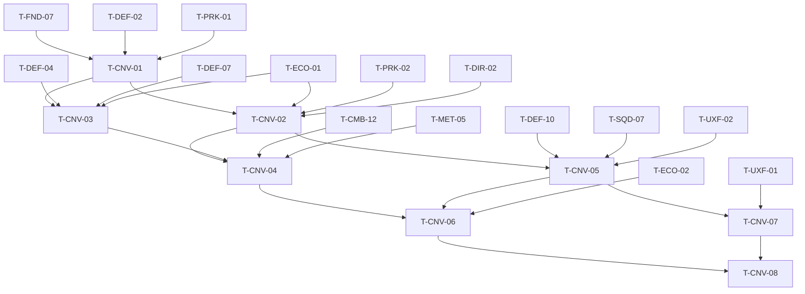

# Conversion Buildings (CNV): Tasks

> **Provisional — re-validate after G3.** No task here starts before G3 passes and before T-ECO-01 exists. Re-read the G3 notes, update the spec and re-plan before starting. Tasks are coarser than prototype tasks (~1–3 days each).

## 1. Summary

One conversion building flow end to end: recipe/building data, the conversion manager (validate, spend MM, apply/expire temporary effects through PRK), the Utility building with its placement rule, the menu, the three channel hooks, VS content, feedback and QA. Spec: [spec.md](spec.md). Plan: [technical-plan.md](technical-plan.md).

## 2. Task Overview

| ID | Task | Type | Phase | Priority | Dependencies | Status |
|---|---|---|---|---|---|---|
| T-CNV-01 | `UConversionRecipeDefinition` + `UConversionBuildingDefinition` + validation | TOOLS | VS | Must | T-FND-07, T-DEF-02, T-PRK-01 | Todo |
| T-CNV-02 | `UConversionManagerComponent`: validate, spend, effect source, expiry; PRK remove-by-source | GAMEPLAY | VS | Must | T-CNV-01, T-ECO-01, T-PRK-01, T-PRK-02, T-DIR-02 | Todo |
| T-CNV-03 | `AConversionBuilding` (Utility) + lane-corridor placement rule + destruction/rebuild | GAMEPLAY | VS | Must | T-CNV-01, T-DEF-04, T-DEF-07, T-ECO-01 | Todo |
| T-CNV-04 | Interact + conversion menu (MET unlock filter) | UI | VS | Must | T-CNV-02, T-CNV-03, T-CMB-12, T-MET-05 | Todo |
| T-CNV-05 | Channel hooks: Hero buff, Infantry enchant, Ballista pierce + HUD strip | GAMEPLAY | VS | Must | T-CNV-02, T-DEF-10, T-SQD-07, T-UXF-02 | Todo |
| T-CNV-06 | VS content: one building, three recipes, cost tuning | DESIGN | VS | Must | T-CNV-04, T-CNV-05, T-ECO-02 | Todo |
| T-CNV-07 | `Feedback.Conversion.*` rows + aura VFX + channel stings | VFX | VS | Should | T-CNV-05, T-UXF-01 | Todo |
| T-CNV-08 | QA: Functional Tests + VS gate playtest (trade-off) | QA | VS | Must | T-CNV-06, T-CNV-07 | Todo |

## 3. Detailed Tasks

## VS

### T-CNV-01 — Recipe and building definitions

**Type** TOOLS · **Phase** VS

**Objective** Conversion content is data, validated against the GDD limits.

**Related Requirements** R-CNV-02, R-CNV-04, R-CNV-05, R-CNV-07, R-CNV-09

**Dependencies** T-FND-07, T-DEF-02, T-PRK-01

**Implementation Notes**
- [ ] `UConversionRecipeDefinition` (fields in technical plan §5), Primary Asset Type `ConversionRecipe`.
- [ ] `UConversionBuildingDefinition : UStructureDefinition` with `Recipes`.
- [ ] `IsDataValid`: exactly one channel, cost > 0, ≥1 effect, no elemental state effect, ≤3 recipes per building, building role = `Structure.Role.Utility`.

**Expected Files / Assets** `Source/<Game>/Conversion/ConversionRecipeDefinition.h/.cpp`, `ConversionBuildingDefinition.h/.cpp`; `Content/<Game>/Conversion/DA_Recipe_Sample`

**Test Case** Building with 4 recipes → validation error; recipe with an elemental state effect → error.

**Acceptance Criteria**
- [ ] All validation rules produce clear messages.
- [ ] Recipes have stable Primary Asset IDs (for MET unlocks).

**Verification** Editor Data Validation run.

### T-CNV-02 — Conversion manager

**Type** GAMEPLAY · **Phase** VS

**Objective** A conversion either fully happens (MM spent, effect active, expiry scheduled) or is refused with a reason and changes nothing.

**Related Requirements** R-CNV-03, R-CNV-10..R-CNV-13, R-CNV-20, R-CNV-21, AC-CNV-02, AC-CNV-04, AC-CNV-09, AC-CNV-10

**Dependencies** T-CNV-01, T-ECO-01, T-PRK-01, T-PRK-02, T-DIR-02

**Implementation Notes**
- [ ] `UConversionManagerComponent` on `ARunPlayerState`: `TryConvert(RecipeId, Building) -> EConversionRefusal`, validation order from technical plan §4.
- [ ] PRK extension (owner review): `AddEffectSource(SourceId, Effects, Target)` / `RemoveEffectSource(SourceId)`.
- [ ] Expiry: on `OnWaveEnded` compare `>= ExpiryWaveIndex`; seconds-based via game-time timer; remove all at resolve.
- [ ] Refund in the same call if effect registration fails (data bug path).

**Expected Files / Assets** `Source/<Game>/Conversion/ConversionManagerComponent.h/.cpp`; PRK edit; `Tests/ConversionRules.spec.cpp`

**Test Case** MM 20, recipe cost 10, duration 1 wave: convert → MM 10, active; convert again → `AlreadyActive`; wave ends → inactive; convert → MM 0.

**Acceptance Criteria**
- [ ] No refusal path spends MM.
- [ ] Effects removed at resolve.

**Verification** Automation Spec `ConversionRules` with fake ledger and fake effect pipeline.

### T-CNV-03 — Utility building, placement rule, destruction

**Type** GAMEPLAY · **Phase** VS

**Objective** The Conversion Building is a real Utility structure: built off-lane with Gold, attackable, rebuildable.

**Related Requirements** R-CNV-16..R-CNV-20, AC-CNV-07, AC-CNV-08

**Dependencies** T-CNV-01, T-DEF-04, T-DEF-07, T-ECO-01

**Implementation Notes**
- [ ] `AConversionBuilding : AStructureBase`, `IInteractable`, role Utility, Gold cost/repair from definition.
- [ ] Placement validation (DEF owner review): `Structure.Role.Utility` footprint overlapping any lane corridor cell → refused with message (NEW-CNV-04 default).
- [ ] On death: interact prompt "destroyed"; active effects untouched; rebuild through the normal build flow.

**Expected Files / Assets** `Source/<Game>/Conversion/ConversionBuilding.h/.cpp`; DEF validation edit; `BP_Structure_ConversionBuilding`

**Test Case** Ghost on a lane corridor → red with "Not on a lane"; valid Utility cell → placed, Gold deducted; enemy kills it → prompt "destroyed".

**Acceptance Criteria**
- [ ] Building never becomes a Path Obstacle on the default route.
- [ ] Destruction does not end active effects.

**Verification** Functional Test `FT_Conversion_Placement`, `FT_Conversion_Destroyed`.

### T-CNV-04 — Interact and conversion menu

**Type** UI · **Phase** VS

**Objective** The player reads and makes the conversion choice in a few seconds.

**Related Requirements** R-CNV-07, R-CNV-15, R-CNV-21, R-CNV-22, AC-CNV-01, AC-CNV-04

**Dependencies** T-CNV-02, T-CNV-03, T-CMB-12, T-MET-05

**Implementation Notes**
- [ ] Interact opens `WBP_ConversionMenu`; time keeps running; closes on building death, Hero death, leaving range.
- [ ] Cards (≤3): channel icon/color, name, one effect line, target, duration, cost, disabled reason.
- [ ] Filter recipes with MET `IsContentUnlocked`; hide Army recipes whose squad type is not in the run roster.

**Expected Files / Assets** `Content/<Game>/UI/Conversion/WBP_ConversionMenu`, `WBP_ConversionCard`

**Test Case** Locked recipe absent; with 5 MM all cards show "Need N MM"; walk out of range → menu closes.

**Acceptance Criteria**
- [ ] Every disabled card shows a reason.
- [ ] Widget holds no gameplay state.

**Verification** PIE manual; widget review.

### T-CNV-05 — Channel hooks and HUD strip

**Type** GAMEPLAY · **Phase** VS

**Objective** Each channel's VS effect visibly changes combat while active.

**Related Requirements** R-CNV-04, R-CNV-12, R-CNV-14, AC-CNV-05, AC-CNV-06

**Dependencies** T-CNV-02, T-DEF-10, T-SQD-07, T-UXF-02

**Implementation Notes**
- [ ] Hero: timed `Stat.Hero.*` modifier (no inventory, no use input).
- [ ] Army: `Stat.Army.Infantry.Damage` / `PoiseDamage` modifier read by soldier hits (verify SQD reads PRK modifiers; add the read if missing, owner review).
- [ ] Tower: `Stat.Tower.Ballista.PierceCount` read by `UTowerWeaponComponent` at fire time (reuse the §23.2 perk support if present); in-flight bolts keep their value.
- [ ] `WBP_ActiveConversions` HUD strip with time/waves left.

**Expected Files / Assets** small edits in `Structures/TowerWeaponComponent`, `Army/` hit code if needed; `Content/<Game>/UI/Conversion/WBP_ActiveConversions`

**Test Case** Two dummies in a line: Ballista bolt hits 1; buy Piercing Ammo (pierce 2) → hits 2; after expiry → 1.

**Acceptance Criteria**
- [ ] Each effect shows in the combat/stat debug view while active.
- [ ] No elemental state applied by any channel.

**Verification** Functional Test `FT_Conversion_Pierce`, `FT_Conversion_Enchant`.

### T-CNV-06 — VS content and cost tuning

**Type** DESIGN · **Phase** VS

**Objective** The §17.3 decision exists in the VS run with real trade-offs.

**Related Requirements** R-CNV-06, R-CNV-08, R-CNV-23, AC-CNV-03

**Dependencies** T-CNV-04, T-CNV-05, T-ECO-02

**Implementation Notes**
- [ ] `DA_Structure_ConversionBuilding_VS` with three recipes: `DA_Recipe_CombatPotion` (Hero), `DA_Recipe_InfantryWeaponEnchant` (Army), `DA_Recipe_BallistaPiercingAmmo` (Tower).
- [ ] Write `SynergyNote` for each (state created/exploited, layer helped).
- [ ] Tune costs/durations against ECO MM income so ~20 MM at the 10:00 beat buys one or two options.
- [ ] Place a valid Utility build cell in the VS Siege Site away from lanes.

**Expected Files / Assets** `Content/<Game>/Conversion/DA_*`; VS Siege Site level edit

**Test Case** Scripted run to the 10:00 beat (or cheat MM to 20) → at most two options affordable.

**Acceptance Criteria**
- [ ] Each recipe has a synergy note.
- [ ] Values in data only.

**Verification** PIE run; data review.

### T-CNV-07 — Conversion feedback

**Type** VFX · **Phase** VS

**Objective** Boosted units and conversion states are readable without the HUD.

**Related Requirements** Spec §14

**Dependencies** T-CNV-05, T-UXF-01

**Implementation Notes**
- [ ] `DT_Feedback` rows for every `Feedback.Conversion.*` tag.
- [ ] Aura/glow per channel color on affected actors (Hero, Infantry weapons, Ballista bolts), LOD'd for full squads.
- [ ] Three distinct channel stings; throttled building-attacked alarm.

**Expected Files / Assets** `NS_Conversion_*`, `SFX_Conversion_*` placeholders; DT rows

**Test Case** Buy Infantry enchant with 3 full squads on screen → glow visible, frame time within budget.

**Acceptance Criteria**
- [ ] All spec §14 rows present.
- [ ] Channel colors do not reuse Marked / Armor Broken / Staggered colors.

**Verification** T-UXF-09 feedback audit for `Feedback.Conversion.*`; Insights check with full squads.

### T-CNV-08 — QA: Functional Tests and VS gate playtest

**Type** QA · **Phase** VS

**Objective** Prove the conversion rules and check that the decision is a real Hero / Army / Tower trade-off.

**Related Requirements** R-CNV-01 (the conversion choice is a real trade-off), AC-CNV-01..AC-CNV-11; master plan Section 3 "VS Gate" checklist

**Dependencies** T-CNV-06, T-CNV-07

**Implementation Notes**
- [ ] Run `ConversionRules` Spec and all `FT_Conversion_*` tests.
- [ ] Playtest 3+ runs: record which option each tester picked and why; check none affords all three routinely.
- [ ] KEEP / CHANGE / DELETE per recipe; answer or re-raise NEW-CNV-01..05.

**Expected Files / Assets** `ai/game/playtests/vs-cnv-gate.md`

**Test Case** Two testers, same seed → different picks with stated reasons (target outcome).

**Acceptance Criteria**
- [ ] All AC-CNV rows checked with evidence.
- [ ] spec.md open questions updated.

**Verification** Report reviewed at the VS Gate meeting.

## 4. Dependency Graph

## 5. Integration / Regression Checklist

- [ ] Perk effects still apply and stack as before (PRK tests green after the remove-by-source change).
- [ ] Ballista damage/targeting unchanged when no pierce modifier is active.
- [ ] Build placement for Blockers and Combat Towers unchanged by the Utility rule.
- [ ] ECO ledger totals match after conversions (no double spend).
- [ ] Full VS run end-to-end with at least one conversion.

## 6. Final Definition of Done

- All tasks Done with verification recorded; all `AC-CNV-*` pass.
- Implemented + integrated + verified in PIE and packaged Development build on the reference PC.
- No new warnings/errors; costs, durations and effect values in data.
