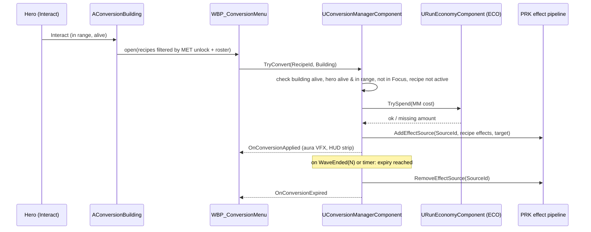

# Conversion Buildings (CNV): Technical Plan

> **Provisional — re-validate after G3.** Decision-level plan. Class names follow `00-foundation/technical-plan.md`; every path is a proposal. Re-check against the real DEF, PRK and ECO code before starting.

## 1. Technical Overview

`AConversionBuilding` is a Blueprint-configured child of `AStructureBase` with role `Structure.Role.Utility` and a `UConversionBuildingDefinition` (a `UStructureDefinition` subclass that adds a recipe list). The Hero's Interact opens a menu listing the building's unlocked recipes. Buying goes through `UConversionManagerComponent` on `ARunPlayerState`, which validates, spends MM through the ECO ledger, and registers the recipe's effects as a temporary effect source in the PRK pipeline. Effects reuse `UPerkEffect` classes and the `Stat.*` stat modifier query, so CNV writes almost no effect code. Expiry listens to wave lifecycle events (or a game-time timer for second-based durations) and removes the source.

## 2. Existing System Impact

| System | Impact |
|---|---|
| DEF | New Utility structure child; placement validation rejects lane corridor cells for `Structure.Role.Utility` (T-DEF-07 / T-DEF-04 corridor data). Ballista weapon reads a `Stat.Tower.Ballista.PierceCount` modifier when firing (T-DEF-09/T-DEF-10). If the §23.2 piercing perk already added this, reuse it. |
| PRK | Needs "add/remove an effect source by ID" so temporary sources can be removed (T-PRK-01 has add; remove is not in any anchor). Small extension, owner review. |
| ECO | MM spend via `URunEconomyComponent::TrySpend`; Gold build/repair via structure cost. |
| SQD | Squad damage/poise reads `Stat.Army.<SquadType>.*` modifiers (expected from T-SQD-07 + T-PRK-02 consumers; verify). |
| CMB | Interact (T-CMB-12); Hero stats read `Stat.Hero.*` modifiers (expected via PRK consumers; verify). |
| MET | `IsContentUnlocked(RecipeId)` filters the menu. |
| UXF | Menu widget, HUD active-effect strip, `Feedback.Conversion.*` rows, aura VFX hooks on affected actors. |
| FND | Primary Asset Type `ConversionRecipe`; domain folder `Conversion/` (extends the D-02 list). |

## 3. Proposed Architecture

| Item | Decision |
|---|---|
| Runtime owner and lifetime | `UConversionManagerComponent` on `ARunPlayerState` (run lifetime; survives Hero death, matching D-07 Player State). `AConversionBuilding` is a placed/built actor with structure lifetime. |
| Main UE types | `UConversionRecipeDefinition : UPrimaryDataAsset`, `UConversionBuildingDefinition : UStructureDefinition`, `AConversionBuilding : AStructureBase` (implements `IInteractable`), `UConversionManagerComponent`, `FActiveConversion` (recipe ID, effect source ID, expiry wave index or game time), `EConversionRefusal`. |
| Data ownership | Recipes and building definitions read-only. Active conversions only in the manager. MM only in the ECO ledger. Modifiers only in the PRK pipeline. |
| Communication | Building Interact → opens menu with its definition → menu calls `Manager.TryConvert(RecipeId, Building)` → manager calls ECO `TrySpend`, PRK `AddEffectSource`, broadcasts `OnConversionApplied`. Wave end event → manager removes expired sources. Building `OnDeath` → menu availability; active effects untouched. |
| C++ / Blueprint split | C++: validation, spend, effect source registration/expiry, placement rule, pierce stat read. Blueprint: building mesh/visuals, menu layout, aura VFX on affected actors (bound to `OnConversionApplied` / `Expired`). |
| Asset references / loading | Building definition hard-references its ≤3 recipes (tiny). Recipe icons soft. |
| AI / navigation impact | Building has a nav modifier footprint like any structure but is never on a lane corridor, so it never becomes a Path Obstacle by design. Enemies may attack it via Local Aggro (existing rule). |
| UI impact | `WBP_ConversionMenu` (≤3 cards), HUD strip `WBP_ActiveConversions`, interact prompt. |
| Save impact | None (run-scoped). Active conversions are plain structs with IDs (D-14). |
| Performance risks | Negligible: work only on purchase/expiry. Aura VFX on many soldiers: use one cheap Niagara per squad anchor or per soldier with LOD (measure). |
| Existing systems reused | `AStructureBase`, build placement + validation, `UHealthComponent`, Interact, PRK effects + stat modifier query, ECO ledger, DIR wave events, MET unlock query, UXF feedback. |
| New types proposed | Listed above; files in tasks. |
| Trade-offs | Reusing `UPerkEffect` instead of a conversion effect system: no duplicate effect code, but PRK needs a remove-by-source API. Recipe target by type instead of by actor: no micro, effects naturally cover reinforcements and rebuilt towers. One building in VS: matches the one-building art budget (production plan) while still offering all three channels. |
| Verification | Automation Spec for `TryConvert` rules and expiry; Functional Tests for placement, destruction, piercing, enchant; playtest for trade-off. |

## 4. Runtime Flow

Validation order matters (no spend before every non-cost check passes): building alive → Hero alive, in range, not in Focus/Spirit → recipe unlocked and in this building → recipe not active → target type present in run roster (army) → `TrySpend`.

## 5. State / Data

| Type | Fields (design level) |
|---|---|
| `UConversionRecipeDefinition` | `Channel` (`ECombatLayer`: Hero / Army / Tower), `Cost` (`FResourceAmount` list), `TargetKind` (Hero / SquadType / StructureType) + `TargetTag` or `TargetStructure` (ID), `Effects` (instanced `UPerkEffect` array), `DurationWaves` / `DurationSeconds` (0 = run), `RequiredUnlock` (optional, MET), `DisplayName`, `EffectLine`, `Icon` (soft), `SynergyNote` (text, for R-CNV-08 review). `IsDataValid`: one channel, cost > 0, at least one effect, no effect that applies an elemental state (none exist; §10.2 DEFERRED). |
| `UConversionBuildingDefinition` | `UStructureDefinition` fields + `Recipes` (≤3, validated) |
| `FActiveConversion` | `RecipeId`, `SourceId`, `ExpiryWaveIndex` or `ExpiryGameTime` |
| Stat tags used (leaf tags) | `Stat.Hero.*` (e.g. stamina regen, damage taken), `Stat.Army.Infantry.Damage`, `Stat.Army.Infantry.PoiseDamage`, `Stat.Tower.Ballista.PierceCount` (final names follow PRK's tag list) |

## 6. Main Implementation Areas

| Area | Tasks |
|---|---|
| Definitions | T-CNV-01 |
| Manager: validation, spend, effect source, expiry | T-CNV-02 |
| Utility building + placement rule + destruction | T-CNV-03 |
| Interact + menu | T-CNV-04 |
| Channel hooks (Hero, Army, Tower pierce) + HUD strip | T-CNV-05 |
| VS content | T-CNV-06 |
| Feedback | T-CNV-07 |
| QA + gate playtest | T-CNV-08 |

## 7. Error and Edge-Case Handling

| Failure | Response |
|---|---|
| Any validation fails | Return `EConversionRefusal`; menu shows reason; no spend |
| `TrySpend` fails after other checks passed | Refusal "Need N MM"; nothing applied |
| `AddEffectSource` fails (bad data) | Refund via ECO `Add` in the same call, log error; caught earlier by `IsDataValid` |
| Building destroyed with menu open | Menu closes on building `OnDeath` |
| Run resolves | Manager removes all sources; ledger closed |
| Wave index skipped (cheat skip phase) | Expiry compares `>=`, never misses |

## 8. Testing Strategy

- Automation Spec `ConversionRules.spec.cpp`: validation order, no spend on refusal, one-instance rule, expiry by wave and by time, resolve cleanup (manager with fake ledger and fake effect pipeline).
- Functional Tests in `FT_Conversion` map: lane-corridor placement refused; Utility cell placement accepted; enemy destroys building → menu unavailable, effects remain; Ballista pierce hits 2 dummies in a line while active, 1 after expiry; Infantry enchant raises hit damage (combat debug).
- Playtest: §17.3 trade-off check (AC-CNV-11).

## 9. Performance Risks

| Risk | Mitigation |
|---|---|
| Aura VFX on every boosted soldier | One effect per squad or LOD'd per-soldier effect; measure with full squads |
| Stat query cost per hit | Uses PRK's cached modifier query; no CNV-side per-hit work |

## 10. Dependencies and Risks

| Item | Note |
|---|---|
| PRK remove-by-source API | Not in any anchor (T-PRK-01 covers add). Added inside T-CNV-02 with owner review. |
| Ballista pierce support | May already exist for the §23.2 "Ballista shot N has piercing" perk (T-PRK-06 content). If not, T-CNV-05 adds the `PierceCount` stat read in `UTowerWeaponComponent` (owner review). |
| Stat consumers for Hero/Army | CNV assumes Hero and squad damage read `Stat.*` modifiers via T-PRK-02. Verify at re-validation; if a consumer is missing, add it in T-CNV-05. |
| Lane corridor data for placement | Needs the corridor grid from T-DEF-04 to be queryable at placement time. |
| One building vs three (NEW-CNV-05) | Content change only; code supports N buildings. |
| CHANGE REQUEST | None. D-04 (no GAS) and D-06 fit as written. |

## 11. Requirement Coverage

| Requirement | Technical Area | Notes |
|---|---|---|
| R-CNV-01, R-CNV-06 | Cost tuning + playtest | T-CNV-06, T-CNV-08 |
| R-CNV-02, R-CNV-09 | One-step recipe data, effect reuse | T-CNV-01 |
| R-CNV-03 | ECO `TrySpend` | T-CNV-02 |
| R-CNV-04 | `Channel` field | T-CNV-01 |
| R-CNV-05 | `IsDataValid` rejects elemental effects | T-CNV-01 |
| R-CNV-07 | Building recipe list ≤3 | T-CNV-01 |
| R-CNV-08 | `SynergyNote` + review | T-CNV-06, T-CNV-08 |
| R-CNV-10, R-CNV-12 | Target by type through stat modifiers | T-CNV-02, T-CNV-05 |
| R-CNV-11 | Expiry by wave / time | T-CNV-02 |
| R-CNV-13 | One-instance rule | T-CNV-02 |
| R-CNV-14 | Instant Hero buffs | T-CNV-05 |
| R-CNV-15 | MET unlock filter | T-CNV-04 |
| R-CNV-16..R-CNV-20 | `AConversionBuilding`, placement rule, destruction | T-CNV-03 |
| R-CNV-21, R-CNV-22 | Validation (Hero alive, range, not Focus); non-pausing menu | T-CNV-02, T-CNV-04 |
| R-CNV-23 | VS content | T-CNV-06 |
