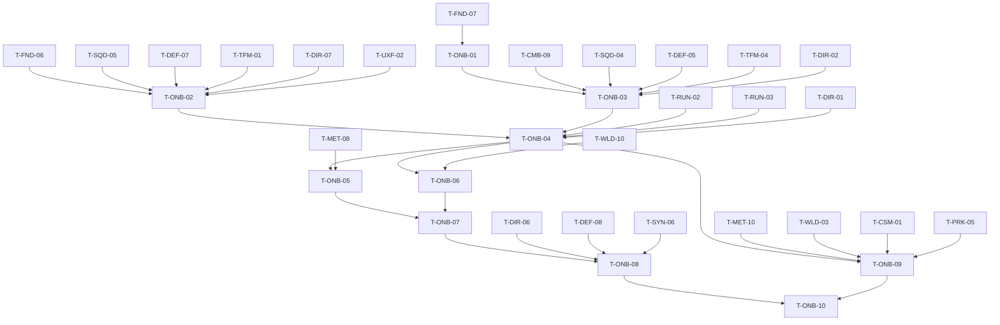

# Onboarding / Tutorial (ONB): Tasks

> **Provisional — re-validate after G3.** No task here starts before G3 passes. Author tutorial content (T-ONB-07, T-ONB-08) only after the taught systems' VS tuning has settled. Tasks are coarser than prototype tasks (~1–3 days each).

## 1. Summary

A seven-stage tutorial in the §34.3 order, built as a scripted Siege Site variant on the real run stack: definition data, feature gates, objective watchers bound to real system events, a stage runner, prompt UI, the tutorial level, stage content, skip/completion/replay, first-exposure hints, and a new-player playtest. Spec: [spec.md](spec.md). Plan: [technical-plan.md](technical-plan.md).

## 2. Task Overview

| ID | Task | Type | Phase | Priority | Dependencies | Status |
|---|---|---|---|---|---|---|
| T-ONB-01 | `UTutorialDefinition` + stage/objective data + §34.3 order validation | TOOLS | VS | Must | T-FND-07 | Todo |
| T-ONB-02 | `UFeatureGateComponent` + gate checks at feature entry points + HUD visibility | GAMEPLAY | VS | Must | T-FND-06, T-SQD-05, T-DEF-07, T-TFM-01, T-DIR-07, T-UXF-02 | Todo |
| T-ONB-03 | Objective watchers bound to owner delegates | GAMEPLAY | VS | Must | T-ONB-01, T-CMB-09, T-SQD-04, T-DEF-05, T-DEF-07, T-TFM-04, T-DIR-02 | Todo |
| T-ONB-04 | `UTutorialComponent` stage runner + RUN hooks (manual steps, Core-destroyed restart) | GAMEPLAY | VS | Must | T-ONB-02, T-ONB-03, T-RUN-02, T-RUN-03, T-DIR-01 | Todo |
| T-ONB-05 | Prompt UI with binding glyphs + pause entries (restart/skip stage, skip tutorial) | UI | VS | Must | T-ONB-04, T-MET-08, T-UXF-02 | Todo |
| T-ONB-06 | `L_Tutorial_SiegeSite` + `DA_Run_Tutorial` + tutorial waves and enemy variants | DESIGN | VS | Must | T-ONB-04, T-WLD-10 | Todo |
| T-ONB-07 | Stage content 1–3 (combat, one squad, one tower) | DESIGN | VS | Must | T-ONB-05, T-ONB-06 | Todo |
| T-ONB-08 | Stage content 4–7 (forecast, Focus, blocking/path, combine) | DESIGN | VS | Must | T-ONB-07, T-DIR-06, T-DEF-08, T-SYN-06 | Todo |
| T-ONB-09 | Entry / skip / completion / replay + first-exposure hints | GAMEPLAY | VS | Must | T-ONB-04, T-MET-04, T-MET-10, T-WLD-03, T-CSM-01, T-PRK-05 | Todo |
| T-ONB-10 | QA: per-stage Functional Tests, gate audit, new-player playtest (VS gate) | QA | VS | Must | T-ONB-08, T-ONB-09 | Todo |

## 3. Detailed Tasks

## VS

### T-ONB-01 — Tutorial definition and validation

**Type** TOOLS · **Phase** VS

**Objective** The tutorial is data, and data validation enforces the §34.3 order and the one-system-per-stage rule.

**Related Requirements** R-ONB-01, R-ONB-02, R-ONB-04, AC-ONB-02

**Dependencies** T-FND-07

**Implementation Notes**
- [ ] `UTutorialDefinition`, `FTutorialStage`, `FTutorialObjective`, `ETutorialTopic`, `ETutorialObjectiveType` (technical plan §5); Primary Asset Type `Tutorial`.
- [ ] Tag root `Tutorial.Gate.*` with the leaves in technical plan §5.
- [ ] `IsDataValid`: 7 stages in exact §34.3 order; ≤1 `GateToOpen` per stage; objective parameters valid.

**Expected Files / Assets** `Source/<Game>/Tutorial/TutorialDefinition.h/.cpp`, `Tests/TutorialDefinition.spec.cpp`; `Content/<Game>/Tutorial/DA_Tutorial_Main` (skeleton)

**Test Case** Swap stages 3 and 4 → validation error naming the expected topic; stage opening 2 gates → error.

**Acceptance Criteria**
- [ ] Validation errors name stage index and rule.
- [ ] Skeleton asset with 7 empty stages validates.

**Verification** Automation Spec `TutorialDefinition`; editor Data Validation.

### T-ONB-02 — Feature gates

**Type** GAMEPLAY · **Phase** VS

**Objective** Untaught systems are disabled and hidden in the tutorial, with zero effect on normal play.

**Related Requirements** R-ONB-02, R-ONB-03, AC-ONB-03, AC-ONB-10

**Dependencies** T-FND-06, T-SQD-05, T-DEF-07, T-TFM-01, T-DIR-07, T-UXF-02

**Implementation Notes**
- [ ] `UFeatureGateComponent` on `AHeroPlayerController`: closed-gate container, `IsGateOpen(Tag)`, `SetGateOpen`, `OnGatesChanged`. Empty = all open.
- [ ] One check per entry point (owner review): Command Wheel open (SQD), build mode enter (DEF), Focus start (TFM), forecast panel show (DIR), workforce panel (ECO, if present), conversion interact (CNV, if present), perk choice UI (PRK).
- [ ] HUD widgets for these features bind visibility to `OnGatesChanged`.
- [ ] Run start in non-tutorial maps asserts the container is empty (log + clear).

**Expected Files / Assets** `Source/<Game>/Tutorial/FeatureGateComponent.h/.cpp`; one-line edits in SQD/DEF/TFM/DIR/ECO/CNV/PRK entry points; HUD widget bindings

**Test Case** Close `Tutorial.Gate.CommandWheel` via cheat in `L_SiegeSite_Proto` → wheel key does nothing, squad HUD hidden; open → works.

**Acceptance Criteria**
- [ ] With an empty container, all prototype Functional Tests still pass.
- [ ] Each gate blocks only its own feature.

**Verification** Gate audit checklist in PIE; prototype regression test run.

### T-ONB-03 — Objective watchers

**Type** GAMEPLAY · **Phase** VS

**Objective** Tutorial objectives and hints are detected from the real systems' events.

**Related Requirements** R-ONB-04, R-ONB-14, AC-ONB-04, AC-ONB-10

**Dependencies** T-ONB-01, T-CMB-09, T-SQD-04, T-DEF-05, T-DEF-07, T-TFM-04, T-DIR-02

**Implementation Notes**
- [ ] `FTutorialObjectiveWatcher`: per `ETutorialObjectiveType`, bind the owner delegate (hero combat component, command component, placement, lane layer route events, Focus component, `ARunGameState` wave events), filter by parameter, count, unbind on stage end.
- [ ] Missing delegates (e.g. parry success, minimum-break resolved, order issued in Focus) added as `BlueprintAssignable` multicasts in the owner component (owner review).
- [ ] Late binding when the owner actor spawns after stage start.

**Expected Files / Assets** `Source/<Game>/Tutorial/TutorialObjectiveWatcher.h/.cpp`, `Tests/TutorialWatcher.spec.cpp`; small delegate additions in owner components

**Test Case** Watcher `SquadOrder Command.Guard x1` → issue Follow (no progress), then Guard (complete).

**Acceptance Criteria**
- [ ] Every objective type has a working binding in a test map.
- [ ] No tutorial code inside combat/AI/pathing logic (only delegate declarations added).

**Verification** Automation Spec with fake sources; PIE check per type in `FT_Tutorial` map.

### T-ONB-04 — Stage runner and RUN hooks

**Type** GAMEPLAY · **Phase** VS

**Objective** Stages run in order on the real run stack, restart on Core loss, and can be skipped.

**Related Requirements** R-ONB-04, R-ONB-15, R-ONB-17, R-ONB-19, AC-ONB-06

**Dependencies** T-ONB-02, T-ONB-03, T-RUN-02, T-RUN-03, T-DIR-01

**Implementation Notes**
- [ ] `UTutorialComponent` on `BP_RunGameMode_Tutorial`: StageSetup → Prompting → Objectives → StageComplete (state diagram in technical plan §4).
- [ ] RUN edits (owner review): step duration 0 waits for `AdvanceStep()`; `URunDefinition.bResolveOnCoreDestroyed` + `OnCoreDestroyed` delegate.
- [ ] Stage setup: spawn authored wave via DIR spawner, grant squads/Gold, ensure structures at markers, heal Core, seal routes (stage 6b).
- [ ] `RestartStage()`, `SkipStage()`, `SkipTutorial()`; fallback level reload with `?TutorialStage=N`; debug option to start at stage N.

**Expected Files / Assets** `Source/<Game>/Tutorial/TutorialComponent.h/.cpp`, `Tests/TutorialRunner.spec.cpp`; RUN edits; `Content/<Game>/Tutorial/BP_RunGameMode_Tutorial`

**Test Case** Start at stage 3, destroy Core via cheat → stage 3 restarts with Core full and Gold reset; no resolve screen.

**Acceptance Criteria**
- [ ] Normal runs unaffected (`bResolveOnCoreDestroyed` defaults true).
- [ ] Skip stage always reaches the next stage setup.

**Verification** Automation Spec `TutorialRunner`; Functional Test `FT_Tutorial_Restart`.

### T-ONB-05 — Prompt UI and pause entries

**Type** UI · **Phase** VS

**Objective** One short, binding-aware prompt at a time, plus recovery options in the pause menu.

**Related Requirements** R-ONB-05, R-ONB-06, R-ONB-19, R-ONB-21, AC-ONB-07

**Dependencies** T-ONB-04, T-MET-08, T-UXF-02

**Implementation Notes**
- [ ] `WBP_TutorialPrompt`: text, binding glyph (Enhanced Input mapped key for the action, from user settings), counter, Continue button for `Acknowledge`; non-modal.
- [ ] Pause menu (tutorial only): Restart stage, Skip stage, Skip tutorial (confirm).
- [ ] `Feedback.Tutorial.*` rows (stage start, progress, complete, restart, completed).

**Expected Files / Assets** `Content/<Game>/UI/Tutorial/WBP_TutorialPrompt`, pause menu additions, DT_Feedback rows

**Test Case** Rebind Dodge to `Q` in settings → stage 1 dodge prompt shows `Q`.

**Acceptance Criteria**
- [ ] Prompt never blocks movement/combat input.
- [ ] Glyph falls back to key name text if no icon exists.

**Verification** PIE manual; screenshot review.

### T-ONB-06 — Tutorial level, run definition, waves

**Type** DESIGN · **Phase** VS

**Objective** A small, readable Siege Site variant that hosts all seven stages.

**Related Requirements** R-ONB-14, R-ONB-16, AC-ONB-10

**Dependencies** T-ONB-04, T-WLD-10

**Implementation Notes**
- [ ] `L_Tutorial_SiegeSite`: Core, 2 lanes (short), Bridge Tactical Zone, build zone with marked corridor cells, seal-wall markers, resource point + boss entry marker (contract only), boundary.
- [ ] `DA_Run_Tutorial`: all steps manual (duration 0), `bResolveOnCoreDestroyed = false`, no perks, no Director.
- [ ] Authored waves `DA_Wave_Tut_01..07`; training enemy variants (`DA_Enemy_Tut_*`: longer telegraph, lower damage) as data children.

**Expected Files / Assets** `Content/<Game>/Maps/L_Tutorial_SiegeSite`; `Content/<Game>/Tutorial/DA_Run_Tutorial`, `DA_Wave_Tut_*`, `DA_Enemy_Tut_*`

**Test Case** Siege Site contract test (T-WLD-10) passes on the tutorial map.

**Acceptance Criteria**
- [ ] No tutorial-only gameplay code; variants are data.
- [ ] Map loads in < budget on reference PC.

**Verification** Contract test run; PIE walk-through.

### T-ONB-07 — Stage content 1–3

**Type** DESIGN · **Phase** VS

**Objective** Author stages Hero combat, Command one squad, Build one tower.

**Related Requirements** R-ONB-07, R-ONB-08, R-ONB-09, AC-ONB-04

**Dependencies** T-ONB-05, T-ONB-06

**Implementation Notes**
- [ ] Stage 1: objectives light chain, heavy, dodge, block, parry, kill group; setup respawns group until verbs done.
- [ ] Stage 2: gate CommandWheel; grant one Infantry; objectives Follow, Guard at Bridge zone, Attack target, Retreat.
- [ ] Stage 3: gate Build; set Gold for one Ballista; objectives place Ballista, kill Armored.
- [ ] Prompts: one line each, imperative, with binding token.

**Expected Files / Assets** `DA_Tutorial_Main` stages 1–3; level markers

**Test Case** Fresh player script: complete stages 1–3 without help in PIE.

**Acceptance Criteria**
- [ ] Each stage completes from real actions (no cheats).
- [ ] Only the stage's gate is newly opened.

**Verification** Functional Tests `FT_Tutorial_Stage1..3`; manual play.

### T-ONB-08 — Stage content 4–7

**Type** DESIGN · **Phase** VS

**Objective** Author stages Read forecast, Tactical Focus, Blocking/path rule, Combine.

**Related Requirements** R-ONB-10, R-ONB-11, R-ONB-12, R-ONB-13, AC-ONB-04, AC-ONB-05

**Dependencies** T-ONB-07, T-DIR-06, T-DEF-08, T-SYN-06

**Implementation Notes**
- [ ] Stage 4: gate Forecast; forecast from `DA_Wave_Tut_04`; Acknowledge; wave cleared.
- [ ] Stage 5: gate TacticalFocus; objectives FocusEntered, SquadOrderInFocus.
- [ ] Stage 6: (a) place Barricade on marked corridor → `PathObstacleBroken`; (b) `bSealRoutes` setup → `MinimumBreakResolved`; prompts fire on the route events.
- [ ] Stage 7: two-lane Swarm + Armored wave; Armor Broken → Ballista hint; objective `WaveCleared` with Core alive.

**Expected Files / Assets** `DA_Tutorial_Main` stages 4–7; `DA_Wave_Tut_04..07`; level markers

**Test Case** Stage 6b: seal both lanes → enemies converge on the lowest break-cost wall and pass after it breaks.

**Acceptance Criteria**
- [ ] Stage 6 shows both §14.3 and §14.4 behaviors in one play.
- [ ] Stage 7 needs Hero + squad + tower (playtest note: cannot be cleared by Hero alone at tutorial tuning).

**Verification** Functional Tests `FT_Tutorial_Stage4..7`; manual play.

### T-ONB-09 — Entry, skip, completion, replay, first-exposure hints

**Type** GAMEPLAY · **Phase** VS

**Objective** New players get the tutorial, returning players skip it, and later systems get one-time hints.

**Related Requirements** R-ONB-18, R-ONB-21, R-ONB-22, R-ONB-23, R-ONB-24, AC-ONB-01, AC-ONB-08, AC-ONB-09

**Dependencies** T-ONB-04, T-MET-04, T-MET-10, T-WLD-03, T-CSM-01, T-PRK-05

**Implementation Notes**
- [ ] Main menu (MET T-MET-10): profile without `bTutorialCompleted` → offer dialog (Play / Skip); Replay tutorial entry.
- [ ] Completion and skip → `MarkTutorialComplete` → `TravelToHub`. No meta currency, no campaign facts.
- [ ] `UFirstExposureHintComponent` + `DA_TutorialHints`: perk offer shown, Hero died, workforce panel opened, conversion in range, hub station in range; `MarkHintSeen`; reuses `FTutorialObjectiveWatcher`.

**Expected Files / Assets** `Source/<Game>/Tutorial/FirstExposureHintComponent.h/.cpp`; `Content/<Game>/Tutorial/DA_TutorialHints`; `WBP_TutorialOffer`, `WBP_Hint`

**Test Case** New profile → Skip → hub; restart game → straight to hub; first VS run: first perk offer shows hint, second run does not.

**Acceptance Criteria**
- [ ] Each hint once per profile, across restarts.
- [ ] Quitting mid-tutorial leaves the flag unset.

**Verification** Manual flow in packaged build; save inspection (flag, seen hints).

### T-ONB-10 — QA: stage tests, gate audit, new-player playtest

**Type** QA · **Phase** VS

**Objective** Prove the tutorial teaches the §34.3 order without system dumps and that new players finish it alone.

**Related Requirements** R-ONB-20 (RUN boundary applies, regression-checked here), AC-ONB-01..AC-ONB-11; master plan Section 3 "VS Gate" checklist

**Dependencies** T-ONB-08, T-ONB-09

**Implementation Notes**
- [ ] Run Specs and `FT_Tutorial_*` from the command line.
- [ ] Gate audit: every gated feature tried before its stage.
- [ ] New-player playtest, 3–5 people: record per-stage time, stuck points, prompt misreads; KEEP / CHANGE / DELETE per stage; answer or re-raise NEW-ONB-01..04.

**Expected Files / Assets** `ai/game/playtests/vs-onb-gate.md`

**Test Case** A player who has never seen the game completes all 7 stages without the observer speaking.

**Acceptance Criteria**
- [ ] All AC-ONB rows checked with evidence.
- [ ] spec.md open questions updated.

**Verification** Report reviewed at the VS Gate meeting.

## 4. Dependency Graph

## 5. Integration / Regression Checklist

- [ ] All prototype Functional Tests pass with `UFeatureGateComponent` present (empty container).
- [ ] A normal VS run shows every system from the start (no gate closed).
- [ ] RUN still resolves Lose on Core destroyed in normal runs.
- [ ] Owner delegates added for watchers do not change owner behavior.
- [ ] Tutorial map passes the Siege Site contract test.
- [ ] Specs `TutorialDefinition`, `TutorialRunner`, `TutorialWatcher` green.

## 6. Final Definition of Done

- All tasks Done with verification recorded; all `AC-ONB-*` pass.
- Implemented + integrated + verified in PIE and packaged Development build.
- No new warnings/errors; prompts, stage setups and hint lists in data.
- New-player playtest notes recorded and reviewed.
