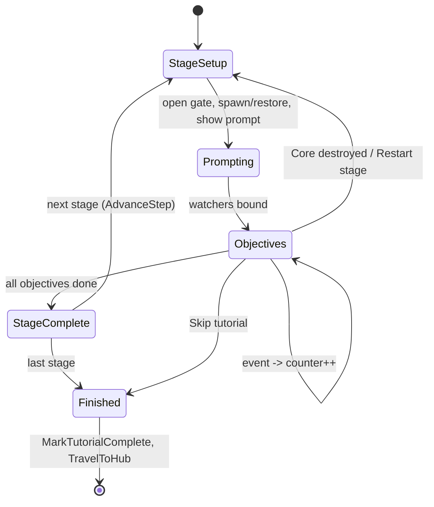
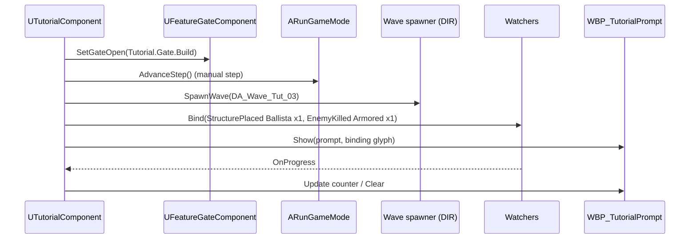

# Onboarding / Tutorial (ONB): Technical Plan

> **Provisional — re-validate after G3.** Decision-level plan. Class names follow `00-foundation/technical-plan.md`; every path is a proposal. Re-check the event/delegate names against the real prototype code before starting.

## 1. Technical Overview

The tutorial is a normal Siege Site run in its own level (`L_Tutorial_SiegeSite`) with `BP_RunGameMode_Tutorial` (a Blueprint child of `ARunGameMode`) and `DA_Run_Tutorial`. A `UTutorialComponent` on that game mode reads a `UTutorialDefinition` and runs stages: it opens one feature gate per stage, runs the stage setup (spawn an authored wave through the DIR spawner, grant a squad or Gold, restore Core/structures), shows prompts, and counts objectives through `FTutorialObjectiveWatcher`s that bind to the owning systems' existing delegates. When a stage completes, it advances the RUN step (tutorial steps have no timer).

Gating is a tag container on the player controller (`UFeatureGateComponent`, `Tutorial.Gate.*`). It is empty in every non-tutorial map, so normal play is unchanged. Each gated feature checks it once at its entry point (open Command Wheel, enter build mode, start Focus, show forecast panel, open workforce/conversion UI) and HUD elements observe it.

The same watcher type powers first-exposure hints in normal runs (`UFirstExposureHintComponent` on the controller), with seen hints stored in MET.

Rejected alternative: listening to `UFeedbackSubsystem` plays as a generic event stream. It would turn the feedback channel into the global event bus D-10 rules out, and feedback rows can be throttled. Watchers bind to owner delegates instead.

## 2. Existing System Impact

| System | Impact |
|---|---|
| RUN | `URunDefinition` step duration 0 = "wait for external advance" (if T-RUN-03 lacks it); `ARunGameMode::AdvanceStep()`; `URunDefinition.bResolveOnCoreDestroyed` (false in tutorial) with an `OnCoreDestroyed` delegate. Small edits, owner review. |
| SQD / DEF / TFM / DIR / ECO / CNV | One gate check each at the feature entry point. No other change. |
| CMB / SQD / DEF / TFM / DIR / ENM / CSM / PRK | Watchers bind to their state-change delegates (D-10). If a needed delegate is missing (e.g. "parry succeeded"), add it as a `BlueprintAssignable` multicast on the owner component (owner review). |
| UXF | HUD elements observe `OnGatesChanged`; prompt widget; `Feedback.Tutorial.*` rows. |
| MET | `bTutorialCompleted`, `SeenHintIds`, settings for binding lookup, main-menu entry. |
| WLD | `TravelToHub()` after completion; tutorial map in the contract test. |
| FND | New tag root `Tutorial.Gate.*` (needs a line in 00-foundation); Primary Asset Type `Tutorial`; domain folder `Tutorial/` (extends D-02 list). |

## 3. Proposed Architecture

| Item | Decision |
|---|---|
| Runtime owner and lifetime | `UTutorialComponent` on `BP_RunGameMode_Tutorial` (tutorial level lifetime). `UFeatureGateComponent` on `AHeroPlayerController` (controller lifetime; empty outside the tutorial). `UFirstExposureHintComponent` on `AHeroPlayerController` (normal runs). Persistent flags in MET only. |
| Main UE types | `UTutorialDefinition : UPrimaryDataAsset`, `FTutorialStage`, `FTutorialObjective`, `ETutorialTopic` (the 7 §34.3 topics), `ETutorialObjectiveType`, `FTutorialObjectiveWatcher`, `UTutorialComponent`, `UFeatureGateComponent`, `UFirstExposureHintComponent`, `UTutorialHintList` (data asset). |
| Data ownership | Definitions read-only. Stage index and counters only in `UTutorialComponent`. Gate state only in `UFeatureGateComponent`. Flags only in MET. |
| Communication | Watchers bind owner delegates (direct references found at stage start: hero, command component, placement, Focus component, `ARunGameState`). Tutorial → RUN via `AdvanceStep`; → DIR spawner to spawn authored waves; → gates via `SetGateOpen`; → MET via `MarkTutorialComplete` / `MarkHintSeen`. |
| C++ / Blueprint split | C++: definition + validation, stage runner, watchers, gates, hint component. Blueprint: stage setup markers in the level, prompt widget, HUD gate bindings, tutorial enemy variants (data). |
| Asset references / loading | Tutorial definition hard-references its waves (small). Prompt glyph textures soft. |
| AI / navigation impact | None new. Training enemies are data variants of existing archetypes (e.g. longer telegraph). |
| UI impact | `WBP_TutorialPrompt` (text, binding glyph, counter, acknowledge), pause-menu entries (Restart stage, Skip stage, Skip tutorial), first-launch offer dialog, `WBP_Hint`. HUD widgets gain gate visibility bindings. |
| Save impact | Writes `bTutorialCompleted`, `SeenHintIds` through MET. No tutorial progress save (R-ONB-23). |
| Performance risks | None significant. |
| Existing systems reused | Whole run stack (RUN, DIR authored waves, DEF, SQD, ZON, TFM, CSM), Enhanced Input key lookup + user settings, MET, WLD travel, UXF feedback. |
| New types proposed | Listed above; files in tasks. |
| Trade-offs | Gate checks at entry points (a few one-line edits in other features) vs removing mapping contexts: contexts are switched per mode (D-12), so removing them would fight the mode logic; a tag check is explicit and inert outside the tutorial. Owner-delegate watchers vs feedback stream: more bindings, but no hidden event bus (D-10). Stage restart by setup vs level reload: setup restore is simpler and keeps the hero/squads; level reload with `?TutorialStage=N` is the fallback if restore proves fragile. |
| Verification | Automation Spec for definition validation, runner, watchers (fake sources); Functional Test per stage driving objectives through cheats; new-player playtest. |

## 4. Runtime Flow

## 5. State / Data

| Type | Fields (design level) |
|---|---|
| `UTutorialDefinition` | `Stages` (ordered `FTutorialStage`). `IsDataValid`: 7 stages, topics exactly in §34.3 order, ≤1 gate opened per stage, every objective has a valid type/parameter. |
| `FTutorialStage` | `Topic` (`ETutorialTopic`), `IntroPrompt`, `GateToOpen` (`Tutorial.Gate.*`, optional), `Objectives`, `Setup` {`WaveToSpawn`, `SquadsToGrant`, `GoldToSet`, `StructuresToEnsure` (definition + level marker), `bHealCore`, `bSealRoutes` (stage 6 b)} |
| `FTutorialObjective` | `Type` (`ETutorialObjectiveType`), `ParamTag` / `ParamAsset`, `Count`, `Prompt` |
| `ETutorialObjectiveType` | `HeroAction` (Light chain, Heavy, Dodge, Block, Parry), `EnemyKilled` (archetype tag), `SquadOrder` (`Command.*`), `SquadOrderInFocus`, `StructurePlaced` (definition), `PathObstacleBroken`, `MinimumBreakResolved`, `FocusEntered`, `WaveCleared`, `Acknowledge` |
| `Tutorial.Gate.*` tags | `CommandWheel`, `Build`, `Forecast`, `TacticalFocus`, `Perks`, `Workforce`, `Conversion` |
| `UTutorialHintList` | entries: `HintId` (`FName`), trigger (`ETutorialObjectiveType` subset + `PerkOfferShown`, `HeroDied`, `WorkforcePanelOpened`, `ConversionInRange`, `HubStationInRange`), prompt |
| Transient | stage index, per-objective counters, bound delegate handles |

## 6. Main Implementation Areas

| Area | Tasks |
|---|---|
| Definition + validation | T-ONB-01 |
| Feature gates + entry-point checks | T-ONB-02 |
| Objective watchers | T-ONB-03 |
| Stage runner, RUN hooks, restart/skip | T-ONB-04 |
| Prompt UI + pause entries | T-ONB-05 |
| Tutorial level + run definition + waves | T-ONB-06 |
| Stage content 1–3, 4–7 | T-ONB-07, T-ONB-08 |
| Entry / skip / completion / replay + hints | T-ONB-09 |
| QA + new-player playtest | T-ONB-10 |

## 7. Error and Edge-Case Handling

| Failure | Response |
|---|---|
| Owner delegate missing at bind time (actor not spawned yet) | Watcher retries binding on the owner's spawn/registration event; logs an error after the stage setup completes without a binding |
| Objective impossible (setup bug) | Pause-menu Skip stage; error logged with stage/objective index |
| Core destroyed | `OnCoreDestroyed` (resolve disabled by run data) → stage restart via setup |
| Stage restore fails (actor cannot be respawned) | Fallback: reload level with `?TutorialStage=N` |
| Player quits | No flag change; next launch offers the tutorial again |
| Gate container non-empty in a normal map | Cannot happen by construction (only the tutorial component writes it); a check in the run start logs an error and clears it |

## 8. Testing Strategy

- Automation Spec `TutorialDefinition.spec.cpp`: order validation, one-gate-per-stage rule.
- Automation Spec `TutorialRunner.spec.cpp`: runner with fake watchers (progress, completion, restart, skip).
- Functional Tests `FT_Tutorial_Stage1..7`: start at stage N (debug option), drive objectives through cheats/simulated actions, assert stage completion and gate state.
- Gate audit (AC-ONB-03): for each gate, try the feature input before its stage.
- Code review check (AC-ONB-10): no tutorial checks outside entry points.
- New-player playtest (AC-ONB-11).

## 9. Performance Risks

None beyond the systems it uses. Authored tutorial waves stay far below the concurrent enemy cap.

## 10. Dependencies and Risks

| Item | Note |
|---|---|
| Missing owner delegates | Some events (parry success, minimum-break resolved, order issued in Focus) may not exist as delegates. Each is a small `BlueprintAssignable` addition in the owner's component inside T-ONB-03, owner review. No anchor covers them. |
| RUN manual step + Core-destroyed override | Small RUN edits inside T-ONB-04 (no anchor covers them; T-RUN-02/T-RUN-03 are the owners). |
| Entry-point gate checks in other features | Inside T-ONB-02 with owner review. Inert when the container is empty. |
| Content stability | Tutorial content must be authored after G3 changes settle; stage prompts reference final tuning (e.g. Focus duration). |
| New tag root `Tutorial.Gate.*` | Needs a line in `00-foundation/technical-plan.md` (lead). |
| CHANGE REQUEST | None. D-10 and D-12 fit; the design avoids a feedback-based event bus. |

## 11. Requirement Coverage

| Requirement | Technical Area | Notes |
|---|---|---|
| R-ONB-01 | `UTutorialDefinition` validation | T-ONB-01 |
| R-ONB-02, R-ONB-03 | `UFeatureGateComponent` + entry checks + HUD bindings | T-ONB-02 |
| R-ONB-04 | Objectives + watchers | T-ONB-03, T-ONB-04 |
| R-ONB-05 | Binding glyph lookup via Enhanced Input user settings | T-ONB-05 |
| R-ONB-06 | Non-modal prompt; setups without active enemies for reading steps | T-ONB-05, T-ONB-07, T-ONB-08 |
| R-ONB-07..R-ONB-09 | Stage content 1–3 | T-ONB-07 |
| R-ONB-10..R-ONB-13 | Stage content 4–7 | T-ONB-08 |
| R-ONB-14, R-ONB-16 | Tutorial level + `DA_Run_Tutorial` + contract test | T-ONB-06, T-WLD-10 |
| R-ONB-15 | Manual run steps + `AdvanceStep` | T-ONB-04 |
| R-ONB-17, R-ONB-19 | Stage restart, pause entries | T-ONB-04, T-ONB-05 |
| R-ONB-18 | Normal CSM + hint | T-ONB-09 |
| R-ONB-20 | RUN boundary (T-RUN-07) | Referenced |
| R-ONB-21, R-ONB-23, R-ONB-24 | Entry / skip / completion / replay flow | T-ONB-09 |
| R-ONB-22 | `UFirstExposureHintComponent` + `UTutorialHintList` | T-ONB-09 |
