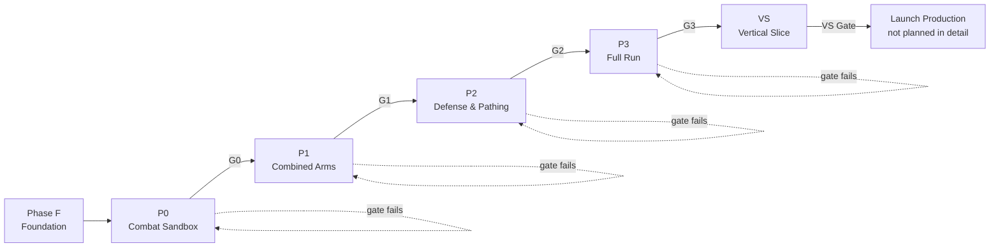
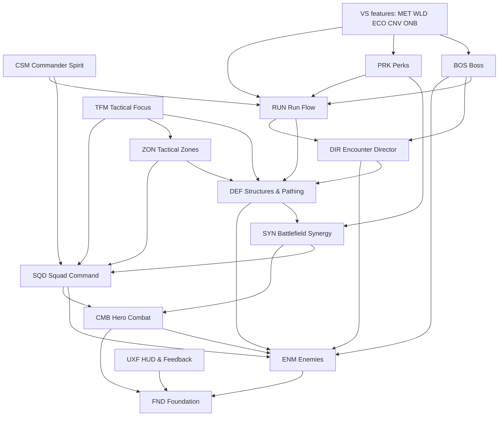

# Main Implementation Plan: Action Strategy Roguelite (UE5)

| | |
|---|---|
| Source of truth | [GDD_Action_Strategy_Roguelite_Optimized_v2.html](../../GDD_Action_Strategy_Roguelite_Optimized_v2.html) (GDD v2) |
| Platform / Engine | PC single-player, Unreal Engine 5 |
| Team | Solo developer with AI coding agents |
| Implementation direction | C++ for gameplay core and performance-critical systems; Blueprint for UI, VFX, authoring and tuning |
| Process skills | `game-development-workflow` (process, gates), `ue5-project-architecture` (UE5 decisions) |
| Doc status | Draft v1, generated 2026-10-02 from GDD v2 |

This file is the index for all implementation work. It summarizes every phase, feature, gate, decision and open question. Per-feature detail lives in `ai/game/<NN-feature>/{spec.md, technical-plan.md, tasks.md}`.

---

## 1. How to Use These Docs

1. Work one phase at a time. A phase starts only after the previous gate passes (GDD §32: "only move on when the gate passes").
2. Inside a phase, pick tasks from the feature `tasks.md` files tagged with that phase, in dependency order (Section 6).
3. Every spec rule traces to a GDD section. If a rule has no GDD source, it is marked as an assumption and listed in Section 11.
4. GDD labels carry over unchanged:
   - `[LOCKED]`: follow, do not change.
   - `[TUNABLE]`: implement as data (Data Asset or Developer Settings), never as a hard-coded constant.
   - `[OPEN]`: do not decide silently. Use the assumption written in Section 11 or ask.
   - `[DEFERRED]`: do not build in prototype or launch scope unless re-requested.
5. New ideas during implementation go through the intake check in Section 10. A good idea is not automatically in scope.
6. Coding agents (Claude Code, Codex, Cursor, Copilot, …) follow [/AGENTS.md](../../AGENTS.md); Claude Code loads it through `/CLAUDE.md`.

### Document layout

```text
ai/game/
├── main_implement_plan.md        ← this file
├── production-plan.md            ← art/anim/VFX/audio/level content per phase
├── spec-audit.md                 ← completeness review 2026-10-03: open issues by phase, missing lifecycle docs
├── progress.md                   ← session log and handoff for every agent session (rules: /AGENTS.md)
├── 00-foundation/                ← UE5 project architecture + project setup
├── 01-hero-combat/               ← Prototype 0
├── 02-enemies/                   ← Prototype 0 → 2
├── 03-squad-command/             ← Prototype 1
├── 04-battlefield-synergy/       ← Prototype 1
├── 05-structures-pathing/        ← Prototype 2
├── 06-tactical-zones/            ← Prototype 2
├── 07-encounter-director/        ← Prototype 2 (scripted waves) → 3 (Director + Forecast)
├── 08-run-flow/                  ← Prototype 2 (Core + lose) → 3 (full run)
├── 09-commander-spirit/          ← Prototype 3
├── 10-tactical-focus/            ← Prototype 3
├── 11-perks/                     ← Prototype 3
├── 12-boss/                      ← Prototype 3
├── 13-hud-feedback/              ← cross-cutting, Prototype 0 → 3
├── 20-meta-save/                 ← Vertical Slice (provisional)
├── 21-hub-open-world/            ← Vertical Slice (provisional)
├── 22-villager-economy/          ← Vertical Slice (provisional)
├── 23-conversion-buildings/      ← Vertical Slice (provisional)
└── 24-onboarding/                ← Vertical Slice (provisional)
```

Features `20-*` to `24-*` are provisional. Re-validate their specs and re-plan their tasks after Gate G3 passes, because prototype results will change them.

---

## 2. Project Facts vs Assumptions

| Item | Status | Note |
|---|---|---|
| Unreal project exists | Yes (2026-10-04) | `CastleDefender.uproject`, created in `T-FND-01`. Class/asset paths in feature docs stay proposals until their task lands. |
| Engine version | Pinned | UE 5.8 (5.8.3 at creation), `EngineAssociation` "5.8" (`T-FND-01`, Q-15). |
| Project / module name | Decided | `CastleDefender`. Docs write `<Game>` for it (Q-15, 2026-10-04). |
| Version control | Set up | Git + Git LFS (`T-FND-02`). |
| Target hardware | Decided | Current dev/reference PC (i5-14600KF, RTX 5060, 16 GB, 1080p) at 60 fps [TUNABLE]; confirmed 2026-10-04, foundation technical-plan §15 (`T-FND-08`). |
| Art direction | Open | GDD §37 lists toon vs stylized realism as open. Prototypes use placeholder art only. |

---

## 3. Delivery Phases and Gates

No hard deadlines until real velocity is measured (GDD §32). Each phase ends in a gate review. A failed gate loops back inside the same phase; it does not unlock the next one.



| Phase | Goal (one question to answer) | Features with work in this phase | Gate |
|---|---|---|---|
| **F: Foundation** | Can we build, run, test and debug an empty game project? | FND | Build + automation test run + debug draw work in a packaged Development build |
| **P0: Combat Sandbox** | Is Hero combat responsive, readable and satisfying with no RTS/TD on screen? | CMB, ENM (1 melee enemy), SYN (poise → Staggered), UXF (combat feedback, stamina/HP HUD) | **G0** |
| **P1: Combined Arms** | Is Hero + squads better than Hero alone? | SQD, SYN, ENM (Swarm + Armored), UXF (squad/command feedback) | **G1** |
| **P2: Defense & Pathing** | Do placement and pathing create meaningful tactical decisions? | DEF, ZON, ENM (Giant/Siege + lane/route behavior), SYN (tower consumers), DIR (scripted 3 waves), RUN (Core + lose state), PRK (stat modifier query for zone bonuses), UXF | **G2** |
| **P3: Full Run** | After one run, does the player want to replay right away with a different build? | DIR (Director + Forecast), RUN (full run), CSM, TFM, PRK, BOS, UXF | **G3** |
| **VS: Vertical Slice** | Does a polished, representative slice prove the full loop, the pipeline and performance? | MET, WLD, ECO, CNV, ONB + polish/expansion tasks in CMB, SQD, DEF, BOS, UXF | **VS Gate** |
| **Launch production** | Scale content with the proven pipeline | Not planned yet (Section 9) | Release gate |

### Gate checklists

Gate reviews use these checks (from GDD §32 and §36). Each gate also needs: build succeeds, no blocker bugs, playtest notes recorded in `ai/game/playtests/` (see `13-hud-feedback` and each feature's QA tasks), and a KEEP / CHANGE / DELETE decision per hypothesis.

**G0: Combat Sandbox** (GDD §32 P0, §36 Combat Core DoD)
- [ ] Light / Heavy / Dodge / Block / Parry all responsive.
- [ ] Stamina loop is clear to the player.
- [ ] Hit feedback (hit stop, reaction, camera shake, SFX/VFX placeholders) is strong enough.
- [ ] One melee enemy is enough for 3–5 minutes of combat without getting boring.
- [ ] If any check fails: do **not** add towers or army. Iterate combat.

**G1: Combined Arms** (GDD §32 P1, §36 Command Core DoD)
- [ ] Player issues all 4 base commands mid-combat without pausing.
- [ ] Squads execute orders reliably; no per-soldier micro needed.
- [ ] Stuck recovery works (one stuck soldier never freezes the squad).
- [ ] Player understands what each squad is doing.
- [ ] Hero + squads plays better than Hero alone (playtest comparison).
- [ ] Basic shared combat states work across layers: Staggered and Armor Broken created by one layer and used by another (GDD §32 P1 "basic shared combat states").

**G2: Defense & Pathing** (GDD §32 P2, §36 Defense Core DoD)
- [ ] Tower placement changes route/encounter.
- [ ] Enemy meeting a route-blocking structure stops and attacks it.
- [ ] Structure destroyed → route continues correctly.
- [ ] Full seal → enemy picks a minimum-break path; never stands still bugged.
- [ ] Blocking is not a free exploit; structure breaking is easy to read.
- [ ] Ballista, Bombard and Barricade roles are clearly different.

**G3: Full Run** (GDD §32 P3, §36 Full Run DoD)
- [ ] 5 waves + boss run end-to-end.
- [ ] Threat Forecast works before every wave.
- [ ] Director never generates an impossible wave due to a logic bug.
- [ ] Hero death stays playable through Commander Spirit Mode.
- [ ] At least one meaningful Hero ↔ Army ↔ Tower synergy is visible.
- [ ] At least one distinct build emerges from perks.
- [ ] Run lasts ~25 minutes after tuning.
- [ ] No serious blocker bug.
- [ ] Player wants to replay right away. If not: no villager economy, no open world content, no extra classes.

**VS Gate** (`game-development-workflow` vertical-slice gate)
- [ ] Fun enough to continue; technically feasible; content pipeline works.
- [ ] More content can be produced with the same approach.
- [ ] Meets target hardware constraints.
- [ ] Major unknowns reduced; scale-up approved or rejected in writing.

---

## 4. Feature Map

| ID | Folder | Feature | GDD sections | Phases | Priority |
|---|---|---|---|---|---|
| FND | `00-foundation` | UE5 project, module, folders, tags, input, debug, tests, VCS | §29, §31, §34.1–34.2, §38 | F | Must |
| CMB | `01-hero-combat` | Warlord combat: locomotion, light/heavy/dodge/block/parry, stamina, poise, lock-on, interact, combat feel | §2.1, §9, §19.1, §29 | P0 (+VS polish) | Must |
| ENM | `02-enemies` | Enemy base, Swarm / Armored / Giant-Siege archetypes, route objective vs local aggro, structure attack | §14.2–14.5, §20 | P0 → P2 | Must |
| SQD | `03-squad-command` | Squads (Infantry, Archer), Command Wheel, 4 commands, squad FSM, formation, target priority, leash, stuck recovery | §2.2, §11, §13, §29.2 | P1 (+VS Spearman, squad abilities) | Must |
| SYN | `04-battlefield-synergy` | Shared combat states (Staggered, Armor Broken, Marked) and their consumers across Hero/Army/Tower | §9.7, §10, §19.5 | P0 (poise → Staggered) → P2 | Must |
| DEF | `05-structures-pathing` | Core, Ballista, Bombard, Barricade, placement, path-blocking rule, stop-and-attack, local repath, minimum-break path | §2.3, §14, §21 | P2 (+VS towers) | Must |
| ZON | `06-tactical-zones` | Tactical Zones, context-sensitive commands, zone bonuses | §15 | P2 | Must |
| DIR | `07-encounter-director` | Wave definitions, spawner, Encounter Director (threat budget, constraints, modifiers), Threat Forecast | §7, §8, §27.2 | P2 (scripted) → P3 | Must |
| RUN | `08-run-flow` | Run state machine (prep, waves, intermissions, boss, resolve), Core loss, run resource, rewards stub | §4, §6, §16.3, §18.1, §33 | P2 → P3 | Must |
| CSM | `09-commander-spirit` | Hero death, Commander Spirit Mode, respawn timer, revive charge | §18 | P3 | Must |
| TFM | `10-tactical-focus` | Tactical Focus: meter, time dilation, tactical camera, overlay | §12, §28.1 | P3 | Must |
| PRK | `11-perks` | Stat modifier query (shared with zone bonuses), perk definitions, 1-of-3 offers, Hero/Army/Defense/Hybrid effects | §15.4, §23 | P2 (stat modifiers) → P3 | Must |
| BOS | `12-boss` | Boss framework + one two-phase boss | §22 | P3 (+VS polish) | Must |
| UXF | `13-hud-feedback` | HUD shell, feedback contract (visual/audio/UI per state), world markers, debug overlays, playtest logging | §28, §34.5 | P0 → P3 | Must |
| MET | `20-meta-save` | Meta progression (horizontal unlocks), SaveGame with versioning/migration, settings persistence | §24, §30, §34.6 | VS | Provisional |
| WLD | `21-hub-open-world` | Minimal hub loop, small Controlled Open World segment, Siege Site entry/exit | §4, §5, §27 | VS | Provisional |
| ECO | `22-villager-economy` | Food / Gold / Monster Material, villager workforce management | §16 | VS | Provisional |
| CNV | `23-conversion-buildings` | Monster Material → Hero / Army / Tower channel | §17 | VS | Provisional |
| ONB | `24-onboarding` | Tutorial order: combat → one squad → one tower → forecast → focus → blocking → combine | §34.3 | VS | Provisional |

Production content (placeholder and final art, animation, VFX, audio, levels) is tracked in [production-plan.md](production-plan.md).

### Doc status (2026-10-02)

All 19 feature folders have `spec.md`, `technical-plan.md` and `tasks.md`. Cross-references (task, rule and acceptance IDs) are checked: none missing, no duplicate task IDs.

| Feature | Tasks | Feature | Tasks |
|---|---|---|---|
| FND | 10 | DIR | 17 |
| CMB | 19 | RUN | 18 |
| ENM | 17 | CSM | 10 |
| SQD | 21 | TFM | 12 |
| SYN | 11 | PRK | 14 |
| DEF | 25 | BOS | 15 |
| ZON | 8 | UXF | 20 |
| **Prototype + Foundation total** | **217** | MET / WLD / ECO / CNV / ONB (provisional) | 12 / 12 / 12 / 8 / 10 = **54** |

Grand total: **271** tasks, a few of them provisional VS tasks inside prototype features (e.g. T-CMB-17..19, T-SQD-18..21, T-DEF-24..25, T-BOS-11..15).

---

## 5. Work Summary per Phase

What must exist at the end of each phase. Task IDs live in each feature `tasks.md`.

### Phase F: Foundation
Status: **Passed 2026-10-04.** P0 is open.

- UE5 C++ project, one runtime module `<Game>`, domain folder layout (D-01, D-02).
- Git + LFS + `.gitignore` for UE5 generated folders and `.codegraph/`.
- Gameplay Tag taxonomy file with the root tags in Section 8.
- Enhanced Input setup with one mapping context per mode (D-13).
- Shared combat contract: `UHealthComponent`, `FCombatHit`, `UCombatStateComponent` skeletons (D-05). Their gameplay logic is filled in by CMB/SYN.
- `UGameTuningSettings` (Developer Settings) for global [TUNABLE] values.
- Debug tooling: console variables, on-screen debug, Visual Logger usage, cheat commands.
- Automation test harness (one passing Automation Spec, one Functional Test map).
- Packaged Development build smoke test. Reference PC spec recorded.

### Phase P0: Combat Sandbox
- `AHeroCharacter` (Warlord) with locomotion + sprint, 3-hit light chain, heavy attack, dodge with i-frames, block, parry, stamina, lock-on, animation commitment and cancel windows.
- Poise on enemies → Staggered state.
- One melee enemy (`ENM` base enemy + simple melee brain) that attacks, blocks/telegraphs, takes poise damage.
- Combat feel: hit stop, hit reaction, camera shake, per-material impact SFX, distinct VFX for normal / armored / parry / stagger (placeholders).
- HUD: Hero HP, stamina, lock-on marker, enemy HP/poise debug.
- Combat sandbox map + tuning via data assets.

### Phase P1: Combined Arms
- `ASquad` (anchor + slot formation) with Infantry and Archer squad definitions; soldiers with local avoidance.
- Squad FSM: Idle → Follow → MoveToOrder → Guard → Engage → Reform → Retreat → Recover.
- Command Wheel (hold key, aim, pick squad, pick command, release); commands Guard / Attack / Follow / Retreat; context-sensitive target.
- Target priority per squad type, leash, stuck detection + repath + slot reassignment + hidden last-resort teleport.
- Swarm and Armored archetypes.
- Shared combat states: Staggered (from P0), Armor Broken (Warlord Heavy), Marked infrastructure; Army consumers (Infantry/Archer priority on Staggered/Armor Broken targets).
- Squad HUD markers, order acknowledged feedback.

### Phase P2: Defense & Pathing
- `ACoreStructure`, Ballista, Bombard, Barricade with role-specific behavior; Interact/build placement in authored build zones (soft grid, see assumption A-04).
- Strategic lane layer: authored lanes, route assignment, path-blocking detection, stop-and-attack, local repath on destruction, minimum-break path on full seal (D-09, validated by a spike first).
- Giant/Siege archetype; enemies follow Route Objective with Local Aggro and leash.
- Tower consumers of shared states (Ballista bonus vs Armor Broken).
- Tactical Zones (Bridge, Chokepoint, High Ground, Rally Point …) + context-sensitive commands + light zone bonuses.
- Scripted 3-wave sequence from wave data (no Director yet), Core HP and lose state.
- Performance benchmark that sets the first concurrent enemy cap.

### Phase P3: Full Run
- Run state machine: Prep (~2 min) → 5 waves with intermissions and a mid-run pressure event → Boss → Resolve (GDD §6.2).
- One run resource (earn from enemies/objectives, spend on build/repair; see A-05).
- Encounter Director: threat budget, archetype cost, constraints (concurrent cap, type cap, lane cap, warning time, elite cap, no impossible hard counter), modifiers.
- Threat Forecast UI before every wave.
- Perks: 1-of-3 offer after selected waves; Hero / Army / Defense / Hybrid pool.
- Hero death → Commander Spirit Mode → respawn timer; limited revive charge.
- Tactical Focus (see A-01).
- One two-phase boss passing the 2/3 Layer Test.
- Tuning pass toward ~25 minutes.

### Phase VS: Vertical Slice (provisional, re-plan after G3)
- 1 polished Siege Site, 1 biome slice, minimal hub loop, small Controlled Open World segment.
- More complete Warlord; up to 3 squad types (adds Spearman; squad abilities); 3–4 towers.
- First villager/workforce economy (Food, Gold, Monster Material) + one conversion building flow.
- One polished boss; art/audio/UI near target quality.
- Basic meta save with save version, migration strategy, corruption fallback, settings persistence.
- Tutorial / onboarding sequence (GDD §34.3).

### Demo Milestones

Each phase ends in a playable demo. "To play" is the smallest task set that lets you press Play and test the experience; "to pass gate" adds the tests, telemetry and gate playtest needed before moving on. Counts are cumulative.

| Demo | After | What you can play | Tasks to play | Tasks to pass gate | Status |
|---|---|---|---|---|---|
| **D0: Walk around** | Steps 1–2 below | Hero runs, sprints, camera orbits in an empty map | 9 | — | Not started |
| **D1: Combat Sandbox** | **P0** | Warlord vs melee enemy: light/heavy, dodge, block, parry, stamina, stagger, hit feel. **First real feel test.** | 29 | 40 (G0) | Not started |
| **D2: Combined Arms** | P1 | Hero + Infantry and Archer squads vs Swarm and Armored, Command Wheel orders | ~60 | 73 (G1) | Not started |
| **D3: Defense & Pathing** | P2 | Siege Site with 2 lanes: build Ballista/Bombard/Barricade, enemies stop and break structures, 3 waves, Core loss = defeat. **First time the game's identity shows.** | ~110 | 128 (G2) | Not started |
| **D4: Full Run** | **P3** | Complete ~25-minute run: forecast, 5 waves, perks, Tactical Focus, Commander Spirit, two-phase boss. **First version that is the actual game loop.** | ~180 | 203 (G3) | Not started |
| **D5: Vertical Slice** | VS | Polished slice for external viewers | — | 271 (VS Gate) | Not started |

Prototype demos D1–D4 use placeholder art (production-plan.md): they test feel and decisions, not visuals.

#### D0 and D1 minimal path (29 tasks, dependency-checked)

| Step | Tasks | Result |
|---|---|---|
| 1 | `T-FND-01, 03, 04, 05, 06, 07, 09` | Project builds; input, tags, damage contract, cheats/debug exist |
| 2 | `T-CMB-01`, `T-CMB-13` | Hero walks around `L_CombatSandbox` (**D0**, 9 tasks) |
| 3 | `T-FND-10`, `T-UXF-01`, `T-CMB-02, 03, 04, 05` | Test harness + feedback subsystem; light 3-hit chain, stamina cost, hits deal damage |
| 4 | `T-ENM-01, 02, 03` | Enemy chases and attacks back with a telegraph |
| 5 | `T-CMB-06, 07, 08, 09`, `T-SYN-01`, `T-ENM-04` | Heavy, dodge, block, parry; poise break → Staggered. Rough combat is playable here. |
| 6 | `T-UXF-02, 03` | HP/stamina bars, hit stop, camera shake, hit SFX/VFX (what G0 judges) |
| 7 | `T-CMB-10, 11`, `T-ENM-11` | Lock-on, Hero takes damage/dies, enemy tuned for 3–5 minutes of combat (**D1 playable**) |

To pass G0, finish the rest of Phase F and P0 (11 tasks): `T-FND-02, 08`, `T-CMB-14, 15, 16`, `T-ENM-12`, `T-SYN-08`, `T-UXF-08, 09, 10, 11`. The gate task `T-CMB-16` now depends on all of them. Do not start squads or towers before G0 passes (GDD §32).

#### Task count per phase

| F | P0 | P1 | P2 | P3 | VS | Total |
|---|---|---|---|---|---|---|
| 10 | 30 | 33 | 55 | 75 | 68 | 271 |

VS includes the 54 tasks of features 20–24 and 14 provisional VS tasks inside prototype features.

---

## 6. Dependency Graph

Feature-level. Arrows mean "needs".



**Critical path:** FND → CMB → ENM (base) → SQD → SYN → DEF (path spike first) → DIR → RUN → BOS.
Biggest technical risk on the path: DEF path-blocking + minimum-break navigation (do the spike `T-DEF-01` at the very start of P2, or earlier as a side spike once FND is done).

**Parallel-safe streams** (once dependencies exist): UXF alongside every phase; ZON alongside DEF after the lane layer exists; PRK and CSM alongside BOS in P3; TFM after ZON/DEF.

---

## 7. Architecture Baseline

Full detail and rationale: [00-foundation/technical-plan.md](00-foundation/technical-plan.md). Feature technical plans must follow these decisions or record a change request there.

| ID | Decision | Why |
|---|---|---|
| D-01 | One runtime C++ module `<Game>`. Add `<Game>Editor` only when editor-only tooling exists. No plugins for game features. | Solo dev; module splits add build cost with no team boundary to justify them. |
| D-02 | Source and Content organized by domain: `Core, Combat, Hero, Army, Enemy, Structures, Navigation, Encounter, Run, Perks, Boss, Player, UI, Feedback`. | Ownership obvious; no `Managers/` or `Utils/` junk folders. |
| D-03 | C++ owns rules, state, AI, pathing, Director, damage. Blueprint owns content assembly, tuning, animation wiring, VFX/SFX, UI layout. Pattern: C++ base → Blueprint child → data asset tuning. | GDD implementation direction + skill default. |
| D-04 | **No GAS in prototype.** Gameplay Tags + lightweight components. Re-evaluate at G3 if perk/ability/status complexity outgrows components. | Many simple units (swarm, soldiers) would pay GAS cost for nothing; smaller learning surface for a solo dev. |
| D-05 | Shared damage contract: `UHealthComponent` + `FCombatHit` struct (damage, poise damage, damage tag, source layer, applied states). `UCombatStateComponent` owns poise and timed state tags (Staggered, Armor Broken, Marked). Used by hero, soldiers, enemies, boss; structures use `UHealthComponent` only. Every hit goes through `UCombatLibrary::DeliverHit` (T-CMB-04); see foundation technical plan §7 for the full contract. | One pipeline lets Hero, Army and Tower create openings for each other (GDD §10). |
| D-06 | Data-driven content via Primary Data Assets: `UHeroClassDefinition`, `USquadDefinition`, `UEnemyArchetypeDefinition`, `UStructureDefinition`, `UWaveDefinition`, `URunDefinition`, `UPerkDefinition`, `UTacticalZoneDefinition`, `UBossDefinition`, later `UConversionRecipeDefinition`. Global [TUNABLE] values in `UGameTuningSettings` (UDeveloperSettings). Flat lookup data (feedback events) in Data Tables. | GDD §34.1, §38: every [TUNABLE] number is data; adding content needs no core code change. |
| D-07 | State ownership per GDD §34.2 (table below). | Single authority per state; UI only observes. |
| D-08 | AI: lightweight C++ state machines for enemies, soldiers, squads and the prototype boss. StateTree reconsidered for boss polish at VS. Squads move as anchor + formation slots; soldiers use crowd local avoidance. | GDD §13.3, §31.2: squad/group logic before individual AI. |
| D-09 | Navigation: Recast NavMesh (runtime "dynamic modifiers only") for local movement; a strategic lane layer (authored lane routes + corridor grid with break-cost search) decides routes, blockers and minimum-break targets. Structures update only their dirty region. Validated by spike `T-DEF-01`; fallback = per-lane flow field. | GDD §14.7 asks for local nav updates and leaves the final technique to a prototype. |
| D-10 | Communication: direct references when ownership is clear, multicast delegates for state changes, no global event bus. Presentation feedback goes through one `UFeedbackSubsystem` reading a Data Table keyed by `Feedback.*` tags. | Event-driven, no per-frame polling, one place for the GDD §28/§34.5 feedback contract. |
| D-11 | UI: UMG widgets observe delegates on components / GameState. CommonUI deferred until menus + gamepad navigation are needed (VS). | Widgets never own gameplay state. |
| D-12 | Input: Enhanced Input. Mapping contexts: `IMC_Combat`, `IMC_CommandWheel`, `IMC_TacticalFocus`, `IMC_CommanderSpirit`, `IMC_Build`. Actions are device-agnostic so gamepad can be mapped later. | GDD §29: KBM first, every core command mappable to gamepad later. |
| D-13 | Tactical Focus uses global time dilation; the tactical camera and UI compensate so they stay responsive. | GDD §12.2 time scale 20–30% without full pause. |
| D-14 | No save in prototype. Run state is built from plain structs with stable IDs (Primary Asset IDs, Gameplay Tags), never raw UObject pointers, so mid-run save stays possible. Meta SaveGame is versioned from day one at VS. | GDD §30, §34.6: architecture must not lock the door. |
| D-15 | Performance: measure first (Unreal Insights, `stat` commands). No pooling, Mass or custom schedulers until a benchmark shows the need. Concurrent enemy cap comes from the P2 benchmark and feeds the Director. | GDD §31; skill rule "measure before optimizing". |
| D-16 | Testing: Automation Spec tests for pure logic (stamina rules, Director solver, break-cost search, perk offers); Functional Tests in test maps for gameplay scenarios (enemy breaks barricade, squad recovers from stuck); manual gate playtests with checklists. Visual Logger for AI/path debugging. | Every task ships with its own verification (GDD §38). |
| D-17 | Levels: one map per prototype stage; Siege Site maps are separate levels. Level Streaming vs World Partition for the Controlled Open World is decided at VS (OPEN Q-09). | Do not pick World Partition before the world exists. |
| D-18 | Source control: Git + Git LFS for binary assets. Ignore `Binaries/`, `Intermediate/`, `Saved/`, `DerivedDataCache/`, `.codegraph/`. | Project README rule. |
| D-19 | `AHeroPlayerController` is the single owner of player mode: a push/pop stack (`Combat, Wheel, Build, Focus, Spirit, Modal`) that sets mapping contexts and UI input mode and broadcasts `OnPlayerModeChanged`. Features push/pop; HUD layers and overlays only listen. (Added 2026-10-03 after the spec audit; consumer docs DEF/CSM/TFM/PRK/UXF still to align.) | Mode was stored three times and features patched around a switch. |
| D-20 | Clock domains: timers that gate player input or hero actions (input buffer, counter window, i-frames, combo windows) run in the hero's dilated time, so hit stop never shortens them; world timers (AI decisions, states, waves, respawn) run in world game time and slow with Tactical Focus; UI animation uses real time. (Added 2026-10-03; CMB/UXF/SYN docs still to align.) | Hit stop was eating up to 0.15 s of a 0.2 s input buffer. |

### State ownership (GDD §34.2)

| State | Owner (proposed UE type) | Lifetime | Observers |
|---|---|---|---|
| Run State (phase, timers, run resource, result) | `ARunGameMode` (rules) + `ARunGameState` (state data) | One Siege Site run | HUD, Director, perks |
| Wave State (current wave, plan, alive count) | `UEncounterDirectorComponent` on `ARunGameMode`; mirrored to `ARunGameState` for UI | One run | Forecast UI, RUN |
| Player State (perks, revive charges, run stats) | `ARunPlayerState` | One run, survives Hero death/respawn | HUD, PRK, CSM |
| Hero transient (HP, stamina, combat action) | Components on `AHeroCharacter` | Pawn lifetime | HUD |
| Squad State (order, FSM state, soldiers, strength) | `ASquad` | Run (or sandbox level) | Command Wheel, HUD, TFM |
| Structure State (HP, role, footprint) | `AStructureBase`; registered with the lane layer for path queries | Until destroyed | Lane layer, HUD |
| Core State (HP) | `ACoreStructure`; referenced by `ARunGameState` | One run | RUN (lose), HUD, audio |
| Director State (budget, spawn queue, modifiers) | `UEncounterDirectorComponent` | One run | Forecast |
| Meta Progression State | `UMetaProgressionSubsystem` (GameInstanceSubsystem) + `UMetaSaveGame` | Process / save file | Hub, unlock UI |

---

## 8. Shared Conventions

### IDs
| Kind | Format | Example |
|---|---|---|
| Spec rule | `R-<FEAT>-NN` | `R-DEF-03` enemy stops and attacks a route-blocking structure |
| Acceptance criterion | `AC-<FEAT>-NN` | `AC-CMB-04` |
| Task | `T-<FEAT>-NN` with a Type column (`GAMEPLAY`, `AI`, `UI`, `TOOLS`, `PERF`, `QA`, `DESIGN`, `ART`, `ANIM`, `VFX`, `AUDIO`, `BUILD`) | `T-SQD-07` |
| Assumption | `A-NN` (this file, Section 11) | `A-04` |
| Open question | `Q-NN` (this file, Section 11) | `Q-05` |
| Decision | `D-NN` (Section 7) | `D-09` |

Feature codes: `FND CMB ENM SQD SYN DEF ZON DIR RUN CSM TFM PRK BOS UXF MET WLD ECO CNV ONB`.

### Gameplay Tag roots (defined once in `T-FND-04`)

```text
State.Combat.Staggered | ArmorBroken | Marked
State.Hero.Attacking | Dodging | Blocking | Parrying | Dead
Unit.Enemy.Swarm | Armored | Siege | Boss
Unit.Squad.Infantry | Archer | Spearman
Structure.Role.Core | Blocker | CombatTower | Utility
Command.Guard | Attack | Follow | Retreat
Zone.Bridge | Gate | HighGround | Chokepoint | ResourceCamp | RallyPoint
Damage.Physical
Perk.Category.Hero | Army | Defense
Stat.<Domain>.<Name>          (perk / zone modifier targets)
Feedback.<Event>              (feedback contract, see 13-hud-feedback)
Modifier.Encounter.<Name>     (Director modifiers)
Lane.<Name>                   (lane identity: routes, spawners, forecast)
Resource.<Name>               (VS economy: Food, Gold, MonsterMaterial)
Tutorial.Gate.<Name>          (VS onboarding gates)
```

Features may add leaf tags under these roots; new roots need an entry in `00-foundation/technical-plan.md`.

### Naming
- C++ classes use standard UE prefixes without a project prefix (`AHeroCharacter`, `USquadDefinition`).
- Content assets: `BP_`, `DA_`, `DT_`, `ABP_`, `AM_` (montage), `IA_`, `IMC_`, `WBP_`, `NS_`, `SFX_`/`MS_` (MetaSound), `L_` (maps), `SM_`, `SK_`, `M_`/`MI_`.
- Data asset per content item: `DA_Enemy_Swarm`, `DA_Squad_Infantry`, `DA_Structure_Ballista`, `DA_Wave_P2_01`.

### Task rules (GDD §38 + workflow skill)
Each task has: objective, related requirements, dependencies, implementation notes, expected files/assets (proposed), test case, acceptance criteria, verification. One task = one meaningful outcome one coding agent can finish, test and review alone. No task mixes two large systems.

### Definition of Done (every task)
Implemented + integrated + verified in the editor PIE **and** the phase sandbox map + no new warnings/errors in the log + tuning values exposed as data + verification steps recorded in the task.

---

## 8a. Cross-Feature Integration Contracts

Agreements between features that one feature defines and another consumes. When you implement the provider task, check the consumer column. When a consumer task starts before the provider has the hook, add the hook in the consumer task and ask the owner to review it.

| Contract | Provider (owner task) | Consumers |
|---|---|---|
| `AHeroPlayerController::PushMode(EPlayerMode, Reason)` / `PopMode(Reason)`, `OnPlayerModeChanged(Old, New)`; per-mode contexts in `BP_HeroPlayerController.ModeInput`; key map `00-foundation/input-keymap.md` (D-19) | T-FND-06 | T-SQD (Wheel), T-DEF-07 (Build), T-TFM-01 (Focus), T-CSM (Spirit), UXF/PRK modals, HUD listeners |
| `UCombatLibrary::DeliverHit` is the only way to apply a hit | T-CMB-04 | T-ENM-03, T-SQD-07/10, T-DEF-09, BOS attacks, T-SYN-07 (multipliers) |
| `FCombatResolutionEvent` / `OnCombatResolved` (spec v2, proposed): one resolution ID/context/result per hit attempt, participant roles; separate from conditional UXF feedback, no global bus | T-CMB-04 | CMB debugger T-CMB-21, T-UXF-08 telemetry, ENM/SQD/DEF/BOS hit producers; T-CMB-15 verifies counts |
| `FCombatHit` interrupt strength/category + per-action authored resistance (spec v2, proposed); resistance defaults off, damage still applies, SYN Staggered remains authoritative | T-CMB-04 (hit data), T-CMB-06/11 (hero consumer) | ENM/SQD/DEF/BOS attack data, T-CMB-15 threshold tests |
| `UMeleeTraceComponent`, `ICombatHitInterceptor` | T-CMB-04 | T-ENM-03, soldier melee (T-SQD-10), boss |
| `ACombatProjectile` base | T-SQD-10 | T-DEF-09 tower projectiles; pierce extension for T-PRK-11 / T-CNV-* |
| `FCombatStateConfig` + `BaseArmor` in every combatant definition | T-SYN-01 | T-ENM-01, T-SQD-01, T-BOS-01, hero class data |
| `DT_CombatStatePresentation` + `OnStateAdded/Removed` | T-SYN-01, T-SYN-04 | T-UXF-05, T-PRK-03 |
| Target scorer: priority tier + numeric score term | T-SQD-07 | T-SYN-05 (state weights) |
| `IInteractable` (`Core/Interactable.h`) | T-CMB-12 | T-DEF-07 `ABuildZone` |
| `UStaminaComponent::Restore(float)` | T-CMB-03 (added by T-PRK-03, CMB review) | T-PRK-03 |
| Hero `FellOutOfWorld` → boundary recovery instead of death | T-RUN-07 | T-CMB-01 |
| Hero death event → Commander Spirit (replaces sandbox respawn) | T-CMB-11 | T-CSM-01 |
| Hide Follow command while Hero is dead | T-SQD-05 | T-CSM-02 |
| Lane route result: ordered obstacles with distance along route, end target = Core | T-DEF-05 | T-ENM-07, T-ENM-09 |
| `OnRouteInvalidated(Lane, bOpened)` per lane; `Structure` collision channel | T-DEF-06, T-DEF-02 | T-ENM-07/08/09 |
| Build-mode exit restores previous input mode (incl. Commander Spirit) | T-DEF-07 | T-CSM-05 |
| `TrySpawnEnemy` (null when cap full), `RequestScriptedSpawn` (queues), `InitFromSpawn`, `OnEnemyRemoved` | T-DIR-01 | T-BOS-03 summons, T-RUN-04 kill rewards |
| `OnWaveEnemyRemoved(enemy, archetype, lane, cause)` | T-DIR-02 | T-RUN-04, T-UXF-08 |
| `CounterTags` field on `UEnemyArchetypeDefinition` | T-ENM-01 (field), T-DIR-04 (use) | T-DIR-04 |
| `MaxConcurrentEnemies` from benchmark | T-DEF-12 | T-DIR-04; update Q-04 |
| `ARunGameState` slots: `FWaveStateView`, `FThreatForecast`, `ActiveBoss` + `OnActiveBossChanged` | T-RUN-01 (owner) | Added by T-DIR-02, T-DIR-06, T-BOS-05 |
| `URunDefinition.PerkPool` + perk-offer step | T-RUN-05 | T-PRK-07 |
| Build allowance / run resource: `CanAfford`, `TrySpend` | T-RUN-09, T-RUN-04 | T-DEF-07 |
| `UStatModifierSubsystem` (`AddModifier`, `RemoveModifier`, `GetStatFor`), `Stat.*` tags | T-PRK-02 | T-ZON-04, perks, T-CNV-* |
| `IGameplayTagAssetInterface` on `AStructureBase`, `ASquad` | T-DEF-02, T-SQD-01 (added by T-PRK-10/11) | Perk filters |
| Perk pawn-side effects re-apply on pawn change | T-PRK-01 | T-CSM-03 respawn |
| `FFeedbackContext` (Instigator, Target, `bIsHeavy`, `bTargetArmored`, Variant, Lane), per-row cooldown/burst limit | T-UXF-01 | All features playing `Feedback.*` |
| Hit stop uses per-actor time dilation only | T-UXF-03 | Protects T-TFM-01 global dilation (D-13) |
| HUD rebinds on pawn change; tactical display mode for markers | T-UXF-02, T-UXF-04 | T-CSM-03, T-TFM-03 |
| `ULaneDangerSubsystem` (`GetLaneDanger`, `PulseLane`, `OnLaneDangerChanged`) | T-UXF-07 | DEF (path opened, Core attacked), T-DIR (lane incoming), T-BOS-03, T-TFM-03 |
| `UPlaytestLogSubsystem::LogEvent` | T-UXF-08 | Every gate playtest task, T-BOS-08, T-TFM-12 |
| Boss Focus restriction stored in boss phase data | T-BOS-07 | T-TFM-05 |

### Feature-level open questions

Each spec lists its own questions as `NEW-<FEAT>-n` with a default in section 12. Defaults apply until answered. Questions that should be decided **before the phase that needs them**:

| Before | Question | Why it matters |
|---|---|---|
| P0 | NEW-CMB-01: what a successful parry does (stagger vs vulnerability window) and whether parry has its own input | Core combat feel, G0 |
| P0 | NEW-CMB-02: default stamina costs | G0 tuning baseline |
| P1 | NEW-SYN-02: is Armor Broken a **baseline** Warlord Heavy effect (GDD §10.2, §19.1) or a **perk** (GDD §33, 05:00)? The GDD says both. | Changes SYN, PRK and the G1 synergy test |
| P1 | NEW-SYN-01: armor model and Armor Broken strength | Armored archetype balance |
| P1 | NEW-SQD-01/02: what Recover does; squad wipe rule | §34.4 squad wipe |
| P2 | NEW-DEF-02: maze vs break-through (enemies walk any open path inside the lane corridor?) | Core of §14 path rule, G2 exploit check |
| P2 | NEW-DEF-03: building during waves allowed? | Pacing, A-05 |
| P3 | NEW-PRK-07: approve the 7 proposed perks beyond the GDD examples | G3 build variety |
| P3 | NEW-UXF-04 vs BOS: off-screen markers for boss summons (UXF default: no, lane pulses only) | Boss Phase 2 readability |

## 9. Launch Production (not planned in detail)

Starts only after the VS Gate approves scale-up. Listed so nothing in the GDD is lost:

- More classes: Ranger (fantasy locked, deferred from prototype), then a limited set of Arcanist / Warden only if their command philosophy is distinct (GDD §19). Class count for 1.0 is OPEN (Q-12).
- More biomes, Siege Sites (handcrafted/semi-handcrafted), bosses, enemy archetypes (biome specials §20.3), towers (Frost/Slow, Ward, Arc §21.2).
- Difficulty axes beyond HP (§25), stat scaling as support only.
- Ascension (§25.3), launch or post-launch is OPEN (Q-11).
- Meta unlock content (§24.2) with a finite completion point.
- Retention launch priorities (§26.1): campaign completion, unlocks, build variety, Siege Site replay with modifiers.
- Gamepad implementation (§29.1), CommonUI migration.
- Save migration hardening for Early Access (§34.6), packaging, release gate (`game-development-workflow` 12-build-and-release).

---

## 10. Scope Control

### Deferred (do not build without an explicit re-request)
Elemental/status states (§10.2), Flying enemies + Anti-Air (§20.2), biome special enemies (§20.3), later tower roles (§21.2), Arcanist / Warden (§19.3–19.4), Endless / Daily / leaderboard / seeds / Workshop / fixed content cadence (§26.2), multiplayer/co-op, fully procedural world, survival systems, city builder, deep crafting chains (§35).

### Anti-goals (GDD §3), quick list for reviews
Not a city builder, grand strategy, hardcore RTS, Souls clone, survival crafting, free sandbox, colony sim, or multiplayer. No per-soldier micro, no per-villager combat micro, no 100-item inventory, no 8–10 tier crafting, no dozen-button combos, no 100-variant tower trees, no fully procedural combat terrain, no Tactical Focus as the dominant way to play.

### Feature intake check (GDD §40)
Before adding anything, answer in order: Which pillar? Does it improve Hero ↔ Army ↔ Tower interaction? New decision or just complexity? More micro? Testable on a small battlefield? Needed for prototype/launch? Is the core clearly weaker without it?
If questions 2, 3 and 7 are all close to "no", it stays out of scope. Classify every new idea as `REQUIRED`, `IMPROVEMENT`, `FUTURE` or `OUT OF SCOPE` and log it in the feature spec's Open Questions section.

---

## 11. Open Questions and Assumptions

### Assumptions made by this plan (change them here, then update the affected specs)

| ID | Assumption | Why | Affects |
|---|---|---|---|
| A-01 | Tactical Focus is built in **P3**, not earlier. | GDD §9.1 lists it as a Warlord verb but §32 roadmap lists it in no prototype scope. It needs lanes, towers and routes to show (§12.2), and §33 uses it at 13:00 of a full run. | TFM |
| A-02 | Lock-on and Sprint are built in **P0**. | §9.1 lists them for the prototype hero; they shape combat feel; cheap. | CMB |
| A-03 | P1's "2 enemy archetypes" are **Swarm + Armored**. Giant/Siege arrives in P2. | Siege prioritizes structures, which only exist in P2. Armored tests Heavy/Armor Break (§20.1). | ENM, SYN |
| A-04 | Prototype tower placement uses a **soft grid inside authored build zones**. | Q-05 is OPEN; a grid makes path-blocking evaluation and footprint checks simple. Revisit at G2. | DEF |
| A-05 | P2 building is free with a per-wave build limit; P3 adds the single run resource, earned from kills/objectives and spent on build/repair. | P2 scope lists no resource; P3 scope lists "1 run resource" (§32, §16.3). | DEF, RUN |
| A-06 | The **Attack/Focus Target** command does **not** apply Marked in the prototype. Marked exists as a state with no prototype source except debug/perk. | §10.2 lists only Ranger and later scout/tower as Marked sources; both are deferred. Confirm with Q-14. | SYN, SQD |
| A-07 | Perk offers happen after waves 1, 3 and 4 in the P3 run. | §23.4 says "after some waves"; §33 shows a perk at 05:00. Data-driven in `URunDefinition`, so cheap to change. | PRK, RUN |
| A-08 | P2 "3 waves" are authored (scripted) wave data spawned without the Director. | Director is P3 scope (§32). The same `UWaveDefinition` data later feeds the Director. | DIR |
| A-09 | Prototype boss is a variant of the Siege Behemoth example with **two** phases (structure-breaking + split-pressure summons). | §32 P3 asks for a two-phase boss; §22.4 is an example, not a requirement. | BOS |
| A-10 | Hero death respawn timer = base + per-death increment, values in data. Revive = limited charges per run. | §18.3–18.4 [TUNABLE] direction; Gold revive not preferred. | CSM |
| A-11 | No mid-run save in any prototype. | §30 Run save [OPEN]; architecture keeps it possible (D-14). | RUN, MET |

### Open questions (from GDD §37 plus new ones found while planning)

| ID | Question | Needed by | Default until answered |
|---|---|---|---|
| Q-01 | Exact Tactical Focus max duration? | P3 tuning | ~5 s, data value |
| Q-02 | Exact slow-time scale? | P3 tuning | 0.25, data value |
| Q-03 | Max squads in full game: 3 or 4? | VS | 3 (locked for prototype) |
| Q-04 | Max concurrent enemies on target PC? | P2 benchmark | Set by `PERF` task in DEF |
| Q-05 | Tower placement: free, soft grid, or authored socket hybrid? | G2 review | A-04 soft grid |
| Q-06 | Hero death timer formula? | P3 tuning | A-10 |
| Q-07 | Instant revive: token or Gold? | P3 playtest | Token (A-10) |
| Q-08 | Villagers: named/individual persistence or workforce NPCs only? | VS planning | Workforce NPCs |
| Q-09 | Controlled Open World: fully seamless or streaming gates/loading between biomes? | VS planning | Decide in WLD spike |
| Q-10 | Mid-run save/suspend at launch? | VS | No (A-11) |
| Q-11 | Ascension at launch or post-launch? | Launch planning | Post-launch |
| Q-12 | How many classes/towers/squads for 1.0? | After VS | Not planned |
| Q-13 | Art direction: toon vs stylized realism? | Before VS art | Placeholder art only |
| Q-14 | Should Attack/Focus Target apply Marked in prototype? | P1 | A-06 (no) |
| Q-15 | Project name, module name, pinned UE 5.x version, reference PC spec? | Phase F | **Answered 2026-10-04:** `CastleDefender`, UE 5.8; current i5-14600KF / RTX 5060 / 16 GB dev PC is the reference PC; full details in foundation technical-plan §15 |
| Q-16 | What happens when the player leaves the Siege Site boundary mid-run (§34.4)? | P3 | Soft boundary: warning + push-back volume, no run fail |
| Q-17 | Which waves get the "mid-run pressure/event" and what is it in the prototype? | P3 | One Director modifier event before wave 4 (split-lane pressure) |

---

## 12. GDD Traceability

| GDD section | Covered by |
|---|---|
| §1–3 Concept, pillars, anti-goals | This file (Sections 3, 10); every spec's anti-goals |
| §4 Three layers | RUN (Siege Run), WLD (open world + hub), MET (meta) |
| §5 Controlled Open World, Siege Site | WLD; Siege Site boundary rules in RUN / DEF |
| §6 Run structure | RUN |
| §7 Threat Forecast | DIR, UXF |
| §8 Encounter Director | DIR |
| §9 Hero combat | CMB |
| §10 Battlefield Synergy | SYN (+ consumers in SQD, DEF, CMB) |
| §11 Command System | SQD |
| §12 Tactical Focus | TFM |
| §13 Army AI | SQD |
| §14 Tower Defense / Pathfinding | DEF, ENM |
| §15 Tactical Zones | ZON |
| §16 Economy and Villager | RUN (prototype resource), ECO |
| §17 Conversion Buildings | CNV |
| §18 Hero Death / Commander Spirit | CSM |
| §19 Class System | CMB (Warlord); others in Section 9 |
| §20 Enemy Archetypes | ENM |
| §21 Tower Roster | DEF |
| §22 Boss Design | BOS |
| §23 Roguelite Perks | PRK |
| §24 Meta Progression | MET |
| §25 Difficulty | DIR (axes hooks), Section 9 |
| §26 Retention | Section 9 |
| §27 Procedural content | DIR (allowed variation), WLD (handcrafted macro layout) |
| §28 UX / Readability | UXF (+ per-feature feedback rules) |
| §29 Controls / Input | FND (Enhanced Input), CMB, SQD, TFM |
| §30 Save / Persistence | MET; D-14 |
| §31 Performance budget | FND (profiling setup), DEF (benchmark), D-15 |
| §32 Prototype roadmap | Section 3 |
| §33 Example 25-minute run | RUN (pacing target), G3 playtest script |
| §34.1 Data model | D-06, every feature's data section |
| §34.2 State ownership | D-07 table |
| §34.3 Tutorial | ONB |
| §34.4 Failure / Recovery | RUN, CSM, SQD (squad wipe), DEF (tower destroyed, path opened), BOS (boss reset) |
| §34.5 UX feedback contract | UXF |
| §34.6 Save / Migration | MET |
| §35 Launch vs deferred | Sections 9–10 |
| §36 DoD per layer | Gate checklists (Section 3) |
| §37 Open questions | Section 11 |
| §38 Rules for specs/plans/tasks | Section 8; doc structure |

---

## 13. Risk Register

| Risk | Impact | Likelihood | Mitigation | Owner feature |
|---|---|---|---|---|
| Combat not fun with placeholder animation | Blocks everything after P0 | Medium | Use marketplace/sample animation sets for P0; tune timing data, not art; G0 playtests early | CMB |
| Path-blocking + minimum-break navigation unstable or slow | Core identity (§14) fails | High | Spike `T-DEF-01` before building towers; fallback per-lane flow field; Functional Tests for seal cases | DEF |
| Squad formation breaks at choke points / soldiers stuck | Command pillar fails | High | Anchor + slot model, crowd avoidance, stuck recovery from day one, Visual Logger | SQD |
| Enemy count too high for Character-based actors | FPS, readability | Medium | P2 benchmark sets cap; Director enforces it; cheaper movement/anim LOD before Mass | ENM, DEF, DIR |
| Tactical Focus becomes the dominant mode | Breaks pacing (§3, §12.1) | Medium | Meter cannot refill while held, anti-toggle exploit rule, playtest metric "% time in Focus" | TFM |
| Three layers feel like three mini-games | Identity fails (§1.3) | Medium | SYN states consumed by every layer; G1/G3 synergy checks; hybrid perks prioritized | SYN, PRK |
| Solo dev scope creep | Never ships | High | Gates, deferred list, intake check, provisional VS docs | All |
| Time dilation side effects (timers, audio, AI) | Bugs in Focus mode | Medium | Use game-time timers consistently; Functional Test with dilation on | TFM |

---

## 14. Next Actions

1. Start P0 with `01-hero-combat/tasks.md`, `02-enemies/tasks.md` (P0 tasks only) and `13-hud-feedback/tasks.md` (P0 tasks only).
2. Optional early de-risk: run the DEF navigation spike (`T-DEF-01`) in a throwaway map now that Foundation is done; its result may change D-09 before P2 starts.
3. Hold the G0 review with the checklist in Section 3 before touching squads or towers.
